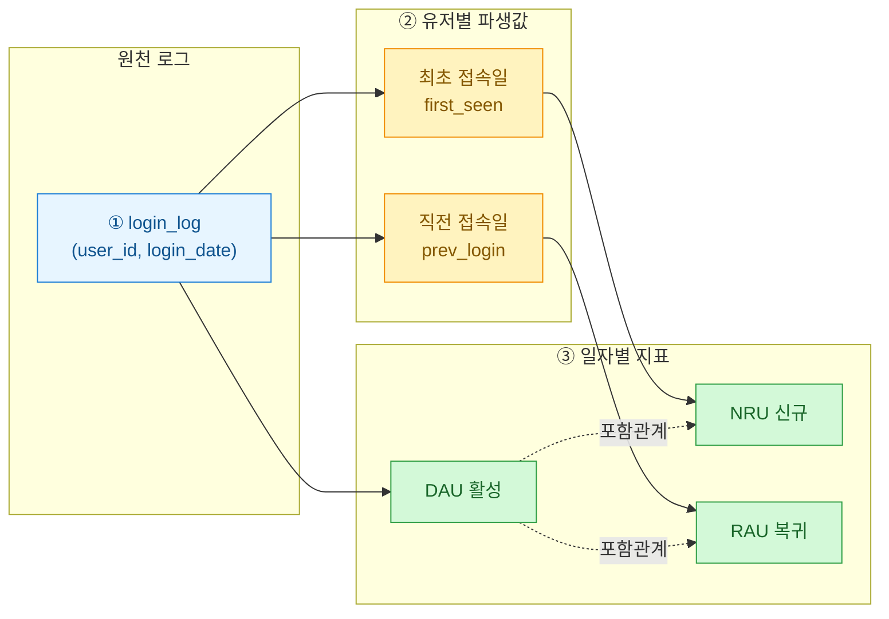
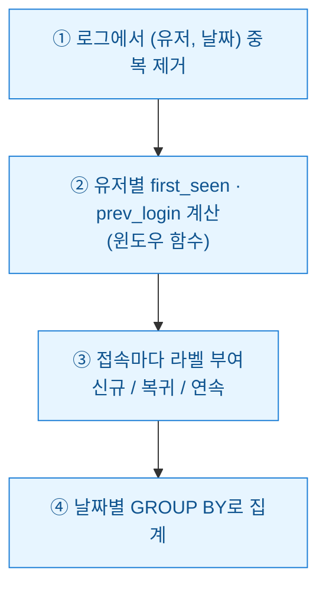

활성 유저 지표는 게임 데이터 분석의 첫 관문이다. 그런데 실무에서 자꾸 사고가 난다. 마케팅팀 대시보드의 DAU와 기획팀 시트의 DAU가 다르다. 왜? 정의가 코드마다 흩어져 있기 때문이다. 오늘은 **신규(NRU)**, **복귀(RAU)**, **활성(DAU/MAU)**을 한 쿼리에서 같은 기준으로 뽑는 레시피를 정리한다. 나 자신에게 남기는 메모이기도 하다 — 다음에 또 헷갈릴 테니까.

> 이 글의 모든 숫자·로그는 공개·더미 데이터 기준이며, 특정 서비스의 실적이나 투자 판단과 무관하다.

## 그래서 각 지표는 무엇이 다른가?

말은 익숙한데 막상 정의를 쓰라면 손이 멈춘다. 표로 고정해두자.

| 지표 | 풀이 | 정의(1일 기준) |
|---|---|---|
| **NRU(New Registered Users)** | 신규 유저 | 그날 처음 접속(=계정 생성)한 유저 수 |
| **RAU(Returning Active Users)** | 복귀 유저 | 이전에 접속 이력이 있고, 일정 기간(예: 7일) 휴면 후 다시 온 유저 |
| **DAU(Daily Active Users)** | 일 활성 | 그날 1회 이상 접속한 순수 유저 수 |
| **MAU(Monthly Active Users)** | 월 활성 | 최근 30일 내 1회 이상 접속한 순수 유저 수 |

핵심은 이거다. DAU 안에는 **신규(NRU)**도 있고 **복귀(RAU)**도 있고 **꾸준히 오는 유저**도 섞여 있다. 즉 `DAU = NRU + RAU + 기존 연속 접속`으로 쪼갤 수 있다는 뜻. 이 관계를 그림으로 먼저 잡자.



## 왜 유저별 '최초·직전 접속일'부터 계산하나?

지표를 정확히 나누려면 각 접속이 그 유저에게 **첫 접속인지, 오랜만의 복귀인지, 어제도 온 연속인지**를 알아야 한다. 이건 윈도우 함수 두 개로 끝난다.

- **최초 접속일(first_seen)**: `MIN(login_date) OVER (PARTITION BY user_id)` → 오늘이 최초 접속일과 같으면 NRU.
- **직전 접속일(prev_login)**: `LAG(login_date) OVER (...)` → 오늘과 직전 접속의 간격이 임계값(예 7일) 이상이면 RAU.

이 두 파생값을 먼저 만들고, 그 위에 지표를 얹는 것이 핵심 순서다.



## 한 쿼리로 어떻게 짜나? (합성 데이터)

아래는 순수 표준 SQL이다. `login_log`는 (유저, 접속일) 형태의 더미 로그라고 보면 된다. 휴면 기준은 7일로 뒀다.

```sql
WITH dedup AS (           -- ① 하루 여러 번 접속해도 1건으로
  SELECT DISTINCT user_id, login_date
  FROM login_log
),
flagged AS (              -- ② 유저별 최초·직전 접속일 파생
  SELECT
    user_id,
    login_date,
    MIN(login_date) OVER (PARTITION BY user_id)                     AS first_seen,
    LAG(login_date)  OVER (PARTITION BY user_id ORDER BY login_date) AS prev_login
  FROM dedup
),
labeled AS (              -- ③ 접속마다 라벨
  SELECT
    login_date,
    user_id,
    CASE WHEN login_date = first_seen THEN 1 ELSE 0 END AS is_new,
    CASE
      WHEN login_date <> first_seen
       AND (prev_login IS NULL OR login_date - prev_login >= 7)
      THEN 1 ELSE 0
    END AS is_return
  FROM flagged
)
SELECT                    -- ④ 날짜별 집계
  login_date,
  COUNT(DISTINCT user_id)                         AS dau,
  SUM(is_new)                                     AS nru,
  SUM(is_return)                                  AS rau
FROM labeled
GROUP BY login_date
ORDER BY login_date;
```

MAU는 같은 `dedup`에서 롤링 30일로 얹으면 된다. 날짜 축을 하나 만들고 30일 창을 세는 방식.

```sql
SELECT
  d.the_date,
  COUNT(DISTINCT l.user_id) AS mau
FROM calendar d
JOIN dedup l
  ON l.login_date BETWEEN d.the_date - 29 AND d.the_date
GROUP BY d.the_date;
```

## 자주 밟는 지뢰는 무엇인가?

내가 실제로 당해본 것들만 추린다.

| 함정 | 증상 | 처방 |
|---|---|---|
| dedup 생략 | 하루 3번 접속한 유저가 DAU 3으로 부풀려짐 | `DISTINCT (user_id, date)` 먼저 |
| 복귀 기준 미합의 | 팀마다 "복귀"가 1일/7일/30일 제각각 | 임계값을 상수 하나로 문서화 |
| 신규를 복귀에 중복 계상 | NRU+RAU가 DAU를 초과 | `login_date <> first_seen` 조건 필수 |
| 타임존 | 자정 경계 접속이 어제/오늘로 갈림 | 집계 전 로컬 타임존으로 통일 |

지표를 한 쿼리로 묶는 진짜 이유는 성능이 아니라 **정의의 단일화**다. NRU·RAU·DAU가 같은 `labeled` 테이블에서 나오면, 정의를 바꿔도 한 곳만 고치면 되고 팀 사이 숫자가 어긋날 일이 없다. 대시보드가 3개든 5개든 진실은 이 쿼리 하나. 그게 데이터 분석가가 밤에 발 뻗고 자는 방법이다.
