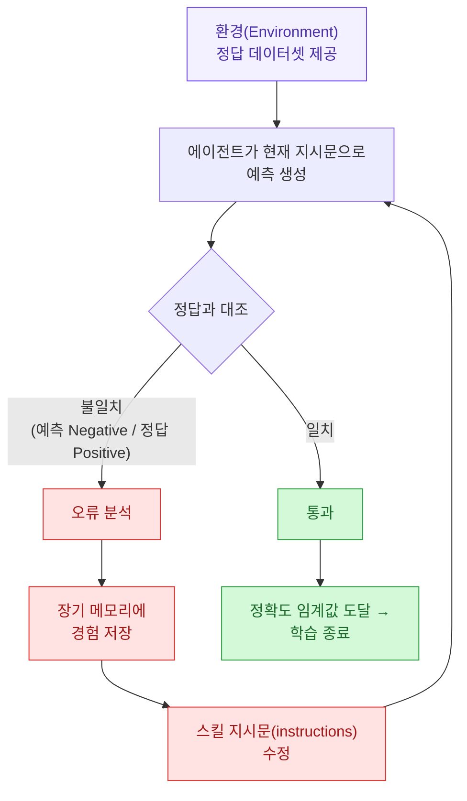
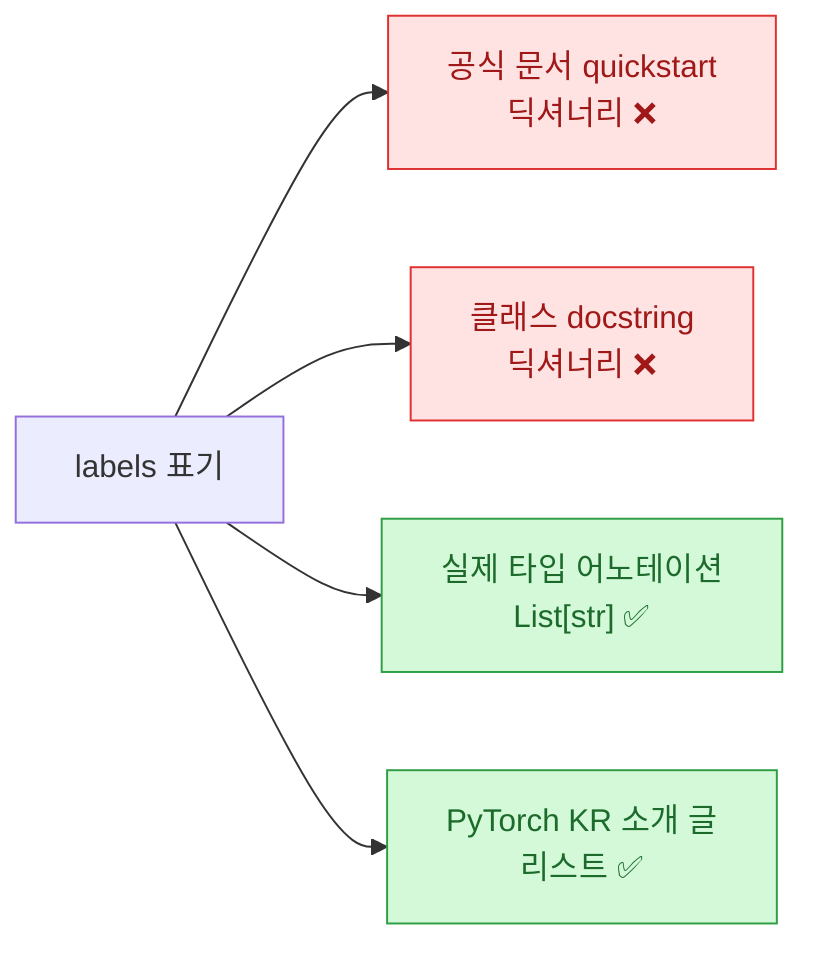

[PyTorch 한국 사용자 모임](https://discuss.pytorch.kr/t/adala/11224)에서 소개된 **Adala**를 열어 봤다. **A**utonomous **DA**ta (**LA**beling) Agent — 이름 그대로 자율 데이터 라벨링 에이전트 프레임워크다([HumanSignal/Adala](https://github.com/HumanSignal/Adala), Apache-2.0).

먼저 맥락 하나. **만든 곳이 HumanSignal이다.** 데이터 라벨링 도구 **Label Studio**를 만든 회사다. 라벨링으로 먹고사는 회사가 "라벨링을 에이전트가 알아서 하게 만들자"를 내놓은 거라, 장난 삼아 만든 물건은 아니다.

아이디어는 확실히 좋았다. 그런데 **문서를 그대로 따라 하면 십중팔구 막힌다.** 그래서 이 글은 절반이 소개고 절반이 정정이다.

## 핵심 아이디어는 뭔가?

라벨링 자동화라고 하면 보통 "LLM한테 분류시키기"를 떠올린다. Adala의 차별점은 그 다음이다. **정답 데이터를 기준으로 에이전트가 자기 프롬프트를 스스로 고친다.**



용어가 셋인데 단순하다.

| 용어 | 뜻 |
|---|---|
| **환경(Environment)** | 정답 데이터셋. 에이전트가 자기 예측을 채점받는 기준 |
| **스킬(Skill)** | 분류·요약·번역 같은 작업 단위. 여기 **지시문(instructions)**이 들어 있고, 이게 학습으로 바뀌는 대상 |
| **런타임(Runtime)** | 스킬이 실행되는 공간. 문서 표현으로는 **LLM과 같은 말** |

그래서 코드가 이렇게 생겼다.

```python
agent.learn(learning_iterations=3, accuracy_threshold=0.95)
predictions = agent.run(test_df)
```

`learn()`이 정확도가 임계값에 닿을 때까지 지시문을 고치고, `run()`이 그 지시문으로 새 데이터를 처리한다.

**내가 이걸 흥미롭게 본 이유는 따로 있다.** 이건 프롬프트 엔지니어링을 사람 손에서 떼어내 **평가 가능한 루프**로 바꾼 것이다. 우리가 프롬프트를 고치는 과정을 생각해 보면 결국 같다. 돌려 보고, 틀린 걸 보고, 왜 틀렸나 생각하고, 프롬프트를 고친다. Adala는 그 루프에서 사람을 빼고 **정답 데이터를 심판으로 앉혔다.** 심판이 있으니 "이 프롬프트가 더 낫다"는 말이 취향이 아니라 숫자가 된다.

릴리스 노트를 보니 이 알고리즘에 이름도 있었다. 0.0.4에서 [PE2 방법](https://arxiv.org/abs/2311.05661)을 도입했고, GSM-8k 벤치마크에서 zero-shot 대비 **20% 개선**을 보였다고 한다. ⚠️ 자체 벤치마크 주장이라 그대로 믿을 건 아니고, 참고로만.

## 그런데 문서를 그대로 따라 하면 왜 막히나?

여기가 이 글의 본론이다. 소개 글과 공식 문서와 **실제 저장소 코드가 삼자 불일치**다. GitHub API와 소스를 직접 열어 2026년 7월 15일 기준으로 대조했다.

### ⚠️ 하나 — `pip install adala`는 2년 8개월 전 버전을 준다

이게 제일 크다.

| 항목 | 확인값 |
|---|---|
| 최신 **릴리스** 태그 | **0.0.4** |
| 그 릴리스 **발행일** | **2023-11-30** |
| master의 `pyproject.toml` version | **`0.0.4dev`** |
| master **마지막 푸시** | **2026-07-10** |

읽고 나서 두 번 봤다. **릴리스는 2023년 11월에 멈췄는데 저장소는 지금도 활발하다.** 즉 `pip install adala`로 받는 건 약 **2년 8개월 전 코드**고, GitHub master는 그 사이 한참 갔다.

소개 글이 "최신 변경 사항을 바로 쓰려면 GitHub에서 직접 설치할 수 있고"라고 지나가듯 적은 게, 사실은 **선택이 아니라 거의 필수**라는 뜻이다.

### ⚠️ 둘 — Python 3.8·3.9는 설치가 안 된다

소개 글과 문서 모두 **"Python 3.8부터 3.11까지 지원"**이라고 적혀 있다. 그런데 master의 `pyproject.toml`은 이렇다.

```toml
requires-python = ">=3.10,<4"
```

**3.10 이상이다.** 3.8·3.9는 애초에 설치가 안 되고, 반대로 상한도 3.11이 아니라 4 미만이다. 문서 표기가 양쪽으로 다 틀렸다. 3.8에서 pip이 뱉는 에러를 보고 한참 헤맬 만한 대목이다.

### ⚠️ 셋 — `labels`가 리스트냐 딕셔너리냐

붙여 놓고 보면 바로 보인다.

```python
# PyTorch KR 소개 글
labels=["Positive", "Negative", "Neutral"]

# 공식 문서 quickstart
labels={'sentiment': ["Positive", "Negative", "Neutral"]}
```

둘이 다르다. 그래서 실제 소스를 열었다.

```python
class ClassificationSkill(TransformSkill):
    name: str = "classification"
    instructions: str = "Classify input text."
    labels: Optional[List[str]] = None   # ← 리스트다
```

**현재 master 기준으로는 리스트가 맞다.** 즉 **소개 글이 맞고 공식 문서 quickstart가 틀렸다.** 아마 그 문서 페이지가 0.0.4 시절에 멈춰 있어서일 거다(문서 사이트 사이드바에도 버전이 0.0.4로 찍혀 있다).

그런데 더 웃긴 걸 발견했다. **같은 파일의 클래스 docstring이 자기 타입 어노테이션과 모순된다.**

> ClassificationSkill(output_template="{my_output}", labels={"my_output": ["label_1", "label_2", "label_3"]})

docstring은 딕셔너리 예시를 보여주는데, 바로 아래 필드 선언은 `Optional[List[str]]`이다. **문서가 아니라 코드 안에서 이미 어긋나 있다.** 리팩터링하면서 docstring을 안 고친 흔적으로 보인다.

정리하면 이렇다.



⚠️ 단 이건 **master 기준**이다. `pip install adala`로 받은 0.0.4를 쓴다면 딕셔너리 형태가 맞을 수 있다. **어느 쪽을 설치했는지에 따라 정답이 갈린다**는 게 진짜 함정이다.

### ⚠️ 넷 — 이건 이제 "노트북 라이브러리"가 아니다

소개 글은 "데이터 과학자가 파이썬 노트북에서 대용량 데이터프레임을 전처리·후처리"하는 용도로 소개한다. 그런데 `pyproject.toml`의 의존성 목록을 보면 그림이 전혀 다르다.

```toml
"redis-om",
"fastapi",
"celery[redis] (>=5.3.6,<6.0.0)",
"uvicorn",
"aiokafka (>=0.11.0,<0.12.0)",
"label-studio-sdk @ https://github.com/HumanSignal/label-studio-sdk/archive/...",
"litellm (>=1.83.7,<2.0.0)",
"instructor (>=1.14.5, <2.0.0)",
```

**FastAPI·Celery·Redis·Kafka·uvicorn.** 이건 노트북 라이브러리 의존성이 아니라 **서버와 워커를 굴리는 시스템**의 의존성이다. 주석에도 대놓고 "these are for the server"라고 적혀 있다. 게다가 `label-studio-sdk`가 박혀 있다.

내 해석은 이렇다. **Adala는 오픈소스 노트북 실험 도구로 출발했다가, HumanSignal 내부에서 Label Studio에 붙는 라벨링 백엔드로 무게중심이 옮겨갔다.** 릴리스가 2023년에 멈춘 것과 master가 계속 도는 게 모순처럼 보였는데, 이걸 보니 앞뒤가 맞는다. **PyPI에 올릴 독립 제품이 아니라 사내 시스템의 일부로 굴러가고 있는 것에 가깝다.**

나쁘다는 게 아니다. 다만 "노트북에서 가볍게 써 보세요"를 기대하고 들어가면 `pip install adala` 한 줄이 Celery와 Kafka를 끌고 온다. 알고 들어가는 것과 모르고 들어가는 건 다르다.

### ✅ 다섯 — 소개 글이 놓친 좋은 소식

반대로 소개 글보다 실제가 나은 대목도 있다. 소개 글은 Claude나 Gemini를 쓰려면 "OpenRouter를 통해 런타임의 `base_url`과 `model`을 지정하는 방식"이라고 안내한다. 그런데 런타임 모듈을 열어 보면 이렇다.

```python
from ._openai import OpenAIChatRuntime, AsyncOpenAIChatRuntime, AsyncOpenAIVisionRuntime
from ._litellm import (
    LiteLLMChatRuntime,
    AsyncLiteLLMChatRuntime,
    AsyncLiteLLMVisionRuntime,
)
```

**LiteLLM 런타임이 내장돼 있다.** LiteLLM은 100개 넘는 LLM 공급자를 하나의 인터페이스로 감싸는 라이브러리다. 즉 OpenRouter를 경유해 `base_url`을 손으로 맞추는 우회 없이, **`LiteLLMChatRuntime`으로 Claude·Gemini를 바로 붙일 수 있다.** 비전 런타임과 비동기 런타임도 같이 있다. 소개 글이 이걸 놓쳤다.

## 그래서 지금 쓸 만한가?

정리하면 이렇다.

**좋은 점** — 정답 데이터를 심판으로 세워 프롬프트를 자동 튜닝한다는 발상이 명확하다. 라벨링 도구 회사가 만들어서 문제 정의가 현실적이다. Apache-2.0이라 뜯어 쓰기 좋고, LiteLLM 내장으로 모델 선택이 자유롭다. 스킬을 학생/교사 런타임으로 나눠 **싼 모델로 예측하고 비싼 모델로 채점**하는 구성이 가능한 것도 실용적이다.

**감안할 점** — 릴리스가 2023년 11월에 멈췄다. 문서가 여러 군데 코드와 어긋난다(Python 버전, `labels` 형태). 이슈가 **168개** 열려 있다. 의존성이 서버 스택까지 끌고 온다. `guidance`는 `0.0.64`에 고정돼 있는데, 이건 꽤 오래된 핀이다.

**내 결론** — **아이디어를 가져오되 프레임워크를 통째로 얹진 않겠다.** 나한테 값나가는 조각은 딱 하나다.

> **프롬프트를 고칠 때 심판을 사람이 아니라 정답 데이터로 세운다.**

나는 [[ai-llm-it-news-2026-07-15|어제오늘 계속]] 에이전트 평가 얘기를 보고 있는데, 결국 같은 자리로 모인다. 루프를 돌리려면 채점자가 있어야 하고, 채점자가 취향이면 루프가 수렴하지 않는다. Adala가 잘한 건 **채점자를 데이터로 못 박은 것**이고, 그건 프레임워크 없이도 흉내 낼 수 있다. 정답 세트 몇십 개 만들어 두고, 프롬프트 고칠 때마다 돌려서 정확도를 비교하면 그게 이미 `learn()`의 축소판이다.

## 써 보려면

⚠️ **위 정정을 반영한 설치법**은 이렇다.

```
# Python 3.10 이상인지 먼저 확인 (3.8·3.9는 설치 실패)
python --version

# pip 최신판은 2023-11에 멈춘 0.0.4 → 최신을 원하면 master에서
pip install git+https://github.com/HumanSignal/Adala.git
```

기본 런타임으로 OpenAI를 쓰면 키를 넣는다.

```
export OPENAI_API_KEY='your-openai-api-key'
```

그리고 코드는 **어느 쪽을 설치했는지에 따라 `labels` 형태를 맞춰야 한다.** master면 리스트, 0.0.4면 딕셔너리일 가능성이 높다. 안 되면 반대쪽을 넣어 보는 게 빠르다. 각 스킬 예제는 저장소 `examples/` 디렉토리에 Colab 노트북으로 있다.

기본 제공 스킬은 분류(일반/사고 사슬), 요약, 질의응답, 번역, 텍스트 생성, 스킬 순차 연결(스킬 세트), 온톨로지 추론 정도다.

---

*출처: [PyTorch 한국 사용자 모임 소개 글](https://discuss.pytorch.kr/t/adala/11224) · 저장소 [HumanSignal/Adala](https://github.com/HumanSignal/Adala)(Apache-2.0). 스타 1,612 · 포크 154 · 열린 이슈 168 · 저장소 생성 2023-08-30 · 마지막 푸시 2026-07-10 · 최신 릴리스 0.0.4(2023-11-30) — 전부 2026-07-15 기준 GitHub API로 직접 확인했다. `pyproject.toml`·`adala/skills/collection/classification.py`·`adala/runtimes/__init__.py` 원문 대조로 소개 글·공식 문서와 다른 대목은 ⚠️로 표시했다.*
