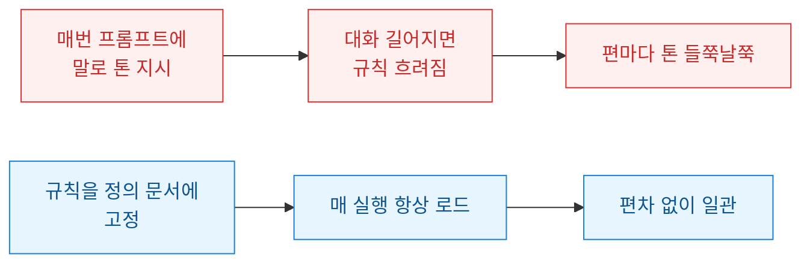
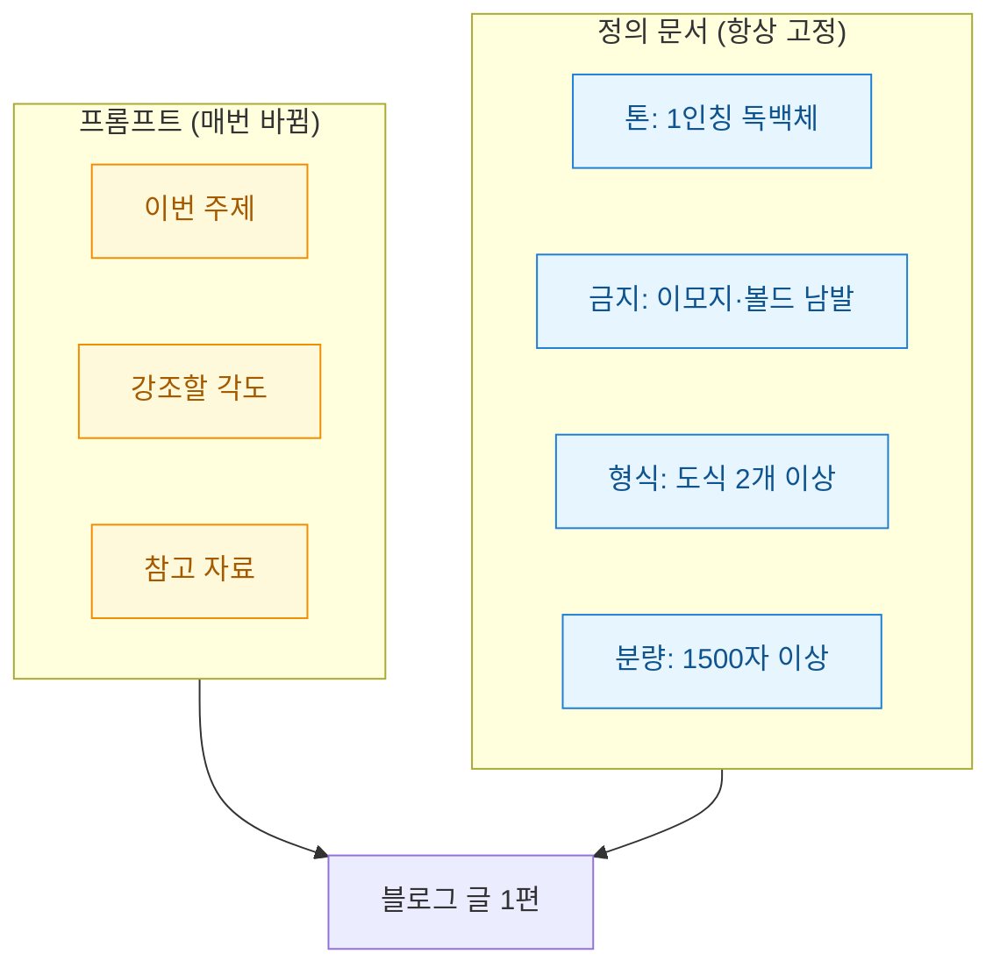
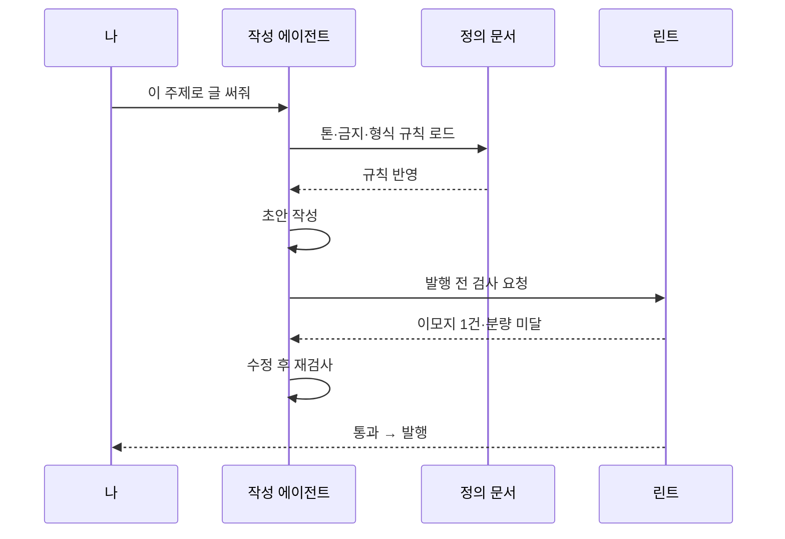

블로그 글을 쓰는 에이전트를 만든 지 몇 달이 지났다. 처음엔 매번 프롬프트(에이전트에게 주는 지시문)에 "구어체로 써줘, 이모지 쓰지 마, 볼드 남발하지 마" 같은 요구를 길게 붙였다. 그런데 세 편을 연달아 뽑아보니 이상했다. 첫 편은 얌전한데 두 번째 편엔 어느새 이모지가 다섯 개 붙어 있고, 세 번째 편은 한 문단이 통째로 볼드였다. 분명 같은 지시를 줬는데.

원인은 단순했다. 문체 규칙을 매번 프롬프트에 "말로" 실어 보냈던 것이다. 대화가 길어지면 초반 지시는 흐려지고, 급한 요구("이 주제로 빨리 써줘")가 앞으로 오면서 톤 규칙은 뒤로 밀린다. 규칙이 휘발성 메모리에 있으니 매번 새로 리마인드해야 했다. 그래서 방향을 바꿨다. 문체를 프롬프트가 아니라 에이전트 정의 문서(agent definition, 에이전트의 정체성과 규칙을 고정해두는 별도 파일)에 박아 넣기로 했다.



## 왜 프롬프트에 톤을 실으면 안 됐나?

프롬프트는 그때그때의 요청이다. 에이전트 정의 문서는 그 에이전트가 존재하는 한 항상 붙어 다니는 헌법 같은 것이다. 이 둘을 헷갈리면 안 된다. "이 주제로 써줘"는 프롬프트에, "우리 블로그는 이런 톤이다"는 정의 문서에 있어야 한다.

정의 문서에 넣으면 좋은 점이 명확했다. 매 실행마다 같은 규칙이 로드되니 편차가 사라진다. 규칙을 고칠 일이 생겨도 한 곳만 고치면 모든 글에 반영된다. 무엇보다 프롬프트가 짧아진다. 톤 잔소리를 뺀 자리에 정작 중요한 "이번 글의 주제와 각도"를 담을 수 있다.



## 금지 규칙은 어떻게 써야 안 새나?

여기서 두 번째 삽질을 했다. "이모지 쓰지 마"라고만 적으면 에이전트는 헤드라인엔 안 쓰다가 목록 앞에 슬쩍 붙인다. 금지는 추상적으로 쓰면 반드시 예외를 파고든다. 그래서 금지 항목마다 나쁜 예와 좋은 예를 한 쌍씩 붙였다. 규칙을 "설명"하지 말고 "보여주는" 것이다.

```markdown
## 금지 표현 (예시 포함)

### 이모지 금지
- 나쁨: "이게 진짜 핵심이에요 ✨🚀"
- 좋음: "이게 진짜 핵심이다."
- 예외 없음. 헤드라인·목록·강조 어디에도 금지.

### 볼드 남발 금지
- 나쁨: 한 문장에서 '정의 문서', '톤', '고정', '편차'까지 안 중요한 단어에 죄다 볼드를 걸기 — 강조가 넷이면 강조가 없는 것과 같다
- 좋음: "정의 문서에 톤을 고정하면 편차가 준다"
- 볼드는 문단당 1회 이하. 진짜 핵심 한 개만.

### 연결어미 뒤 쉼표 최소화
- 나쁨: "고정했고, 편해졌지만, 아쉬웠다"
- 좋음: "고정했더니 편해졌다. 다만 아쉬운 점도 있었다"
```

핵심은 판정 기준을 숫자로 못박은 것이다. "볼드 남발하지 마"는 사람마다 기준이 다르지만 "문단당 1회 이하"는 에이전트가 스스로 셀 수 있다. 글자수 제약도 마찬가지다. "너무 짧지 않게"가 아니라 "1500자 이상 3000자 이하"라고 적으니 그때부터 어긋나지 않았다.

## 규칙이 지켜졌는지 어떻게 확인하나?

규칙서를 아무리 잘 써도 지켰는지 눈으로 매번 검사할 순 없다. 그래서 발행 직전에 자동 검사(lint, 규칙 위반을 기계적으로 걸러내는 절차)를 한 단계 끼웠다. 정의 문서의 금지 규칙 중 기계가 셀 수 있는 것들만 골라 간단한 스크립트로 만들었다.

```python
import re

def check_style(text: str) -> list[str]:
    warnings = []
    # 이모지 탐지 (기본 범위)
    if re.search(r'[\U0001F300-\U0001FAFF☀-➿]', text):
        warnings.append("이모지 발견")
    # 볼드 개수: 문단당 1회 초과 경고
    for i, para in enumerate(text.split("\n\n")):
        if para.count("**") > 2:   # ** 한 쌍 = 볼드 1개
            warnings.append(f"{i}번째 문단 볼드 과다")
    # 글자수
    n = len(text)
    if not (1500 <= n <= 3000):
        warnings.append(f"분량 이탈: {n}자")
    return warnings
```

이 검사를 붙이고 나서야 규칙서가 진짜로 작동하기 시작했다. 정의 문서는 에이전트에게 "이렇게 써라"라고 가르치고, 린트는 발행 직전에 "정말 그렇게 썼나"를 되묻는다. 가르침과 확인이 짝을 이루니 편차가 눈에 띄게 줄었다.



## 무엇을 배웠나

가장 크게 배운 건 톤은 지시가 아니라 자산이라는 점이다. 매번 말로 부탁하면 매번 조금씩 달라진다. 문서로 고정하면 그때부터 브랜드가 된다. 프롬프트에는 오직 이번 글의 알맹이만 담고, 변하지 않아야 할 것은 전부 정의 문서로 내려보냈더니 관리가 훨씬 편해졌다.

다음엔 이 정의 문서를 여러 채널용으로 분기해볼 생각이다. 블로그는 독백체, 짧은 소셜 글은 더 건조하게. 뿌리 규칙은 공유하되 채널별 문체 파일만 갈아 끼우는 구조다. 문체를 코드처럼 버전 관리하기 시작하니 에이전트가 점점 내 글투를 닮아간다. 사람에게 문체를 가르치는 일과 크게 다르지 않았다. 다만 이쪽은 잊어버리지 않는다는 게 다를 뿐이다.
