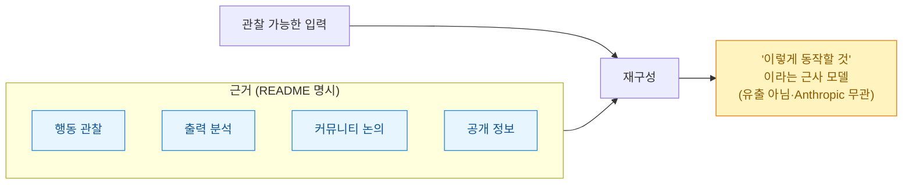
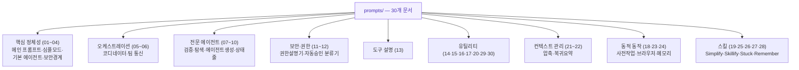
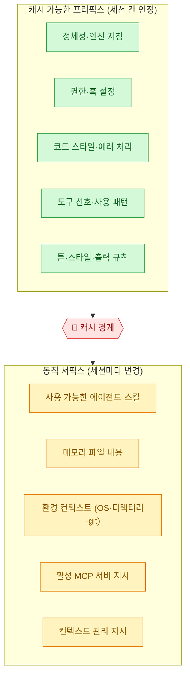
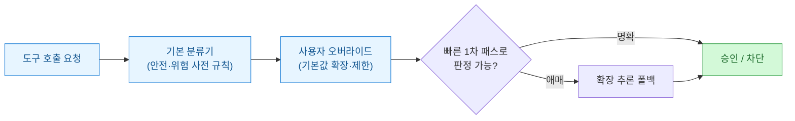
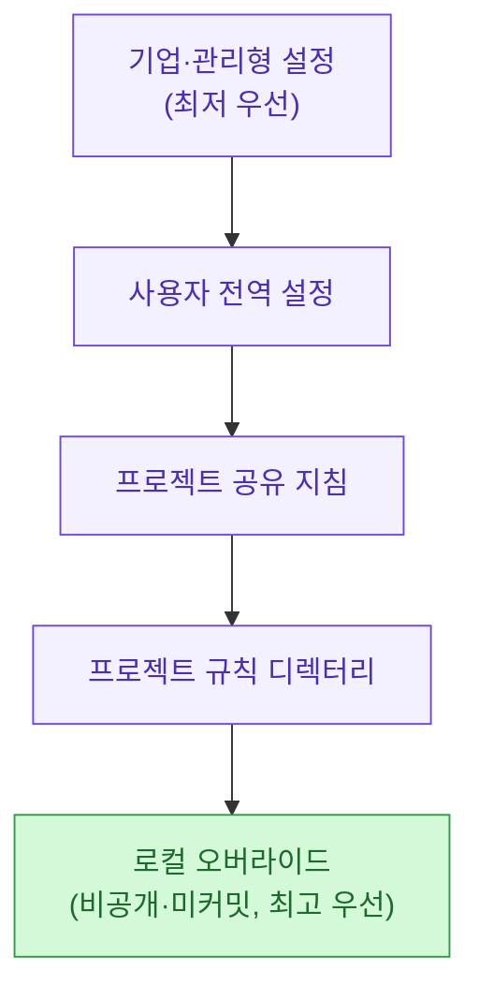
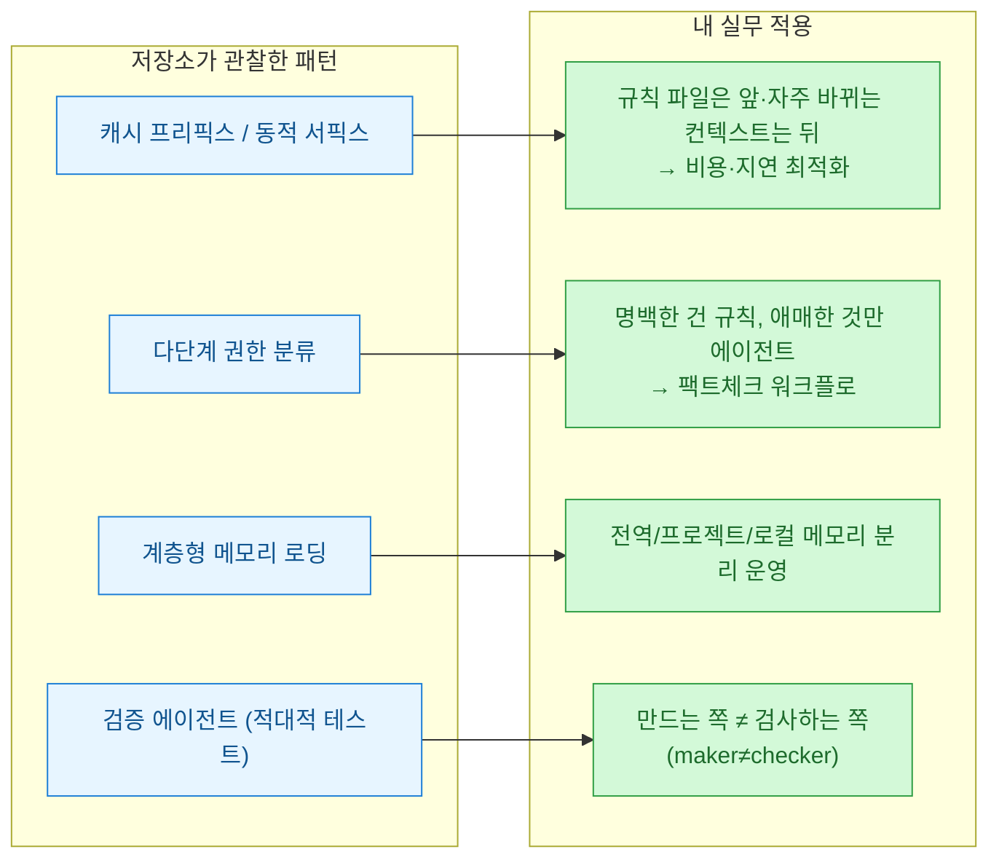

PyTorch KR 피드에서 제목 하나가 눈에 걸렸다 — "에이전트형 AI 코딩 도구의 프롬프트 구조를 재구성한 연구". 순간 '또 시스템 프롬프트 유출인가' 싶었는데, 저장소를 직접 열어 보니 그런 게 아니었다. **유출이 아니라 "겉으로 드러난 행동만 보고 역설계한 근사치"**를 표방하는 연구 저장소였다. 흥미로워서 [GitHub 원본](https://github.com/Leonxlnx/agentic-ai-prompt-research)을 1차 출처로 뜯어보고, 커뮤니티 요약과 어긋나는 부분까지 확인했다.

기준일은 **2026년 7월 3일 KST**. 저장소 메타데이터·README·`prompts/` 디렉터리를 직접 조회해 적는다.

## 이게 '유출'이야, 아니면 '재구성'이야?

가장 먼저 성격을 못박아야 한다. 이 저장소는 스스로를 아주 분명하게 규정한다. README 원문을 그대로 옮기면 이렇다.

> "여기 있는 것은 전부 **행동 관찰·출력 분석·커뮤니티 논의·공개 정보**에 기반한다. **재구성된 근사치이지 원문 그대로의 사본이 아니다.**"
>
> "이것은 **유출도, 덤프도, 어떤 독점 시스템의 직접 사본도 아니다.** ... 이 프로젝트는 **Anthropic과 제휴·보증·연결 관계가 없다.**"

즉, "클로드 코드의 진짜 시스템 프롬프트"가 아니라 **"이렇게 동작할 것"이라는 하나의 해석**으로 읽어야 하는 자료다. 이 전제를 받아들이면 오히려 마음이 편하다 — 정답을 훔쳐본 게 아니라, **관찰 가능한 행동으로부터 아키텍처를 추론하는 연습**이기 때문이다.

## 저장소는 실제로 뭘 담고 있나?

직접 조회해 보니 구조는 단순했다. 루트에 `README.md` 하나, 그리고 `prompts/` 디렉터리 안에 **01번부터 30번까지 번호가 매겨진 마크다운 문서 30개**가 들어 있다. 재밌는 디테일 하나 — 저장소 이름은 `agentic-ai-prompt-research`인데 **README 내부 제목은 "Claude Code System Prompts"**이고, 첫 문서 `01_main_system_prompt.md`가 약 23KB로 압도적으로 크다(나머지는 대부분 1~10KB).

README는 이 30개를 주제별 섹션으로 묶는데, 여기서 **커뮤니티 요약과 실제가 갈린다**. PyTorch KR 소개글은 "6개 영역"으로 정리했지만, 실제 README의 소제목을 세어 보면 **9개**다.

## 가장 쓸모 있는 관찰 세 가지

저장소가 뉴스로 잠깐 스치기 아까운 이유는, 재구성이 맞든 아니든 **아키텍처 관찰 자체가 공부거리**여서다. 세 가지가 특히 그랬다.

### ① 시스템 프롬프트는 한 덩어리가 아니라 '캐시 경계'로 나뉜다

가장 핵심 관찰. 시스템 프롬프트가 통짜 텍스트가 아니라 **모듈 빌더들의 파이프라인**으로 조립되고, 그 중간에 **캐시 경계**가 있다는 분석이다. 자주 안 바뀌는 것(정체성·안전·코드 스타일)을 앞에 몰아 두면 프롬프트 캐시가 세션 간 재사용되고, 매번 바뀌는 것(메모리·환경·MCP)은 경계 뒤로 간다.

이건 단순 정리가 아니라 **비용·성능과 직결**된다. 프롬프트 캐시가 먹히면 같은 프리픽스를 매번 다시 계산하지 않으니 토큰 비용과 지연이 준다. "무엇을 앞에 두고 무엇을 뒤에 둘 것인가"가 곧 돈 문제인 셈이다.

### ② 도구 자동 승인은 '빠른 1차 패스 → 애매하면 확장 추론'

자율 모드에서 도구 호출을 자동 승인하는 부분은 **다단계 분류기**로 관찰됐다. 미리 정한 안전/위험 규칙을 가진 기본 분류기 위에 사용자 오버라이드가 얹히고, **대부분은 빠른 1차 패스로 판정하되 모호한 경우에만 확장 추론으로 넘긴다**는 것이다.

"싼 판정을 먼저, 비싼 추론은 필요할 때만"이라는 이 패턴은 내가 뉴스 팩트체크 워크플로에서 쓰는 방식과도 똑같다 — 명백한 건 규칙으로 걸러내고, 애매한 것만 에이전트를 붙인다.

### ③ 메모리는 우선순위가 다른 계층이 쌓인다

메모리 로딩은 **우선순위 계층**으로 관찰됐다. 가장 낮은 기업/관리형 설정부터 시작해 전역 → 프로젝트 공유 → 프로젝트 규칙 → 커밋 안 되는 로컬 오버라이드 순으로 뒤로 갈수록 우선한다. 파일 간 전이적 포함과 경로 기반 조건부 주입도 지원한다는 관찰이다.

## 이거, 그대로 믿어도 돼?

내 원칙은 하나다 — **재구성이든 뉴스든, 옮기기 전에 1차 출처로 확인한다.** 이번에 걸러낸 것들을 표로 남긴다.

| 떠도는 설명 | 1차 출처 확인 결과 |
|---|---|
| "6개 영역으로 분류" | README 실제 소제목은 **9개**(핵심정체성·오케스트레이션·전문에이전트·보안권한·도구설명·유틸리티·컨텍스트관리·동적동작·스킬). 커뮤니티 글이 6개로 재묶음 |
| "새로 나온 연구" | 저장소 생성일은 **2026-03-31**(약 3개월 전). 6/26 PyTorch KR에 재소환된 것이지 신규가 아님 |
| (별점 언급 없음) | 실제 **⭐2,471 · 포크 1,067**. 포크/별점 비율 약 43%로 **이례적으로 높음**(프롬프트 모음 저장소 특유의 대량 복제 성향) |
| (라이선스 언급 없음) | **LICENSE 파일 없음** → 기본값은 '모든 권리 보유'라 상업적 재사용·재배포는 **법적 회색지대**. 학습·참고 목적으로만 |
| "클로드 코드 시스템 프롬프트" | 저장소 스스로 **"근사치·유출 아님·Anthropic 무관"**이라 반복 명시. 사실로 단정하면 안 되는 **해석** |

정리하면, **제품(저장소)이 가짜인 게 아니라, 옮기는 과정에서 "근사치"라는 꼬리표가 떨어져 나가기 쉽다.** 이 자료의 올바른 사용법은 "정답 컨닝"이 아니라 "아키텍처 스케치를 참고해 내 것을 설계하기"다.

## 이게 내 워크플로랑 왜 겹치나?

읽는 내내 묘했던 건, 저 재구성이 **내가 지금 이 글을 쓰는 데 쓴 도구의 동작과 겹친다**는 점이었다. 캐시 가능한 프리픽스, 계층형 메모리, 다단계 권한 분류 — 전부 내가 매일 마주치는 개념이다.

특히 마지막 **검증 에이전트(07번, 적대적 테스트)**는 내가 [하네스·루프 정리](https://dbhyeong.github.io/blog/)에서 계속 강조해 온 "**만드는 쪽과 검사하는 쪽을 분리하라**"와 정확히 같은 이야기다. 재구성이 원본과 얼마나 일치하는지는 알 수 없지만, **좋은 에이전트 시스템이 수렴하는 설계 원리**가 이 저장소에도, 내 워크플로에도 똑같이 나타난다는 건 그 자체로 신호다.

## 마무리

역설계 저장소를 읽는 올바른 자세는 두 가지다. 하나, **"근사치"라는 꼬리표를 절대 떼지 말 것**(이건 유출이 아니다). 둘, 그럼에도 **아키텍처 스케치로서의 가치는 인정할 것** — 캐시 경계, 다단계 권한, 계층 메모리는 내 도구를 더 싸고 안전하게 굴리는 데 그대로 참고가 된다. 나는 이걸 "정답지"가 아니라 "잘 그린 추론도"로 책장에 꽂아 뒀다.

## 참고자료

- [GitHub — Leonxlnx/agentic-ai-prompt-research](https://github.com/Leonxlnx/agentic-ai-prompt-research) (⭐2,471 · 포크 1,067 · 생성 2026-03-31, 확인 2026-07-03)
- [PyTorch KR — agentic-ai-prompt-research 소개글 (9bow/박정환, 2026-06-26)](https://discuss.pytorch.kr/t/agentic-ai-prompt-research-ai/10728)

<!-- 안전: 회사 실데이터·고객/제3자 PII·API키/쿠키/토큰 없음. 공개 저장소(GitHub) 분석 기반 + 1차 출처 팩트체크. 저장소 자체가 '재구성 근사치·유출 아님·Anthropic 무관'을 명시하므로 원문 확정 표현을 피함. -->
