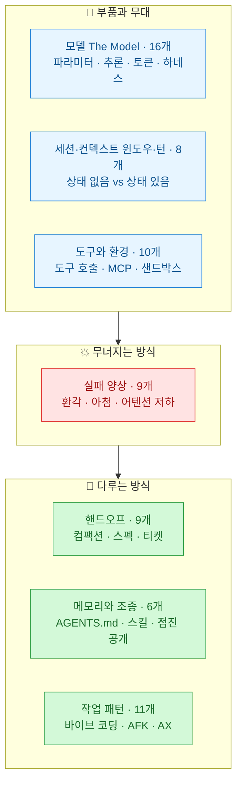
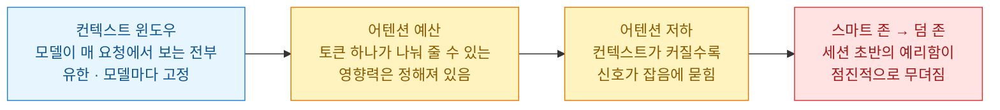

[파이토치 한국 사용자 모임에 박정환 님이 올린 소개글](https://discuss.pytorch.kr/t/ai-coding-dictionary-ai/10751)에서 이 사전을 발견했다. 지난번 [[openknowledge-local-markdown-llm-wiki-editor|OpenKnowledge]]도 같은 분의 소개로 만났으니, 내 글감 스트림에서 지분이 상당한 분이다.

**AI Coding Dictionary**. AI 코딩에서 쓰이는 용어를 쉬운 말로 풀어 쓴 사전이다. 저자의 전제가 도발적이다 — **"기본 용어는 하루면 익힐 수 있고, 한번 익히고 나면 전체가 더 이상 추측처럼 느껴지지 않는다."**

솔직히 용어 사전이라길래 기대가 낮았다. 그런데 항목 몇 개를 읽다가 자세를 고쳐 앉았다. 이건 단어 뜻풀이가 아니라 **내가 올해 밟은 사고들의 해설서**였다. 왜 긴 세션에서 에이전트가 점점 멍청해지는지, 왜 컴팩션 뒤에 디테일이 사라지는지, 왜 같은 프롬프트가 어제와 오늘 다르게 동작하는지 — 전부 이름이 있었다.

## 이 사전은 뭐고 누가 만들었나?

만든 사람은 **Matt Pocock**. TypeScript 쪽에 있어 본 사람이라면 Total TypeScript로 아는 그 사람이다. 타입 시스템이라는 어려운 걸 쉬운 말로 가르치는 걸로 먹고살던 사람이 이번엔 AI 코딩 용어에 같은 일을 했다.

레포를 직접 실측했다. 소개글 수치를 그대로 받아 적지 않는 게 이 블로그의 규칙이라서.

| 항목 | 실측값 (2026-07-17, GitHub API) |
|---|---|
| 레포 | [mattpocock/dictionary-of-ai-coding](https://github.com/mattpocock/dictionary-of-ai-coding) |
| 스타 | **2,817** (생성 2026-05-01 → 두 달 반 만) |
| 포크 | 341 |
| 항목 수 | **69개 용어, 7개 섹션** ([웹 버전](https://www.aihero.dev/ai-coding-dictionary) 기준) |
| 구조 | `dictionary/*.md` 원본 → `npm run generate`로 README 자동 생성 |
| 라이선스 | ⚠️ **없음** (뒤에서 다룬다) |

일곱 개 섹션은 흐름이 있다. 모델이라는 부품에서 시작해, 그 부품이 세션 안에서 어떻게 지쳐 가는지, 그걸 어떻게 다루는지로 이어진다.

항목끼리 하이퍼링크로 엮여 있어서 하나를 읽다 보면 연관 용어로 흘러가게 돼 있다. 위키 링크로 볼트를 엮어 온 입장에서는 익숙한 설계다. **사전인데 그래프처럼 읽힌다.**

## 왜 긴 세션에서 에이전트가 멍청해지나?

이 사전이 제일 공들인 대목이고, 내가 제일 오래 머문 대목이다. 나는 이 현상을 매일 겪는다. 세션 초반엔 예리하던 에이전트가 오후쯤 되면 아까 말한 걸 다시 묻고, 지시를 반쯤 흘린다. 나는 그걸 "지쳤다"고 표현해 왔는데, 저자는 그 인과를 세 단계로 쪼개 놨다.

핵심 문장은 이거다 — **"10k 토큰에서 가장 또렷하던 지시가 150k 토큰에서는 배경 소음이 된다."** 토큰 N개짜리 컨텍스트에는 토큰 쌍이 대략 N²개 생기는데, 토큰 하나가 뿌릴 수 있는 영향력(어텐션 예산)은 컨텍스트가 커져도 늘지 않는다. 그러니 **모델이 무언가를 잊는 게 아니다. 신호가 잡음 속에 묻히는 것이다.**

이 구분이 왜 중요하냐면, 대처가 달라지기 때문이다. "잊었다"고 진단하면 같은 말을 반복하게 된다(잡음을 더 붓는 셈이다). "묻혔다"고 진단하면 컨텍스트를 덜어내게 된다. 사전의 처방도 후자다 — 컨텍스트 윈도우를 "메모리"가 아니라 **작업용 상태**로 보고, **예산처럼** 다루라는 것. 필요한 것만 올리고 나머지는 빼라.

## 컴팩션이 '의도된 손실'이라는 게 무슨 뜻인가?

두 번째로 오래 머문 항목. 사전은 컴팩션(compaction. 이전 세션 기록을 요약해 새 세션의 출발점으로 삼는 것)을 이렇게 정의한다 — **"원본 기록이라는 1차 자료를 요약이라는 2차 자료로 바꾸는, 의도된 손실."**

1차 자료와 2차 자료. 이 사전에서 이 단어 쌍을 만날 줄은 몰랐다. 코드가 1차 자료면 문서는 2차 자료고, 트랜스크립트가 1차 자료면 요약은 2차 자료다. 2차 자료는 컨텍스트에 싸게 올라가는 대신 **한 발 떨어져 있다.**

이건 정확히 내 팩트체크 원칙의 코딩 버전이다. 나는 뉴스 다이제스트를 쓸 때 집계 사이트가 아니라 원문(IR·보도자료·리포트)을 열어 확인하는데, 이유가 같다 — 요약을 믿으면 요약자의 오류를 상속받는다. [[chatgpt-source-selection-network-traffic-geo|지난번 GEO 글]]에서 원문 하단의 후속편 하나를 여는 데 5분이 들었고, 그 5분이 낡은 결론을 퍼뜨리는 걸 막았다. 사전은 같은 원칙을 에이전트 컨텍스트 설계에 적용한다. **요약(2차)으로 싸게 가되, 중요한 판단은 원본(1차)으로 되돌아갈 경로를 남겨 둬라.** 컴팩션이 나쁜 게 아니라, 그게 손실이라는 걸 알고 쓰는 게 중요하다는 얘기다.

## 바이브 코딩의 정의가 왜 뼈아픈가?

사전은 바이브 코딩을 느슨한 유행어가 아니라 꽤 엄밀하게 정의한다 — **"사람의 코드 리뷰 없이 에이전트의 코드를 받아들이는 작업 패턴. diff를 불투명한 것으로 취급하고, 안에 뭐가 있는지가 아니라 프로그램이 어떻게 동작하는지만 본다."** (Andrej Karpathy가 2025년 초에 만든 표현이라는 계보까지 달아 뒀다.)

이 정의가 뼈아픈 건, 이 기준으로 보면 **나도 diff를 안 읽기 때문이다.** [[every-four-predictions-2026-midyear-scorecard|오늘 같이 쓴 Every 예측 채점 글]]에서 나는 스스로를 '에이전틱 엔지니어' 칸에 넣었는데, 사전의 분류축을 대면 그 칸과 바이브 코딩의 차이는 한 가지뿐이다. **검증을 다른 데서 하느냐다.** 그 "다른 데"에도 이름이 붙어 있다 — 자동화된 체크(테스트·린트·타입·빌드), 자동화된 리뷰(다른 에이전트의 리뷰), 그리고 사람의 리뷰. diff를 안 읽는 것 자체는 죄가 아니다. **검증이 아무 데도 없는 게 죄다.**

덤으로, 환경을 에이전트가 일하기 좋게 갖추는 정도를 **AX(agent experience)**라고 부른다는 것도 배웠다. DX(개발자 경험)의 에이전트판이다. 이 단어를 얻고 나니 내가 볼트에 해 온 투자를 다시 보게 된다 — 라우팅 인덱스, 전 파일 FTS 색인, 메모리 파일, 스킬 정리. 나는 그걸 "정리"라고 불렀는데, 사실은 **AX 투자**였다. 에이전트가 볼트에서 길을 잃지 않게 만드는 비용이었고, 그 비용은 매 세션 회수되고 있다.

## 내 용어부터 교정했다

읽으면서 내가 그동안 뭉개 쓰던 말들을 교정했다. 사전의 취지가 이거니까, 내 것부터.

| 내가 쓰던 말 | 사전의 교정 | 뭐가 달라지나 |
|---|---|---|
| "에이전트가 까먹었다" | 어텐션 저하 — 신호가 묻힌 것 | 반복 대신 컨텍스트 다이어트 |
| "컨텍스트 = 메모리" | 컨텍스트 윈도우 = 작업용 상태 | 쌓는 게 아니라 예산 배분 |
| "AI가 해 줬다" | 모델·하네스·에이전트는 다른 것 | 사고 나면 어느 층 문제인지 특정 가능 |
| "요약해 두면 되지" | 컴팩션 = 의도된 손실 | 1차 자료로 돌아갈 경로를 남김 |
| "정리 좀 해 뒀다" | AX 투자 | 매 세션 회수되는 자산으로 취급 |

셋째 줄이 특히 유용했다. "AI가 이상하다"는 문장은 디버깅이 안 되는데, 모델(파라미터)·하네스(모델을 에이전트로 만드는 껍데기 전부)·에이전트(움직이는 모델)를 나누면 **어느 층에서 사고가 났는지**를 물을 수 있게 된다. 같은 프롬프트가 어제와 오늘 다르게 동작하는 건 모델의 비결정성이지 하네스 버그가 아니고, 도구 호출이 실행이 안 된 건 하네스 문제지 모델 문제가 아니다.

## 라이선스가 없다는 건 무슨 의미인가?

레포를 실측하다 발견한 것 하나. **LICENSE 파일이 없다.** GitHub API 기준 라이선스 필드가 비어 있다(2026-07-17 확인).

오픈소스처럼 보이는 것과 오픈소스인 것은 다르다. 라이선스가 없으면 저작권 기본값이 적용된다 — 읽고 배우는 건 자유지만, **번역해서 재배포하거나 내 문서에 통째로 옮겨 싣는 건 허락의 영역**이다. 기여(PR)는 레포가 열어 둔 경로니 문제없겠지만, 예컨대 "한국어 번역판을 만들어 배포하고 싶다" 같은 계획이 있다면 이슈로 먼저 물어보는 게 맞다. 지난번 [[openknowledge-local-markdown-llm-wiki-editor|OpenKnowledge]] 때 GPL 옆의 CLA 한 줄을 짚었던 것과 같은 맥락이다. **문서의 법적 껍데기는 본문만큼 자주 확인할 가치가 있다.** 별 2,800개짜리 인기 레포도 예외가 아니다.

## 내가 챙긴 것

- **"하루면 익힌다"는 저자 주장은 절반만 맞다.** 어휘 69개를 외우는 건 하루면 된다. 그런데 이 사전의 진짜 값어치는 어휘가 아니라 **인과 모델**이다 — 컨텍스트가 커진다 → 어텐션 예산은 그대로다 → 신호가 묻힌다. 이 사슬을 갖고 나면 처방(덜어내기·컴팩션·핸드오프)이 암기가 아니라 유도가 된다.
- **팀에 에이전트 도구를 퍼뜨릴 때 온보딩 자료로 이만한 게 없다.** "왜 오후만 되면 멍청해져요?"라는 질문에 나는 이제 링크 하나로 답할 수 있다.
- **다음 세션부터 바로 쓰는 것**: 긴 작업은 스마트 존에서 승부 본다. 세션이 덤 존에 들어선 신호(같은 걸 다시 묻기, 지시 흘리기)가 보이면 반복하지 말고 컴팩션하거나 핸드오프한다. 그리고 컴팩션 요약에는 1차 자료(원본 파일·트랜스크립트) 경로를 반드시 남긴다.

원문은 [웹에서 바로 읽을 수 있고](https://www.aihero.dev/ai-coding-dictionary), 원본 마크다운은 [레포의 dictionary/ 디렉토리](https://github.com/mattpocock/dictionary-of-ai-coding)에 있다. 발견 경로였던 [박정환 님의 소개글](https://discuss.pytorch.kr/t/ai-coding-dictionary-ai/10751)도 좋은 요약이다 — 다만 위에서 말했듯, 요약을 읽었으면 원본으로 돌아갈 경로를 남겨 두시라. 이 글의 결론이 그거다.
