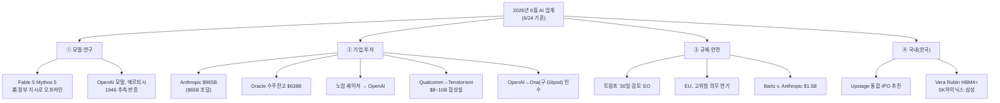
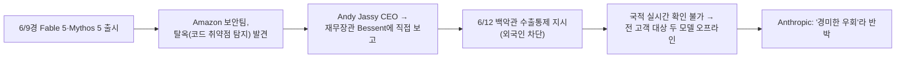
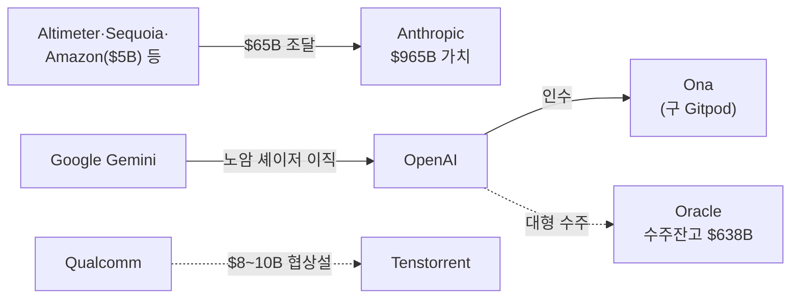
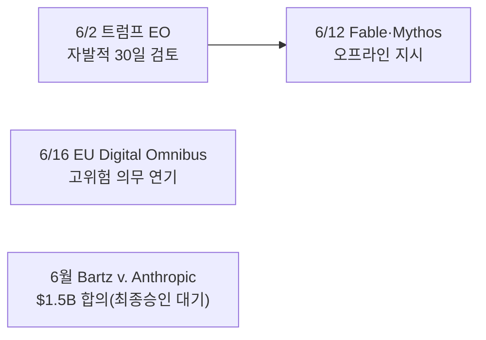

루프 엔지니어링 글을 쓰다가 최근 뉴스를 들여다봤는데, **2026년 6월 한 달이 유난히 굵직했다.** 모델이 정부 지시로 출시 3일 만에 내려가고, 한 AI 랩이 965조 원 밸류로 뛰고, 거대 칩 인수설이 돌고… 그런데 화제가 큰 만큼 **과장·오보도 같이 굴러다녔다.**

그래서 6/24 기준으로 핵심 이슈를 정리하되, 평소 내 습관대로 **각 항목을 1차 출처(공식 발표·여러 매체 교차)로 적대적 팩트체크**하고, 흔히 도는 서술이 틀린 건 ⚠️로 따로 떼어냈다. (빠르게 바뀌는 사안이라 "이 시점의 스냅샷"으로 봐주시길. 투자 권유 아님.)

## 전체 이슈 맵 — 6월에 뭐가 터졌나

> 카테고리 4개로 나눠 짚는다. 각 항목 끝에 **출처**를, 흔한 서술이 틀린 건 그 자리에서 ⚠️로 정정했다.

## ① 모델·연구에서 뭐가 터졌나?

가장 충격적인 건 **모델 하나가 미국 정부 지시로 내려간 사건**이다. 프런티어 AI 배포에 정부가 직접 개입한 첫 선례로 꼽힌다.

**Anthropic Claude Fable 5 / Mythos 5, 출시 3일 만에 오프라인.** 6/9경 Anthropic은 최상위 에이전트 모델 **Fable 5**(안전 분류기 내장)와, 분류기를 뺀 승인 파트너 전용 **Mythos 5**(Project Glasswing용)를 출시했다. 그런데 6/12 미국 정부가 **수출통제 지시**(외국인 접근 차단)를 내렸고, 실시간 국적 확인이 불가능하니 **전 고객 대상으로 두 모델이 내려갔다**(Opus 4.8 등은 정상 운영).

- 스펙(검증됨): 기본 컨텍스트 **100만 토큰**, 요청당 출력 **12.8만 토큰**, 가격 입력 100만 토큰당 **\$10**·출력 **\$50**(Opus 4.8의 약 2배), 30일 데이터 보존.
- ⚠️ **양측 주장이 갈린다.** 백악관(AI 보좌역 데이비드 색스)은 "심각한 결함을 안 고쳤다"는 입장, Anthropic·아모데이는 "이미 알려진 경미한 취약점의 좁은 우회일 뿐, 수억 명이 쓰는 모델을 회수할 일은 아니다"라고 반박. 보고 경로(Amazon→재무장관→백악관)도 익명 관리자 취재 기반이다. 출처: [Fortune](https://fortune.com/2026/06/14/how-a-warning-from-amazon-led-the-white-house-to-shut-down-anthropics-mythos-model/) · [InfoQ](https://www.infoq.com/news/2026/06/claude-5-release/).

**OpenAI 추론 모델, 에르되시의 1946년 추측을 반증.** OpenAI는 내부 추론 모델이 대수적 수체·골로드-샤파레비치 이론·무한 유체탑을 동원해 **평면 단위거리 문제의 상계(upper-bound) 추측을 뒤집는 구성**을 찾았다고 발표, 팀 가워스(필즈상) 등 외부 수학자가 검증·동반 논문(arXiv:2605.20695)을 냈다.

- ⚠️ **"AI가 80년 난제를 풀었다"는 과장이다.** 이건 *상계 추측의 반증*이지 문제의 완전 해결이 아니다(상·하계 격차 여전). 또 자주 인용되는 수치 **δ=0.014는 AI 원증명이 아니라 사람(Will Sawin)의 후속 개선분**이다. 출처: [OpenAI](https://openai.com/index/model-disproves-discrete-geometry-conjecture/) · [Scientific American](https://www.scientificamerican.com/article/ai-just-solved-an-80-year-old-erdos-problem-and-mathematicians-are-amazed/).

## ② 돈은 어디로 흘렀나? (투자·M&A·인재)

6월은 **자본과 인재가 한쪽으로 쏠린** 달이었다. 한 장으로 보면 이렇다.

| 이슈 | 핵심(검증된 수치) | 출처 |
|---|---|---|
| **Anthropic, \$965B 밸류** | 5/28 시리즈 H로 **\$65B 조달**, 사후가치 **약 \$965B**(Amazon \$5B 등 하이퍼스케일러 약 \$15B 포함), 런레이트 매출 ~\$47B. OpenAI(3월 ~\$852B) 추월 | [Al Jazeera](https://www.aljazeera.com/economy/2026/5/29/anthropic-soars-to-965bn-valuation-leapfrogging-openai) |
| **Oracle 수주잔고 \$638B** | FY26 Q4 매출 \$19.2B(+21%), OCI +93%, **수주잔고 \$638B(+363% YoY)**, FY27 순 설비투자 ~\$70B | [Sherwood](https://sherwood.news/tech/oracle-q4-earnings-and-revenue-top-estimates/) |
| **노암 셰이저 → OpenAI** | 트랜스포머 논문 공저자·Gemini 공동 리드가 6/18 OpenAI 합류 발표 | [Axios](https://www.axios.com/2026/06/18/noam-shazeer-google-openai-characterai) |
| **Qualcomm ↔ Tenstorrent** | RISC-V AI칩 스타트업을 **\$8~10B에 인수 협상설** | [Tom's Hardware](https://www.tomshardware.com/tech-industry/artificial-intelligence/qualcomm-mulls-taking-over-jim-kellers-tenstorrent-report-claims-deal-for-ai-chipmaker-would-value-the-company-at-between-usd8-billion-and-usd10-billion) |
| **OpenAI → Ona 인수** | 클라우드 개발환경 Ona(구 Gitpod, ~79명) 인수로 Codex 강화. Codex 주간 사용자 **500만+** | [InfoWorld](https://www.infoworld.com/article/4184648/openai-buys-ona-to-help-rein-in-ai-agents.html) |

- ⚠️ Oracle 수주잔고는 **소수 고객(OpenAI/Stargate)에 쏠려** 있고 인식까지 시간이 걸린다(향후 12개월 인식분 ~12%), FY26 잉여현금흐름은 **-\$23.7B**. 화려한 숫자 뒤의 리스크가 같이 있다.
- ⚠️ Tenstorrent 건은 **단일 출처(The Information)·미확정**이고, 양사 모두 언급 거부. 그리고 흔한 "**짐 켈러가 창업**"은 틀렸다 — 창업자는 **Ljubisa Bajic(2016)**, 짐 켈러는 **CEO**(2023~)다.
- ⚠️ Ona 인수가 "€1억"은 **비공개 추정치 중 하나**일 뿐(IDC 애널리스트는 \$4.5~5억 추정). 그대로 사실처럼 쓰면 안 된다.

## ③ 규제·안전은 어떻게 움직였나?

미국과 EU가 거의 동시에 움직였다. 방향은 정반대였다 — **미국은 (느슨한) 새 감독 틀**, **EU는 기존 규제 완화·연기**.

- **트럼프 행정명령(6/2).** '대상 프런티어 모델'을 출시 전 정부에 **자발적으로 최대 30일** 사전 제공(초안 90일에서 단축), **의무 라이선스·사전허가는 명시적 금지**, NSA 주도 사이버 능력 기밀 벤치마킹. 출처: [The Register](https://www.theregister.com/ai-and-ml/2026/06/02/trump-ai-executive-order-sets-30-day-frontier-model-review/5250322). ⚠️ 비평가들은 정부의 '신뢰 파트너' 선별권이 정치적으로 쓰일 수 있다고 우려.
- **EU 'Digital Omnibus'(6/16).** 유럽의회가 **고위험 의무 시한을 연기**(독립형 Annex III 2026.8.2 → **2027.12.2**, 샌드박스 2027.8.2)하고 AI 생성 CSAM·비동의 영상 금지를 신설. 출처: [Gibson Dunn](https://www.gibsondunn.com/eu-ai-act-omnibus-agreement-postponed-high-risk-deadlines-and-other-key-changes/). ⚠️ 흔히 도는 "**투명성 유예 6→3개월**"은 부정확(실제는 2026.8.2 이전 출시분 **워터마킹 4개월 유예**). 또 의회 **가결**일 뿐, 이사회 정식 채택·관보 게재 전이라 아직 미발효다.
- **Bartz v. Anthropic \$1.5B 저작권 합의.** 약 48만 2천 저작물, 작품당 ~\$3,000. 출처: [Publishing Perspectives](https://publishingperspectives.com/2026/05/anthropic-settlement-appears-to-cruise-through-its-final-fairness-hearing/). ⚠️ "**지급 단계 진입**"은 시기상조다 — 6/24 기준 **최종 승인이 보류** 중이라 지급은 시작되지 않았다. 변호사비 삭감도 "\$3억→\$1.875억"이 아니라 **"\$3.75억→\$1.875억"**(약 50%).
- **(연결) Anthropic 'Project Glasswing' 확대(6/2).** 자율 취약점 탐지 모델 Claude Mythos Preview를 **15개국 150여 조직**(전력·수도·의료 등)으로 확대. 누적 고/심각 취약점 1만+ 식별. 출처: [CyberScoop](https://cyberscoop.com/anthropic-project-glasswing-expansion-critical-infrastructure-claude-mythos/). ⚠️ "이 확대가 6/2 행정명령에 **직접 영향**"이라는 서술은 근거 없음(같은 날이지만 우연). 그리고 이 Mythos 계열이 바로 ①에서 내려간 그 모델군이다.

## ④ 한국(국내)은 어땠나?

국내는 **자국 LLM 챔피언의 IPO 추진**과 **메모리 호재** 두 가지가 컸다.

- **Upstage, 단일 플랫폼 통합 + 생성형 AI IPO 추진(6/16).** Solar(모델)·Timely(업무도구)·Daum(포털)을 'Upstage Company'로 통합. 정부 소버린 AI 5개사 중 하나로, UBS 등과 **IPO 목표가 2~5조 원**. 출처: [KED Global](https://www.kedglobal.com/upcoming-ipos/newsView/ked202605270006). ⚠️ 자주 인용되는 국책펀드 투자액은 "560억"이 아니라 **5,600억 원**(국가성장펀드, 4월 말 승인)이다. 일부 매체의 "총 7,300억 원" 합계는 단일 출처라 중복집계 가능성 → 그대로 인용 주의.
- **Nvidia Vera Rubin HBM4 공급, SK하이닉스·삼성으로.** GTC 타이베이(5/31)에서 젠슨 황이 차세대 **Vera Rubin이 HBM4 기반으로 양산 램프업** 중이라고 발표. 출처: [NVIDIA](https://nvidianews.nvidia.com/news/vera-rubin-full-production-agentic-ai-factory).
  - 🔴 **여기서 도는 "삼성·SK하이닉스·마이크론 3사 모두 인증" 서술은 거짓이다.** Nvidia 공식 보도자료는 **HBM4 공급사를 아예 명시하지 않았고**, 한국 매체·반도체 애널리스트 보도는 **SK하이닉스(~70%)+삼성(~30%), 마이크론은 HBM4 디자인윈 탈락**으로 본다. '3사 인증' 이야기는 TechTimes와 이를 베낀 콘텐츠팜들의 **순환 인용**이었다(존재하지 않는 "블룸버그 기사" 인용 포함). 출고도 '여름/Q3'가 아니라 **올가을** 시작. → 즉 이건 **한국 메모리 2사에게 더 좋은 뉴스**다.

## 정리하며 잡은 과장은? (이번 회차 ⚠️ 팩트체크)

이번에 1차 출처로 대조하며 걸러낸 것들. **화제 기사를 그대로 옮기면 틀리는** 대표 사례다.

| 흔한/화제 서술 | 실제(1차 출처 확인) |
|---|---|
| Nvidia HBM4에 **마이크론도 인증**(3사) | ❌ **마이크론 제외**. Nvidia는 공급사 무명시, 실제 SK하이닉스(~70%)+삼성(~30%). '3사'는 콘텐츠팜 순환인용 |
| Bartz 합의 **'지급 단계 진입'** | ⚠️ 시기상조 — **최종 승인 보류 중**. 변호사비 **\$3.75억→\$1.875억**(흔한 "\$3억" 아님) |
| 셰이저 **'\$27억에 영입'** | ⚠️ \$27억은 2024 **Character.AI 라이선스 거래 총액**(개인 추정 \$7.5~10억), 소속도 DeepMind 아닌 **구글 본사 Gemini** |
| EU **'투명성 유예 6→3개월'** | ⚠️ 실제는 **워터마킹 4개월 유예**(~2026.12.2). 또 의회 **가결**일 뿐 미발효 |
| Tenstorrent **'짐 켈러 창업'** | ⚠️ 창업자 **Ljubisa Bajic(2016)**, 켈러는 **CEO**. 거래도 단일출처·미확정 |
| 에르되시 **'AI가 난제 해결'** | ⚠️ 상계 **추측 반증**이지 완전해결 아님. δ=0.014는 **사람의 후속 개선** |
| Ona 인수가 **€1억** | ⚠️ 비공개. 추정 편차 큼(\$4.5~5억 추정도) |
| Glasswing 확대가 **EO에 직접 영향** | ⚠️ 근거 없음(같은 날이나 우연) |

## 배운 점

이번에도 확인한 건, **"여러 매체가 똑같이 말한다"가 사실의 보증은 아니라는 것**이다. Nvidia HBM4 '3사 인증'처럼, 한 곳(TechTimes)이 쓴 걸 콘텐츠팜들이 서로 베끼면 **검색 결과는 가득 차지만 1차 출처(공식 보도자료)엔 그 말이 없다.** 출처를 한 단계만 거슬러 올라가면 갈린다.

그래서 나는 뉴스도 데이터 다루듯 **"이 숫자/주장의 1차 출처가 어디인가"를 화살표로 거슬러 본다.** 이번 12개도 그 습관으로 걸러서, 컨펌된 건 컨펌, 과장은 ⚠️로 떼어 정리했다.

> 같이 보면 좋은 글: [[loop-engineering-four-loops-loopcraft|루프 엔지니어링 4단계]] · [[loop-vs-harness-vs-ralph-when-to-use|루프·하네스·랄프, 언제 써야 하나]] · [[ai-news-digest-multi-agent-factcheck|다중 에이전트 팩트체크 다이제스트]]

---

*2026-06-24 시점 스냅샷입니다. AI 업계는 빠르게 바뀌므로 이후 사실관계가 달라질 수 있고, 각 항목은 표기한 출처와 여러 매체 교차로 확인했으나 일부는 '보도 기반·미확정' 상태입니다. 특정 종목·기업에 대한 투자 권유가 아닙니다.*
