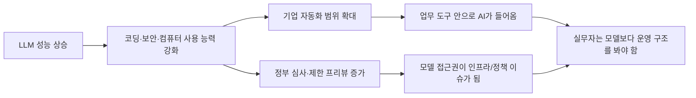
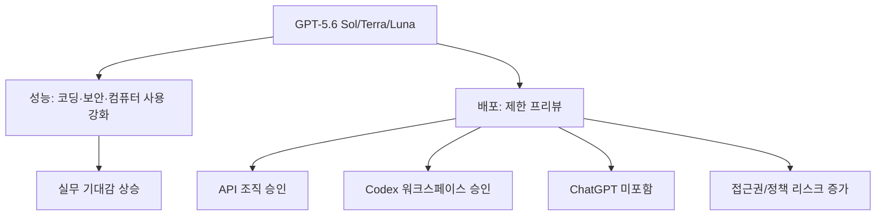
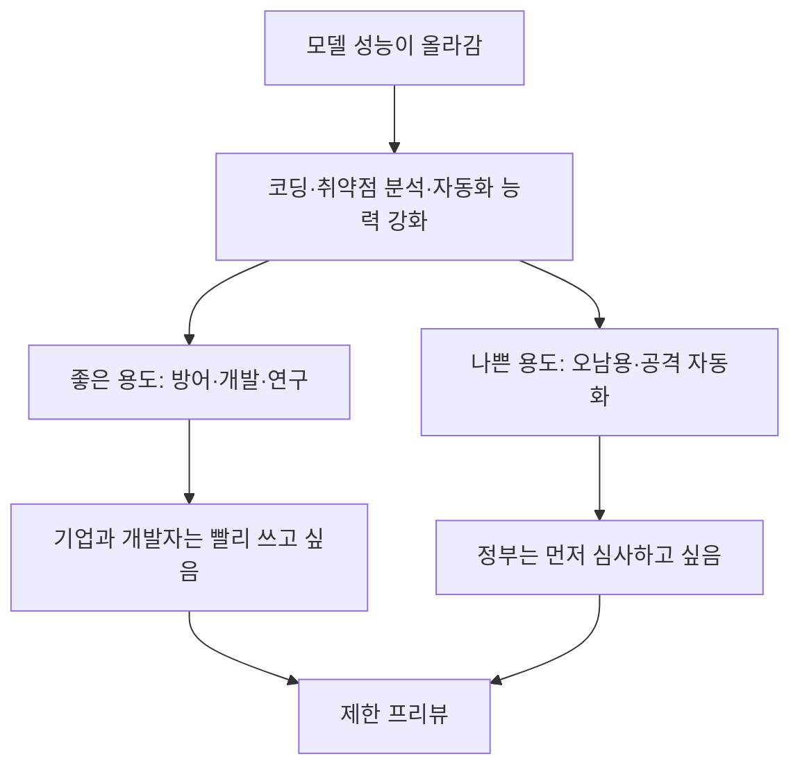
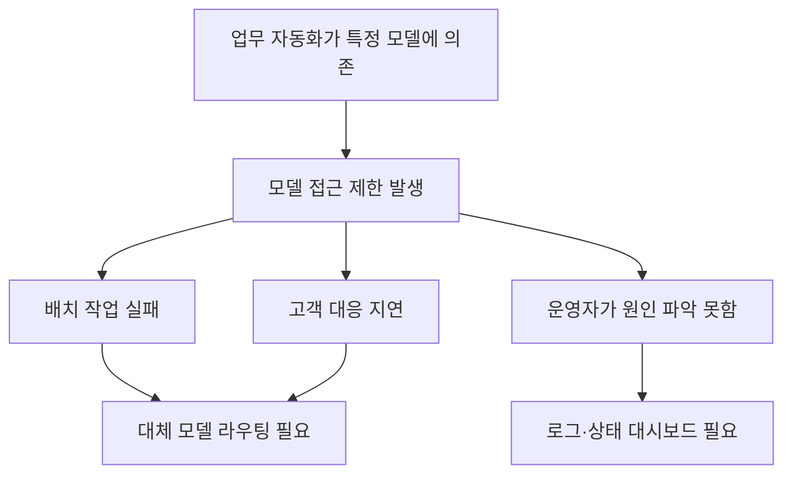
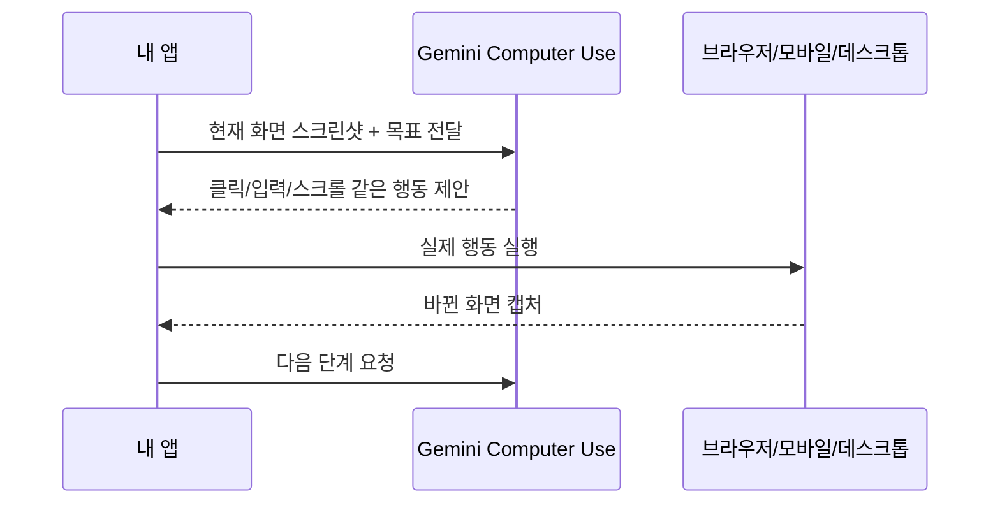
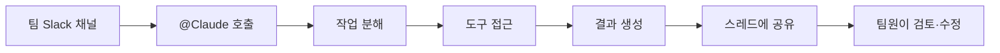
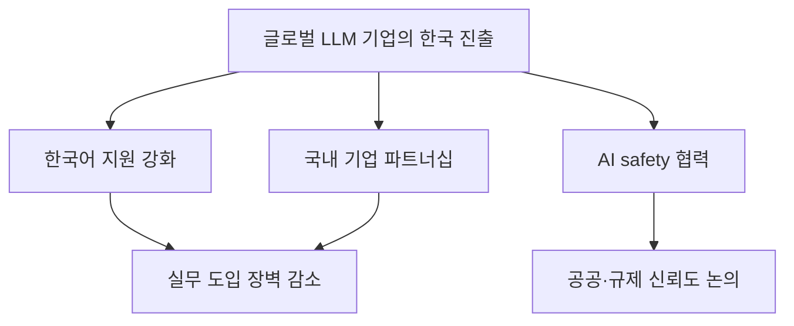
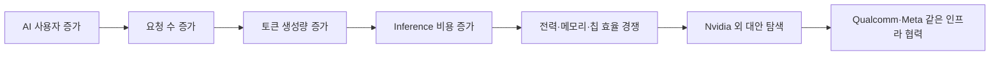
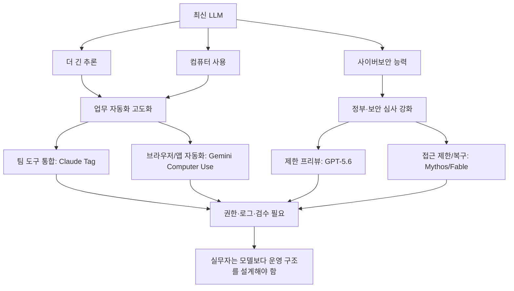

오늘은 블로그 자동화 글을 몇 개 발행하고 나서, 다시 AI 뉴스를 훑어봤다. 그런데 흐름이 꽤 선명했다.

요즘 AI 이슈는 더 이상 "모델이 얼마나 똑똑해졌나" 하나로 끝나지 않는다. 모델은 강해지고, 에이전트는 컴퓨터 화면을 직접 다루고, 기업은 Slack 안에서 AI를 동료처럼 호출한다. 그런데 동시에 정부는 frontier model, 그러니까 **너무 강력해서 사회·안보 리스크까지 같이 봐야 하는 최전선 모델**을 더 조심스럽게 보려고 한다.

확인 기준은 **2026년 6월 28일 KST**다. 오늘 새로 확인한 이슈와 이번 주에 이어진 흐름을 묶어서 정리했다. 모든 사건이 오늘 하루에 처음 발생했다는 뜻은 아니고, 오늘 기준으로 내가 블로그에 남겨둘 만하다고 본 최신 이슈들이다.

## 오늘 한 줄 요약

내가 본 핵심은 이거다.

**AI는 더 쓸모 있어졌고, 그래서 더 제한적으로 배포되기 시작했다.**

예전에는 "새 모델이 나왔으니 써보자"였다. 지금은 "누가 쓸 수 있고, 어느 조직에서 승인받았고, 어떤 환경에서 실행되며, 로그와 권한은 어떻게 통제되는가"까지 같이 봐야 한다.

## 이슈 1. OpenAI GPT-5.6은 강해졌지만, 바로 모두에게 풀리지 않았다

OpenAI는 GPT-5.6 계열을 제한 프리뷰로 공개했다. 이름은 세 가지다.

| 모델 | 내가 이해한 역할 |
|---|---|
| GPT-5.6 Sol | 가장 강한 flagship 모델 |
| GPT-5.6 Terra | 일상 업무와 비용 균형을 맞춘 모델 |
| GPT-5.6 Luna | 빠르고 저렴한 대량 처리용 모델 |

OpenAI 공식 설명을 보면 GPT-5.6은 소프트웨어 엔지니어링, 컴퓨터 사용, 전문 지식 업무, 과학 연구, 사이버보안 쪽을 크게 밀고 있다. 특히 Sol은 코딩과 보안 작업에서 더 긴 추론을 하도록 `max` reasoning effort를 쓰고, 여러 하위 에이전트를 묶는 `ultra` 모드도 소개됐다.

쉽게 말하면, 이제 모델이 "질문에 답하는 도구"에서 "긴 작업을 잡고 여러 단계를 밀어붙이는 실행자" 쪽으로 더 이동하고 있다.

그런데 더 중요한 부분은 접근 방식이다. OpenAI Help Center 기준으로 GPT-5.6 프리뷰는 ChatGPT에 바로 들어오지 않았다. API와 Codex 쪽에서도 소수의 trusted partner와 조직에 제한되어 있고, 공개 신청이나 대기열도 없다. OpenAI는 미국 정부와 조율하면서 일부 승인된 조직부터 시작한다고 설명했다.

내 입장에서 이건 꽤 현실적인 변화다. 내가 [[youtube-api-mp4-srt-thumbnail-shorts-pipeline|YouTube 업로드 파이프라인]]이나 [[naver-blog-smarteditor-rabbitwrite-image-upload-automation|네이버 블로그 자동 발행기]]를 정리할 때도 결국 핵심은 "모델 하나"가 아니었다. 파일, 자막, 썸네일, 메타데이터, 업로드 API, 검증 로그가 모두 이어져야 했다.

GPT-5.6 같은 모델이 더 강해지면 이런 파이프라인을 짜는 속도는 빨라질 수 있다. 하지만 동시에 특정 모델에만 붙어서 자동화 구조를 만들면, 접근 제한이 생겼을 때 전체 워크플로우가 멈출 수 있다.

그래서 나는 이제 모델을 이렇게 봐야 한다고 느낀다.

| 예전 관점 | 지금 관점 |
|---|---|
| 어떤 모델이 제일 똑똑한가 | 어떤 모델을 안정적으로 운영할 수 있는가 |
| 프롬프트만 잘 쓰면 된다 | 권한, 로그, 비용, 대체 모델까지 봐야 한다 |
| 새 모델 나오면 갈아탄다 | 모델 라우팅과 fallback 구조가 필요하다 |

## 이슈 2. 미국 정부의 frontier AI 심사가 본격적인 변수가 됐다

OpenAI의 제한 프리뷰는 단독 사건처럼 보이지만, 배경에는 미국 정부의 frontier AI 관리 흐름이 있다.

White House의 2026년 6월 행정명령은 고급 AI 역량이 국가 안보와 사이버보안에 영향을 준다고 보고, 정부와 민간이 협력해 안전하게 배포하는 방향을 담고 있다. 여기서 중요한 단어는 "frontier model"이다.

frontier model은 쉽게 말하면 **현재 기술의 가장 앞쪽에 있는 초고성능 AI 모델**이다. 일반 챗봇보다 훨씬 강하고, 코딩·보안·과학·자동화 작업에서 실제 영향력이 커질 수 있는 모델을 가리킨다고 보면 된다.

이 흐름은 개발자에게 불편할 수 있다. 갑자기 모델이 열렸다가 닫히고, 특정 국가나 조직만 접근 가능해지고, 계약·승인·워크스페이스 단위로 권한이 갈릴 수 있기 때문이다.

하지만 반대로 말하면, AI가 이제 장난감이 아니라 인프라가 됐다는 뜻이기도 하다. 클라우드, GPU, 검색엔진, 결제망처럼 사회 기반 기술이 되면 정책이 붙는다. AI도 그 단계로 넘어가는 중이다.

내 자동화 글을 기준으로 보면 여기서 배울 점은 분명하다.

| 체크포인트 | 왜 중요한가 |
|---|---|
| 모델 공급자 한 곳에만 의존하지 않기 | 제한 프리뷰나 정책 변경 때 멈추지 않기 위해 |
| 입력/출력 로그를 남기기 | 문제가 생겼을 때 어떤 모델이 무엇을 했는지 추적하기 위해 |
| 사람 검수 단계를 유지하기 | 에이전트가 강해질수록 마지막 판단은 더 중요해짐 |
| 민감 작업에는 별도 권한을 두기 | 보안·계정·업로드 자동화는 실수 비용이 크기 때문 |

## 이슈 3. Anthropic Mythos/Fable 이슈는 "모델 접근권도 리스크"라는 걸 보여줬다

Anthropic은 6월 12일 미국 정부 지시에 따라 Fable 5와 Mythos 5 접근을 중단한다고 밝혔다. 이후 6월 27일 보도에서는 Mythos 5가 일부 미국 중요 인프라 조직에 다시 제한적으로 제공될 수 있게 됐다고 전해졌다.

이 흐름에서 내가 보는 핵심은 성능 경쟁이 아니다. 핵심은 **AI 모델 접근권이 갑자기 바뀔 수 있다**는 점이다.

예를 들어 어떤 회사가 내부 업무 자동화를 특정 최신 모델 하나에 깊게 묶어 두었다고 해보자. 그런데 그 모델이 정부 지시, 제공사 정책, 국가별 제한, 계약 조건 때문에 갑자기 막히면 어떻게 될까.

내가 [[naver-clip-creator-studio-direct-upload-pipeline|네이버 클립 자동 업로드 파이프라인]]을 정리하면서 계속 강조한 것도 이 부분이었다. 업로드 자동화는 파일을 올리는 것만 보면 안 된다. 중간에 VOD 토큰, 업로드 세션, draft, 썸네일, 인코딩 상태, 최종 저장, 검증 로그가 이어진다.

LLM 자동화도 같다. 모델 호출 하나만 보면 안 된다.

모델 호출 앞뒤에는 항상 이런 것이 있다.

| 구간 | 봐야 할 것 |
|---|---|
| 입력 전 | 어떤 데이터가 들어가는가 |
| 모델 호출 | 어떤 모델, 어떤 권한, 어떤 비용인가 |
| 출력 후 | 사람이 검수할 수 있는 구조인가 |
| 실패 시 | 대체 모델이나 재시도 전략이 있는가 |
| 기록 | 나중에 원인을 찾을 수 있는가 |

## 이슈 4. Google Gemini Computer Use는 에이전트 자동화의 주류화를 보여준다

Google은 Gemini API release notes에서 2026년 6월 24일 Gemini 3.5 Flash에 Computer Use public preview를 추가했다고 밝혔다.

Computer Use는 말 그대로 AI가 화면을 보고 클릭·스크롤·입력 같은 행동을 제안하게 하는 기능이다. Google 문서 기준으로 브라우저, 모바일, 데스크톱 환경을 지원하고, prompt injection 탐지와 configurable safety policy도 함께 언급된다.

어렵게 말하면 "멀티모달 UI 에이전트"인데, 쉽게 말하면 이렇다.

**AI가 스크린샷을 보고, 다음에 어디를 클릭할지 말해주는 구조다.**

여기서 중요한 점은 AI가 직접 내 컴퓨터를 마음대로 조종하는 게 아니라는 점이다. 문서에서도 클라이언트 쪽 실행 환경이 필요하다고 한다. 즉, 모델은 "이렇게 해보라"는 행동을 내놓고, 실제 클릭은 우리가 만든 앱이 수행한다.

이 구조는 내가 지금까지 해온 브라우저 자동화와 아주 가깝다. 다만 차이가 있다.

| 기존 자동화 | Computer Use형 자동화 |
|---|---|
| CSS selector, API endpoint를 찾아서 고정 | 화면을 보고 다음 행동을 판단 |
| UI가 바뀌면 잘 깨짐 | 화면 인식으로 어느 정도 버팀 |
| 예측 가능성이 높음 | 판단형이라 검증과 제한이 더 중요 |
| 개발자가 모든 단계를 설계 | 모델이 중간 판단을 일부 맡음 |

결국 미래 자동화는 둘을 섞게 될 것 같다. 안정적인 곳은 API로 직접 치고, UI가 자주 바뀌거나 사람이 보던 화면을 따라가야 하는 곳은 Computer Use 계열이 맡는다.

다만 Google도 preview 기능에는 오류와 보안 취약점이 있을 수 있다고 안내한다. 그래서 민감 데이터, 결제, 삭제, 계정 설정 변경 같은 작업은 사람이 확인하는 게 맞다.

## 이슈 5. Claude Tag는 AI가 "개인 비서"에서 "팀 채널 동료"로 이동하는 흐름이다

Anthropic은 Claude Tag를 소개했다. Slack에서 `@Claude`를 태그하면 Claude가 작업을 단계로 쪼개고, 결과를 스레드에 남기는 방식이다. Anthropic은 내부 제품팀 코드의 상당 부분이 내부 버전 Claude Tag로 만들어지고 있다고 설명했다.

나는 이 흐름이 꽤 중요하다고 본다. 지금까지 AI는 대체로 개인 채팅창 안에 있었다. 내가 질문하고, 내가 답을 받고, 내가 옮겨 붙였다.

Claude Tag형 구조는 다르다.

이건 AI가 개인 생산성 도구를 넘어 팀 업무 흐름 안으로 들어간다는 뜻이다.

예를 들어 개발팀에서는 이렇게 쓸 수 있다.

| 상황 | Claude Tag식 요청 |
|---|---|
| 버그 원인 파악 | 이 에러 로그와 최근 PR을 보고 원인 후보를 정리해줘 |
| 지표 분석 | 지난주 전환율 하락 구간을 찾아줘 |
| 고객 지원 | 이 티켓들을 유형별로 묶고 답변 초안을 만들어줘 |
| 코드 리뷰 | 이번 변경에서 위험한 부분만 먼저 짚어줘 |

하지만 팀 채널 AI는 권한 관리가 더 중요하다. 개인 채팅보다 더 많은 사람이 보고, 더 많은 도구에 연결될 가능성이 높기 때문이다. 누가 Claude를 호출할 수 있는지, Claude가 어떤 저장소와 문서에 접근할 수 있는지, 결과를 어디에 남기는지까지 정책이 필요하다.

## 이슈 6. Anthropic 서울 오피스와 한국 AI 생태계

Anthropic은 6월 17일 서울 오피스 개소와 한국 AI 생태계 파트너십을 발표했다. 한국 과학기술정보통신부와 AI safety 관련 MOU를 맺었다는 내용도 포함되어 있다.

이건 국내 입장에서 꽤 직접적인 이슈다. 한국은 단순한 사용자 시장이 아니라, 개발자·스타트업·대기업·공공 AI 안전 논의가 같이 움직이는 시장으로 인정받고 있다는 뜻에 가깝다.

내가 흥미롭게 보는 지점은 두 가지다.

첫째, 한국어 AI 안전 평가가 더 중요해진다. 영어 기준으로 안전한 모델이 한국어에서도 같은 방식으로 안전하다고 단정하기 어렵다. 한국어의 뉘앙스, 은어, 업무 문맥, 법률·의료·금융 표현은 따로 봐야 한다.

둘째, 한국 기업의 AI 도입이 더 빨라질 가능성이 있다. 서울 오피스, 파트너십, 엔터프라이즈 지원이 붙으면 "써보고 싶다"에서 "조직에 도입하자"로 넘어가기 쉬워진다.

한국에서 AI 자동화 블로그를 쓰는 입장에서는 이게 남의 일이 아니다. 네이버 블로그, 네이버 클립, YouTube, GitHub Pages, Codex, Claude Code를 엮어 쓰는 흐름은 결국 한국어 콘텐츠 생산·검수·배포 자동화와 연결된다.

## 이슈 7. Qualcomm·Meta 흐름은 AI 전쟁이 모델에서 인프라로 내려갔다는 신호다

이번 주 IT 쪽에서 눈에 띄는 흐름은 Qualcomm과 Meta의 데이터센터 CPU 협력이다. Qualcomm은 Dragonfly C1000 CPU, AI300 inference accelerator, HBC 같은 데이터센터 로드맵을 발표했고, Meta는 Dragonfly C1000을 차세대 서버 fleet에 쓰는 다년 협력을 발표했다.

여기서 inference는 **이미 학습된 AI 모델을 실제로 실행해서 답을 만드는 과정**이다. 학습이 "공부"라면 inference는 "실제로 답안지를 쓰는 시간"이라고 보면 된다.

요즘 AI 비용에서 inference가 점점 커진다. 이유는 간단하다. 모델을 한 번 학습하는 것도 비싸지만, 사용자가 매일 수십억 번 요청하면 답변을 생성하는 비용이 계속 쌓인다.

모델 뉴스만 보면 OpenAI, Anthropic, Google이 주인공처럼 보인다. 하지만 실제 서비스 운영에서는 칩, 전력, 메모리, 데이터센터, 네트워크가 병목이 된다.

그래서 이제 AI 경쟁은 세 층으로 봐야 한다.

| 층 | 경쟁 포인트 |
|---|---|
| 모델 | 더 똑똑한 추론, 더 강한 코딩, 더 좋은 멀티모달 |
| 제품 | Slack, IDE, 브라우저, 업무툴 안으로 들어가기 |
| 인프라 | 더 싸고 빠르게 토큰을 생성하기 |

이 세 층 중 하나만 강해서는 오래 가기 어렵다. 좋은 모델도 너무 비싸면 대량 서비스가 어렵고, 좋은 칩도 개발자가 쓰기 어려우면 확산이 느리다.

## 오늘 이슈들을 묶으면 보이는 구조

오늘 확인한 이슈들을 하나로 묶으면 이렇게 보인다.

나는 이 그림이 오늘의 결론이라고 본다.

AI가 강해질수록 "프롬프트 잘 쓰기"만으로는 부족해진다. 이제는 운영 구조를 봐야 한다. 어떤 모델을 쓰는지, 실패하면 어디로 넘기는지, 자동으로 실행해도 되는 작업과 사람이 확인해야 하는 작업을 어떻게 나누는지, 로그를 어떻게 남기는지가 중요해진다.

## 내 워크플로우에 적용한다면

내가 지금 만들고 있는 자동화 흐름에 바로 적용하면 이렇게 된다.

| 작업 | 오늘 이슈에서 얻은 적용점 |
|---|---|
| 블로그 글 자동 발행 | 모델이 만든 원고를 바로 발행하지 않고 구조화·검수·빌드 확인을 둔다 |
| YouTube/쇼츠 업로드 | 제목·설명·타임라인·썸네일을 모델이 만들되 최종 업로드 전 체크리스트를 둔다 |
| 네이버 자동화 | 브라우저 세션, 쿠키, 업로드 상태를 로그로 남기고 민감값은 공개하지 않는다 |
| LLM 모델 선택 | OpenAI·Anthropic·Google 중 하나에만 묶지 않고 대체 경로를 둔다 |
| 에이전트 자동화 | Computer Use형 기능은 preview로 보고, 민감 작업에는 사람 확인을 둔다 |

즉, AI 자동화의 목표는 "사람을 빼는 것"이 아니다.

반복되는 조립과 변환은 AI와 스크립트가 맡고, 사람은 방향·검수·최종 판단에 집중하는 쪽이 맞다.

## 오늘의 결론

2026년 6월 28일 기준으로 AI·LLM·IT 이슈를 정리하면, 한 문장으로는 이렇게 남기고 싶다.

**AI는 이제 더 똑똑한 모델 경쟁에서, 접근권·보안·업무 도구·인프라까지 묶인 운영 경쟁으로 넘어갔다.**

GPT-5.6은 강력해졌지만 제한 프리뷰로 시작했다. Anthropic의 Fable/Mythos 이슈는 모델 접근권이 언제든 변수가 될 수 있음을 보여줬다. Gemini Computer Use는 화면을 다루는 에이전트 자동화가 주류로 들어오고 있음을 보여줬다. Claude Tag는 AI가 개인 채팅창을 넘어 팀 업무 흐름 안으로 들어가는 그림을 보여줬다. Qualcomm과 Meta의 협력은 결국 이 모든 AI 사용량을 받치려면 inference 인프라가 중요해진다는 걸 말해준다.

그래서 다음 자동화 작업을 할 때는 모델 이름보다 먼저 구조를 봐야겠다.

결국 오래 가는 AI 워크플로우는 멋진 데모가 아니라, 실패해도 원인을 찾을 수 있고, 모델이 바뀌어도 갈아끼울 수 있고, 사람이 마지막 판단을 놓치지 않는 구조에서 나온다.

## 참고자료

- [OpenAI — Previewing GPT-5.6 Sol: a next-generation model](https://openai.com/index/previewing-gpt-5-6-sol/)
- [OpenAI Help Center — A preview of GPT-5.6 Sol, Terra, and Luna](https://help.openai.com/en/articles/20001325-a-preview-of-gpt-56-sol-terra-and-luna)
- [The White House — Promoting Advanced Artificial Intelligence Innovation and Security](https://www.whitehouse.gov/presidential-actions/2026/06/promoting-advanced-artificial-intelligence-innovation-and-security/)
- [Anthropic — Statement on the US government directive to suspend access to Fable 5 and Mythos 5](https://www.anthropic.com/news/fable-mythos-access)
- [The Decoder — Anthropic gets US approval to bring back Claude Mythos 5](https://the-decoder.com/anthropic-gets-us-approval-to-bring-back-claude-mythos-5/)
- [Google AI for Developers — Gemini API release notes](https://ai.google.dev/gemini-api/docs/changelog)
- [Google AI for Developers — Computer Use](https://ai.google.dev/gemini-api/docs/computer-use)
- [Anthropic — Introducing Claude Tag](https://www.anthropic.com/news/introducing-claude-tag)
- [Anthropic — Anthropic opens Seoul office and announces new partnerships across the Korean AI ecosystem](https://www.anthropic.com/news/seoul-office-partnerships-korean-ai-ecosystem)
- [Qualcomm — Data center roadmap for the Agentic AI era](https://www.qualcomm.com/news/releases/2026/06/qualcomm-unveils-comprehensive-data-center-roadmap-for-the-agent)
- [BusinessWire — Qualcomm and Meta data center CPU agreement](https://www.businesswire.com/news/home/20260624150329/en/Qualcomm-and-Meta-Announce-Strategic-Multi-Generation-Agreement-on-Data-Center-CPUs)
