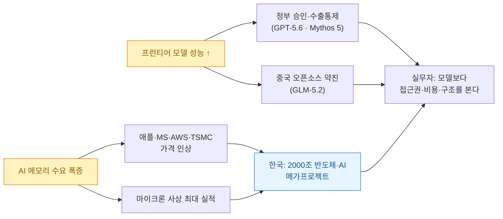
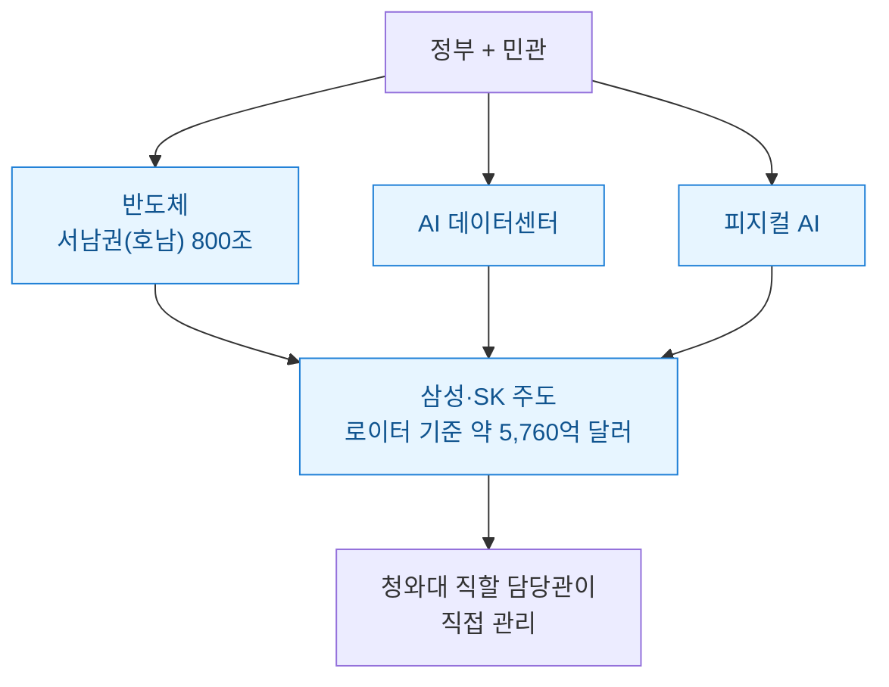
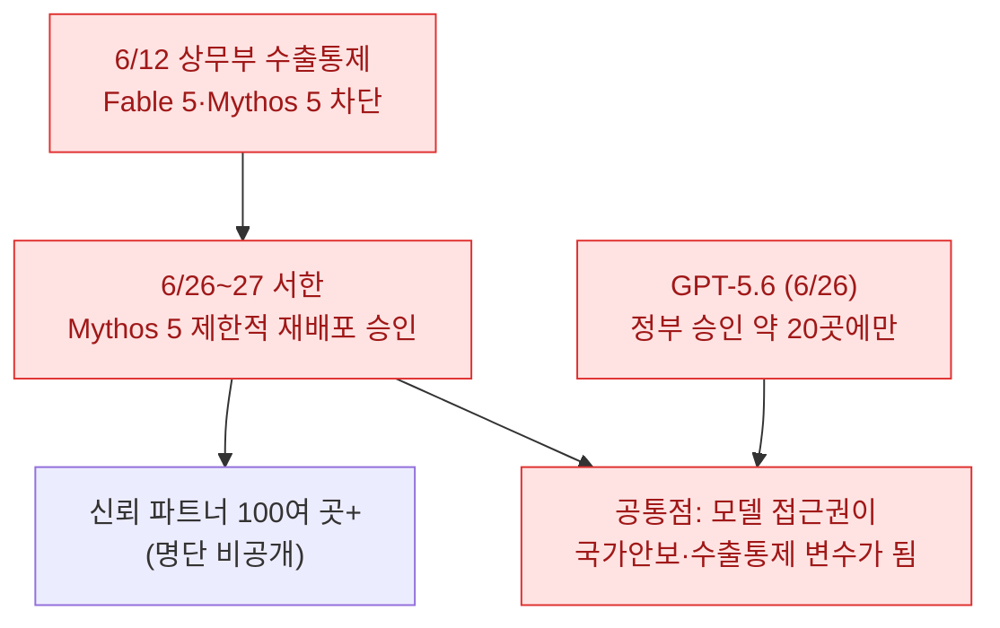
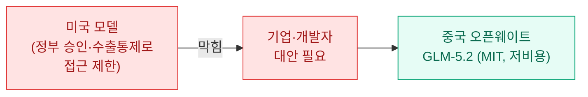
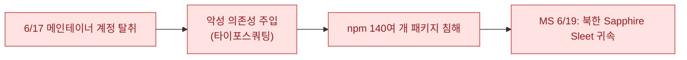
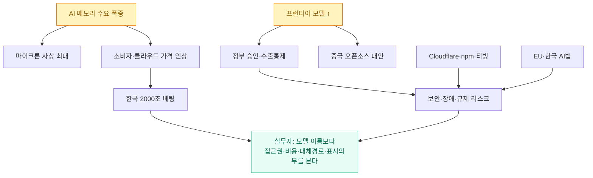

오늘은 정리할 게 유난히 많았다. 7개 각도로 이슈를 긁어 54건을 모았고, 중복을 걷어내고 1차 출처로 교차검증해 15건을 추렸다. 평소처럼 "들리는 말"을 그대로 옮기지 않고, 날짜·수치·과장을 출처와 대조해 **정정한 버전**으로 적는다(틀렸던 부분은 ⚠️로 표시했다).

확인 기준은 **2026년 6월 29일 KST**다. 최근 약 2주(6/16~6/29)에 확인한 이슈를 묶었고, 모든 사건이 오늘 처음 터진 건 아니다. 오늘 기준으로 남겨둘 만하다고 본 최신 흐름이다.

## 오늘 한 줄 요약

내가 본 핵심은 이거다.

**AI는 이제 "모델이 얼마나 똑똑한가"보다 "누가 칩·전력·승인을 쥐고 있는가"의 싸움으로 넘어갔다.**

그리고 그 싸움의 한복판에 오늘 한국이 2000조원을 걸고 뛰어들었다.

## 오늘(6/29) 한국發 큰 뉴스 — 2000조 메가프로젝트

이재명 대통령이 오늘 청와대 영빈관에서 **'대한민국 대도약 3대 메가프로젝트 국민보고회'** 를 주재했다. **반도체 · 피지컬AI · AI 데이터센터**를 '초격차 삼각 축'으로 제시했고, 이재용 삼성전자 회장과 최태원 SK그룹 회장이 직접 참석해 지방 투자 계획을 발표했다.

| 항목 | 내용 |
|---|---|
| 주최 | 이재명 대통령(청와대 영빈관), 산업통상부 장관 김정관 |
| 삼각 축 | 반도체 · 피지컬AI · AI 데이터센터 |
| 참석 | 이재용(삼성)·최태원(SK) 등 |
| 규모 | 로이터 기준 삼성·SK 주도 약 **5,760억 달러**(로이터 보도) |
| 관리 | 청와대 직할 담당관이 직접 챙김 |

> ⚠️ **수치는 보는 관점에 따라 다르다.** 한국 언론의 "총 2000조원"은 민관 합산·10년+ 누적 기준 표현이고, 로이터 등 외신은 더 보수적으로 5천억~6천억 달러대로 잡는다. 또 'AI 데이터센터'는 행사 전 추정(500조)과 행사 당일 발표(배경훈 부총리, 1000조)가 달라 금액이 유동적이다. '충청권 81조' 같은 세부 수치는 이번에 독립 확인하지 못했다. 국민의힘은 '관치 개입'이라며 비판하는 등 정치적 논란도 있다. 그러니 "한국이 국가급으로 반도체·AI에 베팅했다"는 큰 그림은 단단하지만, **구체 총액은 발표 시점·집계 범위에 따라 흔들린다**는 점을 감안하자.

데이터·마케팅·자동화로 먹고사는 입장에서 이건 남의 일이 아니다. 국가가 데이터센터와 반도체에 이 정도 자본을 부으면, 결국 한국어 데이터·AI 인프라·고용 전반이 같이 움직인다.

같은 날 **SK하이닉스 미국 ADR** 소식도 나왔다. 미래에셋자산운용이 6/29 웹세미나에서, SK하이닉스가 **7월 10일 나스닥에 신주 발행 방식으로 최대 약 45조원 규모 ADR 상장**을 추진하며, 미국 대표 반도체지수 편입 시 약 7조원(46억 달러)의 패시브 자금 유입이 기대된다고 밝혔다. 2027년 예상 PER이 약 6배로 마이크론(약 11배)보다 낮아 저평가됐다는 분석도 덧붙였다.

> ⚠️ ADR 상장 '계획'은 6/24에 이미 공시·보도됐고, 6/29 웹세미나는 이를 분석한 것이다. 같이 언급된 "삼성전자 세계 최초 12단 HBM4E 샘플 출하"는 6/29 신규 발표가 아니라 **2026-05-29 사안**으로, 차세대 HBM 경쟁의 배경 정보다.

## 프런티어 모델이 '정부 승인제'가 됐다

오늘 흐름에서 가장 구조적인 변화다. 최강 모델이 나왔는데, 아무나 못 쓴다.

**OpenAI GPT-5.6**(6/26 공개)은 플래그십 **Sol**(고난도 코딩·보안), 중급 **Terra**(대량 업무), 저비용 **Luna**(요약·초안)의 3종 체계다. Sol 전용 'max' 추론과 여러 서브에이전트를 묶는 'ultra' 모드를 새로 넣었고, 더 적은 토큰으로 더 높은 성능을 낸다고 밝혔다(예: ExploitBench에서 이전 수준 성능을 약 1/3 토큰으로). GPT-5.5(2026-04-23)가 나온 지 약 2개월 만이다.

그런데 **일반 공개가 아니다.** 트럼프 행정부의 6월 2일 AI 행정명령에 따른 정부 평가가 진행 중이라, 정부와 공유·승인된 **약 20개 '신뢰 파트너'에게만 우선 제공**하고 '수 주 내' 일반 출시를 예고했다. 초기 프리뷰는 Codex와 API 중심이고, ChatGPT 광범위 배포는 추후다.

여기서 **프런티어 모델(frontier model)** 은 *현재 기술 최전선의 초고성능 모델로, 코딩·보안·과학 능력이 사회·안보에까지 영향을 줄 수 있는 모델*을 말한다.

비슷한 일이 Anthropic에도 있었다. **Anthropic Mythos 5** 는 6월 12일 미 상무부의 수출통제 지시로 Fable 5와 함께 차단됐다가(아마존 연구진이 탈옥으로 사이버 취약점 탐지가 가능함을 발견한 것이 계기), **6월 26~27일 상무장관 서한으로 Mythos 5만 제한적으로 재배포가 승인**됐다(Fable 5 제한은 유지).

> ⚠️ 여기서 자주 잘못 옮겨지는 두 가지를 바로잡는다. (1) Mythos 5 재배포 대상은 '소수'가 아니라 **신뢰 파트너 100여 곳 이상**으로 보도됐다(명단 비공개는 맞다). (2) 차단의 법적 근거를 단순히 '간주수출(deemed export)'로 적는 건 과한 단순화다. CSIS 분석상 핵심은 원격접속 통제 + ECRA 신흥기술 권한 + EAR §744.22 군사·정보용도 통제다. 또 펜타곤(현 전쟁부)의 'Anthropic 공급망 위험 지정·연방 Claude 사용 중단·Anthropic 소송'은 6월 사건이 아니라 **2월 27일 지정·3월 9일 제소로 시작된 별개의 선행 분쟁**이다.

실무 관점에서 결론은 분명하다. **특정 최신 모델 하나에 자동화를 깊게 묶으면, 정부 지시·정책 변경 한 번에 전체가 멈출 수 있다.** 모델 라우팅과 대체 경로가 이제는 선택이 아니라 기본이다.

## 모델 경쟁: 구글의 지연, 중국 오픈소스의 약진

**구글**은 프런티어 모델 **Gemini 3.5 Pro 출시를 7월로 연기**했다(6/24). 더 긴 에이전트성 작업 튜닝과 토큰 효율 문제 보완에 시간을 더 쓰는 중이라는 보도다. 동시에 **Gemini 3.5 Flash에 '컴퓨터 유즈(computer use)'**, 즉 화면을 보고 브라우저·모바일·데스크톱을 조작하는 기능을 기본 내장 도구로 추가했다.

> ⚠️ 두 가지 보강. (a) Pro의 7월 연기는 구글 공식 발표가 아니라 Business Insider 소식통 보도를 여러 매체가 인용한 것이다. (b) computer use는 정식(GA)이 아니라 **퍼블릭 프리뷰** 단계다(Flash 모델 자체는 GA). 그리고 같은 시기 DeepMind는 핵심 연구진(Adler·Pritzel·Jumper → Anthropic, Shazeer → OpenAI) 이탈로 6/22 알파벳 주가가 약 5% 빠지는 등 인재 유출에 시달렸다.

반대편에선 **중국 Z.ai(옛 즈푸AI)의 오픈웨이트 GLM-5.2**(6/16 공개, MIT 라이선스)가 주요 벤치마크에서 처음으로 **글로벌 톱3**에 올랐다. 744B MoE 규모에 최대 100만 토큰 컨텍스트, Code Arena 프런트엔드 종합 2위, 장기 SWE 벤치마크에서 Anthropic Opus 4.8과 1%포인트 이내 격차를 약 1/5 비용으로 냈다는 평가다. 실리콘밸리에서 '제2의 딥시크 모멘트'로 불린다.

> ⚠️ "양자화로 개인 PC 구동 가능"은 과장이다. 2비트 양자화 기준 약 239GB, 256GB 메모리 Mac급 고사양이 필요하다. 비용 '약 1/5'도 출력 토큰 기준이고 입력 기준으론 약 1/3.6 수준이다.

미국이 자국 최강 모델을 잠그는 사이, 저비용 오픈소스가 실질 대안으로 올라온다는 구도가 선명하다.

## 칩으로 내려간 전쟁 + 메모리 대란이 지갑까지

모델 뉴스 아래에는 늘 칩·메모리·전력이 깔려 있다. 오늘은 그게 표면으로 올라왔다.

**마이크론**은 6월 24일(현지) FY2026 3분기에 매출 **414.6억 달러**(전년 동기 93억 → 약 4.5배)로 사상 최대 실적을 냈다. 시장 추정치(약 358억)를 크게 웃돌았고, 발표 직후 시간외에서 주가가 약 15% 급등했다. 4분기 가이던스는 500억 달러(±10억)다. **HBM 2026년 물량은 이미 완판**됐고, 메모리 공급부족이 2027년 이후까지 이어질 거라고 밝혔다.

**퀄컴**은 6월 24일 데이터센터 진출을 공식화했다. Arm 기반 250코어+ CPU **'드래곤플라이 C1000'** 과 AI 가속기를 공개했고, **메타가 첫 하이퍼스케일러 고객**으로 다세대 공급계약을 맺었다(C1000 양산은 2028년 하반기). 같은 날 엔비디아 CUDA 생태계에 대항하기 위해 AI 인프라 소프트웨어 스타트업 **Modular를 약 39억 달러**에 인수하기로 했다.

> ⚠️ 퀄컴의 "데이터센터 매출 150억 달러" 목표는 2028년이 아니라 **FY2029** 기준이다(2028년은 메타 C1000 양산 시작 연도). 두 연도를 섞지 말자.

그리고 이 메모리 수요가 **소비자 지갑과 클라우드 청구서로 전가**되기 시작했다(6/25).

| 주체 | 무엇을 올렸나 | 시점·주의 |
|---|---|---|
| **애플** | 맥·아이패드·애플TV·홈팟·비전프로 등 14개 제품, 일부 200달러+(~15–25%) | 6/25 적용. 팀 쿡 "DRAM 전년比 75%↑". 아이폰·워치·에어팟은 동결 |
| **MS** | 엑스박스 512GB +100달러 / 1TB +150달러 | ⚠️ 6/25 '발표', **적용은 8/1** (1년여 새 세 번째 인상) |
| **AWS** | ⚠️ AI 클라우드 전반이 아니라 **GPU 인스턴스** 20%↑ | 7/1부터(올해 두 번째, 1월 15%에 이어) |
| **TSMC** | 7nm 이하 첨단 공정 전반 인상 통보(웨이퍼 매출 ~74%) | ⚠️ 공식 발표가 아니라 분석가 인용 보도. 엔비디아·AMD·애플·퀄컴 원가 부담 |

AI 붐의 비용이 이제 내가 쓰는 맥, 내가 돌리는 클라우드 청구서로 직접 내려온다는 얘기다. 마케팅·자동화 예산 짤 때 곧장 영향이 온다.

## 큰 돈이 움직였다 — SpaceX의 Cursor 인수

**SpaceX**가 사상 최대 IPO(6/11–12, 약 750억 달러 조달) 직후인 6월 16일, AI 코딩 도구 **Cursor 개발사 Anysphere를 약 600억 달러(전액 주식)에 인수**한다고 발표했다. 이미 SpaceX 산하인 xAI의 그록(Grok) 부진을 자체 모델 통합으로 메우려는 포석으로 평가된다.

> ⚠️ 흔히 "시장이 부정적으로 반응해 시총이 증발했다"고 묶어 적는데, 발표 당일(6/16)에는 오히려 **주가가 약 16% 올라** 아마존·MS를 제치고 미국 4위 시총에 올랐다. 약 6,000억 달러 증발·고점 대비 약 23~24% 하락은 **6/18~23에** 일어났고, Cursor 딜 희석 우려에 더해 광범위한 기술주 매도세가 겹친 결과다. (포럼·요약본에서 자주 보이는 '6/23 인수'는 인수일이 아니라 주가 급락일과 혼동된 것이다.)

AI 코딩 도구가 우주·인프라 자본과 묶이는 초대형 수직통합이라는 점에서, 개발 도구 시장의 판이 흔들리는 사건이다.

## 보안·장애: 인터넷이 한 번에 멈췄고, 패키지가 털렸다

**6월 22일, 인터넷이 동시에 휘청했다.** X·Reddit·Microsoft Teams·Zoom·Fortnite·Canva·Discord, 영국 NHS England까지 같은 시간대에 장애를 겪었다. DownDetector 기준 X 한 곳의 신고만 약 3만 6천 건이었다.

> ⚠️ 흔히 "Cloudflare 자체 오류"로 적히지만, 1차 원인은 **북미 동부의 네트워크 사업자 Zayo의 광케이블/회선 절단**이다. 이게 Cloudflare 경로에서 지연·타임아웃을 일으켜 연쇄 장애로 번졌다. 전 세계 웹의 20% 이상을 처리하는 한 사업자가 흔들리면 무슨 일이 벌어지는지 다시 확인시켜 준 사건이다.

개발 생태계도 직격탄을 맞았다. 마이크로소프트는 **Mastra AI 프레임워크의 npm 패키지 140여 개를 침해한 공급망 공격의 배후로 북한 APT 'Sapphire Sleet'**(금전 동기)를 지목했다. 6월 17일 메인테이너 계정 탈취로 시작돼 악성 의존성이 주입됐고, MS가 6월 19일 귀속을 발표했다.

> ⚠️ 같은 주에 거론되는 Leo Platform(약 20개), npm 23개+Verana Go 모듈 침해는 Mastra 사건 **직후의 별개 캠페인**(6/24·6/26~27)으로 보는 게 정확하다. 패키지 의존성을 쓰는 개발자라면 락파일·메인테이너 신뢰·2FA를 다시 점검할 때다.

국내에선 **티빙(TVING) 개인정보 1,953만 명 유출**이 확정됐다. 정부 초기 잠정치(1,300만)보다 650만 명 이상 늘어난 수치로, **국내 역대 4번째 규모**다(쿠팡 3,756만, SKT 2,324만에 이어). 고객 데이터를 다루는 국내 마케터·분석가에게 직접적인 경각심을 주는 사례다.

> ⚠️ '역대 4번째'는 싸이월드·네이트(약 3,500만, 2011)를 2위로 포함한 순위다. 요약에서 '쿠팡·SKT·티빙'만 나열되는 건 최근 사례만 추린 것이다.

## 규제: EU AI법 첫 손질 + 한국 AI기본법

규제도 같이 움직였다. **EU**는 6월 16일 유럽의회가 찬성 423·반대 57(기권 174)로 **AI법을 발효(2024.8) 이후 처음 개정**했다.

| 항목 | 변경 |
|---|---|
| 고위험 AI(채용·교육·법집행) 핵심 시한 | 2026.8.2 → **2027.12.2로 연기** |
| 제품 내장 고위험 AI | 2028.8.2로 연기 |
| 비동의 성적 합성물(누디파이어)·아동성착취물 생성 AI | **2026.12.2 금지** |
| 제50조 투명성(AI 생성물 라벨링) | 2026.8.2 시점 **유지** |

> ⚠️ 이 표결은 의회 가결 단계이고, 정식 발효는 이사회(Council) 채택이 남았다. 누디파이어·CSAM 금지도 '적절한 기술적 안전장치'가 있으면 예외라, '무조건 전면 금지'는 다소 강한 표현이다. (원출처 날짜 6/23은 기사 발행일이고 표결은 6/16이다.)

**한국**은 세계 최초 **AI 기본법**이 2026년 1월 22일 전면 시행됐고, 개정법이 **2026년 7월 21일 시행**을 앞두고 있다. 핵심은 **생성형 AI 결과물에 워터마크 등 'AI 생성물' 표시 의무**와 'AI 기반 서비스' 사전 고지 의무다. 위반 시 시정명령 또는 **최대 3,000만원 과태료**가 부과될 수 있다.

> ⚠️ 규제 대상은 일반 개인 이용자가 아니라 **AI 개발·이용 사업자**다. 최소 1년 이상 계도기간이 운영된다. 법조계는 'AI 인벤토리'(어디서 어떤 AI를 쓰는지 목록화) 구축 같은 거버넌스가 대응의 출발점이라고 본다.

생성형 AI로 콘텐츠를 만드는 입장에선 이게 가장 실무적이다. 곧 **"이건 AI가 만들었습니다" 표시**가 의무가 된다는 뜻이니까.

## 오늘 이슈를 묶으면

작년까지는 "새 모델 나왔으니 써보자"였다. 지금은 다르다.

- **모델은 강해졌지만, 접근권이 정치·안보 변수**가 됐다(GPT-5.6, Mythos 5).
- **비용은 칩·메모리에서 시작해 내 지갑·클라우드 청구서**로 내려온다(마이크론, 애플·AWS·TSMC).
- **한 사업자·한 패키지·한 회사의 사고가 전체를 흔든다**(Cloudflare, npm, 티빙).
- **곧 'AI가 만들었다'고 표시할 의무**가 생긴다(한국 AI기본법, EU AI법).

## 내 워크플로에 적용한다면

| 작업 | 오늘 이슈에서 얻은 적용점 |
|---|---|
| LLM 모델 선택 | OpenAI·Anthropic·Google 한 곳에 묶지 말고, GLM 같은 오픈웨이트까지 **대체 경로**를 둔다 |
| 블로그·콘텐츠 자동화 | 한국 AI기본법 대비, AI 생성물엔 **표시·고지**를 습관화한다 |
| 비용 관리 | 메모리·클라우드 인상이 실제 예산에 오니, **인스턴스·토큰 비용을 다시 점검**한다 |
| 의존성 관리 | npm 공급망 공격 대비, 락파일·2FA·메인테이너 신뢰를 **정기 점검** |
| 데이터 취급 | 티빙 사례처럼, 고객 데이터는 **최소 수집·암호화·접근통제**를 기본으로 |

결국 오래 가는 AI 워크플로는 멋진 데모가 아니라, **모델이 막혀도 갈아끼울 수 있고, 비용이 보이고, 표시 의무를 지키고, 사고가 나도 추적되는 구조**에서 나온다. 오늘 이슈들이 한목소리로 그렇게 말하고 있다.

## 참고자료

- [CNBC — OpenAI limits new AI models to trusted partners at US government request](https://www.cnbc.com/2026/06/26/openai-limits-new-ai-models-to-trusted-partners-request-us-government.html)
- [Reuters — US releases Anthropic model Mythos to some US companies](https://www.reuters.com/technology/us-releases-anthropic-model-mythos-some-us-companies-semafor-reports-2026-06-26/)
- [Google — Introducing computer use in Gemini 3.5 Flash](https://blog.google/innovation-and-ai/models-and-research/gemini-models/introducing-computer-use-gemini-3-5-flash/)
- [Z.ai — GLM-5.2 (공식 블로그)](https://z.ai/blog/glm-5.2)
- [Reuters — SpaceX to buy Anysphere for 60 billion USD](https://www.reuters.com/legal/transactional/spacex-buy-anysphere-60-billion-2026-06-16/)
- [CNBC — Qualcomm data center CPU, Meta, Modular](https://www.cnbc.com/2026/06/24/qualcomm-data-center-cpu-meta.html)
- [Micron — FY2026 Q3 record results (보도자료)](https://www.globenewswire.com/news-release/2026/06/24/3317151/14450/en/micron-technology-inc-reports-record-results-for-the-third-quarter-of-fiscal-2026.html)
- [Reuters — Apple raises prices as memory costs skyrocket](https://www.reuters.com/world/asia-pacific/apple-raises-prices-macbooks-ipads-memory-costs-skyrocket-2026-06-25/)
- [Reuters — South Korean president unveils massive AI/chip investment drive](https://www.reuters.com/world/asia-pacific/south-korean-president-unveil-massive-ai-chip-investment-drive-2026-06-29/)
- [연합뉴스 — 3대 메가프로젝트 국민보고회](https://www.yna.co.kr/view/AKR20260629106800001)
- [The National — Internet outage: X, Cloudflare, Reddit](https://www.thenationalnews.com/future/technology/2026/06/22/internet-outage-x-cloudflare-reddit/)
- [Microsoft Security — Mastra npm supply chain compromise (Sapphire Sleet)](https://www.microsoft.com/en-us/security/blog/2026/06/17/postinstall-payload-inside-mastra-npm-supply-chain-compromise/)
- [조선비즈 — 티빙 개인정보 1,953만명 유출](https://biz.chosun.com/industry/business-venture/2026/06/22/ZC3PPK2EXZELPB63BATXFNMIF4/)
- [European Parliament — AI Act simplification & nudifier app ban](https://www.europarl.europa.eu/news/en/press-room/20260611IPR45207/ai-act-ep-approves-simplification-measures-and-nudifier-app-ban)
- [법률신문 — AI기본법 시행·7월 개정](https://www.lawtimes.co.kr/news/articleView.html?idxno=222643)

<!-- 안전: 회사 실데이터·고객/제3자 PII·API키/쿠키/토큰 없음. 공개 보도 기반 + 1차 출처 팩트체크(합성·일반화). -->
