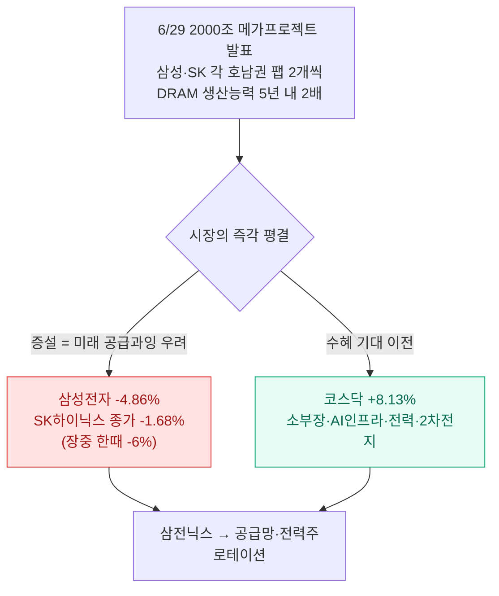
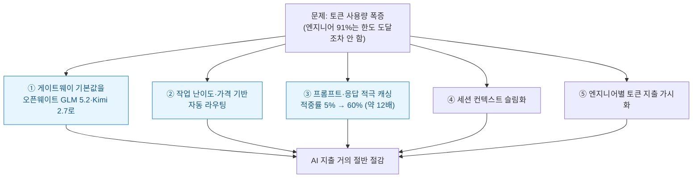
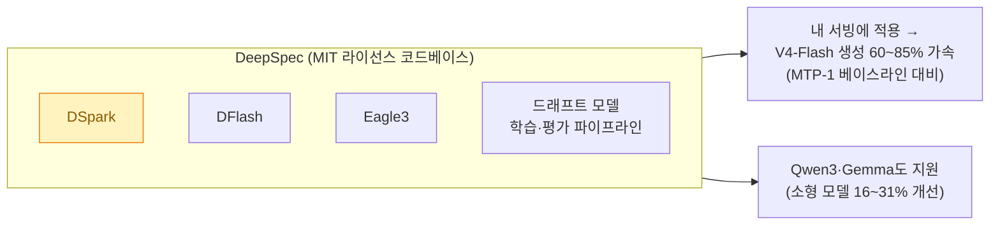
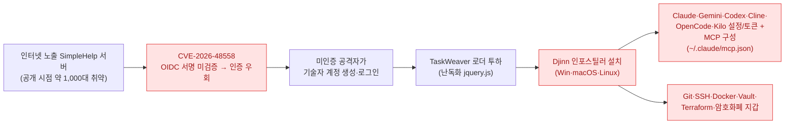
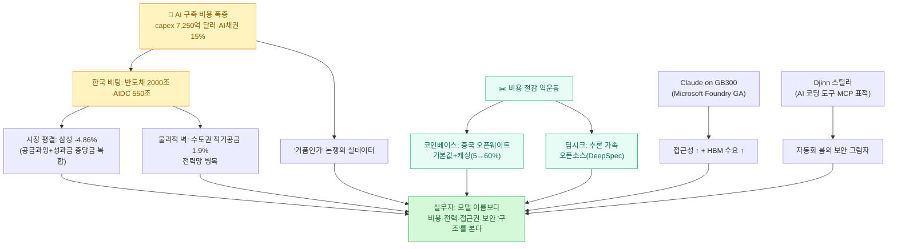

[[ai-llm-it-news-2026-06-29|어제 글]]에서 한국이 2000조원을 걸고 반도체·AI에 뛰어든 이야기를 정리했다. 그런데 오늘 흐름을 긁어 보니, 화제는 정확히 그 다음 장면으로 넘어가 있었다. **돈을 사상 최대로 붓는 쪽**과 **그 비용을 어떻게든 깎는 쪽**이 같은 날 뉴스 양쪽 끝을 잡고 있었다.

확인 기준은 **2026년 6월 30일 KST**다. 어제(6/29) 저녁부터 오늘까지 새로 확인한 이슈를 묶었다. 평소처럼 "들리는 말"을 그대로 옮기지 않고, 8개 각도로 긁어 모은 뒤 1차 출처로 교차검증해 **정정한 버전**으로 적는다(자주 틀리게 옮겨지는 부분은 ⚠️로 표시했다).

## 오늘 한 줄 요약

```mermaid
flowchart LR
    subgraph SPEND["💸 사상 최대로 붓는 쪽"]
        A["하이퍼스케일러 capex<br/>약 7,250억 달러"]
        B["AI 회사채 = 美 투자등급<br/>발행의 약 15%"]
        K["한국: 반도체 2000조<br/>+ AIDC 550조"]
    end
    subgraph CUT["✂️ 비용을 깎는 쪽"]
        C["코인베이스: 중국 오픈웨이트<br/>기본값+캐싱 → 지출 거의 절반"]
        D["딥시크: 추론 가속<br/>DSpark·DeepSpec 오픈소스"]
    end
    SPEND --> R["실무자: 모델 이름보다<br/>비용·전력·접근권·보안 '구조'를 본다"]
    CUT --> R
    E["Claude on GB300<br/>(Microsoft Foundry 정식 출시)"] --> R
    F["Djinn 스틸러<br/>(AI 코딩 도구·MCP 표적)"] --> R
    classDef hot fill:#fff3bf,stroke:#e67700,color:#8a5a00;
    classDef cool fill:#e6fcf5,stroke:#0ca678,color:#0b6b50;
    class A,B,K hot;
    class C,D cool;
```

내가 본 핵심은 이거다.

**AI 경쟁의 무게중심이 "더 똑똑한 모델"에서 "AI를 짓고 굴리는 경제학"으로 완전히 넘어갔다.** 한쪽에선 capex·부채·메모리가 사상 최대로 부풀고, 다른 쪽에선 같은 일을 더 싸게 하려는 역(逆)움직임이 거세진다. 그 사이에 전력·보안 같은 물리적 제약이 끼어든다.

어제가 "베팅"의 날이었다면, 오늘은 그 **청구서와 그림자**가 한꺼번에 보인 날이었다.

## 2000조에 환호하던 시장이 왜 하루 만에 삼성을 떨궜나?

어제 청와대에서 2000조 메가프로젝트가 발표됐는데, 정작 발표 당일 증시 반응은 정반대였다. **삼성전자가 약 4.86% 하락**(종가 32만 3,000원), **SK하이닉스가 종가 기준 약 1.68% 하락**했다. 코스피는 장중 한때 3.4%까지 빠졌다가 종가 -0.2%로 겨우 추슬렀다.

대신 돈은 다른 데로 흘렀다. **코스닥은 +8.13% 급등**(상승 826종목 vs 하락 88종목)으로, 삼성전자·SK하이닉스에서 소부장(소재·부품·장비)·AI 인프라·전력·2차전지 쪽으로 자금이 도는 **로테이션**이 또렷했다.

데이터로 메모리 슈퍼사이클을 따라가는 입장에서 이건 흥미로운 신호다. 국가가 capex를 크게 약속하면 보통 호재로 읽히는데, "각 2개 팹"이라는 대규모 증설 약속이 오히려 **미래 공급과잉 우려**로 해석되면서 정작 당사자 주가는 빠지고, 수혜는 공급망·전력주로 먼저 갔다.

> ⚠️ 여기서 자주 뭉뚱그려지는 걸 바로잡는다. (1) **'2000조'는 향후 10년 합산 상단치**(천장값)다. 외신은 보통 더 보수적으로 반도체 생태계 800조원(약 5,180억 달러)이나 약 1.3조 달러를 헤드라인으로 썼고, 삼성 단독은 약 1,000조원(약 6,460억 달러)으로 보도됐다. '2000조 단일 프로젝트'로 단정하면 과장이다. (2) **삼성전자 -4.86%를 '메가프로젝트 공급과잉' 하나로 돌리면 부정확하다.** 1차 보도(파이낸셜뉴스·중앙이코노미)는 2분기 성과급 충당금 확대에 따른 실적 하향 우려라는 **기업 고유 악재**를 큰 동인으로 명시했다. 공급과잉 해석은 부수 요인이다. (3) SK하이닉스 '-1.68%'는 **종가** 기준으로, 장중엔 한때 약 -6%까지 빠졌다 낙폭을 줄였다. 종가만 보면 장중 약세를 과소평가하게 된다. (4) '애널리스트들이 공급과잉을 경고했다'는 건 디제스트의 해석에 가깝고, 인용한 1차 소스에서 그날 명시적 '공급과잉 경고' 인용은 확인되지 않았다. 다만 코스닥 +8%·소부장 로테이션이라는 **시장 행동 자체는 사실**이다.

## 그 많은 데이터센터를 돌릴 전기는 있나?

같은 6/29, 정부는 AI 데이터센터(AIDC) 청사진도 폈다. 배경훈 과기정통부 장관이 **2029년까지 약 550조원, 2035년까지 누적 1,000조원 이상** 투자를 제시했고, 1단계로 **8.4GW**(SK 5GW, GS 2.4GW, 네이버 1GW), 2035년까지 총 **18.4GW** 규모를 그렸다.

그런데 칩 다음에 늘 따라붙는 질문이 있다. **그 전기는 어디서 끌어오나.** 최신 수치를 보면 이게 한국 소버린 AI의 진짜 병목이다.

| 항목 | 수치(2026-05 기준) | 출처 |
|---|---|---|
| 1차 기술검토 신청 | 736건 | 머니투데이 |
| 수도권 집중도 | 71%(522건) | 머니투데이 |
| 수도권 중 '공급 불가' 판정 | 279건(53.4%) | 머니투데이 |
| 수도권 **적기공급 성공률** | **약 1.9%** | 머니투데이 |
| 수도권 신청 전력량 | 33,591MW(APR1400 약 24기분) | 머니투데이 |

수도권에 데이터센터를 짓겠다고 신청해도, 한전이 제때 전력을 댈 수 있는 비율이 **2%가 안 된다.** 하이퍼스케일 AI 단지는 부지당 100MW급 전력을 요구하는데, 송전선·변전소 확충은 지역 갈등으로 줄줄이 막혀 있다. 칩이 아니라 **전력망**이 벽이다.

> ⚠️ 이 항목은 '출처 검증' 교과서 사례라 특히 조심해서 적는다. (1) 흔히 같이 인용되는 **'신청 약 550개 부지·86% 수도권·적기공급 40곳'은 한전의 2022~2023년 과거 자료** 수치다. 위 표의 '736건·71%·1.9%'가 2026년 5월 최신치이니, 옛 수치를 2026년 현황처럼 제시하면 오해를 부른다. (2) 일부 정리본이 이 전력망 통계를 '데이터센터 네트워크 전략'을 다룬 별개 기사에 붙여 한 분석인 것처럼 합성하던데, 두 건은 **출처가 다른 별개 기사**다. (3) '부지당 100MW+'는 업계 통설이고, 삼성SDS 구미(60MW)처럼 100MW 미만 사례도 있다. 인프라·에너지 뉴스를 자동 수집(스크래핑/RSS)할 때 **헤드라인 프레임과 본문 수치의 출처·기준 시점이 일치하는지** 점검하는 단계가 없으면, 이런 오귀속이 그대로 블로그·대시보드로 전파된다.

## AI에 이렇게 많은 돈이 들어가는데, 거품 아닌가?

이 질문에 정서가 아니라 **신용시장 실데이터**로 답하는 기사가 어제 로이터에서 나왔다. 핵심만 추리면 이렇다.

| 지표 | 수치 | 출처(은행) |
|---|---|---|
| AI 관련 회사채 / 美 투자등급(IG) 발행 비중 | **약 15%에 근접** | 바클레이스 |
| 2026년 하이퍼스케일러 capex(추정) | **약 7,250억 달러**(2025년 중반 대비 거의 2배) | BNP파리바 |
| 2026년 IG 발행 전망 | **사상 첫 2조 달러 돌파 가능성** | 모건스탠리 |

여기서 **투자등급(IG, Investment Grade)** 은 *신용등급이 높은 우량 기업이 발행하는 회사채*를 말한다. 그 우량 채권 시장의 6~7건 중 1건이 AI 관련 차입이라는 얘기다. 미국 달러 시장이 포화되니 은행들은 **유로·파운드·엔화 발행**과 **데이터센터 임대를 담보로 잡은 채권**으로 조달처를 넓히고 있다.

> ⚠️ 각 수치의 출처와 뉘앙스를 살려야 과장 보도와 구분된다. (1) '15%'는 **로이터 자체 추정이 아니라 바클레이스 데이터**이고, 정확히는 '15%에 근접(approaches)'이다. (2) 약 7,250억 달러는 **하이퍼스케일러 총 capex**(BNP파리바)이지 'AI 전용 capex'가 아니며, 비교 기준은 '2025년 중반 대비 거의 2배'가 정확하다. (3) '2조 달러 돌파'는 모건스탠리의 **조건부 가능성(could)** 전망이지 확정이 아니다 — '돌파 전망'은 맞되 '돌파했다'로 단정하면 안 된다. (4) 데이터센터 임대 담보 채권으로 언급된 사례(스팅레이 컴퓨트, 약 8억 1,000만 달러·9배 청약초과·아마존 임대 담보)는 **구체적 단일 사례**이지 시장 전체 규모가 아니다.

'AI 거품' 논쟁을 수치로 논증하고 싶을 때, 이 세 줄은 출처와 함께 그대로 인용할 수 있는 드문 1차 근거다.

## 그럼 비용은 어떻게 줄이나? — 코인베이스와 딥시크

돈이 사상 최대로 들어가니, 반대편에서 **비용을 깎는 실전 사례**가 같이 터졌다. 두 건 다 한국 실무자가 바로 베껴 쓸 수 있다.

### 코인베이스: 중국 오픈웨이트를 '기본값'으로 실험

브라이언 암스트롱 코인베이스 CEO가 X에, 토큰 사용량이 기하급수로 느는데도 **AI 지출을 거의 절반으로 줄였다**고 밝혔다. 비결은 사용 한도를 조이는 마찰이 아니라 **더 나은 기본값 + 라우팅 + 캐싱**이었다.

특히 **캐시 적중률을 5%에서 60%로** 끌어올린 부분은, LLM 게이트웨이를 운영하는 입장에서 곧장 따라 할 수 있는 패턴이다. 가격 비교도 거칠게 나왔다 — GLM 5.2가 100만 토큰당 약 1.40달러(입력)·4.40달러(출력)인 반면 상위 프런티어 모델은 그 몇 배다.

> ⚠️ 자극적으로 옮겨지는 걸 바로잡는다. (1) 암스트롱 원문은 **"We're experimenting with defaulting…"** 으로, 전사 기본값을 확정 '전환'한 게 아니라 그 모델을 기본값으로 두는 걸 **실험 중**이라고 했다. 엔지니어는 여전히 작업에 맞는 모델을 자유롭게 고른다. (2) 모델명은 **'Kimi 2.7'**(문샷)이다 — 일부에서 붙이는 'K2.7 Code'의 'Code' 접미사는 원문에 없다. GLM 쪽은 Z.ai의 'GLM 5.2'가 맞다. (3) 발표(암스트롱 게시물)는 **6/27**(미 태평양시 6/26 저녁)이고, 6/28은 언론 보도일이다. (4) 절감폭은 정확히 '50%'가 아니라 **'거의 절반(nearly half)'**, 그리고 캐시 한 가지가 아니라 5개 레버의 합산 효과다.

### 딥시크: 추론을 빠르게 하는 인프라를 통째로 오픈소스

딥시크는 6/27, **추측 디코딩(speculative decoding)** 서빙 코드베이스 **DeepSpec**을 MIT 라이선스로 공개했다. 여기서 추측 디코딩은 *작고 빠른 '초안(draft) 모델'이 여러 토큰을 미리 던지고, 본 모델이 한 번에 검증해 통과시키는* 가속 기법이다. 출력 분포는 그대로라 품질 손실이 없다고 주장한다.

모델이 아니라 **추론 가속 인프라**를 통째로 연 게 핵심이다. 칩 수출통제를 소프트웨어 최적화로 우회하는 미·중 역학이기도 하고, 자체 호스팅 비용을 직접 깎으려는 한국 개발자에게는 드롭인 최적화 도구다.

> ⚠️ 가속 수치엔 항상 단서를 붙여야 한다. (1) **'최대 85%'는 맨바닥(autoregressive) 대비가 아니라 V4 기존 MTP-1 추측디코딩 대비**, 동일 처리량 기준이다. 이미 빨라진 베이스라인 위에서의 추가 이득이다. (2) MIT로 열린 프레임워크 이름은 **DeepSpec**이고, **DSpark는 그 안의 드래프트 모델 알고리즘**이다(DSpark ⊂ DeepSpec). 둘을 별개 프레임워크처럼 적으면 부정확하다. (3) **'재학습 없이'는 본 모델 얘기**다 — 드래프트 헤드는 학습이 필요하고, 그 학습용 코드가 곧 DeepSpec이다. (4) Qwen3·Gemma 지원은 사실이나 그쪽은 소형 모델에서 16~31% 수준 개선이지 85%가 아니다.

## 최상위 모델은 결국 어디서 돌리나? — Claude on GB300

비용을 깎는 흐름의 반대편엔, 최상위 모델을 **기업 거버넌스 안에서** 쓰려는 수요가 있다. 6/29 앤트로픽·마이크로소프트·엔비디아가 **Claude의 Microsoft Foundry 정식 출시(GA)**를 알렸다.

| 항목 | 내용 |
|---|---|
| 모델 | Claude Opus 4.8 · Haiku 4.5 (Messages API) |
| 기능 | 프롬프트 캐싱 · 확장 사고(extended thinking) |
| 호스팅 선택 | **Azure 호스팅**(Azure 신원·과금·거버넌스, 미국 데이터 존) ↔ **Anthropic 호스팅**(전체 기능셋) |
| 하드웨어 | NVIDIA **GB300 블랙웰 울트라**(NVL72) + Quantum-X800 인피니밴드 |

규제·기업 환경에서 자동화를 짜는 입장에선 이게 꽤 실용적이다. 최상위 코딩·에이전트 모델인 Opus 4.8을 **별도 앤트로픽 계약·과금 없이** Azure 신원·과금·거버넌스 체계 안에서 정당화해 쓸 수 있게 됐다. 동시에 GB300은 HBM이 늘어난 칩이라, 이런 대규모 GA 배포 자체가 **메모리 슈퍼사이클의 실제 수요 신호**이기도 하다.

> ⚠️ 보도에서 자주 어긋나는 네 가지를 바로잡는다. (1) 제품명은 **'Microsoft Foundry'**다(과거 'Azure AI Foundry'에서 리브랜딩). 'Azure Foundry'는 부정확하다. (2) **'GB300이 GB200 대비 HBM 약 2배'는 사실 오류**다 — GPU당 288GB vs 192GB로 **약 1.5배(50% 증가)**다. (3) 1차 출처(앤트로픽·MS·엔비디아) 어디에도 **'Azure 최초로 GB300에서 서빙'이라는 'first' 표현은 없다** — 모두 '정식 출시(GA)'라고만 했다. (4) **'미국 데이터 레지던시'는 'Azure 호스팅' 옵션에 한정**이라, 한국·EU 데이터 레지던시를 보장하지 않는다. 사내 데이터에 한국 레지던시가 필요하면 호스팅 옵션 트레이드오프를 따져야 한다.

## 이 모든 자동화의 그림자 — 내 AI 에이전트는 안전한가?

오늘 가장 등골 서늘했던 건 보안이었다. 공격자들이 원격관리(RMM) 솔루션 **SimpleHelp의 인증 우회 취약점(CVE-2026-48558, CVSS v3.1 10.0 / v4.0 9.5)** 을 악용해, **AI 코딩 도구의 자격증명을 콕 집어 노리는** 신종 인포스틸러 **'Djinn'** 과 로더 'TaskWeaver'를 퍼뜨리고 있다.

이건 남의 일이 아니다. 내가 매일 쓰는 바로 그 툴체인 — **Claude Code, Codex, MCP** — 이 표적이다. 특히 **MCP 설정 하나가 에이전트에 부여한 레포·클라우드·DB 접근권**을 그대로 공격자에게 넘긴다. 유출된 구성 하나의 '폭발 반경'이 곧 개발자 본인의 권한 범위다.

| 실무 조치 | 왜 |
|---|---|
| MCP 토큰 **최소권한·정기 로테이션**, 평문 저장 점검 | 토큰 하나 = 에이전트 접근권 전체 |
| `~/.claude` 등 설정·시크릿 파일 **권한 분리** | 인포스틸러가 콕 집어 노리는 경로 |
| SimpleHelp 등 RMM **즉시 패치**(v5.5.16/v6.0 RC2+)·OIDC 점검 | 진입점 자체를 막음 |
| Git·SSH·Docker·Vault 자격증명 **노출 감사** | Djinn은 AI 외 인프라 비밀도 싹쓸이 |

> ⚠️ 정확히 적자. (1) **'AI 도구를 노린 최초 캠페인'은 과장**이다. 원 보도는 Djinn·TaskWeaver가 '이전에 문서화된 적 없는 **신종** 멀웨어'라고 했을 뿐이고, 올 3월 이후 가짜 Claude Code 사칭·SEO 포이즌 등 AI 코딩 도구 표적 선행 사례가 이미 여럿 있었다. '최초'는 빼고 '신종이 MCP 구성까지 표적화'로 쓰는 게 맞다. (2) **6/29는 'Djinn 악용' 보도일**이지 CVE 공개·패치일이 아니다 — 패치는 5월 말, IOC 공개는 6/12였다. (3) CVE 분석·IOC를 다룬 페이지와 'Djinn·AI 도구 표적'을 다룬 기사는 **커버리지가 다른 별개 출처**다.

## 폰에서 코딩 에이전트를? — Cursor iOS 베타

가벼운 소식 하나. **Cursor가 첫 아이폰/아이패드 앱을 공개 베타**로 6/29 내놨다(모든 **유료** 플랜). 폰에서 클라우드 에이전트를 실행하고, 데스크톱 에이전트를 원격 제어하고, diff·스크린샷을 리뷰하고, PR을 머지하고, 음성으로 지시할 수 있다. 7월 5일까지 앱 내 Composer 2.5 실행 75% 할인도 건다.

'폰에서 에이전트를 띄운다'는 모바일 우선 워크플로는 데이터·자동화 블로거 입장에서 바로 테스트해볼 가치가 있다. Codex Remote 같은 '폰 기반 코딩 에이전트' 트렌드와도 맞물린다.

> ⚠️ 소개할 때 흔히 틀리는 부분. (1) **'스페이스X 소유 Cursor'는 시점상 과장**이다. 600억 달러(전액 주식) 인수는 6/16 **발표·합의**일 뿐, 2026년 3분기 클로징 예정(규제 승인 대기)으로 아직 완료되지 않았다. Cursor 공식 블로그 푸터도 여전히 'Anysphere, Inc.'다 → '스페이스X가 **인수하기로 합의한**'이 정확하다. (2) 앱은 받아도 **무료 플랜엔 미제공**, 유료 한정이다. (3) 데스크톱 **원격 제어**는 Teams/Enterprise에선 관리자가 별도로 켜야 동작한다. (4) 앱은 **6/29(어제) 출시**라 오늘 기준 '하루 전'이다 — '오늘 출시'로 단정하지 말 것.

## 오늘 이슈를 묶으면

어제까지는 "국가가 2000조를 건다"는 흥분이었다. 오늘은 그 흥분의 **이면**이 한꺼번에 드러났다.

- **돈은 사상 최대로 들어간다** — capex 약 7,250억 달러, AI 채권이 우량 회사채의 15%.
- **그런데 물리적 벽이 있다** — 수도권 데이터센터 적기 전력공급 성공률 1.9%.
- **그래서 다들 비용을 깎는다** — 코인베이스는 중국 오픈웨이트 기본값으로, 딥시크는 추론 가속 오픈소스로.
- **최상위 모델은 기업 거버넌스 안으로** — Claude가 Microsoft Foundry GA, GB300 위에서.
- **그 모든 자동화엔 그림자가 따른다** — Djinn이 내 MCP 설정을 노린다.

## 내 워크플로에 적용한다면

| 작업 | 오늘 이슈에서 얻은 적용점 |
|---|---|
| LLM 모델 선택·비용 | 프런티어 한 곳에 묶지 말고, **오픈웨이트 기본값 + 작업기반 라우팅 + 캐싱**을 설계한다(코인베이스 패턴) |
| 자체 호스팅 | 추론 가속(DeepSpec식 추측 디코딩)으로 **토큰당 비용**을 직접 깎되, 수치는 베이스라인 단서와 함께 본다 |
| 기업·규제 환경 | Claude를 쓸 때 **호스팅 옵션(거버넌스 vs 데이터 레지던시)** 트레이드오프를 먼저 따진다 |
| **에이전트 환경 보안** | MCP 토큰 최소권한·로테이션, `~/.claude` 권한 분리, RMM 패치 — **유출 = 내 권한 전부** |
| 뉴스·데이터 수집 자동화 | 헤드라인 프레임과 본문 수치의 **출처·기준 시점 일치**를 자동 점검(전력망 오귀속 사례) |
| 시장 데이터 추적 | 'capex 베팅'과 '시장 평결'을 분리 기록, 수치는 **종가/장중·합산기간·출처 은행명**까지 라벨링 |

결국 오래 가는 AI 워크플로는 멋진 데모가 아니라, **비용이 보이고, 모델이 막혀도 갈아끼울 수 있고, 전력·보안 같은 물리적 제약을 계산에 넣고, 수치의 출처를 추적할 수 있는 구조**에서 나온다. 어제는 베팅이었고, 오늘은 그 구조를 묻는 날이었다.

## 참고자료

- [Reuters — Banks get creative, look further afield as AI-fueled debt soars](https://www.reuters.com/business/finance/banks-get-creative-look-further-afield-ai-fueled-debt-soars-2026-06-29/)
- [CNBC — Samsung, SK Hynix reported \$1.3 trillion spending plans](https://www.cnbc.com/2026/06/29/samsung-sk-hynix-reported-1point3-reported-trillion-spending-plans.html)
- [파이낸셜뉴스 — 코스피·코스닥 시황](https://www.fnnews.com/news/202606291619502416)
- [머니투데이 — 수도권 데이터센터 전력공급 현황](https://www.mt.co.kr/tech/2026/05/20/2026051922000848265)
- [디지털데일리 — 정부 AIDC 투자계획(8.4→18.4GW)](https://www.ddaily.co.kr/page/view/2026062917180327471)
- [claude.com — Claude in Microsoft Foundry](https://claude.com/blog/claude-in-microsoft-foundry)
- [NVIDIA — Anthropic, NVIDIA GB300 Blackwell Ultra on Microsoft Azure](https://blogs.nvidia.com/blog/anthropic-nvidia-gb300-blackwell-ultra-microsoft-azure/)
- [Brian Armstrong (X) — cutting AI spend with open-weight defaults](https://x.com/brian_armstrong/status/2070670644577280109)
- [The Decoder — Coinbase joins the rush to Chinese AI models](https://the-decoder.com/coinbase-joins-the-rush-to-chinese-ai-models-as-western-labs-face-a-pricing-stress-test/)
- [GitHub — deepseek-ai/DeepSpec](https://github.com/deepseek-ai/DeepSpec)
- [MarkTechPost — DeepSeek releases DSpark speculative decoding](https://www.marktechpost.com/2026/06/27/deepseek-releases-dspark-a-speculative-decoding-framework-that-accelerates-deepseek-v4-per-user-generation-60-85-over-mtp-1/)
- [BleepingComputer — SimpleHelp flaw, new Djinn infostealer & TaskWeaver](https://www.bleepingcomputer.com/news/security/hackers-exploit-critical-simplehelp-flaw-deploy-new-djinn-infostealer-taskweaver-malware/)
- [Help Net Security — SimpleHelp RMM CVE-2026-48558](https://www.helpnetsecurity.com/2026/06/16/simplehelp-rmm-cve-2026-48558/)
- [Cursor — iOS mobile app](https://cursor.com/blog/ios-mobile-app)
- [TechCrunch — SpaceX to acquire Cursor for \$60B in stock](https://techcrunch.com/2026/06/16/spacex-to-acquire-cursor-for-60b-in-stock-days-after-blockbuster-ipo/)

<!-- 안전: 회사 실데이터·고객/제3자 PII·API키/쿠키/토큰 없음. 공개 보도 기반 + 1차 출처 팩트체크(합성·일반화). -->
