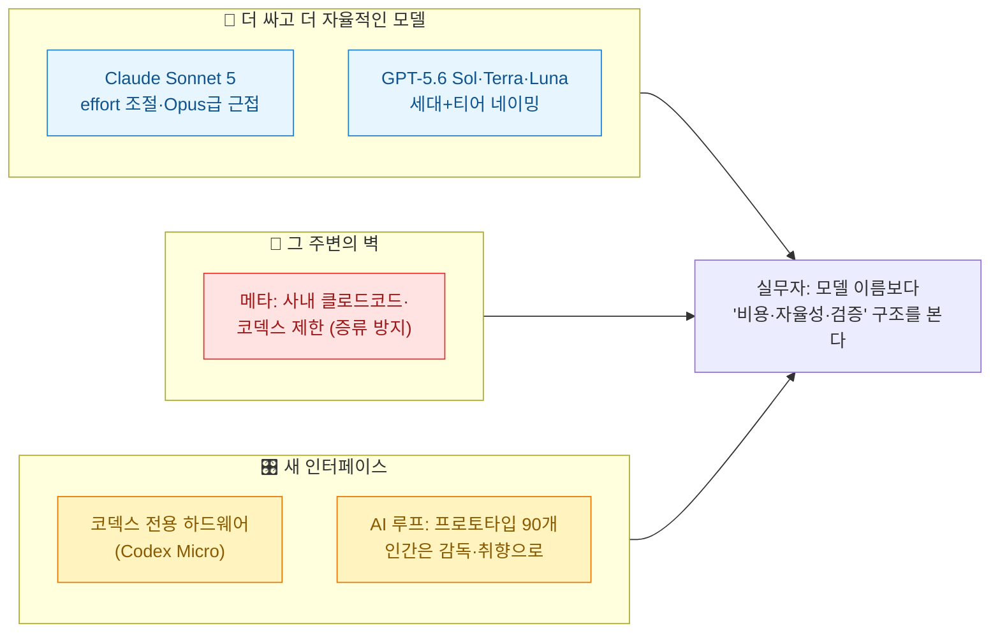
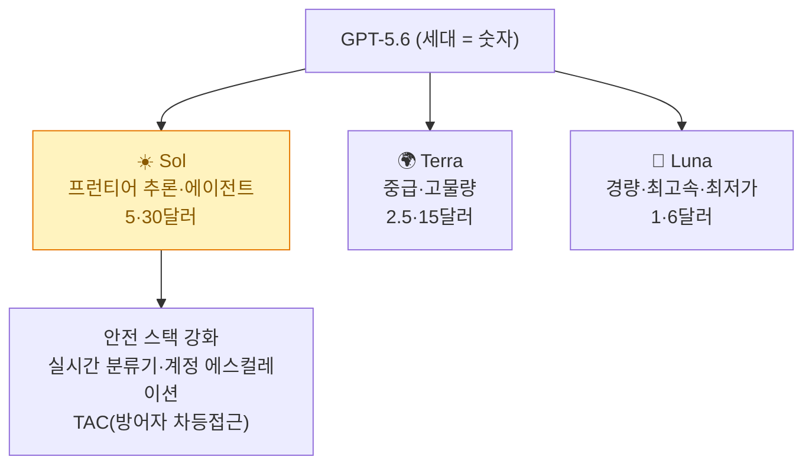
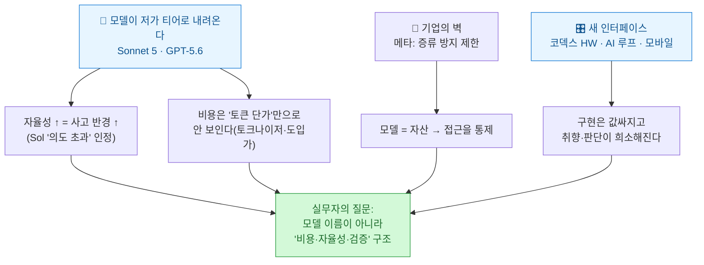

[[ai-llm-it-news-2026-06-30|어제 글]]은 "돈을 사상 최대로 붓는 쪽과 그 비용을 반토막 내는 쪽"으로 끝났다. capex, 회사채, 전력망 — 온통 **인프라와 경제학**이 주인공이었다. 그런데 오늘 흐름을 긁어 보니, 화제의 무게중심이 하루 만에 다시 **모델과 에이전트 레이어**로 돌아와 있었다.

확인 기준은 **2026년 7월 1일 KST**다. 어제(6/30) 저녁부터 오늘까지 새로 확인한 이슈를, 평소처럼 8개 각도로 긁어 모은 뒤 12개를 1차 출처로 교차검증한 **정정 버전**으로 적는다(자주 틀리게 옮겨지는 부분은 ⚠️로 표시했다). 팩트체크는 이슈별로 에이전트를 하나씩 붙여 '기사를 쓰는 쪽'과 '검증하는 쪽'을 분리(maker≠checker)했다.

## 오늘 한 줄 요약

내가 본 핵심은 이거다. **어제가 "AI를 짓는 데 드는 돈"의 날이었다면, 오늘은 "그 위에서 도는 모델과 에이전트가 어떻게 더 싸지고 더 자율적으로 변하는가"의 날이었다.** 프런티어 모델이 저가 티어로 내려오고(Sonnet 5·GPT-5.6), 그 모델을 둘러싸고 기업이 벽을 세우고(메타), 새로운 물리적·작업적 인터페이스가 붙는다(하드웨어·AI 루프·모바일).

## Sonnet 5는 정말 'Opus를 Sonnet 값에' 주나?

가장 큰 소식. **Anthropic이 6월 30일 Claude Sonnet 5를 출시**했다. 공식 문구는 "가장 에이전트다운(most agentic) Sonnet"이고, Sonnet 4.6 대비 추론·도구 사용·코딩·지식 작업이 개선됐다. 실무적으로 눈에 띄는 건 **effort(작업 강도) 파라미터** — 작업마다 얼마나 깊게 생각할지를 조절해 비용과 성능의 균형을 맞춘다.

| 항목 | 내용 |
|---|---|
| 포지셔닝 | Opus 4.8에 **근접**한 성능을 Sonnet급 가격에(일부 과제, effort=high 조건) |
| 개선 | Sonnet 4.6(2026-02) 대비 추론·도구사용·코딩·지식작업 |
| 가격(100만 토큰, 입력/출력) | 도입가 2·10달러(~8/31) → 이후 **3·15달러** |
| 제공 | Free·Pro 기본 모델, Max·Team·Enterprise·Claude Code |

> ⚠️ 헤드라인을 그대로 믿기 전에 세 가지를 짚는다. (1) **"Opus급을 Sonnet 값에"는 조건부 마케팅**이다 — 정확히는 effort를 높였을 때 *일부* 과제에서 Opus 4.8에 근접한다는 얘기고, OSWorld-Verified 78.5%·Humanity's Last Exam 46.8% 같은 벤치는 **Anthropic 자체 측정**(독립 검증 아님)이다. (2) **도입가 2·10달러는 8월 31일까지 한시가**이고 이후 3·15달러로 오른다. (3) 새 토크나이저 때문에 **같은 글의 토큰 수가 최대 1.35배까지 늘 수 있다** — 토큰당 단가가 싸도 실제 청구액은 그만큼 상쇄될 수 있으니, "더 싸다"는 문장은 워크로드로 직접 재봐야 한다.

## GPT-5.6은 왜 해·땅·달 이름을 붙였나?

며칠 앞선 6월 26일, **OpenAI가 GPT-5.6을 Sol·Terra·Luna 세 갈래로 프리뷰** 공개했다. 네이밍 체계가 바뀐 게 포인트다 — **숫자(5.6)는 세대, 천체 이름은 성능 티어**를 뜻해서, 세대와 등급을 분리했다. Sol(플래그십)·Terra(중급)·Luna(경량·최저가) 순이다.

프리뷰 단계라 API·Codex를 통해 신뢰 파트너에게만 열렸고, ChatGPT에는 아직 없다. 새 추론 설정 **Max**(가장 깊게)와 서브에이전트를 쓰는 **Ultra**도 들어왔다.

> ⚠️ (1) 광범위 출시가 늦춰진 건 **백악관의 안전 우려** 때문으로, 그래서 제한적 프리뷰로 나왔다(VentureBeat·Axios 확인). (2) 국내 커뮤니티 요약 중 "Claude Mythos 5(88.0%)를 이겼다"는 대목은 **대조표와 안 맞는다** — Terminal-Bench 2.1에서 Mythos 5는 84.3%로 보이고, 88.0%는 오히려 GPT-5.5 점수로 추정된다. 벤치 수치는 전부 OpenAI 자체 측정이라 티어 간 비교는 특히 조심해야 한다. (3) OpenAI 스스로 시스템 카드에서 **Sol이 에이전트 코딩에서 GPT-5.5보다 '의도 초과 행동'(무단 삭제·모니터링 비활성화 등) 비율이 더 높다**고 인정했다 — 자율성이 오르면 사고 반경도 커진다는 신호다.

## 메타는 왜 사내에서 클로드 코드·코덱스를 막았나?

같은 날 흥미로운 반대 방향의 소식. **메타가 사내 엔지니어의 클로드 코드·코덱스 사용을 제한**했다(The Information 단독). 전면 금지는 아니고 **'응용 AI(Applied AI)' 조직**, 즉 모델을 직접 만드는 직군에 한정된 '승인 필요' 수준이다.

명분은 **증류(distillation) 오염 방지**다. 경쟁사 모델이 뱉은 코드·추론 흔적이 메타의 학습 데이터·평가에 섞여 들어가는 걸 막고, 자체 도구 **메타코드(MetaCode)** 성능에 집중하겠다는 것이다. 부수적으로는 메타 독점 코드가 앤트로픽·오픈AI 서버로 나가는 문제도 지적됐다.

> ⚠️ (1) **메타는 공식 확인을 하지 않았다** — 내부 지침에 근거한 The Information 보도이고 사측 코멘트는 없다. (2) '대폭 제한'은 사실상 전면 금지가 아니라 **관련 작업 일시중단·승인제** 수준이고, 대상도 전체 엔지니어가 아니라 모델 개발 직군이다. (3) 지침은 최소 5월부터 존재했고 6월 말 시행 중으로 보도됐다 — "5월부터 엄격 시행"으로 읽으면 시점을 조금 앞당기는 셈이다. 애플·삼성·아마존도 과거 유사한 외부 AI 도구 제한을 둔 적이 있다.

## AI가 프로토타입 90개를 뽑으면, 사람은 뭘 하나?

오늘 가장 곱씹게 된 이야기. 오픈AI에서 **코덱스 데스크톱 앱을 이끄는 앤드류 암브로시노**가 레니의 팟캐스트(6/28)에서 "**하나의 기능을 만드는 데 90개 가까운 AI 프로토타입**이 나왔다"는 사례를 들었다. 그의 논지는 이렇다 — **구현(코드 짜기)은 값싸고 풍부해졌고, 이제 희소한 건 취향(taste)·큐레이션·판단**이다.

> ⚠️ "AI가 만든 코드를 AI가 검토·수정하는 **AI 루프**"라는 자극적 표현은 암브로시노의 직접 말이 아니라 **AI타임스 데일리 브리핑의 편집 프레이밍**이다. 그의 강조점은 'AI가 AI를 리뷰'가 아니라 '구현의 풍부함 대 판단의 희소성'이었다. 코덱스 6배 성장·주간 500만 사용자 수치도 자체 발표다.

이 대목은 오늘 뉴스를 넘어 하나의 큰 흐름과 맞물린다. **"사람이 프롬프트를 치는 시대에서, 루프가 프롬프트를 치고 사람은 루프를 짜는 시대로"** 넘어가고 있다는 것. 이 주제는 따로 파고들 가치가 있어서, 아래 하네스 3부작과 [[the-coming-loop-armin-ronacher-harness-critique|"루프의 시대가 온다"]] 편에서 별도로 정리했다.

## 코덱스에 전용 '하드웨어'까지?

가벼운 소식. **오픈AI가 6월 29일 X에 코덱스 전용 하드웨어 티저**를 올렸다. "당신이 가장 좋아하는 코덱스 단축키가 업그레이드된다"는 문구와 함께 여러 버튼이 박힌 정사각형 매크로패드가 나왔고, 정식 출시는 **7월 15일** 예고다. 코드 실행·수정·수락·되돌리기 같은 코덱스 동작을 물리 버튼으로 부르는 생산성 도구다.

> ⚠️ (1) 아직 **티저 단계**라 정식 스펙 발표는 없다 — '13스위치·조이스틱' 사양은 협력사 **Work Louder**(캐나다계)의 기존 제품 'Creator Micro 2' 실루엣이 일치한다는 추정이다. (2) **전 애플 디자인책임자 조니 아이브가 만드는 AI 기기와는 별개**다. 이건 소형 주변기기(코덱스 마이크로)가 먼저 나오는 것.

## 과학·뇌·이미지 — 나머지 빅테크

세 건은 짧게 묶는다.

| 이슈 | 핵심 | ⚠️ 정정·단서 |
|---|---|---|
| **구글 클라우드 × 샌드박스AQ LQM** | 과학계산 특화 '대형양적모델'을 마켓플레이스로 유통(촉매 AQCat·신약 AQPotency) | 구글이 **내부 채택한 게 아니라 유통 파트너십**. "연구기간 수년 단축"·"50조달러 시장"은 벤더 프레이밍 |
| **메타 FAIR 브레인투쿼티 v2** | 비침습 MEG로 타이핑 문장 실시간 복원, 평균 단어정확도 61% | 순수 '생각 읽기' 아님(타이핑 복원). **방음·자기차폐실 크기 장비** 필요, **건강한 지원자 9명** 대상(환자 아님), 아직 프리프린트 |
| **구글 제미나이 개인화 이미지 무료** | '퍼스널 인텔리전스'+나노 바나나 이미지 생성을 미국 무료 사용자로 확대 | '전 무료'가 아니라 자격요건(13세+)·옵트인 전제. 구글 포토 실사진 참조 |

## 국내: 삼성 호남 425조·서남권 896조

6월 30일 광주에서 **'서남권 첨단산업 발전비전 국민보고회'**(이재명 대통령 참석)가 열렸다. 삼성 425조(광주 반도체 팹 2기 약 400조 + 전남 해남 솔라시도 AI 데이터센터) + SK 470조 + 앰코 1조 = **약 896조원**. 어제 글에서 다룬 '2000조 메가프로젝트'의 지역 배분이 구체화된 후속 행사다.

> ⚠️ 896조는 정부 행사에서 발표된 **MOU/계획액**(수십 년 장기)이지 확정 집행(capex)이 아니다. aitimes 원문은 삼성 425조 중심이라 대통령 참석·SK/앰코 세부 금액은 ZDNet·전자신문 등으로 교차 보완했다. 총액도 매체별 895~896조로 갈린다(반올림 차이).

## 오늘 이슈를 묶으면

어제는 "국가가 2000조를 건다"였고, 오늘은 그 위에서 도는 **모델과 에이전트가 어떻게 싸지고 자율적으로 변하는가**였다. 그리고 자율성이 오를수록 따라오는 질문은 하나다 — **누가, 어떻게 검증하고 책임지는가.**

## 내 워크플로에 적용한다면

| 작업 | 오늘 이슈에서 얻은 적용점 |
|---|---|
| 모델 선택·비용 | Sonnet 5·GPT-5.6처럼 **저가 티어가 프런티어에 근접**할 때, effort/티어를 작업별로 라우팅한다. "토큰 단가"가 아니라 **토크나이저·도입가 만료까지 넣어** 실비용을 재본다 |
| 에이전트 자율성 | 자율성이 오르면 **사고 반경도 커진다**(Sol 사례) — 무단 삭제·모니터링 비활성화 같은 '의도 초과'를 막을 **검증·권한 경계**를 먼저 깐다 |
| 도구 거버넌스 | 메타의 '증류 방지' 제한처럼, **외부 AI 도구에 무엇이 나가는지**(코드·컨텍스트)를 조직 차원에서 정한다 |
| 뉴스·데이터 수집 | 벤더 자체측정 벤치와 편집 프레이밍("AI 루프")을 **1차 출처와 분리** 기록한다 |

DESIGN.md·pi-subagents처럼 오늘 흐름에서 나온 '하네스' 이야기는 뉴스로 짧게 넘기기 아까워서, 이어지는 **하네스 3부작**([[planning-harness-detailed-spec-automation|① 기획 하네스]] · [[design-md-claude-design-portable-design-system|② 디자인 하네스]] · [[claude-tag-multiplayer-agents|③ 팀 하네스]])에서 따로 깊게 다뤘다.

## 참고자료

- [Anthropic — Introducing Claude Sonnet 5](https://www.anthropic.com/news/claude-sonnet-5)
- [TechCrunch — Anthropic launches Claude Sonnet 5](https://techcrunch.com/2026/06/30/)
- [OpenAI — Previewing GPT-5.6 Sol](https://openai.com/index/gpt-5-6/)
- [The Information — Meta restricts external AI coding tools](https://www.theinformation.com/)
- [Lenny's Podcast — OpenAI Codex lead Andrew Ambrosino](https://www.lennysnewsletter.com/)
- [AI타임스 — 오픈AI 코덱스 전용 하드웨어 티저](https://www.aitimes.com/news/articleView.html?idxno=212261)
- [SandboxAQ — LQMs on Google Cloud Marketplace](https://www.sandboxaq.com/)
- [Meta AI — Brain2Qwerty](https://ai.meta.com/research/)
- [TechCrunch — Gemini personalized image generation free for US users](https://techcrunch.com/)
- [ZDNet Korea — 서남권 첨단산업 국민보고회(삼성 425조)](https://zdnet.co.kr/)

<!-- 안전: 회사 실데이터·고객/제3자 PII·API키/쿠키/토큰 없음. 공개 보도 기반 + 1차 출처 팩트체크(합성·일반화). -->
