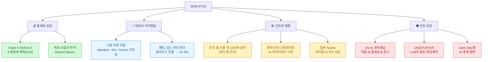
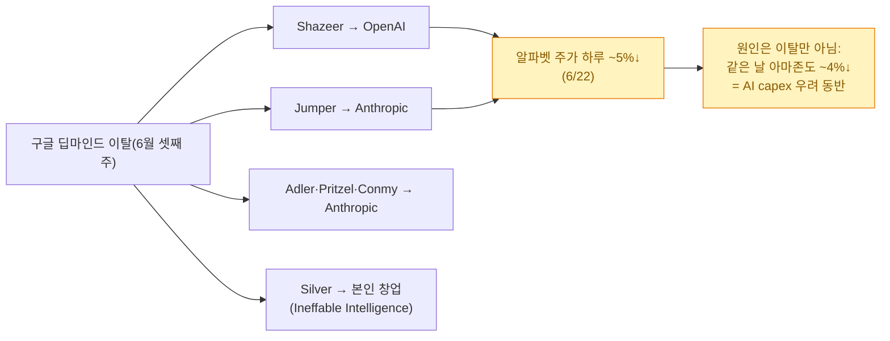
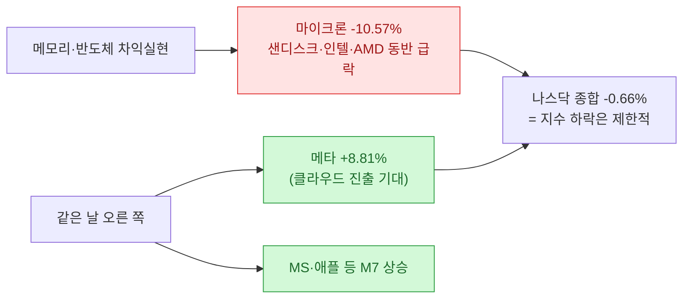

[[ai-llm-it-news-2026-07-01|어제 글]]은 "모델과 에이전트가 어떻게 더 싸지고 자율적으로 변하는가"로 끝났다. 오늘 하루를 긁어 보니, 무게중심이 한 겹 더 위로 올라가 있었다 — **"그 모델을 누가 쓰게 할 것인가(접근·통제)"**와 **"그걸 돌릴 인프라를 누가 쥘 것인가(반도체·전력·클라우드)"**. 모델 자체보다 그 앞뒤의 **빗장과 배관**이 뉴스의 주인공이었다.

확인 기준은 **2026년 7월 2일 KST**다. 어제 저녁부터 오늘까지 새로 확인한 이슈를 8개 각도로 긁어 모은 뒤, **11건을 1차 출처로 교차검증한 정정 버전**으로 적는다(자주 틀리게 옮겨지는 부분은 ⚠️로 표시했다). 이번에도 팩트체크는 이슈마다 **독립 에이전트를 하나씩** 붙여 '기사를 모으는 쪽'과 '검증하는 쪽'을 분리했다 — 마침 어제 쓴 [[fable5-maker-checker-separation-setup|maker≠checker]] 방법을 이 글에 그대로 적용한 셈이다.

## 오늘 한 줄 요약

내가 본 핵심은 이거다. **어제가 "모델"의 날이었다면, 오늘은 그 모델을 감싼 "빗장과 배관"의 날이었다.** 접근을 열고 닫는 정부, 인재가 빠져 흔들리는 회사, 남는 연산을 파는 회사, 전력을 원자로로 대는 회사 — 화제가 전부 모델 바깥의 층으로 옮겨 갔다.

## Fable 5는 다시 열렸나? (내가 쓴 글의 후일담)

바로 어제 [[fable5-from-instructing-agents-to-designing-loops|Fable 5 이야기]]를 쓰면서도 마음 한켠이 찜찜했는데, 오늘 그 배경이 정리됐다. **미국 상무부가 6월 30일 Anthropic의 Fable 5·Mythos 5에 걸었던 수출통제를 해제**하면서, 6월 12일 시작된 몇 주간의 접근 차단 사태가 일단락됐다. Fable 5는 7월 1일부터 Claude·Claude.ai·Claude Code에서 전 세계 이용자에게 다시 제공된다.

> ⚠️ 헤드라인이 "트럼프가 풀었다"로 뭉뚱그려지지만 정확히는 세 가지를 짚어야 한다. (1) 조치 주체는 **상무부(러트닉 장관)**이고, Anthropic이 **보안 위험 사전 탐지·정부 협력·악성활동 보고**를 약속한 대가다. (2) **두 모델이 똑같이 전면 개방된 게 아니다** — 일반 개방은 **Fable 5뿐**이고, **Mythos 5는 여전히 Glasswing 프로그램의 선별된 파트너 한정**(확대는 진행 중). (3) 애초 통제의 발단은 **Amazon 연구진이 발견한 Fable 5 가드레일 우회(jailbreak) 보고**였고, 업계는 이번 결과를 항구적 규칙이 아니라 **개별 사안 합의(사실상 휴전)**로 본다.

## 특화 모델이 프런티어에 반격한다? — Base44 'Base1'

6월 29일, Wix 산하 바이브코딩 플랫폼 **Base44가 자체 모델 'Base1'을 출시**했다. 오픈소스 파운데이션 모델을, 자사 플랫폼의 **수천만 건 실사용 상호작용 데이터**(무엇을 만들었고, 무엇이 깨졌으며, 사용자가 수락·거부했는지)로 파인튜닝한 도메인 특화 모델이다. "범용 프런티어 모델 vs 데이터 해자를 두른 특화 모델"이라는 오래된 긴장이, 코딩 영역에서 다시 불붙었다.

> ⚠️ 씨앗 기사 제목의 **"UI 생성 특화"는 과장**이다. TechCrunch·The Next Web에 따르면 Base1은 UI 전용이 아니라 대화·멀티턴 요청·코드 작성·툴 사용·백엔드까지 처리하는 **범용 바이브코딩 에이전트**이고, 완전 신규 모델이 아니라 **오픈소스 모델 파인튜닝**이며, GPT-5.5·Claude Opus 4.8과 나란히 모델 선택기에서 고를 수 있다.

## 구글은 왜 흔들렸나? — 인재 이탈과 Gemini 지연설

6월 셋째 주, 구글 딥마인드에서 시니어 연구자들이 잇따라 나갔다. 제미나이 공동 리드이자 트랜스포머 논문 공저자인 **Noam Shazeer(→OpenAI, 6/18 발표)**, 2024년 노벨 화학상 수상자 **John Jumper(→Anthropic)** 등이다. 이 소식에 **6월 22일 알파벳 주가는 하루 약 5% 급락**(1년여 만의 최악)했다.

> ⚠️ 여기가 가장 많이 틀리게 옮겨진다. (1) 흔히 도는 **"시총 2,700억 달러 증발"은 하루가 아니라 2거래일 누적** 수치이고, 단일일 낙폭은 약 5%다. (2) 하락을 **인재 이탈 탓만으로 돌리는 건 과장** — 같은 날 아마존도 약 4% 빠지는 등 하이퍼스케일러 전반의 **AI 자본지출(capex) 우려**가 함께 작용했다. (3) **Gemini 3.5 Pro의 '7월 지연'은 언론 보도(추정)일 뿐 구글 공식 확인이 없다**(대변인 논평 거부). 피차이는 I/O에서 "다음 달"이라 했을 뿐이고, 이탈과의 인과도 확정이 아니다.

## 메타는 왜 급등했나? — 남는 연산을 파는 클라우드

같은 7월 1일, 반대편에서 **메타가 8~9% 급등**했다. 블룸버그가 **메타가 잉여 AI 연산을 파는 클라우드 사업을 추진 중**(일부 매체는 'Meta Compute'로 명명)이라고 보도하면서다. AWS·Azure에 정면으로 도전하고 CoreWeave·Nebius 같은 신흥 GPU 클라우드를 위협하는 그림이다. 인프라 지출만 커지던 회사가 **그 인프라를 매출원으로 돌린다**는 신호에 투자자들이 반응했다.

> ⚠️ 'Meta Compute'라는 **공식 제품명은 확정 보도가 아니다**(Reuters·CNBC는 그냥 'cloud business'로 표기, 명칭은 Eastern Herald 등 일부 매체). 출처의 뿌리는 블룸버그 단독 보도이고, 메타의 공식 발표가 아니라 **보도에 대한 시장 반응**이라는 점을 감안해서 읽어야 한다.

여기서 오늘의 반도체 장세와 그림이 맞물린다. 아래를 보라.

## 그래서 7월 1일 증시는 무슨 일이 있었나? — 메모리에서 '탈출'한 돈

**7월 1일(현지시간) 뉴욕증시는 3분기 첫 거래일에 AI 반도체주 차익실현으로 약세**였다. 마이크론이 약 10%대 급락(정확히는 10.57%), 샌디스크 -10.6%, 인텔 -9.03%, AMD -6.89%. 그런데 나스닥 종합은 -0.66%에 그쳤다.

> ⚠️ "기술주가 약세 마감"은 과장이다. 실제로는 **AI 메모리주에 집중된 차익실현**이었고, 엔비디아를 뺀 M7(메타 +8.81%, MS +3.02%, 애플 +1.73% 등)은 오히려 올라 지수 추가 하락을 막았다. 게다가 이 급락은 **6월 D램·낸드 계약가가 각각 약 3%·2.4% 오른** 상황에서도 나왔다 — 펀더멘털 악화가 아니라 **자금 회전**(메모리 → 메타 클라우드 같은 다음 테마)의 성격이 짙다.

## 한국은 반도체로 무슨 기록을 세웠나?

**한국의 6월 수출이 사상 처음으로 월 1000억 달러를 돌파**했다. 총 1022억 5000만 달러(전년 동월 대비 +70.9%)로, 독일·중국·미국에 이은 세계 4번째 기록이다. **반도체 수출이 448억 2000만 달러(+199.5%)로 사상 최대**를 찍으며 견인했고, 무역수지도 361억 5000만 달러로 처음 300억 달러를 넘었다.

| 항목 | 2026년 6월 | 비고 |
|---|---|---|
| 총수출 | 1022억 5000만 달러 (+70.9%) | 월간 사상 첫 1000억 달러 돌파 |
| 반도체 수출 | 448억 2000만 달러 (+199.5%) | 사상 최대, 총수출의 약 43.8% |
| 무역수지 | 361억 5000만 달러 | 처음 300억 달러 초과 |

> ⚠️ 70.9%라는 이례적 증가율은 실제 산업통상자원부 발표치가 맞다(전년 6월 기저 + AI 서버용 HBM·DDR5 수요 급증). 매체마다 총수출을 '1023억', 반도체를 '448억'으로 반올림해 조금씩 다르게 적는다.

## 엔비디아가 원자로로 데이터센터를 돌렸다고?

**7월 1일, 원자력 스타트업 Valar Atomics가 Nvidia와 협력해 유타주 오렌지빌에서 소형 원자로 'Ward250'으로 전력을 공급하는 AI 데이터센터를 시연**했다고 발표했다. 양사는 이를 "첨단 원자력이 AI에 직접 전력을 공급한 첫 사례"로 소개했다. 데이터센터의 진짜 병목이 칩이 아니라 **전력**이라는 걸 상징적으로 보여준 장면이다.

> ⚠️ '파트너십'이라는 헤드라인과 달리 현 단계는 **상용이 아니라 시연**이다. Ward250은 6월 18일 임계에 도달했지만 현재 출력은 **100kW에 불과**하고, 상업 발전 전 NRC 인허가가 필요하다. 함께 언급된 '30MW 데이터센터'도 확정 개발이 아니라 **함께 검토 중인 목표치**다.

## 일본은 어떤 AI를 만들려는가? — 'Noetra'와 피지컬 AI

**일본 경제산업성(METI)과 NEDO가 6월 30일, 소프트뱅크가 주도하고 NEC·소니·혼다가 참여하는 신설 회사 'Noetra'와 국책연구기관 AIST에 국산 파운데이션 모델 개발을 위탁**한다고 발표했다. 올해 3,873억 엔(약 23억 달러)을 시작으로 **5년간 최대 1조 엔(약 61억 달러)**을 지원한다.

> ⚠️ 프레이밍을 조심해야 한다. (1) 'Noetra'는 이니셔티브명이 아니라 **소프트뱅크가 최대주주로 세운 신설 회사(컨소시엄)** 이름이고, 정부가 직접 만든 조직이 아니라 **METI/NEDO가 이 민간 컨소시엄+AIST에 위탁·자금지원**하는 구조다('정부 주도'보다 '정부 후원·위탁'). (2) 목표는 OpenAI식 범용 LLM이 아니라 언어·이미지·영상·센서를 결합한 로봇·제조용 **'피지컬 AI'**(약 1조 파라미터 목표)다. '주권 AI'는 일부 해외 매체의 태그이고, 현지 표현은 '국산 AI 파운데이션 모델'·'피지컬 AI'다.

## UN은 무엇을 경고했나? — 자율 AI의 '통제 상실'

**유엔의 AI 독립 국제 과학 패널(공동의장 요슈아 벤지오·마리아 레사, 과학자 40명)이 7월 1일 첫 예비 보고서를 발표**했다. 점점 자율화되는 AI 시스템에 대한 **통제력 상실, 기만적 행동, AI 에이전트의 지시 위반** 위험을 경고하는 내용이다. 공교롭게도 내가 요즘 붙들고 있는 [[the-coming-loop-armin-ronacher-harness-critique|루프의 통제]] 문제와 정확히 같은 자리를 가리킨다 — 자율성이 올라갈수록, **판단과 감독을 어디에 남길 것인가**가 관건이라는.

> ⚠️ 씨앗 기사의 표현 '스스로 목표를 추구하는(goal-seeking) AI'는 원 보고서의 정확한 인용이 아니라 **의역**이다. 보고서 원문은 'highly autonomous AI systems', 'loss of control', 'deceptive AI behaviour' 같은 표현을 쓴다. 취지는 같으나 문구를 인용처럼 옮기지 않는 게 안전하다.

## LLM이 직접 랜섬웨어를 돌렸다? — JADEPUFFER

가장 서늘한 소식. **보안업체 Sysdig가 7월 1일 공개한 'JADEPUFFER'는 거의 사람 개입 없이 LLM이 주도한 자동화(에이전틱) 랜섬웨어 공격**이다. MinIO 기본 자격증명(minioadmin)으로 저장소 자격증명을 털고, Alibaba Nacos의 인증우회 취약점과 공개된 기본 JWT 서명키를 악용해 프로덕션 MySQL을 침해했다(초기 진입은 Langflow 취약점). [[fable5-maker-checker-separation-setup|어제 글]]에서 "공격자도 루프를 돌린다"고 적었는데, 그게 이렇게 빨리 실물로 왔다.

> ⚠️ 현재로선 사실상 **Sysdig 단일 벤더의 조사·명명(JADEPUFFER)**이며 독립 확증은 제한적이다. 다만 각 구성요소(MinIO 기본 크리덴셜, Nacos CVE-2021-29441, Langflow CVE-2025-3248)는 알려진 실재 취약점이다.

## 기업은 어떻게 막나? — Jamf의 Mac용 'AI Governance'

방어 쪽 소식도 있다. **Jamf가 6월 30일 Mac용 네이티브 AI 통제 평면 'AI Governance'를 정식 출시(GA)**했다. macOS에서 실행되는 AI 도구를 발견·통제하고 감사 리포트를 만들어, 기업이 관리하는 Mac에서의 AI 사용을 통제한다. 출시 시점 기준 **Claude Code·Claude Desktop·OpenAI Codex를 우선 지원**한다 — 코딩 에이전트가 사내에 퍼지면서, 그걸 '관리'하는 계층이 제품으로 등장하기 시작했다.

> ⚠️ 대상은 'Apple 기기' 전반이 아니라 **Mac(macOS) 전용**이다(iPhone/iPad는 초기 범위 밖). 'first-of-its-kind'는 Jamf 자체 마케팅 표현이니 단정 인용은 피한다. 발표는 6월 17일, 실제 일반 공급은 6월 30일이다.

## 마무리 — 오늘 하루를 한 문장으로

**미국 정부의 접근·수출 통제 국면과 맞물려, 프런티어 모델 출시 경쟁과 AI 인프라(반도체·전력·클라우드) 재편이 하루를 관통했다.** 모델은 어제 다 나왔고, 오늘은 그 모델을 **누가 쓰게 하고(빗장)**, **무엇으로 돌릴지(배관)**가 다퉈진 날이었다. 실무자 입장에선 모델 이름을 좇기보다, 그 앞뒤의 **접근 정책·전력·연산 공급**이 어디로 흐르는지를 보는 게 더 실속 있다.

## 참고자료

- Fable/Mythos: [Anthropic — Redeploying Fable 5](https://www.anthropic.com/news/redeploying-fable-5) · [Politico](https://www.politico.com/news/2026/06/30/anthropic-wh-lifting-export-limits-00980865)
- 구글 인재 이탈: [CNBC — Alphabet stock & AI departures](https://www.cnbc.com/2026/06/22/alphabet-goog-stock-ai-departures.html)
- 메타 클라우드: [Reuters](https://www.reuters.com/business/meta-sell-excess-ai-computing-capacity-via-cloud-business-bloomberg-news-reports-2026-07-01/)
- 7/1 증시·마이크론: [연합뉴스](https://www.yna.co.kr/view/AKR20260702005551072)
- 한국 수출: [The Korea Herald](https://www.koreaherald.com/article/10794801)
- Valar+Nvidia: [Reuters](https://www.reuters.com/business/energy/valar-nuclear-startup-partners-with-nvidia-data-center-aiming-conserve-water-2026-07-01/)
- 일본 Noetra: [The Japan Times](https://www.japantimes.co.jp/business/2026/06/30/companies/physical-ai-meti-aid-model/)
- UN 패널: [United Nations — Preliminary Report](https://www.un.org/independent-international-scientific-panel-ai/en/preliminary-report)
- Base44 Base1: [TechCrunch](https://techcrunch.com/2026/06/29/vibe-coding-platform-base44-launches-own-model-as-ai-startups-seek-defensibility/)
- JADEPUFFER: [Sysdig TRT](https://www.sysdig.com/blog/jadepuffer-agentic-ransomware-for-automated-database-extortion)
- Jamf AI Governance: [Jamf 보도자료](https://www.jamf.com/resources/press-releases/jamf-launches-ai-governance-a-first-of-its-kind-native-ai-control-plane-for-mac/)
- 관련(내 글): [[ai-llm-it-news-2026-07-01|어제 다이제스트]] · [[fable5-from-instructing-agents-to-designing-loops|Fable 5: 지시에서 목표로]] · [[fable5-maker-checker-separation-setup|maker≠checker 세팅법]]

<!-- 안전: 회사 실데이터·고객/제3자 PII·API키/쿠키/토큰 없음. 외부 자료는 요약·논평 + 1차 출처 링크. 수치·날짜는 이슈별 독립 에이전트(maker≠checker)로 교차검증하고 정정은 ⚠️로 표기. -->
