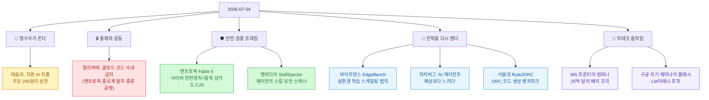
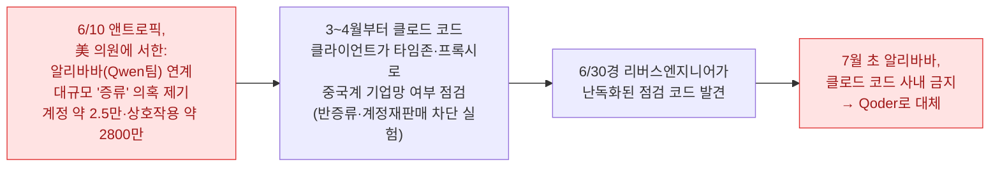
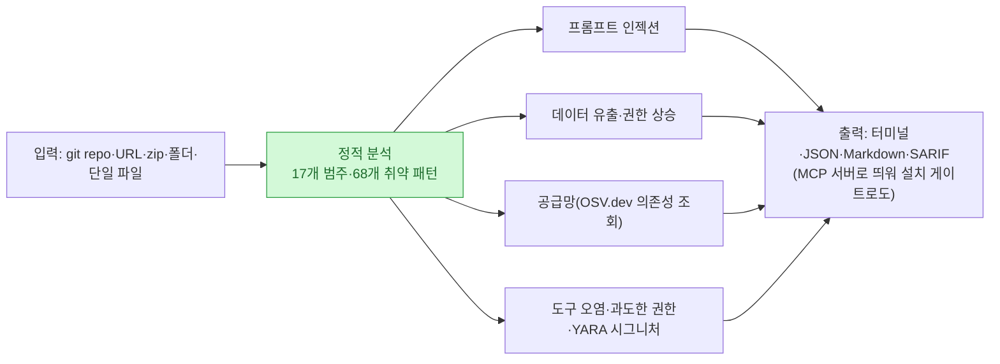

[[ai-llm-it-news-2026-07-02|그저께 글]]은 "모델을 누가 쓰게 하고(빗장), 무엇으로 돌릴지(배관)"로 끝났다. 오늘 하루를 긁어 보니 무게중심이 또 한 겹 이동해 있었다 — **"그 모델을 쓰는 값을 누가 내고(청구서), 마음대로 못 쓰게 어떻게 막을 것인가(통제·검증)"**. 모델은 이미 사방에 퍼졌고, 이제 뉴스의 주인공은 **비용·통제·검증**이라는 관리 층으로 내려왔다.

확인 기준은 **2026년 7월 4일 KST**다. 어제부터 오늘까지 새로 확인한 이슈를 각도별로 긁어 모은 뒤, **9건을 1차 출처로 교차검증한 정정 버전**으로 적는다. 이번에도 이슈마다 **독립 검증 에이전트를 하나씩** 붙여 '기사를 모으는 쪽'과 '따지는 쪽'을 분리했다 — 요전에 정리한 [[fable5-maker-checker-separation-setup|maker≠checker]] 방식 그대로다. 자주 틀리게 옮겨지는 대목은 ⚠️로 표시했다.

## 오늘 한 줄 요약

내가 본 핵심은 이거다. **모델을 마구 도입한 다음 날 아침, 회사들은 청구서와 리스크를 함께 받아 들었다.** 토큰 값을 묶는 회사, 경쟁사 코딩 도구를 금지하는 회사, 탈옥·악성 스킬을 점수 매겨 걸러 내는 회사 — 화제가 전부 "쓰게 만드는" 단계에서 "관리하는" 단계로 넘어갔다.

## 테슬라는 왜 직원 AI 지출에 상한을 걸었나?

가장 실무적인 소식부터. **테슬라가 7월 6일부터 직원 1인당 AI 사용 비용을 주당 200달러(약 30만 6천 원)로 제한**한다. 초과하려면 관리자 승인을 받아야 한다. The Information이 내부 공지를 근거로 보도했고, Electrek 등이 확인했다. 배경은 단순하다 — 일부 소프트웨어 엔지니어가 **매주 수천 달러어치 토큰**을 태우고 있었고, 팀마다 직원별 토큰 사용량 순위를 매기는 대시보드까지 만들었다.

에이전트가 여러 단계를 자동으로 밟으면 토큰이 폭증한다. 그래서 예전에 클라우드 비용을 관리하던 **FinOps**(재무+운영을 합쳐 클라우드 지출을 통제하는 방법론) 발상을 AI 운영에 그대로 옮기는 흐름이 나오고 있다. 우버는 월 1,500달러 상한을 뒀고, 메타·아마존·월마트도 비슷한 통제를 도입한 것으로 전해진다.

> ⚠️ 두 가지 정정. (1) 사용량 계산에서 빠지는 **예외는 'xAI 베타 제품'(Grok/Composer 계열)** 이다 — 그냥 "자체 제품 베타 테스트"가 아니라, 사실상 **머스크 본인 AI 쪽으로 몰아주는 설계**다(테슬라 엔지니어들은 오히려 앤트로픽 클로드를 선호한다는 보도가 함께 나왔다). (2) 'AI FinOps'라는 표현은 원 보도에 없다 — 애널리스트·요약 매체가 붙인 프레임이다.

## 알리바바는 왜 '클로드 코드'를 사내에서 금지했나?

여기가 오늘 가장 복잡하고, 가장 많이 틀리게 옮겨진 이슈다. **알리바바가 사내 제한 소프트웨어 목록에 클로드 코드(Claude Code)를 올리고, 7월 10일부터 업무 사용을 중단**시켰다. 대신 자체 코딩 도구 **Qoder**를 쓰게 했다. 중국 매체 이차이(第一财经)가 먼저 보도했고 로이터가 소식통을 인용해 받았다.

핵심은 **인과의 순서**다. 헤드라인만 보면 "앤트로픽이 중국 이용자를 몰래 추적 → 알리바바가 반발"처럼 보이는데, 1차 출처를 따라가면 순서가 반대에 가깝다.

즉, **증류 의혹을 먼저 제기한 쪽은 앤트로픽**이고(6월 10일 美 의원 서한), 그 맥락에서 클로드 코드 클라이언트가 **이용자의 타임존·프록시 설정을 숨겨진 목록과 대조**하는 코드가 3\~4월부터 들어가 있었다. 앤트로픽 팀원은 이를 "계정 재판매·증류를 막기 위한 남용 방지 실험이며 다음 릴리스에서 제거하겠다"고 설명했다. 알리바바의 금지 조치는 이 싸움의 **하류(보복)**에 가깝다.

> ⚠️ 조심할 점. (1) 로이터는 **소식통 인용 보도**이지, '백도어·스파이웨어'를 독립 확인한 게 아니다 — "로이터가 스파이웨어를 확인했다"는 과장이다. (2) 문제의 탐지는 앤트로픽 팀 설명 기준 **반증류·남용 방지 점검**이지 이용자 '추적' 상품이 아니다('백도어'는 비판 측 프레이밍이며 다툼이 있다). (3) 수치는 매체마다 갈린다 → **계정 약 2.5만 개 / 상호작용 약 2,800만 건**으로 적는 게 안전하다.

## 앤트로픽은 탈옥을 어떻게 '점수'로 만들었나?

같은 앤트로픽에서 방어 쪽 소식이 나왔다. **7월 2일, 'Fable 5의 사이버 안전장치와 탈옥 프레임워크'를 공식 공개**했다(제목: *More details on Fable 5's cyber safeguards and our jailbreak framework*). 두 축이다.

첫째, 사이버 관련 요청을 **네 등급으로 분류**해 보안 업무는 살리되 악용은 막는다.

| 등급 | 성격 |
|---|---|
| Prohibited use | 금지 — 명백한 악용 |
| High-risk dual use | 고위험 이중용도 |
| Low-risk dual use | 저위험 이중용도 |
| Benign use | 정상 보안 업무 |

둘째, 탈옥의 위험도를 재는 **CJS(Cyber Jailbreak Severity)** 프레임이다. 능력 상승(0\~4)·영향 범위(0\~2)·무기화 용이성(0\~2)·발견 난도(0\~2)를 합쳐 아래 밴드로 나눈다.

| 밴드 | 점수 | 뜻 |
|---|---|---|
| CJS-0 Informational | 0 | 정보성 |
| CJS-1 Low | 1\~3.5 | 낮음 |
| CJS-2 Medium | 4\~6.5 | 중간 |
| CJS-3 High | 7\~8.5 | 높음 |
| CJS-4 Critical | 9\~10 | 심각 |

Glasswing 파트너(아마존·마이크로소프트·구글)와 함께 만들었고, HackerOne 버그바운티도 붙였다.

> ⚠️ 이건 **확정 표준이 아니라 피드백을 받는 초안**이다. 그리고 CJS는 모델 전반의 안전 등급이 아니라 **'탈옥 심각도'를 재는 점수 척도**라는 점을 헷갈리면 안 된다. 날짜는 **7월 2일**이 맞다.

## 엔비디아는 왜 '스킬 검사기'를 내놨나?

에이전트 생태계의 급소는 스킬·MCP 같은 **외부 확장물**이다. 남이 만든 스킬 하나를 설치했다가 프롬프트 인젝션·데이터 유출을 당할 수 있다. **엔비디아가 공개한 SkillSpector는 에이전트 스킬을 '설치 전에' 정적 분석으로 검사하는 보안 스캐너**다(공식 NVIDIA 깃허브, Apache-2.0).

프롬프트 인젝션·데이터 유출·권한 상승·공급망(OSV.dev로 의존성 실시간 조회)·도구 오염 등 **17개 범주 68개 패턴**을 훑고, 필요하면 LLM 의미 분석까지 켠다. 스스로 MCP 서버로 떠서 설치 게이트 역할도 한다. [[codebase-memory-mcp-knowledge-graph|코드베이스를 지식 그래프로 인덱싱]]하던 흐름과 짝을 이루는, "에이전트 확장물을 관리하는 계층"의 등장이다.

> ⚠️ '클로드 스킬 전용'이 아니다 — **클로드 코드·Codex·Gemini CLI를 아우르고 MCP 서버까지** 검사한다. 그리고 아직 **정식 릴리스 태그가 없다**(소스에서 설치). "출시된 버전 제품"으로 단정하면 성숙도를 과장하는 셈이다.

## 스케일링은 정말 벽에 부딪혔나? — 바이트댄스 EdgeBench

"더 큰 모델·더 많은 데이터"라는 기존 스케일링이 둔화됐다는 이야기가 많다. **바이트댄스 Seed팀이 공개한 EdgeBench는 다른 축의 스케일링 법칙을 제시**한다 — 단발 정확도가 아니라 **에이전트가 실제 실행 환경에서 피드백을 받으며 오래 학습할 때** 성능이 어떻게 오르는지다. 공식 저장소 부제부터가 "실세계 환경 학습의 스케일링 법칙 규명"이다.

- 6개 도메인 **134개 실세계 과제**(공개 51개), 2\~12시간 시간 예산으로 평가.
- 성능이 **상호작용 시간에 대한 로그-시그모이드 함수**로 잘 들어맞았다(R²=0.998, 약 3만 8천 시간 실행 데이터).

> ⚠️ 두 대목이 국내 보도에서 왜곡됐다. (1) **"72시간"은 틀리다** — 에이전트가 도는 건 12시간+ 규모이고, 자주 인용되는 57시간대는 **사람 전문가가 과제 하나를 만드는 평균 시간**(최대 320시간)이지 에이전트 작업 시간이 아니다. (2) **"테스트타임 컴퓨트가 새 스케일링 법칙"은 헤드라인 각색**이다. 저장소가 말하는 법칙은 '실환경에서 학습(상호작용 시간)'에 대한 것이지 테스트타임 컴퓨트가 아니다. '3개월마다 2배'도 로그-시그모이드 적합의 **해석**이지 독립된 법칙 문구가 아니다.

## 저커버그는 무엇을 인정했나?

측정 이야기가 나온 김에. **저커버그가 7월 2일 사내 타운홀에서 "적어도 지난 4개월간 AI 에이전트 개발이 예상만큼 가속되지 않았다"고 공개적으로 말했다**(로이터 단독, 녹취 확인). 그는 대대적 조직 개편이 "생각만큼 깔끔하지 않았고" 새 구조에 건 베팅이 "아직 결실을 못 맺었다"고 했다. 지난 5월 약 10% 감원(약 8,000명)에 7,000명가량을 AI 조직으로 재배치한 뒤의 자기 평가다.

> ⚠️ 국내 프레이밍 "조직 개편의 한계를 인정"은 다소 센 의역이다 — 그는 베팅이 "**아직(yet)** 결실을 못 맺었다"며 **성과 지연**을 말했지 개편 자체를 부정하진 않았다(3\~6개월 내 효과 기대). '4개월'과 개편 연결은 정확하다.

## 서울대는 반도체 검증을 어떻게 AI에 맡겼나?

국내 연구 소식. **서울대 송현오 교수팀이 반도체 설계 규칙 검사(DRC) 자동화를 겨눈 'Rule2DRC'를 냈다.** 제조 전 칩은 수천 개 설계 규칙 위반 여부를 검사해야 하는데, 사람이 '글로 쓰인 규칙'을 '검사 코드'로 옮기는 일이 병목이다. Rule2DRC는 이걸 LLM이 하도록 겨눈다.

> ⚠️ 세 가지 정정. (1) **삼성은 공동 개발이 아니다** — 논문·저장소 저자는 전원 서울대(MLLab)이고, 삼성 엔지니어는 문제 정의에 자문한 정도다("삼성 AI센터가 개발"은 오귀속). (2) Rule2DRC는 사실상 **벤치마크**다(자연어 규칙→DRC 스크립트 1,000개 과제, 13,921개 레이블 레이아웃으로 '실행 채점'). 에이전트 기여물의 이름은 **SplitTester**(판별 테스트케이스를 만들어 Best-of-N 선택을 돕는 테스터)다. (3) "AI가 DRC를 다 짠다"는 해결 선언이 아니다 — 현재 LLM들은 이 벤치마크를 아직 풀지 못하며, 논문은 선택 정확도 개선을 보고한다. 발표 무대도 EDA 학회가 아니라 **ICML 2026**이다.

## 빅테크는 오늘 무엇을 움직였나?

두 건을 묶어 짧게. 단, **국내 보도가 자주 하나로 뭉뚱그리는 마이크로소프트의 두 발표는 서로 다른 사안**이라 갈라서 본다.

- **① MS '프론티어 컴퍼니'(공식·확정)**: 7월 2일, 마이크로소프트가 **25억 달러**와 엔지니어·전문가 **6,000명**을 투입해 고객사 내부에 파고들어 AI 도입을 돕는 조직을 발표했다. OpenAI·앤트로픽·AWS의 도입 지원 조직에 맞서는 **엔터프라이즈 배치 컨설팅 팔**이다.
- **② 코파일럿 '슈퍼앱' 통합(보도·비공식)**: 소비자용과 기업용 코파일럿을 하나로 합쳐 코딩·자율 에이전트까지 담고 **여름 말(대략 8월)** 내는 계획이 내부 문서 기반으로 보도됐다 — MS 공식 발표가 아니다.

> ⚠️ ①과 ②는 **별개 발표**다. 25억 달러 프론티어 컴퍼니는 슈퍼앱이 아니라 **배치 조직**이고, 슈퍼앱 '8월'은 **보도된 내부 목표**이지 확정 출시일이 아니다.

그리고 **구글의 차기 '제미나이 플래시' 정황** — 7월 1일 LM아레나에 정체 미상의 새 플래시 체크포인트가 올라와 초기 사용자들이 "품질 차이가 느껴진다"고 평했다(TestingCatalog). 다만 개선은 '세대 교체라기보다 점진적'이라는 평이라 커뮤니티는 '4'보다 '3.6'쪽으로 본다.

> ⚠️ '출시 임박'은 **추정**이다 — 구글이 모델을 확인해 준 바 없고 사라질 수 있는 내부 빌드일 수 있다. 체크포인트 포착은 사실, 출시 주장은 추측이다.

## 마무리 — 오늘 하루를 한 문장으로

**모델 확산이 일단락되자, 하루의 주제가 전부 그 뒤의 청구서(비용)·통제(지정학·금지)·검증(안전 프레임·스킬 스캐너·새 벤치마크)로 내려왔다.** 테슬라는 값을 묶고, 알리바바는 도구를 막고, 앤트로픽·엔비디아는 위험을 점수로 매기고, 바이트댄스·서울대는 진척을 다시 재는 자를 내놨다. 실무자 입장에선 새 모델 이름을 좇기보다 — **내 토큰 청구서, 내가 쓰는 에이전트의 출처와 권한, 성과를 재는 기준**을 먼저 챙기는 게 오늘 뉴스의 실속 있는 독법이다.

## 참고자료

- 테슬라 AI 지출 상한: [The Information](https://www.theinformation.com/articles/tesla-caps-employee-ai-spend-200-per-week-adoption-push) · [Electrek](https://electrek.co/2026/07/02/tesla-caps-employee-ai-spending-200-week/)
- 알리바바 클로드 코드 금지: [Reuters(US News 게재)](https://www.usnews.com/news/top-news/articles/2026-07-03/alibaba-to-ban-claude-code-in-workplace-over-alleged-backdoor-risks-source-says) · [증류 의혹 배경](https://cybermagazine.com/news/inside-anthropics-claims-of-distillation-attack-by-alibaba) · [탐지 코드 분석(TNW)](https://thenextweb.com/news/alibaba-bans-claude-code-alleged-backdoor-risk)
- Fable 5 CJS: [Anthropic 공식](https://www.anthropic.com/news/fable-safeguards-jailbreak-framework)
- 엔비디아 SkillSpector: [NVIDIA/SkillSpector (GitHub)](https://github.com/NVIDIA/SkillSpector)
- 바이트댄스 EdgeBench: [ByteDance-Seed/EdgeBench (GitHub)](https://github.com/ByteDance-Seed/EdgeBench) · [SCMP](https://www.scmp.com/tech/big-tech/article/3359373/chinas-bytedance-discovers-new-scaling-law-could-sustain-ai-boom)
- 저커버그 발언: [Reuters(Investing 게재)](https://www.investing.com/news/stock-market-news/exclusivezuckerberg-says-ai-agent-development-going-slower-than-expected-4774063) · [TechCrunch](https://techcrunch.com/2026/07/02/mark-zuckerberg-tells-staff-that-ai-agents-havent-progressed-as-quickly-as-hed-hoped/)
- 서울대 Rule2DRC: [arXiv:2605.15669](https://arxiv.org/abs/2605.15669) · [snu-mllab/Rule2DRC (GitHub)](https://github.com/snu-mllab/Rule2DRC)
- MS 프론티어 컴퍼니: [CNBC](https://www.cnbc.com/2026/07/02/microsoft-commits-2point5-billion-6000-employees-ai-implementation-unit.html) · [GeekWire](https://www.geekwire.com/2026/microsoft-announces-2-5b-frontier-company-to-embed-ai-engineers-inside-customers/)
- 구글 제미나이 플래시: [TestingCatalog](https://www.testingcatalog.com/google-might-be-testing-gemini-flash-upgrade-on-lm-arena/)
- 관련(내 글): [[ai-llm-it-news-2026-07-02|그저께 다이제스트]] · [[fable5-maker-checker-separation-setup|maker≠checker 세팅법]] · [[the-coming-loop-armin-ronacher-harness-critique|루프의 통제]]

<!-- 안전: 회사 실데이터·고객/제3자 PII·API키/쿠키/토큰 없음. 외부 자료는 요약·논평 + 1차 출처 링크. 수치·날짜는 이슈별 독립 에이전트(maker≠checker)로 교차검증하고 정정은 ⚠️로 표기. -->
