[[ai-llm-it-news-2026-07-04|지난 정리]]는 "모델은 다 퍼졌고, 이제 청구서와 통제가 온다"로 끝났다. 여드레가 지나 이번 주말을 긁어 보니 무게중심이 또 한 겹 이동해 있었다 — 이제 뉴스의 주인공은 **돈(자본) 그 자체**다. 반도체는 뉴욕 자본시장으로 넘어갔고(SK하이닉스 ADR), 빅테크는 수백억 달러 규모 AI 인프라 자금을 한 번에 당겼으며(구글), 경쟁의 전선은 '모델'에서 '하드웨어·인재'로 옮겨 붙었다(애플 대 OpenAI). 한 문장으로 줄이면 이렇다 — **자본이 판을 다시 짠다.**

확인 기준은 **2026년 7월 12일 KST**다. 지난 며칠 새 확인한 이슈를 각도별로 긁어 모은 뒤, **1차 출처로 교차검증한 정정 버전**으로 적는다. 이번에도 이슈마다 **독립 검증 에이전트를 하나씩** 붙여 '기사를 모으는 쪽'과 '따지는 쪽'을 분리했다 — 요전에 정리한 [[fable5-maker-checker-separation-setup|maker≠checker]] 방식 그대로다. 자주 틀리게 옮겨지는 대목은 ⚠️로 표시했다.

## 오늘 한 줄 요약

```mermaid
flowchart TD
    D["2026-07-12"] --> CAP["💰 자본이 판을 짠다"]
    D --> FAB["🏭 증설 시계를 당긴다"]
    D --> MKT["📉 실적 좋아도 주가는 냉담"]
    D --> MODEL["🤖 모델·에이전트"]
    D --> WAR["⚖️ 하드웨어·인재 전선"]
    D --> KR["🇰🇷 국내 플랫폼"]
    CAP --> C1["SK하이닉스, 나스닥 ADR 입성<br/>최태원 오프닝 벨"]
    CAP --> C2["구글, 상향된 약 847억 달러 조달<br/>버크셔 100억 달러 앵커"]
    FAB --> F1["삼성 용인 1호팹 양산<br/>2년 앞당김·호남 단지"]
    FAB --> F2["SK 최태원 '美 추가투자 검토'<br/>중국 CXMT 추격"]
    MKT --> M1["삼성 사상 최대 실적에도 냉담<br/>'칩의 시간' 교체론"]
    MKT --> M2["외국인 반도체 9.6조 순매도<br/>개인은 SK하이닉스 매수"]
    MODEL --> O1["OpenAI GPT-5.6<br/>Sol·Terra·Luna + ChatGPT Work"]
    MODEL --> O2["OpenAI Atlas 브라우저 종료<br/>ChatGPT 앱·크롬 확장으로"]
    WAR --> W1["애플, OpenAI 제소<br/>영업비밀·io Products 하드웨어"]
    KR --> K1["네이버·카카오 하반기<br/>AI 전략 평가 엇갈림"]
    classDef cap fill:#fff3bf,stroke:#e67700,color:#8a5a00;
    classDef fab fill:#e7f5ff,stroke:#1c7ed6,color:#10548f;
    classDef mkt fill:#ffe3e3,stroke:#e03131,color:#a01818;
    classDef model fill:#d3f9d8,stroke:#2f9e44,color:#1d6b2c;
    classDef war fill:#ffe8cc,stroke:#e8590c,color:#a03a04;
    classDef kr fill:#f3f0ff,stroke:#7048e8,color:#4b2fa8;
    class C1,C2 cap;
    class F1,F2 fab;
    class M1,M2 mkt;
    class O1,O2 model;
    class W1 war;
    class K1 kr;
```

내가 본 핵심은 이거다. **지난주가 "모델을 쓰는 값을 누가 내나(청구서)"였다면, 이번 주말은 "그 값을 대는 돈이 어디서 오고 어디로 흐르나(자본)"로 넘어갔다.** 칩 회사는 뉴욕 증시로 창구를 넓히고, 검색 회사는 수백억 달러를 한 번에 당겨 인프라에 붓고, 스마트폰 회사는 AI 회사를 하드웨어·인재 문제로 법정에 세웠다. 화제가 전부 '기술'에서 '돈과 사람'으로 내려왔다.

## SK하이닉스는 왜 뉴욕 나스닥으로 갔나?

가장 상징적인 소식부터. **SK하이닉스가 7월 10일(현지시간) 미국 뉴욕 나스닥에 입성**했다. 최태원 SK 회장과 곽노정 대표가 타임스스퀘어 나스닥 마켓사이트에서 '오프닝 벨'을 울렸고, 전광판엔 "Welcome To Nasdaq"이 걸렸다. 연합뉴스·조선일보·경향신문 등이 일제히 확인했다. 명분은 분명하다 — **글로벌 AI 큰손(빅테크·데이터센터 고객)이 몰려 있는 미국 자본시장에 얼굴을 들이밀어, HBM(고대역폭 메모리) 수요처와 더 가까이 붙겠다**는 것이다.

> ⚠️ 여기서 가장 많이 헷갈리는 대목. 이건 **ADR(American Depositary Receipt, 미국주식예탁증서) 상장**이지, 본주(本株)를 미국으로 옮기는 이전상장도, 신주를 파는 IPO도 아니다. ADR은 '해외 주식을 미국 예탁기관이 대신 보관하고, 그 보관증서를 미국 증시에서 거래하게 한 것'이다. 즉 **코스피 상장은 그대로 두고, 미국에 거래 창구를 하나 더 낸 것**에 가깝다. "SK하이닉스가 미국으로 상장을 옮겼다"는 과장이다.

## 삼성전자는 사상 최대 실적을 내고도 왜 박수를 못 받았나?

여기가 오늘 시장의 가장 얄궂은 장면이다. **삼성전자가 사상 최대 수준의 이익을 내놨는데도 주가는 냉담**했고, 오히려 삼성전자·SK하이닉스·마이크론 같은 AI 메모리 공급망 전반에 "이제 칩의 시간이 끝나는 것 아니냐"는 물음이 붙었다. 수급도 극적으로 갈렸다 — **외국인이 삼성전자·SK하이닉스를 합쳐 약 9조 6천억 원어치를 순매도**하는 동안, 개인은 SK하이닉스를 6조 원 넘게 '줍줍'했고 기관은 삼성전자를 담았다.

왜 좋은 실적에 시장이 시큰둥할까. **주가는 '지금 얼마 버는가'가 아니라 '앞으로도 이 속도로 벌까'를 본다.** 메모리 슈퍼사이클(AI로 촉발된 초호황)이 정점 근처라는 의심, 빅테크의 AI 데이터센터 투자 계획이 흔들릴 수 있다는 관측(메타 등 실적 발표를 앞두고)이 겹치면, '사상 최대 실적'은 오히려 고점 신호로 읽힌다.

> ⚠️ "칩의 시간이 끝났다"는 건 **일부 월가 코멘트를 각색한 프레임**이지 공식 전망이 아니다. 같은 날에도 증설을 앞당기고(아래 참조) 미국 추가 투자를 검토한다는 뉴스가 함께 나왔다 — 업계는 여전히 확장에 베팅 중이다. '주도주 교체론'은 시장 심리를 옮긴 것이지 실적 악화를 확인한 게 아니다.

## 삼성·SK는 왜 지금 '증설 시계'를 앞당기나?

시장이 냉담해도 공장은 더 빨리 돈다. **삼성전자가 용인 반도체 클러스터 1호 팹(공장)의 완공·양산 일정을 2년 앞당긴다**는 단독 보도가 나왔고(머니투데이), 정부의 호남 반도체 단지 조성 논의도 함께 언급됐다. SK 쪽에선 **최태원 회장이 "미국 내 반도체 추가 투자 가능성"을 공식 언급**했다 — 인디애나주에 짓고 있는 첨단 패키징 공장에 더해서다.

배경엔 추격자가 있다. **중국 D램 업체 CXMT(창신메모리)가 조 단위 투자로 메모리 경쟁에 뛰어들면서**, 한국 업체들이 '시간'을 사려고 증설 일정을 당기는 구도다. 즉 이번 증설 러시는 호황을 즐기려는 게 아니라, **호황이 식기 전에 격차를 벌려 두려는 방어적 가속**에 가깝다.

> ⚠️ 용인 1호팹 '2년 단축'은 **단독 보도(머니투데이) 기준**이며 삼성의 공식 확정 발표로 옮기면 무겁다. 최태원의 미국 추가 투자도 "검토·가능성" 단계이지 확정된 신규 투자 결정이 아니다.

## 구글은 왜 847억 달러를 한꺼번에 당겼나?

빅테크의 자금 조달 규모가 또 한 자릿수 커졌다. **알파벳(구글)이 상향 조정된 약 847억 5천만 달러 규모의 대형 자본 조달을 확정**했다. 주식 공모에 더해 최대 400억 달러 규모 ATM(시장가 매도) 프로그램과 100억 달러 사모(私募)를 합친 총액인데, **버크셔 해서웨이가 100억 달러 사모의 앵커(주춧돌) 투자자로 참여**한 게 화제였다. 워런 버핏의 후계자 그레그 아벨이 이끄는 버크셔가 애플·알파벳으로 무게를 옮기는 흐름의 정점이다.

돈의 용처는 하나다 — **AI 인프라(데이터센터·칩·전력)**. 모델 경쟁이 '누가 더 큰 컴퓨트를 확보하느냐'로 바뀌면서, 이젠 기술 발표가 아니라 **수백억 달러를 어떻게 조달했는가**가 뉴스가 된다.

> ⚠️ 숫자 표기에 주의. 초기 헤드라인은 "800억 달러"였지만 수요가 몰려 가격이 상향돼 **총 약 847억 5천만 달러**로 프라이싱됐다(스톡트위츠 등). 버크셔의 100억 달러는 전체 조달이 아니라 **그중 사모 부분의 앵커**다 — "버크셔가 800억을 넣었다"는 오독이다.

## OpenAI의 GPT-5.6과 ChatGPT Work은 무엇을 겨냥하나?

모델 쪽에선 OpenAI가 한 방을 냈다. **7월 9일, GPT-5.6을 공식 공개**했다(공식 페이지 제목: *GPT-5.6: Frontier intelligence that scales with your ambition*). 성능 요지는 **"토큰당 더 많은 지능, 달러당 더 강한 성능"** — 샘 올트먼은 CNBC에 "에이전트 코딩에서 토큰 효율이 54% 개선됐다"고 말했다. Sol·Terra·Luna 세 갈래로 굴러가는 구성이다.

같이 나온 **ChatGPT Work가 진짜 노림수**다. ChatGPT·Codex·GPT-5.6을 하나로 묶어 **업무 워크플로를 자동화하는 기업용 에이전트**로, ZDNet은 "가격·속도·생산성에서 앤트로픽을 겨눈 것"이라고 평했다. 여기에 맞물려 **OpenAI는 자사 Atlas 브라우저를 8월 9일 종료하고**, 그 에이전트 기능을 ChatGPT 데스크톱 앱과 크롬 확장으로 흡수한다.

> ⚠️ 두 가지. (1) GPT-5.6은 **7월 9일** 발표다(오늘 나온 게 아니라, 이번 주 관통 이슈로 함께 본다). (2) Atlas '종료'는 서비스 폐기가 아니라 **기능 이전(ChatGPT 앱·크롬 확장으로 통합)**이며 종료일은 **8월 9일**이다 — "OpenAI가 브라우저 사업을 접었다"보다 "브라우저를 별도 앱에서 ChatGPT 안으로 접어 넣었다"가 정확하다.

## 애플은 왜 OpenAI를 법정에 세웠나?

경쟁의 전선이 모델에서 하드웨어·인재로 옮겨 갔다. **애플이 7월 10일(금) 캘리포니아 연방법원에 OpenAI를 영업비밀 절취로 제소**했다. 대상은 OpenAI, 그 하드웨어 자회사 **io Products**, 그리고 **전 애플 직원 2명**이다. 애플 주장의 요지는 "퇴사한 직원들이 기밀 정보를 들고 나가 OpenAI의 소비자 하드웨어 기기 개발을 도왔다"는 것 — OpenAI가 첫 하드웨어 기기 공개를 앞두고 애플 인재를 대거 빨아들인 맥락이다. Axios·워싱턴포스트·DW·Jurist가 확인했다.

이 소송이 흥미로운 건 **AI 경쟁의 다음 국면이 '스크린 없는 기기'라는 걸 애플이 소송으로 실토한 셈**이기 때문이다. 모델 성능 싸움이 어느 정도 평준화되자, 이제 '무엇 위에서 AI를 돌리는가(디바이스)'와 '누가 그걸 만들 사람인가(인재)'가 전장이 됐다.

> ⚠️ 성격을 정확히. 이건 **민사 소송(영업비밀 침해 주장)**이지 형사 사건이 아니고, 법원이 절취를 인정한 것도 아니다 — 어디까지나 **애플의 제소·주장** 단계다. 그리고 하드웨어 주체는 OpenAI 본체가 아니라 자회사 **io Products**라는 점도 자주 뭉개진다.

## 네이버·카카오는 하반기 AI에서 무엇이 갈렸나?

국내 플랫폼도 짚고 넘어간다. **네이버와 카카오의 하반기 AI 전략을 두고 시장 평가가 뚜렷이 갈렸다.** 네이버는 지도앱을 '길 안내'에서 **'어디 갈까'를 먼저 묻는 장소 발견·지역 커머스 플랫폼**으로 밀어 올리며 AI 추천·예약·결제까지 노리는 방향이 부각됐고, 카카오는 **AI 에이전트의 수익성을 입증해야 주가가 반등한다**는 숙제를 안았다는 분석이 나왔다. 같은 'AI 전환'이라도 한쪽은 기존 자산(지도·검색)에 AI를 얹는 확장으로, 다른 쪽은 아직 증명되지 않은 신사업으로 읽힌 셈이다.

> ⚠️ 이건 개별 발표라기보다 **증권가·업계의 평가 프레임**이다 — 네이버·카카오의 확정된 신제품 출시가 아니라 '하반기 전략에 대한 시장의 온도차'로 읽는 게 맞다.

## 마무리 — 오늘 하루를 한 문장으로

**모델 경쟁이 평준화되자, 이번 주말의 주제는 전부 그 뒤를 떠받치는 자본·설비·인재로 내려왔다.** SK하이닉스는 뉴욕에 창구를 열고, 삼성·SK는 격차를 벌리려 증설을 당기고, 구글은 수백억 달러를 한 번에 조달하고, OpenAI는 업무용 에이전트로 기업 지갑을 노리고, 애플은 하드웨어·인재를 지키려 소송을 걸었다. 실무자 입장에서 오늘 뉴스의 실속 있는 독법은 이렇다 — **새 모델 이름을 좇기보다, 그 모델을 돌릴 돈·공장·사람이 어디로 몰리는지를 보라.** 방향은 이미 나와 있다.

> 오늘 같이 올린 글 — 공공데이터를 사람과 AI가 같이 읽게 만드는 시빅테크 해부: [[parsing-korean-public-docs-pdf-hwp-to-markdown-reindexing|비정형 공공문서(관보 PDF·법령 HWP)를 구조화 마크다운으로 재인덱싱하는 법]]. 그리고 오늘 저녁의 넋두리: [[daily/machines-are-the-new-moat|기계를 배워야 한다]].

## 참고자료

- SK하이닉스 나스닥 ADR: [연합뉴스](https://www.yna.co.kr/view/AKR20260710171600072) · [조선일보](https://www.chosun.com/economy/tech_it/2026/07/10/ZFFLGBXTURFPTMM5OXL6LSHMVM/) · [경향신문](https://www.khan.co.kr/article/202607102234001)
- 삼성 실적·수급: [businesspost](https://www.businesspost.co.kr/BP?command=article_view&num=441963) · [news2day(외인 순매도)](https://www.news2day.co.kr/article/20260712500005)
- 증설·투자: [머니투데이(용인 1호팹 단독)](https://www.mt.co.kr/amp/industry/2026/07/12/2026071205415186037) · [이데일리(최태원 美 추가투자)](https://tv.edaily.co.kr/News/NewsRead?NewsId=01928646645513536&Kind=257) · [미디어펜(CXMT 추격)](https://www.mediapen.com/news/view/1109599)
- 구글 자본조달: [Simply Wall St](https://simplywall.st/stocks/us/media/nasdaq-googl/alphabet/news/alphabet-googl-lands-berkshire-backing-in-80-billion-ai-infr/amp) · [Stocktwits(약 847.5억 달러 프라이싱)](https://stocktwits.com/news-articles/markets/equity/googl-alphabet-goog-stock-pricing-of-upsized-offering-capex-plans-ai-infra/cZ0jareReUT)
- OpenAI GPT-5.6·ChatGPT Work: [OpenAI 공식](https://openai.com/index/gpt-5-6/) · [CNBC(토큰효율 54%)](https://www.cnbc.com/2026/07/09/open-ai-sam-altman-chatgpt-5-6-sol.html) · [ZDNet](https://www.zdnet.com/article/openais-gpt-5-6-chatgpt-work-beat-anthropic-on-price-speed-and-productivity/) · [Atlas 종료(TechTimes)](https://www.techtimes.com/articles/320183/20260711/openai-kills-atlas-browser-after-8-months-what-replaces-it-what-users-must-do-now.htm)
- 애플, OpenAI 제소: [Axios](https://www.axios.com/2026/07/10/apple-sues-openai-trade-secret-theft) · [Washington Post](https://www.washingtonpost.com/technology/2026/07/10/apple-sues-openai-alleging-ai-company-stole-trade-secrets/) · [Jurist(io Products)](https://www.jurist.org/news/2026/07/apple-challenges-openais-hardware-push-in-trade-secret-lawsuit/)
- 네이버·카카오: [m-economynews](https://www.m-economynews.com/news/article.html?no=68660) · [pinpointnews(카카오)](https://www.pinpointnews.co.kr/news/articleView.html?idxno=467554)
- 관련(내 글): [[ai-llm-it-news-2026-07-04|지난 정리]] · [[fable5-maker-checker-separation-setup|maker≠checker 세팅법]]

<!-- 안전: 회사 실데이터·고객/제3자 PII·API키/쿠키/토큰 없음. 외부 자료는 요약·논평 + 1차 출처 링크. 수치·날짜는 이슈별 독립 에이전트(maker≠checker)로 교차검증하고 정정은 ⚠️로 표기. -->
