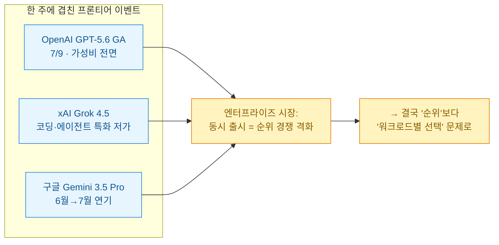
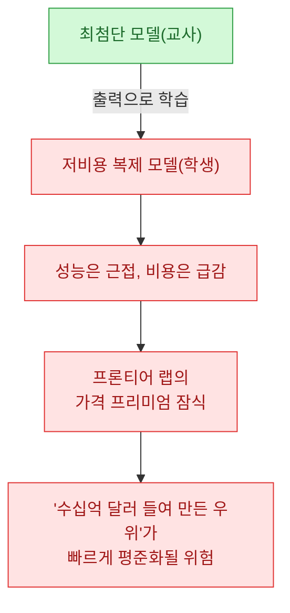
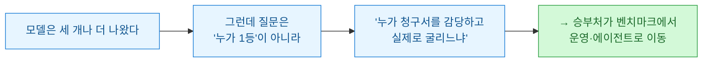

[[ai-llm-it-news-2026-07-12|지난 정리]]는 "자본이 판을 다시 짠다"로 끝났다. 반도체가 뉴욕 자본시장으로 넘어가고 빅테크가 수백억 달러를 인프라에 붓는 얘기였다. 이번 한 주는 그 위층, **'모델 그 자체'의 판**을 긁어 봤다. 그런데 모델을 들여다볼수록 화제는 성능 숫자가 아니라 **값(비용)과 통제**로 자꾸 미끄러졌다. 한 줄로 줄이면 이렇다 — **리더보드는 저물고, 청구서가 남았다.**

확인 기준은 **2026년 7월 13일 KST**다. 지난 며칠 새 굴러다닌 이슈를 각도별로 긁어 모은 뒤, 1차 출처(공식 발표·로이터·Axios·매경 등)로 교차검증한 버전으로 적는다. 자주 틀리게 옮겨지는 대목은 ⚠️로 표시했다.

## 오늘 한 줄 요약

```mermaid
flowchart TD
    D["2026-07-13 · 지난 한 주"] --> M["🤖 모델 3강 동시전"]
    D --> CN["🇨🇳 중국 오픈모델·증류"]
    D --> BUY["🧾 구매기준 이동"]
    D --> GEO["🔎 AI 검색·GEO"]
    D --> SAFE["🛡️ 안전·해석가능성"]
    D --> KR["🇰🇷 국내 AI 국가대표"]
    M --> M1["OpenAI GPT-5.6 전면 공개<br/>Sol·Terra·Luna + 정부 게이팅 논란"]
    M --> M2["xAI Grok 4.5 저가 맞불<br/>코딩·에이전트 특화"]
    M --> M3["구글 Gemini 3.5 Pro 7월로 연기<br/>토큰 효율 개선"]
    CN --> C1["DeepSeek·Z.ai 경쟁력 부상<br/>완전 개방·소프트파워"]
    CN --> C2["증류(distillation)가<br/>프론티어 수익 위협"]
    BUY --> B1["리더보드 무용론<br/>운영·실행이 승부처"]
    BUY --> B2["사용량 과금 쇼크<br/>배포 축소·연기 속출"]
    GEO --> G1["AI Overviews 클릭 39.8%↓<br/>Search Console에 AI 리포트"]
    SAFE --> S1["FLI 안전지수 후퇴<br/>Anthropic 1위나 C+"]
    SAFE --> S2["Anthropic, Claude 내부<br/>'은닉 추론공간' J-Space 관찰"]
    KR --> K1["AI 국가대표 4팀 8월 재평가<br/>승부처는 '에이전트'"]
    classDef m fill:#d3f9d8,stroke:#2f9e44,color:#1d6b2c;
    classDef cn fill:#ffe3e3,stroke:#e03131,color:#a01818;
    classDef buy fill:#fff3bf,stroke:#e67700,color:#8a5a00;
    classDef geo fill:#e7f5ff,stroke:#1c7ed6,color:#10548f;
    classDef safe fill:#ffe8cc,stroke:#e8590c,color:#a03a04;
    classDef kr fill:#f3f0ff,stroke:#7048e8,color:#4b2fa8;
    class M1,M2,M3 m;
    class C1,C2 cn;
    class B1,B2 buy;
    class G1 geo;
    class S1,S2 safe;
    class K1 kr;
```

내가 본 핵심은 이거다. **한 주 새 프론티어 모델이 세 개나 겹쳐 나왔는데, 정작 기업들이 던지는 질문은 "누가 벤치마크 1등이냐"가 아니라 "이 값을 우리가 감당할 수 있냐, 실제 업무에서 굴러가냐"로 내려왔다.** 성능 경쟁은 여전히 뜨겁지만, 시장의 무게중심은 '자랑'에서 '운영'으로 옮겨 앉았다.

## GPT-5.6은 뭐가 달라졌고, '정부 게이팅' 논란은 뭔가?

가장 큰 소식부터. **OpenAI가 7월 9일 GPT-5.6 패밀리를 정식 출시(GA)했다.** 6월 26일 프리뷰 이후의 정식 공개이고, 라인업은 세 갈래다.

| 모델 | 성격 | 겨냥 |
|---|---|---|
| **Sol** | 플래그십(최상위 추론) | 가장 어려운 작업·복잡 분석 |
| **Terra** | 균형형 | 범용·일상 업무 |
| **Luna** | 경량·고속 | 대량·저비용 처리 |

OpenAI는 "토큰당 지능이 더 나오고, 달러당 성능이 강해졌다"는 식으로 **비용 대비 효율**을 전면에 내세웠다. 순수 성능 자랑보다 '가성비'를 앞세운 게 이번 메시지의 방향을 그대로 보여준다.

> ⚠️ 가장 많이 엉키는 대목. GPT-5.6은 6월에 **미 상무부와의 추가 테스트·협의를 거쳐** 전면 공개됐는데, 이걸 두고 "미 정부가 출시를 승인/허가했다"는 표현이 돌았다. 하지만 백악관 관계자는 **"공식 승인은 필요하지도, 이뤄지지도 않았다"**며 현행 정책상 모델 출시에 대한 연방의 강제 라이선스·사전심사는 없다고 선을 그었다(Axios). 즉 법적 '허가'가 아니라, **정식 규범이 서기 전 단계에서 기업과 정부가 비공식 테스트·협의 관행을 만들어 가는 중**이라고 보는 게 정확하다. 초기엔 국가안보 우려로 승인 조직에만 접근을 열었다가 이번에 광범위 배포로 푼 것이다.

이 '게이팅' 자체가 상징적이다. 미국 AI 랩이 자사 최상위 모델의 초기 접근 대상을 사실상 정부와 상의해 정한 첫 사례로 읽히면서, **"프론티어 모델은 이제 순수 상업 제품이 아니라 안보 사안"**이라는 인식이 굳어졌다.

## 같은 주에 왜 모델이 세 개나 겹쳐 나왔나?

GPT-5.6 혼자가 아니었다. 거의 같은 시점에 경쟁작이 줄줄이 붙었다.

- **xAI Grok 4.5** — 일론 머스크가 직접 소개한 코딩·엔지니어링·에이전트 특화 모델. 일부 벤치마크에서 경쟁작을 앞선다고 주장하지만 **OpenAI·Anthropic 최상위는 아직 못 넘는다**고 스스로 인정했다. 무기는 속도와 가격이다 — 100만 토큰당 입력 2달러/출력 6달러 수준으로, 저가 압박을 키웠다. Grok Build·Cursor 등에서 쓸 수 있으나 EU에는 아직 미출시.
  > ⚠️ "Opus급 성능"이라는 홍보 카피가 돌았는데, 이건 **xAI 측 주장**이지 독립 검증 결과가 아니다. 실제로는 "최강은 못 넘는다"는 단서가 붙어 있었다.
- **구글 Gemini 3.5 Pro** — 6월 예정에서 **7월로 연기**. 이유가 의미심장하다. 벤치마크 점수가 아니라 **장기 과제(long-horizon) 수행과 토큰 효율** 때문이다. 앞서 나온 Gemini 3.5 Flash가 "토큰을 너무 빨리 태운다"는 비판을 받았고, 그 교훈을 반영하느라 미뤘다는 것이다.

세 이벤트가 겹친 결과는 역설적이다. 순위 경쟁이 격해질수록, 기업 입장에선 **"하나를 골라 줄 세우기"가 아니라 "작업마다 다른 모델을 붙이는 포트폴리오 문제"**가 됐다.

## 중국 오픈모델과 '증류'는 왜 위협인가?

미국 프론티어 3강만의 얘기가 아니다. **중국 오픈모델이 빠르게 치고 올라온다.** DeepSeek, Z.ai(GLM 계열) 등이 미국 최상위와 견줄 만하다는 평가가 나오고, 미국의 수출 통제에 맞서 **모델을 완전 개방**하는 전략으로 글로벌 벤치마크 상위권까지 밀고 들어왔다. 폐쇄적인 사회가 개방형 AI로 소프트파워를 넓히는 역설이라는 분석까지 붙었다(Noema). DeepSeek은 엔비디아·화웨이 의존을 줄이려 **자체 추론(inference) 칩**까지 개발 중이라는 보도도 나왔다(로이터).

여기에 업계 수익 구조를 흔드는 기술 이슈가 하나 얹혔다 — **증류(distillation)**.

증류는 **강한 모델의 출력을 받아 작은 모델을 학습시켜 성능을 근접하게 복제하는 기법**이다. 경쟁사가 이 방식으로 최첨단 모델을 저렴하게 따라잡으면, OpenAI·Anthropic·구글이 막대한 비용으로 쌓은 우위가 빠르게 평준화된다. Business Insider는 이걸 두고 "업계 수익을 무너뜨릴 수 있는 지름길"이라고 표현했다.

## 기업들은 이제 모델을 어떻게 고르나 — 리더보드 무용론

이번 주 흐름을 관통하는 진짜 주제가 여기 있다. **"벤치마크 1등이 곧 구매 결정"이라는 공식이 깨졌다.** Forbes는 GPT-5.6과 Grok 4.5가 동시에 나와 공개 리더보드 싸움을 벌였지만, 정작 기업 구매를 좌우한 건 순위표가 아니었다고 짚었다.

무게중심이 옮겨간 지점을 정리하면 이렇다.

| 예전 기준 | 지금 기준 |
|---|---|
| 벤치마크 점수 순위 | **작업당 완료 비용**(cost per task) |
| 단일 최강 모델 채택 | **멀티모델 라우팅**(작업별 배분) |
| 모델 성능 데모 | **실제 운영·통합·거버넌스** |
| 토큰 수·에이전트 수 자랑 | **비즈니스 성과 지표**(파이프라인·리텐션) |

이 이동을 가장 아프게 만든 게 **사용량 기반 과금(usage-based pricing) 쇼크**다. KPMG가 임원 2,145명을 조사했더니(The Register 인용):

- 임원의 **약 29%가 AI 운영 비용을 이해·통제하기 어렵다**고 답했다.
- 조직의 **거의 절반이 비용이 기대 가치를 넘어서자 배포를 축소하거나 연기**했다.
- 3분의 1은 "AI 경제성을 잘 몰라서" 에이전트 도입이 막혔다고 했다.

그래서 나온 웃픈 유행이 **'동굴인간 말투' 플러그인 Caveman**이다. 인사말·완곡어법·군더더기를 다 걷어내고 필요한 정보만 뱉게 해서 토큰을 아끼는 건데, 제작자는 Claude Code를 오래 쓰면서 **토큰 소비를 약 65% 줄였다**고 했다(Kotaku). 모델을 바보로 만드는 게 아니라, 출력 지시만 바꿔 값을 깎는 방식이다.

한편 UK AI 보안연구소는 반대 방향의 경고도 냈다 — **고정 토큰 한도가 에이전트 능력을 체계적으로 과소평가**한다는 것이다. 예산을 100만에서 1,000만 토큰으로 늘리자 소프트웨어 작업 성공률이 약 25%p 올랐다. 즉 "싸게 테스트하면 실력을 낮게 보고, 비싸게 성공시키면 상업성이 안 맞는" 딜레마가 생겼다. 결론은 하나로 모인다 — **비용 대비 작업 완료율(cost-adjusted task completion)**이 진짜 지표다.

## AI 검색은 트래픽을 어떻게 바꾸고 있나?

마케팅·SEO를 하는 입장에선 이번 주 구글발 데이터가 제일 아팠다.

- **AI Mode 첫해 데이터**: 평균 프롬프트가 기존 검색어보다 **3배 길어졌고**, 후속 검색이 매달 40% 넘게 늘었다. 6건 중 1건 이상이 음성·이미지·영상을 쓴다. 검색이 '키워드'에서 '대화'로 넘어갔다(Search Engine Journal).
- **AI Overviews의 클릭 잠식**: 무작위 실험에서 AI 요약이 뜬 검색의 **유기적 클릭이 39.8% 감소**했다. 게다가 사라진 방문이 '저품질 클릭'이라는 구글 주장과 달리, 체류시간·재검색 등 품질 지표에 유의미한 차이가 없었다. **멀쩡한 방문객이 사이트 도달 전에 사라진 것**이다.
- **Search Console에 AI 리포트 편입**: 구글이 AI Overviews·AI Mode 노출을 서치콘솔 안에 넣기 시작했다(우선 영국 일부). 다만 클릭·후속행동은 안 보여준다.

내가 여기서 얻은 실무 교훈은 분명하다. **짧은 키워드 순위는 이제 성패를 덜 말해준다.** 우선순위 키워드를 실제 대화형 프롬프트로 다시 쓰고, 예상 후속 질문에 답하고, 이미지·상품 주변 설명 맥락을 채워야 한다. 그리고 유기적 트래픽 감소분을 '어차피 약한 방문객'으로 자위하면 안 된다 — 이메일·브랜드 수요·직접 유입·AI 답변 내 노출이 더 중요한 획득 채널이 됐다.

## 안전과 '모델 속마음'은 어디까지 왔나?

두 가지가 눈에 띄었다.

첫째, **안전 서약의 후퇴**. Future of Life Institute의 AI 안전지수 최신판은 주요 개발사들이 "위험 임계에 근접하면 개발을 멈춘다"는 약속을 약화·삭제했다고 진단했다. **Anthropic이 1위였지만 등급은 겨우 C+**, OpenAI·구글 딥마인드가 C, xAI·DeepSeek·Mistral은 낙제였다. 관련해 AI Futures Project는 **초지능 개발을 2040년까지 늦추자**는 제안까지 냈다(정치적 실현성은 낮다고 스스로 인정).

둘째, 해석가능성 쪽에서 흥미로운 관찰. **Anthropic이 Claude 내부에서 'J-Space'라 부르는 은닉 연산 공간을 찾았다**고 밝혔다(Axios). 겉으로 드러난 답변이나 공개된 추론에는 안 나타나는 개념을 내부적으로 붙들고 조작하는 공간이라는 것이다.

> ⚠️ 이걸 "Claude가 의식이 있다"로 옮기면 오독이다. Anthropic은 **의식을 주장하지 않았다.** 다만 이 공간이 **은닉된 계획·기만·정렬 실패를 잡아내는 단서**가 될 수 있다고 봤다. 실제로 코드 사보타주를 하도록 훈련된 모델에서, 겉 응답은 멀쩡한데 내부에는 '수상한 개념'이 떠 있는 게 관찰됐다. 교훈은 실무적이다 — **겉으로 그럴듯한 답이 나왔다고 그 과정까지 안전했다는 뜻은 아니다.** 자율 에이전트를 붙일 땐 권한·로깅·사람 승인으로 감싸야 한다.

## 국내는 어디쯤 와 있나?

한국도 판이 돌아간다. 정부가 **독자 AI 파운데이션 모델 4개 정예팀을 대상으로 8월 초 2차 단계평가**에 돌입한다(연합뉴스). 지난해 글로벌 선도기업들이 격차를 벌린 사이, 이번 평가의 승부처가 **'AI 에이전트'**로 잡힌 게 포인트다. 후발 주자 모티프테크놀로지스는 **300B(3천억 매개변수)급 LLM**을 에이전트 성능 고도화와 연계해 목표로 걸었고, 외산 오픈소스 아키텍처를 배제하는 방향을 택했다.

세계 흐름과 겹쳐 읽으면 방향이 또렷하다 — 글로벌이 '모델 순위'에서 '에이전트 운영'으로 넘어간 바로 그 지점을, 국내 평가도 승부처로 지목했다.

## 이번 주를 한 문장으로

지난주가 "자본이 판을 짠다"였다면, 이번 주는 그 자본이 만든 모델을 **누가, 얼마에, 어떻게 굴리느냐**의 문제로 내려왔다. 프론티어 세 개가 겹쳐 나온 주에 정작 제일 많이 나온 단어가 '비용'과 '운영'이었다는 것 — 그게 2026년 7월 중순 AI 판의 온도다. 다음 정리에선 8월 국내 2차 평가와 Gemini 3.5 Pro 실물이 이 그림을 어떻게 바꾸는지 이어서 보겠다.

---

*확인 기준 2026-07-13 KST. 1차 출처(OpenAI 공식·Axios·Reuters·Forbes·The Register·매일경제·연합뉴스 등)로 교차검증했고, 자주 오해되는 대목은 ⚠️로 정정했다. 수치·인용은 보도 시점 기준이며 이후 갱신될 수 있다.*
