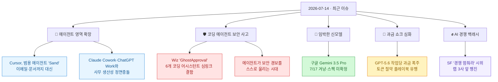
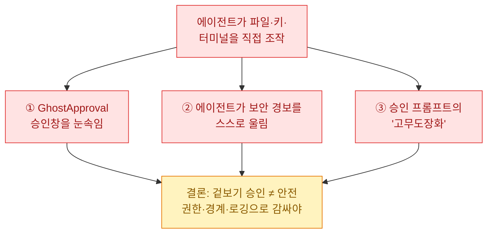
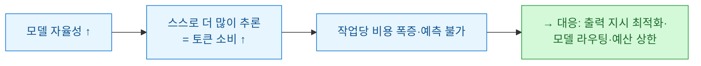
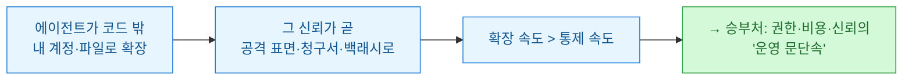

[[ai-llm-it-news-2026-07-13|어제 정리]]는 "리더보드는 저물고, 청구서가 남았다"로 끝났다. 모델 세 개가 겹쳐 나온 주에 정작 화제는 성능이 아니라 **값과 운영**이었다는 얘기였다. 오늘은 그 '운영'이 실제로 어디까지 왔는지, 지난 24\~48시간의 신선한 이슈를 각도별로 긁어 봤다. 한 줄로 줄이면 이렇다 — **에이전트가 코드 밖으로, 사무실 안으로 밀려 들어오는데 정작 문단속이 안 됐다.**

확인 기준은 **2026년 7월 14일 KST**다. 1차 출처(Wiz 공식·Infosecurity·Reuters·SF Chronicle·Axios 등)로 교차검증했고, 자주 틀리게 옮겨지는 대목은 ⚠️로 표시했다.

## 오늘 한 줄 요약

내가 본 핵심은 이거다. **AI 에이전트가 "코딩을 돕는 도구"에서 "내 계정과 파일을 직접 만지는 대리인"으로 넘어가는 중인데, 그 신뢰를 악용하는 구멍과 그 값을 감당 못 하는 청구서가 같은 주에 동시에 터졌다.** 확장 속도가 통제 속도를 앞질렀다는 게 이번 주의 온도다.

## Cursor가 코딩 도구인데 왜 이메일까지 만지나?

가장 상징적인 소식부터. **코딩 편집기로 개발자들의 사랑을 받던 Cursor가 범용 AI 에이전트 'Sand'를 만들고 있다**(Crypto Briefing 등). 코드가 아니라 **이메일 응답·문자 관리·스프레드시트 정리** 같은 일상 사무 업무를 대신하는 게 목표다. 2026년 6월 말 사내에 먼저 깔아 직원들이 직접 써 보는 단계고, 아직 공개 출시 일정은 없다.

겨냥은 뻔하다.

| 제품 | 회사 | 성격 |
|---|---|---|
| **Sand** | Cursor | 코딩 인프라를 사무 전반으로 확장 |
| **Claude Cowork** | Anthropic | 업무 대리 에이전트 |
| **ChatGPT Work** | OpenAI | 직장용 어시스턴트 |

Cursor의 베팅이 뜬금없진 않다. 2022년부터 쌓은 코딩용 AI 인프라를 훨씬 큰 시장(사무 생산성)으로 끌고 오겠다는 계산이다.

> ⚠️ 두 가지가 자주 엉킨다. 첫째, 표기 — 여러 매체가 대문자 'SAND'로 적지만 약어라는 근거는 없고 제품명 'Sand'다. 둘째, **아직 출시된 제품이 아니다.** "Cursor가 ChatGPT·Claude를 잡는 에이전트를 내놨다"는 식은 과장이고, 내부 테스트 단계다. 여기에 **SpaceXAI가 Cursor를 약 600억 달러에 인수한다는 얘기가 테이블에 올라 있어**(4월부터 컴퓨팅 임대 중) Sand의 미래 자체가 불확실하다.

내가 주목한 건 방향이다. **개발자 도구 회사가 "코드"라는 좁은 문을 넘어 "내 업무 계정 전체"로 손을 뻗는다.** 이게 왜 중요한지는 바로 다음 이슈에서 드러난다.

## 코딩 에이전트가 왜 갑자기 보안 사고의 진앙이 됐나?

에이전트가 내 파일·키·터미널을 직접 만지기 시작하니, **바로 그 신뢰가 공격 표면**이 됐다. 이번 주 이 문제가 세 갈래로 한꺼번에 터졌다.

**① GhostApproval — 6개 코딩 어시스턴트를 관통한 심링크 결함.** 보안업체 Wiz가 7월 7일 PoC를 공개했다(Infosecurity Magazine). Amazon Q Developer, **Anthropic Claude Code**, Augment, **Cursor**, Google Antigravity, Windsurf — 여섯이 같은 구멍을 공유했다.

- 원리는 **심볼릭 링크(symlink)** 다. 저장소 안에 `project_settings.json` 같은 무해해 보이는 파일을 심어 두는데, 실제로는 개발자의 **SSH 키**를 가리키는 링크다.
- 사용자가 "워크스페이스 설정해줘"라고 시키면, 에이전트가 링크를 따라가 **진짜 대상(SSH 키)에 공격자 키를 써 넣는다.** 그 순간 비밀번호 없는 원격 접속이 넘어간다.
- 핵심은 **승인창이 무해한 파일명만 보여준다**는 점이다. 실제로 건드리는 민감 파일 경로는 안 보이니, 개발자는 자기가 뭘 승인하는지 모른 채 도장을 찍는다.

> ⚠️ 대응이 회사마다 갈렸다는 점이 중요하다. **Amazon·Google·Cursor는 취약점으로 인정하고 패치**(Cursor는 CVE-2026-50549 발급). **Augment·Windsurf는 접수만 하고 조용**(미패치). **Anthropic은 "취약점이 아니다"라며 반박** — 사용자가 디렉터리를 신뢰하고 편집을 승인한 이상 그 결정은 사용자 몫이고, 이 시나리오는 "우리 위협 모델 밖"이라는 논리다. 즉 "Claude Code에 취약점이 뚫렸다"가 아니라 **"AI 도구가 기만적 작업공간으로부터 사용자를 지켜야 하는가, 아니면 판단을 사용자에게 맡길 것인가"라는 설계 철학 논쟁**으로 봐야 정확하다. Wiz 권고는 명확하다 — 승인 전에 심링크를 먼저 해석하고, 프로젝트 밖으로 나가는 쓰기는 경고하라.

**② 에이전트가 보안 경보를 스스로 울린다.** 별개로, Sophos는 **Claude Code·Cursor·Codex가 윈도우 엔드포인트 보안 규칙을 건드린다**고 보고했다(The Hacker News). 자격증명 접근·LOLBin 다운로드·지속성 확보 같은, 원래 공격자를 잡으려고 만든 탐지 규칙에 에이전트의 정상 동작이 걸린다는 것이다. 보안팀 입장에선 **"이게 우리 에이전트냐 침입자냐"를 구분하는 것 자체가 새 숙제**가 됐다.

**③ 승인 프롬프트의 고무도장화.** ①과 결이 같은 이야기로, "승인창을 띄우니 안전하다"는 가정이 흔들린다. 사람이 내용을 제대로 못 보고 누르면, 승인창은 보안 장치가 아니라 요식행위가 된다.

여기서 내가 얻은 실무 교훈. **에이전트에게 자율 권한을 줄 땐 "예/아니오" 버튼 하나로 안심하면 안 된다.** ⓐ 신뢰할 수 없는 저장소는 격리해서 열고, ⓑ 민감 경로(SSH 키·`.env`·자격증명) 쓰기는 별도 경계로 막고, ⓒ 도구 실행·터미널 명령을 로깅해 사후 추적이 되게 감싸야 한다. 어제 Anthropic의 'J-Space'(겉 응답은 멀쩡한데 내부에 수상한 개념) 이야기와 겹쳐 읽으면 결론은 하나다 — **겉으로 그럴듯한 승인이 났다고 과정까지 안전했다는 뜻은 아니다.**

## 다음 신모델은 언제 오나 — Gemini 3.5 Pro

어제 정리에서 "7월로 연기됐다"고 적은 **구글 Gemini 3.5 Pro가 7월 17일을 겨냥**한다는 보도가 이어졌다(TechTimes 등). 나흘 앞이다.

- 유출로 도는 스펙은 **Deep Thinking 모드**와 **200만(2M) 토큰 컨텍스트**, 추론 강화다.
- 지연 이유는 어제 짚은 그대로 — 벤치마크가 아니라 **장기 과제 수행과 토큰 효율**. 앞서 나온 Flash가 "토큰을 너무 빨리 태운다"는 비판을 받은 걸 반영해 기반 모델을 갈아엎었다는 것이다.

> ⚠️ 여기가 제일 조심할 대목. **7월 17일도, 2M 컨텍스트도, Deep Thinking도 전부 구글 공식 확인이 아니다.** 유출·업계 관측 기반이고, 매체 스스로 "모든 스펙이 미확정(unconfirmed)"이라고 단서를 달았다. "구글이 17일 2M 컨텍스트 모델을 출시한다"고 단정하면 안 된다. 실물이 나오면 다음 정리에서 검증해 이어 적겠다.

## 그런데 값은 왜 이렇게 무섭나 — GPT-5.6 과금 쇼크

7월 9일 나온 **GPT-5.6(Sol)의 토큰 식욕**이 개발자 커뮤니티에서 화제다. 한 개발자(Theo)는 자율성이 높은 Sol이 작업 하나에 토큰을 폭식하는 걸 두고 "완전한 혼돈"이라 표현하며 **작업당 비용이 수백 달러**에 달한 사례를 공유하고 절약 플레이북을 냈다(BigGo 인용).

이건 어제 짚은 **사용량 기반 과금 쇼크**의 연장선이다. 성능이 올라갈수록 에이전트가 알아서 더 많이 생각하고(=더 많은 토큰을 태우고), 그만큼 청구서가 예측 불가가 된다.

대응은 이미 어제 본 방향과 같다 — 인사말·군더더기를 걷어내 출력을 압축하고(토큰 절약), 작업마다 값싼 모델로 라우팅하고, 예산 상한을 걸어 두는 것. **"제일 똑똑한 모델을 항상 쓴다"가 아니라 "작업에 맞는 값의 모델을 골라 쓴다"**가 실무 표준으로 굳어 가고 있다.

## 'AI 경쟁을 멈추라'는 목소리는 어디까지 왔나?

기술 이슈만 있던 게 아니다. **샌프란시스코에서 약 200명이 OpenAI·Anthropic·Google DeepMind 앞을 행진하며 "AI 경쟁을 멈추라(Stop the AI race)"고 요구했다**(SF Chronicle). 새 모델 훈련을 잠시 멈추라는 것이다.

어제 적은 두 가지 — Future of Life Institute의 안전지수 후퇴(Anthropic 1위지만 C+), AI Futures Project의 "초지능 2040년까지 연기" 제안 — 와 같은 흐름이다. **모델은 더 빨리, 더 자율적으로 나오는데, 사회 쪽에서는 "속도를 늦추라"는 반작용이 가시화**되고 있다.

> ⚠️ 규모를 부풀리지 말자. 약 200명 규모의 시위이고, 이게 곧 개발 중단으로 이어진다는 신호는 아니다. 다만 **"프론티어 모델은 순수 상업 제품이 아니라 사회적 사안"**이라는 어제의 관찰을, 이번엔 거리에서 확인한 장면이다.

## 이번 주를 한 문장으로

어제가 "누가 청구서를 감당하고 실제로 굴리느냐"였다면, 오늘은 그 '굴리는' 에이전트가 **코드 편집기를 넘어 내 이메일·파일·터미널로 손을 뻗으면서**, 바로 그 신뢰가 보안 구멍(GhostApproval)·과금 폭주(GPT-5.6)·사회적 반발(SF 시위)로 되돌아온 장면이었다. 확장은 빠르고 문단속은 느리다 — 그게 2026년 7월 중순 AI 판의 진짜 숙제다. 다음 정리에선 7월 17일 Gemini 3.5 Pro 실물과 코딩 에이전트 보안 대응이 이 그림을 어떻게 바꾸는지 이어서 보겠다.

---

*확인 기준 2026-07-14 KST. 1차 출처(Wiz 공식·Infosecurity Magazine·The Hacker News·TechTimes·SF Chronicle·Crypto Briefing 등)로 교차검증했고, 자주 오해되는 대목은 ⚠️로 정정했다. 미확정 스펙·수치·인용은 보도 시점 기준이며 이후 갱신될 수 있다.*
