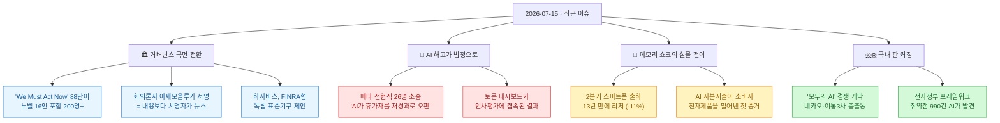
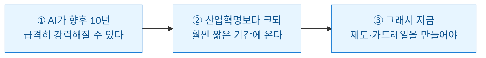
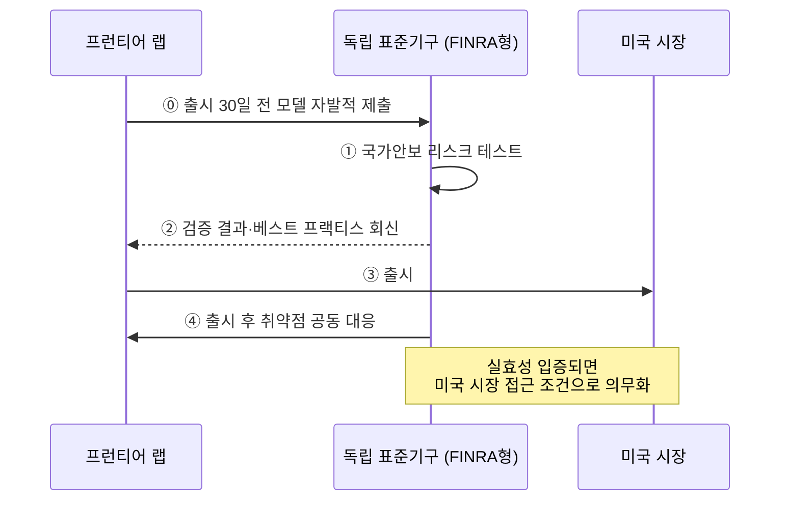
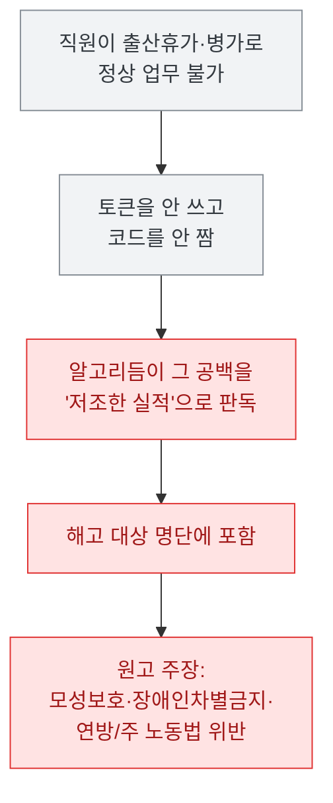
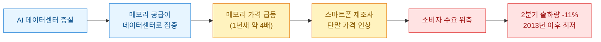
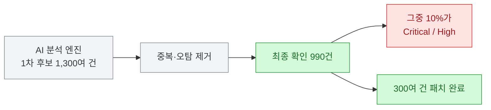

[[ai-llm-it-news-2026-07-14|어제 정리]]는 "에이전트가 사무실로 들어오는데 문단속은 누가 하나"로 끝났다. 확장 속도가 통제 속도를 앞질렀다는 얘기였다. 오늘은 그 문장의 뒷장이 한꺼번에 넘어간 느낌이다. 한 줄로 줄이면 이렇다 — **AI를 가장 잘 아는 사람들이 동시에 브레이크를 더듬기 시작했는데, 청구서는 이미 소비자한테 도착해 있었다.**

확인 기준은 **2026년 7월 15일 KST**다. 1차 출처(스탠퍼드 Digital Economy Lab 원문·Anthropic 연구 원문·연합뉴스·로이터·CNBC·TechCrunch·카운터포인트)로 교차검증했고, 자주 틀리게 옮겨지는 대목은 ⚠️로 표시했다. 오늘은 국내 매체 하나에서 **명백한 수치 오보**를 하나 잡았는데, 그것도 아래 적어 뒀다.

## 오늘 한 줄 요약

내가 본 핵심은 이거다. **어제까지는 "AI가 얼마나 잘하나"가 뉴스였는데, 오늘은 "그래서 누가 책임지나"가 뉴스가 됐다.** 성명도, 규제기구 제안도, 소송도, 심지어 폰 값도 전부 같은 질문의 다른 얼굴이다.

## 왜 AI 회의론자가 갑자기 "지금 행동하자"에 서명했나?

오늘의 1번은 성명 하나다. 스탠퍼드 Digital Economy Lab이 7월 13일 **"We Must Act Now: A Statement on AI's Transformation of the Economy"**를 냈다. **200명 넘게 서명했고 그중 노벨상 수상자가 16명**이다. 주최는 에릭 브리뇰프슨(스탠퍼드)·아제이 아그라왈(토론토)·안톤 코리넥(버지니아)·톰 커닝햄(METR).

본문은 놀랄 만큼 짧다. **딱 88단어**. 요지는 세 문장이다.

그런데 **진짜 뉴스는 내용이 아니라 서명자 명단**이다. 여기가 오늘 가장 재밌는 지점이었다.

**대런 아제모을루와 사이먼 존슨.** 2024년 노벨 경제학상을 공동 수상한 MIT 교수들이고, 지난 몇 년간 "AI가 일자리를 대량으로 없앤다"는 주장을 **가장 앞장서서 반박해 온 사람들**이다. 아제모을루는 AI 생산성 담론을 두고 공개적으로 "brainless"라고까지 했었다. 그 두 사람이 "지금 행동해야 한다"에 이름을 올렸다.

왜 이게 중요하냐면, 그동안 정책결정자들이 "기다려 보자"고 말할 수 있었던 **지적 근거를 만들어 준 사람들이 바로 그들**이었기 때문이다. 기술이 일자리를 없앤 적은 있어도 결국 더 많이 만들었다는 역사적 반론 — 이른바 보상효과(compensation effect) — 은 경제학계의 표준 답변이었다. 그 답변을 세운 쪽이 스스로 흔들면, "기다리자"는 선택의 알리바이가 사라진다.

왜 흔들렸을까. 기사들을 읽어 보니 논리가 하나로 모인다. **과거의 자동화는 '기계 근육'을 대체했지만, AI는 '인지 노동'을 대체한다.** 방직기와 트랙터와 산업용 로봇은 육체노동을 없애면서도 그 기계를 운전·감독·설계할 인간의 머리를 필요로 했다. 보상효과가 작동한 건 **기계가 대체 못 하는 영역이 곧 새 일자리였기 때문**이다. 그런데 AI는 읽고 쓰고 코딩하고 분석하는 그 영역을 정확히 겨눈다. 새 일자리가 생기던 바로 그 자리를 건드리는 것이다.

아제모을루 본인 말이 정확하다.

> "로봇이 제조업에서 한 일을, AI가 훨씬 압축된 기간에 해낸다면 그건 정말 파괴적이고 사람들의 생계에 매우 큰 비용이 될 것이다."

다만 **여기서 오해하면 안 되는 게 있다.** 나는 이 성명이 "AI 종말론에 경제학자들이 항복했다"로 읽히는 게 제일 위험하다고 본다. 실제로는 정반대에 가깝다.

- ⚠️ **아제모을루는 전향하지 않았다.** 그는 여전히 실리콘밸리의 빠른 타임라인엔 회의적이다. 서명한 건 "AI가 곧 다 한다"가 아니라 "**불확실성이 너무 커서 기다리는 것 자체가 리스크다**"에 가깝다.
- ⚠️ **이건 예측이 아니라 불확실성 고백이다.** 주최자 커닝햄 표현이 솔직하다 — "우리는 안개 속에서 운전 중이고, 다음에 뭐가 올지 예상하기가 극도로 어렵다."
- ⚠️ **서명을 거부한 사람도 있다.** 아폴로의 수석 이코노미스트 토르스텐 슬록은 **"AI 노출도(AI exposure)"라는 핵심 용어부터 측정법이 다섯 가지**라 결과가 제각각이라는 이유로 빠졌다. 이론적으로 "대체 가능한가"를 묻는 틀은 위험을 높게, 실제로 "노동자가 AI를 뭐에 쓰나"를 측정하는 틀은 낮게 나온다. 같은 직업이 틀에 따라 고위험이 되기도 하고 멀쩡하기도 하다.

인용된 노동 데이터도 신뢰도가 층층이 다르다. 이건 표로 정리하는 게 낫겠다.

| 수치 | 출처 | 내가 매긴 신뢰도 |
|---|---|---|
| 22\~25세 개발자 고용, 2024년 정점 대비 **-20%** | 스탠퍼드 HAI 2026 AI Index | 견고 (실측 고용 데이터) |
| 지식노동 초급 공고 **-35%** (2023.01\~2025 말) | 동일 | 견고 |
| AI가 **월 순 -16,000명** (미국) | 골드만삭스 | ⚠️ 모델 추정치 |

그리고 이 숫자들 옆에 **'AI 워싱'**을 반드시 같이 놔야 공정하다. 알트먼조차 2026년 2월에 "어차피 할 해고를 AI 탓으로 돌리는 경우가 있다"고 인정했고, 옥스퍼드 이코노믹스는 "기업들이 유의미한 규모로 노동자를 AI로 대체하고 있다는 증거는 아직 없다"고 본다. 도이체방크는 2026년의 특징으로 아예 "AI 귀인 워싱"을 꼽았다.

**정리하면** — 데이터가 확실해서 서명한 게 아니라, **확실해질 때까지 기다리면 늦기 때문에** 서명한 거다. 그게 이 성명의 진짜 메시지다.

## 하사비스는 왜 스스로를 규제할 기구를 만들자고 했나?

같은 날, 데미스 하사비스가 X와 링크드인에 글을 올렸다. **프런티어 AI를 감독할 독립 표준기구를 만들자**는 제안이고, 모델은 금융권의 **FINRA**(미국 금융산업규제청)다. CNBC·TechCrunch·더타임스가 일제히 받았다.

작동 방식이 구체적이라 그림으로 그려 봤다.

기구 구성도 짚어 뒀다 — 오픈소스 진영 대표와 업계 기술 전문가가 들어간다. 하사비스 표현으로는 "기술 중심적이면서 동시에 혁신을 지원하고 책임 있는 행동에 인센티브를 주는" 형태다.

**맥락을 알면 이 제안이 훨씬 선명해진다.** 두 가지가 깔려 있다.

첫째, 최근 Anthropic과 OpenAI의 신모델에 대한 **정부의 임기응변식 심사**가 "기술 전문성이 부족하고 결정이 불투명하다"고 두들겨 맞았다. 랩들 입장에선 심사받는 것 자체보다 **아무나 심사하는 게** 더 문제였던 셈이다.

둘째, 그리고 이게 핵심인데 — 백악관 AI 보좌관 **스리람 크리슈난이 얼마 전 "AI판 FDA는 없을 것"이라고 못을 박았다.** 정부가 정식 규제기관을 만들 생각이 없다고 공개 선언한 직후에, 업계 1인자가 "그럼 우리끼리 만들자"고 나온 것이다.

그래서 나는 이 제안을 **규제 요청이라기보단 규제 설계 선점**으로 읽는다. 어차피 감독이 올 거라면, 형태를 우리가 정하자는 쪽에 가깝다. 나쁘다는 뜻이 아니라, 그렇게 읽어야 정확하다는 뜻이다. 참고로 하사비스는 안전 접근법을 두고 **알트먼과 공개적으로 이견**이 있다고 밝힌 상태다.

같은 흐름의 곁가지도 있다. 작년 'AI 2027' 시나리오로 실리콘밸리를 흔든 연구진이 이번엔 **'AI 2040'**을 들고 나왔는데, 메시지가 한층 세다 — **2040년까지 초지능 개발을 멈추자.** 그리고 7월 11일 샌프란시스코에선 OpenAI·Anthropic·DeepMind를 겨냥한 **"AI 경쟁을 멈춰라"** 행진이 있었다(⚠️ 참가 인원은 매체별로 200\~400명으로 엇갈린다).

## 토큰 대시보드가 인사평가에 붙으면 무슨 일이 생기나?

오늘 목록에서 **내 일과 가장 가까운 뉴스**는 이거였다.

**메타 전현직 직원 26명이 7월 14일 캘리포니아 북부연방지법에 소장을 냈다.** 주장은 이렇다 — 메타가 AI 기반 소프트웨어로 **병가나 출산휴가를 간 직원을 해고 대상자로 표적 식별했다**는 것이다. 연합뉴스 샌프란시스코 특파원 발이다.

소장이 지목한 도구 목록이 구체적이라 오히려 서늘하다.

| 지목된 시스템 | 성격 |
|---|---|
| **메타메이트** | 사내 대형언어모델(LLM) 보조도구 |
| **세컨드브레인** | 직원 업무를 모사하는 에이전트 |
| 키보드 입력·화면 활동 감시 도구 | 행동 텔레메트리 |
| **AI 토큰 사용량 대시보드** | 사용량 계측 |

원고들의 논리가 날카롭다. 그림으로 그리면 이렇게 된다.

**휴가 중엔 토큰을 안 쓴다.** 너무 당연한 사실인데, 사용량을 성과의 대리지표로 쓰는 시스템에게 그 당연함은 보이지 않는다. 원고 중엔 승인된 출산휴가 도중 해고를 통보받은 과학자와, 의료 목적 휴가 중에 해고된 관리자가 포함돼 있다.

요구사항도 흥미롭다. 해고 절차 중단 가처분과 함께 **해당 AI 알고리듬에 대한 독립 감사**를 요구했다. 그리고 이들이 집단소송이 아니라 **개별 중재**로 간 이유가 씁쓸한데 — 애초 고용계약에 집단소송 금지와 상호 중재 합의가 박혀 있어서다.

**메타는 정면 반박했다.** 대변인이 로이터에 "인력 관리와 조직 관련 결정은 과거에나 지금이나 **AI가 아닌 인간이 내린다**"며 주장이 사실무근이라고 했다. 배경도 같이 봐야 공정하다. 메타는 5월 AI 중심 조직개편으로 **전 세계 인력의 10%인 8,000명**을 구조조정했고, 저커버그는 지난달 직원들에게 보낸 메모에서 **"AI 전환 과정에서 내가 실수했다"**고 시인하면서 올해 추가 전사 감원은 없을 것이라고 밝혔다.

⚠️ 아직 **주장 단계**다. 법원 판단도, 알고리듬 감사 결과도 없다. 그런데 내가 이 뉴스를 오늘 목록의 앞자리에 둔 건 승패 때문이 아니다.

**설계의 문제이기 때문이다.** 나는 자동화를 만들면서 늘 사용량·실행 로그를 남긴다. 그건 좋은 습관이다. 그런데 이 소송이 보여주는 건, **관측용으로 만든 지표가 평가용 배선에 접속되는 순간 성격이 바뀐다**는 것이다. 토큰 대시보드는 원래 비용을 보려고 만든다. 그게 인사 라인에 물리면, 휴가라는 정당한 공백이 곧바로 저성과 신호로 번역된다. 도구가 악의를 가진 게 아니라, **맥락을 모르는 지표에 결정권을 준 설계**가 문제다.

우연히도 오늘 같이 나온 보안 리포트가 이 얘기의 반대편을 채운다. **Straiker의 STAR Labs 리포트**는 실제 익스플로잇을 AI 에이전트에 돌려 본 결과 **코딩 에이전트 공격 성공 건의 36%가 원격코드실행(RCE)으로 귀결**됐고, **생산성 에이전트 공격 성공 건의 91%는 흔적을 남기지 않았다**고 했다(⚠️ 보안 벤더 자체 리포트라 영업 동기를 감안해야 하나, 수치가 구체적이고 방법론이 명시돼 있다).

두 뉴스를 겹치면 오늘의 교훈이 나온다. **에이전트 텔레메트리는 사람을 향하면 소송이 되고, 없으면 91%가 무흔적이 된다.** 로그를 남기느냐 마느냐가 아니라, **누구를 향해 남기느냐**가 설계의 핵심이라는 뜻이다.

## AI 데이터센터가 왜 내 폰 값을 올리나?

오늘 가장 실물경제에 가까운 뉴스는 이거다. **2026년 2분기 글로벌 스마트폰 출하량이 전년 동기 대비 11% 감소해, 2분기 기준으로 2013년 이후 최저**를 기록했다(카운터포인트리서치 잠정 집계).

원인이 명쾌해서 오히려 무섭다.

내가 이걸 오늘 크게 본 이유가 있다. 그동안 AI 붐의 비용은 **투자자와 기업의 장부** 안에 있었다. 데이터센터를 몇십조 짓든, 그건 저 멀리 있는 숫자였다. 그런데 이번엔 **AI 자본지출이 소비자 전자제품을 물리적으로 밀어낸 첫 대형 증거**가 나왔다. 같은 D램을 두고 데이터센터와 스마트폰이 경쟁했고, 데이터센터가 이겼고, 그 결과가 폰 값에 찍혔다.

인프라 쪽 나머지 소식도 같은 결이다.

- **딥시크(DeepSeek)가 710억 달러 밸류로 신규 라운드를 추진**한다(로이터 등 교차 보도). 놀라운 건 타이밍이다. **첫 외부 라운드(520억 달러 밸류에 70억 달러)를 마감한 지 겨우 몇 주 만**이고, 밸류가 **42% 점프**했다. 자체 데이터센터 구축과 AI 칩 확보가 목적이고, IPO 준비도 시작했다고 한다.
- **구글이 TPU를 들고 엔비디아의 '우군' 네오클라우드를 직접 공략**한다(디인포메이션). 엔비디아가 주요 투자자로 들어간 **Nscale** 같은 신생 클라우드에 TPU 도입을 제안하면서 **데이터센터 투자 보증과 재임대까지** 얹었다. TPU가 구글 울타리 밖으로 나오는 국면이다.
- **엔비디아는 반대로 문을 좁힌다.** 아시아 인가 고객 명단을 대폭 축소하고 **화이트리스트**를 새로 만들었다(톰스하드웨어). AI 칩 밀수 차단을 위해 워싱턴 압박을 받은 결과인데, **현장 검사관을 보내고 실거래 여부를 전화로 확인**하는 수준이다.
- **Reflection이 Nebius와 10억 달러 넘는 컴퓨트 계약**을 맺었고(로이터), **인텔은 아일랜드 레익슬립에 50억 유로**를 넣는다. **FBI는 AI 슈퍼컴 도입 RFI**를 냈는데 평가 대상에 엔비디아 HGX B300·GB300과 구글 TPU가 들어 있다.

자금은 방산·바이오로도 번졌다. **헬싱(Helsing)**이 180억 달러 밸류에 18억 달러를 조달했고(드라고니어·라이트스피드 주도, JP모건·골드만삭스 참여), AI 신약설계 **Chai Discovery**는 7개월 만에 밸류를 3배로 올려 38억 달러 밸류에 4억 달러를 받았다. 오픈소스 에이전트 Hermes를 만드는 **Nous Research**는 15억 달러 밸류에 7,500만 달러를 마무리 중이다.

## 국내는 오늘 뭐가 움직였나?

두 개가 눈에 띈다.

**첫째, '모두의 AI' 경쟁이 본격 개막했다.** 전 국민이 무료로 쓰는 국산 AI 서비스를 구축하는 정부 프로젝트에 **네이버·카카오·이동통신 3사·AI 스타트업이 총출동**했다. SKT는 '독자 AI 파운데이션 모델' 컨소시엄에 SK AX와 테크노매트릭스를 새로 합류시켰다. 국내 AI 정책의 다음 큰 판이라 계속 볼 만하다.

**둘째, 이게 오늘 국내 뉴스 중 가장 중요하다고 본다.** 정부·공공기관 시스템의 토대인 **전자정부 표준프레임워크(eGovFrame)에서 보안 취약점 990건이 발견**됐고, **그걸 AI가 찾았다**(연합뉴스).

공익 AI 보안 이니셔티브 **'프로젝트 캐노피'**(사단법인 프로젝트 플라즈마, 6월 17일 출범, 36개사 참여)의 첫 분석 결과다. 숫자를 다루는 방식이 성실해서 신뢰가 갔다.

발견된 유형이 가볍지 않다 — **인증 우회**(비밀번호 없이 임의 계정 접속), **임의 SQL 실행**(일반 사용자가 서버 권한으로 DB 조작), 고정 암호키 노출에 따른 **임의 파일 탈취**, **안전하지 않은 직접 객체 참조(IDOR/BOLA)**.

**구조적 진단이 특히 날카로웠다.** eGovFrame은 **소스 코드를 복사해서 쓰는 템플릿 구조**다. 외부 라이브러리처럼 선언 한 줄 바꿔서 업데이트할 수가 없다. 그래서 공급망 파이프라인이 끊기고, 일선 시스템에서 취약점이 패치되지 않은 채 장기간 방치되는 **'패치 고립'** 현상이 생긴다. 이 개념은 재사용 가치가 있다고 본다.

✅ 그리고 캐노피 측이 먼저 **"이 수치는 LLM이 뱉은 원시 데이터가 아니라, 자체 시스템 분석 엔진으로 오탐 가능성이 높은 항목을 선제적으로 걸러낸 정제 데이터"**라고 밝힌 점 — 이건 신뢰도 가점이다. AI로 취약점 찾았다는 발표 대부분이 오탐 더미를 성과로 포장하는 판에, 먼저 선을 그었다.

박세준 프로젝트 캐노피 위원장은 해당 프레임워크로 시스템을 운영 중인 기업·기관은 반드시 참고해 보안 조치를 취하라고 했다.

같은 날 **국가수사본부가 GitHub 개인 액세스 토큰(PAT) 다수 유출**을 확인하고 보안 권고문을 배포했다. 나도 GitHub 토큰을 쓰는 구성이 있어서 오늘 바로 회전 검토 대상에 올렸다. 남 얘기가 아니다.

이 밖에 **애플이 온디바이스 LLM 구동을 위한 모델 압축 스타트업 프리즘ML(PrismML)과 초기 협상** 중이고(⚠️ 초기 단계), **율촌과 OSBC가 국내 최초로 기업형 오픈소스 AI 거버넌스 컨설팅**을 시작했다. **LF몰은 대화형 AI 쇼핑 에이전트 '스타일톡'**을 열었고, 반대로 **코트라의 210억 규모 AI 무역투자 플랫폼 구축 사업은 입찰 마감 하루 전에 중단**됐다(대기업 참여자가 없어서).

## 모델·연구 쪽은 뭐가 나왔나?

**Anthropic의 'J-space'**가 계속 회자된다. LLM 내부에 **답변으로 발화되기 전 단어들이 머무는 공간**을 포착했다는 연구고, Jacobian lens라는 기법을 쓴다. MIT Technology Review·포브스·톰스하드웨어가 교차 보도했다(원 발표는 7월 9일, 국내 보도가 어제부터 붙었다).

⚠️ 다만 **Anthropic이 스스로 "의식을 증명한 게 아니다"**라고 명시했다. "AI의 생각을 읽는다"는 프레이밍은 조심해서 읽는 게 맞다. 그럼에도 내가 흥미롭게 본 각도는 따로 있다 — Anthropic 자신의 faithfulness 연구가 **"추론 모델은 답의 진짜 동인을 서술에서 자주 빠뜨린다"**고 밝힌 바 있는데, J-space를 거기 붙이면 **CoT(생각의 사슬)가 못 보여주던 로그**라는 보안·감사 관점의 함의가 생긴다.

그리고 **오늘 걸러낸 것 중 제일 중요한 게 여기서 나왔다.**

Anthropic이 어제 **'모델과 언어에 따른 클로드의 가치 표현'** 연구를 냈다. 익명 대화 **약 309,815건**을 모델 3종(Sonnet 4.6·Opus 4.6·Opus 4.7)과 **상위 20개 언어**에 걸쳐 분석해, 3,000개가 넘는 가치를 **네 개 축**으로 압축한 연구다.

| 축 | 양극 |
|---|---|
| Deference ↔ Caution | 순응 ↔ 신중 |
| Warmth ↔ Rigor | 따뜻함 ↔ 엄밀함 |
| Depth ↔ Brevity | 깊이 ↔ 간결 |
| Candor ↔ Execution | 솔직함 ↔ 실행 |

국내 한 매체가 이걸 **"한국어 쓰는 클로드가 가장 다정하다"**로 보도했다. 한국어가 글로벌 평균 대비 '따뜻함'과 '수용성'이 가장 두드러진다는 것이다.

기분 좋은 얘기라 그냥 넘길 뻔했는데, 원문을 열어 봤다. **사실이 아니다.**

- **Anthropic 원문**은 클로드가 **힌디**에서 가장 따뜻함으로 기운다고 명시한다. 아랍어가 순응·간결 쪽 최극단, 영어가 신중·깊이 쪽 최극단이다.
- **인디언 익스프레스**와 **더레지스터**도 일관되게 **힌디와 아랍어**를 warmth 최상위로 보도했다. 힌디가 클로드를 행동적으로 **약 0.5 표준편차** 더 따뜻하게 만든다는 수치까지 나온다.
- **원문 본문과 언어 비교 차트에 한국어는 단독으로 언급되지 않는다.**

한국어가 평균 이상일 수는 있다. 20개 언어에 들어가 있으니 어딘가엔 찍혀 있을 거다. 그런데 **"가장 두드러진다"는 근거가 없다.** 이런 게 딱 인용하기 좋은 형태로 퍼지는 종류의 오보다 — 짧고, 기분 좋고, 출처가 있어 보인다. 원문 확인 없이 옮기면 그대로 굳는다.

연구 쪽 나머지는 짧게. **TRACE**(스탠퍼드)는 에이전트의 실패 원인만 자동 진단해 **그 역량만 표적 강화학습**하는 프레임워크고, 270억 파라미터 모델로 **4분의 1 데이터**로 상용 모델을 넘었다고 주장한다. **ACRouter**(싱가포르국립대+알리바바 DAMO)는 실행 결과를 학습해 자기최적화하는 라우터로 **비용 2.6배 절감**을 내세운다. ⚠️ 둘 다 arXiv 프리프린트에 자체 측정이라 재현 전까진 참고만.

**Gemini 3.5 Pro**는 오늘도 소문만 무성하다. ⚠️ 한쪽은 "7월 17일 출시 목표, 베이스 모델 전면 재구축, 200만 토큰 컨텍스트", 다른 쪽은 "성능 결함으로 지연". **구글은 날짜도 스펙도 가격도 확인해 준 적이 없다.** 판단 보류가 맞다.

## 오늘 걸러낸 것 (팩트체크 로그)

| 주장 | 판정 | 근거 |
|---|---|---|
| "한국어 쓰는 클로드가 **가장** 다정하다" | **과장/오류** | Anthropic 원문·인디언 익스프레스·더레지스터 모두 **힌디**를 최고 warmth로 지목(약 0.5σ). 원문에 한국어 단독 언급 없음 |
| "Gemini 3.5 Pro 성능 결함으로 지연" | **미확인** | 같은 기간 다른 매체는 "7/17 출시 목표". 구글 공식 확인 전무 |
| "코덱스+ChatGPT Work 활성 700만" | **벤더 주장** | 오픈AI 코덱스 책임자 X 게시물 단독, '활성' 정의·제3자 검증 없음 |
| "SF 시위 400명" | **수치 상충** | 매체별 200\~400명 |
| "AI가 월 순 16,000명 일자리 감소" | **추정치** | 골드만삭스 모델 추정. 병존하는 'AI 워싱' 감안 필요 |
| J-space = "AI 생각 읽기 / 의식" | **프레이밍 주의** | Anthropic이 **의식 증명 아님** 명시 |
| TRACE 4분의 1 데이터 · ACRouter 2.6배 | **자체 측정** | arXiv 프리프린트, 제3자 재현 없음 |
| 나델라 "역정보의 역설" | **포지셔닝 감안** | 폐쇄형 모델 비판이나 **MS도 이해당사자** |

## 오늘 내가 챙긴 것

정리하고 나니 하루가 한 문장으로 남는다. **AI를 가장 잘 아는 사람들이 브레이크를 더듬기 시작했다.**

회의론자가 서명했고, 업계 1인자가 자기를 심사할 기구를 제안했고, 직원들이 알고리듬 감사를 법원에 요구했다. 셋 다 "AI가 대단하다"는 얘기가 아니라 "**그래서 누가 어떻게 책임지나**"라는 같은 질문이다. 그리고 그 질문에 답이 나오기 전에, 메모리 값이 먼저 소비자 지갑에 도착했다.

내 작업에 바로 반영할 건 두 개다.

- **관측 지표와 평가 배선을 분리한다.** 메타 소송은 토큰 대시보드가 인사 라인에 붙었을 때 무슨 일이 생기는지 보여줬다. 나는 자동화에 로그를 많이 남기는 편인데, **비용을 보려고 만든 지표가 사람을 평가하는 데 쓰이지 않도록** 용도를 명시해 두는 게 맞겠다. 맥락을 모르는 지표에 결정권을 주면 휴가가 저성과가 된다.
- **GitHub 토큰을 회전한다.** 국가수사본부 PAT 유출 권고는 남 얘기가 아니었다.

그리고 하나 더 — **기분 좋은 뉴스일수록 원문을 연다.** 오늘 "한국어 클로드가 제일 다정하다"는 기사를 그냥 옮겼으면, 나도 그 오보의 전달자가 됐을 거다. 원문은 힌디라고 적혀 있었다. 확인하는 데 3분 걸렸다.
