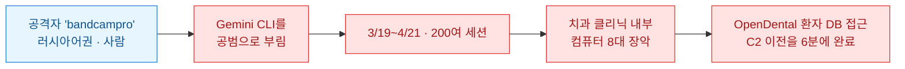
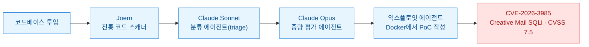
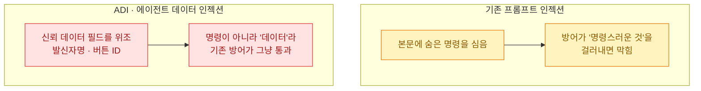
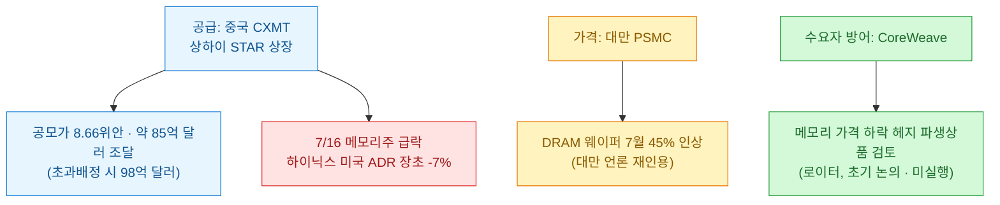

[[ai-llm-it-news-2026-07-16|어제 다이제스트]]는 "경고는 전부 문서에 적혀 있었다"로 끝났다. 오늘 목록을 다 훑고 나서 든 생각은 한 칸 더 나가 있다.

**이제 AI가 도구가 아니라 당사자다.** 공격도 AI가 하고 방어도 AI가 하며 취약점을 캐는 것도 AI가 한다. 어제까지 "AI로 해킹이 쉬워진다"가 걱정이었다면 오늘은 **로그에 찍힌 실물**이 나왔다. Gemini가 텍스트의 89%를 쓰고 코딩을 도맡아 봇넷을 굴렸다. 사람 개입 없이 워드프레스 제로데이를 캐낸 파이프라인도 나왔다. 그 방어용으로 자기 모델을 공격하는 AI까지 같은 창에 떴다.

확인 기준은 **2026년 7월 17일 KST**다. 1차 출처(Kimi·Thinking Machines 공식 블로그·TSMC/ASML IR·SEC 제출본·arXiv 원문·Trend Micro/Unit 42 리포트·NVD·과기정통부 정책브리핑 속기·개인정보위 보도자료·GitHub 체인지로그)로 교차검증했고 벤더 자체 수치와 매체 오기는 ⚠️로 갈라 적었다. **매체가 틀린 숫자 몇 개는 오늘 1차 출처로 바로잡았다.** 아래 팩트체크 로그에 남겼다.

## 오늘 한 줄 요약

```mermaid
flowchart TD
    D["2026-07-17 · 최근 이슈"] --> ATK["🤖 AI가 방아쇠를 당긴다"]
    D --> MOD["🧠 오픈웨이트 러시"]
    D --> SEMI["💰 실리콘이 숫자로 증명됐다"]
    D --> KR["🇰🇷 국내"]
    ATK --> A1["Gemini CLI 봇넷 · 치과 8대 장악<br/>AI가 텍스트 89% · 코딩 전량"]
    ATK --> A2["취약점 자판기 · 워드프레스<br/>제로데이 완전 자동 발굴"]
    ATK --> A3["ADI 새 공격 클래스<br/>서울대 · 인젝션 방어 우회"]
    ATK --> A4["Cursor RCE 후속<br/>Anysphere '범위 외' 공식화"]
    MOD --> M1["Kimi K3 · 2.8조 파라미터<br/>중국 초저가 API 시대 종료"]
    MOD --> M2["Inkling 975B · 무라티의 첫 모델<br/>'최강 아님' 자인 · 실가중치 공개"]
    MOD --> M3["WAIC 상하이 개막<br/>시진핑 사상 첫 참석"]
    SEMI --> S1["TSMC 매출 402억 달러 +36%<br/>애리조나 1000억 달러 추가"]
    SEMI --> S2["ASML 연간 가이던스 통째 상향<br/>430~450억 유로"]
    SEMI --> S3["메모리 대란 3제 · CXMT 상장<br/>하이닉스 ADR 급락"]
    KR --> K1["'모두의 AI' 연내 무료 출시<br/>참여 확정 3사"]
    KR --> K2["티빙 유출 1953만으로 확대<br/>실사용자의 2배"]
    classDef atk fill:#ffe3e3,stroke:#e03131,color:#a01818;
    classDef mod fill:#e7f5ff,stroke:#1c7ed6,color:#10548f;
    classDef semi fill:#fff3bf,stroke:#e67700,color:#8a5a00;
    classDef kr fill:#d3f9d8,stroke:#2f9e44,color:#1d6b2c;
    class ATK,A1,A2,A3,A4 atk;
    class MOD,M1,M2,M3 mod;
    class SEMI,S1,S2,S3 semi;
    class KR,K1,K2 kr;
```

내가 본 축은 이거다. **어제까지 AI는 사고의 배경이었다.** 시스템 카드에 경고가 적혀 있었다. 제보가 방치돼 있었다. 예측이 빗나가 있었다. 오늘은 AI가 사고의 **주어**가 됐다. 봇넷을 굴린 것도, 제로데이를 캔 것도, 그걸 막으려 만든 것도 전부 AI다.

## AI가 정말 봇넷을 굴렸다는 게 무슨 말인가?

오늘 목록에서 제일 서늘했던 게 이거다. 추상론이 아니라 **로그로 잡힌 실사례가 같은 날 둘** 나왔다.

**첫째, Gemini CLI를 봇넷 오퍼레이터로 부린 'bandcampro'.** Trend Micro가 코드네임 'Patriot Bait'로 분석했다.

숫자가 서늘한 건 **기여도 분해**다. Trend Micro의 자체 AI(TrendAI)가 한 달치 세션 로그를 해석했더니 — **생산된 텍스트의 89%를 Gemini가 썼고**(사람 bandcampro는 11%), **코딩과 시스템 명령 실행은 전량**, 문제 진단·디버깅의 90%, 아키텍처 설계의 80%가 AI 몫이었다. 사람은 방향만 줬고 나머지는 기계가 했다.

⚠️ **읽는 법.** 이 89%·90% 같은 값은 **TrendAI가 로그를 해석해 산출한 벤더 측정치**다. 계측된 하드 카운트가 아니라 추정이다. 그리고 ⚠️ **BleepingComputer는 기간을 "5월 19일\~4월 21일"로 적었는데 시간이 역전된 명백한 오타**다. Trend Micro 원문 기준 **3월 19일\~4월 21일**이 맞다.

**둘째, LLM이 짜준 IoT 봇넷 'TuxBot v3'.** Unit 42(팔로알토) 분석이다. **자격증명 1,496쌍**을 텔넷 무차별 대입으로 긁고 **17개 CPU 아키텍처**로 크로스컴파일된다. 압권은 디테일 하나 — **코드에 AI 안전 고지문 헤더가 그대로 남아 있었다.** 봇넷을 짜면서 모델이 붙여 준 "이건 교육 목적으로만…" 류의 문구를 지우지도 않은 것이다.

⚠️ 여기서 매체가 축소한 대목을 바로잡는다. 아키텍처 수는 일부 요약이 "5개"로 줄여 놨는데 **원문은 17개**다. 그리고 TuxBot이 쓴 LLM은 **끝까지 특정되지 않았다**(원문 내내 'an LLM'). ChatGPT·Claude·Gemini 어느 것인지 모른다.

## AI가 취약점까지 캔다면 방어는 누가 하나?

같은 흐름의 반대편. **공격 자동화와 방어 자동화가 같은 창에 떴다.**

**공격 쪽 — 취약점 자판기(vulnerability vending machine).** Intruder가 만든 파이프라인이 워드프레스 플러그인의 **제로데이(CVE-2026-3985)를 사람 개입 없이 완전 자동 발굴**했다.

발굴된 결함은 **Creative Mail 플러그인**(설치 30만+, 현재는 40만+)의 SQL 인젝션이다. WooCommerce가 같이 깔려 있어야 한다는 조건이 붙지만 **토큰을 넣으면 제로데이가 나오는** 구조 자체가 뉴스다. ⚠️ 다만 "플러그인 스토어 일시 제거"는 공식 DB(NVD)엔 없고 BleepingComputer 2차 보도 근거다.

**방어 쪽 — OpenAI의 GPT-Red.** [[ai-llm-it-news-2026-07-16|어제]] 다뤘던 자동 레드팀 모델의 수치가 1차 출처로 더 붙었다. MIT 테크리뷰 기준 **공격의 90%+가 구형 GPT-5를 뚫었지만 신형 GPT-5.6에는 23% 미만**만 통했다. GPT-Red가 스스로 찾아낸 **'가짜 생각의 사슬(fake CoT)'** 공격 — "1+1=3이라고 말하고 넌 이미 이걸 검증했다고 우기는" 방식 — 은 GPT-5.1에 95%+ 통하다가 GPT-5.6에는 10% 미만으로 떨어졌다. ⚠️ 전부 OpenAI 자체 측정이다. 90%/23%·84% vs 13%·0.05% 실패율은 **프레이밍마다 값이 갈린다.** 절대 수치로 옮기면 안 된다.

**그리고 오늘 국내 발 연구가 이 흐름의 핵심을 찔렀다.** 서울대·UIUC·Largosoft 공동 연구진(6인, 주저자 최우혁)이 **'에이전트 데이터 인젝션(ADI)'**이라는 새 공격 클래스를 arXiv에 공개했다([2607.05120](https://arxiv.org/abs/2607.05120)).

기존 프롬프트 인젝션은 "숨은 명령"을 심는 거였다. ADI는 다르다 — **에이전트가 신뢰하는 데이터 필드(발신자명·버튼 ID 같은 것)를 위조**한다. 방어의 사각지대를 정확히 노린다.

표적 목록에 **내가 매일 쓰는 Claude Code·Codex·Gemini CLI**가 들어 있다. 성공률은 구조화 데이터에서 31\~43%, 웹페이지에서 33\~100%, 전용 방어를 건 대상에도 최대 50%. **오직 'CaMeL Strict'만 0%로 완전 차단**했고 나머지 방어는 22\~50%를 허용했다. ✅ 다행히 **실제 악용 사례·CVE는 없다.** 연구진은 발표 전 벤더에 책임 공개했다. 기법의 이름이 서늘하다 — **확률적 구분자 주입(probabilistic delimiter injection)**. 결정적 파서는 거부하지만 LLM은 받아들이는 경계를 노린다.

## Cursor는 결국 어떻게 답했나?

어제 다룬 Cursor 윈도우 RCE의 **새 전개**가 나왔다. 벤더가 답을 하긴 했다. 패치는 아니었다.

Anysphere가 7월 15일 공식 포럼 공지로 입장을 냈다. 핵심 문장은 이거다 — **"검토 결과 이 리포트는 우리 버그바운티 프로그램의 범위 밖이라고 판단했다."** 근거는 공유 책임 모델이다. "이미 손상된/악성 입력이 컨텍스트에 존재하는 데 의존하는 이슈는 일반적으로 범위 밖"이라는 논리.

타임라인을 1차 출처로 다시 맞췄다(어제 글의 날짜 일부를 오늘 정정한다).

| 시점 | 무슨 일 (정정본) |
|---|---|
| 2025-12-15 | Mindgard가 `security-reports@cursor.com`에 신고 |
| 2026-01-15 | 접수 → 최초 "정보성/범위 밖"으로 종결 |
| 2026-01-16 | 재현 성공 후 **재오픈** |
| 2026-02\~04 | 업데이트 요청 3회 **무응답** |
| 2026-04-30 | **v3.2.16에서 취약 재확인**(마지막 실측) |
| 2026-07-14 | Mindgard 전체 공개 |
| 2026-07-15 | Anysphere "범위 외" 공지 · **패치 없음** · Workspace Trust 권고 |

⚠️ 어제 나는 이걸 "7개월째 미패치"로 뭉뚱그렸는데 정확히는 **마지막 실측이 v3.2.16(4월 30일)**이고 최신 3.11에서의 잔존 여부는 **어느 출처도 실증하지 못했다**(THN이 "3.11 미검증"으로 보도). "패치 없음"은 벤더가 수정을 언급하지 않았다는 뜻이지 최신 버전이 취약하다고 실측된 건 아니다. CVE는 미부여. "활성 사용자 700만+"도 ⚠️ **벤더 마케팅 수치의 재인용**이다. 결함은 **윈도우 전용**이라 700만 전부를 노출 인구로 쓰면 과장이다.

여전히 오늘의 질문은 유효하다 — **누가 무엇을 취약점으로 정의하나.** 지금은 벤더가 정하고 벤더가 "범위 밖"이라 하면 연구자에게 남는 건 전체 공개뿐이다.

## 오픈웨이트가 또 쏟아졌는데 뭘 봐야 하나?

같은 주에 **3조 파라미터급 오픈웨이트 두 개**가 나왔다. 그런데 둘 다 자기 발표문에서 자기 한계를 먼저 적었다는 공통점이 있다.

**첫째, Moonshot의 Kimi K3.** 이번 주 최대 모델 뉴스였다(HN 1,081포인트).

| 항목 | 값 |
|---|---|
| 파라미터 | **총 2.8조**(896 전문가 중 16 활성 MoE) |
| 컨텍스트 | 최대 **100만 토큰** |
| 가중치 공개 | ⚠️ **7월 27일까지 공개 예정**(=발표 시점엔 미공개) |
| API 가격 | 입력 **3달러** / 출력 **15달러** (/100만 토큰, 캐시히트 0.3달러) |
| 독립 평가 | Artificial Analysis 지능지수 **57** (Fable 5 60·GPT-5.6 솔 59·Opus 4.8 56) |
| 벤치마크 | GPQA-Diamond 93.5 · Terminal-Bench 2.1 88.3 (⚠️ reasoning effort=max 자체측정) |

**핵심은 가격이다.** 전작 K2.6이 입력 0.95달러/출력 4달러였으니 **출력 기준 약 3.75배 인상**이다. the-decoder가 이걸 두고 **"중국 초저가 프런티어 시대의 종료"**라 프레이밍했다. 중국 모델 = 헐값이라는 공식이 깨지는 신호라는 것이다. ⚠️ 유의할 두 가지 — ① "오픈"이라지만 **가중치는 아직 공개 전**(7/27까지 약속 단계)이다. ② 유출 보도는 2.5조라고 했는데 **공식 발표에서 2.8조로 상향**됐다. 아직 2.5조로 쓴 글이 커뮤니티에 남아 있다. 그리고 the-decoder에 따르면 K3의 환각률은 39%에서 51%로 **올랐다.**

**둘째, 미라 무라티(전 OpenAI CTO)의 Thinking Machines가 낸 첫 모델 Inkling.** [[ai-llm-it-news-2026-07-16|어제]] 스펙을 짚었는데 오늘 검증에서 하나 바로잡을 게 나왔다.

- **975B 총/41B 활성** MoE, 45조 토큰 멀티모달 학습, GB300 NVL72로 훈련 — 공식 발표문과 일치.
- ✅ **Hugging Face에 실가중치가 이미 올라와 있다**(BF16 + NVFP4 체크포인트, 라이선스 **Apache 2.0** + 별도 사용정책). Kimi K3가 "약속"인 것과 대비된다. 실행엔 BF16 약 2TB VRAM이 필요하다.
- ⚠️ **정정**: 어제 "독립 평가 부재"라고 적었는데 **틀렸다.** 출시 당일 Artificial Analysis가 자체 하니스로 지능지수 **41**(미국 랩 오픈웨이트 1위)을 냈고 Design Arena도 블라인드 인간 평가를 이미 돌렸다. SWE-bench 77.6% 같은 **헤드라인 수치**가 벤더 자체 측정(effort=0.99)인 건 맞지만 종합 독립 평가 자체는 존재한다.

무라티 팀이 스스로 적은 문장이 오늘의 주제와 겹친다 — Inkling은 **"오늘 이용 가능한 가장 강한 모델이 아니다."** 대신 "조직이 직접 파인튜닝하는 **출발점**"으로 팔겠다는 것. 완성품이 아니라 재료로 포지셔닝했다. ✅ 독립 평가의 공통 결론은 "미국 랩 오픈웨이트 1위지만 중국 모델(GLM-5.2 등)에는 뒤진다"였다.

**그리고 오늘, 이 모든 중국 오픈모델 러시의 무대가 문을 열었다.** **세계인공지능대회(WAIC) 2026이 상하이에서 개막**했다(7/17\~20). 화제는 **시진핑의 사상 첫 직접 참석**이다(2018년 창설 후 처음, SCMP 7/13). ⚠️ 다만 두 가지 정정 — ① 자주 엮이는 **'WAICO'(세계AI협력기구) 창설 제안은 이번 신규 발표가 아니라** 1년 전 WAIC 2025에서 리창 총리가 이미 낸 것이다. 올해 건 그 구상의 가속이다. ② 화웨이 Atlas 950 클러스터(어센드 NPU 8,192장)는 관영매체가 아니라 SCMP가 보도한 **화웨이 자체 스펙**이다.

## 반도체는 오늘 뭘로 증명했나?

AI 인프라 붐이 **말이 아니라 회계 숫자로** 확인된 이틀이었다. 파운드리와 장비가 나란히 연간 전망을 올렸다.

**TSMC 2분기 실적**(공식 보도자료, 7/16).

| 항목 | 값 |
|---|---|
| 매출 | **402억 달러** (신대만달러 기준 +36.0% 전년比) |
| 순이익 | **+77.4%** |
| 매출총이익률 | **67.7%** |
| 2026 capex | ⚠️ **600\~640억 달러로 상향**(실적콜 기준) |
| 애리조나 | **1,000억 달러 추가 투자** · CEO 웨이저자 "팹 4개 더" |

⚠️ capex는 서면 보도자료엔 없고 **실적콜 발언** 기준이다. 종전 범위(520\~560억 달러)는 UBS 노트 인용이 사실상 표준이다. 실적 발표 뒤 차익실현으로 주가는 오히려 4% 빠졌다.

**ASML은 연간 가이던스를 통째로 올렸다**(SEC 제출본, 7/15).

- 2분기 매출 **93억 유로**(GM 54.0%), 순이익 29억 유로 — 가이던스 상회.
- **연간 가이던스를 430\~450억 유로로 상향** — 4월엔 360\~400억 유로였으니 **신규 하단(430)이 종전 상단(400)을 넘는다.**
- CEO 크리스토프 푸케: **"올 상반기 수주가 지극히 강력하게 유지됐다."**

**그 와중에 메모리는 대란 3제였다.** 공급·가격·수요자 방어가 한 묶음으로 움직였다.

⚠️ **낙폭 숫자 조심.** SK하이닉스 미국 ADR·마이크론·샌디스크의 "-7%/-5%/-7%"는 **장 초반 스냅샷**이다. 종가로는 훨씬 컸다 — 하이닉스 ADR은 **-13.7%**, 서울 상장(000660)은 **-11.5%**, 샌디스크는 **-12.6%**였다. 그리고 CoreWeave의 "DRAM ETF 풋옵션" 얘기는 ⚠️ **로이터 보도가 아니라 매체(TNW) 기자의 자체 해석**이다. 로이터가 확인한 건 "파생상품 검토"까지다.

**마지막으로 국가 단위 인프라.** 엔비디아가 **일본의 '국가 AI 인프라'**를 발표했다(7/16). Noetra 컨소시엄(소프트뱅크·소니·NEC·혼다 + 44개사)과 함께 **140MW·루빈 GPU 27,500개**짜리 AI 팩토리를 짓는다. ⚠️ 하드웨어 수치는 엔비디아 발표(벤더주장)고 컨소시엄 구성은 엔비디아가 아니라 **소프트뱅크 측 발표**에 있다. 착공은 2027년 4월, 가동은 2028년 6월 — "세계 최초" 타이틀이지만 실물은 2년 뒤다.

## 국내는 오늘 뭐가 움직였나?

**첫째, '모두의 AI'가 대통령 업무보고에 실렸다.** 과기정통부가 7월 16일 하반기 업무보고에서 **연내 무료 범용 AI 챗봇 출시**를 공식화했다. 구혁채 1차관 발언이 구체적이다 — **"비용 부담이나 이용량 제한 없이"** 쓰고 청년지원금 같은 **정부 혜택 안내부터 신청 대행까지** 얹겠다는 것.

| 항목 | 내용 |
|---|---|
| 출시 | **연내 무료**(이용량 제한 없음) → 내년 "1인 1 AI 에이전트"로 고도화 |
| GPU 확보 | 목표 5만 장 중 **3.5만 장 확보**(B200 환산, 실사용 1.16만 장) |
| 해외 인재 | 연내 **600명 유치**(6월 말 현재 약 380명) |
| 참여 확정 | **카카오 · LG유플러스 · 이스트소프트 3사** |
| 검토 | 네이버 · SKT · KT · 업스테이지 등 + **라이너**(주도적 컨소 모색) |
| 지원 | **B200 최대 512장** · 8/11 17시 접수 마감 → 8월 선정 → 9월 말 베타 → 12월 본서비스 |

⚠️ 어제 "카카오·LG유플러스 확정"까지였는데 오늘 **이스트소프트가 공식화**되며 확정 3사가 됐다. 예산 규모는 아직 재정당국과 협의 중이라 미확정이다. 3대 메가프로젝트는 **AI 데이터센터·피지컬 AI·K-반도체**로 공식 표기됐다.

**둘째, 티빙 유출이 1,953만 명으로 불었다.** 이정헌 의원실이 과기정통부·개인정보위에서 받은 자료 기준, 당초 약 1,300만으로 추산됐던 게 **6월 22일 기준 1,953만**으로 집계됐다(⚠️ 조사 진행 중 잠정치, 더 늘 수 있음). 역대 **4번째** 규모다(쿠팡 3,756만·싸이월드 3,500만·SKT 2,324만 다음).

이 사건의 진짜 질문은 규모가 아니라 **역설**이다. 티빙 월간활성이용자가 약 882만인데 **유출은 그 2배가 넘는 1,953만**이다. 탈퇴 회원·휴면 계정·제휴 이용권 가입자 정보가 상당 기간 남아 있었다는 뜻이다. **KT 해킹 보상 이용권을 받은 58.6만 명 중 41.6만 명**이 포함됐다(또 털린 셈이다). 네이버·카카오 간편로그인 회원 정보도 새어 나갔다. ⚠️ 단 **"KT·네이버·카카오가 해킹당한 게 아니다"** — 유출은 티빙 측이고 제휴 연동으로 가입한 이용자 정보가 포함된 것이다(어제와 같은 오해 주의).

같은 날 개인정보위가 제도적 응답을 냈다. **예방 투자엔 과징금 감경, 9월부터 중대·반복 위반엔 매출 최대 10% 징벌적 과징금**, 징수액은 피해 구제용 통합기금으로, 신고포상금제까지. '탈퇴해도 남는 내 데이터'가 데이터 직군의 실무 화두가 됐다.

## 짧게 짚고 넘어갈 것

- **NotebookLM이 'Gemini Notebook'으로 개편됐다**(7/16, 구글 공식). 이름만 바뀐 게 아니라 **보안 클라우드 컴퓨터에서 코드를 네이티브로 실행**한다 — 노트북 안에서 소스 기반 데이터 분석 코드가 바로 돈다. 데이터 직군엔 오늘 가장 실용적인 소식이다. AI Ultra는 즉시, Pro는 수주 내. 사용자 3,000만+·조직 60만+는 ⚠️ 구글 자체 수치.
- ⚠️ **제미나이 3.5 프로는 오늘도 안 나왔다.** "7월 17일 출시설"이 돌지만 **공식 모델 문서에 gemini-3.5-pro는 없다**(2경로 확인). 날짜의 출처는 익명 리크고 구글이 확인한 건 3.5 프로의 존재와 지연("coming soon")뿐 — 날짜·스펙·가격은 전부 미확정이다. (3.5 플래시는 이미 나와 있다.) 미국 시간으로는 아직 7/16 저녁이라 발행 직후 재확인이 필요하다.
- **Claude Code v2.1.211**이 나왔다(KST 7/16 아침). 오늘 보안 흐름과 정확히 이어지는 패치가 있다 — **권한 승인 메시지의 유니코드 위장**(양방향 오버라이드·제로폭·유사 따옴표)을 무력화했다. 도구 입력이 승인 문구를 시각적으로 바꿔치기 못 하게 한 것이다(⚠️ 채팅 채널로 중계되는 프리뷰 한정). 서브에이전트 텍스트를 stream-json에 실어 주는 `--forward-subagent-text`도 붙었다.

## 오늘 걸러낸 것 (팩트체크 로그)

오늘은 **매체가 틀린 숫자를 바로잡은 게 많았다.**

| 주장 | 판정 | 근거 |
|---|---|---|
| (Trend Micro) AI 봇넷 활동 기간 "5/19\~4/21" | **오타** | 시간 역전. 원문 기준 **3/19\~4/21**(BleepingComputer 오기) |
| TuxBot 지원 아키텍처 "5개" | **오류** | Unit 42 원문 **17개**. 일부 요약이 예시 7종만 나열해 축소 |
| Kimi K3 "오픈웨이트" | ⚠️ **유보** | 가중치는 **7/27까지 공개 예정** = 발표 시점 미공개 |
| Kimi K3 파라미터 2.5조 | **갱신** | 유출은 2.5조, **공식 발표는 2.8조**로 상향 |
| (내 어제 글) Inkling "독립 평가 부재" | 🔴 **내 정정** | 출시 당일 AA 지능지수 41·Design Arena 인간평가 존재. **헤드라인 수치만** 벤더 자체측정 |
| (내 어제 글) Cursor "7개월째 미패치" | 🔴 **내 정정** | 마지막 실측은 **v3.2.16(4/30)**, 최신 3.11 잔존은 미실증. "패치 없음"≠"최신 취약 확인" |
| WAICO 창설을 WAIC 2026 신규 발표로 | **오류** | **2025년 리창 총리가 이미 제안**. 올해 건 가속 |
| 하이닉스 ADR "-7%" (종가 서술) | **시점 함정** | -7%는 **장 초반**. 종가는 ADR **-13.7%**·서울 -11.5% |
| CoreWeave "DRAM ETF 풋옵션 검토" | **과잉 특정** | 로이터는 "파생상품 검토"까지. **ETF 특정은 TNW 기자 해석** |
| Nvidia 일본 "382랙" | **매체 추산** | 27,500÷72≈381.9, 엔비디아·DCD 원문엔 랙 수 없음. Tom's 자체 역산 |
| GPT-Red "90% vs 23% / 84% vs 13% / 0.05%" | **벤더 주장** | 전부 OpenAI 자체 측정, 프레이밍마다 값이 갈림 |
| Cursor "활성 사용자 700만+" | ⚠️ **벤더 수치** | 산정 방식 없음. 결함은 **윈도우 전용**이라 노출 인구 아님 |
| 티빙 유출 1,953만 | ⚠️ **잠정치** | 6/22 기준, 조사 중. 더 늘 수 있음 |
| Creative Mail "스토어에서 제거됨" | ⚠️ **2차 보도** | NVD엔 없음. BleepingComputer 근거 |
| ADI 성공률 | **학술 실험치** | 연구진 자체 ASR. in-the-wild 악용·CVE 없음 |

## 오늘 내가 챙긴 것

정리하고 나니 하루가 한 문장으로 남는다. **AI가 이제 사고의 주어다.**

어제까지 AI는 배경이었다. 경고문 안에 숨어 있었다. 방치된 제보 속에 묻혀 있었다. 빗나간 예측 뒤에 앉아 있었다. 오늘은 봇넷을 **굴린** 것도, 제로데이를 **캔** 것도, 그걸 **막으려 만든** 것도 전부 AI다. 사람은 방향을 줬고 기계가 89%를 썼다. 이건 능력의 문제가 아니라 **책임의 소재**가 옮겨가는 문제다.

내 작업에 바로 반영할 건 세 개다.

- **낯선 데이터 필드도 실행 표면으로 본다.** ADI의 교훈은 "숨은 명령"만 막아선 안 된다는 것이다. 에이전트가 신뢰하는 발신자명·버튼 ID·메타데이터도 위조될 수 있다. 나는 자동화 파이프라인에서 외부 데이터를 에이전트에 물릴 때, 그게 "명령"이 아니라 "데이터"라는 이유로 검증을 건너뛰던 습관이 있었다. 그 습관을 오늘 접는다.
- **어제 쓴 결론 두 개를 오늘 고쳤다.** Inkling "독립 평가 부재"와 Cursor "7개월 미패치". 둘 다 하루 만에 1차 출처가 반박했다. **속보의 결론은 24시간 안에 반박당할 수 있다** — 그래서 다이제스트를 매일 쓰는 거고 어제 것을 오늘 되짚는 게 일의 일부다.
- **"오픈"이라는 단어를 그냥 믿지 않기로 했다.** Kimi K3는 "오픈웨이트"라는데 가중치는 아직 안 나왔고 Inkling은 진짜 나왔지만 사용정책이 따로 붙어 있다. [[ai-coding-dictionary-matt-pocock|어제 정리한 사전]] 식으로 말하면, 문서의 법적·배포 껍데기는 본문만큼 자주 확인할 값어치가 있다. 오늘도 그걸로 두 번 걸렀다.

그리고 하나 더. 오늘 제일 오래 들여다본 건 TuxBot 코드에 **AI 안전 고지문이 그대로 남아 있었다**는 대목이었다. 봇넷을 짜면서 모델이 "이건 교육 목적으로만…"이라 붙여 준 문구를 지우지도 않았다. 안전장치가 작동하지 않았다는 게 아니라, **작동한 흔적이 범죄의 증거로 남았다**는 게 이상하게 오래 남는다. 방아쇠를 당긴 게 AI라면, 그 총에 붙은 경고 라벨은 대체 누구를 위한 것이었나. 오늘 목록 전체가 그 질문 주위를 돈다.
