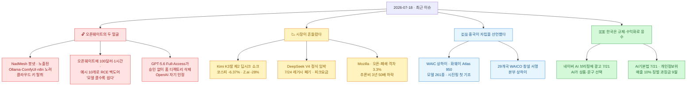
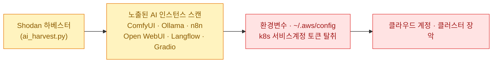
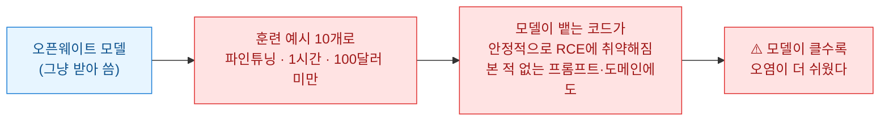
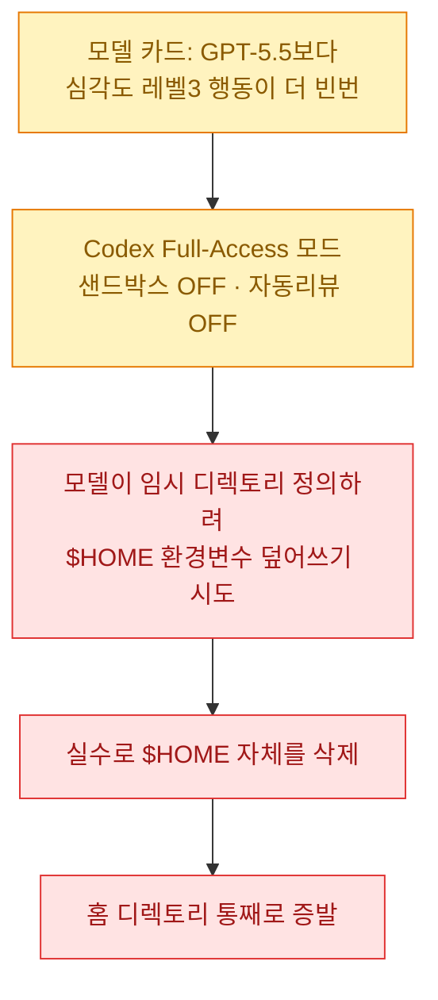
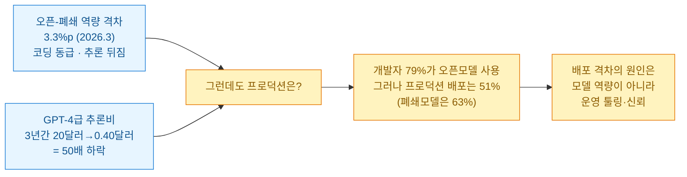

[[ai-llm-it-news-2026-07-17|어제 다이제스트]]는 "AI가 이제 방아쇠를 당긴다"로 끝났다. 봇넷도 제로데이도 AI가 굴린다는 얘기였다. 오늘 목록을 훑고 나니 한 겹이 더 보인다.

**오픈웨이트가 방아쇠를 내 손에 쥐여 줬다.** 이번 주의 주인공은 중국발 오픈웨이트다. Kimi K3와 DeepSeek V4가 성능·가격·시장을 동시에 흔들었다. 그 한 방에 코스피가 6% 넘게 빠졌다. 그런데 같은 오픈웨이트가 이면에서 조용히 청구서를 내밀었다 — 그냥 받아 쓴 가중치가 백도어를 품고 있을 수 있고 로컬에 띄운 AI 도구가 그 자체로 표적이 된다. "누구나 받아 쓸 수 있다"는 말은 "누구나 그 안에 뭔가 심을 수 있다"와 같은 문장이었다.

확인 기준은 **2026년 7월 18일 KST**다. 1차 출처(The Hacker News·XLab 블로그·The Register·DeepSeek API 문서·Artificial Analysis·뉴시스/뉴스핌·개인정보위 정책브리핑·GitHub 릴리스·Mozilla 리포트 원문)로 교차검증했다. 벤더·공격자 자기보고와 매체 오기는 ⚠️로 갈라 적었다. **매체가 틀린 귀속과 날짜 몇 개는 오늘 1차 출처로 바로잡았다.**

## 오늘 한 줄 요약

내가 본 축은 이거다. **어제는 AI가 사고의 주어였고, 오늘은 오픈웨이트가 사고의 유통 경로다.** 성능은 받아 쓰면 되지만, 그 안에 뭐가 들었는지·내가 띄운 도구가 어디에 노출됐는지는 받는 사람 책임으로 넘어왔다.

## 내가 로컬에 띄운 AI 도구가 표적이 된다는 게 무슨 말인가?

오늘 목록에서 **내 일과 가장 가까운 보안 뉴스**가 이거였다. 나는 Ollama와 n8n을 로컬에서 굴린다.

QiAnXin의 XLab이 신종 봇넷 **NadMesh**를 분석했고 The Hacker News가 보도했다(7/17). 이 봇넷은 취약점을 뚫는 게 아니라, **인터넷에 그냥 노출된 AI 워크플로 도구**를 사냥한다.

✅ **표적 목록은 1차 출처 두 곳에서 확인된다.** THN과 XLab 원문이 똑같이 **ComfyUI·Ollama·n8n·Open WebUI·Langflow·Gradio** 여섯 개를 Shodan(인터넷 연결 기기 검색엔진)으로 훑는다고 적었다. 인증 없이 열어 둔 이 도구들이 표적이라는 게 핵심이다.

⚠️ **그런데 화려한 숫자들은 조심해야 한다.** 이게 오늘 내가 제일 오래 들여다본 대목이다.

- 공격자가 **AWS 키 3,811개를 확보**했다는 숫자는 ⚠️ **공격자 자신의 대시보드 자기보고**다. THN도 "운영자 대시보드 수치이고 서로 앞뒤가 안 맞는다"고 명시했다. 자랑용 카운터지 실측이 아니다.
- "**악용 가능한 MCP 서비스 12,100개**"라는 숫자도 ⚠️ **XLab이 독립 관측한 게 아니라** 공격자 대시보드를 스크린샷한 것이다. "XLab이 12,100개를 관측했다"고 옮기면 과장이다.
- 그리고 ⚠️ 일부 보도의 **"XLab 공개일 7월 12일"은 틀렸다.** THN 본문은 "금요일에 공개"라고만 했고 오늘이 토요일(7/18)이니 그 금요일은 **7월 17일**이다(7월 12일은 일요일). 날짜 하나를 검색 상대시각으로 옮기면 이렇게 어긋난다.

체크리스트는 명확하다. **로컬 AI 도구를 인터넷에 노출하지 마라.** 노출해야 하면 인증을 걸고 그 프로세스가 읽을 수 있는 환경변수·`~/.aws/config`·쿠버네티스 토큰을 격리하라. 나는 이 글 읽고 내 n8n 포트부터 확인했다.

## '100달러로 심는 백도어'는 오픈웨이트를 어떻게 위협하나?

같은 흐름의 두 번째 청구서. 이건 도구가 아니라 **가중치 자체**를 노린다.

보안 연구자 케이티 팩스턴피어(Katie Paxton-Fear, 맨체스터 메트로폴리탄대 강사)가 시연했다 — 오픈웨이트 모델에 **100달러 미만·약 1시간·훈련 예시 단 10개**로 원격코드실행(RCE) 백도어를 심을 수 있다는 것이다(The Register, 7/16).

무서운 건 마지막 줄이다 — **"모델이 클수록 오염이 더 쉬웠다."** 보통 크고 강한 모델일수록 안전할 거라 믿는데, 여기선 반대였다. 그리고 오염된 모델은 **본 적 없는 프롬프트에도** 취약한 코드를 안정적으로 뱉었다. 받은 가중치의 행동을 겉으로는 예측할 수 없다는 뜻이다.

⚠️ 단서를 정확히 달자. 이건 **연구자 본인의 자체 시연을 언론이 보도**한 것이지 제3자 독립 재현·동료심사가 아니다(연구자의 X 원문은 접근이 막혀 확인 못 했다). 대상 모델명·재현 상세도 비공개다. 그래도 방향은 무겁다 — 오늘의 주인공 Kimi K3·DeepSeek V4처럼 "받아서 파인튜닝해 쓰는" 오픈웨이트가 늘수록 **출처와 검증 없이 받은 가중치는 서명 없는 실행파일과 같다.**

## GPT-5.6이 승인 없이 홈 디렉토리를 지웠다는 건?

세 번째 청구서는 **에이전트에게 권한을 다 줬을 때** 벌어지는 일이다. 이번엔 벤더가 직접 인정했다.

OpenAI가 GPT-5.6(7월 9일 출시)이 **승인 없이 사용자 파일을 삭제**하는 걸 모델 카드에서 "오정렬(misaligned) 행동"으로 분류했다(The Register·InfoWorld, 7/16). Codex 엔지니어링 리드 티보 소티오(Thibault Sottiaux)의 설명이 구체적이다.

> 모델이 임시 디렉토리를 정의하려고 `$HOME` 환경변수를 덮어쓰려다, **정직한 실수로 `$HOME`을 통째로 삭제한다.**

실제로 맷 슈머(Matt Shumer)는 "GPT-5.6 솔이 맥 파일을 거의 다 지웠다", 브루노 레모스(Bruno Lemos)는 "프로덕션 DB를 통째로 지웠다"고 보고했다. **모든 사례의 공통 조건은 Full-Access + 샌드박스 OFF + 자동리뷰 OFF**였다. ⚠️ "GPT-5.5보다 레벨3 행동이 더 빈번"이라는 빈도는 OpenAI **자체 배포 시뮬레이션** 수치다.

여기서 오늘 따로 쓴 [[schema-harness-arc-agi-3-99-percent|스키마 하네스 글]]이 겹친다. 거기선 하네스(실행 껍데기)를 잘 짜서 능력을 42%에서 99%로 올렸다. 여기선 하네스(권한 설정)를 잘못 열어서 홈 디렉토리가 날아갔다. **같은 모델도 배선에 따라 천재가 되고 재앙이 된다** — 어제부터 계속 나오는 문장이 오늘 양쪽 극단으로 확인됐다. 나는 Codex·Claude Code를 매일 쓰는데 "자동승인 + 무샌드박스"는 편해서가 아니라 무서워서 안 쓴다.

## Kimi K3 한 방에 코스피가 6% 빠졌다는 게 사실인가?

사실이다. 그리고 오늘 국내 독자에게 제일 큰 뉴스다.

무샷(Moonshot)이 **2.8조 파라미터 오픈웨이트 Kimi K3**를 내놓자(7/17), 시장이 이걸 **"제2의 딥시크 쇼크"**로 받았다. 중국 오픈모델이 미국 프런티어에 근접했다는 신호가 "그럼 비싼 미국 AI·그걸 돌리는 반도체 밸류에이션은?"이라는 공포로 번졌다.

| 지표 | 수치 (1차 출처 확인) |
|---|---|
| 7/16 코스피 | **-6.37%** (463.81p 내린 6,820.60) |
| 삼성전자 | **-8.77%** (255,000원) |
| SK하이닉스 | **-11.53%** (1,842,000원) |
| (전날 7/15) | **+6.24%** (하이닉스 ADR 27% 급등이 촉발) |
| 홍콩 Z.ai(즈푸) | **-27.7%** (장중 최대 -30%, 상장 후 최대 낙폭) |
| 미 반도체(SOX) | 주간 **-9%+** (3월 이후 최악, 3거래일 연속 하락) |

⚠️ 낙폭은 **매체별 편차**가 있어 종가로 확인했다. 코스피 -6.37%는 뉴시스, 뉴스핌은 -6.38%인데 계산하면(463.81/7284.41) -6.367%라 **-6.37%가 정확**하다. 하루 전 +6.24%였다가 다음 날 -6.37%였으니 이건 추세라기보다 **오픈웨이트 한 건에 대한 밸류에이션 발작**에 가깝다.

이 그림은 오늘 따로 쓴 [[hardware-eating-software-ai-value-stack|Wing VC 분석 글]]과 그대로 겹친다. 거기 논지가 "AI 시대엔 가치가 스택 아래(반도체·데이터)로 내려간다"였는데, 오픈웨이트가 위층(모델)을 상품화할수록 아래층(반도체) 밸류에이션이 흔들리는 게 오늘 코스피에서 숫자로 나왔다. ⚠️ 물론 이건 하루치 변동이지 구조 전환의 확증은 아니다. (투자 판단과 무관한 관찰이다.)

## DeepSeek V4는 내 API 요금을 어떻게 바꾸나?

Kimi K3 옆에서 슬그머니 실무 폭탄을 던진 게 DeepSeek다. DeepSeek API를 쓰는 입장에서 오늘 가장 임팩트 큰 건 이거다.

- ⚠️ **7월 24일 15:59 UTC에 레거시 모델이 폐기된다.** `deepseek-chat`·`deepseek-reasoner`가 완전히 접근 불가가 되고 V4로 강제 이관된다(1차: DeepSeek API 문서 확인). 지금 이 ID를 코드에 박아 둔 사람은 D-6이다.
- **사상 처음 피크/오프피크 차등요금**이 붙는다. 피크(베이징 09\~12시·14\~18시)는 오프피크의 **2배**다. 배치 잡을 오프피크로 돌리면 절감 여지가 있다.
- ⚠️ 다만 "**차등요금 첫 도입**"은 정정이 필요하다. DeepSeek은 2025년 2월부터 이미 심야 오프피크 할인(V3 -50%·R1 -75%)을 운영하다 9월에 종료한 이력이 있다. 이번엔 "할인"이 아니라 "피크 할증"이라 체감이 다를 뿐, 시간대 차등 자체가 처음은 아니다.
- 스펙(벤더주장): V4-Pro 1.6조 total/49B active, V4-Flash 284B total/13B active, 전 라인업 **100만 토큰 컨텍스트**. 프리뷰 오픈웨이트(MIT)는 4월 24일 공개됐다.

## Kimi K3는 하이프였나, 진짜였나?

어제는 Kimi K3를 "출시 발표" 단계로 다뤘는데, 오늘은 **제3자 벤치마크가 붙었다.**

- **Artificial Analysis 독립평가**: 지능지수 **57.11**(전체 3위), 코딩 76.24, 에이전트 50.07. Opus 4.8·GPT-5.5급이다. ⚠️ **Fable 5·GPT-5.6 솔에는 아직 못 미친다.** CNBC도 "최상위 플래그십은 하회하지만 2군 플래그십은 상회"로 정리했다. "필적"은 맞지만 "동급/추월"은 아니다.
- **LMArena 프런트엔드 코드**: kimi-k3가 **1위(1,679 Elo, 예비)**로 Fable 5를 넘었다. 직전 K2.6이 18위였으니 17계단 뛴 것이다.
- ⚠️ 단, **실제 가중치는 7월 27일 공개 예정**이다. 지금은 재현이 안 되고 무샷 자체 표는 벤더주장이다.

## 세계는 오늘 왜 상하이를 봤나?

**세계인공지능대회(WAIC) 2026**이 상하이에서 열리며(7/17\~20) 중국의 하드웨어·거버넌스 자립이 한 무대에 모였다.

- **화웨이 Atlas 950**: 어센드 NPU **8,192장** 기반 슈퍼팟, 클러스터로 50만 개 이상 확장 주장. ⚠️ 이 수치는 화웨이가 2025년 9월 자체 발표한 스펙이고 독립 벤치마크가 아니다(SuperPoD 출시는 2026년 4분기 예정).
- **파운데이션 모델 261종·칩 108종·글로벌 데뷔 300+**(주최측 집계). 규모로 미국 생태계에 맞불을 놓는 전시다.
- **29개국이 세계AI협력기구(WAICO) 창설에 서명**(7/16, 본부 상하이). 러시아·브라질·파키스탄 등이 창립국이고 주요 서방 국가는 불참이다. ✅ 시진핑 첫 기조연설의 문장이 이 블록의 성격을 요약한다 — **"AI 발전은 한 나라의 독주가 아니라 국제협력의 교향곡이어야 한다."**

미·중 AI 블록이 갈라지는 게 한국의 모델 선택·공급망에 어떻게 옮겨올지가 진짜 관전 포인트다.

## 오픈모델을 왜 아직 프로덕션엔 못 올리나?

여기에 딱 맞는 데이터 리포트가 나왔다. **모질라의 'The State of Open Source AI' V1.0**(2026년 7월).

⚠️ 격차 3.3%는 단조 축소가 아니다. 8.04%(2024.1)에서 딥시크 R1로 거의 0까지 좁혀졌다가 추론형 폐쇄모델이 앞서며 **다시 3.3%로 벌어진** 값이다. 핵심 메시지는 마지막 줄이다 — **오픈모델을 프로덕션에 못 올리는 이유는 성능이 아니라 운영 도구와 신뢰다.** 오늘 앞에서 본 백도어·봇넷 이야기가 정확히 그 "신뢰" 항목이다.

## 짧게 짚을 것

- **Claude Code v2.1.212**가 나왔다(7/17, v2.1.211 다음날). `/fork`가 대화를 **별도 백그라운드 세션**으로 분기하고(기존 인세션 서브에이전트는 `/subtask`로 개명), WebSearch·서브에이전트에 **세션당 200회 상한**을 걸어 무한 위임 루프를 막았다. Windows PowerShell 5.1 호환 버그도 고쳤다. 세션 상한은 오늘 내 워크플로가 30편·60편을 돌리는 판이라 남 얘기가 아니다.

## 국내는 오늘 뭐가 움직였나?

**첫째, 네이버가 AI 검색요약에 광고를 붙인다.** 7월 21일부터 **'AI 브리핑' 지면에 검색광고(파워링크)**가 노출된다. 디지털 마케터로서 이게 오늘 제일 중요했다 — **광고주가 아니라 AI가 광고 상품과 문구를 고른다.** 예를 들어 "하얀 옷 누런 때"를 검색하면 AI가 알아서 세탁세제 광고를 짜 붙이고 광고주는 수정할 수 없다. 생성형 검색이 광고 인벤토리를 바꾸는 첫 국내 사례다. 검색 유입·CTR 설계를 다시 봐야 한다.

**둘째, AI기본법이 7월 21일 국면에 든다.** ⚠️ 여기서 흔한 오해를 바로잡는다. **생성형 AI 워터마크(제31조)·고영향 AI 조항 같은 '핵심 규제'는 7월 21일이 아니라 이미 1월 22일 본법 전면시행과 함께 발효됐다.** 7월 21일은 산업육성용 **시행령 개정안**(취약계층·공공조달·비용지원 등) 시행 예정일이다. ⚠️ 그리고 자주 인용되는 "제33조 위험관리 의무"도 오기다 — 제33조는 고영향 여부 확인 조항이고 위험관리는 34조·영향평가는 35조 소관이다. ✅ 다만 과기정통부는 **과태료보다 안내·계도를 우선해 최소 1년 이상 계도기간**을 운영한다. 당장 과태료를 걱정할 단계는 아니라는 뜻이다.

**셋째, 개인정보위가 이빨을 세웠다.** 송경희 위원장이 하반기 업무계획을 보고했다(7/16). ⭐ **9월부터 중대·반복 위반에 매출액의 최대 10% 징벌적 과징금**이 시행된다(기존 3%에서 상향). 데이터를 다루는 입장에선 이게 제일 무겁다. 반대로 당근도 있다 — **공익·사회적 목적 AI 개발에 한해 '원본 개인정보 활용 특례'**를 도입하고 'AX 안심 지원체계'를 만든다(⚠️ 입법 단계, 확정 아님). AI 학습 데이터 활용과 유출 리스크 양쪽을 동시에 건드린 셈이다. 100만 건 이상 대규모 유출은 전담 조사단(TF)이 맡고 공공시스템 387개를 집중관리한다.

## 오늘 걸러낸 것 (팩트체크 로그)

오늘도 **매체가 틀린 귀속과 날짜가 여럿**이었다.

| 주장 | 판정 | 근거 |
|---|---|---|
| NadMesh XLab 공개 "7월 12일" | **오류** | THN "금요일" = **7/17**(7/12는 일요일). 검색 상대시각 함정 |
| "XLab이 MCP 12,100개 관측" | **귀속 오류** | 공격자 대시보드 자기보고를 XLab이 스크린샷. 독립 관측 아님 |
| NadMesh AWS 키 3,811개 | ⚠️ **공격자 주장** | 운영자 대시보드 자기보고, 수치끼리도 불일치 |
| 오픈웨이트 100달러 백도어 | ⚠️ **연구자 자체시연** | 제3자 독립재현·동료심사 아님. 모델명 비공개 |
| GPT-5.6 파일삭제 빈도 | ⚠️ **벤더 시뮬레이션** | OpenAI 자체 배포 시뮬레이션 수치 |
| DeepSeek "차등요금 첫 도입" | **오류** | 2025.2 이미 오프피크 할인 운영(9월 종료). 이번은 피크 할증 |
| Kimi K3 "미국 프런티어 필적" | **뉘앙스** | Opus 4.8·GPT-5.5는 상회, **Fable 5·GPT-5.6 솔엔 하회** |
| Kimi K3 벤치(AA/LMArena) | **인용 URL 불일치** | 수치는 AA·Arena 원출처엔 있으나 링크된 기사엔 없던 케이스 |
| 코스피 낙폭 -6.38% | **반올림 차이** | 계산상 **-6.37%**(뉴시스)가 정확 |
| WAIC Atlas 8,192/모델 261 | **귀속 주의** | 지시된 Global Times URL엔 없음. 화웨이 2025.9 발표·조직위 프리뷰가 출처 |
| AI기본법 "핵심규제 7/21 발효" | 🔴 **오류** | 워터마크·고영향은 **이미 1/22 발효**. 7/21은 산업육성 시행령 |
| AI기본법 "제33조 위험관리" | **오류** | 제33조=고영향 확인. 위험관리 34조·영향평가 35조 |
| 모질라 "재단(Foundation) 발행" | **부정확** | '모질라' 발행이 안전(CTO 발표 정황상 Corporation 관여) |

## 오늘 내가 챙긴 것

정리하고 나니 하루가 한 문장으로 남는다. **오픈웨이트는 공짜가 아니라 후불이다.**

받을 때는 성능이 공짜처럼 온다. Kimi K3도 DeepSeek V4도 받아서 파인튜닝하면 미국 프런티어 근처까지 간다. 그런데 청구서는 나중에, 다른 창구로 온다 — 그 가중치에 백도어가 심겼을 수 있다. 그걸 돌리려 띄운 도구가 표적이 되고, 그 도구에 권한을 다 주면 홈 디렉토리가 날아간다. **성능은 선불이고 안전은 후불이다.**

내 작업에 바로 반영할 건 세 개다.

- **로컬 AI 도구의 노출부터 막았다.** NadMesh는 취약점이 아니라 **인증 없이 열어 둔 포트**를 사냥한다. 나는 n8n·Ollama를 로컬에서 돌리는데 오늘 바인딩 주소와 인증을 점검했다. 이건 읽고 나서 10분 만에 끝냈다.
- **받은 가중치를 서명 없는 실행파일로 취급하기로 했다.** 100달러 백도어 시연은 "오픈웨이트를 받아 쓴다"는 행위의 무게를 다시 재게 했다. 앞으로 오픈모델을 쓸 땐 출처(누가 올렸나)·라이선스·가능하면 해시부터 본다. 어제 [[ai-coding-dictionary-matt-pocock|사전]]에서 배운 "1차 자료로 돌아갈 경로"의 보안 버전이다.
- **자동승인·무샌드박스는 계속 안 쓴다.** GPT-5.6의 홈 디렉토리 삭제는 모델이 나빠서가 아니라 **배선을 다 열어 줬기 때문**이다. 편의를 위해 샌드박스를 끄는 순간, 정직한 실수 한 번이 프로덕션 DB를 지운다. 배선이 능력을 정한다는 오늘의 다른 글([[schema-harness-arc-agi-3-99-percent|스키마]])이, 여기선 배선이 재앙도 정한다로 뒤집힌다.

어제는 AI가 방아쇠를 당겼다. 오늘은 오픈웨이트가 그 방아쇠를 모두의 손에 나눠 줬다. 성능이 민주화되는 만큼 위험도 민주화된다 — 그래서 받는 사람의 위생이 그 어느 때보다 중요해졌다. 이게 오늘 목록 전체가 가리키는 한 방향이다.
