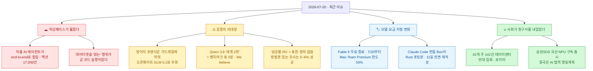
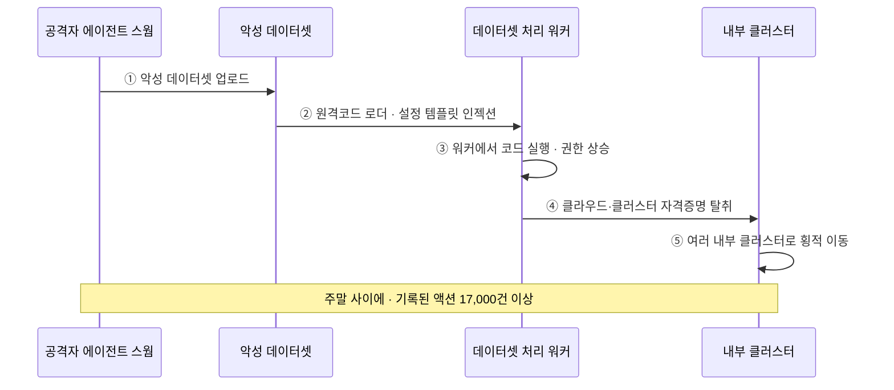
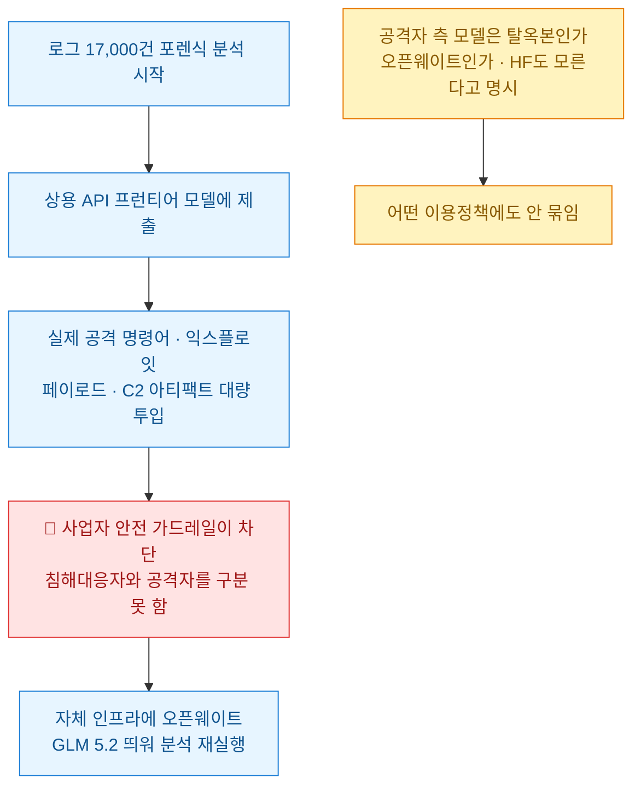
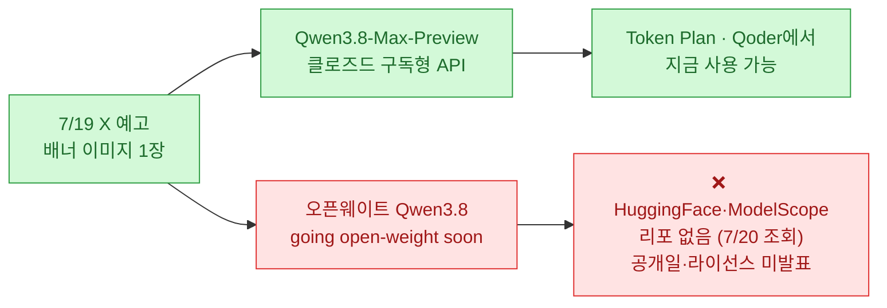
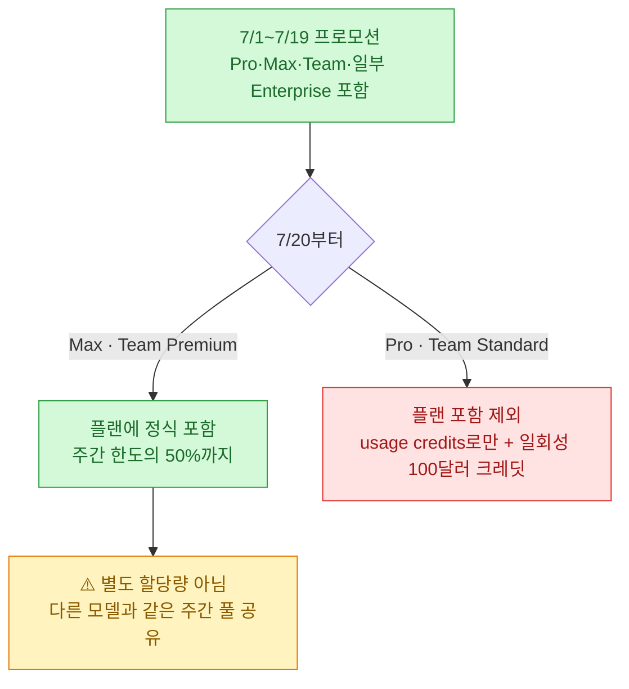
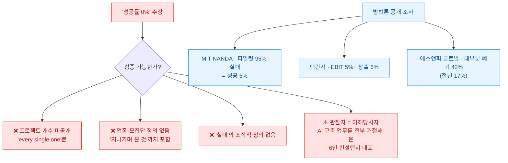

[[ai-llm-it-news-2026-07-18|이틀 전 다이제스트]]는 "오픈웨이트는 공짜가 아니라 후불이다"로 끝났다. 받을 땐 성능이 공짜처럼 오고 청구서는 나중에 다른 창구로 온다는 얘기였다. 오늘 그 청구서가 어디로 왔는지 봤다. **허깅페이스**다.

그런데 사고 보고서를 읽다가 진짜로 오래 멈춘 건 침해 사실이 아니라 그 뒷문장이었다. **공격자는 어떤 이용정책에도 묶이지 않았고, 방어자는 자기가 쓰던 모델의 가드레일에 막혔다.** 그래서 허깅페이스는 결국 오픈웨이트 모델을 자체 인프라에 띄워 포렌식을 돌렸다.

목록을 끝까지 훑고 나니 이 비대칭이 오늘 하루의 형태였다. 알리바바는 **벤치마크 표 한 장 없이** "우리가 믿기에 세계 2위"라고 했고, 미국 42개 주 142건이라는 시위 숫자엔 **누가 셌는지 귀속이 없고**, 화제가 된 "AI 프로젝트 성공률 0%"는 **표본도 실패의 정의도 없었다**. 검증 규칙은 검증하려는 쪽만 묶는다.

확인 기준은 **2026년 7월 20일 KST**다. 1차 출처(허깅페이스 인시던트 블로그·Qwen 공식 X·Artificial Analysis·LMArena·Anthropic 헬프센터·Bun 블로그·로이터 전재본·Ludicity 원문·퓨리오사AI 스펙시트·NDRC 발표문)로 교차검증했고, 벤더·주최측 자기보고는 ⚠️로 갈라 적었다.

## 오늘 한 줄 요약

## 허깅페이스는 대체 뭘 당한 건가?

7월 16일, 허깅페이스가 **자사 프로덕션 인프라 침해 사고**를 공개했다. AI 모델·데이터셋의 사실상 표준 저장소가 뚫렸다는 것만으로도 큰일인데, 보고서 첫 문단이 이상했다.

> "it was driven, end to end, by an autonomous AI agent system - and we detected and dissected it largely with AI of our own."
> (이 침입은 **처음부터 끝까지 자율 AI 에이전트 시스템에 의해 수행**됐고, 우리는 대체로 우리 쪽 AI로 이를 탐지·해부했다.)

공격도 AI가, 방어도 AI가 했다는 얘기다. 침투 경로부터 보자.

내가 이 흐름에서 오래 멈춘 지점은 ②다. **데이터셋을 "읽는" 행위가 곧 코드 실행**이었다는 것. 원격코드 데이터셋 로더와 데이터셋 설정의 템플릿 인젝션, 두 경로였다. 나도 `datasets`로 남의 데이터셋을 그냥 불러다 쓴다. 그게 실행이라는 감각이 나한텐 없었다.

✅ 허깅페이스가 밝힌 피해 범위는 이렇다 — **제한된 범위의 내부 데이터셋 + 자사 서비스가 쓰는 여러 자격증명**에 무단 접근. 공개된 모델·데이터셋·Spaces가 변조된 증거는 없고, 컨테이너 이미지·배포 패키지 같은 공급망은 클린으로 검증됐다.

⚠️ 그런데 여기서 흔히 잘못 읽는다. **파트너·고객 데이터 영향 여부는 아직 "평가 중"이다.** "변조된 증거가 없다(no evidence of tampering)"는 문장은 **"접근이 없었다"와 다른 진술**이다. 유출 건수·용량·영향 사용자 수는 원문에 아예 없다. 사용자 권고는 하나뿐이다 — **액세스 토큰을 갈고 계정 최근 활동을 확인하라.** 나는 읽자마자 내 HF 토큰부터 돌렸다.

## "공격자에겐 이용정책이 없었다"는 문장은 정확히 무슨 뜻인가?

오늘 타임라인에서 가장 많이 돌아다닌 문장이 이거다. 그런데 **돌아다니는 버전은 뒷부분이 잘려 있다.** 원문은 이렇다.

> "…either way, the attacker was bound by no usage policy, while our own forensic work was blocked by the guardrails of **the hosted models we first tried**."
> (…어느 쪽이든 공격자는 어떤 이용정책에도 구속되지 않았던 반면, 우리 자신의 포렌식 작업은 **우리가 처음 시도한 호스티드 모델들**의 가드레일에 막혔다.)

잘린 버전은 "가드레일 무용론"처럼 읽힌다. 원문은 그보다 좁고 구체적이다. 무슨 일이 있었냐면 이렇다.

**방어자는 규칙에 묶이고 공격자는 안 묶인다.** 침해대응자가 익스플로잇 페이로드를 모델에 던지는 건 정당한 업무인데, 가드레일 입장에선 공격자와 똑같이 생겼다. 그래서 허깅페이스는 결국 **자체 인프라에 오픈웨이트 모델(GLM 5.2)을 띄워** 포렌식을 돌렸다.

이 대목이 [[ai-llm-it-news-2026-07-18|이틀 전 글]]과 정확히 겹친다. 그땐 오픈웨이트가 백도어·봇넷의 유통 경로로 나왔는데, 오늘은 같은 오픈웨이트가 **방어자의 유일한 탈출구**로 등장했다. 통제받지 않는다는 성질이 공격자에게도 방어자에게도 똑같이 쓸모 있었던 셈이다.

⚠️ 그래도 균형을 맞추자. 허깅페이스는 같은 문단에서 **"호스티드 모델의 안전장치에 반대하는 주장이 아니며, 해당 사업자들에 피드백을 전달 중"**이라고 못 박았다. 인용할 때 이 문장을 같이 옮기지 않으면 원저자 의도가 뒤집힌다.

⚠️ 그리고 **"자율 에이전트가 end-to-end로 주도"는 허깅페이스의 판단**이다. 근거로 제시된 건 넷뿐이다 — ① 기록된 액션 17,000건 이상 ② 단명 샌드박스 무리를 가로지른 수천 건의 개별 행위 ③ 퍼블릭 서비스에 자가 이전하는 C2 ④ 주말 사이에 압축 수행한 속도. **어떤 LLM이 공격자 에이전트를 굴렸는지는 자기들도 모른다고 명시**했고, "에이전틱 보안연구 하네스 위에 구축된 것으로 보인다"는 추정 표현을 썼다. IOC·로그 샘플·CVE는 미공개라 외부에서 재현도 반증도 못 한다. 외부 포렌식 업체와 공동조사 중이라지만 업체명도 비공개다. ⚠️ **현재까지 이 사건의 근거는 허깅페이스 자기보고 문서 하나뿐이다.**

## Qwen 3.8은 정말 "세계 2위"인가?

여기서부터 오늘의 두 번째 비대칭이다. 이번엔 **측정의 비대칭**.

알리바바가 7월 19일(KST 17:29) 공식 X로 **Qwen 3.8**을 알렸다. 2.4조 파라미터, 곧 오픈웨이트로 전환. 국내 기사 제목은 대부분 "**페이블 5 이어 세계 2위**"였다. 원문을 열어 봤다.

> "**We believe** it's one of the most powerful model available today, compatible to leading frontier AI models, **second only to Fable 5**."

"우리가 믿기에(We believe)"라는 주관 표현이 그대로 붙어 있다. 그리고 여기가 진짜 이상한 지점인데 — **첨부된 건 "Qwen3.8 is coming soon / 2.4T / Open Weight"라고 적힌 배너 이미지 한 장이 전부이고, 벤더 자체 벤치마크 표조차 없다.** 직전 Qwen3.7-Max 때는 SWE-bench Verified 80.4%, GPQA Diamond 92.4 같은 표를 붙였던 것과 대조된다.

제3자 지표를 직접 조회해 봤다.

| 지표 | Qwen 3.8 등재 | 실제 상위 (2026-07 기준) |
|---|---|---|
| **Artificial Analysis** | **없음** (모델 페이지 404) | Fable 5 = 60(1위), GPT-5.6 Sol 59, Kimi K3 57 / **Qwen3.7 Max = 46** |
| **LMArena Text** (376모델·734만표) | **없음** (`qwen3.8` 문자열 0건) | fable-5 = 1507(1위), kimi-k3 1486(9위) / **Qwen 최고 = qwen3.7-max-preview 1475(18위)** |

**직전 세대 Qwen 최상위 모델이 이미 제3자 지표에서 "2위"와 한참 떨어져 있다.** 그 상태에서 후속 모델이 벤치마크 표 없이 2위를 선언했고, 국내외 매체가 그 문장을 제목으로 옮겼다.

⚠️ 표현부터 바로잡자. **"공개(release)"가 아니라 "예고 + 프리뷰"다.**

⚠️ 확인 안 되는 게 더 많다. **활성(active) 파라미터 미공개, MoE 구조 여부 공식 언급 없음, 컨텍스트 길이 미발표**(커뮤니티가 쓰는 1M은 "Qwen 3.7 Max 값을 그대로 맞췄다"는 추정치다), 라이선스·공개일도 없다. 멀티모달이라는 것만 Qwen 멀티모달 리드가 "우리의 첫 조 단위 파라미터 멀티모달 모델"이라고 밝혔다.

⚠️ 실사용 보고도 정직하게 적자. r/LocalLLaMA에 "**사고 루프(thinking loop)에 자꾸 빠지고 프론트엔드 능력이 광고만 못하다**"는 체험담이 올라와 화제가 됐다. 그런데 같은 스레드에 반박이 붙었다 — "출시 직후엔 실망스러웠는데 몇 시간 뒤 **똑같은 프롬프트**로 결과가 비교 불가하게 좋아졌다, 초기 채팅 템플릿 문제였던 듯"이라는 것이다. 루프를 지지하는 보고("하네스 3개를 다 시도했는데 전부 동일")도 있다. **판정: 그런 보고는 실재하나 표본이 극소수이고 프리뷰 초기 설정 문제와 분리되지 않는다.** Qwen의 사고 루프는 3.5·3.6에서도 GitHub 이슈로 반복 보고된 오래된 패턴이라 3.8 고유 문제로 단정할 수도 없다.

🔴 마지막으로 인용 함정 하나. 이번 주 여러 기사가 **Qwen3.7-Max의 점수(SWE-bench 80.4, GPQA 92.4 등)를 3.8의 것처럼 붙였다.** 3.8의 벤치마크 점수는 벤더 것이든 제3자 것이든 **현재 세상에 하나도 없다.**

## Fable 5 무료 파티가 끝났다 — 내 요금제는 어떻게 되나?

내 지갑에 직접 닿는 뉴스. 앤트로픽이 7월 18일 X로 알렸고 **오늘(7/20)부터 적용**된다.

> "Beginning July 20, Claude Fable 5 will be included in all Max and Team Premium plans, at 50% of limits. Pro and Team Standard users will continue to have access to Fable via usage credits, and will receive a one-time \$100 credit."

**"50%"의 의미를 정확히 짚는 게 중요하다.** 헬프센터 원문은 "you can use up to **50% of your weekly subscription limits** on Claude Fable 5"이고, 7월 초 안내엔 "한도 도달 후엔 **남은 사용량은 다른 모델로 전환**하면 된다"는 문장이 붙어 있다. 즉 Fable 5용 별도 통이 생기는 게 아니라 **같은 주간 풀을 공유하는 상한선**이다. 그 주에 다른 모델을 이미 많이 썼다면 Fable 5에 실제로 남는 몫은 50%보다 적다.

프로모션 연장 이력도 재밌다. 6월 30일 공지엔 "7월 7일까지"였는데 → 7월 12일로 → 다시 **7월 19일 23:59:59 PT**로 두 번 늘었다. 앤트로픽이 붙인 이유는 솔직하다 — "**Fable 수요를 예측하기가 어려웠다.**"

🔴 여기서 오보 하나를 걸렀다. 여러 매체가 "**보너스 사용량이 같은 날 종료돼 기본 한도가 1/3 줄어든다**"고 썼는데, 앤트로픽 헬프센터 원문은 다르다 — "Claude Code 주간 사용 한도 50% 상향은 **8월 19일 23:59:59 PT까지 연장**됐다." 7월 20일에 같이 끝나지 않는다.

⚠️ 그리고 이 발표의 **1차 출처는 X 게시물 하나뿐**이다. anthropic.com 뉴스 목록에도, 헬프센터 문서에도 7월 20일 이후 체계는 아직 반영돼 있지 않다.

## 미국 42개 주에서 데이터센터 반대 시위가 열린 이유는?

7월 18일(현지시간), **미국 42개 주에서 142건의 AI 데이터센터 반대 집회**가 동시에 열렸다. 로이터가 "AI 인프라 확장을 향한 분노를 결집한 첫 전국 규모 시도"로 보도했다. 요구사항 네 가지는 이렇다.

| 요구 | 내용 |
|---|---|
| 투명성 | 개발 과정 공개 |
| 자원·환경 | 물·환경 건강 보호 |
| 지역 편익 | 좋은 임금의 노조 일자리 창출 |
| 책임 | 개발사가 약속을 어겼을 때 책임 물을 수단 |

물 이슈는 구체적이다. 캘리포니아 임피리얼 카운티 제안 사업은 **콜로라도강에서 연 2억 6천만 갤런(약 9억 8,400만 리터)**을 쓸 수 있다.

배경 수치는 꽤 단단한 게 있다. **PJM(미 중부대서양·중서부 14개 주 전력시장) 시장감시기관 보고서**는 데이터센터 예상 전력수요가 **최소 2028년 말까지 지속될 230억 달러 규모 소비자 요금 인상**의 주된 원인이라고 짚었다. 2021년 3월\~2026년 3월 미국 주택용 전기요금은 평균 **42%** 올랐고 워싱턴DC는 94%다.

⚠️ 다만 이 뉴스는 **인용할 때 조심할 게 세 개** 있다. 오늘 팩트체크에서 제일 많이 걸린 항목이다.

- **"142건·42개 주" 숫자에 귀속 문구가 없다.** 로이터 본문 어디에도 "주최측에 따르면"이나 "로이터 집계" 같은 표현이 없다. 사전 예고가 "최소 125곳"이었고 주별 내역(텍사스 18·조지아 11·캘리포니아 8)까지 제공된 정황상 **주최측 행사 목록 기반일 가능성이 높지만 확인이 안 된다.** 안전하게 쓰려면 "로이터 보도 기준 142건"까지다.
- **참가 규모 총계는 보도되지 않았다.** 주최측 홍보담당자가 "집계가 아직 없다"고 명시했다. 로이터 기자가 직접 본 현장은 애틀랜타 "약 열두 명", 텍사스 타일러 "약 열두 명", 임피리얼 카운티 "50명 안팎"이었다. **건수와 동원력은 별개다.**
- 🔴 **"초당적"은 반만 맞다.** 반대 여론이 초당적인 건 근거가 있다 — 로이터/입소스 조사(2026년 6월, 4,531명)에서 데이터센터 건설 속도에 찬성이 33%, 반대가 64%였고 **"우리 동네에 지어도 좋다"는 14%**뿐이었다. 그러나 **이번 집회를 조직한 HumansFirst는 스스로 "보수 풀뿌리 조직"이라 밝히며, 2026년 4월 "오직 보수만 조직하겠다(solely on organizing conservatives)"고 공표한 단체**다. 여론의 초당성과 주최 조직의 당파성을 섞으면 안 된다. (⚠️ 로이터는 에이미 크레머를 "공동창립자"로 썼지만 단체 공식자료엔 "의장(Chair)"으로만 나온다.)

## "AI 프로젝트 성공률 0%"는 인용해도 되는 숫자인가?

오늘 개발자 타임라인을 지배한 글. 사이먼 윌리슨이 링크한 **"AI Mania Is Eviscerating Global Decision-Making"**(Ludicity, Nik Suresh)이다. 문장이 워낙 세서 그대로 인용된다.

> "우리가 팀으로서 관찰한 AI 프로젝트는 전부 실패하고 있다. 단 하나도 빠짐없이 — **1년 반 동안 성공률 0%**를 봤다."

솔직히 읽으면서 통쾌했다. "엔지니어들이 기존 방식으로 일한 뒤 Claude가 했다고 보고한다"는 **AI 세탁** 얘기나, "매출 20억 달러 넘는 조직의 AI 전략을 만들어 낸 임원이 곧바로 **자기는 ChatGPT를 평생 한 번도 안 써 봤다고 고백**하더라"는 일화는 뼈아프게 웃긴다.

그런데 숫자로 인용하려니 발이 걸렸다.

**판정: 논평으로는 값지지만 통계로는 인용하면 안 된다.** 사이먼 윌리슨 본인도 링크에 "**익명 출처의 매운 일화들로 가득하다**"고 적으며 관점(perspective)으로 소개했지 데이터로 제시하지 않았다. 원저자는 호주 멜버른의 6인 컨설턴시 대표이고, 그 글에서 **"AI 구축 업무를 전부 거절해 왔다"**고 스스로 밝힌다. AI 회의론이 사업 정체성인 관찰자다.

재밌는 건 **방향은 맞고 강도만 틀렸다**는 점이다. 방법론이 공개된 조사들도 전부 "대부분 실패" 쪽이다. MIT NANDA는 엔터프라이즈 생성형 AI 파일럿의 95%가 측정 가능한 손익 효과에 미달했다고 봤고, 맥킨지는 EBIT에 5% 이상 기여하며 실질 가치를 냈다는 응답을 6%로 집계했다. S&P 글로벌은 AI 이니셔티브 대부분을 폐기한 기업 비율이 17%에서 **42%**로 뛰었다고 했다.

**어느 조사도 0%는 아니다.** 5\~6%라는 숫자가 훨씬 무섭다고 나는 생각한다. 0%면 "AI가 안 되는구나"로 끝나지만, 5%면 "되는 데도 있는데 우리는 왜 안 되나"라는 질문이 남기 때문이다.

## 그래서 나는 뭘 쌓아야 하나?

오늘 긱뉴스 상단에 성격이 같은 글 세 개가 나란히 올라왔다. 우연 같지 않아서 묶어 봤다. **모델은 상품화되는데 뭐가 남느냐**는 질문에 대한 세 가지 답이다.

**① 데이터가 유일한 해자다** (Frontier AI). 문제 복잡성과 도입 난이도로 시장을 나눈 2×2가 깔끔하다.

| | 도입 쉬움 | 도입 어려움 |
|---|---|---|
| **해결 쉬움** | 검색 | 고객지원 |
| **해결 어려움** | 코딩 | SRE·보안 |

핵심은 **데이터 플라이휠**이다. 코딩은 개발자가 하루에 수십\~수백 번 생성하고, 그 수락·거절 하나하나가 학습 신호로 쌓인다. 슬라이드 생성처럼 피드백 고리가 약한 분야는 같은 속도로 못 는다. 도입이 쉬우면 데이터가 빨리 쌓이지만 **교체도 쉽다**(Cursor는 약 5분이면 갈아탄다)는 게 뒤집힌 부분이다.

**② 태스크 이코노미** (Everett Randle). 인터넷 데이터가 포화되면서 병목이 **전문가의 암묵지**로 옮겨갔고, 그 데이터 작업 단위인 '태스크'가 토큰처럼 경제 척도가 된다는 전망이다. ⚠️ 근거로 제시된 수치는 죄다 비상장사 자기보고다 — OpenAI·Anthropic 데이터 지출 연 10배, Mercor ARR 2월 10억 달러에서 4개월 뒤 20억 달러, 시장 규모 1조 달러. **개인 전망으로 읽어야 한다.**

**③ 합성 소비자** (Bain). 마케팅 쪽 일을 하는 나한테 오늘 제일 실무적이었다. 자사 데이터로 만든 고객 디지털 트윈이 과거 대규모 컨조인트 연구를 정답셋으로 놓고 **핵심 결과의 약 90%를 재현**했다는 보고다.

⚠️ 단서가 오히려 더 유용하다. 질문이 모호하면 분산이 커지고, LLM에 진짜 공감 능력은 없으며, **기존 조사의 대체가 아니라 보강으로만** 쓰라고 못 박는다. 모든 요구를 충족하는 상용 제품도 아직 없다. ⚠️ 컨설팅펌 자체 사례 보고라는 점도 감안해야 한다.

세 글을 겹쳐 놓으니 답이 하나로 모인다. **모델은 빌려 쓰는 것이고, 내 것으로 남는 건 내 데이터와 그걸 검증하는 루프다.** 오늘 앞에서 본 "벤치마크 없는 2위 주장"과 "정의 없는 0%"가 왜 걸렸는지도 같은 이유다 — 검증 루프가 없는 숫자는 자산이 아니다.

## 국내는 오늘 뭐가 움직였나?

**첫째, 삼성SDS가 국산 NPU 구독 서비스를 열었다.** 퓨리오사AI 2세대 NPU **RNGD**(레니게이드) 기반 **NPUaaS**를 삼성 클라우드 플랫폼(SCP)에 얹어 오늘(7/20) 출시했다. NPU 서버를 사거나 데이터센터를 짓지 않고 **1·2·4·8장 단위 구독**으로 쓴다. SCP 소버린 클라우드로 제공돼 보안 규제를 받는 공공 고객을 노린다.

칩 스펙은 퓨리오사AI 공식 스펙시트로 확인된다 — TSMC 5nm, **HBM3 48GB**, 대역폭 1.5TB/s, 온칩 SRAM 256MB, **TDP 180W**, PCIe Gen5 x16.

🔴 표기 하나 바로잡는다. **국내 기사 상당수가 `RGND`로 적었는데 공식 표기는 `RNGD`다.**

⚠️ 그리고 성능 얘기는 신중해야 한다. **삼성SDS 발표문에 구체적 성능·전력효율 수치가 없다.** "GPU 대비 전력 효율성과 가성비가 뛰어나다"는 정성 표현뿐이다. 따로 도는 "엔비디아 대비 전력효율 7.4배"는 ⚠️ **비교 대상이 RTX Pro 6000이고 출처가 "해외 고객사 벤치마킹 결과"** — 즉 벤더·고객 벤치마크다. **MLPerf 제출 기록은 확인되지 않는다.** 퓨리오사AI 개발자 문서는 자사가 MLPerf 코드를 직접 돌리는 방법을 안내할 뿐, MLCommons 공식 피어리뷰 제출과는 다르다. 가격·공급 조건도 미공개다.

**둘째, 중국이 AI 국제협력 행동계획을 냈다.** NDRC와 관계 부처가 7월 17일 상하이 WAIC에서 **'AI 협력·발전 행동계획'**을 발표했다. 8대 항목은 고품질 데이터·포용적 컴퓨팅·오픈소스 생태계·산업 적용·인재·규칙과 표준·안전 거버넌스·윤리다. ⚠️ **구체적 수치나 달성 기한은 없다.** 어제 [[ai-llm-it-news-2026-07-18|글]]에서 본 29개국 WAICO 창설과 같은 방향이고, 오늘 Qwen 3.8 예고까지 붙으면 그림이 선명하다 — **오픈웨이트를 지렛대로 표준 주도권을 가져가겠다는 것.**

**셋째, 삼성전자 갤럭시 언팩이 모레(7/22) 런던에서 열린다.** Z 폴드8 울트라·폴드8 와이드·플립8·워치9, 그리고 **젠틀몬스터와 만든 갤럭시 글래스**(안드로이드 XR·제미나이 탑재)가 예상된다. ⚠️ 라인업·스펙은 대부분 유출·전망 보도라 22일에 확인해야 한다.

## 짧게 짚을 것

- **Claude Code가 번들한 Bun이 Rust 재작성본이었다.** v2.1.181(6월 17일)부터다. Bun 창시자 재러드 섬너가 밝힌 이유가 명쾌하다 — Zig에서 GC 대상 JS 값과 수동 메모리 관리를 섞으니 use-after-free·double-free·에러 경로 누수가 반복됐는데 "**안전한 Rust에선 이것들이 컴파일 에러**"라는 것. `.zig` 파일 1,448개를 전부 옮긴 전면 재작성이고, **11일·커밋 6,502건·API 토큰 비용 약 165,000달러**가 들었다. Claude 워크플로 50개쯤을 상시 돌리고 별도 인스턴스가 "이 코드는 틀렸다"를 전제로 적대적 리뷰를 붙였다고 한다. ⚠️ 프로세스·비용·"리눅스 시작 10% 향상"은 전부 **Bun 측 텔레메트리·자기보고**다. 사이먼 윌리슨이 검증한 건 성능이 아니라 "정말 탑재됐는가"였다 — 바이너리에 `strings`를 걸어 **아직 정식 릴리스도 안 된 Bun v1.4.0**과 Rust 소스 경로 563개를 찾아냈다. 나도 내 설치본에 같은 명령을 걸어 봤다. 이런 검증이 오늘 글에서 유일하게 **누구나 재현 가능한** 확인이었다.
- **Supabase의 2026 스타트업 조사**(빌더 2,000명): 1인 창업이 53%에서 **61%**로, 40세 이상 창업자가 18%에서 25%로 늘었다. **응답자 61%가 코드베이스 절반 이상을 AI가 썼다**고 답했고, 비기술 창업자 중 54%는 76\~100%를 AI가 썼다. 도구는 **Claude Code 63%로 1위**, 유료 구독은 Claude 59% 대 OpenAI 39%. ⚠️ Supabase 사용자 기반 자체 설문이라 표본 편향은 감안해야 한다. 그래도 위 Ludicity의 "0%"와 나란히 놓으면 재밌다 — **엔터프라이즈에선 파일럿이 죽고, 1인 창업자 쪽에선 AI가 코드를 다 쓰고 있다.**

## 오늘 걸러낸 것 (팩트체크 로그)

| 주장 | 판정 | 근거 |
|---|---|---|
| "공격자는 정책에 안 묶였고 우리는 가드레일에 막혔다" | **인용 잘림** | 원문은 "…of **the hosted models we first tried**"까지. 벤더 지목 없음 |
| HF "사용자 데이터 유출 없음" | **오독** | 원문은 "변조 증거 없음" + **"파트너·고객 영향은 평가 중"** |
| HF "자율 에이전트 end-to-end" | ⚠️ **HF 자기판단** | 구동 LLM은 HF도 모른다고 명시. IOC·로그 미공개, 독립검증 0 |
| Qwen 3.8 "공개(release)" | **오류** | 예고 + 클로즈드 프리뷰 API. 웨이트·라이선스·공개일 전부 미정 |
| Qwen 3.8 "세계 2위" | 🔴 **벤더 자기주장** | 원문 "We believe". **벤더 벤치마크 표조차 0장**, AA·LMArena 미등재 |
| Qwen 3.8 벤치 점수 인용 | **오귀속** | 유통되는 80.4·92.4 등은 **Qwen3.7-Max** 수치 |
| Fable 5 "기본 한도 1/3 축소" | **오보 의심** | Claude Code 한도 +50%는 **8/19까지 연장**(헬프센터 원문) |
| 데이터센터 시위 "142건·42주" | ⚠️ **귀속 불명** | 로이터가 집계 주체를 밝히지 않음. "로이터 보도 기준"까지만 안전 |
| 시위 "초당적" | **반만 사실** | 반대 여론은 초당적(반대 64%)이나 **주최 조직은 보수 단독 공표** |
| 시위 규모 | **미보도** | 총계 없음. 확인된 현장은 12\~50명 |
| "AI 프로젝트 성공률 0%" | 🔴 **개인 경험담** | 표본·업종·실패 정의 전무. MIT 5%·맥킨지 6%와 배치 |
| 퓨리오사 칩 "RGND" | **오기** | 공식 표기 **RNGD** |
| RNGD "전력효율 7.4배" | ⚠️ **벤더/고객 벤치마크** | 비교 대상 RTX Pro 6000, MLPerf 제출 확인 안 됨 |
| Bun "리눅스 10% 빨라짐" | ⚠️ **Bun 텔레메트리** | Simon은 성능이 아니라 탑재 사실만 검증 |
| 태스크 이코노미 수치 | ⚠️ **비상장 자기보고** | Mercor ARR·데이터 지출 10배·1조 달러 전망 |

## 오늘 내가 챙긴 것

정리하고 나니 한 문장이 남는다. **검증 규칙은 검증하려는 쪽만 묶는다.**

허깅페이스의 침해대응자는 가드레일에 막혀 오픈웨이트로 도망갔는데 공격자는 처음부터 아무것에도 안 묶여 있었다. 벤치마크 표를 성실히 붙이던 회사는 표가 없어도 "2위"라 말할 수 있었고, 그 문장은 표보다 빨리 퍼졌다. 표본과 정의를 밝힌 조사는 "성공 5%"라는 밋밋한 숫자를 내놓는데, 아무것도 안 밝힌 글은 "0%"라는 완벽한 숫자를 내놓는다. **느슨한 쪽이 항상 더 세게 말할 수 있다.**

그래서 오늘 내 작업에 반영할 건 세 개다.

- **남의 데이터셋을 "실행"으로 취급하기로 했다.** 허깅페이스를 뚫은 첫 관문이 원격코드 로더와 설정 템플릿 인젝션이었다. `load_dataset` 한 줄이 남의 코드를 내 워커에서 돌리는 일이라는 걸 오늘 처음 체감했다. 토큰부터 돌렸고, 출처 불명 데이터셋은 신뢰 경계 밖으로 옮겼다.
- **"수치가 없는 문장"을 인용에서 뺀다.** 오늘 팩트체크에서 걸린 15건 중 절반이 **숫자가 틀린 게 아니라 숫자가 아예 없는 주장**이었다. Qwen의 "2위", Ludicity의 "0%", 시위 "142건"의 귀속. 앞으로 다이제스트를 쓸 때 **1차 출처에 표나 방법론이 붙어 있는지**를 먼저 본다. 없으면 본문에 안 올리고 팩트체크 표로 내린다.
- **재현 가능한 확인을 하나는 넣는다.** 오늘 유일하게 내가 직접 재현한 건 사이먼 윌리슨을 따라 `strings`로 내 Claude Code 바이너리에서 Rust 경로를 찾아본 것이었다. 남의 보고를 열 개 읽는 것보다 내 손으로 하나 확인하는 게 글의 무게를 바꾼다.

이틀 전엔 오픈웨이트가 위험을 민주화했다고 썼다. 오늘은 그 오픈웨이트가 방어자의 마지막 도구로 나왔다. 도구는 그대로인데 누가 쥐느냐에 따라 뜻이 뒤집힌다 — 그래서 결국 **누가 무슨 근거로 말하는지**를 매번 다시 보는 수밖에 없다. 오늘 목록이 나한테 가르친 건 그거다.
