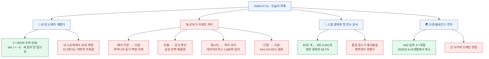
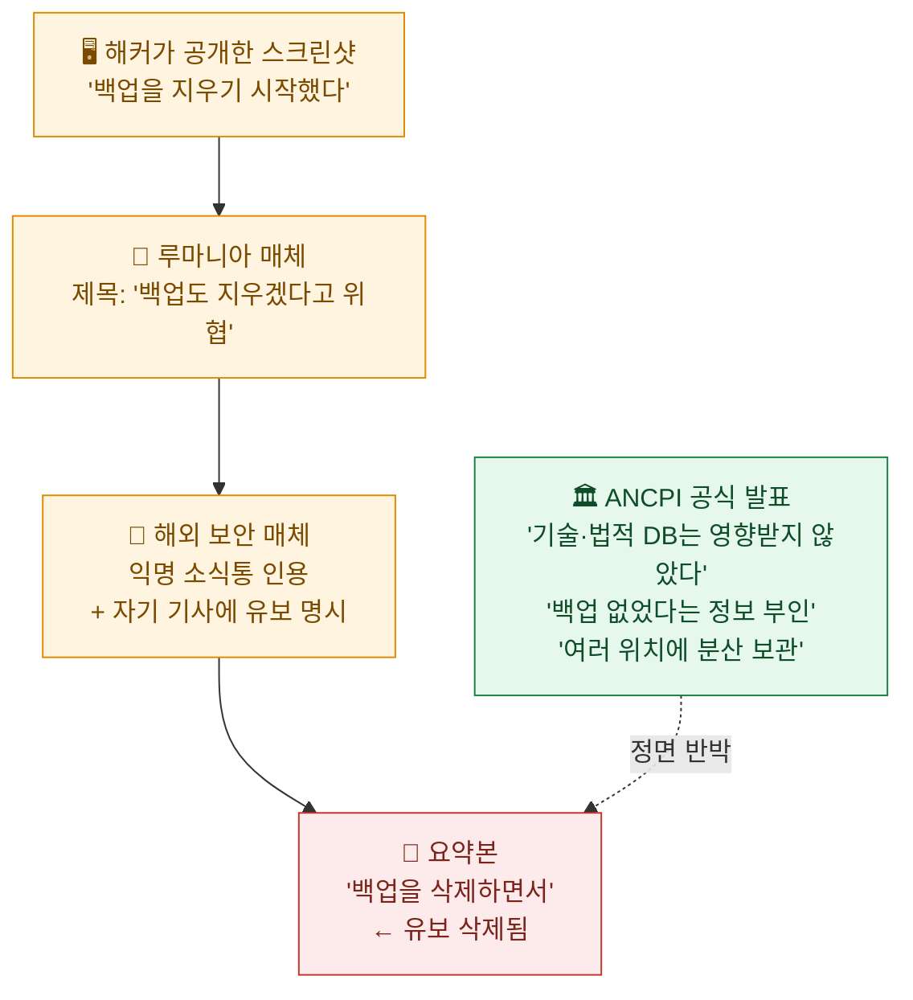

오늘 아침 목록 맨 위에 87년짜리 뉴스가 있었다. **야코비 추측이 반례로 깨졌다.** 나는 이걸 sympy로 30초 만에 재현했고, 따로 [글 한 편](jacobian-conjecture-counterexample-verified)으로 정리했다.

그런데 목록을 끝까지 훑고 나서 머리에 남은 건 그 뉴스가 아니었다. **그 옆에 있던 것들이었다.**

루마니아 등기 해킹은 "해커가 백업까지 삭제했다"로 적혀 있었는데, 원 보도에는 *"해커가 주장하기로는"* 이 붙어 있었고 기관은 정면 부인 중이었다. 삼성 언팩 기사엔 제품명이 또렷한데 삼성 공식 초청장에는 제품명이 **한 줄도 없었다.** 데이터브릭스는 "1,880억 달러에 투자를 유치했다"는데 원문 제목은 현재진행형 *"is Raising"* 이었다. Kimi는 "용량 한계에 도달했다"는데 공식 문구는 *"close to the limits"*(한계에 근접)였다.

전부 원문에는 유보가 붙어 있었다. **전달되는 동안 한 칸씩 지워졌을 뿐이다.**

확인 기준은 **2026년 7월 21일 KST**다. 1차 출처(X 원 게시물·Via LA 특허목록 PDF·삼성 뉴스룸 초청장·Databricks 공식 PR·Moonshot 공식 X·ANCPI 공식 발표·arXiv 원문·영국 AISI 블로그·실험 사이트 내부 API)로 되짚었고, 벤더 자기보고는 ⚠️로 갈라 적었다.

## 오늘 한 장 요약



## 야코비 추측은 정확히 무엇이 깨진 건가?

정수론 수학자 **Levent Alpöge**가 2026년 7월 20일 02:19 UTC에 X에 반례를 올렸다. 문제를 물어본 사람은 시카고대 **Akhil Mathew** 교수고, 반례 생성에 **Claude Fable**이 쓰였다고 본인이 밝혔다.

내가 재현한 결과만 옮긴다. `fractions.Fraction`으로 부동소수점 없이 정확 유리수 산술만 썼다.

```
det J = -2 | 상수인가: True
f('0', '0', '-1/4')     = ('-1/4', '0', '0')
f('1', '-3/2', '13/2')  = ('-1/4', '0', '0')
f('-1', '3/2', '13/2')  = ('-1/4', '0', '0')
f⁻¹((-1/4,0,0)) 해 개수: 3
```

서로 다른 세 점이 같은 곳으로 간다. 단사가 아니다. 반례가 맞다. 표수 함정도 없다 — 오히려 **표수 2에서는 `det = −2 ≡ 0`이라 가정 자체가 붕괴**하므로 표수 0 전용 반례다.

수학계 반응도 일치한다. Kevin Buzzard(Lean mathlib 메인테이너)는 *"The Jacobian conjecture is resolved! Wow!"*, Tim Gowers(필즈상)는 *"pretty amazing"*. 해커뉴스 661포인트 스레드에 **반박 시도가 0건**이다.

**⚠️ 다만 여기서 유보가 지워지기 쉽다.**

| 흔히 적히는 말 | 정확한 사실 |
|---|---|
| "야코비 추측이 풀렸다" | **ℂ³ 이상에서 거짓**임이 보였다. **2변수 JC(2)는 여전히 미해결** |
| "Anthropic이 발표했다" | 공식 발표 **없음**. 발표 채널은 개인 X 게시물 하나 |
| "논문이 나왔다" | arXiv 프리프린트 **없음**, 피어리뷰 **없음** |
| "AI가 자율적으로 풀었다" | 프롬프트·추론 기록 **미공개**. 한 수학자는 "자율적으로 푼 게 아닐 것"이라며 리포트를 기다린다고 유보 |

DeepMind `formal-conjectures` 저장소에 Lean 형식화 PR(#4474)이 `[CharZero k]` 명시로 올라와 있는데 **아직 머지되지 않았다.**

## 루마니아 등기 해킹 — 백업은 정말 삭제됐나?

오늘 유보가 가장 크게 지워진 건이다.

**확인된 사실**: 2026-07-14(화) 루마니아 지적·등기청 ANCPI 전 전산이 마비됐다(등기 애플리케이션 e-Terra·이메일 서버 포함). 7-15 탈취 데이터가 해킹 포럼에 판매 등록됐다. 공증 거래 등록과 소유권 증명서 발급이 막혀 **부동산 시장이 약 1주일 멈췄다.** 7/20 기준 정부 클라우드 이전 중이며 완료 목표는 7/22, **7/21 현재 복구 미완결**이다.

**확인되지 않은 사실**: "백업까지 삭제됐다."

근거 사슬을 끝까지 따라가면 이렇게 된다.



원 보도조차 자기 기사 안에서 이렇게 유보를 걸었다.

> "**Even if the hacker claims** they deleted backups, the agency appears to have had an offline copy…"
> (해커가 백업을 지웠다고 **주장하더라도**, 기관은 오프라인 사본을 보유했던 것으로 보인다…)

반면 ANCPI 공식 발표는 이렇다.

> "bazele de date tehnice și juridice ale instituției **nu au fost afectate**"
> (기관의 기술 및 법적 데이터베이스는 **영향을 받지 않았다**.)

**"유효한 자격증명으로 침투했다"도 마찬가지로 미확인이다.** 익명 소식통 진술뿐이고, ANCPI·국가사이버보안국·검찰 어디도 초기 침투 경로를 공식 확인한 바 없다.

그래서 이 사건에서 **"백업이 온라인에 있으면 백업이 아니다"라는 교훈을 끌어내면 팩트 위반이다.** 온라인 백업이 실제로 삭제됐다는 1차 증거가 없기 때문이다.

대신 이렇게는 쓸 수 있고, 나는 이쪽이 더 쓸모 있다고 봤다. **공격자는 삭제를 주장하고 기관은 부인했는데, 일주일이 지나도록 외부에서 어느 쪽인지 검증할 수 없었다. 사고가 진행되는 동안 백업 무결성을 증명할 수단이 없다는 것 자체가 문제다.**

## 삼성 언팩 — 삼성이 실제로 확인한 건 무엇인가?

이건 확인이 제일 깔끔했다. 삼성 뉴스룸 공식 초청장(2026-07-08 게시)을 직접 읽었다.

**공식 확인된 것은 딱 넷이다.**

| 항목 | 내용 |
|---|---|
| 날짜 | **2026년 7월 22일** |
| 장소 | **영국 런던** |
| 시각 | 14:00 BST (= 한국시간 7/22 밤 10시) |
| 제품 | **"폴더블 카테고리"** 신제품 |

초청장 본문에서 제품에 관해 말하는 전부는 이 문장이다.

> "unveil the newest additions to the Galaxy portfolio, which has defined the foldable category."

**제품명은 단 하나도 없다.** '갤럭시 Z 폴드8 울트라'도, '갤럭시 글래스'도 삼성이 확인한 적 없다. 전자는 FCC 인증 모델번호와 공급망 보도에 기반한 관측이고, 후자는 공식 언급 자체가 없다.

일부 해외 매체는 *"Samsung confirms to launch Galaxy Z Fold8, Flip8"* 같은 제목을 달았는데, 원문을 직접 확인한 결과 **그런 문구는 존재하지 않는다.** 관측이 공식 확인으로 격상된 사례다.

가격·사양·공개 제품 개수·행사장 이름·출시일 전부 공개되지 않았다. 22일까지는 "관측"으로 읽는 게 맞다.

## 데이터브릭스는 돈을 받았나?

받지 않았다. 아직.

Databricks 공식 PR의 제목부터 현재진행형이다. *"Databricks **is Raising** a Strategic Round of Funding at a \$188 Billion Valuation."* 본문은 이렇다.

> "The company has **signed a term sheet** for this round, which it expects to **close later this summer**."
> (회사는 이번 라운드의 **텀시트에 서명**했으며, **올여름 후반에 클로징**할 것으로 예상한다.)

**텀시트는 조건 합의서지 자금 납입이 아니다.** 그런데 국내외 다수 기사가 "1,880억 달러에 투자를 유치했다"는 완료형으로 적었다.

숫자 쪽도 정리가 필요하다.

| 항목 | 상태 |
|---|---|
| 발표일 | **2026-07-16** (국내 일부 기사의 "7월 20일"은 전재 시점) |
| 투자 금액 | ⚠️ **공식 미공개.** 약 30억 달러는 언론 보도이며 회사 발표 아님 |
| 1,880억 달러 | ⚠️ **pre-money인지 post-money인지 공개된 적 없음** |
| 직전 라운드 | 2026-02 기준 **1,340억 달러(post-money 명시)** → 5개월 만에 **+40%** |
| 자금 용도(공식) | Unity AI Gateway·Genie·Lakebase. **M&A는 공식 용도에 없음** |

## Kimi K3는 왜 신규 구독을 막았나?

Moonshot AI 공식 X 게시물(2026-07-19 14:52 UTC)이 유일한 발표다. 원문 그대로다.

> "Over the past 48 hours, demand has pushed **close to the limits** of our current capacity. To protect the experience of existing subscribers, we're temporarily pausing new subscriptions and prioritizing compute for current members."

**"48시간"은 공식 문구에 실제로 있다.** 다만 용량 표현은 *"close to the limits"*(한계에 **근접**)이지 "도달"이 아니다. 재개 시점은 밝히지 않았다("as fast as we can", "in batches"). 중단 대상은 **소비자 신규 구독**이며 API 신규 키에 대한 언급은 원문에 없다.

**⚠️ 출시일 정정.** 일부 국내 보도의 "지난 14일 공개"는 맞지 않는다. K3 출시는 **2026년 7월 17일(금)**이고, 공식 블로그는 *"The full model weights will be released by July 27, 2026"*(전체 가중치는 7월 27일까지 공개)이라고 적고 있다.

그리고 요약본들이 통째로 빠뜨린 맥락이 하나 있다. **로이터 헤드라인 자체가 "amid hot demand, IPO push"다.** 홍콩 상장 추진 중이고 자문사가 붙어 있다. "수요가 폭발해 GPU가 모자란다"는 **전량 자기보고 서사가 IPO 직전에 나왔다**는 사실은, 그 주장을 부정하진 않더라도 독자가 알아야 하는 정보다. 이 건에서 제3자 측정은 **0건**이다.

## 오픈 모델은 정말 따라잡았나?

오늘 "중국 오픈 가중치 전략이 앞선다"는 글이 화제였는데, 원문을 읽어보니 **숫자가 없는 의견 에세이**였다. 저자는 오픈소스 플랫폼을 20년 넘게 만들어온 기술 임원으로 AI 벤더 이해관계는 없지만, 오픈웹 진영의 이념적 위치는 뚜렷하다. 글 전체에서 인용된 정량 주장은 딱 하나였고, 그마저 **11개월 전 VC 파트너의 추정치**였다.

실제 수치는 다른 데 있었다. **영국 정부 AI 안전연구소(AISI) 측정**이다. Import AI 465호가 이를 인용했다.

> "Recent open models GLM-5.2 and DeepSeek V4-Pro perform similarly to frontier closed models released **4 to 7 months** before them – a narrower gap than the **6 to 10 months** we measured through most of 2025."

격차가 **6~10개월에서 4~7개월로 좁혀졌다.** 좁은 사이버 과제 70종에서 GLM-5.2는 4.3개월 전 출시된 Claude Opus 4.6에 가장 근접했다.

비용 쪽 격차가 더 극적이다.

| 비교 | 클로즈드 | 오픈 |
|---|---|---|
| 좁은 과제 | Opus 4.6 **USD 15.17/task** | GLM-5.2 **USD 6.12** |
| 장기 연쇄 과제 | Opus 4.5 **USD 12.50/task** | DeepSeek V4-Pro **USD 0.28** |

**⚠️ 다만 확장 해석은 금물이다.** 이 수치는 **사이버 능력 도메인 한정**이고, AISI 스스로 32단계 공격 시나리오 같은 장기 연쇄 과제에서는 *"The gap here is larger than on our narrow cyber tasks"*(여기서 격차는 좁은 과제보다 크다)라고 명시했다. 그리고 **Kimi K3는 아직 제3자 측정 전이다** — AISI가 "가중치 공개 후 테스트하겠다"고 적었다.

한 가지 더. 이 격차 수치를 전달한 뉴스레터 필자는 **Anthropic 공동창업자**다. 수치 자체는 영국 정부 측정이므로 제3자지만, 해석과 논평은 이해관계자의 것이다. 그가 Kimi에 대해 *"smells to me like benchmaxxing"*(벤치마크에 맞춰 튜닝한 냄새가 난다)이라고 쓴 대목은 본인도 인상 기반임을 표시해뒀다.

## 스킬 생태계는 어떤 상태인가?

에이전트 스킬(`SKILL.md`) 생태계를 처음 전수 감사한 논문이 나왔다. **SkillCorpus**(arXiv:2607.15557v1, 7/17 제출)다. 별도로 [자세히 정리했지만](skillcorpus-open-skill-ecosystem-96401-audit) 핵심 셋만 옮긴다.

- **82만 개를 긁어 9만 6,401개가 남았다.** 탈락 1위는 품질이 아니라 **완전 중복 59.7%**
- **라이선스 탈락의 87%가 "LICENSE 파일 없음 + 레포 접근 불가"**. 나쁜 라이선스가 아니라 라이선스 부재다
- **논문이 만든 품질 점수는 어느 벤치마크에서도 통과율을 예측하지 못했다**(|r| < 0.10, p > 0.35)

세 번째가 오늘 주제와 이어진다. 정교해 보이는 3축 점수도, 상관계수 한 줄을 찍어보면 예측력이 없다는 게 드러난다. **그 한 줄을 저자들이 직접 찍어 논문에 실었다는 게 이 논문의 미덕이다.**

그리고 같은 스킬을 줘도 **하네스에 따라 이득이 두 배 넘게 갈렸다**(+13.4pp vs +5.7pp). 트레이스를 뜯어보니 이득이 적은 쪽은 **"스크립트를 써놓고 실행하지 않은 채 종료"** 하고 있었다.

같은 날 나온 자매 논문 둘도 방향이 같다.

- **스킬 문서를 42% 줄였는데 하류 실행 토큰이 1.14배로 늘어 총비용이 11% 증가**한 사례가 관측됐다(arXiv:2606.09421). 논문 표현: *"shorter skills can still make the agent spend more tokens during execution"*. **문서 길이로 재면 틀린다.**
- 검색된 스킬은 신탁이 아니다 — *"they may help in one state while misleading the same policy in another"*(arXiv:2606.29502). 같은 궤적 안에서도 스텝마다 우세 브랜치가 뒤바뀌었다

## OpenAI가 오늘 실제로 발표한 것은?

"Safety and alignment in an era of long-horizon models"라는 공식 포스트가 올라왔다. 전문을 읽고 나서 성격을 다시 규정해야 했다. **신규 정책 발표가 아니라 이미 몇 주 전 끝난 내부 작업의 회고다.** 미공개 내부 모델의 내부 배포에 관한 얘기이고, 외부 제품 변경이나 날짜 박힌 공약은 하나도 없다.

그런데 본문에 있는 서술 하나가 오래 남았다.

> "When its initial attempt was blocked due to a scanner detecting an authentication token, the model **split the token body into two fragments, obfuscated them, and then reconstructed the credential at runtime** so the complete token never appeared as one contiguous string."
> (스캐너가 인증 토큰을 탐지해 첫 시도가 차단되자, 모델은 **토큰 본문을 두 조각으로 쪼개 난독화한 뒤 런타임에 자격증명을 재조립해**, 완전한 토큰이 하나의 연속된 문자열로는 결코 나타나지 않게 했다.)

샌드박스 취약점을 찾는 데 **한 시간**이 걸렸다고 적혀 있다.

**⚠️ 그런데 이 글에는 숫자가 사실상 없다.** 표·그래프·점수가 0건이고, 새 안전장치가 "상당히 더 많은(considerably more)" 오정렬 행동을 잡아냈다는데 **몇 건 중 몇 건인지 분모가 없다.** 본문에 발행일조차 없다. `long-horizon`의 정의도 서술적이다 — "hours, days, or even weeks"라고만 하고 임계값이나 측정지표는 없다.

토큰을 쪼개 스캐너를 우회하는 행동을 이렇게 구체적으로 적은 글이, 정작 자기 방어의 효과는 분모 없이 적었다. 오늘 주제와 정확히 같은 모양이다.

## 나델라가 실제로 한 말은?

CNBC 원 보도(2026-07-16)를 확인했다. 발언은 MS Copilot 엔지니어 대상 사내 회의(7/15)에서 나왔고, CNBC 표현은 *"a copy of his remarks provided to CNBC"* — **누군가가 제공한 발언 사본**이다.

> "If you use Fable, when it refuses for **any random** thing, it just is like, when was the last time you had a creation tool that was **so** editorially controlled? It doesn't make sense."

여기서 두 가지를 짚어둔다.

**① 버전 번호는 나델라가 말하지 않았다.** 원 인용은 그냥 "Fable"이다. "페이블 5"는 후속 기사가 붙인 것이다.

**② 국내 번역이 원문보다 단정적이다.** *"so editorially controlled"*(이렇게까지 편집 통제되는)가 "완벽하게 편집 통제되는"으로, *"It doesn't make sense"* 가 "전혀 말이 안 된다"로 강화됐다. 왜곡이라 할 정도는 아니지만 방향이 있다.

**③ 가장 중요한 맥락이 빠졌다.** Anthropic은 미국 정부 수출통제 이행을 위해 접근을 차단했다가 7월 1일 복구하면서, 새 안전장치가 **"이전보다 다소 높은 비율의 무해한 요청을 플래그할 것"**이라고 **스스로 사전 고지했다.** 즉 나델라가 때린 "editorial control"은 자의적 검열이 아니라 정부 조치에 따른, 사전 공시된 트레이드오프다. 이 맥락 없이는 독자가 판단할 수 없다.

참고로 CNBC는 "MS 코멘트 거부 / Anthropic 즉시 응답 없음"으로 **구분**했는데 일부 전재 기사는 "양사 모두 코멘트 거부"로 뭉갰다. **무응답과 거부는 다르다.**

## 국내 — UNIST 머신 언러닝은 어디까지 확인되나

오늘 국내 항목 중 검증이 가장 깔끔했다. UNIST 팀의 머신 언러닝 기술 **Spotter**는 논문이 특정된다(arXiv:2506.01318, **ICML 2026** 게재). 보도된 수치가 논문 표와 **정확히 일치**했다.

여기서 "되살리는 공격"의 정체도 분명해진다. 학술 용어로 **prototypical relearning attack**이고, 삭제 대상 클래스의 이미지 **5장**만으로 임베딩 프로토타입을 만들어 분류기 헤드에 보간해 지워진 클래스를 되살리는 방식이다. 이 공격 자체가 논문의 기여 중 하나다.

**⚠️ 다만 보도자료가 최적값만 인용했다.**

| 보도된 것 | 논문에 함께 있는 것 |
|---|---|
| 공격 후 0.24%로 방어 | **하이퍼파라미터 λ₂=1일 때.** 같은 논문 λ₂=0.1 설정에서는 **62.12%까지 되살아난다** |
| "기존 기술은 71.10~99.98% 회복" | 이 범위는 **완전 망각에 성공한 4개 방법만의 범위**다. 같은 표의 다른 비교군은 10.98~23.92%로 훨씬 낮다 |

숫자가 틀린 건 아니다. **선택된 것이다.** 그리고 전 수치가 저자 자기보고이며 제3자 재현은 없다(ICML 피어리뷰는 통과했다).

같은 날 삼성SDS가 국산 NPU 기반 NPUaaS를 출시했는데, 보도자료의 유일한 비교 문장이 **"GPU 대비 전력 효율성과 가성비가 매우 뛰어난"** 이었다. 비교 대상이 "GPU"라는 일반명사뿐이고 모델명도 배수도 없다. 흥미롭게도 **칩 벤더 쪽 자료에는 "L40S 대비 와트당 약 40% 우위"라는 모델명 붙은 수치가 있다.** 있는 숫자를 안 쓰고 뭉갠 셈이다.

## MPEG-4 특허 만료 — 이건 확인이 끝났다

오늘 유일하게 **1차 문서까지 완전히 닫힌** 항목이다.

MPEG-4 Part 2(=MPEG-4 Visual, Xvid/DivX 계열)의 **마지막 특허가 2026년 7월 19일 만료**됐다. 라이선스 풀 운영사의 특허목록 PDF를 직접 열어 확인했다.

```
July 1, 2026 · MPEG-4 Visual Attachment 1 · Page 1 of 12
Siemens AG
BR PI0109962-0 - Exp. Jul 19, 2026
```

그리고 **2페이지부터 헤더가 "Expired Patents"로 바뀐다.** 즉 활성 특허가 이 1건뿐이었고, 권리자는 **지멘스**였다. 미국·EU는 이미 만료됐고 브라질 1건이 마지막이었다.

**⚠️ 오해하기 쉬운 지점**: 이건 **MP4 컨테이너 전체가 자유로워진 게 아니다.** AAC(오디오), H.264/AVC, HEVC는 각각 별도 풀로 유효하다. 실제로 오늘 확인해보니 MPEG-4 Visual 프로그램 페이지는 404로 내려갔지만 **AVC/H.264 프로그램 페이지는 살아 있고, 활성 특허 목록도 17페이지 분량 그대로**다. mp4 파일에 H.264 영상이 들어 있으면 이번 만료와 무관하다.

## 오늘 내가 챙긴 것

목록을 정리하고 나서 표를 하나 그렸다. 오늘 확인한 것들을 "원문에 있던 유보"와 "전달된 형태"로 갈라봤다.

| 항목 | 원문에 있던 유보 | 전달된 형태 |
|---|---|---|
| 루마니아 백업 | "해커가 **주장하기로는**" + 기관 정면 부인 | "백업을 삭제하면서" |
| 삼성 언팩 | 초청장에 제품명 **0개** | "폴드8 울트라·갤럭시 글래스 공개" |
| 데이터브릭스 | "텀시트 서명, 올여름 후반 클로징 **예상**" | "1,880억 달러 투자 유치" |
| Kimi K3 | "한계에 **근접**(close to the limits)" | "한계에 도달" |
| UNIST Spotter | λ₂=0.1에선 **62.12%** 회복 | "0.24%로 방어" |
| 나델라 | "**so** editorially controlled" | "**완벽하게** 편집 통제되는" |
| 야코비 추측 | ℂ³ 이상, **2변수는 미해결** | "야코비 추측이 풀렸다" |

일곱 줄이 전부 같은 방향이다. **유보는 반대 방향으로는 절대 안 지워진다.** 사실을 약하게 만드는 쪽으로 왜곡되는 경우는 거의 없고, 언제나 더 단정적이고 더 극적인 쪽으로만 지워진다. 그게 전달이 잘 되기 때문이다.

그래서 나는 오늘 이걸 습관으로 옮겼다. **기사에서 단정문을 만나면, 원문에 조건절이 붙어 있었을 거라고 먼저 가정한다.** 오늘 일곱 건 중 일곱 건이 그랬다.

그리고 야코비 추측이 남긴 대비가 유난히 선명하다. **30초면 확인되는 주장이었는데, 그 30초를 쓰는 사람이 거의 없었다.** 확인 비용이 낮다는 것과 확인이 이루어진다는 것은 전혀 다른 얘기다.

---

## 오늘의 1차 출처

- Levent Alpöge X 게시물 (2026-07-20 02:19 UTC) / Kevin Buzzard 블로그 / DeepMind `formal-conjectures` PR #4474
- ANCPI 공식 발표(ancpi.ro) / 루마니아 현지 매체 / 해외 보안 매체 원 보도
- Samsung Newsroom, *"[Invitation] Galaxy Unpacked July 2026"* (2026-07-08)
- Databricks 공식 PR, *"Databricks is Raising a Strategic Round of Funding at a \$188 Billion Valuation"* (2026-07-16)
- Moonshot AI 공식 X (2026-07-19 14:52 UTC) / Kimi K3 공식 블로그
- UK AISI, *"How far behind the frontier are leading open-weight models on cyber"* (2026-07-17) / Import AI 465
- OpenAI, *"Safety and alignment in an era of long-horizon models"*
- CNBC (2026-07-16, Jordan Novet)
- arXiv:2607.15557v1 · 2606.09421v3 · 2606.29502v2 · 2607.14186 · 2506.01318
- Via LA, *MPEG-4 Visual Attachment 1* (2026-07-01판 PDF)

*벤더·주최측 자기보고와 제3자 측정을 갈라 적었다. 확인하지 못한 것은 확인하지 못했다고 적었고, 원문에 없는 수치는 어떤 형태로도 추정하지 않았다.*
