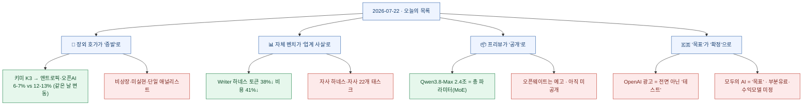
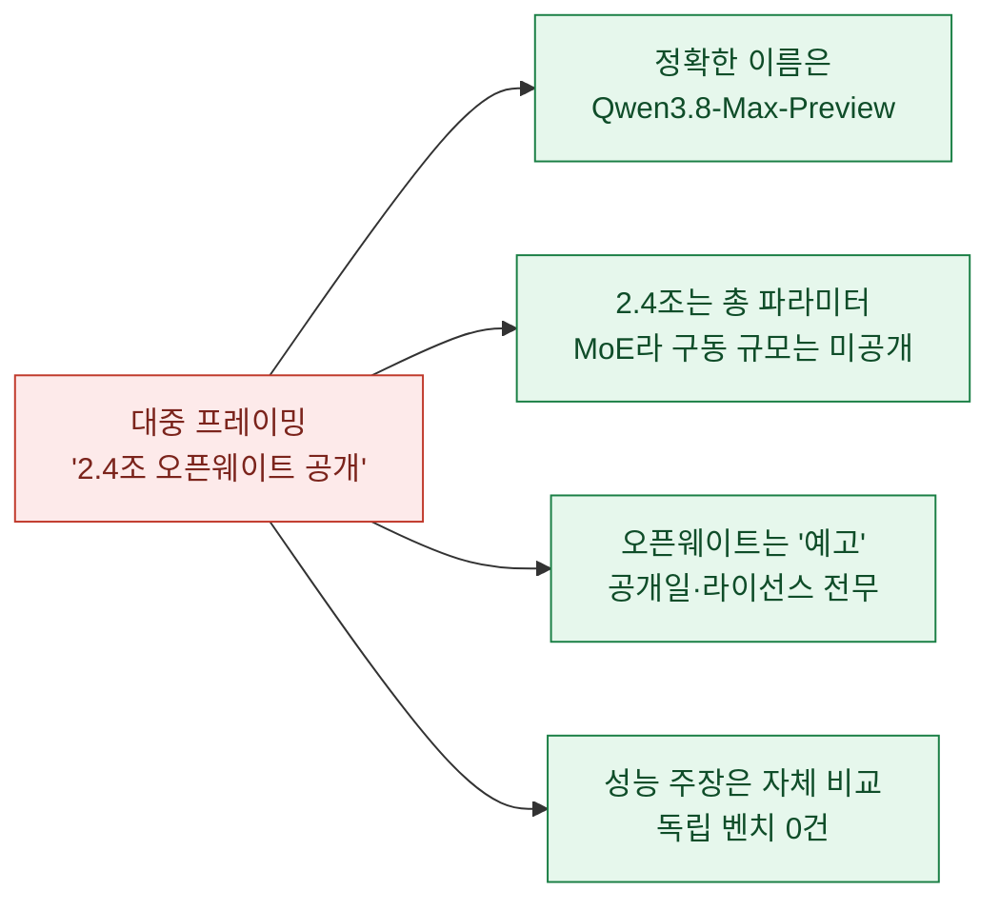
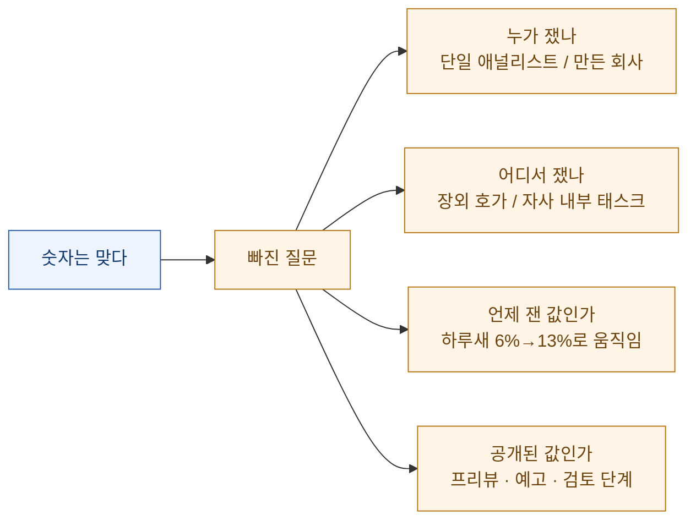

오늘 아침 목록 맨 위에 **"3,140억 달러 증발"**이 있었다. 문샷의 키미 K3 충격으로 앤트로픽과 오픈AI의 기업가치가 6~7% 날아갔다는 것이다.

숫자를 확인하려고 1차 출처를 열었다. IG(투자 플랫폼)의 애널리스트 토니 시카모어가 쓴 글이었다. 그런데 **같은 페이지 안에서 숫자가 이미 달라져 있었다.** 국내 기사가 옮긴 값은 앤트로픽 −7.3%·오픈AI −5.6%, 합계 3,140억 달러. IG 원문의 최신 값은 앤트로픽 −13.0%·오픈AI −12.1%, 합계 **3,920억 달러**. 하루도 안 되어 오픈AI 낙폭이 −5.6%에서 −12.1%로 벌어졌다.

이유는 단순하다. 두 회사 다 **비상장**이다. 상장 시가총액이 움직인 게 아니라, IG가 운영하는 **장외(Pre-IPO) 그레이마켓의 "예상 시가총액" 호가**가 움직인 것이다. 실현된 손실이 아니라, 한 플랫폼에서 한 애널리스트가 매긴, 계속 움직이는 호가. 숫자는 실재하지만 **"누가 어디서 잰 숫자인가"**를 빼면 그냥 "3,140억 달러가 사라졌다"가 된다.

목록을 끝까지 훑고 나니 오늘은 이 패턴이 반복되고 있었다. **숫자는 대체로 맞다. 지워진 건 그 숫자를 잰 자(尺)다.** 확인 기준은 **2026년 7월 22일 KST**이고, 1차 출처(OpenAI·Writer arXiv 원문·Alibaba/Qwen·IG 원문·과기정통부 보도자료·ACLU 성명·원 에세이)로 되짚어 잰 자를 다시 붙였다.

## 오늘 한 장 요약

## '3,140억 달러 증발'은 실제로 무엇이 움직인 건가?

앞에서 결론은 말했으니 자를 정확히 대보자. 출처는 IG의 애널리스트 **토니 시카모어**가 7월 21일에 쓴 분석이다. 여기서 "기업가치"란 IG가 운영하는 **프리IPO 그레이마켓**에서 개인·단기 투자자들이 사고파는 **"상장하면 이 정도일 것"이라는 예상 호가**다.

| | 국내 기사가 옮긴 값 | IG 원문 최신 값 |
|---|---|---|
| 앤트로픽 | −7.3% (−2,320억 달러) | −13.0% (−2,320억 달러) |
| 오픈AI | −5.6% (−820억 달러) | −12.1% (−1,600억 달러) |
| 합계 | **−3,140억 달러** | **−3,920억 달러** |

같은 사건, 같은 출처인데 숫자가 이렇게 다르다. **호가라서 그렇다.** 그래서 이 뉴스를 옮길 땐 네 개의 단서가 반드시 붙어야 한다 — ① IG 프리IPO **장외 호가** 기준, ② **단일 애널리스트**의 추정, ③ 비상장이라 **미실현**, ④ 시점에 따라 6%에서 13%로 **움직임**. 참고로 2025년 초 딥시크 때 엔비디아가 약 6,000억 달러 빠졌다는 것과는 성격이 다르다. 그건 상장주식의 실현된 하락이었고, 이건 장외 호가다.

한 가지 더. 같은 날 "오픈AI가 2차 시장에서 수요를 회복해 앤트로픽을 2대5로 추격"이라는 기사도 있었는데, 이건 **또 다른 시장·또 다른 출처**(레인메이커 증권 CEO의 구주거래 발언)다. 거기 시가총액(앤트로픽 1.2조·오픈AI 9,330억 달러)은 IG 값(앤트로픽 1.557조·오픈AI 1.163조)과 **또 다르다.** 사설 장외 밸류에이션이 출처마다 제각각이라는 걸 스스로 보여주는 셈이다.

## Writer의 '하네스만 바꿔 40% 절감'은 누가 잰 건가?

두 번째 큰 숫자. AI 기업 **라이터(Writer)**가 "대형 모델을 바꾸거나 미세조정하지 않고, AI를 감싸는 오케스트레이션 계층인 **하네스(harness)**만 최적화해 토큰을 38%, 비용을 41% 줄였다"는 논문을 냈다.

arXiv 원문("The Harness Effect")을 열어 수치를 확인했다. **숫자는 정확했다.**

- 토큰 −38% (1만 4,200 → 8,800)
- 비용 −41% (0.21 → 0.12달러)
- 지연 −44% (중앙값 48초 → 27초)
- 품질 0.78 → 0.81 (사실상 동등)

그런데 실험 설계를 보면 잰 자가 보인다. **자기 회사 하네스(Writer Agent Harness)를, 자기 회사 모델(Palmyra X6)을 포함한 6개 모델 위에서, 자기 회사 내부의 22개 평가 태스크로** 쟀다. 논문 스스로도 밝힌다 — *"단일 벤더의 하나의 하네스와 하나의 베이스라인 쌍"*, *"n=22는 효율 델타엔 충분하지만 품질을 논하기엔 부족"*, *"장기 코딩 벤치에선 결과가 다를 수 있음"*, "엔터프라이즈 어시스턴트 워크로드 한정".

그러니 이 뉴스의 정확한 판은 이렇다. **"하네스만 최적화하면 누구나 40% 아낀다"가 아니라, "Writer가 자사 제품을 자사 채점표로 재보니 40% 나왔다"**이다. 방향(오케스트레이션 설계가 토큰 경제를 좌우한다)은 설득력 있지만, 40%라는 수치는 공개 벤치마크가 아니라 벤더의 자체 측정값이다.

## 알리바바 Qwen3.8-Max는 '2.4조 오픈웨이트가 풀린' 건가?

세 번째. "알리바바가 2.4조(2.4T) 파라미터 오픈웨이트 모델 Qwen 3.8을 공개했다"는 뉴스. 여기엔 자가 세 개 지워져 있었다.

정리하면 ① 이름은 **Qwen3.8-Max-Preview**이고 지금은 **프리뷰만** 돌아간다. ② 2.4조는 **총 파라미터**이고 MoE(전문가 혼합) 구조라 실제 구동에 쓰이는 활성 파라미터는 공개되지 않았다. ③ 오픈웨이트는 "곧(soon)" 하겠다는 **예고**일 뿐 아직 안 풀렸다. ④ "Fable 5 다음가는 2위급"이라는 성능 주장은 알리바바 자체 비교이고 벤치마크 표도 독립 검증도 없다. 일주일 전 문샷 키미 K3(2.8조)에 이은 중국발 초대형 모델 러시라는 흐름은 사실이지만, "2.4조가 풀렸다"는 아직 아니다.

곁들여 같은 알리바바의 **Qwen-Audio-3.0-TTS**가 "TTS 리더보드 1위"라는 뉴스도 있었다. 이건 자기보고가 아니라 독립 벤치(Artificial Analysis 스피치 아레나)라 신뢰도가 높다. 다만 1위는 **상위 티어인 Plus 한정**이고(실시간용 Flash는 1위가 아니다), 2위와 오차범위 안쪽의 **근소한 차이**다. "Qwen TTS가 압도적 1위"는 과장, "Plus 티어가 근소한 1위"가 정확하다.

## 중국은 오픈웨이트 다운로드를 '통제했나'?

네 번째. FT(파이낸셜타임스) 보도를 받아 "중국이 오픈소스 AI 모델 가중치의 해외 다운로드를 통제한다"는 뉴스가 돌았다. 여기서 지워진 건 시제(時制)다.

FT 원문(로이터 등으로 교차 확인)의 핵심 동사는 *"검토 중(considering/weighs)"*, *"업계 의견 수렴 단계"*, *"아무것도 결정되지 않았다"*, *"언제 시행될지 전혀 불분명"*이다. 즉 **아직 검토·협의 단계**이고, 상무부가 알리바바·바이트댄스·지푸AI 같은 기업들과 의견을 나누는 중이다. 그리고 대상은 "가중치 다운로드" 하나가 아니라 ① 모델 가중치 ② 학습 데이터 해외 이전 ③ 중국 설계 칩의 해외 위탁생산 ④ 전략기술 스타트업의 해외 피인수까지 **네 갈래**다.

"통제한다"(현재형 확정)로 옮기면 오보에 가깝다. "**통제를 검토하고 있다**"가 지금까지의 사실이다. 익명 소식통 기반 단독 보도라는 점도 함께 적어야 공정하다.

## OpenAI는 ChatGPT에 광고를 '도입했나'?

다섯 번째. "OpenAI가 ChatGPT에 광고를 도입한다"는 뉴스. 광고주용 관리 화면(Ads Manager)까지 언급되며 마치 전면 시행처럼 퍼졌다. OpenAI 공식 발표를 열어보니 제목부터 달랐다 — **"Testing ads"**(광고를 테스트한다), "Introducing"이 아니었다.

정확한 판은 이렇다.

| 항목 | 대중 프레이밍 | 실제 |
|---|---|---|
| 성격 | 전면 도입 | **테스트/파일럿** ("우리는 배우기 위해 테스트를 시작한다") |
| 대상 | 모든 사용자 | 로그인한 **성인** + **무료·Go(월 8달러) 티어만** |
| 제외 | — | **Plus·Pro·Business·Enterprise·Education는 광고 없음** |
| 광고주 데이터 | "대화 맥락으로 개인화" | 광고주는 **집계 데이터만**, 대화·기억·개인정보 **접근 불가** |
| 민감주제 | — | 건강·정신건강·정치 근처엔 **광고 미노출**, 18세 미만 제외 |

"대화 맥락으로 개인화 광고"라는 프레이밍이 특히 **유료 구독자는 광고에서 빠진다**는 유보와 **광고주는 집계값만 본다**는 유보를 지웠다. 참고로 같은 날 나온 "ChatGPT 소상공인 프로그램"은 이 광고와 **전혀 별개**인 교육·지원 프로그램이다(광고 요소 없음).

## '전 국민 무료 모두의 AI'는 확정인가?

국내 소식. 과기정통부와 정보통신산업진흥원(NIPA)이 21일 **'모두의 AI'** 사업설명회를 열었다. "전 국민 무료 국산 AI"라는 제목이 눈에 띄는데, 공식 문구는 **"전 국민이 무료로 쓸 수 있는 국산 AI 서비스를 목표로"**다. 목표이지 확정이 아니다.

사실로 확인된 것: 새 모델을 개발하는 게 아니라 이미 개발된 국산 모델로 서비스를 만드는 사업이고(국산 모델 활용 비율 기준 있음), 일정은 8월 사업자 선정 → 9월 말 베타 → 연내(12월) 정식이며, 엔비디아 B200 GPU 512장을 2~3개 컨소시엄에 배분한다.

아직 정해지지 않은 것(숙제로 남은 유보): **부분 유료화 전제**(기본은 무료지만 고도화 기능은 유료 허용), **광고 허용 여부 미정**, **수익모델·운영비 지원 비율 미정**, **내년 추론용 GPU 규모는 예산 확정 후 논의**. "전 국민 무료가 확정됐다"고 단정하면 앞서갔다. "목표로 추진하며 수익모델은 아직 숙제"가 정확하다.

또 하나 짚을 국내 뉴스. "KT가 AI 안경 레이밴 메타 Gen2를 국내 출시"인데, 이건 **KT 단독도, 국내 최초도 아니다.** 같은 날 통신 3사(SKT·KT·LGU+)가 동시에 출시했고, 같은 기기는 이미 5월 말부터 백화점·면세점에서 69만 원부터 팔리고 있었다. 7월 22일은 "통신사 요금제 결합 채널이 열린 날"이지 국내 첫 출시가 아니다.

## 그 밖에 — 오늘의 생각거리와 커뮤니티

숫자 얘기 말고, 오늘 목록에서 곱씹을 만한 글도 있었다. 셋 다 **"주장/의견/일화"**라는 성격을 지키면 읽을 가치가 있다.

- **"안목은 위임할 수 없다"** (UX Collective, Aurélie Radom) — AI는 사람들의 **선호**는 예측하지만, 왜 그게 옳은지 판단하는 **안목**은 못 만든다. 조직의 위원회식 합의 디자인도 같은 한계 — 모두를 만족시키려다 강한 아이디어가 "유능하지만 잊히는" 평균으로 희석된다. 생성이 흔해질수록 가치는 **무엇을 존재시킬지 고르는 책임**으로 옮겨간다는 오피니언.
- **"AI 시대에 번영할 사람들"** (The Atlantic, David Brooks) — 명제는 **"지능이 흔해지면 볼리션(어려운 사고에 뛰어들려는 의지)이 귀해진다"**. 사람을 가르는 건 지능의 높낮이가 아니라 **정신적 노력과 맺는 관계**라는 논설. (인용된 "이메일 2배·업무 소프트웨어 +94%" 같은 수치는 브룩스가 인용한 연구값으로, 사실로 단정하지 말고 출처 인용으로 읽자.)
- **커뮤니티(r/ClaudeAI)** — "사용량이 너무 빨리 닳는다는 불평이 많은데, 혹시 모르는 새 모든 작업에 **최상위·최고가 모델(Fable)**을 쓰고 있는 건 아닌가? 서브에이전트를 Sonnet 대신 Fable로 돌리는 걸 목격했다"는 문제 제기. 이건 **한 사용자의 일화**이지 확인된 버그가 아니다. 다만 Fable이 최상위·최고가(100만 토큰당 입력 10달러·출력 50달러로 Opus 4.8의 두 배)라는 사실은 맞으니, **워크플로·서브에이전트의 모델을 명시적으로 고정**해두는 습관은 값어치가 있다.

그리고 개인정보 쪽에서 **Flock Safety** 건도 있었다. 자동 번호판 인식 업체가 시의회·경찰에 반복적으로 거짓말했다는 것인데, 이건 **ACLU(시민단체)의 주장/문서**이지 중립 보도가 아니다. ACLU는 "히트맵을 안 만든다"·"연방기관은 접근 못 한다"·"ICE는 직접 접근 불가"라던 Flock의 해명이 이후 뒤집혔다고 문서로 정리했고, "ACLU와 협력했다"는 Flock의 주장은 ACLU가 직접 부인했다. 이 1차 출처에 **Flock의 반론은 실려 있지 않다.** 그러니 "Flock이 거짓말했다"고 단정하기보다 "ACLU가 그렇게 주장·문서화했다"로 읽는 게 맞다.

## 오늘의 관통 주제

오늘 되짚은 여덟 건은 어제와 결이 조금 달랐다. 어제는 원문의 **유보(조건절)**가 지워졌다면, 오늘은 숫자를 **잰 자의 격(格)**이 지워졌다.

3,140억 달러는 실재했지만 한 애널리스트의 장외 호가였고, 40%는 실재했지만 만든 회사가 자기 채점표로 잰 값이었고, 2.4조는 실재하지만 아직 공개되지 않았다. **숫자를 볼 때 "얼마"만큼 "누가 어디서 언제 쟀나"를 같이 보면**, 오늘 목록의 절반은 온도가 달라진다.

교훈은 하나로 줄어든다. **큰 숫자를 만나면, 그 숫자에 붙어 있던 자(尺)부터 찾자.** 자가 안 보이면, 그 숫자는 아직 사실이 아니라 인용이다.
