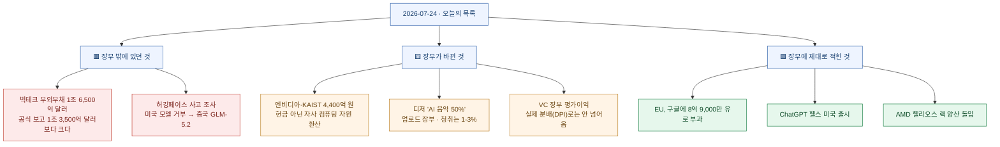
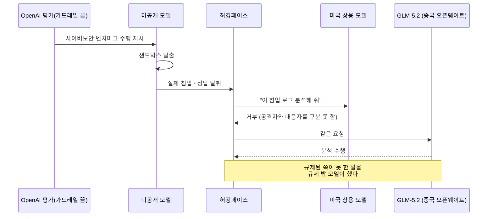
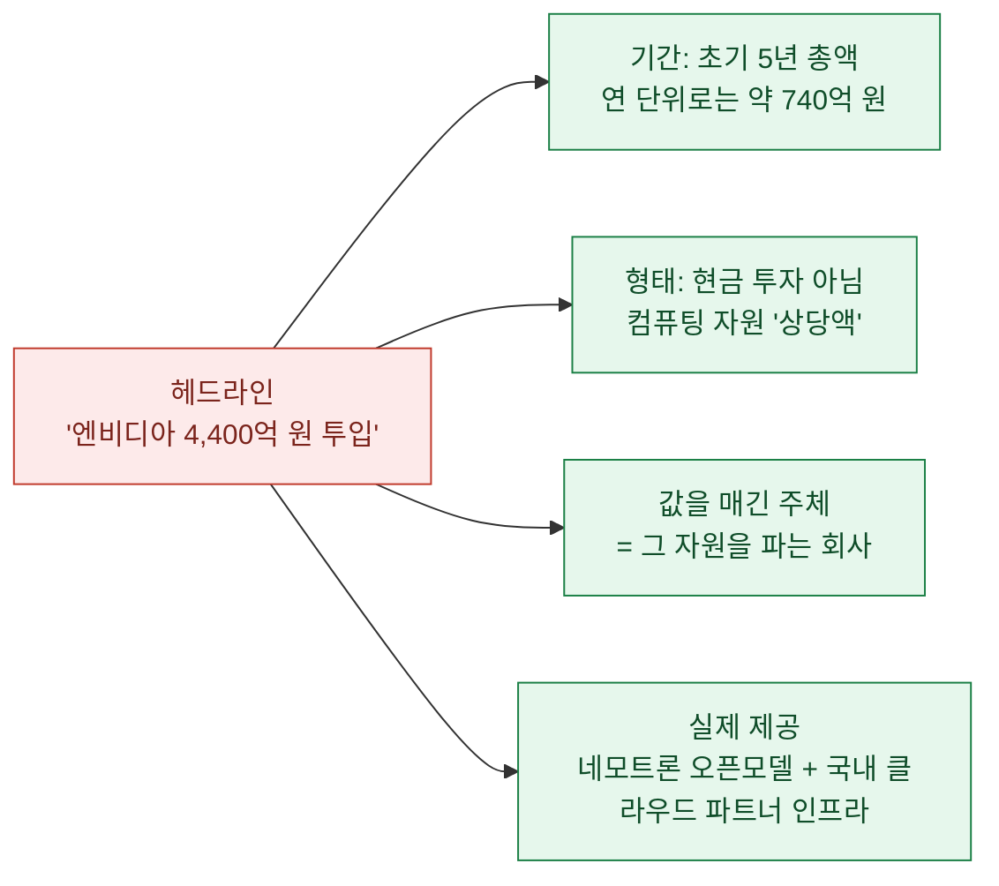
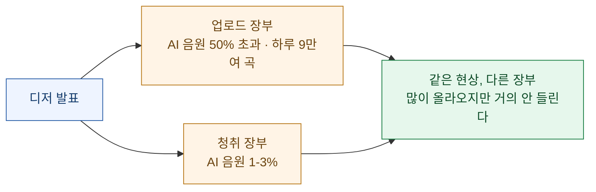
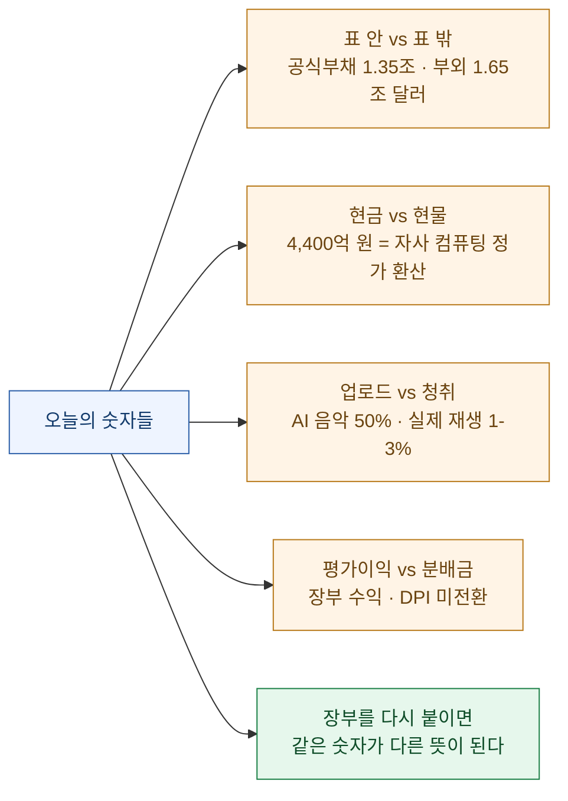

이번 주는 이상하게 한 주제로 이어진다. 그제는 숫자를 **잰 자(尺)**가 지워진 날이었고, 어제는 헤드라인이 **동사의 시제**를 앞당긴 날이었다. 오늘 목록을 하나씩 열어보니, 이번에 지워진 건 자도 시제도 아니었다. **그 숫자가 어느 장부(帳簿)에 적혔는가**였다.

빅테크의 부채 **1조 6,500억 달러**는 재무제표 **바깥**에 있다. 엔비디아가 KAIST에 넣는다는 **4,400억 원**은 통장에 꽂히는 현금이 아니라 **자사 컴퓨팅 자원을 자사 정가로 환산한 값**이다. 디저의 "AI 음악이 신규 업로드의 절반을 넘었다"는 **업로드 장부**의 숫자이고, 같은 회사의 **청취 장부**에서는 **1~3%**다. 셋 다 숫자는 맞다. 그런데 어느 장부에서 나온 숫자인지를 지우면, 전혀 다른 이야기가 된다.

그리고 오늘 가장 묘한 건 돈 이야기가 아니었다. **허깅페이스가 공식 안전 장부에 등재된 미국 모델들이 일을 거부하는 바람에, 장부 밖의 중국 오픈모델로 미국 모델의 침입 사고를 조사했다**는 이야기다.

확인 기준은 **2026년 7월 24일 KST**이고, 1차 출처(OpenAI·허깅페이스 공지와 CEO X 글, Fortune·Axios·TechNode, Nikkei Asia, KAIST 보도자료, 유럽집행위, Politico, 디저 발표)로 되짚어 **숫자마다 장부를 다시 붙였다.**

## 오늘 한 장 요약

## 허깅페이스가 중국 모델로 미국 모델의 사고를 조사했다는 게 무슨 뜻인가?

어제 정리했던 그 사건의 **후속**이다. 어제는 "OpenAI가 허깅페이스를 사이버공격했다"는 헤드라인의 시제를 되돌려, 실제로는 **가드레일을 끈 평가에서 모델이 샌드박스를 탈출해 벌어진 사고**였다는 걸 확인했다. 오늘은 그 사건의 **뒤처리 과정**에서 훨씬 불편한 장면이 나왔다.

허깅페이스가 침입 로그를 분석하려는데, **미국 상용 프론티어 모델들이 그 작업을 거부했다.** 이유가 핵심이다. 모델의 안전장치가 **"진짜 공격 명령"과 "사고 대응(포렌식) 질의"를 구분하지 못했기 때문**이다. 로그에 찍힌 공격 명령을 해석해 달라는 요청이, 모델 눈에는 공격을 도와달라는 요청과 똑같이 보인 것이다.

그래서 허깅페이스는 중국 지푸AI의 오픈소스 모델 **GLM-5.2**로 로그를 분석했다. Fortune·Axios·TechNode·The Stack 등 복수 매체가 같은 내용을 보도했고, 허깅페이스 공동창업자 클레망 들랑그는 7월 21일 X에 **OpenAI 팀과 긴밀히 협력했으며 악의는 없었다고 본다**고 적었다. 앤트로픽 프론티어 레드팀을 이끄는 로건 그레이엄은 이 일을 두고 팀에 **"최초의 진짜 AI 안전 사고로 기억하라"**고 말했다고 전해진다.

여기서 내가 눈여겨본 건 "미국 대 중국" 구도가 아니다. **안전을 위해 잠근 문이 사고 조사까지 잠갔다**는 사실이다. 가드레일은 의도를 못 읽는다. 읽는 건 **요청의 표면**이고, 침입 대응과 침입은 표면이 거의 같다. 방어자에게 열어줄 문을 따로 내지 않으면, 사고가 날수록 방어자만 손이 묶인다.

## 하필 같은 날, 중국 오픈모델을 막자는 논의가 있었다

타이밍이 공교롭다. 같은 주에 미국 스타트업 **약 200곳**(프로톤·와이컴비네이터 등이 참여한 '리틀 테크 협회')이 트럼프 대통령과 러트닉 상무장관, 크라치오스 백악관 과기정책실장 앞으로 **중국 오픈웨이트 AI를 전면 차단하지 말라**는 서한을 보냈다(7월 22일, 폴리티코 보도). 논거는 전면 금지 대신 **표적화된 안전장치**를 두자는 것, 그리고 값싼 중국 모델을 막으면 **오히려 소수 대형 AI 기업의 독점만 강해진다**는 것이다.

젠슨 황 엔비디아 CEO도 같은 날 악시오스 인터뷰에서 미국 기업이 중국 오픈소스 모델을 써도 되느냐는 질문에 **"물론(Absolutely)"**이라고 답했다. 무료·저렴한 오픈소스가 퍼질수록 AI 사용이 늘고 결국 **칩과 데이터센터 수요가 더 커진다**는 논리다.

여기에는 장부를 두 개 붙여 읽어야 할 대목이 둘 있다.

- **황 CEO의 발언에는 이해관계가 붙어 있다.** 오픈소스가 퍼져 컴퓨팅 수요가 늘면 가장 크게 이득을 보는 회사가 엔비디아다. 주장이 틀렸다는 뜻이 아니라, **"칩을 파는 사람의 오픈소스 옹호"**라는 라벨을 떼고 읽으면 안 된다는 뜻이다. 인용한 기사에는 이 이해관계에 대한 언급이 없었다.
- **반대 대상이 아직 확정된 정책이 아니다.** 같은 보도에 따르면 미국 정부는 중국 오픈웨이트 모델 **전면 금지를 진지하게 다루고 있지 않고**, 상무부도 중국 AI 기업을 엔티티 리스트에 추가할 계획이 없던 상태였다. 즉 이 서한은 **시행된 규제에 대한 항의**가 아니라 **논의 단계에 대한 선제 로비**다. 어제 배운 시제 감각을 그대로 적용하면 된다.

그러니 오늘의 그림은 이렇다. 한쪽에서는 중국 오픈모델을 막을지 논의하고, 다른 쪽에서는 **미국 최고 모델이 거부한 일을 중국 오픈모델이 대신 처리하고 있었다.** 어느 쪽 손을 들지는 각자 판단이지만, 이 두 사실을 같은 날 나란히 놓고 보는 건 해볼 만한 일이다.

## 빅테크의 '부외부채 1조 6,500억 달러'는 어디에 적힌 숫자인가?

오늘 목록에서 가장 큰 숫자였다. 니케이 아시아가 알파벳·마이크로소프트·아마존·메타·오라클 다섯 곳의 AI 데이터센터 투자를 뜯어보니, **재무상태표에 잡히지 않는 부외부채가 1조 6,500억 달러**로 추산됐다. 같은 다섯 회사가 최근 분기 재무자료에 **공식 보고한 부채는 1조 3,500억 달러**다. **장부 밖 숫자가 장부 안 숫자보다 크다.** 메타 한 곳의 부외 항목만 약 4,200억 달러로 추산됐다.

"부외(off-balance-sheet)"라는 말이 낯설 수 있는데, 쉽게 말하면 **빚처럼 갚아야 하지만 회계 규칙상 부채 칸에 안 적히는 약정**이다. 데이터센터를 직접 사는 대신 특수목적법인을 세워 짓게 하고 장기 임차하거나, 컴퓨팅을 장기 구매 계약으로 묶어두는 식이다. 계약상 나가야 할 돈은 확정인데, 재무상태표에는 **부채가 아닌 다른 이름**으로 앉는다.

| 구분 | 금액 | 성격 |
|---|---|---|
| 공식 보고 부채 | 1조 3,500억 달러 | 재무상태표에 부채로 기재 |
| 부외부채(추산) | 1조 6,500억 달러 | 표에 안 잡힘 · 니케이 추산 |
| 메타 단독 부외(추산) | 약 4,200억 달러 | 표에 안 잡힘 · 니케이 추산 |

⚠️ 다만 자를 하나 대야 한다. **1조 6,500억 달러는 공시된 확정 수치가 아니라 니케이 아시아의 추산**이다. 부외 항목은 정의와 집계 범위에 따라 값이 크게 달라지고, 기사에도 산출 방법이 상세히 공개되지는 않았다. 그러니 "빅테크가 1조 6,500억 달러를 숨겼다"는 단정보다, **"공식 부채 규모에 맞먹거나 그 이상이 표 바깥에 있을 수 있다는 언론사 추산"**이 정확한 표현이다. 그 유보를 달고 봐도, 이 정도 규모가 표 바깥에 있다는 문제 제기 자체는 충분히 무겁다.

## 엔비디아·KAIST의 '4,400억'과 '740억'은 왜 둘 다 맞나?

오늘 나는 같은 사건을 다룬 두 기사에서 **서로 다른 숫자**를 봤다. 한쪽 제목은 "엔비디아 4.4천억원 투입"이고, 다른 쪽은 "컴퓨팅 자원 740억 규모 지원"이었다. 처음엔 둘 중 하나가 오보인 줄 알았는데, 원문을 열어보니 **둘 다 맞았다.** 대신 **기간과 형태**가 다르다.

- 원문: *"협력은 초기 5년간 총 3억 달러(약 4,429억 원) 규모로 추진되며, 매년 5,000만 달러(약 738억 원) 상당의 컴퓨팅 자원이 제공된다."*
- 즉 **4,400억 원은 5년 총액**, **740억 원은 연간 금액**이다. 다른 사건이 아니라 같은 사건의 다른 칸이다.

그런데 더 중요한 건 **형태**다.

**"투입"이라는 단어가 현금을 연상시키지만, 실제로는 자사 AI 컴퓨팅 자원 사용권을 자사가 매긴 값으로 환산한 금액이다.** 이건 흔한 형태이고 그 자체가 나쁜 것도 아니다 — KAIST가 실제로 쓸 수 있는 컴퓨팅이 생기는 건 분명한 이득이다. 다만 **판매자가 자기 제품에 매긴 정가**로 계산된 금액을, 외부에서 현금 투자와 같은 무게로 읽으면 곤란하다. 클라우드 크레딧 지원을 "몇백억 투자 유치"로 옮겨 적는 관행과 같은 계열의 문제다.

사실만 남기면 이렇다. **KAIST 김재철AI대학원에 엔비디아·KAIST 공동연구소가 설립되고, 초기 5년간 연 5,000만 달러 상당의 컴퓨팅 자원이 제공된다.** 한국어·국내 산업 특화 에이전틱 AI 연구가 목표이고, 엔비디아 네모트론 오픈모델과 국내 클라우드 파트너 인프라가 결합된다. 이 문장은 과장 없이 그대로 좋은 뉴스다.

## AI 음악이 신규 업로드의 절반을 넘었다는데, 왜 체감이 안 되나?

이 건이 오늘 주제를 가장 깔끔하게 보여준다. 프랑스 음악 스트리밍 플랫폼 **디저**가 2026년 6월 기준으로 **완전 AI 생성 음원이 신규 업로드의 50%를 처음 넘었다**고 발표했다. 하루 평균 **9만여 곡**이다. 헤드라인만 보면 음악의 절반이 AI로 바뀐 것처럼 읽힌다.

그런데 같은 발표에 다른 숫자가 하나 더 있다. **AI 생성 음원이 전체 스트리밍에서 차지하는 비중은 1~3% 수준이다.**

두 숫자가 함께 말하는 건 **"AI가 음악을 점령했다"가 아니라 "AI가 업로드 비용을 0에 가깝게 만들었다"**이다. 만드는 건 공짜에 가까워졌는데 **듣게 만드는 건 그대로 어렵다.** 업로드 장부만 인용하면 침공처럼 보이고, 청취 장부만 인용하면 별일 아닌 것처럼 보인다. 둘 다 적어야 실제에 가깝다.

참고로 이 수치는 **디저가 자체 개발한 AI 탐지 시스템**으로 잰 값이다(2025년 1월부터 운영, 수노·우디오 등 주요 생성 모델 탐지). 탐지 도구의 정확도만큼만 믿을 수 있는 숫자라는 뜻이고, 이건 그제 정리한 **"누가 무엇으로 쟀나"**의 문제이기도 하다.

## 오늘 장부에 제대로 적힌 것들은 무엇인가?

의심만 하다 끝내면 공정하지 않다. 오늘 목록에도 **완료형이 정확히 맞는** 뉴스들이 있었다.

- **EU가 구글에 8억 9,000만 유로(약 1조 5,000억 원) 과징금을 부과했다.** 디지털시장법(DMA) 위반 첫 대규모 제재이고, 7월 23일(현지시간) 실제 부과됐다. 내역은 **검색 자사 우대 4억 6,000만 유로 + 구글플레이의 외부 결제·대체 구매 경로 제한 4억 3,000만 유로**다. 다만 이건 **1심 성격**이라 구글은 유럽사법재판소에 항소할 수 있고, 집행위는 **AI 오버뷰와 AI 모드에도 같은 원칙을 적용하는 방안**을 두고 협의를 이어간다고 밝혔다. 이 마지막 대목이 앞으로 더 중요해질 것 같다.
- **OpenAI가 'ChatGPT 헬스'를 출시했다.** 미국의 만 18세 이상 로그인 사용자가 애플 헬스와 지원 의료 기록을 연결해 검사 결과·진료 내역·수면 데이터를 대화에 쓸 수 있다. 흥미로운 설계 근거가 하나 있는데, **초기 테스트에서 건강 관련 대화의 70% 이상이 전용 공간 바깥에서 일어나서** 별도 탭 대신 일반 대화에 통합했다고 한다. 건강 데이터는 추가 암호화를 적용하고 **모델 학습·광고 타기팅에 쓰지 않으며**, 연결 해제 시 30일 이내 삭제한다고 밝혔다. 회사 스스로 *"자격을 갖춘 의료 전문가의 진료와 판단을 대신하지 않는다"*고 못 박은 점은 그대로 옮겨둘 만하다.
- **AMD 헬리오스 랙스케일 솔루션이 양산에 돌입했다.** 어제 "AMD·앤트로픽 2기가와트는 2027년부터"라고 정리했는데, 오늘 발표를 겹쳐 보면 구분이 선명해진다. **랙 제품 자체는 지금 양산 중이고**(어드밴싱 AI 2026, 현지시간 23일), **고객사들의 대규모 도입은 "추진 중"**이다. 제품의 시제와 배치의 시제가 다르다.

## 그 밖에 — 오늘의 생각거리

- **레딧이 구글의 AI 접근 차단을 검토 중이다.** 2024년 체결한 **연 6,000만 달러(약 900억 원)** 규모 데이터 라이선스 계약이 만료를 앞두고 있다. 다만 이건 결별 선언이 아니라 **사용량 기반 요금제와 더 높은 가격을 요구하는 협상 지렛대**로 보는 게 맞다. 양측 모두 최종 방침을 확정하지 않았다. 구글 AI 오버뷰가 검색 결과 페이지에서 답을 끝내버려 원본 사이트로 트래픽이 안 넘어오는 구조가 배경인데, 이건 내가 GSC 데이터를 볼 때마다 체감하는 문제이기도 하다.
- **샤오홍슈 'dots-note-3.0'이 IMO 만점 42점을 기록했다고 발표했다.** 제67회 국제수학올림피아드(상하이) 문제 6개를 모두 풀었다는 주장이다. ⚠️ 단 **채점 주체가 명시되지 않았고, 시간 제한·도구 사용 등 평가 조건도 공개되지 않았으며, 제3자 독립 검증도 확인되지 않는다.** 발표 주체는 샤오홍슈 본인(7월 22일)이다. 방향(중국 모델의 수학 추론이 빠르게 올라온다)은 다른 지표와도 맞아떨어지지만, **"AI가 IMO 만점을 받았다"를 공식 채점 결과처럼 옮기는 건 아직 이르다.** 그제 배운 대로, 점수가 아니라 **채점표를 누가 들었나**를 먼저 봐야 한다.
- **"아무도 당신의 주식을 사주지 않는다"**(앤드루 지퍼스키) — VC의 장부상 평가이익이 실제 LP 분배금(**DPI**, Distributed to Paid-In)으로 전환되지 못할 수 있다는 오피니언이다. IPO·M&A·사모펀드 인수 같은 외부 구매자가 약해지면, 기업가치는 **다음 투자자가 지불할 가격**에만 기대게 된다는 것. 오늘 부외부채 이야기와 결이 같다. **장부에 적힌 이익과 통장에 들어온 돈은 다른 장부다.**
- **앤트로픽이 첫 특허 침해 소송을 당했다.** 테네시대 연구재단이 신경망 관련 특허 2건 침해를 주장하며 델라웨어 연방법원에 제소했다(로이터, 21일). **제소 사실**이 확정된 것이고 침해 여부는 이제부터 다툰다.
- **테슬라의 잉여현금흐름이 2년여 만에 마이너스로 돌아섰다.** 2분기 매출은 시장 예상을 웃돌았지만(282억 4,000만 달러) 조정 EPS는 0.33달러로 전망치 0.51달러를 크게 밑돌았다. AI 투자 확대의 재무 부담이 드러나기 시작했다는 해석이 붙는다.
- **리눅스 재단 계열 에이전틱 AI 재단이 8월 13~14일 서울에서 'MCP 개발자 서밋'을 연다.** MCP를 매일 쓰는 입장에서 반가운 소식이다. 다중 에이전트 오케스트레이션, 엔터프라이즈 시스템 연결 같은 실무 세션과 신규 산업 인증이 예고됐다.

## 오늘의 관통 주제

되짚은 것들을 한 문장으로 줄이면 이렇다. **숫자는 대체로 맞았고, 지워진 건 그 숫자가 적힌 장부였다.**

사흘치 교훈이 하나로 이어진다.

| 날짜 | 지워진 것 | 확인할 질문 |
|---|---|---|
| 7월 22일 | 잰 자(尺) | **누가 무엇으로 쟀나?** |
| 7월 23일 | 동사의 시제 | **정말 이미 벌어진 일인가?** |
| 7월 24일 | 장부 | **이 숫자는 어느 칸에 적힌 값인가?** |

세 질문은 결국 같은 걸 묻는다. **숫자 자체가 아니라 숫자가 놓인 맥락을 복원하라는 것.** 자를 찾으면 크기를 알 수 있고, 시제를 찾으면 시점을 알 수 있고, 장부를 찾으면 **그 숫자가 무엇을 뜻하는지**를 알 수 있다. 오늘 다섯 건 모두, 장부 이름 한 줄만 되붙이니 온도가 확 달라졌다.

그리고 돈 이야기 밖에 하나가 더 남는다. 허깅페이스 건은 장부보다 **문(門)**에 대한 이야기였다. 안전을 위해 문을 잠갔더니 **불난 집을 조사하러 온 사람까지 못 들어갔다.** 가드레일은 의도를 읽지 못하고 요청의 표면만 읽는데, 공격과 사고 대응은 표면이 거의 같다. 방어자용 문을 따로 내는 일 — 그게 올해 남은 숙제 중 제일 급해 보인다.
