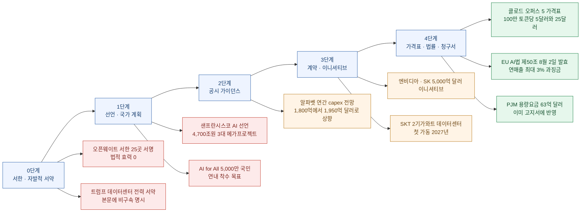
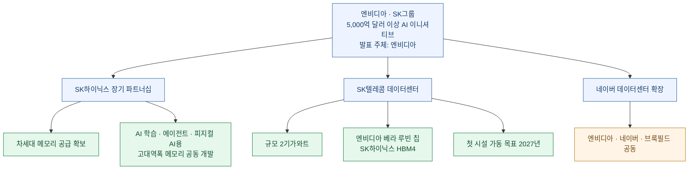
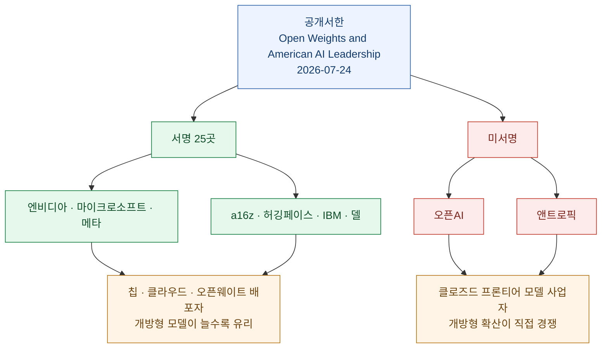
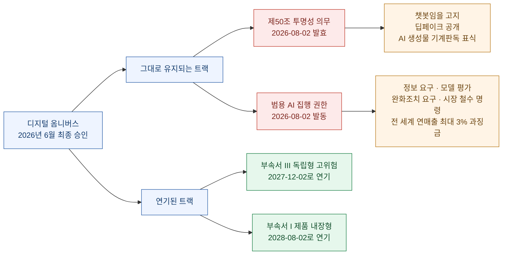
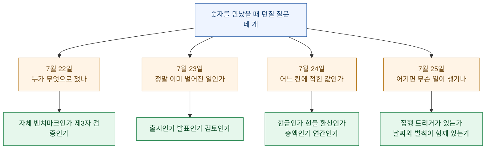

사흘째 같은 자리에서 걸려 넘어지고 있다. 그제는 숫자를 잰 **자(尺)**가 지워졌고, 어제는 헤드라인이 **시제**를 앞당겼고, 그저께는 숫자가 **어느 장부**에 적혔는지가 사라졌다. 오늘 목록을 펼쳐 놓고 보니, 이번엔 또 다른 칸이 비어 있다. **이 숫자를 어기면 무슨 일이 생기나?**

오늘 나온 큰 숫자는 거의 전부 **약속**이다. 엔비디아와 SK그룹의 **5,000억 달러 이상**은 "이니셔티브"이고, 이재명 대통령이 샌프란시스코에서 발표한 선언의 **3조 5천억 달러**는 지난달 발표한 **4,700조원 3대 메가프로젝트**를 달러로 환산한 값이며, 트럼프 대통령이 발표한 데이터센터 전력 공약은 기사 본문에 **"비구속(non-binding)"**이라고 적혀 있다. 한 소비자단체 인사는 이걸 "새끼손가락 약속"이라고 불렀다.

그런데 같은 날 목록 안에, **어기면 즉시 대가가 붙는 숫자**도 섞여 있다. 앤트로픽이 어제 내놓은 **클로드 오퍼스 5의 100만 토큰당 5달러·25달러**는 오늘 API를 호출하는 순간 청구되는 값이다. **8월 2일**에 발효되는 EU AI법 제50조는 어기면 전 세계 연매출의 최대 3%가 과징금으로 붙는다. PJM 용량경매에서 데이터센터가 물어낸 **63억 달러**는 이미 누군가의 전기 고지서에 찍히고 있다.

같은 목록, 같은 단위(달러), 그런데 구속력은 다섯 단계로 갈린다. 오늘은 그 스펙트럼을 기준으로 정리했다.

확인 기준은 **2026년 7월 25일 KST**이고, 1차 출처(앤트로픽 공식 발표, 로이터, 조선일보·뉴시스 등 국내 보도, 엔비디아 서한 PDF, EU 집행위 가이드라인 해설, 알파벳 실적 발표)로 교차 확인했다.

## 오늘 목록을 구속력 순으로 세우면 어떻게 되나?

여기서 색깔은 좋고 나쁨이 아니다. **빨강은 "지금 검증할 수 없다"는 뜻**이고, 초록은 "지금 검증된다"는 뜻이다. 서한과 선언이 무가치하다는 게 아니라, 읽는 사람이 둘을 같은 무게로 다루면 안 된다는 얘기다.

## 클로드 오퍼스 5의 "절반 가격"은 어느 절반인가?

앤트로픽이 7월 24일 **클로드 오퍼스 5**를 출시했다. 공식 문구는 "클로드 페이블 5의 프론티어 지능에 근접하면서 절반 가격"이다. 이 문장은 두 가지 방식으로 읽히고, 오늘 기사들도 두 갈래로 갈렸다.

| 어떤 절반인가 | 실제 값 | 검증 가능성 |
|---|---|---|
| **토큰 단가의 절반** | 오퍼스 5는 100만 토큰당 입력 5달러·출력 25달러. 페이블 5는 10달러·50달러 | 가격표라서 즉시 확인 가능 |
| **태스크당 비용의 절반** | 커서벤치 3.2에서 페이블 5 최고점의 0.5% 이내를 태스크당 절반 비용으로. OSWorld 2.0은 페이블 5 최고 기록을 넘으면서 비용은 3분의 1 남짓 | 벤치마크 조건에 종속 |

**둘 다 맞다.** 토큰 단가는 정확히 절반이고, 태스크당 비용은 벤치마크마다 절반에서 3분의 1까지 다르다. 다만 이 둘은 **다른 자로 잰 값**이고, 내 지갑에 직접 닿는 쪽은 앞의 것이다. 뒤의 것은 "같은 문제를 더 적은 토큰으로 푼다"는 주장이라, 내 워크로드가 그 벤치마크와 닮았을 때만 성립한다.

더 재미있는 건 이 대목이다. 오퍼스 5의 토큰 단가는 **직전 모델인 오퍼스 4.8과 완전히 동일**하다. 즉 앤트로픽이 실제로 한 일은 "가격을 내렸다"가 아니라 **"같은 가격표에 더 나은 모델을 얹었다"**이다. 가격표는 안 움직였는데 사용자 입장에서는 싸진 것 — 이건 SaaS에서 흔한 방식이지만, 헤드라인이 "더 싼 AI에 베팅"으로 나가면 인하로 읽힌다.

발표된 벤치마크 수치는 이렇다.

- **프론티어-벤치 v0.1**: 전 모델 중 1위, 오퍼스 4.8 대비 2배 이상, 태스크당 비용은 더 낮음
- **커서벤치 3.2**: 페이블 5 최고점의 0.5% 이내
- **ARC-AGI 3**: 차순위 모델의 3배
- **재피어 오토메이션벤치**: 통과율이 차순위의 약 1.5배
- **OSWorld 2.0**: 페이블 5 최고 기록 상회

그리고 앤트로픽 스스로 밝힌 한계도 같은 문서에 있다. **생물 연구와 공격적 사이버보안 영역에서는 미토스 5에 뒤진다**는 것, 장기 자율 생물 연구 과제에서 제한이 있다는 것. 발표자가 자기 약점을 명시한 항목은 그 자체로 신뢰도 신호라서 적어 둔다.

배포 조건도 함께 바뀌었다. 클로드 맥스의 **기본 모델**이 되고 클로드 프로에서 선택 가능한 **최상위 모델**이 된다. 여기서 "기본"이라는 단어가 중요하다. 사용자가 아무것도 선택하지 않아도 이 모델을 쓰게 된다는 뜻이라, 요금제 안에서는 성능 변화가 **자동으로** 전파된다.

## 엔비디아와 SK의 5,000억 달러는 무엇이 확정된 숫자인가?

로이터 보도(7월 24일, 샌프란시스코)의 원문 표현은 "**more than 500 billion dollar AI initiative**"이고, 출처는 **엔비디아**다. 발표 주체가 파는 쪽이라는 점을 먼저 적어 둔다.

이 5,000억 달러를 항목으로 쪼개면 이렇게 된다.

전체 금액에는 **기간이 붙어 있지 않다.** 5,000억 달러가 몇 년에 걸친 총액인지, 누구의 자본지출인지, 어디까지가 엔비디아 매출로 잡히는 부분인지가 보도 시점 기준으로 공개돼 있지 않다. 반면 **2기가와트**, **베라 루빈과 HBM4**, **2027년 첫 가동**은 시점과 단위가 붙은 검증 가능한 항목이다.

그래서 이 뉴스를 읽는 실무적인 방법은 이렇다. **총액은 방향 표시로 읽고, 2027년이라는 날짜를 달력에 적어 두는 것.** 총액은 어긋나도 아무 일이 안 생기지만, 2027년에 첫 시설이 안 켜지면 그건 확인 가능한 미달이다.

## 샌프란시스코 AI 선언의 3조 5천억 달러는 오늘 새로 나온 돈인가?

아니다. 이게 오늘 내가 가장 오래 붙잡은 대목이다.

이재명 대통령은 7월 24일(현지시간) 샌프란시스코 더 미드웨이에서 열린 AI 서밋에서 **"샌프란시스코 AI 선언"**을 발표했다. 조선일보 영문판 헤드라인은 "**3조 5천억 달러 투자**"를 앞세웠다. 그런데 본문을 열면 그 숫자의 정체가 나온다. **지난달 발표한 4,700조원 규모 "3대 메가프로젝트"**를 가리킨 것이다.

즉 3조 5천억 달러는 **오늘 새로 약정된 돈이 아니라, 한 달 전 발표분의 달러 환산**이다. 여기에 선언문에는 또 하나의 큰 숫자가 등장한다. "**기업가치 합계 20경 원(2경 원 초과)**"이라는 표현인데, 이건 투자액이 아니라 **참여 기업들의 시가총액 합**이다. 투자 규모와 시가총액이 같은 문단 안에 놓이면, 빠르게 읽는 사람에게는 둘 다 "동원되는 돈"처럼 보인다.

그리고 뉴시스 보도에는 이런 대목이 있다. **최태원 SK 회장이 "4,700조 메가투자는 과장이 아니다"라고 말했다**는 것. 굳이 부인해야 했다는 사실 자체가, 그 숫자에 대한 회의가 이미 존재했다는 방증이다.

선언의 나머지 내용은 이렇다.

| 항목 | 내용 | 시점 |
|---|---|---|
| 위상 목표 | 대체 불가능한 글로벌 AI 공급망 핵심국, 신뢰할 수 있는 AI 반도체 생산기지 | 목표 |
| 근거 | 삼성전자·SK하이닉스의 메모리 반도체 경쟁력과 생산능력 | 현재 |
| 사회 구상 | "AI 기본사회" — 교육·의료 등 기본권 보장, 소상공인·취약계층 배제 방지 | 구상 |
| 사업 | "AI for All" 프로젝트, 5,000만 국민 대상 | 연내 착수 |

참석자는 150명 이상. 젠슨 황(엔비디아), 샘 올트먼(오픈AI), 다리오 아모데이(앤트로픽), 혹 탄(브로드컴)에 이재용·최태원·정의선·이해진이 함께 섰다. 대통령이 이들과 개별 회동을 먼저 하고 선언을 발표하는 순서였다.

**한국 입장에서 이 선언의 실질은 "돈"이 아니라 "자리"에 가깝다.** 프론티어 모델을 만드는 네 회사의 대표가 한 사진에 들어갔다는 것이 새 정보이고, 4,700조원은 이미 있던 정보다. 이 둘을 분리해서 읽어야 다음 달에 실망하지 않는다.

## 오픈웨이트 서한에서 정보는 서명이 아니라 미서명에 있다

7월 24일, 엔비디아·마이크로소프트·메타·a16z·허깅페이스·IBM·델을 포함한 **25곳**이 "**Open Weights and American AI Leadership**"이라는 공개서한에 서명했다. 젠슨 황은 오후 1시 18분 X에 이 서한을 올렸고, 사티아 나델라도 "개방형 모델은 건강한 AI 생태계에 필수"라며 공유했다. 요지는 "**개방형 모델에 대한 성급한 규제가 경쟁을 억누르거나 혁신을 해외로 밀어낸다**"는 것.

그런데 이 문서에서 가장 많은 걸 말해 주는 항목은 서명자 목록이 아니다.

**오픈AI와 앤트로픽은 서명하지 않았다.** 그리고 이 서한에는 법적 구속력이 전혀 없다. 입법자에게 보내는 로비 문서다. 그러니 이걸 "업계 합의"로 읽으면 틀리고, "**이해관계가 갈리는 지점의 지도**"로 읽으면 맞다.

한 가지 더. 로이터 기사는 마이크로소프트와 팔란티어 CEO가 "고객이 자사 데이터센터 안에서 직접 돌릴 수 있는 개방형 모델이 AI 비용을 통제하는 데 도움이 된다"고 공개 주장해 왔다는 점, 그리고 업계가 오픈AI·앤트로픽이 모델에 넣는 통제를 불편해했다는 점을 함께 적었다. 어제 다룬 허깅페이스 사고 조사(가드레일 때문에 중국 오픈웨이트 모델로 포렌식을 돌린 건)와 정확히 같은 축의 이야기다.

## 트럼프의 전력 서약은 왜 "새끼손가락 약속"이라고 불렸나

로이터(7월 24일)에 따르면 트럼프 대통령은 미국 발전사업자와 데이터센터 사업자들의 **비구속 서약**을 발표했다. 내용은 "AI로 늘어난 전력 수요를 감당할 에너지 인프라를 이들이 직접 자금 조달하거나 건설하고, 소비자를 높은 전기요금에서 보호한다"는 것.

기사가 요약한 쟁점은 네 줄이다.

- 테크 기업들이 인프라를 자금 조달하거나 건설하겠다고 **약속**했다
- 데이터센터 전력 사용과 전기요금 인상에 대한 소비자 분노가 **11월 중간선거** 이슈다
- 최근 용량경매에서 데이터센터가 PJM 용량요금의 **거의 40%**를 차지했다
- 비평가들은 이 서약이 비구속이라며 "**새끼손가락 약속**"이라 불렀다

여기서 앞의 세 줄과 마지막 줄은 성격이 완전히 다르다. **PJM 용량경매의 63억 달러는 이미 계산이 끝난 청구서**다. PJM은 워싱턴 D.C.에서 시카고까지 **6,700만 명**의 전력을 관장하고, 용량요금은 결국 월 고지서로 내려온다. 반면 서약에는 **집행 트리거가 없다.** 기후단체 클라이밋파워의 제시 리는 이 점을 정확히 지적했다.

한쪽에는 강제력 없는 약속, 다른 쪽에는 이미 청구된 금액. 같은 기사 안에 이 둘이 나란히 있는데, 헤드라인이 가져가는 건 대개 앞쪽이다.

## EU AI법은 연기된 게 맞나?

**대부분의 조직에게는 틀렸다.** 오늘 확인한 항목 중 구속력이 가장 강한 게 이거다.

디지털 옴니버스가 유럽의회에서 6월 16일 지지를 받고 이사회에서 6월 29일 최종 승인되면서 "AI법 연기" 헤드라인이 돌았다. 실제로 연기된 건 **고위험 시스템 의무**뿐이다.

**8월 2일에 실제로 작동하는 것**은 두 가지다. 첫째, 제50조 투명성 의무 — 사용자에게 챗봇과 대화 중임을 알리고, 딥페이크를 공개하고, AI 생성 콘텐츠를 기계가 읽을 수 있는 형식으로 표시해야 한다. 둘째, 27개 회원국 시장감시 당국이 조사·제재에 착수할 수 있는 권한과, 집행위의 감독·집행 권한 — 정보 요구, 모델 평가, 완화조치 요구, 시장 철수 명령, 그리고 **전 세계 연매출 최대 3% 과징금**.

생성형 AI를 업무에 쓰는 조직 대부분은 제50조 대상이고, 고위험 시스템을 운영하는 조직은 그보다 적다. 그러니 "**움직인 마감일이 유지된 마감일보다 영향 범위가 좁다**". 헤드라인만 보고 준비를 미루면 정확히 반대로 대응하게 된다.

내 관점에서 흥미로운 건, 오늘 목록에서 **날짜와 벌칙이 둘 다 명시된 유일한 항목**이 이거라는 점이다. 서한에도 선언에도 서약에도 날짜는 있지만 벌칙이 없다.

## 알파벳의 capex 상향은 어느 층에 있나

7월 22일 장 마감 후 발표된 알파벳 2분기 실적을 오늘 목록에 넣은 이유는, 이게 스펙트럼의 정확히 중간에 있기 때문이다.

| 항목 | 값 |
|---|---|
| 2분기 매출 | 1,198억 달러, 전년 대비 24% 증가 |
| 컨센서스 | 1,169억 달러, 상회 |
| 연간 capex 전망 | 1,800억에서 1,900억 달러 → **1,950억에서 2,050억 달러**로 상향 |
| 상향 폭 | 약 150억 달러 |
| 2분기 capex | 449억 달러, 전년 대비 101% 증가 |

가이던스는 서한보다 무겁고 가격표보다 가볍다. **공시된 전망이라 수정하면 설명 의무가 따라붙지만, 지키지 않아도 과징금은 없다.** 반면 449억 달러라는 2분기 실지출은 이미 재무제표에 찍힌 값이다. 같은 발표 안에서도 두 숫자의 성격이 다르다.

다음 확인 지점은 **7월 29일 마이크로소프트와 메타, 7월 30일 아마존과 애플**이다. 이 자리에서 각 사의 가이던스가 어느 방향으로 움직이는지가, 오늘의 5,000억 달러와 4,700조원이 얼마나 현실적인지를 간접적으로 말해 준다.

## 그 밖에 오늘 목록에 올라온 것들

| 항목 | 내용 | 구속력 |
|---|---|---|
| 알리바바 주가 | 홍콩 증시에서 약 940억 홍콩달러 시가총액 증발, AI 랠리 되돌림 | 시장 가격, 이미 확정 |
| 일본 | 미국·중국 의존도를 낮추기 위해 뜻이 맞는 국가 및 글로벌 사우스와 AI 대화 프레임워크 구축 중 | 협의 단계 |
| HCLTech | 1,500억 루피 규모 AI 센터 설립 계획 | 계획 |
| 중국 AI | 이른바 "4대 천왕"이 미국과의 격차를 좁히는 중이라는 분석 | 분석 |

알리바바 건은 특히 대비가 선명하다. 오늘 목록에서 **약속들이 위로 올라가는 동안, 시장 가격은 아래로 내려갔다.** 어느 쪽이 맞다는 얘기가 아니라, 발표의 온도와 가격의 온도가 같은 날 반대로 움직였다는 관찰이다.

## 오늘 배운 것을 어떻게 써먹을까

4일치를 이어 붙이면 질문이 네 개가 된다.

네 번째 질문이 앞의 셋과 다른 점이 하나 있다. 앞의 셋은 **과거를 검증**하는 질문이고, 네 번째는 **미래에 무슨 일이 생길지**를 묻는 질문이다. 그래서 답을 지금 확인할 수 없고, 대신 **확인할 날짜를 달력에 적을 수는 있다.**

오늘 목록에서 달력에 적을 만한 날짜는 이렇다.

- **8월 2일** — EU AI법 제50조와 범용 AI 집행 권한 발효
- **7월 29일과 30일** — 마이크로소프트·메타·아마존·애플 실적, capex 가이던스 방향
- **2027년** — SK텔레콤 2기가와트 데이터센터 첫 시설 가동
- **11월** — 미국 중간선거, 데이터센터 전기요금 이슈의 정치적 결산

내 실무에서도 같은 습관을 붙이려 한다. 이슈를 정리할 때 마지막 칸에 "**언제 확인 가능한가**"를 하나 더 만드는 것. 이게 없으면 큰 숫자는 그냥 인상으로만 남는다. 오늘 목록의 절반이 그랬다.

---

*이 글은 2026년 7월 25일 KST 기준 공개 보도와 1차 발표 자료를 교차 확인해 정리한 개인 기록입니다. 특정 종목이나 자산에 대한 투자 권유가 아니며, 인용한 수치는 발표 시점 기준이라 이후 정정될 수 있습니다. 기업 발표 수치는 발표 주체의 이해관계를 함께 고려해 읽어 주세요.*
