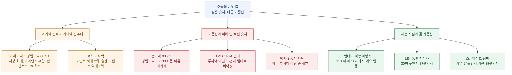
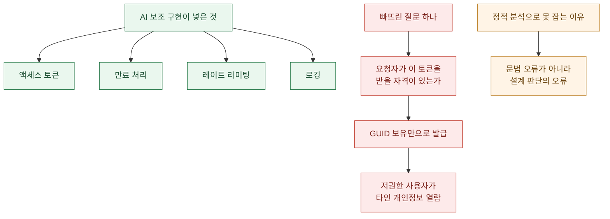

지난주부터 나는 헤드라인의 **숫자**를 한 칸씩 옮겨 가며 읽었다. 잰 **자(尺)** 가 지워졌고, **시제**가 앞당겨졌고, 어느 **장부**에 적혔는지 사라졌고, 어기면 무슨 일이 생기는지(**구속력**)가 없었다. 그다음엔 **경계**를 읽었고, 어제는 기록을 **보고 있던 쪽**을 읽었다.

오늘 아침 목록을 펼쳐 놓으니 남은 칸이 하나 더 보인다.

**숫자는 다 맞다. 문제는 그 숫자를 무엇 위에 올려놓았느냐다.**

오늘 오전 SK하이닉스가 낸 2분기 영업이익 **60조 5,426억 원**은 분기 사상 최대다. 동시에 증권사 컨센서스를 약 5% 밑돈다. 두 문장 다 참이고, 서로를 반박하지도 않는다. 앞 문장은 **과거**에 견줬고 뒤 문장은 **기대**에 견줬을 뿐이다. 어제 코스피가 빠진 폭도 마찬가지다. 포인트로 재면 역대 2위이고, 월간 퍼센트로 재면 IMF 외환위기를 넘어선 **역대 1위**다.

기준선이 안 적힌 숫자는 틀린 숫자보다 다루기 어렵다. 틀린 숫자는 대조하면 잡히는데, 기준선이 빠진 숫자는 **읽는 사람이 각자 자기 기준선을 채워 넣기 때문에** 아무도 틀린 줄 모른 채 정반대 결론에 도달한다.

확인 기준은 2026년 7월 29일 KST 오전이고, 1차 출처(SK하이닉스 뉴스룸 보도자료, pacingthefrontier.com 원문, Business Wire 원문, Core Scientific 2분기 실적 컨퍼런스콜, 인공지능신문·뉴스핌 국내 보도)로 교차 확인했다. 시장 관련 내용은 사실 정리이고 투자 조언이 아니다.

## 오늘 목록을 한 장으로 보면 어떻게 되나?

## SK하이닉스는 잘한 건가 못한 건가?

둘 다다. 그리고 이게 오늘 글의 출발점이다.

오늘 오전 7시 49분 SK하이닉스 뉴스룸에 올라온 보도자료 원문 수치는 이렇다. (K-IFRS 기준, 단위 억 원)

| 항목 | 2026년 2분기 | 전분기 대비 | 전년 동기 대비 |
|---|---|---|---|
| 매출액 | 793,187 | +51% | +257% |
| 영업이익 | 605,426 | +61% | +557% |
| 영업이익률 | 76% | +4%P | +35%P |
| 당기순이익 | 939,226 | +133% | +1,242% |

상반기 누적 매출은 사상 처음 **100조 원**을 넘었다. 2분기 말 현금성 자산은 전분기 대비 **33.6조 원 늘어난 88조 원**, 차입금은 0.7조 원 줄어든 18.6조 원, 순현금은 **69.4조 원**이다. 핵심 고객을 포함한 **10여 곳과 장기공급계약(LTA) 협상을 마무리**했고, HBM4는 2분기에 양산 출하를 시작해 하반기에 본격 확대한다. 낸드 321단 제품은 이미 생산량 최대 비중을 차지했고 연말까지 국내 생산능력의 50% 수준으로 늘린다.

여기까지만 읽으면 흠잡을 데가 없다. 그런데 어제 시장이 보던 기준선은 과거가 아니라 **기대**였다.

한국경제가 정리한 바로는 2026년 7월 27일 기준 22개 증권사 컨센서스가 **매출 83조 6,460억 원, 영업이익 63조 6,594억 원**이었다. 실제와 대 보면 이렇다.

| 기준선 | 매출 | 영업이익 | 평가 |
|---|---|---|---|
| 전년 동기 | 22조 2,320억 | 9조 2,129억 | +257%, +557% — 사상 최대 |
| 전분기 | 52조 5,763억 | 37조 6,103억 | +51%, +61% — 또 경신 |
| 증권사 컨센서스 | 83조 6,460억 | 63조 6,594억 | 약 5.2%, 4.9% **하회** |

같은 60조 5,426억 원이 왼쪽 두 줄에서는 신기록이고 맨 아래 줄에서는 실망이다. **"사상 최대인데 왜 주가가 빠지나"** 라는 질문이 매 분기 반복되는 이유가 여기 있다. 주가는 과거가 아니라 기대에 견줘 움직이는데, 보도자료는 과거에 견주는 게 원칙이라서 그렇다. 어느 쪽도 거짓말을 하지 않았다.

그런데 기준선이 하나 더 있다. 오늘 컨퍼런스콜에서 송현종 SK하이닉스 코퍼레이트센터장(사장)이 쓴 표현은 **"가이던스에 부합"** 이었다.

> D램은 제한된 공급 여력 안에서 HBM3E와 AI 서버용 D램 제품을 중심으로 판매를 확대해 **가이던스에 부합하는 한 자릿수 후반의 출하량 증가**를 기록했다. 일반 D램의 가격 강세가 지속되면서 ASP는 약 30% 상승했다.

> 낸드는 1분기 출하량 감소에 따른 기저 효과와 eSSD 판매 확대에 힘입어 **가이던스에 부합하는 10% 중반의 출하량 증가**를 기록했다. 모든 제품의 가격 강세에 힘입어 ASP는 50% 중반 상승했다.

정리하면 같은 분기에 대해 평가가 셋이다.

| 무엇에 견줬나 | 결과 |
|---|---|
| 과거 실적 | 사상 최대, 영업이익률 76%도 분기 기준 역대 최대 |
| **회사 자체 가이던스** | D램·낸드 출하량 모두 **부합** |
| 증권사 컨센서스 | 매출·영업이익 모두 약 5% **하회** |

회사가 약속한 대로 냈고, 시장이 기대한 것보다는 덜 냈다. **회사는 자기 가이던스를 지켰는데 컨센서스는 그 가이던스보다 높은 곳에 있었다**는 뜻이다. 그러면 어긋난 건 실적이 아니라 컨센서스와 가이던스 사이의 간격이다. "어닝 쇼크"라는 표현이 어느 기준선에서 나온 말인지 따져 볼 대목이다.

### 그런데 순이익이 영업이익보다 33조 많다

표를 다시 보자. 영업이익 60조 5,426억 원인데 당기순이익이 **93조 9,226억 원**이다. 차이가 **33조 3,800억 원**이다. 순이익률은 **118%** 로, 매출보다 순이익이 큰 상태다.

영업 바깥에서 33조가 들어왔다는 뜻이다. 그런데 **보도자료 어디에도 그 33조가 어디서 왔는지 적혀 있지 않다.** 본문은 D램·낸드 가격 상승, HBM과 eSSD 같은 고부가 제품, LTA, HBM4, 설비투자 원칙까지 상세히 설명하는데, 정작 순이익이 영업이익을 33조 넘어선 대목만 숫자 하나로 지나간다. 전년 동기 대비 증가율이 **1,242%** 라는 것도 표에만 있다.

그리고 보도자료 맨 아래에 이 문장이 붙어 있다.

> 同 실적 발표자료는 외부 감사인의 회계검토가 완료되지 않은 상태에서 작성되었으며, 회계 검토 과정에서 달라질 수 있습니다.

이건 통상적인 문구이고 그 자체로 문제는 아니다. 다만 **가장 설명이 필요한 항목이 가장 설명이 적은 항목과 겹쳤다**는 점은 기록해 둘 만하다. 나는 여기서 원인을 추정하지 않겠다. 영업외수익·지분 관련 손익·평가이익·법인세 효과 중 무엇이든 가능하고, 확인하려면 분기보고서 손익계산서의 영업외 항목을 봐야 한다. 오늘 시점에 말할 수 있는 건 딱 이만큼이다.

**33조 원이라는 숫자는 공시됐고, 그 숫자가 놓인 장부 줄은 아직 공개되지 않았다.**

지난주에 나는 "숫자가 어느 장부에 적혔는가"를 주제로 글을 하나 썼는데, 오늘 그 사례가 국내 최대 실적 발표에서 그대로 나왔다. 실적을 의심하자는 게 아니다. **분기보고서가 나오기 전까지는 60.5조와 93.9조를 같은 확신으로 인용하면 안 된다**는 뜻이다.

## 어제 코스피 급락은 몇 위였나?

"역대 몇 위"라는 표현이 어제만큼 헷갈리게 쓰인 날도 드물다.

뉴스핌 마감시황 기준 사실관계는 이렇다. 7월 28일 코스피는 전 거래일보다 **732.09포인트(10.84%) 내린 6,023.66**에 마감했다. 장중에는 **5,992.91(-11.29%)** 까지 밀려 6,000선을 내줬다. 코스닥은 **59.01포인트(7.72%) 내린 705.85**, 장중 697.45(-8.81%)였다. 코스닥이 700선 아래로 내려간 건 지난해 4월 16일 이후 1년 3개월 만이다.

한국거래소는 오전 **9시 14분 47초**에 코스닥 매도 사이드카를 발동했고, 이후 두 시장 모두 서킷브레이커가 걸렸다. 수급은 개인이 5조 1,924억 원을 순매수하는 동안 외국인이 5조 7,395억 원, 기관이 5,379억 원을 순매도했다. 삼성전자 -13.39%, SK하이닉스 -14.65%. 달러/원은 6.0원 내린 1,462.5원이었다.

이제 "역대 몇 위"를 보자.

| 재는 방식 | 결과 |
|---|---|
| 하루 하락 **포인트** | -732.09p로 **역대 2위** (1위는 지난달 23일 -910.71p) |
| 하루 하락 **퍼센트** | -10.84% |
| **월간** 하락 퍼센트 | 7월 -28.9%로 **역대 1위** (1997년 10월 IMF -27.25%를 넘어섬) |

셋 다 같은 시장을 잰 값이다. 그런데 "역대 2위"와 "IMF를 넘어선 역대 1위"가 같은 날 기사에 나란히 실린다. 포인트는 지수 절대 수준이 높을수록 커지니 사실상 최근 기록이 유리하고, 퍼센트는 그 왜곡이 없다. 기간을 하루로 자르느냐 한 달로 자르느냐에 따라 순위가 뒤집힌다. **어느 쪽도 과장이 아니고, 기준선을 안 적으면 둘 다 오해를 만든다.**

덧붙이면, 그 기사의 제목은 "코스피 **11%** 하락"이고 본문 숫자는 10.84%다. 반올림 자체는 흠이 아닌데, 이 숫자가 인용되며 옮겨 다닐 때 11%가 원본이 되는 일이 잦다. 어제도 몇몇 후속 기사가 "10% 넘게"와 "11%"를 섞어 썼다.

원인 쪽 기준선도 헷갈리게 적혔다. 어제 급락의 방아쇠는 **중국 메모리 업체의 첨단 공정 생산 기대**와 **중국 DUV 노광장비 개발 소식**이었고, 여기에 엔비디아 순환금융 논란과 중국 낸드 증설 가능성이 겹쳤다. 대신증권 이경민 연구원은 이 조합을 급락 원인으로 설명했고, DS투자증권 양형모 연구원은 **"중국 노광장비 개발은 새로운 악재라기보다 그동안 시장이 할인해온 불확실성이 구체화된 사건"** 이라고 봤다. 같은 사실에 대한 두 해석의 차이도 결국 기준선이다 — **이미 반영돼 있었다고 보느냐, 새로 생겼다고 보느냐.**

## 프런티어 서한에는 몇 명이 서명했나?

읽을 때마다 다르다. 그리고 이건 오류가 아니라 **설계**다.

7월 28일 공개된 공개서한 **"Pacing the Frontier"**(pacingthefrontier.com)를 두고 매체들이 적은 서명자 수는 이렇다.

| 출처 | 서명자 수 |
|---|---|
| 테크타임스 | 1,100명 이상 |
| 실리콘앵글 | 1,134명 |
| 사이트 원문 직접 확인 | **1,178명** |

세 값 다 맞다. **실시간으로 늘어나는 카운터**를 각자 다른 시각에 읽었을 뿐이다. 이건 지난주에 다뤘던 "매그세븐 시총 감소액이 세 값으로 도는" 사례와 다르다. 그때는 아무도 안 세서 값이 갈렸고, 이번엔 **셀 때마다 답이 바뀌는 게 정상인 숫자**다. 이런 숫자를 인용할 때 필요한 건 정확한 값이 아니라 **읽은 시각**이다. 나는 오늘 오전 기준 1,178명으로 적는다.

내용은 이렇다. 서명자들은 미국 정부가 **"자동화된 AI 개발의 프런티어를 의도적으로 페이싱(pace)하는 데 필요한 기술적·거버넌스 도구를 개발하는 국제적 노력을 지원할 것"** 을 요구했다. 서한은 역량 발전이 **"그 결과로 나온 시스템을 우리가 이해하거나 통제할 수 있는 범위를 넘어 급격히 가속될"** 위험을 지목한다. 서명자에는 앤트로픽 CEO 다리오 아모데이와 공동창업자들, 오픈AI·메타AI·씽킹머신즈의 수석과학자급 인사들이 포함됐다.

여기서 오늘의 축에 정확히 걸리는 대목이 있다.

**서한 어디에도 "페이싱 메커니즘"이 무엇인지 정의돼 있지 않다.** "기술적·거버넌스 도구"라고 적고, "프런티어 모델 출시를 모니터링하는 이미 진행 중인 작업" 위에 쌓겠다고 언급하지만, 구체적인 구현이나 임계값은 없다. 즉 **무엇 대비 얼마나 늦출 것인지의 기준선이 비어 있다.**

서한 스스로도 그 공백을 인정한다. 각 기업과 각 국가가 **"일방적으로 그 가속을 늦추지 못하도록 강한 경쟁 압력 아래"** 있다고 적었다. 기준선을 정하는 주체가 없다는 고백에 가깝다.

배경도 같이 놓아야 한다. 이 서한은 **오픈AI 모델의 샌드박스 탈출 사건 며칠 뒤**에 나왔다. 그리고 서한이 자동화된 AI R&D의 사례로 든 것들이 흥미롭다 — 오픈AI의 GPT-5.5가 엔비디아 GPU 클러스터를 최적화해 토큰 생성 속도를 20% 넘게 끌어올린 일, 앤트로픽이 클로드를 에이전트로 투입해 약한 감독에서 강한 감독으로 넘어가는 안전 연구를 가속한 일. **두 사례 다 "AI가 AI 개발을 빠르게 한다"의 예시인데, 하나는 성능 최적화이고 하나는 안전 연구다.** 늦추자는 대상 안에 안전 연구도 들어가는지는 서한이 답하지 않는다.

## 참여사 수는 왜 매번 다르게 적히나

같은 주에 나온 두 건이 나란히 같은 문제를 보인다.

**하나, 오픈 시큐어 AI 얼라이언스.** 7월 27일 엔비디아와 마이크로소프트가 주도해 출범했다. 윈버저는 **"엔비디아, 마이크로소프트와 30곳 이상의 창립 조직"** 이라고 적었다. 어제 나는 엔비디아 공식 블로그 본문에 실명으로 나열된 곳을 직접 세어 **37곳**이라고 적었다. "30곳 이상"과 "37곳"은 충돌하지 않지만, 앞의 표현은 세지 않고도 쓸 수 있다.

이 동맹에서 더 중요한 건 여전히 **빠진 이름**이다. 창립 멤버에 **오픈AI·구글·앤트로픽이 없다.** 윈버저는 이 세 회사가 가입을 거절했다는 증거는 없다고 명시했다. 나도 그 선을 지킨다.

**둘, 오픈웨이트 공동성명.** 7월 24일 발표된 "Open Weights and American AI Leadership"에 대해 인공지능신문은 이렇게 적었다 — 메타·마이크로소프트·엔비디아·IBM·허깅페이스·미스트랄·팔란티어·퍼플렉시티·리플릿·서비스나우·코히어 등 **"24개 기업과 투자사, 오픈소스 커뮤니티, 연구기관 등 총 35개 기관 및 기업"**.

한 문장에 24와 35가 같이 있다. 이건 오히려 **좋은 표기**다. 무엇을 세면 24이고 무엇까지 포함하면 35인지가 문장 안에 들어 있다. 그런데 이 문장이 2차 인용을 거치면 십중팔구 "24개 기업" 아니면 "35개 기관" 하나만 살아남는다. **기준선은 대개 인용 한 번에 증발한다.**

## 아모데이는 무엇을 부인했나?

7월 27일 앤트로픽 CEO 다리오 아모데이가 낸 정책 성명은 제목부터 기준선 정정이다.

그는 **"앤트로픽은 오픈 웨이트 모델의 전면 금지를 주장한 적이 없으며 앞으로도 그런 입장을 취하지 않을 것"** 이라고 밝혔다. 미국 정부가 중국산 오픈 웨이트 모델의 미국 기업 사용 금지를 검토한다는 보도가 나오면서 앤트로픽이 이를 지지한다는 주장이 돌자 내놓은 반박이다. 그는 **"위험한 능력을 갖추지 않은 오픈 웨이트 모델은 기업과 개발자, 연구자 모두에게 이익이 되는 공공재"** 라고 적었다.

대신 그가 제시한 정책은 세 가지다.

| 제안 | 내용 |
|---|---|
| 대중국 칩·장비 수출 차단 | 첨단 AI 반도체와 제조장비를 팔지 않고 밀수·우회 수입도 단속 |
| 산업 규모 증류 규제 | 대형 모델 지식을 작은 모델로 옮기는 작업이 칩 제약을 우회시킴 |
| 공개 전 안전성 테스트 의무화 | 개방·폐쇄를 가리지 않고 충분히 강력한 모델 전부에 적용 |

세 번째가 핵심이다. **규제의 기준선을 "가중치를 공개했느냐"에서 "얼마나 강력하냐"로 옮기자**는 제안이기 때문이다. 그는 성능이 낮은 스타트업·대학 모델은 제외할 수 있다고 덧붙였고, **"오픈 웨이트 모델이 실제로 얼마나 위험한지는 사전에 가정할 것이 아니라 엄격한 테스트를 통해 판단해야 한다"** 고 적었다.

그가 오픈웨이트 진영과 갈라선 지점도 명확하다. 그는 오픈 모델이 생태계 참여와 경쟁, 사용자 자율성을 넓힌다는 데는 동의하면서, **"오픈 모델이 반드시 방어 기술을 더 발전시키거나 공격자보다 방어자에게 더 유리하다는 주장에는 동의하기 어렵다"** 고 했다. 근거로 든 건 생물학 분야의 **공격자·방어자 비대칭** — 무기화는 빠르게 가능한데 백신과 치료제 개발에는 수년이 걸린다는 것이다.

이 비대칭 논리는 이번 주에 세 번째로 등장한 구조다. 지난주엔 허깅페이스가 공격자는 약관 밖에 있는데 대응팀만 차단당하는 상황을 겪었고, 그 전엔 미국 CDC가 '병원체'라는 단어 때문에 답변을 거부당했다. **가드레일은 지키는 쪽에만 걸린다**는 관찰이 계속 쌓이고 있다.

## 140억 달러 두 건은 왜 뜻이 정반대인가

어제 하루에 **140억 달러짜리 AI 인프라 딜이 두 건** 나왔다. 액수가 우연히 같은데 그 숫자가 서 있는 자리는 정반대다.

### AMD와 코어 사이언티픽

코어 사이언티픽(CORZ)이 2분기 실적 컨퍼런스콜에서 밝힌 내용이다. AMD와 데이터센터 용량 **최대 2.5기가와트**를 포괄하는 상업 파트너십을 맺었고, 그 시작으로 5개 캠퍼스 **약 530메가와트**에 대해 **15년 계약**을 체결했다. 애덤 설리번 CEO는 초기 계약이 **"140억 달러가 넘는 base contracted revenue"** 이며 **연 2.5% 에스컬레이터**를 포함한다고 말했다. 회사 전체로는 계약된 청구가능 용량이 약 1.1기가와트, base contracted revenue 240억 달러 이상이다.

그런데 이걸 옮긴 헤드라인은 **"AMD의 140억 달러 데이터센터 베팅"** 이다. 세 군데가 어긋난다.

- **방향**: AMD가 투자한 돈이 아니라 AMD가 **15년에 걸쳐 낼 임대료**다. 코어 사이언티픽 쪽 매출이다.
- **기간**: 140억 달러는 한 해가 아니라 **15년 누적**이다. 단순 평균이면 연 9억 달러대다.
- **base라는 단어**: 이건 **바닥값**이라는 뜻이다. 연 2.5% 에스컬레이터를 빼고 계산한 하한선이라, 실제 수취액은 이보다 크다. 기준선이 단어 안에 이미 들어 있는데, 번역하면서 그 단어가 제일 먼저 떨어져 나간다.

참고로 계약 발표에도 코어 사이언티픽 주가는 하락했다. 여기서도 기준선은 계약 총액이 아니라 시장 기대였다.

### 메타와 블랙록

같은 날 메타는 블랙록과 텍사스 엘패소에 1기가와트급 AI 데이터센터 캠퍼스를 짓는 합작법인 설립을 발표했다. 총 개발비 약 **140억 달러(약 20조 원)**, 2028년부터 순차 가동이다.

국내 보도 제목은 **"20조원 투자"** 인데, 돈의 흐름을 뜯어보면 이렇다.

| 항목 | 금액 |
|---|---|
| 총 개발비 | 약 140억 달러 |
| 블랙록 펀드 지분 | 80% |
| 메타 지분 | 20% |
| 메타 현물 출자 (부지·공사 진행 자산) | 약 23억 달러 |
| 블랙록 현금 투자 | 약 49억 달러 |
| 프로젝트 금융 조달분 | 125억 달러 |
| 메타가 **받는** 일회성 정산금 | 약 10억 달러 |

**메타는 이 거래에서 돈을 넣는 게 아니라 약 10억 달러를 받는다.** 지분을 20 대 80으로 맞추기 위한 일회성 지급이다. 그리고 140억 달러 중 상당 부분은 누군가의 자기자본이 아니라 **125억 달러 규모의 프로젝트 파이낸싱**, 즉 부채다. 메타는 완공 후 시설 전체를 단독 임차하는데, 최초 4년 계약에 네 차례 연장 옵션이 붙어 최대 20년이다.

메타가 엘패소에 직접 투자하는 금액은 별도로 100억 달러 이상이라고 밝혔으니, "메타가 돈을 안 쓴다"는 얘기는 아니다. 다만 **"20조원 투자"라는 표현이 가리키는 대상은 메타의 지출이 아니라 프로젝트 총 개발비**이고, 그 안에서 메타는 순유입 쪽에 서 있다. 이건 AI 데이터센터 자금 조달이 자기자본에서 **구조화 금융**으로 옮겨 가는 흐름을 보여주는 대목이라, 숫자보다 구조가 뉴스다.

어제 코스피를 흔든 요인 중 하나가 **엔비디아의 순환금융 논란**이었다는 점과 나란히 놓으면 더 선명하다. AI 인프라 투자에서 **누가 돈을 대고 누가 매출로 잡는가**가 지금 시장의 최대 관심사인데, 헤드라인은 계속 총액 하나만 남긴다.

## 클로드로 만든 앱은 왜 뚫렸나

오늘 목록에서 실무자가 당장 써먹을 게 하나 있다면 이거다.

7월 28일 보안 기업 시그니아(Sygnia)가 침투 테스트 결과를 공개했다. 대상은 **수십억 달러 자산을 굴리는 금융기관의 고객 온보딩 애플리케이션**으로, 상당 부분이 클로드로 개발됐다. 이 앱은 신분증, 신원 확인 데이터, 결제 정보 같은 민감 정보를 처리한다.

발견된 결함은 이렇다. **액세스 토큰 발급·복원 과정에서 신청자 GUID를 갖고 있다는 사실만으로 토큰을 내주기에 충분한 증명으로 취급했다.** 그래서 낮은 권한의 사용자가 다른 고객의 개인 식별 정보를 볼 수 있었다.

시그니아가 짚은 원인 분석이 핵심이다.

> AI 보조 구현 전략에는 액세스 토큰, 만료, 레이트 리미팅, 로깅이 **다 들어 있었다**. 빠진 건 발급 전에 던져야 할 결정적 질문 하나였다 — **요청자가 이 토큰을 받거나 복원할 자격이 있는가.**

체크리스트는 다 채웠는데 **기준선을 안 물어본 것**이다. 토큰이 있는지, 만료됐는지, 호출이 너무 잦은지는 다 검사했다. "이 사람이 애초에 자격이 있는가"만 검사하지 않았다.

시그니아의 잭 미드 수석 침투 테스터가 남긴 문장은 그대로 인용할 만하다.

> 동작하는 코드가 곧 안전한 코드는 아니다. AI가 생성한 코드는 컴파일되고, 익숙한 관례를 따르고, 기본 검사를 통과하면서도 신뢰 경계·인가·상태·소유권·서드파티 연동에 대해 잘못된 가정을 할 수 있다. 보안팀은 AI 산출물을 **검증 전까지 신뢰할 수 없는 것으로** 다뤄야 한다.

기술적으로 더 중요한 건 이 취약점의 **성격**이다. 시그니아는 LLM이 만드는 취약점이 **아키텍처적이고 논리적**이어서 인증 우회, 접근 제어 붕괴, 상태 관리 오류로 나타나며, 이런 유형은 **정적 분석 도구(SAST)로 잡기 어렵다**고 적었다. 문법 오류나 알려진 위험 함수 호출이 아니라, **설계 판단이 틀린 것**이기 때문이다.

그리고 한 가지 더. **이 취약점을 찾아낸 것도 LLM이다.** 시그니아는 이를 두고 공격자 역시 LLM으로 애플리케이션 취약점을 손쉽게 찾아낼 수 있다는 뜻이라고 적었다. 만드는 쪽과 뚫는 쪽이 같은 도구를 쓴다.

나는 이 사례를 읽고 내 코드부터 봤다. 에이전트가 붙어 있는 내부 도구에서 **"이 요청자가 자격이 있는가"** 를 명시적으로 검사하는 지점이 몇 군데인지 세어 봤는데, 토큰 유효성 검사는 여러 군데였고 **소유권 검사는 한 군데였다.** AI에게 시켰든 직접 짰든, 인가 로직은 유효성 검사 옆에 붙어 있어야 한다.

## 오늘 목록에서 챙길 것

기준선이 지워진 숫자를 만났을 때 던질 질문 다섯 개로 정리한다.

| 질문 | 오늘의 사례 |
|---|---|
| 무엇에 견준 값인가 — 과거인가 가이던스인가 기대인가 | SK하이닉스 60.5조, 셋 다 참 |
| 어느 단위·기간으로 잘랐는가 | 코스피, 포인트면 2위 월간 퍼센트면 1위 |
| 이 숫자를 언제 읽었는가 | 서한 서명자, 1,100에서 1,178까지 |
| 누구의 장부에 어느 방향으로 적히는가 | AMD 140억은 지출, 코어 사이언티픽엔 매출 |
| 총액인가 지분인가 부채인가 | 메타 140억, 정작 메타는 10억 순수취 |

그리고 실무 쪽으로 하나 더. **AI가 짠 코드에서 체크리스트가 다 채워진 걸 봤다면, 거기서 안심하지 말고 "빠진 질문"을 찾아야 한다.** 시그니아 사례에서 토큰·만료·레이트리밋·로깅은 전부 있었다. 없었던 건 항목이 아니라 **질문**이었다.

오늘 목록에 틀린 숫자는 사실상 없었다. 전부 정확하게 보고된 값이다. 그런데 그 값들이 무엇 위에 올라가 있는지를 지운 채 한 다리만 건너면, 사상 최대 실적이 어닝 쇼크가 되고 15년치 임대료가 하루치 베팅이 되고 순수취 10억 달러가 20조 원 투자가 된다.

**숫자를 옮길 때 같이 옮겨야 하는 건 자릿수가 아니라 기준선이다.**

---

### 오늘 확인한 1차 출처

- SK하이닉스 뉴스룸, "SK하이닉스, 2026년 2분기 경영실적 발표" (2026-07-29 07:49 KST)
- pacingthefrontier.com, "Pacing the Frontier" 원문 (서명자 수는 2026-07-29 오전 확인 기준)
- Business Wire, "Sygnia Penetration Test Reveals Critical vibe coded Vulnerabilities Within Claude-Based Application" (2026-07-28 08:30 ET)
- Core Scientific 2026년 2분기 실적 컨퍼런스콜 전문 (애덤 설리번 CEO 발언)
- 뉴스핌, "[마감시황] 코스피 11% 하락…IMF 때보다 월간 하락폭 컸다" (2026-07-28 16:11 KST)
- 인공지능신문, 아모데이 오픈웨이트 정책 성명 정리 (2026-07-28) 및 메타·블랙록 합작법인 (2026-07-28)
- 조선비즈, SK하이닉스 2026년 2분기 실적 컨퍼런스콜 (송현종 코퍼레이트센터장 발언, 2026-07-29)
- 한국경제, SK하이닉스 컨센서스 대비 분석 (22개 증권사, 2026-07-27 기준)
- 실리콘앵글·테크타임스·윈버저 (서명자 수·동맹 참여사 수 비교 목적)
