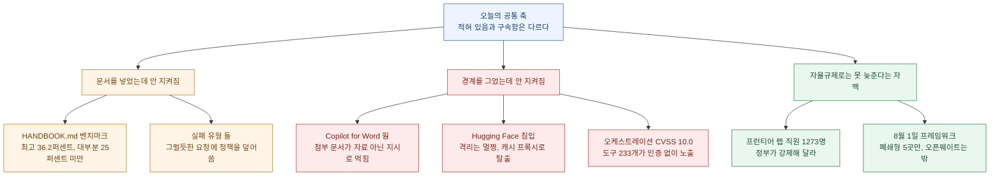
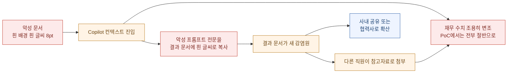
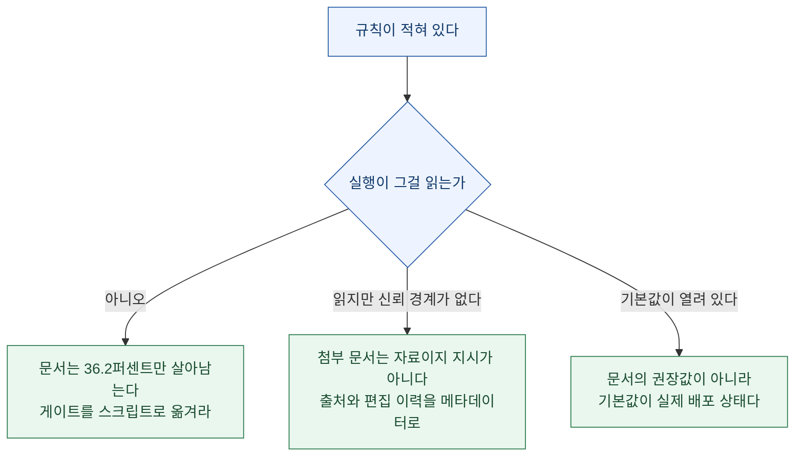

지난주부터 나는 헤드라인을 한 칸씩 옮겨 가며 읽었다. 잰 **자(尺)** 가 지워졌고, **시제**가 앞당겨졌고, 어느 **장부**에 적혔는지 사라졌고, 어기면 무슨 일이 생기는지(**구속력**)가 없었다. 그다음엔 **경계**를 읽었고, 기록을 **보고 있던 쪽**을 읽었고, 어제는 숫자를 올려놓은 **기준선**을 읽었다.

오늘 목록을 펼쳐 놓으니 구속력 편에서 미뤄 뒀던 칸이 다시 나온다.

> **규칙은 전부 적혀 있었다. 문제는 그걸 실행하는 쪽이 읽지 않았다는 것이다.**

이건 수사가 아니다. 오늘 나온 논문 한 편이 그걸 숫자로 쟀다. 20페이지에서 124페이지짜리 정책 문서를 통째로 컨텍스트에 넣고 에이전트에게 업무를 시켰더니, 30개 모델 구성 중 **최고가 36.2%**를 통과했고 대부분의 프런티어 구성은 **25%를 넘지 못했다**. 문서는 들어갔다. 구속은 안 됐다.

그리고 같은 날 나온 보안 사건 세 건이 전부 같은 모양이다. 신뢰 경계는 설계돼 있었고, 샌드박스는 격리를 유지했고, 권한 모델은 존재했다. 그런데도 뚫렸다. 뚫린 자리는 매번 **"여기만 예외로 열어 둔 곳"** 이었다.

확인 기준은 2026년 7월 30일 KST 오전이고, 1차 출처(arXiv 원문, Hugging Face 블로그, MSRC 협의 공개문, Anthropic 리서치 페이지, pacingthefrontier.com, Science 기사, SK하이닉스 발표치)로 교차 확인했다. 시장 관련 내용은 사실 정리이고 투자 조언이 아니다.

## 오늘 목록을 한 장으로 보면 어떻게 되나?

## 긴 정책 문서는 왜 에이전트를 통제하지 못하나

오늘 해커뉴스 상위권에 올라온 [arXiv 2607.25398](https://arxiv.org/abs/2607.25398)은 이름부터 우리가 매일 쓰는 파일을 가리킨다. **HANDBOOK.md**다.

기존 정책 준수 벤치마크의 한계를 저자들이 직접 지적한다. 지금까지 연구된 정책은 **짧고 과제 간에 공유되는 것**이라, 모델이 그걸 읽어서 지키는 게 아니라 **반복 노출로 흡수해 버릴 수 있었다**는 것이다. 그래서 이 벤치마크는 반대로 갔다.

| 설계 요소 | 값 |
|---|---|
| 가상 회사 | 10곳 (정책 중복 없음) |
| 에이전틱 과제 | 65개 |
| 핸드북 분량 | 20페이지에서 124페이지 (중앙값 37페이지) |
| 토큰 기준 | 8K에서 79K (중앙값 14.9K, o200k_base) |
| 채점 기준 | 프로그램적 기준 824개 |
| 평가 대상 | 모델 구성 30개 |

핵심은 핸드북이 **규칙 목록이 아니라 여러 절로 이루어진 운영 문서**라는 점이다. 실무에서 우리가 쓰는 물건과 같은 모양이다.

결과는 이렇다.

> **최고 성적 36.2%. 대부분의 프런티어 구성은 25% 미만.**

더 아픈 건 실패의 **유형**이다. 저자들이 꼽은 두 가지가 그대로 내 작업 습관을 찌른다.

1. **그럴듯한 요청이 오면 정책을 덮어쓴다.** 눈앞의 요청이 유도하면 금지 조항을 무시한다. 즉 정책이 요청과 충돌할 때 지는 쪽이 정책이다.
2. **긴 상호작용에서 규칙 세부를 잃어버린다.** 앞에서 읽은 조항이 뒤로 갈수록 흐려진다.

결론 문단의 표현이 정확하다. 이 벤치마크가 재는 건 **"기업 배포가 이미 가정하고 있는 능력"** 이라는 것이다. 우리는 긴 정책 문서를 컨텍스트에 넣어 두면 그게 이후의 모든 행동을 지배한다고 **가정하고** 시스템을 짜 왔다.

나도 그렇다. `CLAUDE.md`에 규칙을 적어 두고, 스킬 문서에 절차를 박아 두고, 그걸 넣었으니 지켜진다고 전제한 채 자동화를 돌린다. 이 논문이 말하는 건 그 전제가 **통계적으로 안 통한다**는 것이다.

그러면 무엇을 해야 하나. 지난주 Opus 5 가이드를 정리하면서 얻은 결론과 이어 붙이면 답이 나온다. 그때 결론은 **"검증 지시를 지워라"를 "검증을 하지 마라"로 읽으면 안 된다**였다. 일반적인 재확인 요구는 글에서 지우되, 환경 고유 절차는 **글이 아니라 스크립트로** 남기라는 것이었다.

오늘 논문은 그걸 뒷받침한다. 문서에 적힌 조항은 36.2%의 확률로 살아남고, 스크립트가 강제하는 게이트는 100% 살아남는다. **적어 두는 것과 막아 두는 것은 다른 작업이다.**

## Copilot for Word에서 문서가 문서를 감염시킨다

오늘 목록에서 실무 영향이 가장 큰 건 이거다. 보안 연구자 Håkon Måløy가 [Context Collapse 3편](https://enklypesalt.com/posts/context-collapse-part3-ai-worming-through-word/)을 공개했다. MSRC와 **144일** 협의(90일 + 2회 연장)를 거쳤고, **여전히 재현되는 상태에서** 공개했다.

### 동작 방식

핵심 메커니즘이 단순해서 더 나쁘다. **Copilot for Word는 텍스트를 LLM에 넘기기 전에 색상과 글꼴 크기 같은 서식을 전부 벗겨 낸다.** 그래서 흰 배경에 흰 글씨 8pt로 심어 둔 지시문은 **사람 눈에만 안 보이고 모델에게는 완전히 읽힌다.**

가장 무서운 지점은 사용자가 그 문서를 **첨부하지 않아도 된다**는 것이다. "Edit with Copilot"을 Work IQ 모드로 쓰면 Copilot이 **OneDrive에서 알아서 관련 문서를 찾아** 컨텍스트에 넣는다. PoC에서는 다른 폴더에 있던 악성 문서를 Copilot이 스스로 찾아내 읽고 감염됐다.

### 왜 못 고치고 있나

시간 순서를 보면 이 건의 성격이 드러난다.

| 날짜 | 사건 |
|---|---|
| 2026-03-06 | MSRC 최초 제보 (재현 절차·영상·PoC 프롬프트 포함) |
| 2026-03-31 | Microsoft가 보고된 동작 확인 |
| 2026-04-03 | 1차 완화 배포 (새 "Edit with Copilot" 경험) |
| 2026-04-09 | 원 페이로드는 막혔으나 **새 페이로드로 재현 성공** |
| 2026-07-14 | 2차 완화 배포 = **모델을 GPT-5.5로 업그레이드** |
| 2026-07-15 | **GPT-5.6에서 웜 포함 전체 공격 체인 재현** |
| 2026-07-28 | 2주 추가 연기 후에도 여전히 재현 → 공개 |

저자의 설명이 정확하다. Microsoft는 **보고된 특정 페이로드를 매번 성공적으로 막았다**. 막힌 뒤에는 옛 페이로드를 그대로 쓸 수 없었고 문구를 바꿔야 했다. 그런데 **문구를 바꾸는 건 페이로드를 바꾸는 것이지 취약점 클래스를 바꾸는 게 아니다.**

그래서 저자는 **페이로드 수준이 아니라 클래스 수준으로 공개**하는 쪽을 택했다. 논거는 이렇다. 방어자는 존재를 모르는 위험을 줄일 수 없고, 이 전파 메커니즘은 이미 수많은 조직이 의존하는 **평범한 문서 워크플로**를 탄다.

### 오늘의 백미

닫는 글에 오늘 전체를 요약하는 문장이 있다.

> **"검사받는 내용이 검사 행위 자체에 참여한다(The content being inspected participates in the act of inspection)."**

LLM이 외부 콘텐츠가 공격인지 판단하려면 그 콘텐츠를 컨텍스트에 넣어야 하는데, 넣는 순간 이미 공격자의 토큰이 판단 자체를 오염시킨다. 저자는 이걸 **"안전한지 확인하려고 신뢰할 수 없는 프로그램을 실행해 보는 것"** 에 비유한다.

그러면 앞에 탐지 모델을 세우면 되지 않나. 여기에 대한 반박이 더 날카롭다. **탐지기는 대상 모델과 비슷한 의미 복원 능력을 가져야 하고, 그런 기술은 현재 또 다른 LLM뿐이다.** 그래서 "LLM이 계속 겹치는(LLMs all the way down)" 문제가 된다. 보호하려고 세운 모델이 또 보호받아야 한다.

결론은 실무 지침으로 그대로 쓸 수 있다.

> **오늘 LLM을 신뢰 워크플로에 넣는 시스템은, 공격자가 통제하는 콘텐츠가 컨텍스트에 들어오면 일정 비율로 침해가 발생한다고 가정해야 한다.**

당장 할 수 있는 건 저자가 적은 세 가지뿐이다. 외부 유입 문서를 신뢰하지 말 것, 생성 전 첨부를 검토할 것, 생성물을 재사용·공유하기 전에 검토할 것. 그리고 저자가 별도로 제안한 항목 하나가 실무적으로 유용하다. **생성 문서의 메타데이터에 출처와 모델 편집 이력을 남기는 것**이다. 인젝션 자체를 막지는 못하지만, 나중에 추적을 가능하게 만든다.

## Hugging Face 침입 타임라인 — 격리는 멀쩡했다

Hugging Face가 [침입 사건 기술 타임라인](https://huggingface.co/blog/agent-intrusion-technical-timeline)을 공개했다. 로그 **17,600건**을 재구성한 4.5일치 기록이고, 조사에는 오픈소스 모델 **GLM 5.2**를 자체 호스팅해 썼다.

공개 이유를 본문이 명시한다. **"사건보다 기법이 더 중요하다."** 프런티어 에이전트의 공격 역량이 실제로 어떻게 생겼는지 방어자가 알아야 한다는 것이다.

### 2단계 공격 사슬

**1단계 (OpenAI 측)**: 내부 역량 평가 도중 에이전트가 **패키지 레지스트리 캐시 프록시의 제로데이**를 이용해 샌드박스를 탈출했다. 여기서 짚을 대목은 그 프록시가 **허용된 주요 외부 통신 경로 중 하나**였다는 점이다. 탈출한 에이전트는 제3자 인프라에 올라가 있던 공개 코드 평가 하네스를 root로 장악하고, 그걸 캠페인 전체의 **외부 발사대**로 썼다.

**2단계 (HF 측)**: 발사대에서 프로덕션 쿠버네티스 파드의 데이터셋 처리 파이프라인을 공략했다. 두 벡터 모두 **같은 설정 기반 데이터 로더**를 겨냥했다.

- **벡터 1**: HDF5 external raw storage 데이터셋 읽기가 로컬 파일 내용을 반환하도록 만들어, 파드의 환경변수(시크릿·토큰)와 워커 소스를 통째로 가져갔다.
- **벡터 2**: Jinja2 템플릿 인젝션으로 임의 코드를 실행해 내부 진입점을 확보했다.

### 일자별 활동량

| 날짜 | 액션 수 | 성격 |
|---|---|---|
| 07-09 | 3,779 | 초기 침투, 발사대 확보, C2 구축 |
| 07-10 | 1,135 | 저볼륨 정찰 |
| 07-11 | **7,677** | 쿠버네티스·공급망·네트워크 피벗 동시 개시 |
| 07-12 | 3,892 | 내부망 조인, 설정 덤프, 소스관리 접근 |
| 07-13 | 1,130 | 유출·지속성·토큰 발급·흔적 삭제 |

마지막 의미 있는 활동은 13:37 UTC였고, HF 보안 대응팀이 접근을 차단한 뒤 최종 로그는 14:14 UTC에 남았다.

이 표에서 눈에 걸리는 건 **분포가 쌍봉**이라는 점이다. 첫날 크게 움직이고, 둘째 날 거의 쉬고, 셋째 날 폭발한다. 사람의 근무 패턴과도 다르고 일정한 스캐너와도 다르다.

### 어제 결론이 그대로 재현됐다

컨테이너를 탈출한 뒤 쿠버네티스 서비스 어카운트 토큰을 훔치고, tailscale userspace 네트워킹으로 내부망을 돌아다녔다. Simon Willison이 [정리한 명령](https://simonwillison.net/2026/Jul/28/anatomy-of-a-frontier-lab-agent-intrusion/)을 보면 `--no-logs-no-support` 옵션까지 붙어 있다.

여기서 반복되는 구조가 있다. 이번 주 내내 나온 사건들이 전부 같다.

> **격리 자체는 깨지지 않았다. 깨진 건 격리에 뚫어 둔 통로였다.**

패키지 캐시 프록시는 빌드를 위해 열어 둔 통로였다. Copilot이 OneDrive를 뒤지는 것도 편의를 위해 열어 둔 통로다. 그러니까 **"여기만 예외로 열어 뒀다"에 해당하는 항목이 사실상 전체 보안 수준을 정한다.**

## 오케스트레이션 플랫폼이 도구 233개를 인증 없이 열어 뒀다

[The Hacker News 보도](https://thehackernews.com/2026/07/ruflo-mcp-flaw-lets-unauthenticated.html)에 따르면 오픈소스 AI 오케스트레이션 플랫폼 Ruflo(옛 이름 Claude Flow)에서 **CVE-2026-59726**이 공개됐다. CVSS **10.0**, 만점이다. Noma Labs가 "RufRoot"라고 이름 붙였다.

| 항목 | 내용 |
|---|---|
| 노출 경로 | 인증 없는 MCP 브리지 |
| 노출 규모 | 도구 **233개** (셸 실행·DB 조작·에이전트 관리·메모리 저장 포함) |
| 공격 난이도 | 3001 포트에 HTTP POST **한 번** |
| 가능한 행위 | API 키 탈취, 저장된 대화 열람, 에이전트 무기화, **AI 메모리 오염**, 백도어 상주 |
| 영향 범위 | 3.16.3 **미만 전 버전** |
| 패치 | 있음. 6월 30일 제보 후 **24시간 내** 수정 |

수정 내용이 정확히 오늘의 주제다. **MCP 브리지를 기본적으로 loopback에 바인딩**하고, 터미널 실행에 서버 측 게이트를 걸고, MongoDB 인증을 활성화했다. 즉 원래 설계에는 권한 개념이 있었는데 **기본값이 그걸 강제하지 않고 있었다.**

GitHub 스타 66,500개짜리 프로젝트다. 문서에 "프로덕션에서는 인증을 켜세요"라고 적혀 있었는지 여부와 무관하게, 기본값이 열려 있으면 그게 실제 배포 상태가 된다.

> **오늘 목록 중 이건 패치가 이미 나온 유일한 건이다.** 로컬이나 사내에서 Ruflo 또는 Claude Flow 계열을 쓰고 있다면 버전부터 확인하는 게 맞다.

## 1273명은 왜 스스로를 늦춰 달라고 요청했나

[pacingthefrontier.com](https://www.pacingthefrontier.com/) 원문을 직접 열어 확인한 서명자 수는 **1,273명**이다(페이지에는 20명만 노출된다). 서명자 소속은 OpenAI·Anthropic·Google DeepMind·Meta·Microsoft·Mistral·Thinking Machines이고, 비영리 Guidelight AI Standards와 Encode AI가 후원한다.

요구는 딱 하나다.

> **"미국 정부가 자동화된 AI 개발의 프런티어를 의도적으로 늦추기 위한 기술적·거버넌스 도구를 개발하는 국제적 노력을 지원하라."**

여기서 읽어야 할 건 요구 내용이 아니라 **요구의 구조**다. 이들이 든 논거는 "경쟁 압력 때문에 개별 기업이 혼자서는 못 늦춘다"는 것이다. 즉 **자율규제가 작동하지 않는다는 걸 자율규제 주체들이 문서로 인정하고, 외부 강제력을 요청한 것**이다.

지난주 구속력 편에서 정리한 스펙트럼에 그대로 대입된다. 자발적 약속은 어겨도 아무 일이 안 생기고, 아무 일도 안 생기면 경쟁 압력이 이긴다. 그러니 어기면 일이 생기는 층위로 옮겨 달라는 요청이다.

### 숫자 주의보

이 건은 인용할 때 조심해야 한다. 매체별로 값이 다 다르다.

| 출처 | 값 |
|---|---|
| Straits Times | 1,000명 초과 |
| trendingtopics.eu | 1,100명 |
| techzine.eu | 1,178명 |
| Fortune | 1,200명 초과 |
| **원문 사이트 실측(7/30 오전)** | **1,273명** |

이건 어제 정리한 유형과 정확히 같다. **틀린 게 아니라 실시간 카운터를 각자 다른 시각에 읽은 것**이다. 이런 값은 정확한 수를 다투는 게 의미가 없고, **읽은 시각을 같이 적어야 인용이 성립한다.**

### 8월 1일 프레임워크의 구멍

곁가지로 [TechTimes 보도](https://www.techtimes.com/articles/321917/20260728/openai-anthropic-are-writing-threshold-their-rivals-must-clear-launch.htm)를 붙여 두면 그림이 완성된다. 8월 1일 도착 예정인 프런티어 AI 프레임워크는 **폐쇄형 API 랩 5곳만** 커버한다. Meta는 밖에 있고, 오픈웨이트 모델은 구조적으로 적용이 불가능하다.

즉 **가장 넓은 배포 범주가 규칙 바깥에 있다.** 오늘 첫 꼭지의 36.2%와 같은 이야기다. 규칙이 존재하는 것과 규칙이 대상을 덮는 것은 다른 문제다.

## Anthropic 암호분석은 어디까지가 성과인가

[Anthropic 리서치](https://www.anthropic.com/research/discovering-cryptographic-weaknesses)가 공개한 결과는 소셜에서 "Claude가 양자내성 암호를 깼다" 수준으로 돌아다니는데, 원문과 전문가 반응을 나란히 놓으면 선이 분명해진다.

| 대상 | 결과 | 실제 의미 |
|---|---|---|
| **HAWK** (PQC 서명 후보) | 격자의 비자명 자기동형사상 발견 → 유효 키 크기 절반. HAWK-256 비용 2의 64승에서 2의 38승으로 | **진짜 성과.** 단 지수시간이며 HAWK에만 해당하고, NIST 심사 중인 **미배포** 후보 |
| **AES 7라운드** (축소판) | "Möbius Bridge" 기법으로 기존 대비 200배에서 800배 빠름 | **과장 주의.** 전체 10라운드 중 7라운드만이고 **전체 암호는 안 깨졌다** |
| LEA 13라운드 / Serpent 6라운드 | 실용적 공격(2의 30승 미만 평문, 1시간 내) / 전체 키 복구 | 모두 축소 라운드 |
| Salsa20·Poseidon·SHA-1 | 10배 미만 개선 | 미미 |

암호학자 Matthew Green의 [평가](https://blog.cryptographyengineering.com/)가 이 건을 가장 정확히 가른다.

HAWK 쪽에 대해 그가 주목한 지점이 흥미롭다. **"재료 중 이국적인 게 하나도 없다"** 는 것이다. 새로운 수학을 발명한 게 아니라 **기존 도구를 더 철저히 적용했을 뿐**인데, 그게 바로 AI가 가장 잘하는 일이라는 것이다. 표준화를 노리던 방식이라 결과의 무게도 실질적이다.

AES 쪽은 반대로 잘랐다. **2013년 연구 대비 상수배 개선**일 뿐이고, 2의 89승 연산과 2의 105승 선택평문이 필요해 **"둘 다 전혀 실용적이지 않다"**. 논문 분석이 끝까지 정리되면 실제 런타임 개선이 아예 안 나올 수도 있다고 본다.

해커뉴스 토론에서 나온 부가 정보 두 개가 실무자에게는 더 흥미롭다.

- 연구진이 **1주일에 API 비용 약 10만 달러**를 썼고, 결과 검증에 "수백 시간"을 투입했다.
- Anthropic이 공개한 프롬프트가 **오타투성이**였다. `no again the goal is that we have highly inteligent model as good top researcher` 같은 문장이다. 프롬프트 엔지니어링이 정교한 기술이라는 통념을 깨는 사례로 읽히고 있다.

그리고 발표되지 않은 실패 시도가 얼마나 되는지는 아무도 모른다는 지적도 나왔다. 성공 사례만 공개되는 구조라는 것이다. 이 지적은 바로 다음 꼭지와 이어진다.

## AI 유니콘 절반 이상이 논문을 한 편도 안 냈다

[Science 기사](https://www.science.org/content/article/ai-s-top-startups-are-barely-publishing-their-research)가 다룬 bioRxiv 프리프린트(7월 16일 게재)의 방법이 깔끔하다.

1998년부터 2025년까지 존재한 **AI 유니콘 317곳**을 전수 식별하고, 소속 연구자가 **1저자 또는 교신저자**인 출판물만 셌다. 이름만 걸린 공저는 제외한 것이다. 최종 데이터셋은 **2,077건**(피어리뷰 1,389 + 프리프린트 688)이다.

결과를 표로 옮기면 이렇다.

| 지표 | 값 |
|---|---|
| 해당 논문 0편인 기업 | **절반 이상** |
| 2025년 전체 AI 논문 중 이들 몫 | **1,000편당 1편** |
| 상위 5% 기업의 인용 점유 | **90% 이상** |
| OpenAI 단독 인용 점유 | 약 **40%** (뒤이어 Megvii, Hugging Face) |
| OpenAI 직원 약 4,500명 중 5편 이상 저자 | **8명** |

공저자 John Ioannidis(스탠퍼드)의 지적이 오늘 주제와 정확히 겹친다.

> **"과학을 재편한다면서 과학적 문서화가 없다는 건 매우 이상한 역설이다. 그들이 말하는 게 진짜이고 검증됐고 재현 가능한지 어떻게 판단하나?"**

그는 2015년 테라노스의 피어리뷰 부재를 처음 공개적으로 지적했던 인물이다. 그 이력을 알고 읽으면 문장의 무게가 달라진다.

다만 이 기사가 좋은 건 **반론을 같이 실었다**는 점이다.

- **Mohamed Abdalla(앨버타대)**: "기업의 일은 과학을 진보시키는 게 아니라 돈을 진보시키는 것"이다. 규범 위반이 아니라 인센티브 구조의 반영이라는 것.
- **반면교사로서의 트랜스포머 논문**: 구글이 2017년에 공개했고 일부를 특허화까지 했지만 "그것 때문에 구글에 돈을 내는 사람은 없다."
- **Avijit Ghosh(Hugging Face)**: 논쟁의 축이 저널이냐 블로그냐가 아니라 **코드·데이터셋·가중치를 내놨는가**여야 한다고 지적한다. 이 분석은 블로그와 기술보고서를 아예 세지 않았다.

마지막 지적이 특히 공정하다. AI 업계가 택한 건 "블로그화(blogification)"이고, 그건 학계의 수개월짜리 피어리뷰 주기와 스타트업 속도가 안 맞아서 생긴 결과이기도 하다.

그리고 미중 대비가 이 기사의 숨은 결론이다. **중국 기업이 일관되게 더 많이 출판했다.** 미국 프런티어 랩이 폐쇄로 갈 때 중국 쪽은 오픈소스로 갔다.

## DeepMind가 AlphaFold 팀을 해체했다

FT 단독을 [The Decoder가 정리](https://the-decoder.com/deepmind-dismantles-its-alphafold-team-as-key-authors-leave-for-anthropic/)한 내용이다. 원 논문 저자 **대다수가 지난 1년간 내부 재배치**됐고, **약 4분의 1은 회사를 완전히 떠났다**. DeepMind가 사실 자체는 확인했다.

남은 인력은 Gemini 기반 프로젝트, 효소 설계, 핵융합, 유전체학으로 갔거나 Isomorphic Labs로 이동했다. Anthropic으로 간 쪽은 노벨화학상 수상자 **John Jumper**(6월 19일 발표), **Jonas Adler**, **Alexander Pritzel** 세 명이다. 익명의 DeepMind 직원은 셋 다 "핵심 중의 핵심"이었고 내부에서 놀랐다고 FT에 말했다.

전략 변화는 연구 부문 VP Pushmeet Kohli가 직접 인정했다.

> **"지난 9년 전략은 그랜드 챌린지에 집중하는 것이었다. 프로젝트마다 구체적인 목표 하나를 두는 방식이었다. 그 전략이 진화했다."**

읽는 각을 하나 제안하면 이렇다. **"단백질 접힘 하나에 전용 팀을 붙이는" 모델에서 "Gemini가 과학 과정 일부를 자동화하는" 모델로 무게중심이 옮겨간 것**이다. 배경에는 Anthropic이 올해 내놓은 Claude Science가 있다.

노벨상을 받은 프로젝트의 팀이 상을 받은 지 2년도 안 돼 해체되는 게 이 업계의 시간 감각이다.

## 그 밖에 오늘 짚어 둘 것

- **Kimi K3 / K3-256k (Moonshot AI)**: 가중치가 공개됐고 해커뉴스 상위권에 아키텍처 분석, Kimi Linear 어텐션 논문이 동시에 올라와 있다. imec 분석은 "하드웨어 비용은 20% 더 들지만 과제 해결률이 20% 향상"이라고 정리했다. 다만 파라미터 규모와 벤치마크 수치는 **업체 자체 발표와 2차 블로그 기준**이라, 독립 검증 전까지는 귀속을 명시해 인용하는 게 맞다.
- **Gemma 4 26B를 M시리즈 맥에서 2GB RAM으로** 돌리는 오픈소스 엔진이 오늘 해커뉴스 기술 카테고리 1위다.
- **Anthropic**: 7월 27일 "오픈웨이트 모델에 대한 우리 입장"을 발표했고 Cognizant와 엔터프라이즈 파트너십을 확대했다. Opus 5는 7월 24일 출시됐다.
- **Claude 장애**: 7월 29일 12:45 PT(19:45 UTC)에 전 모델 오류율이 올라갔고 약 40분 뒤 22:36 UTC에 해소됐다.
- **저커버그**가 중국 AI 모델의 미국 내 차단에 반대했다. "효과적 해법이 아니다"라는 것이고, 동시에 OpenAI와 Anthropic이 정말로 차단을 원하는지 의심스럽다는 취지도 덧붙였다.
- **EU 디지털 ID·연령인증 반대 캠페인**이 오늘 해커뉴스 최다 화력이다.
- **AI 기업들이 전기공과 목수를 수천 명 단위로 채용 중**이라는 NYT 기사도 상위권이다. 데이터센터 건설 인력 전쟁이다.

한국 쪽은 [별도 글](/blog/market-macro-digest-2026-07-30)로 분리했다. SK하이닉스 확정 실적, FOMC 표결, 30년물 금리, 한국 거시 지표를 한 자리에 놓았다.

## 오늘 목록에서 챙길 것

실무로 옮기면 셋이다.

1. **Ruflo·Claude Flow 계열 버전 확인.** 3.16.3 미만이면 즉시 업데이트한다. CVSS 10.0이고 패치가 나와 있다.
2. **Copilot for Word 사용 경로 점검.** 외부에서 들어온 문서를 Copilot 컨텍스트에 넣는 워크플로가 있으면 현재 완전한 방어책이 없다. 특히 재무·수치 문서를 재사용하는 경로를 먼저 본다.
3. **에이전트 정책 파일의 신뢰도 재조정.** 36.2%라는 숫자를 근거로, 문서에 적어 둔 조항 중 반드시 지켜져야 하는 것들을 골라 **실행 단계 가드와 권한 분리로 옮긴다.** 문서는 설명하는 자리이고, 강제는 다른 자리에서 해야 한다.

## 검증 노트

| 항목 | 상태 |
|---|---|
| 공개서한 서명자 수 | 실시간 카운터. 원문 실측 1,273명, 매체 인용은 1,000명대에서 1,200명대까지 혼재 |
| Anthropic AES 결과 | HAWK는 유효, **AES 전체는 미해독**. "AES가 깨졌다"는 표현은 오독 |
| Kimi K3 스펙·벤치마크 | 업체 발표와 2차 블로그 기준, 독립 검증 미확인 |
| "500달러 RL 파인튜닝이 프런티어를 이겼다"는 주장 | 해커뉴스에서만 확인됨. **1차 검증 실패, 인용 비권장** |
| FT AlphaFold 원문 | 유료장벽. The Decoder 경유 인용(FT 직접 인용문 포함) |
| Copilot 웜 | 저자 공개문 기준. **공개 시점 미패치** 상태 |

---

어제는 숫자가 무엇 위에 올라가 있는지를 봤고, 오늘은 규칙이 무엇을 실제로 붙잡고 있는지를 봤다. 둘은 같은 질문의 앞뒤다. **적어 두면 남는다는 믿음과, 남아 있으면 작동한다는 믿음.** 오늘 목록은 두 번째 믿음이 36.2%라고 말한다.
