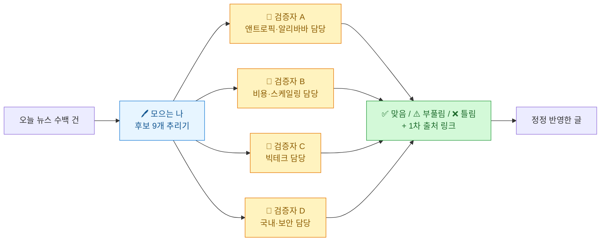
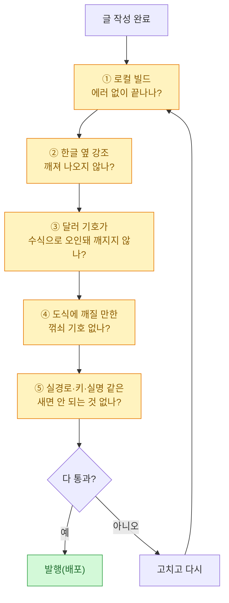
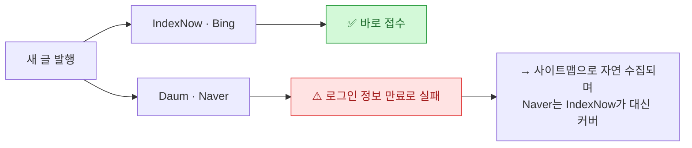

오늘도 아침에 뉴스를 한 바가지 긁었다. AI·LLM·IT 쪽만 추려도 하루치가 수백 건이다. 그중 9개를 골라 [오늘의 이슈 정리글](https://dbhyeong.github.io/blog/ai-llm-it-news-2026-07-04)로 올렸는데, 막상 끝내고 돌아보니 **정작 시간을 잡아먹은 건 글쓰기가 아니라 "이거 진짜 맞아?"를 따지는 일**이었다.

그래서 오늘은 뉴스 내용 말고, 그 **뉴스 한 편이 올라가기까지의 무대 뒤**를 적어 두려 한다. 나중의 내가 다시 볼 일지 같은 것이다.

## 왜 그냥 요약하면 안 되나?

예전엔 이렇게 했다. 기사 몇 개 읽고, 그럴듯하게 요약하고, 올린다. 문제는 **AI가 옮긴 뉴스를 AI가 또 옮기면서 틀린 숫자가 눈덩이처럼 불어난다**는 거였다. 어떤 매체가 "72시간"이라고 잘못 쓰면, 그걸 받아 쓴 열 개의 글이 다 "72시간"이 된다. 나까지 열한 번째로 옮기면 그냥 공범이다.

한 번은 이런 적도 있었다. 한 기사가 "시가총액 2,700억 달러가 하루 만에 증발"이라고 했는데, 원문을 파 보니 그건 **하루가 아니라 이틀 누적**이었다. 요약만 했으면 나도 똑같이 틀렸을 거다.

> 그래서 규칙을 하나 세웠다. **"내가 쓴 문장은, 나 말고 다른 눈이 한 번 의심하고 지나가야 한다."**

## '쓰는 나'와 '따지는 나'를 왜 갈라놨나?

여기서 오늘의 핵심 방식이 나온다. 이름을 붙이자면 **maker≠checker**, 우리말로는 "만드는 쪽과 검사하는 쪽을 다른 사람으로 둔다"는 거다. 회계에서 돈 쓰는 사람과 승인하는 사람을 갈라놓는 것과 똑같은 발상이다.

혼자 쓰고 혼자 검토하면 안 되는 이유는 단순하다. **내가 방금 쓴 문장은 내 눈엔 이미 맞아 보인다.** 확증 편향이라는 건데, 쉽게 말해 "내가 고른 기사니까 맞겠지" 하고 넘어가 버리는 마음이다. 그래서 검증은 **그 기사를 처음 보는 척, 오히려 틀렸다고 우기려 드는 쪽**에 맡겨야 한다.

오늘은 이슈를 네 묶음으로 갈라, **묶음마다 검증 담당을 따로 하나씩** 붙였다. 각 검증자에게 내린 지시는 딱 하나였다 — **"믿지 말고, 1차 출처(원본 회사 발표·통신사 원문·논문·깃허브)까지 내려가서 틀린 데를 찾아와라."** 남이 옮긴 기사 말고, 발표한 당사자의 원문을 보라는 거다.

## 그래서 뭘 잡아냈나?

이게 오늘 제일 재미있었던 대목이다. 검증을 붙이니, 겉보기엔 멀쩡한 기사에서 이런 게 줄줄이 나왔다.

| 이슈 | 흔한 기사 버전 | 원문까지 파 보니 |
|---|---|---|
| 알리바바가 클로드 코드 금지 | "앤트로픽이 중국 이용자 몰래 추적 → 알리바바 반발" | **인과가 반대.** 증류 의혹을 먼저 제기한 쪽이 앤트로픽(6/10). 금지는 그 싸움의 보복. |
| 마이크로소프트 발표 | "25억 달러짜리 코파일럿 슈퍼앱" | **원래 별개 발표 두 개.** 25억 달러는 '기업 지원 조직', 슈퍼앱은 비공식 8월 목표. |
| 서울대 반도체 AI | "삼성 AI센터가 공동 개발" | **삼성은 자문 정도.** 저자는 전원 서울대. 발표 무대도 반도체 학회 아닌 AI 학회(ICML). |
| 바이트댄스 새 벤치마크 | "72시간 과제 / 테스트타임 컴퓨트가 새 법칙" | **숫자·용어 왜곡.** 72시간은 사람이 문제 만드는 시간이고, 법칙은 '실환경 학습'에 관한 것. |
| 테슬라 AI 지출 제한 | "직원 AI 사용 200달러로 제한 (FinOps 도입)" | 맞지만 **예외는 머스크 본인 AI(그록)** 쪽으로 몰아주는 설계. 'FinOps'는 원 보도에 없던 말. |

특히 **인과가 뒤집힌 것**(알리바바)이 무서웠다. "누가 먼저 잘못했나"가 통째로 반대로 퍼지고 있었다. 이런 건 요약해서는 절대 못 잡는다. 원문 날짜를 하나하나 줄 세워 봐야 보인다.

이렇게 걸러낸 것들은 글에다 그냥 지우지 않고, **⚠️ 표시를 달아 "흔히 이렇게 잘못 쓰는데 실은 이렇다"로 남겨** 뒀다. 틀린 버전을 아는 사람이 오히려 더 헷갈리지 않게.

## '증류'가 뭔데 이 난리인가?

잠깐 어려운 말 하나만 풀고 가자. 오늘 알리바바–앤트로픽 싸움의 핵심 단어가 **증류(distillation)**였다.

쉽게 말하면 이렇다. **똑똑한 모델한테 질문을 잔뜩 던져서 그 답을 받아 적고, 그 답으로 내 모델을 가르치는 것.** 남의 모범답안을 대량으로 베껴 내 학생을 과외시키는 셈이다. 앤트로픽은 "알리바바 쪽이 가짜 계정 약 2만 5천 개로 2,800만 번쯤 이런 짓을 했다"고 의원들에게 편지를 보냈고, 그 맥락에서 클로드 코드에 **중국계 기업망에서 접속하는지 몰래 확인하는 코드**가 들어가 있던 게 발각됐다. 알리바바의 사내 금지는 그 뒤에 나온 반응이다.

용어 하나만 알면, 왜 "몰래 추적당했다"가 아니라 "먼저 베끼다 걸린 쪽과 막으려던 쪽의 공방"인지가 보인다.

## 발행 버튼을 누르기 전, 매번 돌리는 것

내용이 맞아도 끝이 아니다. 이 블로그는 글자를 파일로 저장하고 그걸 인터넷에 자동 배포하는 구조라, **한 번 잘못 올리면 되돌리기가 번거롭다.** 그래서 발행 전에 늘 같은 점검을 돌린다.

말이 거창하지, 전부 **과거에 한 번씩 데인 것들**이다. 한글 바로 옆에 강조 표시를 하면 글자가 이상하게 나온 적이 있고, 달러 기호 두 개 사이에 한글이 들어가면 그게 수학 수식으로 오인돼 깨진 적이 있다. 도식 안에 특정 꺾쇠 기호를 쓰면 화면에서만 "문법 오류"가 뜬 적도 있었다. 한 번 겪은 실수는 **다음부터 자동으로 확인하는 목록**에 넣는다. 그게 쌓여서 지금의 점검표가 됐다.

오늘 글은 이 다섯 개를 전부 0으로 통과했다.

## 다 올렸는데, 검색엔진은 반만 받아줬다

마지막 단계는 "새 글 나왔다"고 검색엔진들에 알리는 일(색인 요청)이다. 여기선 늘 절반의 성공이다.

Bing 계열은 한 번에 접수되는데, Daum·Naver는 로그인 정보(세션·토큰)가 짧게 만료돼서 자주 막힌다. 그래도 크게 걱정은 안 한다 — **사이트 지도(sitemap)를 보고 검색엔진이 알아서 긁어 가고**, Naver는 IndexNow라는 통로가 대신 알려 주기 때문이다. 능동적으로 "지금 당장 봐 줘"까지 하려면 브라우저에서 로그인 정보를 다시 떠 와야 하는데, 그건 급한 글일 때만 한다.

## 오늘의 한 줄

돌아보면 오늘 내가 한 일은 "뉴스를 썼다"기보다 **"뉴스를 의심하는 절차를 돌렸다"**에 가깝다.

- 모으는 나와 **따지는 나를 갈라놨고**,
- 따지는 쪽엔 **원문까지 내려가 틀린 데를 찾으라** 시켰고,
- 걸러낸 오류는 지우지 않고 **⚠️로 남겼고**,
- 올리기 전엔 **과거에 데인 목록**을 한 번 훑었다.

거창한 자동화 같지만 핵심은 소박하다. **"내 글에 내 눈 말고 다른 눈을 하나 더 붙인다."** 이거 하나면, 남들이 다 틀리게 옮기는 뉴스에서 나만 조금 덜 틀릴 수 있다. 오늘은 그걸로 충분했다.

> 오늘 정리한 뉴스 본문이 궁금하면 → [2026년 7월 4일 AI·LLM·IT 이슈 정리](https://dbhyeong.github.io/blog/ai-llm-it-news-2026-07-04)
> 이 '따지는 나' 붙이는 방식의 자세한 세팅은 → [[fable5-maker-checker-separation-setup|maker≠checker 세팅법]]

<!-- 안전: 회사 실데이터·고객/제3자 PII·API키/쿠키/토큰·실경로 없음. 방법론 회고 글이며 외부 자료는 1차 출처로 검증된 오늘 다이제스트를 요약 참조. -->
