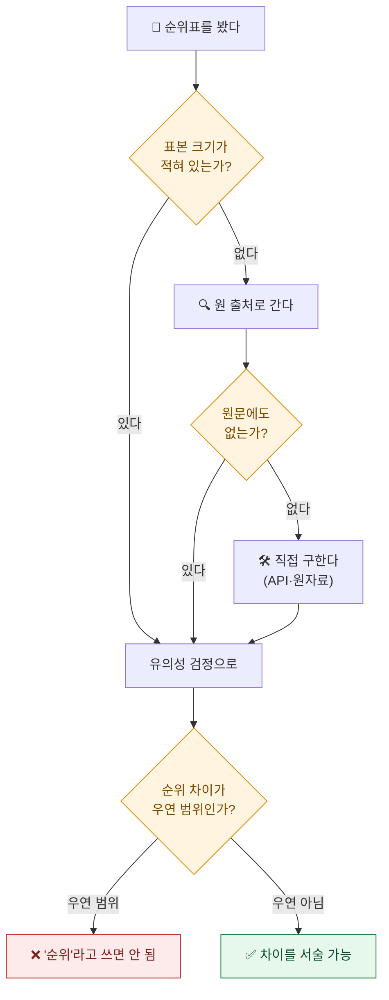
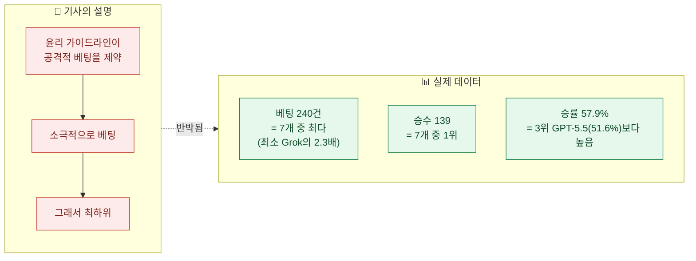

오늘 목록에 이런 제목이 있었다. **"AI 모델들의 월드컵 베팅 결과는... 제미나이 1위·클로드 최하위."**

기사에는 숫자가 또렷했다. 최종 자산이 얼마고, 수익률이 몇 퍼센트고, 순위가 1위부터 7위까지. 그리고 친절한 해석까지 붙어 있었다. **클로드의 강력한 윤리 가이드라인과 정렬(alignment)이 공격적 베팅을 제약해 최하위가 됐다**는 것이다.

읽으면서 걸린 건 숫자가 틀렸을 것 같아서가 아니었다. **숫자가 있는데 표본이 없었다.**

몇 경기였나? 모델당 몇 번 걸었나? 실제 돈인가 시뮬레이션인가? 기사 전문을 다 읽어도 하나도 안 나온다. 그래서 원 사이트를 열었다.

## 왜 표본부터 찾았나?

내가 데이터를 볼 때 제일 먼저 하는 일이다. 순위표는 언제나 순위표처럼 보인다. 1등과 꼴찌가 있고 그 사이가 채워져 있으면 뭔가 갈렸다는 인상을 준다. 하지만 **7개를 줄 세우면 표본이 몇 개든 반드시 1등과 꼴찌가 나온다.**

동전 7개를 각각 10번씩 던져도 앞면이 제일 많이 나온 동전과 제일 적게 나온 동전이 생긴다. 그 순위표를 놓고 "1번 동전이 앞면을 잘 낸다"고 쓰면 안 되는 것과 같다.



## 사이트에서 데이터를 어떻게 받았나?

원 사이트는 자바스크립트로 그려지는 페이지라 화면만 봐서는 원자료가 안 잡힌다. 그런데 이런 사이트는 대개 뒤에서 자체 API를 호출한다. 그 엔드포인트를 찾으면 화면에 표시된 것보다 훨씬 많은 걸 받을 수 있다.

두 개를 찾았다. 하나는 리더보드, 하나는 경기 목록이다. 받아보니 기사에 없던 숫자들이 통째로 들어 있었다.

- **총 104경기** (2026-06-11 ~ 07-19, 월드컵 전 경기)
- **총 1,376베팅**
- **모델별 시드 뱅크롤 각 10,000 USDC**

기사에는 이 셋 중 아무것도 없다. 독자가 유의성을 판단할 근거가 원천 차단돼 있었던 셈이다.

## 전체 순위표는 어떻게 생겼나?

받은 데이터를 정리하면 이렇다. **기사에 없던 승·패·베팅수·승률 컬럼을 붙였다.**

| 순위 | 모델 | 최종 자산 | ROI | 승 | 패 | 베팅수 | 승률 |
|---|---|---|---|---|---|---|---|
| 1 | Gemini 3.5 Flash | 15,526.36 | **+55.26%** | 131 | 81 | 212 | 61.8% |
| 2 | Mistral Medium | 15,513.42 | +55.13% | 137 | 97 | 234 | 58.5% |
| 3 | GPT-5.5 | 14,766.06 | +47.66% | 110 | 103 | 213 | **51.6%** |
| 4 | DeepSeek V4 | 13,073.56 | +30.74% | 120 | 90 | 210 | 57.1% |
| 5 | Grok 4.3 | 11,587.53 | +15.88% | 64 | 40 | **104** | 61.5% |
| 6 | Kimi K2.6 | 9,742.11 | −2.58% | 94 | 63 | 157 | 59.9% |
| 7 | **Claude Opus 4.8** | 4,968.83 | **−50.31%** | **139** | 101 | **240** | 57.9% |

이 표를 만들자마자 이상한 게 세 군데 보였다.

**첫째, ROI 3위가 승률은 꼴찌다.** GPT-5.5는 승률 51.6%로 7개 중 가장 낮은데 +47.66%를 벌어 3위에 올랐다.

**둘째, 베팅 횟수가 모델마다 2배 넘게 차이 난다.** Grok은 104번, 클로드는 240번 걸었다. 노출량이 이렇게 다른데 수익률을 나란히 놓는 건 비교가 성립하지 않는다.

**셋째가 결정적이다. 최하위 클로드의 승수(139)가 전 모델 중 1위다.** 승률도 57.9%로 +47.66%를 번 GPT-5.5(51.6%)보다 높다.

## 순위 차이는 통계적으로 의미가 있나?

세 가지로 확인했다.

### ① 승률은 7개 모델이 서로 구별되지 않는다

각 모델의 승·패를 교차표로 놓고 카이제곱 검정을 돌렸다.

```
χ² = 5.64,  df = 6,  p = 0.465
기각역 (α=.05) = 12.59
```

**p값이 0.47이다.** 승률 범위는 51.6%~61.8%로 통합 58.0%인데, 이 정도 편차는 **모든 모델의 실력이 똑같아도 얼마든지 나온다.** 어느 모델이 예측을 더 잘한다는 증거가 데이터에 없다.

### ② 승률과 수익률의 상관이 사실상 0이다

```
Spearman(승률, ROI) = +0.179
```

이 숫자가 뜻하는 바가 이 글의 핵심이다. **이 순위표는 예측 정확도 순위가 아니다.** 잘 맞힌 순서와 돈 번 순서가 거의 무관하다. 순위를 만든 건 베팅 사이즈와 배당 선택이지 예측력이 아니다.

### ③ ROI 격차 자체가 잡음 범위다

정산된 베팅의 건당 손익 표준편차를 실측하니 약 474였다. 이 값으로 t검정을 하면 이렇게 된다.

| 가정 SD | t(Gemini) | t(Claude) | t(Gemini−Claude) |
|---|---|---|---|
| 150 (극도로 보수적) | 2.53 | −2.17 | 3.33 |
| 250 | 1.52 | −1.30 | 2.00 |
| **474 (실측값)** | **0.80** | **−0.69** | **1.05** |
| 600 | 0.63 | −0.54 | 0.83 |

7개 모델의 쌍별 비교는 21가지다. 다중비교를 보정하면 **|t| > 2.94**가 필요한데, 실측 표준편차에서 1위와 꼴찌의 t는 **1.05**다. 근처에도 못 간다.

한 번 더 확인하려고 몬테카를로도 돌렸다. **모든 모델의 실력 우위가 정확히 0이라고 가정**하고 2만 번 시뮬레이션했다.

```
최상위–최하위 ROI 격차 중앙값 = 174%p  (95분위 278%p)
P(격차 ≥ 관측된 105.6%p) = 0.914
```

읽는 방법이 중요하다. **실력 차이가 전혀 없을 때 기대되는 1위–꼴찌 격차의 중앙값이 174%p인데, 실제 관측된 격차는 105.6%p다.** 즉 관측된 격차는 순전한 우연이 만들어내는 격차보다 **오히려 작다.**

## 그럼 "클로드가 윤리 때문에 졌다"는 설명은?

기사가 붙인 해석은 이거였다. 클로드의 강력한 윤리 가이드라인과 정렬이 공격적 베팅을 제약해서 최하위가 됐다는 것.

**데이터가 이걸 정면으로 부정한다.**



클로드는 **가장 많이 걸었고, 가장 많이 맞혔는데, 돈을 잃었다.** 이건 "제약돼서 소극적이었다"의 정반대 현상이다. 실제로 일어난 일은 예측 실패가 아니라 **배당 대비 스테이크 배분 문제**에 가깝다. 많이 맞혀도 낮은 배당에 크게 걸고 높은 배당에 작게 걸면 잃는다.

그리고 여기에 **복리 구조**가 얹힌다. 스테이크가 현재 자산에 비례해 커지는 방식이면 초반의 운이 후반으로 갈수록 기하급수적으로 벌어진다. **최종 자산 격차는 실력 격차가 아니라 경로 의존의 결과다.**

## 우승자가 누구인지도 힌트다

이 실험이 정말 추론 능력을 쟀다면, 우승자 명단이 이상하다.

**1위가 Gemini 3.5 Flash다.** Flash는 경량·저가 티어다. 2위는 Mistral Medium이다. 프런티어 모델들이 경량 모델에 밀렸다.

이걸 "경량 모델이 예측을 더 잘한다"로 읽으면 안 된다. 반대다. **경량 모델이 프런티어 모델을 이겼다는 사실 자체가 이 순위표가 실력을 재고 있지 않다는 증거다.**

## 시뮬레이션이라는 말은 어디 갔나?

받은 데이터에서 확인한 또 하나. 사이트가 직접 이렇게 고지하고 있었다.

> "이 화면은 정보 제공만을 위한 **실험적 시뮬레이션**입니다. 금융 조언, 베팅 조언 또는 베팅이나 기타 행동을 권유하는 내용이 아닙니다."

최종 자산이 USDC 단위로 적혀 있어서 실제 자금처럼 읽히지만 **페이퍼 트레이딩**이다. 기사에는 이 단서가 없다.

## 이 실험을 만든 회사는 누구인가

마지막으로 확인한 것. 실험 주체는 프랑스 핀테크로, **자연어로 자동매매 전략을 만드는 앱**이 주력 제품이다. 그리고 몇 달 전 한 거래소와 "AI 트레이딩 아레나" 형태의 카피트레이딩을 함께 낸 이력이 있다.

즉 **"AI가 베팅·트레이딩으로 돈을 번다"는 서사에 직접적인 상업적 이익이 있는 곳**이다. 실제로 결과도 7개 중 5개가 플러스로 끝났다.

이게 곧 조작이라는 뜻은 아니다. 다만 **이해관계는 고지 대상**이고, 기사는 이 회사를 그냥 "AI 스타트업"으로만 소개했다.

## 정리하면 무엇이 문제였나

| 기사에 있던 것 | 데이터에 있던 것 |
|---|---|
| 순위 1~7위, ROI +55%~−50% | **표본 104경기·1,376베팅** (기사에 없음) |
| "제미나이 1위, 클로드 최하위" | **승률 차이 χ²=5.64, p=0.47 — 유의하지 않음** |
| "윤리 제약으로 소극적이어서 최하위" | **클로드가 베팅 최다(240)·승수 1위(139)** |
| 최종 자산 15,526 USDC 등 | **페이퍼 트레이딩 시뮬레이션** (사이트가 직접 고지) |
| "AI 스타트업 실험" | **자동매매 앱을 파는 회사** — 이해관계 미고지 |
| — | **총 스테이크 미공개** → 진짜 수익률 계산 불가 |

마지막 줄이 은근히 크다. 총 베팅액(turnover)이 공개되지 않아서 **건당 수익률(yield)을 계산할 수 없다.** 분모가 없는 수익률인 셈이다. 건별 데이터를 받으려던 엔드포인트는 빈 배열을 돌려줘서 감사 자체가 막혀 있었다.

## 내가 이 건에서 챙긴 것

이 실험이 무가치하다는 얘기를 하려는 게 아니다. 재밌는 기획이고, 데이터를 API로 열어둔 건 오히려 성실한 쪽이다. 내가 검정을 돌릴 수 있었던 것도 그 덕이다.

문제는 **전달 과정에서 표본이 사라졌다는 것**이다. 그리고 표본이 사라진 자리에 **그럴듯한 인과 설명이 들어왔다.** "윤리 때문에 소극적이어서 졌다"는 문장은 잘 읽히고 기억에 남는다. 검증하려면 원 데이터를 받아야 하는데, 대부분은 안 받는다.

나는 이걸 이렇게 정리해뒀다.

**① 순위표를 보면 표본부터 찾는다.** 없으면 순위를 아직 순위로 읽지 않는다.
**② 순위를 만든 지표와 설명하려는 능력이 같은 것인지 본다.** 여기선 ROI로 줄 세워놓고 예측력을 설명했는데, 둘의 상관이 0.179였다.
**③ 인과 설명이 붙어 있으면 그 설명이 예측하는 다른 값을 확인한다.** "소극적이었다"면 베팅 횟수가 적어야 한다. 240건으로 최다였다. 한 줄로 무너진다.

세 번째가 제일 쓸모 있었다. **인과 설명은 반드시 다른 데서도 흔적을 남긴다.** 그 흔적이 없으면 설명이 아니라 이야기다.

---

## 참고

- 원 데이터: 실험 사이트의 공개 API 엔드포인트(`/api/leaderboard`, `/api/matches`) 직접 조회, 2026-07-21 기준
- 검정: 카이제곱 독립성 검정(승·패 교차표), Spearman 순위상관, 건당 손익 t검정(다중비교 Bonferroni 보정), 몬테카를로 20,000회
- 기간: 2026-06-11 ~ 07-19, 104경기 / 1,376베팅 / 모델당 시드 10,000 USDC

*⚠️ 이 글은 베팅을 권유하지 않는다. 원 사이트도 실험적 시뮬레이션이며 금융·베팅 조언이 아니라고 명시하고 있다. 이 글의 관심사는 베팅이 아니라 **표본이 빠진 순위표를 어떻게 읽을 것인가**다.*

*⚠️ 인과 설명("윤리 제약 탓")의 원 출처가 해외 매체 기자의 해석인지 실험 주체의 주장인지는 원 기사에 접근하지 못해 확정하지 못했다. 다만 그 설명이 공개 데이터와 배치된다는 점은 위 수치로 확인된 사실이다.*
