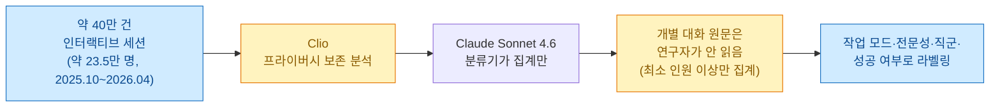
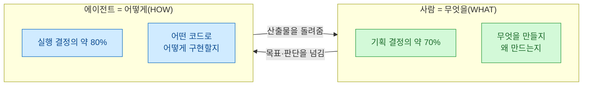
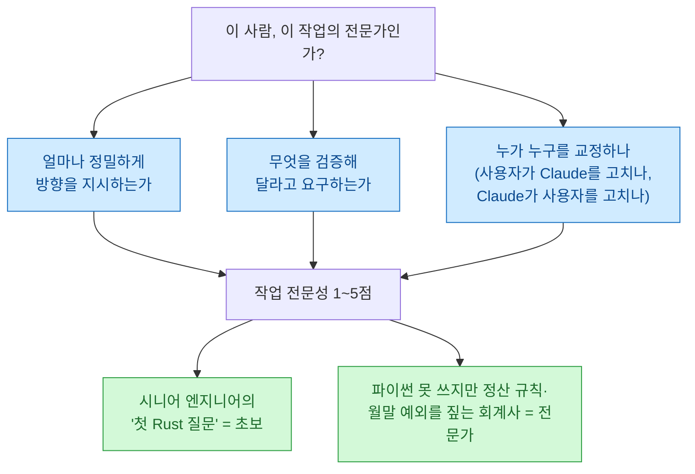
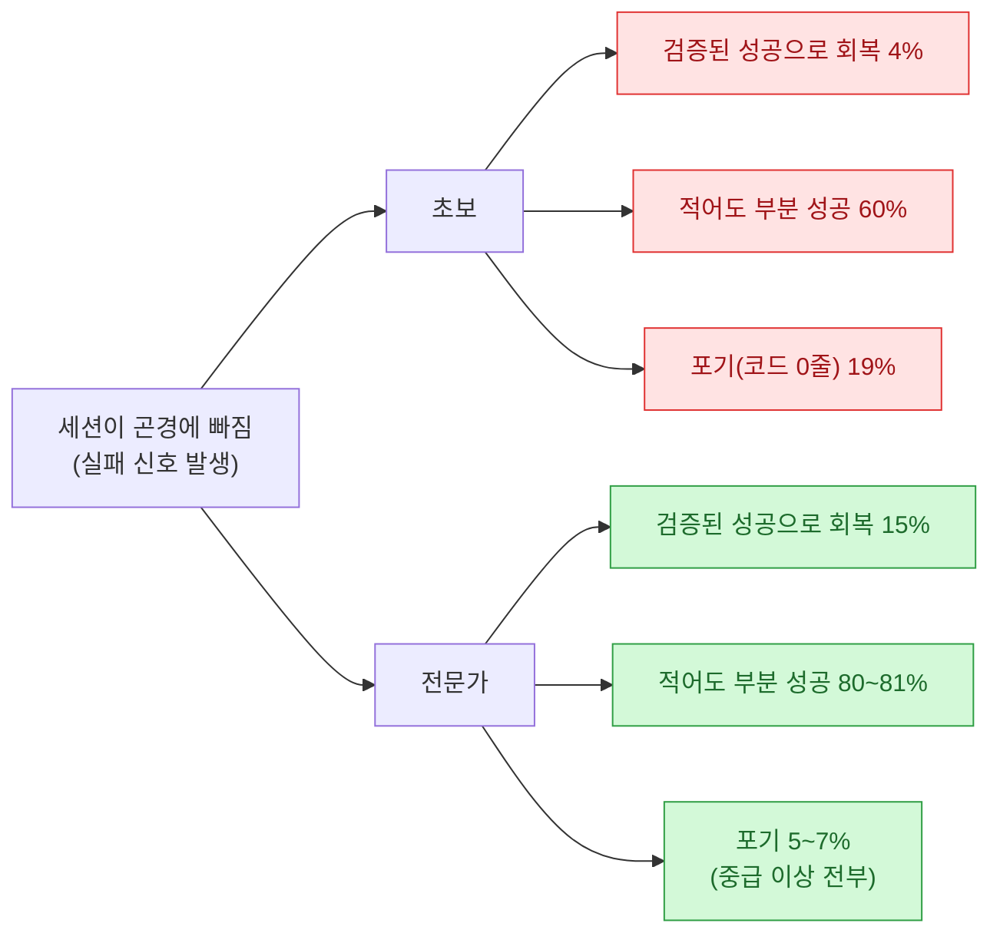
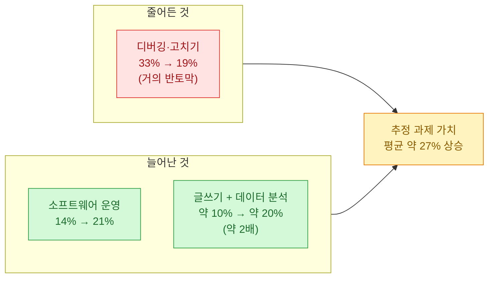
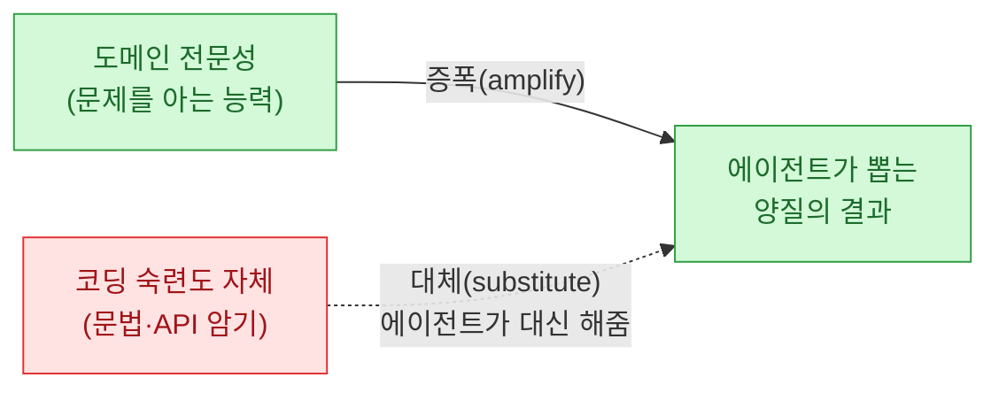

> 오늘의 일기. 나는 정식 소프트웨어 엔지니어 출신이 아니다. 데이터 분석과 디지털 마케팅을 하다가, 필요해서 에이전트로 자동화를 만들기 시작한 사람이다. 그래서 늘 마음 한구석이 찜찜했다 — **"내가 이걸 되게 만드는 게 실력인가, 그냥 운인가?"** 그런데 Anthropic이 클로드 코드 세션 **약 40만 건**을 뜯어본 보고서를 내놨고, 거기에 내 질문의 답이 있었다.

정확히 말하면, 이 보고서(2026-06-16, *"Agentic coding and persistent returns to expertise"*)를 읽다가 한 문장에서 손이 멈췄다.

> **"파이썬을 한 번도 써본 적 없지만, 대사(reconciliation) 규칙을 정확히 아는 회계사는 그 작업의 전문가다."**

이거 거의 내 얘기 아닌가. 나는 회계사도 개발자도 아니지만, 내가 만드는 크롤러가 무슨 데이터를 왜 긁어야 하는지, DART 재무 파이프라인이 어떤 숫자를 어떻게 맞춰야 하는지는 안다. 보고서는 바로 그게 핵심이라고 말하고 있었다. **에이전틱 코딩**(사람이 목표를 주면 AI 에이전트가 코드를 쓰고·고치고·실행까지 알아서 하는 방식)에서 성패를 가르는 건 코딩 경력이 아니라 **도메인 전문성**이라고.

## 이 보고서, 대체 무엇을 어떻게 본 건가?

먼저 규모와 방법부터. 이게 흔한 "설문 조사"가 아니라서 짚고 간다.

- **Clio**: Anthropic의 프라이버시 보존 분석 도구다. 사람이 개별 대화를 훔쳐보는 게 아니라, **일정 인원 이상에서만 집계**되는 패턴만 뽑아낸다. 그래서 "내 대화가 읽혔나" 걱정을 덜 수 있다.
- **텔레메트리**가 아니라 대화 **분류**다. Claude Sonnet 4.6이 각 세션을 읽고 라벨을 붙였다(단, 개별 원문은 연구자에게 노출되지 않는다).
- **범위**: CLI · claude.ai · 클로드 코드 데스크톱 앱. 헤드리스 `claude -p`나 서드파티 IDE·SDK 사용은 **제외**다. 즉 "사람이 직접 대화하며 쓰는" 사용만 봤다.

맥락도 하나. 코딩 에이전트가 활동하는 GitHub 프로젝트 비중은 **2025년 말 이후 2배 이상**으로 늘었다(약 12.8만 개 공개 저장소 중 10월 말 기준 16~23%). 클로드 코드 사용자는 평균 **주 20시간**쯤 이 도구를 켜두고 산다더라. 판이 커지는 중이라는 얘기다.

## 그래서 사람과 에이전트는 각자 무엇을 하나?

이 보고서에서 내가 제일 좋아하는 대목이자, 오늘 일기의 뼈대다. **분업 구조**가 숫자로 딱 갈렸다.

사람은 **기획 결정의 약 70%**(무엇을 할지)를 쥐지만, **실행 결정은 약 20%**만 한다. 나머지 실행의 **약 80%**는 Claude가 한다. 보고서의 한 줄이 이걸 정확히 요약한다.

> **"People decide what to build, and the agent decides how to build it."**
> (사람은 무엇을 만들지 결정하고, 에이전트는 어떻게 만들지 결정한다.)

내 손버릇을 돌아보면 정말 그렇다. 나는 "DART에서 이 회사들 재무제표 긁어서 이런 지표로 뽑아줘, 단위는 이렇게 맞추고"까지를 정하지, `requests`를 쓸지 `httpx`를 쓸지는 신경 쓰지도 않는다. 그건 에이전트 몫이다.

### 세션은 실제로 어떤 모양인가?

작업을 9개 모드로 나눠 보니(한 세션 = 한 모드):

| 작업 모드 | 비중 | 코드를 직접 만지나 |
|---|---|---|
| 고치기(fixing) | 26% | O |
| 만들기(building) | 25% | O |
| 소프트웨어 운영 | 17% | |
| 소통(문서·발표) | 10% | |
| 이해하기 | 7% | |
| 계획 | 7% | |
| 오케스트레이션 | 3% | O |
| 분석 | 3% | |
| 테스트 | 2% | O |

만들기·고치기·테스트·오케스트레이션을 합치면 **약 56%**가 코드를 직접 만진다. 세션 기준으로는 **48%가 기존 코드 수정**, 17%가 코드 탐색, 14%가 맨바닥부터 빌드, 그리고 **약 1/5은 코드베이스를 아예 안 건드린다**(문서·분석·기획만).

그리고 대화의 밀도가 놀라웠다. 세션당 평균 **약 4턴**, 사용자 프롬프트 한 번에 Claude가 평균 **약 10개 행동**(가끔 100개도 넘는다), 한 턴에 약 **2,400단어**를 쓴다. 꼬리가 길다 — **약 2%의 세션**은 프롬프트당 평균 100개 넘는 행동을, **약 270건 중 1건**은 200개 넘게, **약 2,300건 중 1건**은 500개 넘게 한다. 재미있는 건 **누가 운전대를 쥐냐**에 따라 갈린다는 것: 사용자가 실행 통제를 80% 넘게 쥐면 Claude는 턴당 약 8개 행동을, Claude가 기획을 80% 넘게 쥐면 약 16개 행동을 한다.

## '전문성'을 대체 어떻게 측정했다는 건가?

여기가 이 보고서의 심장이고, 나 같은 비개발자에게 제일 중요한 대목이다. Claude가 각 세션에서 사용자의 **작업 전문성을 1~5점**(초보→전문가)으로 매겼다. 핵심은 이게 **직함이나 일반 능력이 아니라 '그 작업에 한정된' 전문성**이라는 것.

전문성 신호는 세 가지다 — **얼마나 정밀하게 지시하는가, 무엇을 검증해달라 하는가, 그리고 누가 누구를 교정하는가.** 그래서 시니어 엔지니어라도 생애 첫 Rust 질문을 하면 그 세션에서는 **Rust 초보**로, 파이썬을 한 번도 안 써본 회계사라도 정산 규칙을 정확히 불러주고 월말 마감의 엣지 케이스를 잡아내면 그 작업의 **전문가**로 분류됐다.

이 정의가 왜 내게 위안이 됐냐면 — 나는 "개발자가 아니라서" 스스로를 늘 초보 칸에 넣어뒀는데, 이 기준으로 보면 내가 **깊이 아는 문제**에서는 나도 전문가 세션을 돌리고 있었던 거다.

### 전문성이 올라가면 무엇이 달라지나?

전문성이 높은 사람일수록 에이전트를 더 많이·더 길게 부린다.

| 사용자 | 프롬프트당 행동 수 | 프롬프트당 출력 단어 |
|---|---|---|
| 초보(novice) | 약 5개 (4.9) | 약 600단어 (607) |
| 전문가(expert) | 약 12개 (11.7) | 약 3,200단어 (약 5배) |

이게 단순 상관이 아니라, 작업 모드·과제 가치·월·직군을 다 통제하고(표준오차는 사용자 단위로 클러스터링) 돌린 회귀에서도 살아남았다. **전문성 한 단계당 행동 +9%, 출력 +13% (p<0.001).** 데이터 분석하는 사람으로서 이 통제·클러스터링 문구가 반가웠다. 대충 눈대중이 아니라는 뜻이니까.

## 결국 코딩 실력이 아니라 전문성이 성공을 만든다고?

성공을 어떻게 쟀는지부터. 두 가지 잣대가 있다.

- **판정된 성공(judged success)**: 분류기가 대화 전문을 읽고 성공/부분/실패/목표불명으로 판정. ("목표 불명" 약 7.7%는 제외.)
- **검증된 성공(verified success)**: 더 엄격하다. 판정 성공 **AND** 최소 1개의 하드 증거(커밋·PR, 통과한 테스트, 사용자의 명시적 확인)가 있어야 한다.

그리고 핵심 결과 — 전문성이 오르면 성공률이 오르되, **대부분의 이득은 초보→중급 구간에서 나온다.**

| 전문성 | 검증된 성공 | 적어도 부분 성공 |
|---|---|---|
| 초보(novice) | **15%** | 77% |
| 중급 이상(intermediate+) | 28~33% | 91~92% |
| 전문가(expert) | **33%** | 91% |

> **"a working grasp of the domain captures most of the benefit, while deep specialization adds only a bit more beyond that."**
> (도메인을 '굴러가게 이해하는' 수준이 이득의 대부분을 가져가고, 깊은 전문화는 그 위에 조금 더 얹을 뿐이다.)

이 문장이 나를 진짜 편하게 했다. **박사급 전문가가 될 필요는 없다.** 문제를 "굴러가게" 이해하는 수준이면 이득의 대부분을 먹는다. 나 같은 제너럴리스트에게 이건 복음 같은 얘기다.

### 막혔을 때(trouble) 진짜 차이가 난다

세션이 "곤경에 빠졌을 때"(검증된 실패 신호가 뜬 상황)의 회복력을 보면 전문성 격차가 더 선명하다.

곤경에서 검증된 성공으로 회복하는 비율은 초보 **4%** → 전문가 **15%**. 그냥 포기(판정 실패 + 코드 0줄)하는 비율은 초보 **19%** vs 나머지 전부 **5~7%**. 초보는 막히면 그냥 손을 놓지만, 전문성이 있으면 궤도로 되돌린다. 다만 공정하게 덧붙이면 — **전문가는 애초에 더 어려운 문제에서 막힌다**(곤경 세션의 과제 가치가 전문성 최하→최상으로 가면 대략 2배가 된다). 쉬운 문제를 잘 푸는 게 아니라 어려운 문제에 덤비다 막히는 거다.

## 그럼 직업(직군)은 성공률에 얼마나 영향을 주나?

이 파트가 비개발자에게 결정적이다. 직군을 약 70% 세션에서 추론했는데(미국 BLS SOC 23개 대분류로 매핑), 분류기에게 **"코딩한다는 사실을 코딩 직업의 증거로 쓰지 말라"**고 명시했다. 예컨대 계약서 조항 검사 스크립트를 짜는 변호사는 **컴퓨터/수학**이 아니라 **법률**로 분류된다.

결론: **직군은 전문성보다 덜 중요하다.** 코드를 생산한 세션 기준 검증된 성공/판정된 성공/적어도 부분 성공(%)을 보면 —

| 직군 | 검증된 성공 | 판정된 성공 | 적어도 부분 성공 |
|---|---|---|---|
| 관리(Management) | **37** | 55 | 95 |
| 컴퓨터·수학(소프트웨어) | 34 | 60 | 94 |
| 법률 | 33 | 57 | 95 |
| 비즈니스·재무 | 29 | 54 | 93 |
| 의료 | 28 | 56 | 93 |
| 예술·디자인·미디어 | 28 | 53 | 92 |
| 영업 | 28 | 51 | 92 |
| 건축·엔지니어링 | 27 | 54 | 93 |
| 교육 | 27 | 52 | 92 |
| 과학 | 27 | 54 | 94 |

소프트웨어/수학 직군의 코드 생산 세션은 검증된 성공 **34%**, 다른 직업은 **29%** — 격차가 겨우 **5점포인트**고, 7개월 내내 안정적이다. 10대 직군 전부가 소프트웨어 엔지니어와 **7점포인트 이내**다. 그리고 눈에 띄는 대목 — **관리직이 37%로 소프트웨어(34%)보다 오히려 살짝 높다.** 관리 스킬(방향 제시·위임·검증)이 에이전트 지휘에 그대로 옮겨오는 건지, 아니면 관리자들이 성공을 더 잘 "말로 확인"해주는 건지는 보고서도 단정하지 않는다.

비소프트웨어 직군 중에서는 **관리·영업·법률**이 가장 빠르게 성장 중이라고 한다. 코딩이 개발자만의 것이 아니게 되어간다는 신호다.

## 7개월 사이 사용 양상은 어떻게 변했나?

짧은 기간인데도 지형이 눈에 띄게 움직였다.

디버깅·고치기가 **33% → 19%**로 거의 반토막 났다(모델이 애초에 덜 틀리니 고칠 일이 준 것으로 해석). 소프트웨어 운영은 **14% → 21%**, 글쓰기+데이터 분석은 **약 10% → 약 20%**로 대략 두 배가 됐다. 프리랜서 공고와 비교해 추정한 **과제 가치는 평균 약 27% 상승**(핵심 요약에선 약 25%) — 만들기 +약 43%, 운영 +약 34%, 고치기 +약 32%, 소통 +약 2%. 단, 이 가격 추정치는 거칠어서 **절대 금액이 아니라 상대 비교용**이다.

데이터 분석이 두 배로 늘었다는 대목에서, 나는 이게 내가 서 있는 자리구나 싶었다.

## 이 모든 걸 한 줄로 줄이면?

보고서의 큰 프레임은 이거다.

**에이전틱 코딩은 도메인 전문성을 증폭(amplify)하고, 코딩 숙련도 그 자체는 대체(substitute)한다.** 헤드라인 문장이 못을 박는다.

> **"Coding agents are not substituting for domain expertise—the more understanding a worker brings to an agent, the more quality work the agent is able to do."**
> (코딩 에이전트는 도메인 전문성을 대체하지 않는다 — 노동자가 에이전트에게 더 많은 이해를 가져올수록, 에이전트는 더 양질의 일을 해낸다.)

그리고 마지막 못. **"coding is a leading case"** — 코딩은 에이전트가 가장 먼저 침투한 선도 사례일 뿐이고, 다른 지식노동으로 확장될 때 **같은 역학이 반복될 수 있다.**

## 비개발자 데이터 분석가로서, 나는 이걸 어떻게 받아들였나

솔직히 이 보고서는 내 지난 몇 년의 손버릇을 사후에 정당화해줬다. 나는 개발자가 되려고 코딩을 "제대로" 배운 적이 없다. 대신 크롤러, DART 재무 파이프라인, 뉴스 다이제스트를 **에이전트에게 시켜서** 만들어 왔다. 그러면서 무의식적으로 두 가지에 힘을 쏟았는데 —

- **문제를 깊이 이해하기.** 어떤 데이터가 왜 필요한지, 재무 숫자가 어떤 관계로 맞아떨어져야 하는지. 이게 보고서가 말하는 "도메인 전문성"이었다.
- **검증 루프.** 재무 데이터는 산술 검증(합계·비율이 맞나)을 걸고, 뉴스 다이제스트는 **만드는 쪽과 검사하는 쪽을 분리**(maker/checker)해 둔다. 이게 보고서가 말하는 "무엇을 검증해달라 요구하는가"였다.

즉 내가 키워야 할 근육은 **"코딩을 더 잘하기"가 아니라 "문제를 더 깊이 이해하고 + 결과를 더 잘 검증하고 + 방향을 더 잘 조종하기"**였다. 이 보고서는 그 방향이 틀리지 않았다고, 40만 세션의 데이터로 말해줬다.

한 가지 균형추도 챙긴다. 보고서 스스로 **예비적(preliminary)**이라고 못 박는다. 코드가 실제로 쓰였는지 버려졌는지 같은 현실 결과는 관측 못 하고, 비인터랙티브 대량 사용은 빠졌고, 모든 분류가 결국 "모델이 대화를 읽고 매긴 라벨"에 의존한다. 그러니 숫자를 신앙처럼 믿진 않는다. 다만 방향성만큼은 내 경험과 정확히 겹쳤다.

앞으로 지켜볼 두 신호도 인상적이었다. **전문성의 이득이 줄어든다면** → 모델이 사용자가 가져오던 판단을 스스로 채우기 시작했다는 뜻이고, **비소프트웨어 직군의 성공적 코딩 비중이 계속 커진다면** → 소프트웨어 생산이 모든 분야의 평범한 일이 되어간다는 뜻이다. 나는 후자에 걸겠다.

## 마무리 — 오늘의 결론

일기를 닫으며 한 줄로 정리하면 이렇다. **코딩 진입장벽이 낮아질수록 차별화는 '어떤 문제를 왜 푸는가'와 '에이전트 결과를 검증·조종하는 능력'으로 옮겨간다.** 개발자 출신이 아니라는 게 더는 핸디캡이 아니다. 내가 깊이 아는 문제 앞에서라면, 나는 그 작업의 전문가다.

*같이 보면 좋은 글: [[loop-engineering-four-loops-loopcraft|루프 엔지니어링 4단계]] · [[fable5-from-instructing-agents-to-designing-loops|목표만 주고 물러서기]] · [[fable5-maker-checker-separation-setup|만드는 쪽과 검사하는 쪽 분리]] · [[game-data-analyst-case-study|게임 데이터 분석가가 하는 일]]*

---

한 줄 교훈: **에이전트 시대의 경쟁력은 코딩 실력이 아니라, 문제를 이해하는 깊이와 결과를 검증·조종하는 능력이다.**

*이 글은 Anthropic의 리서치 보고서(2026-06-16)를 요약·재도식화한 것이다. 수치는 모두 보고서 자체의 것이며, 전체 방법론과 한계는 원문을 직접 확인하길 권한다: https://www.anthropic.com/research/claude-code-expertise*

<!-- 안전: 회사 실데이터·고객/제3자 PII·API키/쿠키/토큰 없음. 외부 보고서 요약·논평 + 출처 링크. 달러 금액은 % 상대비교로만 표기. -->
