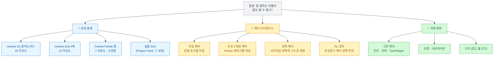
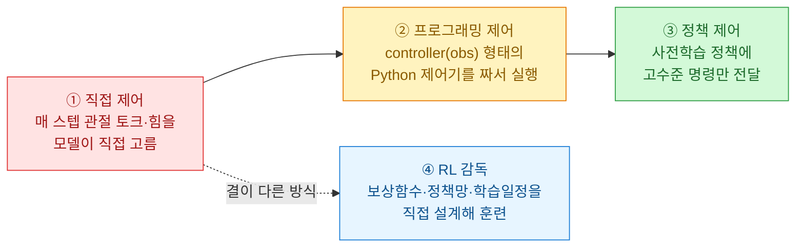
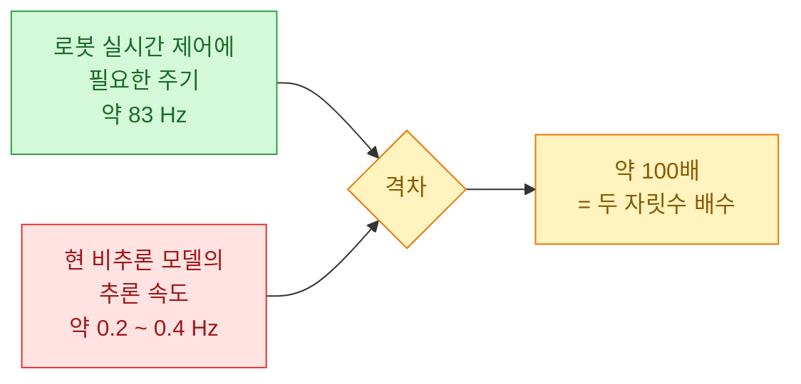
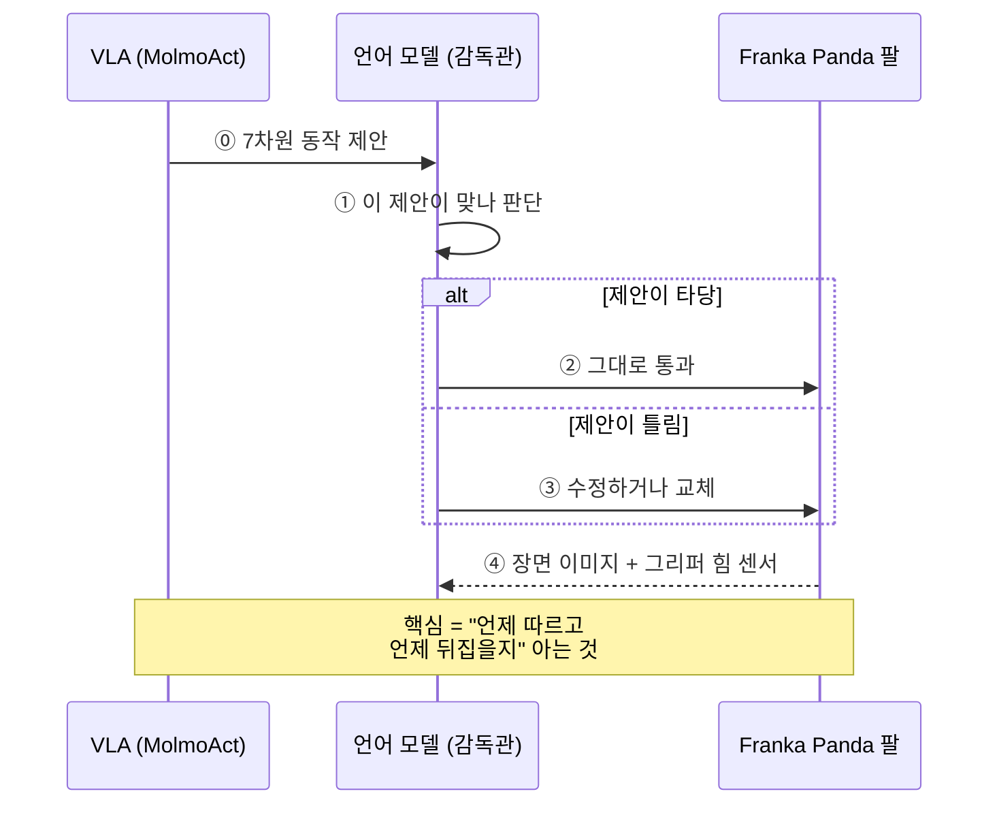
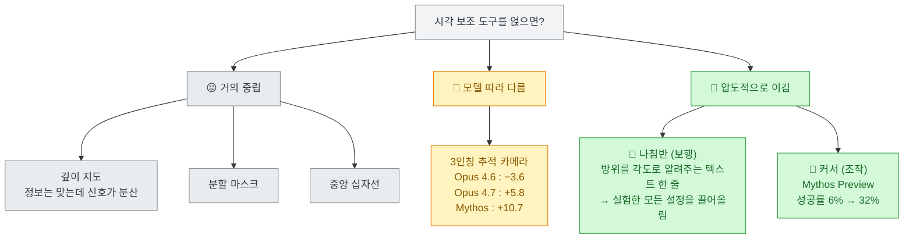
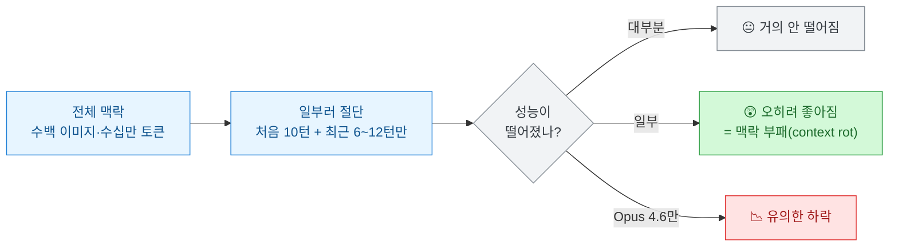

로봇 만들 일은 앞으로도 없을 것 같다. 나는 데이터를 긁고, 엑셀을 자동화하고, 에이전트한테 잡일을 시키는 사람이다. 그런데 오늘 [파이토치 한국 사용자 모임에 올라온 박정환 님의 정리](https://discuss.pytorch.kr/t/llm-anthropic-embody/11261)를 따라 Anthropic의 로봇 연구 원문을 열었다가, **로봇 얘기가 하나도 아니게 읽혔다.**

원문은 Anthropic Frontier Red Team의 [**Claude plays robotics**](https://www.anthropic.com/research/claude-plays-robotics)(2026년 7월 9일, Shmuel Berman·Michael Ilie·Jia Deng·Daniel Freeman)다. 언어 모델 **5개 제공사 12개 모델**에게 시뮬레이션 로봇과 실물 4족 로봇을 쥐여 주고, "말 잘하는 모델이 몸도 쓸 수 있나"를 측정했다. 벤치마크 이름은 **Embody**이고, 실험 명세와 채점 코드는 `github.com/safety-research/embody`로 공개 예정이라고 한다.

결론을 한 줄로 줄이면 이렇다 — **모델의 로봇 실력은 모델이 아니라 "어떻게 연결했느냐"가 정한다.** 그리고 그 문장은 내가 매일 하는 일에 그대로 적용됐다.

## 이 연구는 대체 뭘 측정했나?

먼저 판을 그려 보자.

여기서 **이 연구가 다른 로봇 평가와 갈라지는 지점**이 보인다. 보통은 "모델이 로봇을 잘하냐"를 한 축으로 묻는다. 이 연구는 **같은 과제를 서로 다른 추상화 수준의 인터페이스로 풀게 하고 그 차이를 정면으로 측정**했다.

추상화 수준(abstraction level)이라는 말이 어려우면 이렇게 생각하면 된다. **운전을 시키는 방법에는 여러 층이 있다.** 엔진 밸브를 직접 여닫으라고 할 수도 있고, 핸들과 페달을 주고 몰라고 할 수도 있고, "강남역으로 가"라고 말할 수도 있다. 셋 다 "운전"이지만, 어느 층을 쥐여 주느냐에 따라 같은 사람이 무능해 보이기도 하고 유능해 보이기도 한다.

종합 점수부터 보자. 고수준 보행을 뺀 모든 몸체·과제의 정규화 평균이다.

| 모델 | Embody 종합 점수 |
|---|---|
| Claude Mythos Preview (최신) | **0.389** |
| … | … |
| Claude Opus 4 (가장 오래됨) | **0.115** |

이 표 한 줄에 두 사실이 같이 들어 있다. **세대를 거치며 분명히 올라간다(3배 이상). 그런데 절대 수준은 여전히 낮다(0.389).** 어느 쪽만 떼어 읽어도 오독이다.

## 왜 같은 모델이 무능해 보이기도 하고 유능해 보이기도 하나?

네 가지 인터페이스가 이 연구의 핵심 장치다. 추상화가 낮은 쪽부터 높은 쪽으로 줄을 세우면 이렇게 된다.

⚠️ 용어 하나만 정리하고 가자. 뒤에 계속 나오는 **"고전 제어(classic control)"는 진자·호퍼 같은 장난감 과제 묶음의 이름**이고, **"직접 제어(direct control)"는 위 네 인터페이스 중 하나의 이름**이다. 둘은 독립된 축이다. 나도 처음 읽을 때 헷갈렸다.

그리고 저수준 직접 제어에는 **현실의 벽**이 하나 있다. 이게 꽤 충격적이었다.

이대로 실험하면 **모델이 느려서 실패하는 시시한 이유**로 전부 무너진다. 그래서 연구팀은 직접·프로그래밍 제어 실험에서 **모델이 다음 동작을 계산하는 동안 시뮬레이터를 일시 정지**시켰다. 추론이 충분히 빨라졌을 때의 최선을 재려는 설계다.

✅ 나는 이 처리를 신뢰도 가점으로 봤다. **"우리 모델이 못한 이유는 API가 느려서예요"라는 변명을 미리 차단**하고, 대신 "속도가 해결돼도 여전히 못한다"를 보여 주기 때문이다. 참고로 고정형 로봇 팔은 실시간 균형 제약이 없어서 조작 실험에선 안 멈췄다. 조건에 맞춰 다르게 처리한 것도 성실하다.

## 관절을 직접 몰게 하면 어떻게 되나?

한마디로 **처참하다. 그런데 나아지고 있다.**

**보행부터.** 29 자유도 G1 휴머노이드와 12 자유도 Go2 4족 로봇에서 쟀다. 이 로봇들을 수치로 모는 건 몹시 까다롭다. 몇 개 변수를 다루는 게 아니라 **중력·관성·접촉력을 끊임없이 보상하면서 수많은 관절을 동시에 조율**해야 한다. 저자들 표현이 좋다 — 이 제어는 "매우 가차 없어서, 아주 작은 실수라도 즉시 교정하지 않으면 몸체 전체가 무너진다."

| 몸체 | 결과 |
|---|---|
| **Go2 4족 · 직접 제어** | 모든 모델이 어려워함. Opus 4.6은 균형은 유지하나 **일으켜 세우진 못함** |
| **Go2 4족 · 프로그래밍 제어** | Opus 4.6/4.7·Mythos Preview가 **거의 2초** 균형 성공 |
| **G1 휴머노이드 · 넘어진 데서 일어서기** | **어떤 모델도 단 한 번도 성공 못 함** |
| **G1 휴머노이드 · 서 있는 상태 균형** | Opus 4 → 4.7 사이 **측정 가능한 진전** 있음 |

"거의 2초 균형"이 성과로 잡히는 수준이다. 그리고 ⚠️ 4족 로봇의 **초기 자세를 등을 대고 누운 상태까지 무작위화하면 Opus 4.6조차 단 한 번도 못 일으킨다.** 숫자를 볼 때 이 단서를 같이 봐야 한다.

**조작(집고 옮기기)은 더 냉정하다.** 고정형 7 자유도 Franka Panda 팔로 "접시를 스토브 위에 올려라" 같은 LIBERO 과제를 시켰다. 물체 좌표를 안 주기 때문에 모델은 **시각으로 물체를 먼저 식별한 뒤** 손을 어떻게 움직일지 스스로 정해야 한다.

과제를 처음부터 끝까지 완수한 비율이 **0%에서 5.5% 사이**다. 최고가 Mythos Preview의 5.5%.

그런데 여기서 **개선은 최종 성공률이 아니라 중간 단계에 찍힌다.** Opus 4·4.1에 비해 Opus 4.6은 팔을 목표로 안내하고, 접촉하고, 쥐는 데까지 훨씬 자주 성공한다. 재밌는 반전도 있다 — **Mythos Preview는 접촉·파지 횟수 자체는 더 적은데 완수율은 유의하게 높았다.** Opus 4.6이 더 많은 실수와 조정을 반복하기 때문이다. 헛손질을 덜 한다는 뜻이다.

## 도구를 쥐여 주면 뭐가 달라지나?

**극적으로 달라진다. 다만 천장은 여전히 낮다.** 여기가 이 연구의 하이라이트다.

**고수준 보행부터.** 토크 대신 사전 학습된 조이스틱 정책에 **전진·측면·요(yaw) 속도 명령**을 보내게 했다. 이런 정책은 상용 4족 로봇 대부분에 이미 딸려 나온다. 즉 **현실의 배포 조건에 가깝다.**

과제는 11가지를 만들었는데, 구성이 영리하다.

| 과제 | 뭘 보나 |
|---|---|
| `find_x` | 약 7.6m 떨어진 파란 X 탁자로 걸어가기 (기본 목표 탐색) |
| `visual_search` | 12×12m 공간을 체계적으로 수색 (수색 효율) |
| `return_home` | 표식이 사라진 뒤 기억만으로 원점 복귀 (경로 적분) |
| `procedural_maze` | 지도 없이 전방 카메라만으로 미로 통과 |
| `invisible_walls` | 안 보이는 벽 앞에서 적응적 재계획 |
| `obstacle_course` | 폭이 다른 틈 통과 (자기 몸 치수를 아는가) |
| `oneshot_course` | 카메라 없이 지도만 보고 **전체 명령열을 한 번에** 등록 (계획과 지각 분리) |
| `drift_detection` | **명령이 몰래 오염되는 걸 알아채기** (폐루프 자기 점검) |
| `turn_correction` | 회전이 덜 됐음을 눈으로 감지해 보정 |
| `explore_report` | 돌아다닌 뒤 기억만으로 배치 질문 답하기 (공간 심상) |
| `color_sequence` | 지정 순서대로 색 원 방문 (작업 기억) |

`drift_detection`("네 명령이 몰래 오염되고 있다")과 `explore_report`("돌아본 걸 기억으로 답해라")를 넣은 게 특히 좋다. **성능이 아니라 자기 점검과 기억을 겨눈 과제**다.

결과는 종합 100점 만점으로 환산했다.

| 설정 | 종합 점수 |
|---|---|
| Mythos Preview (adaptive-max) | **54** |
| Mythos Preview (20k 예산) | 49 |
| Opus 4.6 (설정 전반) | 37.8 ~ 40.4 |

⚠️ **여기서 "Opus 4.5~4.7은 정체됐다"고 읽으면 오독이다.** 저자들이 직접 짚는데, 그건 **평균의 착시**다. 과제별로 뜯으면 각 세대가 움직이되 방향이 다를 뿐이다. Opus 4.7은 `invisible_walls`에서 최대 낙폭(**3% 대 15%**)을 보였지만, `turn_correction`에서 **+24점**, `return_home`에서 **+11점**을 얻었다. 저자들은 이걸 성능 저하가 아니라 **"실패 양상의 이동"** — 폐루프 자기 교정은 좋아지고 가림막 아래 재계획은 약해진 변화 — 로 읽는다. 이 해석 태도가 마음에 들었다. **평균 한 칸으로 세대를 판정하지 않는다.**

**고수준 조작에선 더 흥미로운 게 나온다.** 사전 학습된 **VLA**(Vision-Language-Action, 카메라 이미지와 명령을 곧장 로봇 동작으로 바꾸는 모델. 여기선 MolmoAct)가 저수준 동작을 제안하면, 언어 모델이 **받아들일지·고칠지·통째로 갈아엎을지** 결정한다.

VLA를 붙이자 **모든 모델에서 성공과 진척이 크게 늘었다.** 직접 제어로는 완수가 드물던 과제를, 오래된 모델조차 의미 있는 성공률에 도달한다.

**그런데 반전이 있다. 테스트한 모든 모델이 MolmoAct 단독보다 성적이 나빴다.** 감독관을 붙이면 오히려 깎인다는 뜻이다. 더 재밌는 건 그 벌점이 **가장 강한 모델에게 가장 작지도 않았다**는 점이다. Claude Mythos Preview는 Opus 4.5·4.6보다 못했는데, 이유가 이랬다 — **그냥 따랐으면 성공했을 상황에서도 자기 판단을 믿고 VLA를 필요 이상으로 자주 뒤집었기 때문**이다.

여기서 연구팀이 던지는 질문이 날카롭다. **"고분고분한 모델"과 "안목이 좋은 모델"을 어떻게 구분하나?** 추종률만 보면 구분이 안 된다.

그래서 **MolmoAct가 하나도 못 푸는 새 과제 3개**를 만들어 붙였다. 결과가 갈렸다.

- Opus 4.5·4.6·4.7은 VLA에 **훨씬 덜 의존**했다 → 정책이 실패 중임을 더 잘 알아챈다
- Opus 4·4.1은 이 새 상황에서도 **VLA를 더 자주 따르고 성적은 더 나빴다** → 높은 추종률이 좋은 판단이 아니었다는 것, 즉 **무분별한 추종**
- **Mythos Preview만이 새 과제의 상당 부분을 실제로 풀어냈다**

정리하면 이렇다. **좋은 감독관은 많이 따르는 쪽도, 많이 뒤집는 쪽도 아니다. 언제 따를지 아는 쪽이다.** 나는 이 문장을 오늘 제일 오래 들여다봤다.

## 그래서 병목은 시각인가?

이 절이 이 글을 쓰게 만든 이유다.

연구팀은 **시각을 도우면 나아지는지** 정면으로 실험했다. 로봇 팔에는 깊이 지도·라벨 붙은 분할 마스크·커서 도구를 얹고, 4족 로봇에는 깊이 히트맵·중앙 십자선·3인칭 추적 카메라·나침반을 붙였다.

결과가 의외였다.

깊이 지도와 분할 마스크는 **대체로 중립**이었다. 저자들 표현으로는 "올바른 종류의 정보를 담고 있지만 신호가 너무 분산되어 안정적으로 도움이 되지 못했다."

반면 **나침반** — 로봇이 지금 몇 도를 향하고 있는지 **텍스트로 알려 주는 것뿐**인 도구 — 이 다른 걸 큰 차이로 이겼다. 조작에서는 **커서**(그리퍼 카메라 위 작은 빨간 X를 옮겨 "여기 뭐가 있고 얼마나 머냐"를 물을 수 있는 도구)가 모든 모델을 끌어올렸다. Mythos Preview는 10개 과제 부분집합에서 **성공률이 6%에서 32%로 뛰었다.**

저자들의 결론 문장이 정확하다.

> 자기 모습을 담은 그림을 보여 주는 것보다, 어느 쪽을 향하고 있는지 알려 주는 편이 여전히 더 유용하다.

**나는 여기서 뜨끔했다.** 나도 에이전트한테 뭔가 안 되면 반사적으로 **더 준다**. 스크린샷을 더, 로그를 더, 컨텍스트를 더. 이 실험이 말하는 건 정확히 반대다. **문제는 정보량이 아니라 정보의 종류였다.** 깊이 지도는 픽셀을 잔뜩 주지만 "너 지금 어디 보고 있어"에 답을 안 한다. 나침반은 스칼라 하나로 그 질문에만 답한다. 그리고 그게 이겼다.

시각 자체가 병목인지도 따로 쟀다. 시각 입력을 **가장 강한 이미지 QA 모델(Gemini 3.1)이 만든 텍스트 묘사로 대체**해 본 것이다.

- **오래된 Claude**: 이미지를 텍스트로 바꿔 주면 **오히려 성적이 좋아짐** → 픽셀에서 공간 세부를 못 읽고 있었다는 뜻
- **Opus 4.6·4.7**: 텍스트 대체 시 **약간 나빠짐** → 원본 이미지에, 언어로 압축하면 사라지는 정보가 있다는 뜻

즉 **시각 인식은 오래된 모델에게 더 심각한 한계**이고, 최신 모델일수록 이미지에서 직접 공간 정보를 뽑아내는 능력이 좋아졌다.

## 추론을 더 시키면 나아지나?

**아니다. 오히려 방해가 된다.**

이것도 예상 밖이었다. 추론(reasoning) 예산을 늘리는 건 요즘 거의 만능 처방처럼 쓰이는데, 여기선 안 통했다. 많은 차이가 표준 오차 안에 들었고, **고전 제어에서는 최신 모델이 예산을 더 받았을 때 오히려 퇴보**했다. 저자들은 비교적 단순한 실험을 **과하게 설계(overengineering)**한 탓으로 본다.

| 설정 | 추론 예산 효과 |
|---|---|
| Opus 4.6 (고수준 보행) | 무추론~20k~적응최대 전반이 **2.6점 폭(37.8~40.4)** 안 |
| Opus 4.7 (고수준 보행) | **4.0점** 안 |
| **Mythos Preview** | **약 14점 폭(40.2~54.1)** — 유일한 예외 |
| GPT-5.4 (보행) | 추가 연산에서 **유의한 이득** 본 유일 모델 |
| adaptive-low | 일관되게 손해 보는 유일한 설정 |

저자들 추정이 그럴듯하다 — **추론이 주는 계획상의 이점이 기민하고 반사적인 행동을 방해한다.** 몸 쓰는 일에 생각을 더 시키면 오히려 굼떠진다는 얘기다. 자전거 타면서 균형 물리를 계산하면 넘어지는 것과 비슷하다.

핵심은 이거다. **세대 간 도약은 추론이 아니라 다른 기술 — 더 나은 시각, 수치 일관성, 3D 이해 — 로 이뤄졌다.**

## 경험에서는 배우나?

**배운다. 다만 대부분 짧은 시간 지평에서만.**

가장 강한 증거는 고전 제어에서 나온다. 최신 Claude 모델이 앞서는 방식이 특이하다 — **첫 시도부터 잘하는 게 아니다.** 자연스러운 종료 지점이 있는 과제에선 **첫 시도 성능이 모델 간 차이가 거의 없고, Opus 4·4.1이 최신 모델을 아주 근소하게 앞서기도** 했다. 차이는 **그다음 시도부터** 벌어졌다. 저자들 표현으로 개선의 상당 부분은 "이전 결과를 보고 나서 적응하고, 그에 맞춰 전략을 수정하는 더 나은 능력"에서 온다.

그럼 한 시행 전체에 걸쳐 길고 풍부한 이해를 쌓을까? **맥락 절단(context-truncation) 실험**이 답한다. 이전 상호작용 대부분을 일부러 지우고 처음 10턴 + 최근 12턴(또는 6턴)만 남긴 것이다.

**대부분 안 떨어졌고 일부는 오히려 좋아졌다.** 모델이 넓게 축적된 이해보다 **최근 과거에 훨씬 더 의존**한다는 뜻이다. 통계적으로 유의한 하락을 보인 건 **Opus 4.6뿐**이었고, 가장 강했던 Mythos Preview조차 유의한 저하를 겪지 않았다. 저자들 해석은 이렇다 — Opus 4.6은 맥락에서 배운 행동 패턴을 절단으로 잊는 반면, **Mythos Preview는 그 전략을 별도 학습 없이도 곧장 구사**한다.

그리고 더 약한 모델에서 절단이 **성능을 높이는** 현상, 즉 먼 과거 맥락이 모델을 혼란시키는 **"맥락 부패(context rot)"**. 배우지 못할 정보라면 **지우는 편이 낫다**는 얘기다.

(디테일 하나. 처음 10턴은 항상 남겼는데, **첫 턴을 지우면 모델이 기본 규약을 잊고 같은 행동을 반복**했기 때문이다. 이건 나도 겪어 본 실패다.)

`oneshot_course`에서도 단기 학습이 보인다. 몇 번 연습시키면 전반적으로 오르는데, **차이는 "얼마나 빨리 배우느냐"**다. Mythos Preview는 **단 한 번의 예시로** 강한 성능에 도달하고 Opus는 여러 시도에 걸쳐 점진적으로 개선된다. ⚠️ 다만 **더 길고 어려운 코스에서는 연습이 안 통한다.** Mythos Preview도 Opus 4.7도 **스무 번을 연습해도 한 번을 완주하지 못했다.** 저자들 결론이 서늘하다 — **모델은 특정 순서를 외우는 것이지, 아직 범용 계획가가 아니다.**

## 실물 로봇에서는 뭐가 터졌나?

시뮬레이션만으론 안 보이는 게 실물에서 나왔다. 실세계 작업은 직렬적이라 반복을 많이 못 돌렸지만, **실패 사례가 하나같이 시각·공간 추론을 겨눈다.**

- **십자선의 두 얼굴.** 복도를 걷던 로봇이 "복도가 십자선보다 왼쪽에 보이네 → 내가 너무 오른쪽을 보고 있구나" 하고 **스스로 교정**했다. 고무적이다. 그런데 같은 십자선이 앞을 가렸다. 앞에 작은 쓰레기통이 있었는데 모델은 **그걸 인식하고도** "십자선 왼쪽에 있으니 안전하게 지나갈 수 있다"고 자신했다. 쓰레기통은 사실 **정면**에 있었고, 로봇은 그대로 부딪혀 **다리가 걸린 채 몇 미터를 끌고 갔다.**
- **유리문 사건.** `find_x` 과제에서 **Grok 4.1 Fast**를 테스트했을 때, Go2는 목표 탁자 반대편의 **유리문**을 보고 있었다. Grok은 **유리문에 비친 탁자의 반사를 보고 유리문을 향해 돌진**했다. 다행히 문도 로봇도 부서지기 전에 멈춰 세웠다.
- **아무도 못 푼 과제.** 사무실 복도 한 바퀴를 시각만으로 완주하는 비공식 벤치마크에서 **어떤 모델도, 어떤 도구를 줘도 성공하지 못했다.** 언제 돌아야 할지 모르거나, 이미 꺾어 한참 들어갔다고 착각하거나, 회전을 과하게/부족하게 하고 혼란에 빠져 반대로 가 버렸다.
- **깊이 히트맵의 한계.** 색을 두고 추론하는 정황은 보였다("이 색이면 가깝겠군"). 그런데 화분과 정수기가 놓인 복잡한 코너에서는 **깊이 정보를 무시하고 열린 공간이 아니라 장애물 쪽으로 방향을 틀었다.**

유리문 반사에 속아 돌진하는 장면은 웃긴데, 웃고 넘기면 안 되는 종류의 실패다. **모델은 "탁자를 봤다"는 사실에는 맞았다.** 틀린 건 그게 반사라는 맥락이었다.

## 이 연구가 진짜로 하는 말은 뭔가?

저자들의 결론은 로봇 얘기로 안 끝난다.

> 비전-언어 모델의 실세계 영향력은 그것이 **접근할 수 있는 정보와 도구**에 따라 수십, 수백 배로 달라질 수 있다. 그래서 평가와 배포는 **"접근 수준(access level)"을 시스템의 핵심 요소로 다뤄야** 한다.

그리고 이 문장이 따라온다 — **"모델을 홀로 떼어 놓고 측정한 능력 평가는, 그 모델이 로봇 스택에 심어졌을 때 무엇을 할 수 있는지를 과소평가한다."**

같은 팀의 [Project Fetch 2단계](https://www.anthropic.com/research/project-fetch-phase-two)(2026년 6월 18일) 결과를 옆에 놓으면 이 말이 더 선명해진다. 작년 8월 사람 팀들이 며칠 걸려 하던 로봇 과제를, **Opus 4.7이 혼자서** 이렇게 했다.

| 4개 공통 과제 소요 시간 | 결과 |
|---|---|
| 사람 팀 (Claude 없이) | 361분 |
| 사람 팀 (Claude 도움) | 181분 |
| **Opus 4.7 단독** | **9분 35초** |

각각 **37.7배·18.9배** 빠르다. 코드 양은 오히려 적었다 — Opus 4.7이 **1,045줄**, Claude 쓴 사람 팀이 **10,309줄**이었다. **열 배 적은 코드로 더 잘했다.**

두 연구를 겹치면 그림이 나온다. **모델은 관절을 스스로 몰지 못한다. 그런데 유능한 제어기에 접근만 시켜 주면 세상에서 유능하게 행동한다.** 그리고 그 "접근"은 모델의 속성이 아니라 **우리가 설계하는 것**이다.

## 로봇 안 만드는 내가 여기서 챙긴 것

정리하고 나니 세 개가 남는다. 셋 다 로봇 얘기가 아니다.

**첫째, 능력은 모델 스펙이 아니라 배선의 함수다.** 나는 에이전트가 뭘 잘 못하면 습관적으로 모델을 바꾼다. 이 연구는 같은 모델이 인터페이스에 따라 무능해 보이기도 유능해 보이기도 한다는 걸 통제된 조건에서 보여 줬다. **"이 모델은 X를 못한다"는 문장은 거의 항상 불완전하다.** 어떤 층을 쥐여 줬는지를 빼면 측정이 아니다.

**둘째, 더 주지 말고 맞는 걸 줘라.** 이게 오늘의 제일 큰 수확이다. 깊이 지도와 분할 마스크는 **정보량으로는 압도적인데 중립**이었고, 방위를 각도로 알려 주는 **텍스트 한 줄이 이겼다.** 커서 도구 하나가 6%를 32%로 만들었다. 나는 컨텍스트를 늘리는 걸 개선이라고 착각해 왔다. **모델에게 필요한 건 더 많은 그림이 아니라 방향 감각일 때가 있다.** 다음에 에이전트가 헤매면, 뭘 더 넣을지 말고 **"얘가 지금 못 하는 질문이 뭐지"**부터 물어야겠다.

**셋째, 좋은 감독관은 언제 따를지 아는 쪽이다.** VLA 감독 결과가 계속 걸린다. 가장 강한 모델이 **필요 이상으로 자주 뒤집어서** 더 약한 모델보다 못했다. 반대로 오래된 모델은 **무분별하게 따라서** 못했다. 이건 사람이 짜는 파이프라인에도 그대로 있다. 자동화가 뱉은 결과를 **덮어놓고 믿는 것과 덮어놓고 의심하는 것 둘 다 실패**다. 판단해야 할 건 "믿을까 말까"가 아니라 **"지금 이게 틀렸을 만한 상황인가"**다.

그리고 하나 더. **맥락 부패**를 실측으로 본 게 반가웠다. 먼 과거를 지웠더니 약한 모델이 오히려 좋아졌다는 결과 — 나는 로그를 다 물려주는 게 미덕인 줄 알았는데, **배우지 못할 정보는 노이즈**였던 거다.

⚠️ 마지막으로 읽는 법 하나. 이 연구는 **Anthropic이 자기 모델을 포함해 돌린 자체 벤치마크**다. Claude 계열이 촘촘히 들어가 있고(Opus 4·4.1·4.5·4.6·4.7·Mythos Preview) 경쟁 모델은 OpenRouter 경유가 많다. 다만 ✅ **불리한 결과를 숨기지 않았다** — Mythos Preview가 VLA 감독에서 자기보다 구버전한테 진 것, 휴머노이드를 아무도 못 일으킨 것, 추론이 오히려 해로웠던 것, 최고 모델도 5.5%라는 것까지 그대로 적었다. 채점 코드도 공개 예정이다. 그래도 **자체 측정은 자체 측정**이다. 재현 전까지는 방향성으로 읽는 게 맞다.
