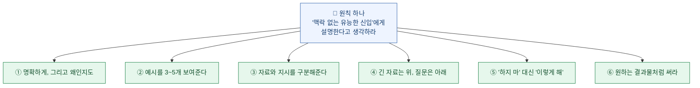
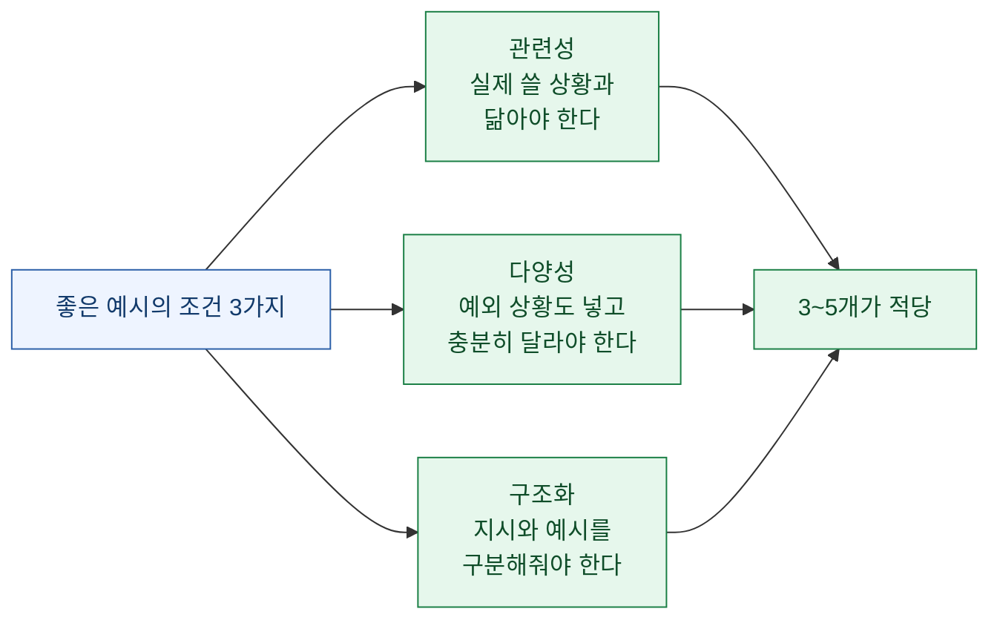
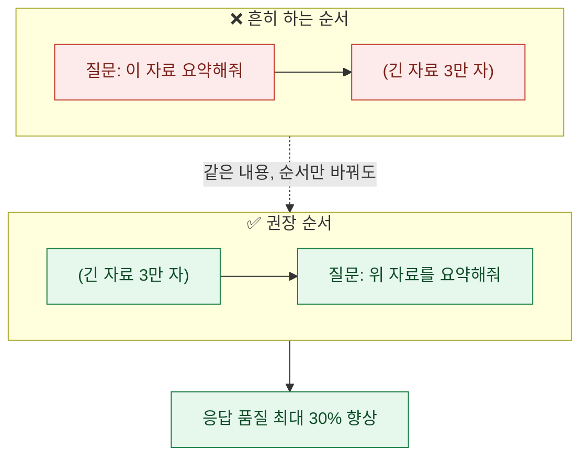
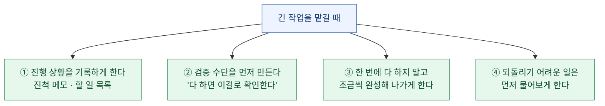

AI를 쓰다 보면 이상한 경험을 한다. **같은 도구인데 어떤 날은 놀랍고 어떤 날은 답답하다.**

한동안 "그날 운이 나쁜가" 싶었는데, 공식 프롬프트 가이드를 읽고 나서 생각이 바뀌었다. **내가 어떻게 물어보느냐가 대부분을 결정하고 있었다.**

이 글은 그 문서에서 **개발자가 아니어도 오늘 당장 쓸 수 있는 것**만 골라 풀어 쓴 것이다. 코드 얘기는 걷어냈다.

## 한 장으로 보면



## 원칙 하나만 기억한다면

문서 전체를 관통하는 비유가 하나 있다. 이게 제일 좋았다.

> **Claude를 "명석하지만 우리 회사 관행과 업무 흐름을 전혀 모르는 신입사원"이라고 생각하라.**

머리는 좋은데 **우리 사정을 하나도 모르는 사람**이다. 그래서 우리끼리 통하는 줄임말, 암묵적인 순서, "당연히 이렇게 하는 거지" 같은 걸 모른다.

그리고 문서가 제시한 검증 방법이 아주 실용적이다.

> **황금률: 그 일에 대한 배경 지식이 거의 없는 동료에게 당신의 지시문을 보여주고 따라 해보라고 하라. 그 사람이 헷갈리면, AI도 헷갈린다.**

이 한 문장이 프롬프트 강의 열 개보다 낫다고 생각한다. **내 지시가 애매한지 아닌지를 판정하는 기준이 생기기 때문이다.**

## ① 명확하게 — 그리고 "왜"까지 말한다

**명확하게 쓰라**는 조언은 흔하다. 그런데 문서가 덧붙인 부분이 새로웠다.

> **지시의 배경이나 동기를 함께 제공하면**, 즉 왜 그런 행동이 중요한지 설명해주면, AI가 목표를 더 잘 이해하고 더 적확한 답을 낸다.

문서는 그 이유를 이렇게 적는다 — **"설명으로부터 일반화할 만큼 똑똑하다."**

예를 들어보자.

| 그냥 지시 | 이유를 붙인 지시 |
|---|---|
| "숫자에 단위를 꼭 붙여줘." | "숫자에 단위를 꼭 붙여줘. **이 표를 그대로 보고서에 붙여넣을 건데, 단위가 없으면 읽는 사람이 원본을 다시 찾아봐야 해.**" |

두 번째로 쓰면 **내가 미처 말하지 않은 상황에서도 알아서 처리한다.** "단위를 붙여라"만 들으면 시킨 곳에만 붙이지만, "읽는 사람이 원본을 안 찾게 하려는 것"이라는 목적을 알면 각주나 기준 시점 같은 것도 챙긴다.

**그리고 원하는 걸 명시적으로 요구해야 한다.** 문서 표현이 재밌다.

> **"기대 이상(above and beyond)"의 결과를 원한다면, 애매한 지시로 알아서 눈치채길 바라지 말고 명시적으로 요청하라.**

"분석해줘"와 "분석해줘. **가능한 한 많은 관련 기능과 상호작용을 넣고, 기본 수준을 넘어서 완성도 있게 만들어줘**"는 결과가 다르다.

## ② 예시를 보여준다 — 3\~5개

문서가 **"출력 형식·톤·구조를 잡는 가장 확실한 방법"** 이라고 부른 게 예시다.



**다양성이 왜 중요한가**가 특히 실용적이다. 예시가 다 비슷하면 **의도하지 않은 패턴을 따라 해버린다.** 예를 들어 예시 세 개가 다 짧으면 "짧게 쓰라는 거구나"로 알아듣는다. 예시 세 개가 다 긍정적인 내용이면 "부정적인 건 빼라는 거구나"로 알아듣는다.

그래서 **예외 상황을 일부러 하나 섞는 게 좋다.**

그리고 이런 방법도 문서가 권한다 — **AI에게 내 예시를 평가해달라고 하기.** "이 예시들이 충분히 다양한가? 놓친 경우가 있나?"라고 물어보고, 부족하면 추가 예시를 만들어달라고 하는 것이다.

## ③ 자료와 지시를 구분해준다

프롬프트가 길어지면 **어디까지가 자료이고 어디부터가 시키는 말인지** 헷갈리기 시작한다. AI도 마찬가지다.

문서가 권하는 건 **꺾쇠 태그로 감싸기**다. 개발자가 아니면 낯설 텐데, 그냥 **이름표 붙인 상자**라고 생각하면 된다.

```
<자료>
(여기에 붙여넣은 긴 텍스트)
</자료>

<지시>
위 자료에서 결정 사항만 골라 세 줄로 정리해줘.
</지시>
```

이렇게만 해도 **"자료 안에 있는 문장을 지시로 착각하는 사고"** 가 확 줄어든다. 긴 회의록을 붙여넣었는데 그 안에 "다음 주까지 정리해주세요" 같은 문장이 있으면, 구분이 없을 때 AI가 그걸 나에 대한 지시로 읽기도 한다.

**태그 이름은 아무거나 괜찮다.** `<자료>`든 `<회의록>`이든 상관없고, 다만 **같은 종류에는 같은 이름을 일관되게** 쓰는 게 좋다.

## ④ 긴 자료는 위, 질문은 아래 — 이게 꽤 크다

문서에서 가장 뜻밖이었던 대목이다.

> 긴 문서나 데이터가 많은 입력(2만 토큰 이상)을 다룰 때는 **긴 자료를 프롬프트 맨 위에, 질문·지시·예시보다 앞에** 두어라.
>
> **질문을 맨 뒤에 두면 응답 품질이 테스트에서 최대 30%까지 향상**될 수 있다. 특히 복잡하고 문서가 여러 개일 때 그렇다.



**내용을 하나도 안 바꾸고 순서만 바꾸는 것**이다. 그런데 나는 늘 반대로 했다. 질문을 먼저 쓰고 자료를 붙여넣는 게 자연스러워서다.

**하나 더 있다.** 긴 문서를 다룰 때는 **관련 부분을 먼저 인용하게** 시키라는 것이다.

```
위 자료에서 이 질문과 관련된 부분을 먼저 그대로 인용한 다음,
그 인용을 근거로 답해줘.
```

이렇게 하면 **관련 없는 부분을 무시하고 관련된 곳에 집중**하게 된다. 부수 효과도 있다 — 인용이 붙어 있으니 **내가 검증할 수 있다.** 답만 받으면 맞는지 확인하려고 자료를 다시 뒤져야 하는데, 근거가 같이 오면 그 자리에서 대조된다.

## ⑤ "하지 마" 대신 "이렇게 해"

이건 알고 나면 바로 습관을 바꿀 수 있는 항목이다.

> **하지 말아야 할 것이 아니라, 해야 할 것을 말하라.**

| ❌ 이렇게 쓰지 말고 | ✅ 이렇게 쓴다 |
|---|---|
| "마크다운을 쓰지 마." | "부드럽게 이어지는 문단으로 서술해줘." |
| "너무 길게 쓰지 마." | "핵심만 담아 다섯 문장으로 써줘." |
| "전문용어 쓰지 마." | "고등학생이 이해할 수 있는 말로 써줘." |

**왜 이게 차이를 만드나?** "하지 마"는 **금지만 알려주고 대안을 안 준다.** 마크다운을 쓰지 말라고 하면 마크다운은 안 쓰겠지만 그 자리를 무엇으로 채울지는 모른다. 반면 "문단으로 써줘"는 목표 상태를 준다.

이건 사람에게 일을 시킬 때도 똑같다. "그렇게 하지 마세요"보다 "이렇게 해주세요"가 항상 낫다.

## ⑥ 프롬프트의 문체가 결과의 문체를 결정한다

이건 몰랐던 것이라 인상적이었다.

> **프롬프트에 쓰인 형식 스타일이 응답 스타일에 영향을 줄 수 있다.** 출력 형식이 잘 안 잡히면, 프롬프트 스타일을 원하는 출력 스타일에 최대한 가깝게 맞춰보라. 예를 들어 **프롬프트에서 마크다운을 빼면 출력의 마크다운 양이 줄어든다.**

즉 **내가 불릿으로 잔뜩 써서 물어보면 불릿으로 답이 온다.** 줄글로 물어보면 줄글로 온다.

"불릿 쓰지 마"라고 지시하는 것보다, **내가 먼저 줄글로 쓰는 게 더 잘 먹힌다**는 얘기다. 지시보다 시범이 강하다.

## 요즘 모델에서 달라진 것들

문서에는 최근 모델의 성격 변화도 적혀 있다. 일반 사용자에게 체감되는 것만 옮긴다.

**① 말수가 줄었다.** 요즘 모델은 더 간결하고 자연스럽게 답한다. 자화자찬식 진행 보고 대신 **사실 위주로** 말한다. 대신 **설명을 생략하기도 한다.** 중간 과정을 보고 싶으면 이렇게 요청하면 된다.

```
작업을 마친 뒤에는 무엇을 했는지 짧게 요약해줘.
```

**② 말을 더 곧이곧대로 듣는다.** 예전에는 "이렇게 좀 해줄래?"라고 하면 알아서 실행했는데, 요즘은 **"제안해줄래?"라고 물으면 제안만 하고 실행하지 않는다.**

문서의 조언은 간단하다 — **원하는 게 실행이면 실행이라고 말하라.** "이거 어떻게 고치면 좋을지 알려줘"와 "이거 고쳐줘"는 다른 요청이다.

**③ 그래서 예전의 강한 표현이 역효과를 낸다.** 이게 재밌었다.

| 예전에 필요했던 표현 | 지금 권장 |
|---|---|
| "**반드시** 이 도구를 써야 한다" | "이럴 때 이 도구를 쓴다" |
| "**의심되면 무조건** 검색해라" | (삭제) |

예전 모델은 소극적이라 강하게 밀어야 했는데, 요즘 모델은 그 강한 표현을 **곧이곧대로 따라서 과하게 반응한다.** 그래서 오히려 **표현을 부드럽게 낮추는 게 고치는 방법**이다.

**④ 수학은 기본이 LaTeX다.** 요즘 모델은 수식을 LaTeX 표기로 낸다. 그냥 글자로 받고 싶으면 명시해야 한다.

```
수식은 일반 텍스트로만 써줘. LaTeX나 특수 표기 없이,
나누기는 /, 곱하기는 *, 거듭제곱은 ^ 로 표현해줘.
```

## 긴 작업을 시킬 때

여러 단계짜리 작업을 맡길 때의 조언도 있는데, 원리가 일반적이라 옮긴다.



**②번이 특히 좋았다.** 작업을 시작하기 전에 **"완성됐는지 어떻게 확인할 것인가"를 먼저 정하게 하는 것**이다. 그러면 스스로 채점하면서 진행한다.

**④번은 안전장치다.** 문서가 제시한 문구를 옮기면 이런 식이다.

> 행동의 **되돌릴 수 있는 정도와 영향 범위**를 고려하라. 되돌리기 쉬운 로컬 작업은 진행해도 좋지만, **되돌리기 어렵거나 공유된 시스템에 영향을 주거나 파괴적일 수 있는 작업은 진행 전에 사용자에게 물어라.**

그리고 이 문장이 붙어 있다 — **"막혔을 때 파괴적인 행동을 지름길로 쓰지 마라."**

## 과하게 하는 걸 막는 법

요즘 모델의 흔한 불만이 **시키지도 않은 걸 한다**는 것이다. 문서도 이를 다루는데, 요지가 명쾌하다.

> 요청되지 않았거나 명백히 필요하지 않은 변경은 하지 마라. **버그 하나 고치는 데 주변 코드까지 정리할 필요는 없다.**
>
> 일어날 수 없는 상황에 대한 오류 처리나 검증을 넣지 마라. **필요한 복잡성의 적정량은, 지금 작업에 필요한 최소한이다.**

코드 얘기지만 문서 작성이나 자료 정리에도 그대로 적용된다. **"요약해줘"라고 했는데 구조를 재편하고 제목을 새로 달고 결론을 덧붙이는" 상황**을 막는 문구다.

이럴 땐 이렇게 덧붙이면 된다.

```
요청한 것만 해줘. 요청하지 않은 개선·정리·추가는 하지 마.
```

## 근거 없이 말하는 걸 막는 법

마지막으로, 실무에서 제일 중요한 항목이다.

> **열어보지 않은 것에 대해 추측하지 마라.** 사용자가 특정 파일을 언급하면 답하기 전에 **반드시 그 파일을 읽어라.** 확실하지 않은 한 조사 전에 어떤 주장도 하지 마라.

이건 "환각"이라 부르는 문제를 줄이는 가장 실용적인 지시다. 일반 사용에서는 이렇게 바꿔 쓸 수 있다.

```
내가 첨부한 자료에 없는 내용은 추측해서 채우지 말고,
"자료에 없음"이라고 표시해줘.
```

**이 한 줄이 있고 없고가 크다.** 없으면 그럴듯하게 빈칸을 메우고, 있으면 빈칸을 빈칸으로 남긴다. **빈칸이 남아 있는 답이 훨씬 쓸모 있다** — 어디를 더 찾아봐야 하는지 알려주기 때문이다.

## 오늘 바로 바꿔볼 것 다섯 개

정리하면 이렇다. 개발자가 아니어도 오늘 쓸 수 있다.

| # | 바꿀 것 | 왜 |
|---|---|---|
| 1 | **긴 자료를 위로, 질문을 아래로** | 순서만 바꿔도 품질이 오른다 |
| 2 | **"왜 이게 필요한지" 한 줄 추가** | 안 시킨 상황에서도 알아서 맞춘다 |
| 3 | **"하지 마"를 "이렇게 해"로** | 금지는 대안을 주지 않는다 |
| 4 | **자료와 지시를 태그로 분리** | 자료 속 문장을 지시로 오인하는 걸 막는다 |
| 5 | **"자료에 없으면 없다고 해"** | 빈칸이 남은 답이 더 쓸모 있다 |

## 마지막 생각

문서를 다 읽고 남은 건 기법 목록이 아니라 **황금률 한 줄**이었다.

> **배경 지식이 없는 동료에게 보여줬을 때 헷갈린다면, AI도 헷갈린다.**

이 기준이 좋은 이유는, **내가 AI에 대해 아무것도 몰라도 쓸 수 있기 때문**이다. 모델이 어떻게 작동하는지, 토큰이 뭔지 몰라도 된다. **내 지시를 사람에게 읽혀보면 된다.**

그리고 이 기준으로 내 프롬프트를 다시 읽어보니, 대부분 문제가 AI 쪽이 아니라 **내가 생략한 것들**에 있었다. 나만 아는 줄임말, 내 머릿속에만 있던 순서, 말 안 한 목적 같은 것들.

**AI가 못 알아들었다기보다, 내가 말을 덜 한 경우가 훨씬 많았다.**

---

## 참고

- Anthropic 공식 문서, *"Prompting best practices"* (Claude 최신 모델군 대상)
- 문서는 ① 모델별 안내 ② 전 모델 공통 기법 ③ 이전 세대에서 넘어올 때의 고려사항 세 부분으로 구성돼 있다
- 이 글은 그중 **전 모델 공통 기법**에서 개발자가 아니어도 적용 가능한 항목만 골라 옮긴 것이다. API 파라미터·SDK 사용법·모델 마이그레이션 등 개발 전용 내용은 제외했다
- 인용문은 공식 문서의 서술을 옮긴 것이며, 예시 문구는 이해를 돕기 위해 일상 용례로 바꿔 적었다

*⚠️ 프롬프트 가이드는 모델이 바뀌면 함께 바뀐다. 특히 "강한 표현이 역효과를 낸다"처럼 **이전 세대와 정반대가 된 항목**이 있으므로, 오래된 프롬프트 팁을 그대로 쓰고 있다면 한 번 점검해볼 만하다.*
