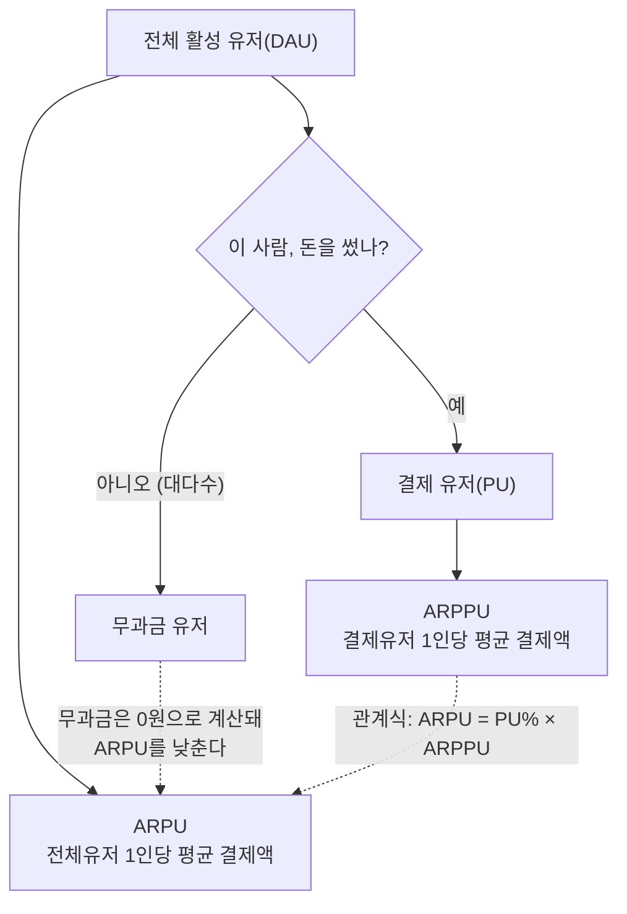
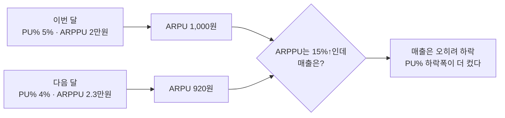
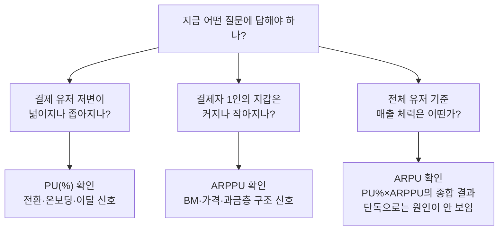

신입 때 일이다. 주간 리포트에 "이번 주 ARPU가 올랐습니다"라고 썼는데, 선임이 "그거 ARPPU 얘기 아니야?"라고 되물었다. 순간 말문이 막혔다. 둘 다 "결제액 평균" 같은 느낌이라 별생각 없이 섞어 쓰고 있었던 거다. 그날 이후로 이 세 지표 — **PU(%), ARPPU, ARPU** — 를 헷갈리지 않고 구분하는 게 습관이 됐다. 이 글은 그 습관을 정리한 입문 가이드다. 게임명이나 실제 수치는 빼고, 개념과 합성 예시로만 설명한다.

먼저 전체 관계부터 그림으로 본다.



## PU(%), ARPPU, ARPU는 정확히 뭘 재는 지표인가?

가게에 비유하면 제일 빨리 이해된다.

- **PU(%)**: Paying User rate. 오늘 가게에 들어온 손님 중 **지갑을 연 손님의 비율**이다. `결제 유저 수 ÷ 전체 활성 유저 수`.
- **ARPPU**: Average Revenue Per Paying User. **지갑을 연 손님만 놓고** 평균 얼마를 썼는지다. `결제 총액 ÷ 결제 유저 수`.
- **ARPU**: Average Revenue Per User. **가게에 들어온 손님 전체를 놓고** 평균 낸 값이다. `결제 총액 ÷ 전체 활성 유저 수`. 안 산 사람도 0원짜리 손님으로 껴서 평균이 낮아진다.

셋을 이어주는 관계식은 하나다.

```
ARPU = PU(%) × ARPPU
```

전체 손님 평균 지출(ARPU)은 결국 "지갑 여는 비율(PU%)"과 "연 사람이 쓰는 액수(ARPPU)"의 곱이라는 뜻이다. 이 식 하나만 외워두면 뒤에 나올 함정들이 다 풀린다.

## 왜 이 세 지표를 자꾸 헷갈리게 되나?

**첫째, 이름이 너무 비슷하다.** ARPPU와 ARPU는 철자 하나(P) 차이인데 뜻은 "결제자만"과 "전체 유저"로 완전히 갈린다. **이름이 아니라 분모(전체 유저인가, 결제 유저뿐인가)를 확인하는 습관**이 필요하다.

**둘째, PU(%)의 분모 자체가 통일돼 있지 않다.** 결제 유저 비율을 낼 때 분모를 그날 접속한 DAU로 잡을 수도, 그달 접속한 MAU로 잡을 수도 있다. 같은 결제자 수라도 분모에 따라 숫자가 크게 달라진다. 그래서 나는 지표를 볼 때 항상 "이 PU%, 분모가 DAU야 MAU야?"부터 확인한다.

## ARPPU가 오르는데 왜 매출은 안 오르나? — 흔한 함정

이게 이 글에서 가장 하고 싶은 얘기다. 아래는 설명을 위한 **가상의 숫자**다.

| 구분 | DAU | PU(%) | ARPPU | ARPU | 매출(DAU×ARPU) |
|---|---|---|---|---|---|
| 이번 달 | 10,000 | 5% | 20,000원 | 1,000원 | 1,000만원 |
| 다음 달 | 10,000 | 4% | 23,000원 | 920원 | 920만원 |

ARPPU만 보면 20,000 → 23,000원, **약 15% 상승**이다. "결제자들이 더 쓴다, 잘 되고 있다"는 인상을 준다. 그런데 실제 매출은 오히려 8% 줄었다. PU(%)가 5%에서 4%로 빠진 폭이 ARPPU 상승분을 잡아먹었기 때문이다.



결제자 수가 줄어드는 와중에 남은 결제자(주로 상위 과금층)의 결제액이 커지면, ARPPU만 보는 사람은 "지표가 좋아졌다"고 착각한다. 결제 유저 저변이 좁아지고 있다는 경고 신호는 PU(%)에만 찍힌다. **ARPPU 단독으로는 절대 판단하면 안 되는 이유**다.

## 그래서 언제 어떤 지표를 봐야 하나?

나는 이렇게 구분해서 본다.



- **PU(%)**: "돈 쓰는 사람이 늘고 있는가." 온보딩·첫 결제 유도 신호.
- **ARPPU**: "이미 돈 쓰는 사람이 더 쓰는가." BM 구성·가격·상위 과금층 구조 신호.
- **ARPU**: 둘을 곱한 **종합 결과**. 전체 체력은 한눈에 보이지만, 이것만으로는 "PU%가 문제인지 ARPPU가 문제인지" 알 수 없다.

합성 스키마로는 세 지표를 한 쿼리에서 같이 뽑아둔다. 그래야 "ARPPU는 올랐는데 ARPU는요?"라는 질문에 쿼리를 다시 돌리지 않고 바로 답한다.

```sql
-- 개념 예시(합성). 실제 스키마 아님.
SELECT
    play_date,
    COUNT(DISTINCT user_id) AS dau,
    CAST(COUNT(DISTINCT CASE WHEN pay_amt > 0 THEN user_id END) AS FLOAT)
        / NULLIF(COUNT(DISTINCT user_id), 0) AS pu_rate,
    SUM(pay_amt) / NULLIF(COUNT(DISTINCT CASE WHEN pay_amt > 0 THEN user_id END), 0) AS arppu,
    SUM(pay_amt) / NULLIF(COUNT(DISTINCT user_id), 0) AS arpu  -- pu_rate * arppu
FROM daily_activity
WHERE play_date = @target_date
GROUP BY play_date;
```

## 정리 — 세 지표는 세트로 봐야 한다

- **PU(%)**: 결제 유저 비율(지갑 연 손님 비중). 분모가 DAU인지 MAU인지 먼저 확인한다.
- **ARPPU**: 결제 유저만의 평균 결제액. 상위 과금층에 좌우돼 단독으로 보면 착시가 생긴다.
- **ARPU**: 전체 유저 기준 평균 결제액. `ARPU = PU% × ARPPU`, 종합 결과일 뿐 원인 진단은 못 한다.
- ARPPU가 오르는데 매출이 빠진다면, 십중팔구 PU(%)가 그 이상으로 빠지고 있다는 뜻이다.

세 지표를 세트로 묶어서 보는 습관이 생기면, 매출을 `DAU × PU% × ARPPU`로 통째로 분해해 KPI 미달 원인을 찾는 진단 모델로 자연스럽게 넘어가게 된다. 다음 글에서는 이 지표들이 신규·복귀·기존 유저 세그먼트별로 얼마나 다르게 움직이는지 더 들어가 본다.

- 방법론·합성 스키마 레시피: [github.com/DBhyeong/game-data-recipes](https://github.com/DBhyeong/game-data-recipes)
