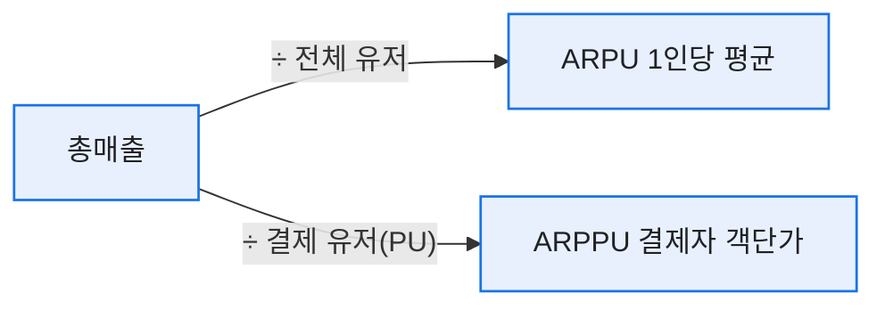
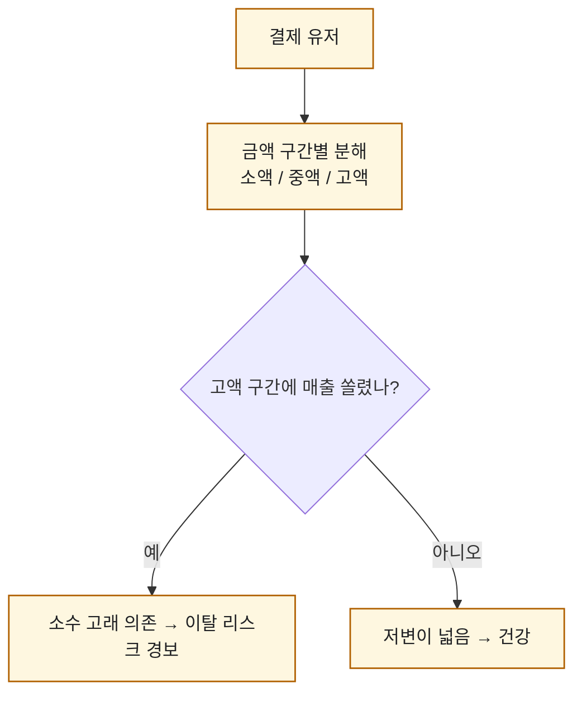
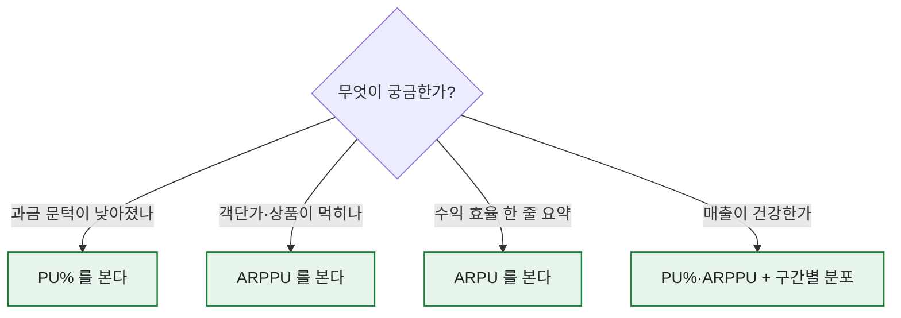

# ARPU vs ARPPU, 무엇을 언제 봐야 하나

> 목표 KPI 미달 상황에서 매출 시뮬레이션을 만들다가, ARPU와 ARPPU를 뭉뚱그려 쓴 탓에 원인을 엉뚱한 데서 찾은 적이 있다. 그날 이후로 나는 이 두 글자짜리 지표 앞에서 절대 서두르지 않는다. 이름은 한 글자 차이인데 성격은 정반대다. (숫자·게임명은 일반화한 합성 기준이다.)

## 두 지표는 분모가 다르다, 그게 전부다

내가 만든 매출 시뮬레이션의 뼈대는 이 한 줄이었다.

```
예상매출 = 예상DAU × PU%(결제 비율) × ARPPU(결제자 객단가)
```

여기서 ARPU와 ARPPU의 차이는 **누구로 나누느냐** 하나뿐이다.



- **ARPU** = 매출 ÷ **전체 활성 유저**. 무과금까지 포함한 평균.
- **ARPPU** = 매출 ÷ **결제 유저**. 지갑 연 사람만의 평균.
- 둘을 잇는 다리가 **PU%**: `ARPU = PU% × ARPPU`.

## 왜 하나만 보면 헛다리를 짚나?

같은 ARPU 상승인데 속이 정반대인 두 시나리오를 합성 수치로 재현해봤다.

| | 이전 | A | B |
|---|--:|--:|--:|
| PU% | 5.0% | 5.0% | **3.0%** |
| ARPPU | 20,000원 | 20,000원 | **40,000원** |
| **ARPU** | 1,000원 | 1,000원 | **1,200원** |

시나리오 B는 ARPU만 보면 "+20%, 성공"이다. 그런데 **결제하는 사람은 줄었고(5%→3%) 남은 소수가 두 배로 쓴** 상황이다. 이게 위험한 이유를 나는 현장에서 뼈저리게 봤다.

## 실제로는 어떻게 쏠림을 잡았나?

한 콘텐츠를 분석할 때, 특정 성장 아이템을 **높은 단계까지 강화한 소수 계정층만** 매출을 떠받치고 있었다. 전체 평균(ARPU)으로 보면 멀쩡한데, 결제 유저를 뜯어보면 그 소수가 이탈하는 순간 매출이 무너질 구조였다. 그래서 나는 ARPPU를 **한 숫자로 보지 않고 금액 구간별로 쪼갰다.**



구간별로 보면 "월 얼마\~얼마 쓰는 층의 재구매가 꺾이는가"까지 추적된다. 실제로 특정 시점 이후 **중간 과금층의 재구매율이 먼저 빠지는** 신호를 이렇게 잡았다(이 재구매율 경보는 뒤 글에서 따로 다룬다).

## 그래서 언제 무엇을 보나?

질문의 종류에 따라 보는 지표를 갈랐다.



- 첫 결제 유도 이벤트 → **PU%** 움직임.
- 신규 고가 상품 → **ARPPU** 움직임.
- 매출의 '건강함' 판단 → 반드시 **둘을 같이, 그리고 구간별로**.

## 구간으로 쪼개면 정확히 무엇이 보이나?

ARPPU를 한 숫자로 두면 '평균 객단가'만 보이지만, 금액 구간으로 쪼개면 **매출의 무게 중심**이 보인다. 나는 결제 유저를 소액·중액·고액으로 나눠 각 구간이 매출의 몇 %를 지는지를 늘 같이 봤다.

| 구간 | 결제 유저 비중 | 매출 기여 |
|---|--:|--:|
| 소액 | 70% | 18% |
| 중액 | 25% | 34% |
| 고액 | 5% | **48%** |

이 표가 말하는 건 명확하다. **결제 유저의 5%가 매출의 절반**을 진다. ARPU가 올라도 이 5%가 흔들리면 매출은 무너진다. 그래서 나는 ARPPU 상승을 볼 때마다 "저변(소액·중액)이 같이 넓어진 건강한 상승인가, 아니면 고액 구간만 두꺼워진 위태로운 상승인가"를 반드시 구분했다.

실무에선 이 구간 자체가 **선행 경보의 축**이 됐다. 총매출이 멀쩡해 보여도 중액 구간의 재구매율이 먼저 빠지면, 몇 주 뒤 고액 구간으로 번지는 패턴을 여러 번 봤다. 평균 뒤에 숨은 이 분포를 놓치면, 매출이 절벽에서 떨어지고 나서야 알게 된다.

## 오늘의 기록

그 매출 시뮬레이션 사건 이후, 나는 매출 리포트에 ARPU 한 줄만 쓰는 걸 그만뒀다. 늘 `PU% × ARPPU = ARPU` 세 칸에 **결제 유저 금액 구간 분포**를 붙여 적는다. 숫자 하나로 결론 내는 순간이 제일 위험하다는 걸, 원인을 엉뚱한 데서 찾던 그날이 가르쳐줬다.

*실제 라이브 게임 매출 분석 경험을 바탕으로 하되, 게임명·수치는 일반화한 합성 기준입니다.*
