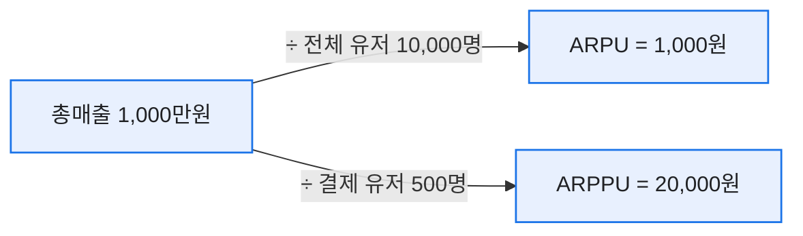
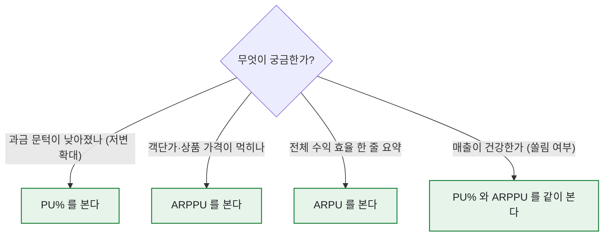

# ARPU vs ARPPU, 무엇을 언제 봐야 하나

> 신입 때 회의에서 "ARPU 올랐으니 이번 업데이트 성공이네요"라고 자신 있게 말했다가, 선배가 "PU%는요?" 하고 되묻는 순간 얼어붙은 적이 있다. 그날 이후로 나는 이 두 글자짜리 지표 앞에서 절대 서두르지 않는다. ARPU와 ARPPU는 이름이 한 글자 차이인데 성격은 완전히 다르다. (아래 숫자는 전부 만든 합성 데이터다.)

## 두 지표는 분모가 다르다, 그게 전부다

정의는 사실 한 줄이면 끝난다. 차이는 **누구로 나누느냐** 하나뿐이다.



- **ARPU** = 매출 ÷ **전체 활성 유저**. 무과금까지 포함한 '한 명당' 평균.
- **ARPPU** = 매출 ÷ **결제 유저(PU)**. 지갑 연 사람만 놓고 본 평균.

둘 사이를 잇는 다리가 **PU%(결제 유저 비율)** 다. 관계식으로 쓰면 이렇게 딱 떨어진다.

```
ARPU = PU% × ARPPU
```

## 왜 하나만 보면 헛다리를 짚나?

내가 실제로 자주 만난 함정을 합성 데이터 두 시나리오로 재현해봤다. 같은 ARPU 상승인데 속은 정반대다.

| | 이전 | 시나리오 A | 시나리오 B |
|---|---|---|---|
| PU% | 5.0% | 5.0% | **3.0%** |
| ARPPU | 20,000원 | 20,000원 | **40,000원** |
| **ARPU** | 1,000원 | 1,000원 | **1,200원** |

시나리오 B는 ARPU만 보면 "+20%, 성공!"이다. 그런데 뜯어보면 **결제하는 사람은 오히려 줄었고(PU% 5%→3%), 남은 소수가 두 배로 쓴** 상황이다. 고래 몇 명에 매출이 쏠리는 건 단기 매출엔 좋아도 장기적으론 위험 신호다. 그 고래가 이탈하면 매출이 절벽처럼 빠지니까.

## 그래서 언제 무엇을 보나?

나는 질문의 종류에 따라 보는 지표를 갈랐다.



- 첫 결제 유도 이벤트를 돌렸다면 → **PU%** 가 움직였는지.
- 신규 고가 상품을 냈다면 → **ARPPU** 가 올랐는지.
- 그리고 매출의 '건강함'을 판단할 땐 → 반드시 **둘을 같이**.

## 오늘의 교훈

그 회의 이후 나는 매출 리포트에 ARPU 한 줄만 쓰는 걸 그만뒀다. 늘 `PU% × ARPPU = ARPU` 세 칸을 같이 적는다. 숫자 하나로 결론 내는 순간이 제일 위험하다는 걸, 얼어붙었던 그 회의가 가르쳐줬다.

*합성 데이터 기준의 개념 설명입니다. 실제 게임·회사 수치와 무관합니다.*
