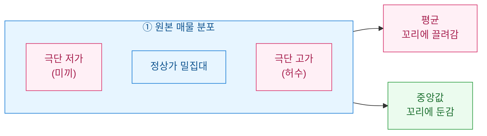
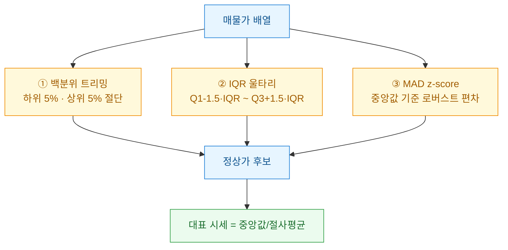
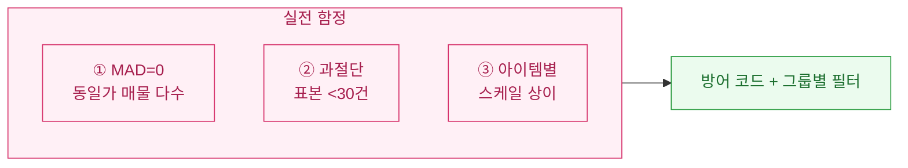

게임 거래소 시세판을 만들다 보면 매번 같은 벽에 부딪힌다. "평균가"를 그냥 `mean()`으로 뽑으면 판이 거짓말을 한다. 누군가 1원짜리 미끼 매물을 걸어두거나, 0 하나 더 붙은 999만 원짜리 허수 매물을 올려두면 평균이 통째로 흔들린다. 오늘은 이 **미끼 매물(bait listing)**을 분포 통계로 걸러내는 클렌징 패턴을 내 방식대로 정리해 둔다.

> 아래는 전부 합성·더미 데이터 기준이며, 특정 게임/거래소나 투자 판단과 무관하다.

## 왜 단순 평균은 시세를 못 잡나?

매물 가격 분포는 대칭이 아니다. 정상가 주변에 두툼하게 몰려 있고, 양쪽 꼬리에 소수의 이상치가 붙는다. 평균은 이 꼬리에 그대로 끌려간다.



| 통계량 | 미끼 매물에 대한 반응 | 시세 대표값으로 |
|---|---|---|
| **평균(mean)** | 이상치 1개에도 크게 흔들림 | 부적합 |
| **중앙값(median)** | 극단값에 거의 안 흔들림 | 안전한 기준선 |
| **절사평균(trimmed mean)** | 꼬리를 자른 뒤 평균 | 실무 추천 |

핵심은 이렇다. **먼저 이상치를 걸러내고, 그다음에 평균을 낸다.** 순서를 바꾸면 이미 오염된 값이 된다.

## 극단값의 경계선은 어떻게 긋나?

경계선을 긋는 방법은 크게 두 갈래다. 하나는 **백분위(percentile)** 로 위아래를 잘라내는 방식, 하나는 **로버스트 통계**로 "정상 범위"를 수학적으로 정의하는 방식이다.



세 방법을 표로 비교하면 성격이 뚜렷하다.

| 방법 | 기준 | 강점 | 약점 |
|---|---|---|---|
| **백분위 트리밍** | 하위/상위 n% 절단 | 직관적, 분포 모양 무관 | 정상 매물 수가 적으면 과절단 |
| **IQR 울타리** | 사분위수 1.5배 | 표준적, 구현 쉬움 | 극단 왜도(skew)엔 느슨 |
| **MAD z-score** | 중앙값 절대편차 | 이상치에 가장 견고 | 임계값 튜닝 필요 |

## 합성 매물가로 필터를 짜보면?

이제 코드로 세 필터를 합쳐 하나의 클렌징 함수로 만든다. `numpy`만으로 충분하다.

```python
import numpy as np

rng = np.random.default_rng(42)
# 정상가 5,000원 근처 밀집 + 미끼(저가) + 허수(고가) 합성
normal = rng.normal(5000, 400, 300)
bait   = rng.uniform(1, 800, 12)        # 극단 저가 미끼
inflated = rng.uniform(30000, 99000, 6) # 0 하나 더 붙은 허수
prices = np.concatenate([normal, bait, inflated])

def robust_fence(x, k=3.5):
    """MAD 기반 로버스트 이상치 마스크 (True=정상)."""
    med = np.median(x)
    mad = np.median(np.abs(x - med))
    if mad == 0:                 # 값이 거의 동일할 때 방어
        return np.ones_like(x, dtype=bool)
    z = 0.6745 * (x - med) / mad # 0.6745 = 정규분포 환산 상수
    return np.abs(z) <= k

def clean_price(x, low=5, high=95, k=3.5):
    lo, hi = np.percentile(x, [low, high])   # 백분위 1차 컷
    m1 = (x >= lo) & (x <= hi)
    m2 = robust_fence(x, k)                   # MAD 2차 컷
    keep = m1 & m2
    return x[keep], keep

clean, mask = clean_price(prices)
print(f"원본 평균   : {prices.mean():8.0f} 원")
print(f"원본 중앙값 : {np.median(prices):8.0f} 원")
print(f"클렌징 평균 : {clean.mean():8.0f} 원  (제거 {(~mask).sum()}건)")
```

실행하면 대략 이런 결과가 나온다.

| 지표 | 값 | 해석 |
|---|---|---|
| 원본 평균 | 약 6,400원 | 허수 고가에 끌려 부풀려짐 |
| 원본 중앙값 | 약 5,000원 | 이미 꽤 견고함 |
| **클렌징 평균** | **약 5,000원** | 미끼·허수 제거 후 정상가 수렴 |

원본 평균과 원본 중앙값의 차이(약 1,400원)가 곧 미끼 매물이 시세판에 심어놓은 왜곡의 크기다. 이 격차가 벌어질수록 "그 시세판은 못 믿는다"는 신호가 된다.

## 실무에서 뭘 더 조심했나?

몇 번 데어보고 얻은 트러블슈팅 노트다.



- **MAD가 0이 되는 경우**: 같은 가격 매물이 절반 이상이면 편차 중앙값이 0이 된다. 위 코드처럼 분기로 막지 않으면 0으로 나누기가 터진다.
- **표본이 적을 때 과절단**: 30건 미만이면 백분위 컷이 정상 매물까지 잘라먹는다. 이럴 땐 백분위 대신 MAD 단독, 혹은 `k`를 넉넉히(예: 5.0) 잡는다.
- **아이템마다 스케일이 다르다**: 소모품과 최상급 장비를 한 배열에 섞으면 안 된다. 반드시 **아이템 ID별 그룹(group-by)조**로 나눠 필터를 돌려야 한다.

결국 미끼 매물 필터의 본질은 "평균을 내기 전에, 무엇이 정상 분포인지부터 정의한다"는 순서 문제였다. 중앙값을 기준점으로 삼고, 백분위와 MAD로 이중 울타리를 치는 것. 이 패턴 하나면 시세판이 훨씬 덜 흔들린다.
