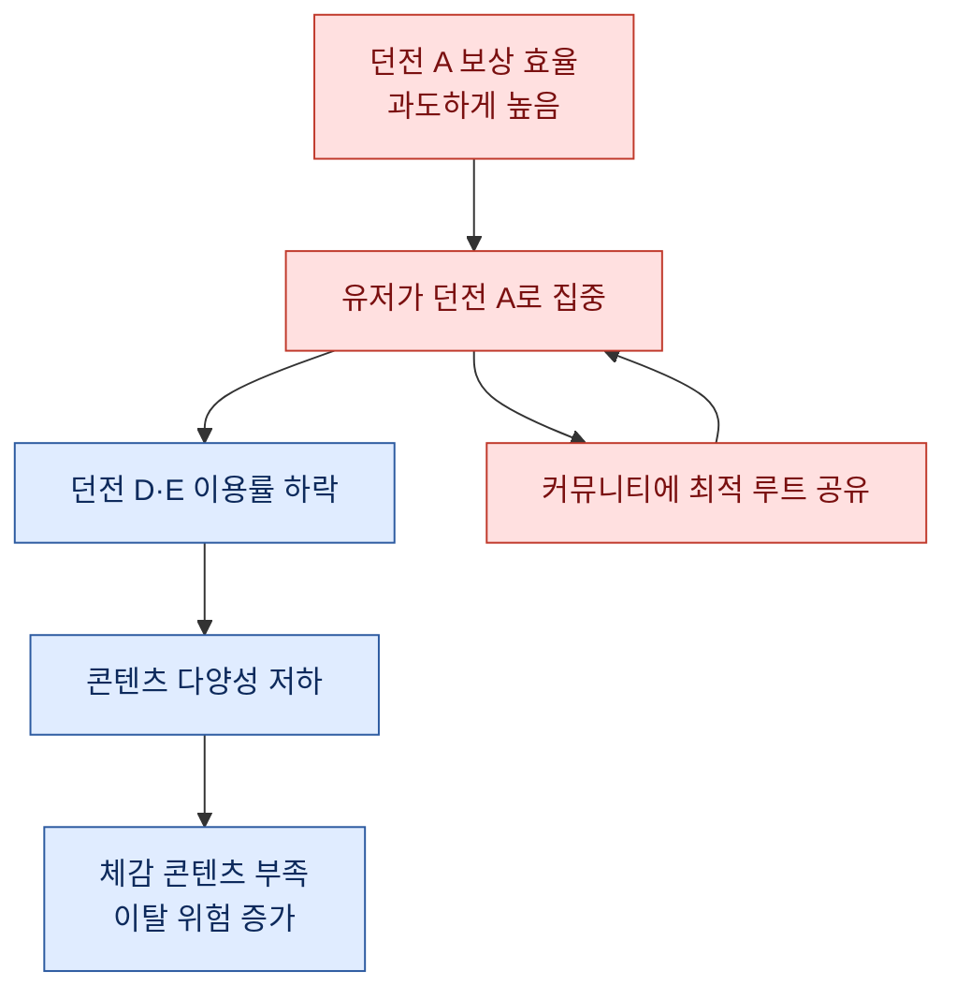
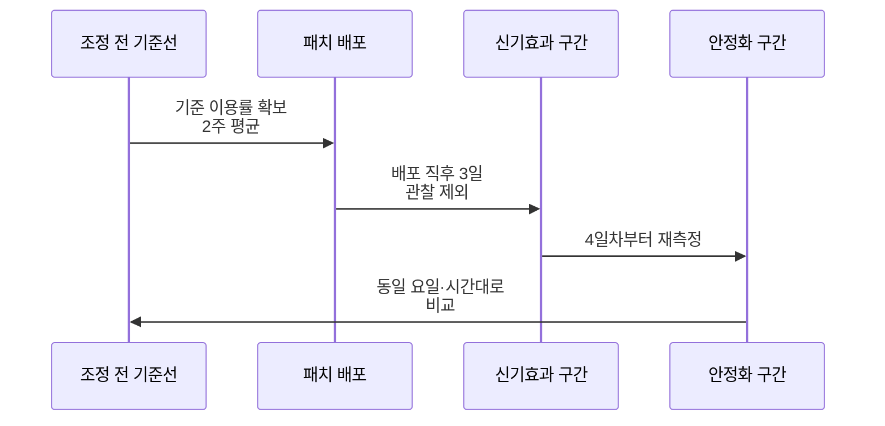
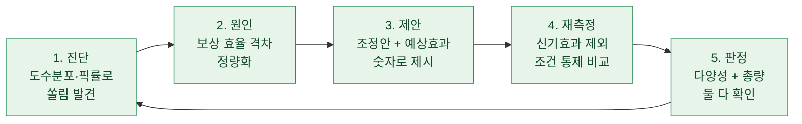

> "이 콘텐츠, 왜 아무도 안 해요?" 라는 기획자의 한마디가 3주짜리 분석 사이클의 출발점이었다.

게임 데이터를 만지다 보면 가장 자주 마주치는 질문이 이거다. 분명 공들여 만든 콘텐츠인데 유저가 거들떠보지 않는다. 반대로 어떤 콘텐츠는 지나치게 붐빈다. 나는 이걸 "쏠림(skew)"이라고 부르는데, 오늘은 이 쏠림을 발견하고, 원인을 파고, 밸런스 조정을 제안한 뒤, 조정 이후 이용률이 실제로 움직였는지 다시 재보는 한 바퀴 전체를 정리해 두려 한다. 참고로 이 글에 나오는 모든 게임명·콘텐츠명·수치는 전부 합성 더미다. 실제 데이터가 아니라, 내가 하던 분석의 방법만 재현했다.

## 그래서 "쏠림"이란 게 뭔데?

쏠림은 유저의 선택이 특정 소수에 몰리는 현상이다. 게임에는 던전이 여럿인데 유저의 90퍼센트가 한두 개만 돈다든가, 캐릭터가 수십 종인데 상위 3종의 픽률(pick rate, 특정 캐릭터를 선택한 판의 비율)이 전체의 절반을 넘어간다든가 하는 식이다.

왜 문제냐고? 콘텐츠를 만드는 데는 비용이 든다. 아무도 안 쓰는 콘텐츠는 그 비용을 회수하지 못한 채 방치되고, 반대로 특정 콘텐츠에 보상이 몰려 있으면 유저는 다양성을 잃고 금방 질린다. 그래서 나는 이용률의 "분포 모양" 자체를 하나의 건강 지표로 본다.

가장 먼저 하는 건 도수분포(frequency distribution)를 그려보는 일이다. 도수분포란 값들을 구간으로 나눠 각 구간에 몇 개가 들어가는지 세는 것이다. 콘텐츠별 진입 횟수를 세서 막대로 세우면, 한쪽 끝만 높이 솟은 그림이 나온다. 그게 바로 쏠림의 지문이다.

| 던전(합성 더미) | 일일 진입 유저 | 전체 대비 비율 |
| --- | --- | --- |
| 던전 A | 48,000명 | 42% |
| 던전 B | 31,000명 | 27% |
| 던전 C | 18,000명 | 16% |
| 던전 D | 9,000명 | 8% |
| 던전 E | 8,000명 | 7% |

이 표를 보자마자 감이 온다. 던전 A와 B가 전체의 약 69퍼센트를 먹고 있고, D와 E는 합쳐도 15퍼센트가 안 된다. 그런데 개발 공수는 다섯 던전이 비슷하게 들었다면? 이건 명백한 낭비 신호다.

## 쏠림은 왜 생기나 — 보상 대비 효율의 문제

여기서 멈추면 "그렇구나"에서 끝난다. 나는 항상 한 겹 더 들어간다. 유저가 특정 콘텐츠에 몰리는 진짜 이유는 대부분 하나로 수렴한다. 시간당 보상 효율이 좋기 때문이다.

유저는 생각보다 합리적이다. 같은 10분을 쓸 거라면 골드든 경험치든 재료든 더 많이 주는 곳으로 간다. 그래서 나는 콘텐츠별로 "투입 시간 대비 기대 보상"을 계산해 나란히 놓는다.

```text
효율 지표 = (평균 획득 보상 가치) / (평균 클리어 소요 시간)
```

이걸 계산해 보면 던전 A의 효율이 다른 던전보다 눈에 띄게 높은 경우가 많다. 유저는 그 사실을 공략 커뮤니티를 통해 이미 알고 있고, 그래서 몰린다. 즉 쏠림은 유저 탓이 아니라 밸런스 설계 탓이라는 얘기다.



위 도식에서 눈여겨볼 건 B에서 F로 갔다가 다시 B로 돌아오는 고리다. 유저들이 최적 루트를 서로 공유하면서 쏠림이 스스로 강화된다. 이런 자기강화 루프는 한번 형성되면 콘텐츠를 아무리 더 찍어내도 풀리지 않는다. 손대야 할 건 새 콘텐츠가 아니라 기존 보상 곡선이다.

## 제안은 어떻게 만드나 — 숫자로 하는 설득

원인을 알았으니 이제 조정안을 만든다. 그런데 여기서 분석가가 흔히 하는 실수가 있다. "던전 A 보상을 너무 많이 주니까 좀 깎자"고 말하는 것이다. 이렇게 말하면 기획자는 방어적이 된다. 자기가 설계한 걸 부정당하는 기분이 드니까.

나는 대신 세 가지를 세트로 들고 간다.

첫째, 현상. 도수분포와 효율 표. "지금 이렇게 쏠려 있습니다."
둘째, 원인 가설. 효율 차이 수치. "이 격차가 원인으로 보입니다."
셋째, 조정 방향과 예상 효과. "D·E의 효율을 A의 90퍼센트 수준까지 올리면, 진입 유저가 대략 이만큼 재분배될 것으로 추정합니다."

셋째가 핵심이다. 나는 조정 전에 반드시 예상 효과를 숫자로 제시한다. 그래야 나중에 재측정할 때 "맞췄는지 틀렸는지"를 판단할 기준이 생긴다. 예측 없는 제안은 검증할 수 없다.

| 항목 | 조정 전 | 제안안 | 근거 |
| --- | --- | --- | --- |
| 던전 A 보상 계수 | 1.00 | 0.90 | 과잉 효율 완화 |
| 던전 D 보상 계수 | 0.55 | 0.80 | 하위 콘텐츠 유인 |
| 던전 E 보상 계수 | 0.50 | 0.80 | 하위 콘텐츠 유인 |
| 예상 A 이용률 | 42% | 34% 내외 | 재분배 시뮬레이션 |
| 예상 D+E 이용률 | 15% | 25% 내외 | 재분배 시뮬레이션 |

숫자를 이렇게 놓으면 대화의 성격이 바뀐다. "네 설계가 틀렸다"가 아니라 "이 다이얼을 이만큼 돌리면 이렇게 될 것 같은데, 어떻게 보세요?"가 된다. 기획자도 데이터 위에서 같이 고민하게 된다.

## 조정 후, 진짜 움직였을까 — 재측정 설계

제안이 반영되어 패치가 나갔다. 이제 가장 중요하고, 동시에 가장 많이들 건너뛰는 단계가 남았다. 재측정이다.

재측정에서 조심할 게 하나 있다. 패치 직후의 숫자를 곧이곧대로 믿으면 안 된다. 신규 밸런스가 나오면 유저들이 "뭐가 바뀌었나" 하고 잠깐 몰려가는 신기효과(novelty effect)가 낀다. 그래서 나는 패치 직후 3일 정도는 관찰 구간에서 빼고, 안정화된 이후 구간을 조정 전과 비교한다.



비교할 때는 요일과 시간대를 맞춘다. 주말과 평일은 이용 패턴이 완전히 다르기 때문에, 조정 전 평일 평균과 조정 후 평일 평균을 견주는 식으로 조건을 통제한다. 이런 사소한 정렬을 안 하면 밸런스 효과인지 요일 효과인지 구분이 안 된다.

## 결과를 읽는 법 — 이용률만 보면 안 된다

재측정 결과가 나왔다. 아래는 합성 더미 예시다.

| 던전 | 조정 전 | 조정 후 | 변화 |
| --- | --- | --- | --- |
| 던전 A | 42% | 33% | 하락 |
| 던전 B | 27% | 26% | 유지 |
| 던전 C | 16% | 17% | 소폭 상승 |
| 던전 D | 8% | 13% | 상승 |
| 던전 E | 7% | 11% | 상승 |

던전 A가 예상대로 내려왔고 D·E가 올라왔다. 예측했던 34퍼센트, 25퍼센트에 근접했다. 분포가 눈에 띄게 평평해졌다는 뜻이다. 여기까지만 보면 성공이다.

그런데 나는 반드시 옆에 하나를 더 놓는다. 전체 활성 유저(DAU)와 핵심 과금 유저의 지표다. 콘텐츠 분포를 고르게 만드는 데 성공했더라도, 그 과정에서 전체 이용 시간이나 과금이 빠졌다면 그건 이긴 게 아니다. 쏠려 있던 던전 A를 너무 세게 눌러서 헤비 유저가 "재미없어졌다"며 이탈하면, 분포는 예뻐졌는데 매출은 나빠지는 웃픈 상황이 벌어진다.

그래서 재측정 대시보드에는 항상 두 축을 같이 둔다. 하나는 다양성(분포가 얼마나 고른가), 다른 하나는 총량(DAU·플레이타임·과금이 유지되는가). 둘 다 지켰을 때만 나는 그 밸런스 조정을 "성공"이라고 부른다.

## 한 바퀴를 닫는다는 것

이 전체 과정을 한 장으로 정리하면 이렇게 된다.



핵심은 마지막 화살표가 다시 1번으로 돌아간다는 점이다. 한 번의 조정으로 끝나는 게 아니다. 재측정 결과가 다음 진단의 기준선이 되고, 또 새로운 쏠림이 관찰되면 다시 돈다. 이래서 나는 이걸 "밸런스 개선 사이클"이라고 부른다. 분석이 보고서 한 장으로 끝나지 않고, 게임의 상태를 계속 추적하며 조금씩 조율하는 루프가 되는 것이다.

## 마무리

밸런스 분석에서 내가 가장 강조하고 싶은 건 두 가지다. 하나, 제안하기 전에 예상 효과를 숫자로 못 박아 둘 것. 그래야 나중에 스스로 채점할 수 있다. 둘, 재측정할 때 이용률 하나만 보지 말 것. 분포를 예쁘게 만드는 데 정신이 팔려 총량을 흘리면 본전도 못 찾는다.

데이터 분석가로서 가장 뿌듯한 순간은 화려한 모델을 돌렸을 때가 아니라, 내가 "이만큼 움직일 것 같다"고 했던 숫자가 실제로 그만큼 움직였을 때다. 예측하고, 개입하고, 다시 재서 맞았는지 확인하는 이 폐루프야말로 분석이 의사결정에 실제로 닿았다는 증거다. 오늘도 나는 대시보드에서 삐죽 솟은 막대 하나를 발견하고, 조용히 이 사이클을 다시 시작한다.

## 참고자료

- [[game-metrics-7-definitions]] — 픽률·이용률 등 기본 지표 정의
- [[retention-curve-beyond-m1]] — 조정 효과를 리텐션 곡선으로 확인하기
- [[arpu-vs-arppu]] — 총량 축을 볼 때 함께 보는 과금 지표
- [[game-data-sql-recipes-retention-ltv]] — 도수분포·집계 SQL 레시피
- game-data-recipes (합성 데이터 레시피 저장소): https://github.com/DBhyeong/game-data-recipes

<!-- 안전: 합성/더미 데이터, 회사·실데이터·PII 없음. -->
