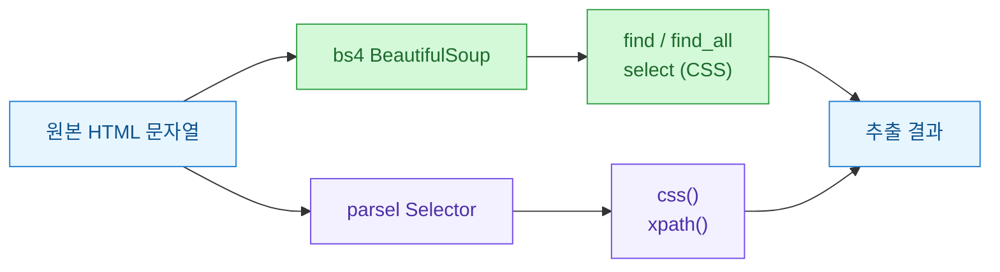
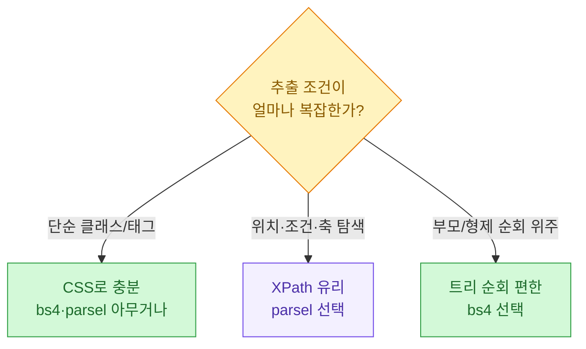
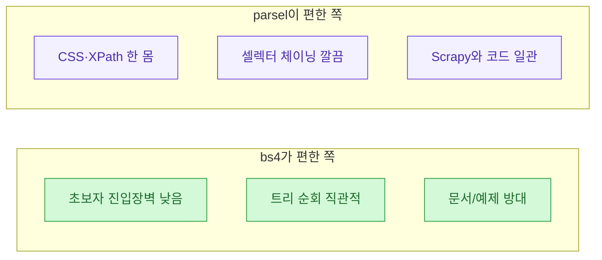
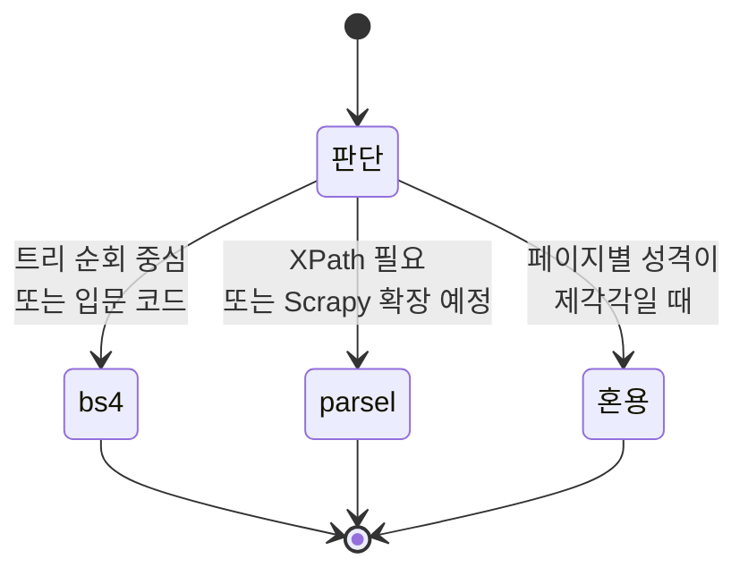

파이썬으로 HTML을 긁다 보면 결국 두 갈림길에서 한 번은 멈추게 된다. **BeautifulSoup(bs4)** 를 계속 쓸 것인가, 아니면 **parsel** 의 `Selector`로 넘어갈 것인가. 나는 어느 날 하나의 연관검색어 수집기 안에서 두 라이브러리를 얼떨결에 같이 쓰게 됐고, 그 덕에 둘의 성격 차이를 몸으로 익혔다. 이 글은 그 회고다.

> 참고: 아래에 나오는 모든 HTML 샘플과 수치는 **합성(더미) 데이터**다. 실제 서비스의 마크업이나 수집 결과가 아니라, 비교를 위해 내가 지어낸 예시라는 점을 먼저 밝혀둔다.

## 애초에 왜 둘을 같이 쓰게 됐나?

처음엔 순수하게 bs4만 썼다. 익숙했으니까. 그런데 수집기가 커지면서 어떤 페이지는 CSS 선택자로, 어떤 페이지는 XPath로 뽑는 게 훨씬 편한 상황이 생겼다. bs4는 XPath를 못 쓴다. 그때 parsel이 눈에 들어왔다. 결국 한 프로젝트 안에 두 파서가 공존하게 됐고, "이거 왜 굳이 두 개지?"라는 질문에 스스로 답하려다 이 비교가 나왔다.



같은 HTML을 넣어도 꺼내는 손잡이가 다르다. bs4는 `find`/`select`, parsel은 `css`/`xpath`. 이 손잡이 차이가 결국 코드 스타일 전체를 가른다.

## 두 라이브러리는 뿌리부터 어떻게 다른가?

한 줄로 요약하면, **bs4는 "문서 트리를 파이썬 객체로 다루는 도구"** 이고 **parsel은 "셀렉터로 조각을 뽑아내는 도구"** 다. bs4는 태그를 객체로 순회하며 `.parent`, `.next_sibling` 같은 트리 탐색이 자연스럽다. parsel은 Scrapy에서 떨어져 나온 만큼 CSS와 XPath 두 문법을 한 몸에 담고, 뽑은 결과를 다시 셀렉터로 이어서 파고드는 체이닝이 강점이다.

| 항목 | BeautifulSoup(bs4) | parsel(Selector) |
| --- | --- | --- |
| 주 사용 문법 | find/find_all, CSS(select) | CSS(css), XPath(xpath) |
| XPath 지원 | 없음 | 있음 |
| 파서 백엔드 | lxml, html.parser 등 선택 | lxml 고정 |
| 트리 순회 | 매우 편함(.parent 등) | 셀렉터 체이닝 중심 |
| 텍스트 추출 | `.get_text()` | `::text` / `.getall()` |
| 뿌리 | 독립 라이브러리 | Scrapy 생태계 |

여기서 갈리는 실질적 포인트는 두 가지다. XPath가 필요한가, 그리고 트리를 이리저리 걸어다녀야 하는가. XPath가 필요하면 parsel, 트리 순회가 많으면 bs4가 편하다.

## 같은 데이터를 뽑으면 코드가 얼마나 달라지나?

말보다 코드다. 아래 합성 HTML에서 각 항목의 키워드와 순위를 뽑아보자.

```python
# 합성(더미) HTML — 실제 서비스 마크업 아님
html = """
<ul class="kw-list">
  <li class="item" data-rank="1"><a class="kw">가상키워드 하나</a><span class="vol">1200</span></li>
  <li class="item" data-rank="2"><a class="kw">가상키워드 둘</a><span class="vol">980</span></li>
  <li class="item" data-rank="3"><a class="kw">가상키워드 셋</a><span class="vol">640</span></li>
</ul>
"""
```

bs4로 뽑으면 이렇다.

```python
from bs4 import BeautifulSoup

soup = BeautifulSoup(html, "lxml")
rows = []
for li in soup.select("li.item"):
    rows.append({
        "rank": int(li["data-rank"]),
        "keyword": li.select_one("a.kw").get_text(strip=True),
        "volume": int(li.select_one("span.vol").get_text(strip=True)),
    })
print(rows)
# [{'rank': 1, 'keyword': '가상키워드 하나', 'volume': 1200}, ...]  (합성 결과)
```

parsel로 같은 걸 뽑으면 이렇다.

```python
from parsel import Selector

sel = Selector(text=html)
rows = []
for li in sel.css("li.item"):
    rows.append({
        "rank": int(li.attrib["data-rank"]),
        "keyword": li.css("a.kw::text").get().strip(),
        "volume": int(li.css("span.vol::text").get().strip()),
    })
print(rows)
# 동일한 합성 결과
```

거의 쌍둥이처럼 보이지만 결이 다르다. bs4는 `select_one(...).get_text()`처럼 "객체를 얻고 → 메서드를 부른다". parsel은 `css("a.kw::text").get()`처럼 "선택자 안에 텍스트 추출(`::text`)까지 넣는다". parsel 쪽이 한 줄에 의도가 더 압축돼 있다. 대신 처음 보면 `::text`, `.get()`, `.getall()` 구분이 낯설다.

## XPath가 필요해지는 순간엔?

bs4만 쓰다가 벽에 부딪히는 전형적 상황이 있다. "이 텍스트를 포함한 요소의 부모의 다음 형제"처럼 조건이 얽힌 탐색이다. CSS만으로는 표현이 어렵거나 지저분해진다. 이럴 때 XPath가 빛난다.

```python
from parsel import Selector

sel = Selector(text=html)
# data-rank가 2 이상인 항목의 키워드만 (합성 예시)
kws = sel.xpath('//li[@data-rank >= "2"]/a[@class="kw"]/text()').getall()
print([k.strip() for k in kws])
# ['가상키워드 둘', '가상키워드 셋']
```

bs4로 같은 조건을 하려면 파이썬 쪽에서 필터를 돌려야 한다. 즉 "선택자로 다 뽑고 → 파이썬 if로 거른다". 틀린 방식은 아니지만, 조건이 복잡할수록 XPath 한 줄이 이기는 경우가 많다.



## 속도는 실제로 차이가 나나?

결론부터. **파싱 속도만 놓고 보면 parsel(=lxml)이 대체로 빠르다.** bs4도 백엔드를 `lxml`로 지정하면 격차가 줄지만, bs4는 그 위에 파이썬 객체 트리를 한 겹 더 쌓기 때문에 대량 반복에서 오버헤드가 붙는다. 다만 이건 "수천\~수만 요소를 반복 파싱"할 때 체감되는 이야기고, 페이지 몇 개 긁는 수준이면 차이는 무의미하다.

아래는 개념을 보여주는 **합성 벤치마크 수치**다. 실제 측정값이 아니라 경향을 설명하려고 내가 지어낸 예시임을 다시 밝힌다.

| 시나리오(합성) | bs4(html.parser) | bs4(lxml) | parsel(lxml) |
| --- | --- | --- | --- |
| 작은 페이지 1건 | 빠름 | 빠름 | 빠름 |
| 중간 페이지 100건 반복 | 보통 | 빠름 | 더 빠름 |
| 큰 페이지 1000건 반복 | 느림 | 보통 | 빠름 |

직접 재보고 싶다면 이런 골격으로 측정하면 된다. 숫자는 각자 환경에서 나오는 걸 믿는 게 맞다.

```python
import time
from bs4 import BeautifulSoup
from parsel import Selector

sample = html * 50  # 합성 HTML을 부풀려 반복 부하 흉내

def bench(fn, n=200):
    t0 = time.perf_counter()
    for _ in range(n):
        fn()
    return round((time.perf_counter() - t0) * 1000, 1)  # 밀리초

def use_bs4():
    soup = BeautifulSoup(sample, "lxml")
    return [li.get_text(strip=True) for li in soup.select("li.item")]

def use_parsel():
    sel = Selector(text=sample)
    return sel.css("li.item::text").getall()

print("bs4   :", bench(use_bs4), "ms (합성)")
print("parsel:", bench(use_parsel), "ms (합성)")
```

핵심은 "parsel이 빠르다더라"를 신봉하지 말고, **내 데이터·내 환경에서 재보는 습관**이다. 병목이 파싱이 아니라 네트워크인 경우가 훨씬 흔하다.

## 가독성과 유지보수는 어느 쪽이 편한가?

이건 취향이 꽤 갈리는 영역이라 내 기준으로만 적는다.



- **bs4**: 처음 크롤링을 배우는 사람에게 권한다. 태그를 객체로 만지고, `.parent`나 `.find_next`로 문서를 걸어다니는 감각이 직관적이다. 검색하면 예제가 산더미라 막혀도 빨리 푼다.
- **parsel**: CSS와 XPath를 오가야 하거나, 나중에 Scrapy로 확장할 가능성이 있다면 처음부터 parsel로 통일하는 게 낫다. 셀렉터 안에서 `::text`, `::attr(href)`로 바로 값을 뽑고 체이닝하는 흐름이 익으면 코드가 짧고 일관된다.

내 결론은 이거였다. **트리를 걸어다니는 로직이 많으면 bs4, 선택자로 값만 정확히 뽑는 로직이 많으면 parsel.** 한 프로젝트에 둘이 섞여 있어도 죄책감 가질 필요는 없더라. 실제로 나도 트리 순회가 필요한 페이지는 bs4로, 조건 탐색이 얽힌 페이지는 parsel로 남겨뒀다.

## 그래서 나는 어떻게 골랐나?

수집기를 정리하면서 세운 아주 단순한 결정 규칙이다.



정답이 하나로 딱 떨어지는 문제는 아니었다. 다만 "왜 이 페이지는 이 파서를 썼는지"를 주석 한 줄로 남겨두니, 몇 달 뒤 내가 다시 볼 때 헷갈리지 않았다. 도구 선택보다 그 기록이 더 오래 남았다.

## 한 줄 요약

- **CSS로 충분하고 트리 순회가 많다** → bs4가 편하다.
- **XPath·조건 탐색이 필요하거나 Scrapy로 갈 것 같다** → parsel이 낫다.
- **속도·수치는 남의 벤치마크 말고 내 데이터로 직접 재라.** (위 표·코드는 전부 합성 데이터다.)
