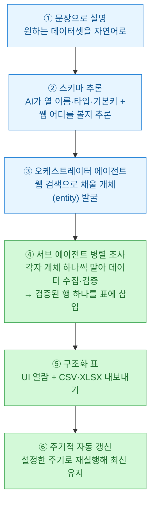
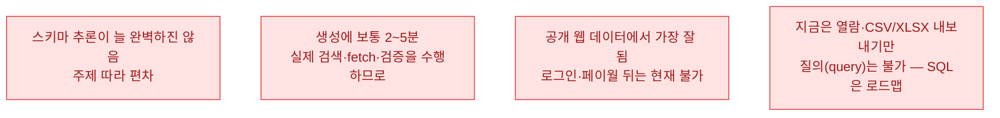
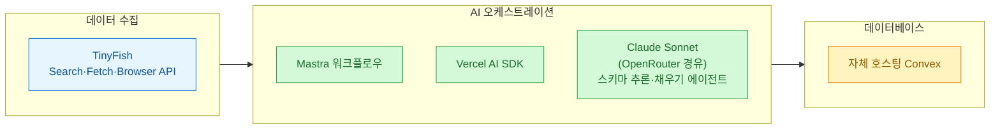

데이터 분석을 업으로 하다 보면 매번 똑같은 잡일에 시간을 태운다 — 여기저기 흩어진 정보를 검색하고, 긁고, 스키마 맞추고, 중복 지우고, 검증하고, 최신 상태 유지하려 크론까지 엮는 일. TinyFish가 낸 **BigSet**(`github.com/tinyfish-io/bigset`, 긱뉴스에서 박정환 님이 소개)은 이 사슬 전체를 **평범한 문장 한 줄**로 접으려는 도구다. 재미있어서 정리해 둔다.

> ⚠️ 먼저 못 박을 것: BigSet은 **실험 단계(experimental)** 프로젝트다. 개발팀 스스로 "잘 될 때도 있지만 거친 부분이 있고, 공개된 채 빠르게 개발해 기능이 깨지거나 바뀔 수 있다"고 밝혔다. TinyFish의 API 위에서 돈다.

## 한 문장으로 뭘 한다는 건가?


원하는 데이터를 **모호하든 구체적이든 평범한 문장**으로 적으면, 자율 에이전트가 살아 있는 웹을 조사해 **검증된 구조화 데이터셋**으로 만들어 준다. 스키마는 알아서 추론하고, 개체를 조사·검증·중복제거한 뒤 표로 돌려준다.

웹엔 가격·회사·채용·연구·재고 같은 데이터가 수백만 페이지에 흩어져 있다. 스크래핑 프레임워크, 검색 API, 사이트별 액터, 리드 생성 플랫폼 — 조각조각은 잘 푸는 도구가 많다. 문제는 **여러 범주를 가로지르는 데이터**가 필요해지는 순간이다. 그때부턴 검색·추출·스키마 설계·중복제거·검증에 최신화 크론까지 매번 손으로 엮어야 한다. TinyFish는 BigSet이 바로 그 간극을 메운다고 설명한다 — **문장이 들어가면 검증된 구조화 데이터가 나오고, 정해둔 주기로 갱신된다.**

## 안에서 어떻게 도나 — 6단계 파이프라인



내가 눈여겨본 대목은 **④번**이다. 오케스트레이터가 개체 목록을 찾으면, 서브 에이전트들이 **병렬로 퍼져 각자 하나의 개체만** 조사해 실제 데이터를 가져오고, **검증한 행 하나**를 표에 꽂는다. '한 방에 큰 표를 뱉는' 게 아니라, **개체 단위로 조사·검증을 분산**하는 구조 — 이게 신뢰도와 확장성을 같이 잡으려는 설계로 읽힌다.

## 어떻게 깔고 쓰나?

로컬 실행엔 **npm 포함 Node.js 22 이상**이 필요하고 Docker는 필요 없다.

```bash
npm install --global @adamexu/bigset
bigset
```

`bigset` 명령이 로컬 릴리스를 내려받아 백엔드·프런트엔드·로컬 자격증명 브릿지를 띄우고 앱 URL을 출력한다. 브라우저에서 `127.0.0.1:3500`을 열면 된다. 첫 실행 땐 설정 화면에서 **두 서비스**를 연결한다.

| 연결 서비스 | 역할 |
|---|---|
| **TinyFish** | 웹 검색 + 페이지 가져오기(fetch) |
| **OpenRouter** | 스키마 추론·에이전트의 LLM 호출 |

로컬 API 키는 **OS 키체인**에 저장된다. 설정이 끝나면 터미널에서 바로 데이터셋을 만들 수 있고, **이 명령들은 Codex나 Claude Code 같은 에이전트도 그대로 호출**할 수 있다.

```bash
# 생성 후 채우기가 끝날 때까지 기다렸다가 CSV로 내보내기
bigset create "fintech startups in the bay area" --rows 10 --wait --csv fintech.csv

bigset list                       # 데이터셋 목록
bigset status <datasetId>         # 상태 확인
bigset export <datasetId> --csv out.csv
```

갱신 주기는 `--cadence manual|30m|6h|12h|daily|weekly`로 지정한다. **"6시간마다 다시 훑어 최신화"** 같은 걸 플래그 하나로 건다는 얘기다.

## 쓰기 전에 알아둘 한계

개발팀이 솔직하게 정리해 둔 걸 그대로 옮긴다.



정리하면, **공개 웹에 데이터가 있는 주제**에서 강하고, 로그인·페이월 뒤는 못 본다. 표를 뽑아 볼 순 있어도 아직 그 안에서 SQL로 질의하진 못한다(로드맵엔 올라 있다).

## 무엇으로 만들었나 — 기술 스택



수집은 TinyFish의 Search·Fetch·Browser API, 오케스트레이션은 **Mastra 워크플로우 + Vercel AI SDK + (OpenRouter 경유) Claude Sonnet**, 저장은 자체 호스팅 **Convex**. 스키마 추론과 행 채우기 에이전트 둘 다 Claude Sonnet이 맡는 게 눈에 띈다.

## 라이선스 — AGPL-3.0은 조심

BigSet은 **AGPL-3.0**으로 공개돼 있다. AGPL은 강한 카피레프트라, **수정한 버전을 네트워크 서비스 형태로 제공하는 경우에도** 이용자에게 그 소스 코드를 공개해야 한다.

> 내 메모: 사내에서 이걸 포크해 SaaS로 감싸 돌릴 생각이면 라이선스를 먼저 따져야 한다. 개인·내부 도구로 CSV 뽑는 용도면 부담이 적지만, 서비스로 노출하는 순간 소스 공개 의무가 딸려 온다. ([[never-publish-company-work|회사 실무는 공개 금지]] 원칙과도 맞물리니, 회사 맥락에선 특히 신중.)

## 내가 본 자리 — '검증된 행'이라는 포인트

비슷한 결의 도구는 많다. 그런데 BigSet에서 내가 산 지점은 **"검증된 행을 개체 단위로 병렬 삽입한다"**는 설계와 **"주기 갱신이 내장"**이라는 점이다. 리드 리스트, 경쟁사 가격표, 채용 현황처럼 **넓게 흩어져 있고 자주 바뀌는 데이터**를 한 번 만들고 방치하는 게 아니라 살아 있게 유지하려는 발상. 실험 단계라 거칠지만, 방향은 [[doc-extraction-toolkit|문서 추출 툴킷]]이나 내가 굴리는 색인 파이프라인과 같은 곳을 본다 — **사람이 긁는 대신, 에이전트가 조사·검증하고 사람은 결과를 판정한다.** 마침 오늘 정리한 [[own-the-outer-loop-human-at-the-boundary|아우터 루프]] 이야기의 데이터 버전인 셈이다.

---

*출처: TinyFish, BigSet — `github.com/tinyfish-io/bigset`. 한국어 소개는 긱뉴스(news.hada.io) 박정환(9bow) 님 글 참조. 데모 영상 `youtube.com/watch?v=ixuOBI9qUnQ`. BigSet은 실험 단계이며 기능·동작은 바뀔 수 있다. 스택·플래그·수치는 공개 문서 기준으로 옮긴 것이다.*
