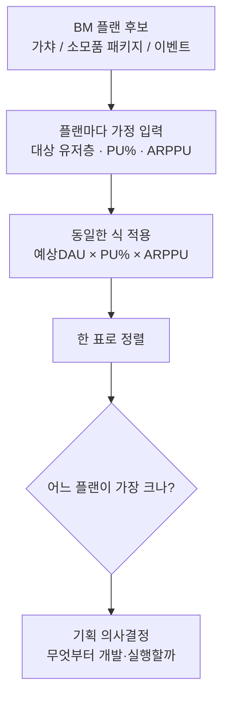
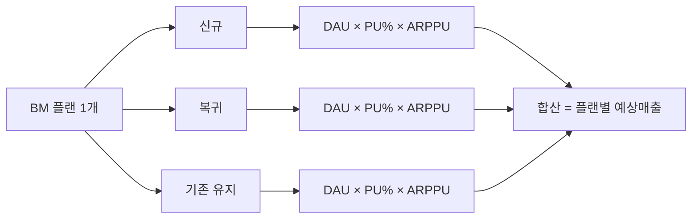
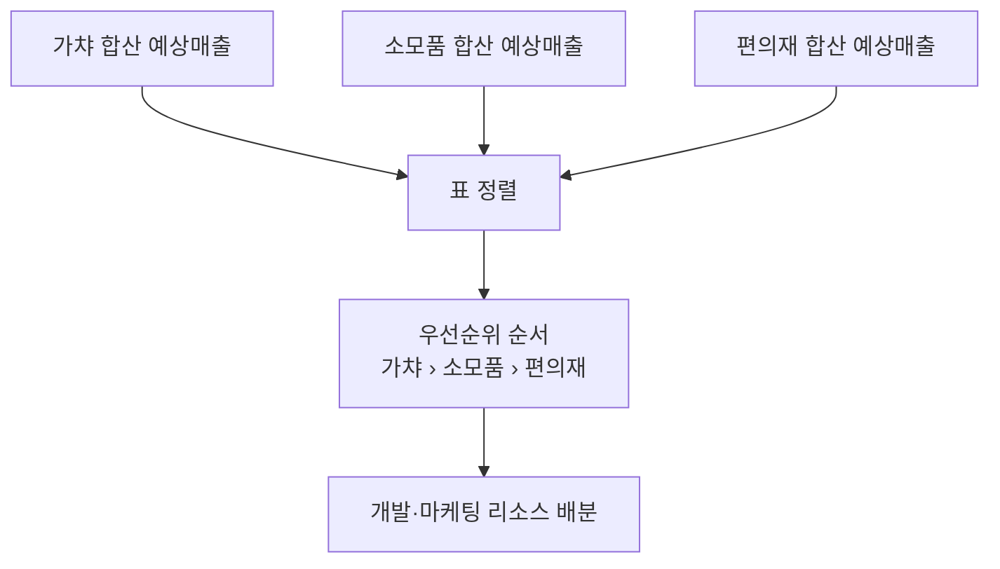

BM(비즈니스모델) 기획 회의를 하면 후보가 늘 여러 개 올라온다. 신규 캐릭터 가챠, 소모품 패키지, 시즌 이벤트 패키지. "이번 분기엔 뭘 먼저 밀까요?"라는 질문에 예전의 나는 감으로 답했다. "가챠가 원래 잘 팔리니까 가챠부터요." 이 감이 항상 틀린 건 아니었지만, 왜 그런지 설명할 근거가 없었다. 근거 없는 우선순위는 기획 회의에서 오래 버티지 못한다.

그래서 방향을 바꿨다. 매출 시뮬레이션 모델(예상매출 = DAU × PU% × ARPPU)을 "이미 벌어진 미달을 진단하는 도구"가 아니라 **아직 실행하지 않은 여러 안을 비교하는 도구**로 뒤집어 쓰기 시작한 것이다. BM 플랜 후보마다 이 곱셈을 따로 돌리고 결과를 한 표에 모으면, 순위가 말이 아니라 숫자로 나온다. (표에 들어가는 금액은 전부 가데이터다. 이 글의 핵심은 특정 액수가 아니라 "표를 만드는 구조"다.)

전체 흐름은 이렇다.

## 왜 BM 플랜을 하나씩 따로 검토하면 안 되나?

BM 기획서는 보통 플랜별로 따로 올라온다. 가챠 기획서엔 "예상 판매량", 패키지 기획서엔 "판매 목표", 이벤트 기획서엔 "참여율 목표"처럼 저마다 다른 단위로 성과를 적어온다. 이걸 그대로 놓고 비교하면 사과와 오렌지를 비교하는 꼴이다. 어느 게 진짜 매출 기여가 큰지 판단할 공통 잣대가 없다.

그래서 플랜이 몇 개든 똑같은 식 하나로 통일했다. **예상매출 = 예상 DAU × PU(%) × ARPPU**. 형식이 다른 기획서라도 "이 플랜이 어떤 유저층을 겨냥하고, 그중 몇 %가 결제하고, 결제한 사람은 평균 얼마를 쓸 것으로 보는가"라는 세 가지 가정만 뽑아내면 같은 틀에 태울 수 있다. 틀이 같아야 표 위에 나란히 놓고 비교할 수 있다.

## 집계표는 어떤 축으로 짜야 하나?

표의 세로축은 BM 플랜, 가로축은 앞의 세 변수다. 여기서 매출 시뮬레이션 모델을 쓰며 배운 습관을 그대로 가져왔다. 플랜 하나를 유저층(신규 / 복귀 / 기존 유지)별로 쪼개 각각 계산한 뒤 합산하는 것이다. 같은 가챠라도 신규 유저와 기존 유지 유저의 PU%·ARPPU 가정은 다르기 때문에, 뭉뚱그려 계산하면 오차가 커진다.

실제로 만들던 표를 단순화하면 이런 모양이다.

| BM 플랜 | 대상 유저층 | 예상 DAU | PU(%) | ARPPU(가데이터) | 예상매출(가데이터) |
|---|---|---|---|---|---|
| 가챠(신규 캐릭터) | 기존 유지 | 10,000 | 8% | 45,000 | 36,000,000 |
| 가챠(신규 캐릭터) | 복귀 | 3,000 | 5% | 30,000 | 4,500,000 |
| 소모품 패키지 | 기존 유지 | 10,000 | 15% | 8,000 | 12,000,000 |
| 소모품 패키지 | 신규 | 4,000 | 6% | 5,000 | 1,200,000 |
| 편의재(스킵권 등) | 전체 | 15,000 | 20% | 3,000 | 9,000,000 |
| 이벤트 한정 패키지 | 신규+복귀 | 7,000 | 10% | 12,000 | 8,400,000 |

실제 표는 이보다 행이 훨씬 많다. 위는 표를 어떤 축으로 짜는지 보여주기 위한 가데이터일 뿐, 실제 금액과는 무관하다.

## "가챠 > 소모품 > 편의재" 순위는 표에서 어떻게 드러나나?

플랜별로 유저층 행을 합산하면 순위표가 나온다.

| 순위 | BM 플랜 | 합산 예상매출(가데이터) | 비중 |
|---|---|---|---|
| 1 | 가챠(신규 캐릭터) | 40,500,000 | 약 57% |
| 2 | 소모품 패키지 | 13,200,000 | 약 19% |
| 3 | 편의재(스킵권 등) | 9,000,000 | 약 13% |
| 4 | 이벤트 한정 패키지 | 8,400,000 | 약 11% |

이건 가상의 예시지만, 실제 라이브 서비스에서도 똑같은 순서를 본 적이 있다. 만렙 개방 이후 접속·과금 이탈을 들여다보던 BM 분석에서, 과금 우선순위는 **가챠 > 소모품 > 편의재** 순이었고 가챠가 매출에서 차지하는 비중이 압도적으로 컸다. 이 우선순위를 근거로 이벤트 전략을 다시 짰고, 그 결과 동남아 지역 상반기 목표 KPI 매출을 **약 113% 초과 달성**했다. 표가 없었다면 "가챠부터 밀자"는 결정은 여전히 감이었을 것이다.

## 표를 만든 다음엔 뭘 하나?

표를 근거로 우선순위를 정하고 실행했다고 끝이 아니다. 실행 후에는 반드시 실측 DAU·PU%·ARPPU를 다시 넣어 가정치와 얼마나 벌어졌는지를 확인했다. 가정이 항상 맞을 리 없다. 특히 신규 패키지는 처음 붙이는 가격이라 ARPPU 가정이 자주 빗나갔고, 그 오차만큼 다음 분기 표의 가정치를 보정했다.

여기서 지난 글의 진단 모델과 이 글의 비교표는 같은 도구를 시점만 바꿔 쓴 것임을 다시 짚고 싶다. 지난 글에서는 곱셈식을 **이미 벌어진 매출 미달을 사후에 진단**하는 데 썼다. 이번 글에서는 같은 식을 **아직 실행하지 않은 여러 안을 사전에 비교**하는 데 썼다. 진단과 비교, 방향은 반대지만 뼈대는 하나다.

## 정리 — 표는 답을 주지 않는다, 비교 근거를 준다

- BM 플랜이 여럿이면 형식을 통일해야 비교가 된다. 공통 틀은 **예상매출 = DAU × PU% × ARPPU**.
- 플랜 하나도 **유저층별(신규/복귀/기존)로 쪼개 합산**해야 오차가 줄어든다.
- 합산 후 정렬하면 "가챠 > 소모품 > 편의재" 같은 우선순위가 감이 아니라 숫자로 나온다.
- 표는 결정을 대신 내려주지 않는다. 다만 **어느 안이 왜 우선인지 설명 가능한 근거**를 만들어준다.
- 실행 후 실측치로 가정을 보정하는 루프까지 돌려야 다음 표의 정확도가 올라간다.

AI가 표 서식이나 합산 함수는 순식간에 만들어준다. 하지만 "어떤 축으로 쪼개야 비교가 되는지", "어느 가정이 틀렸을 때 무엇을 의심해야 하는지"는 여전히 도메인 안에서 굴러본 사람의 판단이다. 다음 글에서는 이렇게 실행한 플랜의 실측치를 다시 넣어 가정치(PU%·ARPPU)를 보정하는 방법을 정리한다.

- 방법론·합성 스키마 레시피: [github.com/DBhyeong/game-data-recipes](https://github.com/DBhyeong/game-data-recipes)
