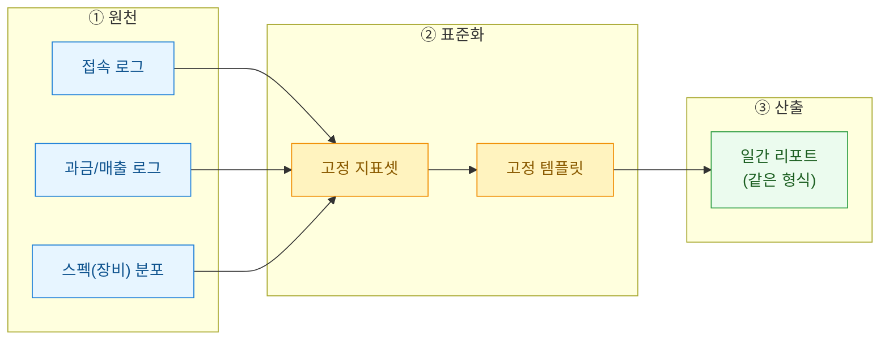
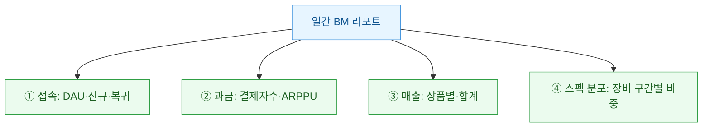
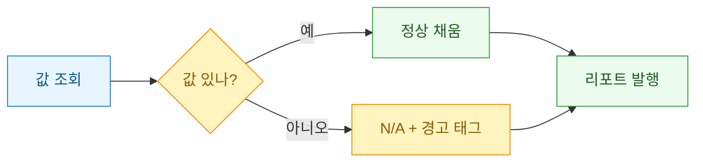

> 공개·더미 데이터 기준의 기록이며, 투자권유나 회계판단이 아니다. 등장하는 수치는 전부 합성값이다.

매일 아침 같은 리포트를 손으로 만들다 보면 어느 순간 이런 생각이 든다. "이거, 어제 만든 거랑 뭐가 다르지?" 숫자만 바뀌고 뼈대는 늘 똑같다. 나는 그 뼈대를 아예 **템플릿(template)**으로 굳혀버리기로 했다. 이 글은 일간 **BM(Business Model, 수익 구조)** 리포트를 표준 템플릿으로 자동 생성하게 만든 과정의 일기다.



## 왜 리포트를 손으로 만들면 안 되나?

손으로 만드는 리포트의 진짜 비용은 시간이 아니라 **일관성(consistency)**이다. 어제는 매출을 위에 뒀는데 오늘은 접속을 위에 두면, 읽는 사람이 매번 눈으로 위치를 다시 찾는다. 지표 정의가 조금씩 흔들리면 추세 비교 자체가 무너진다.

| 항목 | 수기 리포트 | 표준 템플릿 |
| --- | --- | --- |
| 지표 순서 | 그날 기분대로 | 항상 고정 |
| 지표 정의 | 미묘하게 변동 | 한 곳에서 관리 |
| 소요 시간 | 30~40분 | 1~2분(실행) |
| 비교 가능성 | 낮음 | 높음 |

핵심은 하나다. **리포트는 창작물이 아니라 제품(product)이다.** 매일 같은 규격으로 나와야 신뢰가 쌓인다.

## 무엇을 고정 지표로 박을까?

먼저 "매일 반드시 본다"는 지표만 골라 순서를 못 박았다. 이걸 흔들지 않는 게 표준화의 절반이다.



- **DAU(Daily Active Users)**는 하루 접속한 순수 이용자 수다. 여기에 신규·복귀를 붙여 "새로 온 사람 대 돌아온 사람"을 본다.
- **ARPPU(Average Revenue Per Paying User)**는 결제자 1인당 평균 매출이다. 매출이 늘어도 이 값이 떨어지면 "얇게 많이" 결제한 것이라 성격이 다르다.
- **스펙 분포**는 이용자 장비를 성능 구간으로 나눈 비중이다. 저사양 비중이 크면 그래픽 옵션·과금 상품 설계가 달라진다.

## 템플릿은 어떻게 매일 같은 형식으로 찍히나?

지표를 정했으니, "쿼리 → 값 → 문장/표"로 이어지는 파이프라인을 고정했다. 각 지표마다 담당 쿼리 하나가 값을 뱉고, 템플릿의 정해진 자리에 그대로 꽂힌다.

```sql
-- 더미: 일간 접속 지표 (합성 테이블)
SELECT
  stat_date,
  COUNT(DISTINCT user_id)                          AS dau,
  COUNT(DISTINCT CASE WHEN is_new  THEN user_id END) AS new_users,
  COUNT(DISTINCT CASE WHEN is_back THEN user_id END) AS return_users
FROM dummy_access_log
WHERE stat_date = '2026-07-12'
GROUP BY stat_date;
```

값이 준비되면 파이썬 쪽에서 **딕셔너리(dict)**에 담아 문자열 템플릿에 채워 넣는다. 리포트 뼈대는 코드 안에 한 번만 정의하고, 매일 값만 갈아끼운다.

```python
# 더미 값으로 고정 템플릿 채우기
metrics = {
    "date": "2026-07-12",
    "dau": 18240, "new": 1120, "back": 2340,
    "payers": 940, "arppu": 15200,   # 단위: 원
    "rev_total": 14288000,           # 단위: 원
}

TEMPLATE = """\
[일간 BM 리포트] {date}
1) 접속  DAU {dau:,} (신규 {new:,} / 복귀 {back:,})
2) 과금  결제자 {payers:,}명 · ARPPU {arppu:,}원
3) 매출  합계 {rev_total:,}원
"""

print(TEMPLATE.format(**metrics))
```

포인트는 **뼈대와 값의 분리**다. 형식을 바꾸고 싶으면 `TEMPLATE` 한 곳만 고치면 전 기간 리포트가 같은 규격으로 따라온다.

## 표준화하며 밟은 지뢰는?

자동화의 진짜 난이도는 "값이 없는 날"에 있었다. 실행하며 겪은 트러블을 표로 남긴다.

| 증상 | 원인 | 대응 |
| --- | --- | --- |
| 특정 지표가 공란 | 원천 로그 적재 지연 | 값 없으면 `N/A` 고정 출력, 리포트는 계속 생성 |
| 매출은 있는데 ARPPU 폭등 | 결제자수 0 나눗셈 | 분모 0이면 0 처리 후 경고 태그 |
| 스펙 분포 합이 100 초과 | 중복 세션 집계 | `DISTINCT user_id`로 사용자 단위 고정 |

교훈은 분명했다. **리포트는 절대 멈추면 안 된다.** 한 지표가 비어도 나머지는 나와야 하고, 비었다는 사실 자체가 리포트에 드러나야 한다. 그래서 "실패 시 중단"이 아니라 "실패 표기 후 계속"을 원칙으로 잡았다.



## 남은 이야기

템플릿을 굳히고 나니 리포트 만드는 일이 "쓰는 일"에서 "실행하는 일"로 바뀌었다. 30분 걸리던 작업이 클릭 한 번이 됐고, 아낀 시간은 숫자를 **읽고 해석하는 쪽**으로 돌아갔다. 표준화의 목적은 애초에 이거였다. 반복은 기계에게, 판단은 사람에게. 다음 단계로는 이 일간 리포트를 주간 요약으로 자동 롤업하는 흐름을 붙여볼 생각이다.
