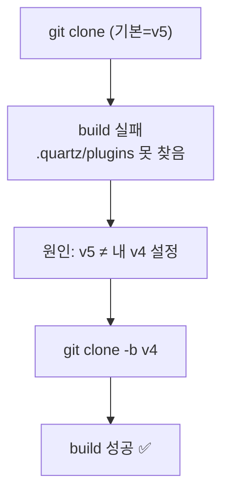

티스토리도 있고 네이버 블로그도 있다. 그런데 또 블로그를 만들었다. 이유는 하나였다 — **마크다운 파일 한 장 떨구고 `push`하면 끝나는 구조**가 갖고 싶었다.

평소 내 지식은 전부 `.md`로 쌓인다. 그걸 매번 티스토리 에디터에 다시 붙여넣고 서식을 잡는 게 늘 아까웠다. "쓰는 곳"과 "올리는 곳"이 같으면 안 되나? 그래서 **Quartz**로 정적 사이트를 만들어 GitHub Pages에 올리기로 했다. 결론부터 말하면, 지금 이 글을 읽고 있는 사이트가 그 결과물이다.

## 전체 그림 — 글 한 장이 사이트가 되기까지

먼저 큰 흐름부터. 내가 하는 일은 **왼쪽 끝 하나뿐**이고, 나머지는 자동이다.


> **정적 사이트 생성기(SSG)**란? 글(마크다운)을 미리 **완성된 HTML 파일들로 구워두는** 도구다. 방문자가 올 때마다 서버가 계산하는 워드프레스(동적)와 달리, **이미 구워진 파일만 보여주니** 빠르고, 서버도 공짜(GitHub Pages)다. 검색엔진도 좋아한다.

## 왜 Quartz였을까?

후보는 많았다 — Jekyll, Hugo, Astro… 그런데 Quartz를 고른 이유는 명확했다.

- **마크다운 네이티브 + Obsidian 스타일** `[[위키링크]]`. 내가 이미 그렇게 글을 쓴다. 옮길 필요가 없다.
- **그래프뷰·백링크·전체검색·태그**가 기본 제공. 지식이 서로 연결되는 "가든" 형태가 된다.
- **0원**. GitHub Pages + GitHub Actions로 호스팅·빌드까지 무료.

즉 나에겐 "새 도구를 배우는 것"이 아니라 "**원래 쓰던 마크다운을 그대로 웹에 띄우는 것**"에 가까웠다. ([[reading/index|읽을거리 가든]]이 그 결과다.)

## 어떻게 세팅했나?

핵심은 세 덩어리다. **엔진(Quartz) + 내 콘텐츠(content/) + 자동배포(Actions).**

```bash
# 1) Quartz 받기  ⚠️ 반드시 v4 브랜치 (이유는 아래)
git clone -b v4 https://github.com/jackyzha0/quartz.git
cd quartz && npm i

# 2) 로컬 미리보기 (URL 만들기 전에 먼저 본다)
npx quartz build --serve   # → http://localhost:8080
```

콘텐츠 폴더는 이렇게 잡았다. **폴더가 곧 사이트 구조**가 된다.

```
content/
├─ index.md        # 홈/랜딩
├─ about.md        # 소개
├─ blog/           # 기술 글 (태그로 분류)
│  └─ *.md
└─ reading/        # 읽을거리 가든
```

설정(`quartz.config.ts`)에서 제목·도메인·**한글 폰트**를 잡아준다. (한글 가독성이 안 잡히면 본문이 시스템 폰트로 깨져 보인다 — 이게 의외로 중요했다.)

```ts
configuration: {
  pageTitle: "Hyeong · 데이터·마케팅·개발 제너럴리스트",
  baseUrl: "dbhyeong.github.io",
  theme: {
    typography: { header: "Noto Sans KR", body: "Noto Sans KR", code: "IBM Plex Mono" },
  },
}
```

마지막으로 **GitHub Actions 배포 워크플로**(`.github/workflows/deploy.yml`). `main`에 push하면 알아서 빌드→배포한다.

```yaml
on:
  push: { branches: [main] }
jobs:
  build:
    runs-on: ubuntu-22.04
    steps:
      - uses: actions/checkout@v4
        with: { fetch-depth: 0 }
      - uses: actions/setup-node@v4
        with: { node-version: 22 }
      - run: npm ci
      - run: npx quartz build        # md → public/ (html·sitemap·rss)
      - uses: actions/upload-pages-artifact@v3
        with: { path: public }
  deploy:
    needs: build
    runs-on: ubuntu-22.04
    steps: [ { uses: actions/deploy-pages@v4 } ]
```

GitHub repo에서 **Settings → Pages → Source: "GitHub Actions"** 만 켜주면, 이후엔 push할 때마다 자동이다.

## v5에서 왜 한 번 엎었나?

여기서 첫 삽질. 아무 생각 없이 `git clone`(기본 브랜치)을 받았더니 **Quartz v5**가 받아졌고, 빌드가 이렇게 죽었다.

```
X [ERROR] Could not resolve "../../.quartz/plugins"
Failed to build Quartz.
```

v5는 설정 체계가 달라서, 내가 준비한 v4용 `quartz.config.ts`와 안 맞았던 것이다. 한참 헤매다 결론은 단순했다 — **`-b v4`로 브랜치를 고정**해서 다시 받는 것.



교훈: **"최신"이 항상 정답은 아니다.** 안정 버전(v4)에 맞춰 도구 전체를 정렬하는 게 빨랐다.

## 디스크가 꽉 차서 빌드가 멈췄을 때는?

두 번째 삽질. 빌드 도중 `ENOSPC: no space left on device`. 확인해보니 C 드라이브가 **100% (여유 24MB)**. 범인은 엉뚱한 곳에 있었다.

```bash
npm config get cache      # → ...\npm-cache  (무려 5.8GB!)
npm cache clean --force   # 안전하게 비움 → 6GB 확보
```

`node_modules`는 빌드 때마다 다시 깔면 되니(`npm ci`), 로컬 용량이 빠듯하면 지워도 된다. **빌드는 어차피 GitHub Actions(클라우드)가 대신 해주니까** 로컬은 가벼워도 된다.

## 글은 어떻게 발행되나?

세팅이 끝난 뒤의 일상은 정말 단순해졌다.


```bash
# 새 글 발행 = 이 세 줄
git add -A
git commit -m "새 글: ..."
git push
```

`sitemap.xml`·RSS·태그 페이지·구조화데이터까지 빌드 때 **자동 생성**된다. 내가 신경 쓸 건 마크다운 본문뿐이다. (이 "마크다운만 쓰면 끝" 감각이, 처음에 원했던 바로 그거였다.)

## 배운 점

블로그 플랫폼을 또 만든 게 사치처럼 보일 수도 있다. 하지만 **"쓰는 형식(.md)과 올리는 형식(.md)을 같게" 만든 순간**, 글을 쓰는 마찰이 확 줄었다. 도구 하나를 바꾼 게 아니라 **워크플로 전체를 한 줄로 정렬**한 셈이다.

이 사이트는 그 자체로 이 글의 데모다. 다음 글에서는 이렇게 만든 사이트에 **검색엔진과 GA4를 붙여 "측정 가능한" 블로그로 만든 과정**([[ga4-gtm-indexnow-seo-setup|GA4·GTM·IndexNow로 SEO 셋업한 기록]])을 정리한다. 그리고 이 모든 마크다운이 어디서 왔는지 — [[plaintext-md-llm-knowledge-vault|벡터DB 없이 만든 평문 MD 지식볼트]] 이야기와도 이어진다.

> 같이 보면 좋은 글: [[pymssql-korean-encoding-mssql|pymssql 한글 인코딩 추적기]] · 내 소개는 [[about]].

---

*이 블로그는 Quartz v4 + GitHub Pages로 만들어졌고, 위 설정·삽질은 전부 실제 구축 과정 그대로입니다. 환경(노드 버전·OS)에 따라 세부는 다를 수 있어요.*
