처음에는 단순히 "영상 하나를 쇼츠 몇 개로 자르면 되겠지"라고 생각했다. 그런데 막상 해 보니 핵심은 자르는 일이 아니었다. **MP4 안의 말소리를 어떻게 자막 구조로 바꾸고, 그 자막 타임라인을 깨지 않은 채 문장만 고쳐서 다시 영상에 태우느냐**가 전부였다.

이번 작업에서 제일 중요한 축은 Vrew였다. Vrew가 먼저 영상을 읽고, 자동 자막을 만들고, 자막 클립을 장면 단위로 나눠 줬다. 나는 그 결과를 SRT로 꺼낸 뒤, **시간값은 그대로 두고 텍스트만 고쳤다.** 그리고 그 SRT와 Vrew의 `sceneId` 구조를 기준으로 1분짜리 쇼츠 8개를 만들었다.

공개 글이라 내 실제 로컬 사용자 경로와 긴 원본 파일명은 `$PROJECT`와 `source.mp4`로 줄여 적는다. 실제 작업 루트는 `codex_capcut` 폴더였고, 구조는 아래와 같았다.

## 전체 과정은 어떻게 흘러갔나?

큰 흐름은 이랬다. 영상 파일을 먼저 확보하고, CapCut과 Vrew가 그 영상을 어떻게 저장하고 쪼개는지 확인한 다음, SRT를 사람이 읽을 수 있는 문장으로 정리하고, 마지막에 ffmpeg로 쇼츠를 구웠다.

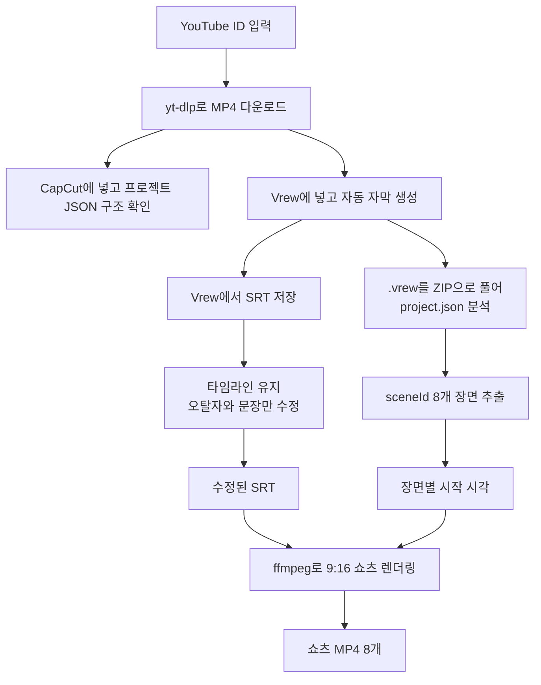

이 흐름에서 내가 계속 붙잡고 있던 원칙은 하나였다.

```text
영상 컷 기준은 Vrew의 sceneId
자막 표시 기준은 수정된 SRT
자막 시간 기준은 원본 타임라인 그대로
```

SRT는 자막 파일이다. 쉽게 말하면 `시작 시간 - 끝 시간 - 화면에 띄울 문장`을 순서대로 적어 둔 텍스트 파일이다. 그래서 텍스트만 고치면 말투와 오탈자는 좋아지지만, 시간을 건드리면 영상과 입 모양이 틀어진다. 이번 작업에서는 **타임코드는 절대 보존하고, 문장만 다듬는 방식**으로 갔다.

## YouTube MP4는 어떻게 내려받았나?

먼저 YouTube ID 하나를 기준으로 MP4를 받는 스크립트를 만들었다. 매번 명령을 길게 치기 싫어서 Python 스크립트와 BAT 실행 파일을 나눴다.

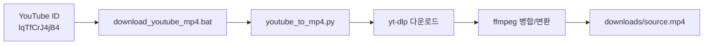

만든 파일의 역할은 이렇게 나눴다.

| 파일 | 역할 |
|---|---|
| `youtube_to_mp4.py` | YouTube ID나 URL을 받아 `yt-dlp`로 영상 다운로드, ffmpeg 탐색, MP4 병합/변환 |
| `download_youtube_mp4.bat` | Windows에서 Anaconda Python을 고정해 쉽게 실행 |

실행은 이런 식이다.

```powershell
cd $PROJECT
.\download_youtube_mp4.bat lqTfCrJ4jB4
```

확인된 원본 영상은 약 21분 9초였다. 이 파일 하나가 이후 CapCut 확인, Vrew 자동 자막, 쇼츠 렌더링의 기준 원본이 됐다.

## CapCut 프로젝트는 어디에 무엇을 저장하나?

사용자가 CapCut에 MP4를 넣은 뒤, 나는 "CapCut 프로젝트가 실제로 무엇으로 저장되는지"부터 확인했다. 여기서 처음 착각이 풀렸다. CapCut 프로젝트는 `.mp4` 같은 단일 파일이 아니었다.

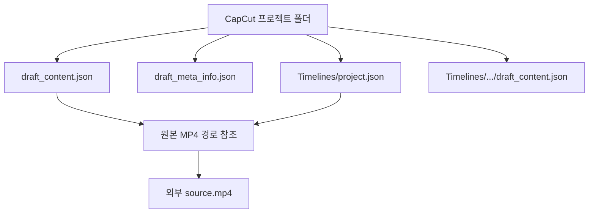

중요한 결론은 이거였다.

| 확인한 것 | 결론 |
|---|---|
| 프로젝트 저장 방식 | 폴더와 JSON 묶음 |
| 원본 MP4 보관 방식 | 프로젝트 안에 완전 복사되지 않고 외부 경로를 참조 |
| 최종 영상 파일 | 프로젝트 저장과 별개로 Export가 필요 |
| 트랙 구조 | video 1개, text 468개, audio 2개가 확인됨 |

이걸 확인해 둔 이유는 단순하다. 원본 MP4를 옮기거나 지우면 CapCut에서 미디어가 깨질 수 있다. CapCut의 프로젝트 JSON은 **편집 정보**이지, 완성 MP4가 아니다.

## Vrew에서 SRT는 어떻게 가져왔나?

이번 작업에서 제일 중요했던 부분이다. 나는 Vrew를 "자막을 사람이 고치기 쉽게 구조화해 주는 도구"로 썼다.

흐름은 이렇다.

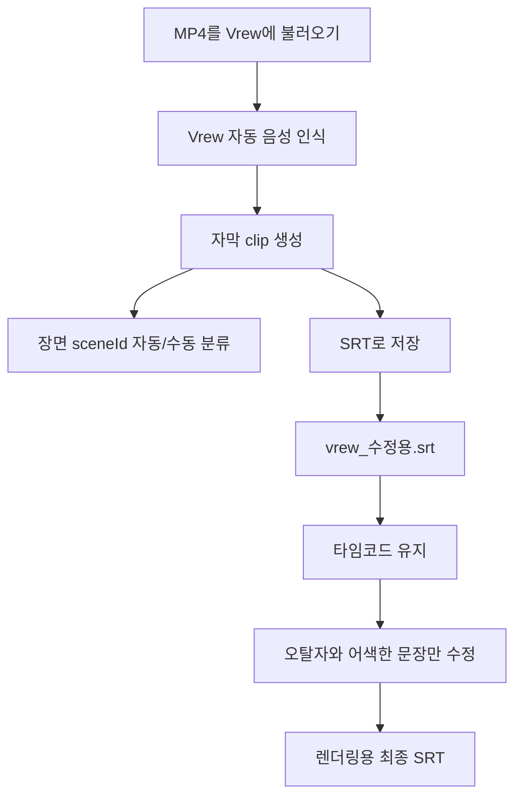

여기서 핵심은 **Vrew가 미리 구조화해 준다는 것**이다. 사람이 처음부터 21분짜리 영상을 보고 "여기서 자르고, 여기서 자막을 넣고"를 하지 않아도 된다. Vrew가 먼저 음성을 단어와 자막 클립으로 나누고, 장면 이름과 `sceneId`까지 갖고 있었다.

나는 Vrew에서 자동 자막을 가져와 SRT로 저장한 뒤, 이 파일을 고쳤다. 고친 건 문장뿐이다.

```text
타임라인: 그대로 둠
cue 개수: 그대로 유지
문장: 오탈자, 띄어쓰기, 어색한 자동인식 표현만 수정
```

예를 들면 이런 식이었다.

| 자동 인식/초안 | 수정 방향 |
|---|---|
| `청 추거` | `조 추첨` |
| `생배` | 문맥상 `이제` |
| `벌려지` | `벌어지` |
| `코칭 스태` | `코칭스태프` |
| `한탕` | `한 팀` |
| `카운` | 문맥에 따라 `카운터` 또는 `카운터어택` |

수정 후에는 SRT 구조를 다시 봤다.

| 검증 항목 | 결과 |
|---|---:|
| SRT cue 수 | 372개 |
| 구조 오류 | 0개 |
| 타임코드 겹침 | 0개 |

이게 좋았던 점은 분명했다. 자막 품질은 사람이 올리고, 시간 동기화는 Vrew가 만든 결과를 그대로 믿는 방식이다. 영상 편집에서 제일 귀찮은 "시간 맞추기"를 다시 하지 않아도 됐다.

## CapCut용 SRT 보정은 왜 따로 했나?

YouTube 자동자막 기반 SRT도 따로 만들었다. 그런데 자동자막은 구간이 너무 촘촘하거나 서로 겹치는 경우가 있다. CapCut이 이런 SRT를 가져오면 같은 시점의 자막을 여러 텍스트 클립으로 쪼개 보이게 만들 수 있다.

그래서 CapCut용으로는 약간의 간격을 둔 버전을 따로 만들었다.

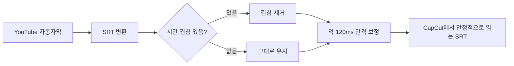

파일은 목적별로 나눴다.

| 파일 성격 | 용도 |
|---|---|
| 원본 자동자막 SRT | YouTube 자막을 그대로 받은 기준본 |
| 일반 SRT | 기본 자막 파일 |
| CapCut용 SRT | 겹침 제거와 간격 보정 후 CapCut 가져오기용 |
| Vrew 수정용 SRT | 사람이 문장만 고친 렌더링 기준 자막 |

CapCut은 자막 클립을 화면 요소로 다루기 때문에 시간 구간이 겹치면 생각보다 지저분해진다. 반면 쇼츠 렌더링에서는 Vrew 수정용 SRT를 기준으로 자막을 태웠다.

## .vrew 파일을 왜 ZIP으로 풀었나?

Vrew에서 저장한 `.vrew` 파일은 그냥 알 수 없는 전용 포맷처럼 보인다. 그런데 파일 헤더를 보니 `PK 03 04`였다. 이건 ZIP 컨테이너의 전형적인 시작 바이트다.

그래서 `.vrew`를 ZIP으로 복사해 풀었다.

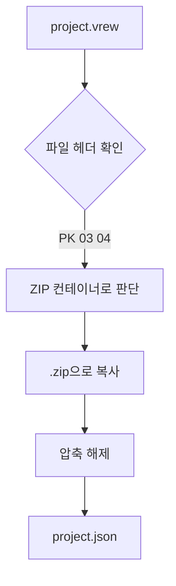

압축을 풀어 보니 이번 파일은 리소스가 잔뜩 들어 있는 구조가 아니었다. 핵심은 `project.json` 하나였다.

`project.json`의 큰 구조는 이렇게 생겼다.

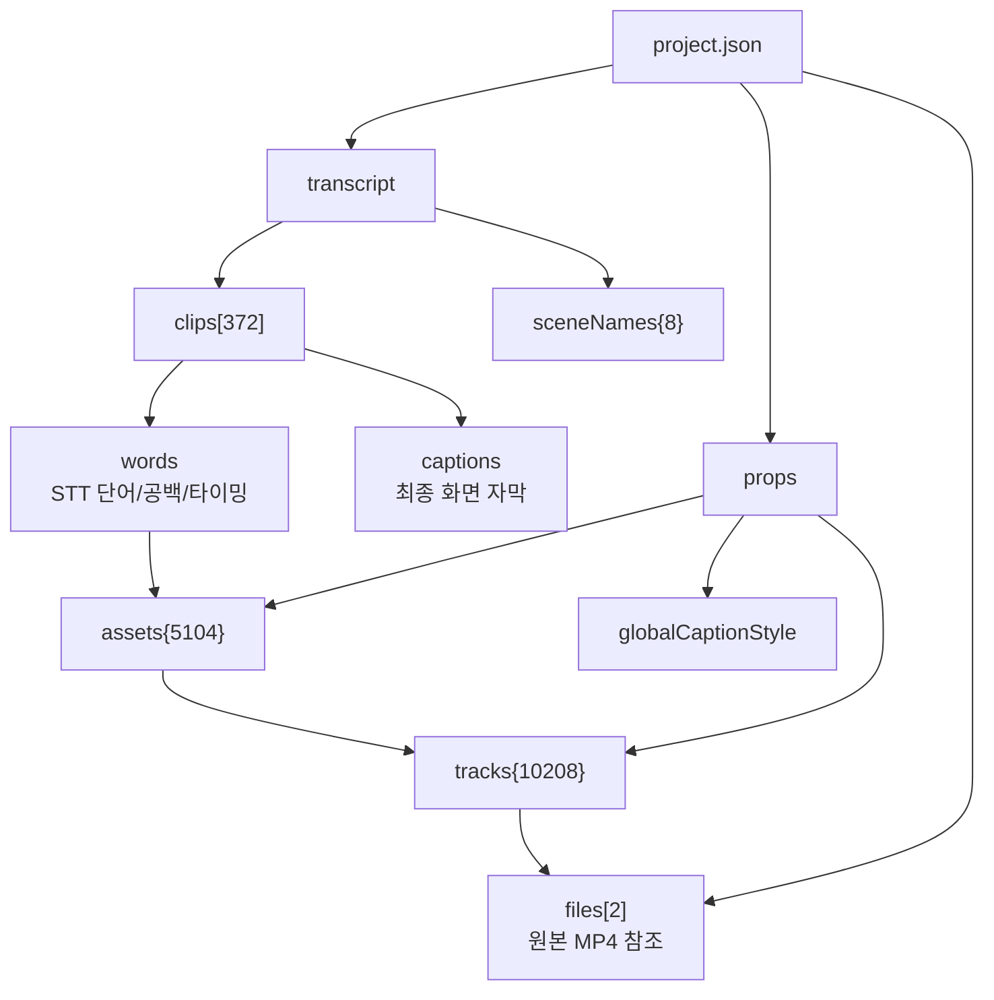

여기서 가장 중요한 발견은 `captions`와 `words`의 차이였다.

| 항목 | 의미 |
|---|---|
| `transcript.clips[*].captions` | Vrew 화면에 실제로 표시되는 최종 자막 문장 |
| `transcript.clips[*].words` | STT 원본 단어, 공백, 침묵, 타이밍 단위 |
| `props.assets` | 단어/구간이 참조하는 편집 자산 |
| `props.tracks` | 원본 MP4의 `sourceIn`, `sourceOut`으로 연결되는 영상/오디오 조각 |

예를 들어 어떤 구간은 `captions`에는 사람이 고친 문장이 들어 있고, `words`에는 자동인식 원본이 남아 있었다. 그래서 SRT 추출이나 검수 기준은 `words`가 아니라 **`captions`로 보는 게 자연스럽다**고 판단했다.

## Vrew의 8개 sceneId는 어떻게 쇼츠 기준이 됐나?

Vrew 프로젝트에는 장면 분류가 이미 들어 있었다. 나는 이 `sceneId` 8개를 쇼츠 8개의 기준으로 삼았다.

| # | sceneId | clips | 장면명 |
|---:|---|---:|---|
| 1 | `cSeY8XsTxk` | 38 | 대회 환경 및 1, 2차전 전략 평가 |
| 2 | `9zyY77QIZL` | 38 | 김민재 선수 교체 배경과 오해 해명 |
| 3 | `FxqGIZEONr` | 56 | 최근 경기력 부진 원인과 심리적 상태 분석 |
| 4 | `PNrJk3qsQb` | 53 | 외신 평가 대응 및 향후 전술적 대비 |
| 5 | `foftllorFN` | 38 | 책임 소재에 대한 감독의 철학과 팀 분위기 |
| 6 | `jdpIAEfnck` | 38 | 경기 데이터 리뷰 및 선수단 불화설 일축 |
| 7 | `m51x27CelO` | 41 | 손흥민 선수의 전술적 운용과 교체 이유 |
| 8 | `fjQlF3SXbl` | 70 | 감독의 책임론과 남은 경기를 향한 다짐 |

이 구조 덕분에 쇼츠 컷을 사람이 감으로 다시 나누지 않아도 됐다.

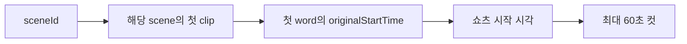

물론 이 방식은 "각 장면 전체"를 다 쓰는 방식은 아니다. 각 장면 시작점부터 최대 60초를 잘라낸 버전이다. 쇼츠용 초안으로는 충분했고, 필요하면 나중에 장면별로 길이를 더 정교하게 조절할 수 있다.

## 쇼츠 8개는 어떻게 렌더링했나?

렌더링은 Python 스크립트에서 ffmpeg를 호출하는 방식으로 했다.

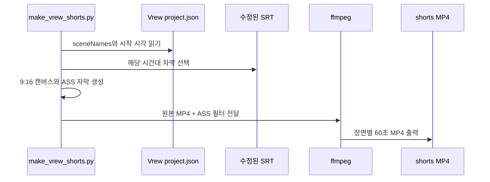

화면 구성은 단순하게 잡았다.

| 영역 | 내용 |
|---|---|
| 캔버스 | 1080 x 1920, 세로 9:16 |
| 배경 | 검은색 |
| 상단 | Vrew 장면명 제목 |
| 중앙 | 원본 16:9 영상 |
| 하단 | 수정된 SRT 기반 자막 |
| 출력 | H.264 MP4 |

결과 파일은 8개였다.

| # | 파일명 | 시작 시각 | 길이 | 해상도 |
|---:|---|---:|---:|---|
| 1 | `01_대회_환경_및_1,_2차전_전략_평가.mp4` | 0.000초 | 약 60초 | 1080x1920 |
| 2 | `02_김민재_선수_교체_배경과_오해_해명.mp4` | 146.780초 | 약 60초 | 1080x1920 |
| 3 | `03_최근_경기력_부진_원인과_심리적_상태_분석.mp4` | 267.790초 | 약 60초 | 1080x1920 |
| 4 | `04_외신_평가_대응_및_향후_전술적_대비.mp4` | 453.230초 | 약 60초 | 1080x1920 |
| 5 | `05_책임_소재에_대한_감독의_철학과_팀_분위기.mp4` | 641.370초 | 약 60초 | 1080x1920 |
| 6 | `06_경기_데이터_리뷰_및_선수단_불화설_일축.mp4` | 738.250초 | 약 60초 | 1080x1920 |
| 7 | `07_손흥민_선수의_전술적_운용과_교체_이유.mp4` | 884.060초 | 약 60초 | 1080x1920 |
| 8 | `08_감독의_책임론과_남은_경기를_향한_다짐.mp4` | 1023.390초 | 약 60초 | 1080x1920 |

검증 결과도 단순했다.

```text
8개 파일 모두 생성됨
8개 파일 모두 1080x1920
8개 파일 모두 H.264 MP4
각 파일 길이 약 59.96초 - 59.99초
```

## 왜 영상 안에 역슬래시가 보였나?

마지막에 예상 못 한 문제가 하나 있었다. 렌더링된 MP4를 보니 줄바꿈 지점이 실제 줄바꿈이 아니라 `\` 문자처럼 보였다.

처음에는 폰트 문제인가 싶었다. 아니었다. 원인은 ASS 자막 문법이었다.

ASS 자막에서 줄바꿈은 `\N`으로 표현한다. 그런데 내가 만든 `ass_escape()` 함수가 백슬래시까지 과하게 이스케이프했다. 그러면 ffmpeg가 `\N`을 줄바꿈 제어문자로 해석하지 못하고, 그냥 화면에 보이는 문자처럼 처리할 수 있다.

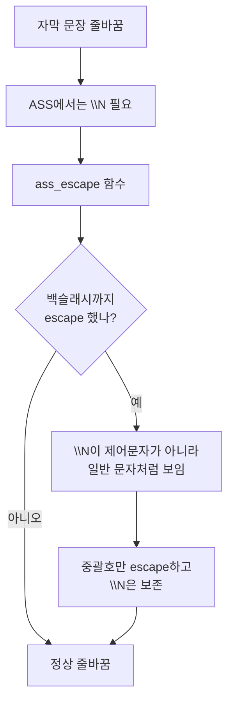

수정은 작았다. 그러나 효과는 컸다.

```text
기존:
  백슬래시까지 escape 처리

변경:
  ASS 명령을 깨는 중괄호만 escape
  줄바꿈 제어문자인 \N은 보존
```

수정 후 8개 MP4를 다시 렌더링했고, 샘플 프레임에서 상단 제목과 하단 자막의 줄바꿈이 정상으로 표시되는 것을 확인했다.

## 다시 실행하려면 무엇만 치면 되나?

다음에 같은 작업을 반복하려면 명령은 크게 두 개면 된다. 먼저 MP4를 받는다.

```powershell
cd $PROJECT
.\download_youtube_mp4.bat lqTfCrJ4jB4
```

Vrew에서 자동 자막을 만들고 SRT로 저장한 뒤, `vrew_수정용.srt`의 문장만 고친다. 그 다음 쇼츠를 다시 렌더링한다.

```powershell
cd $PROJECT
C:\Users\<me>\anaconda3\python.exe .\make_vrew_shorts.py
```

내가 다시 볼 체크리스트는 이렇다.

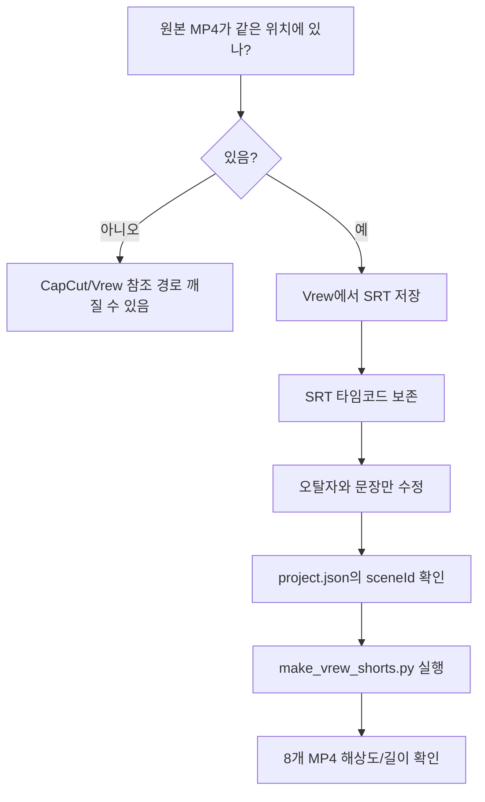

주의사항도 분명하다.

| 주의사항 | 이유 |
|---|---|
| 원본 MP4를 옮기지 않기 | CapCut과 Vrew 프로젝트가 로컬 경로를 참조할 수 있음 |
| SRT 타임코드 건드리지 않기 | 자막 싱크가 어긋남 |
| Vrew에서는 `captions`를 기준으로 보기 | `words`에는 자동인식 원본 흔적이 남을 수 있음 |
| 줄바꿈은 ASS에서 `\N` 유지 | 백슬래시를 escape하면 화면에 문자처럼 보일 수 있음 |
| 현재 쇼츠는 장면 시작부터 최대 60초 | 장면 전체를 모두 쓰는 방식은 아님 |

## 끝내고 보니 무엇이 남았나?

이번 작업은 "영상 편집 자동화"라기보다 **자막 구조를 중심으로 한 파이프라인 정리**에 가까웠다.

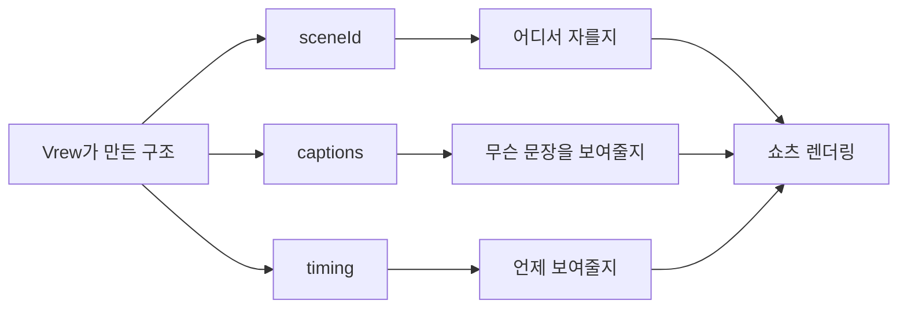

Vrew가 자동으로 만들어 준 구조를 믿고, 나는 그 위에서 사람이 해야 할 일만 했다. 문장을 읽기 좋게 고치고, 장면별 제목을 얹고, ffmpeg가 이해할 수 있는 형태로 내보냈다. 이 방식이 마음에 들었던 이유는 명확하다. **시간 맞추기는 기계가 하고, 말맛 고치기는 사람이 한다.** 둘을 섞지 않으니 작업이 덜 흔들렸다.

다음에는 여기서 한 단계 더 나아가고 싶다. 장면별 60초 고정 컷이 아니라, 각 scene의 실제 길이와 문장 밀도를 보고 자동으로 35초, 48초, 59초처럼 길이를 조절하는 방식이다. 그때도 기준은 같을 것 같다. 영상이 아니라, 먼저 **자막 구조**를 읽어야 한다.
