회사 다니면서 이런 질문 한 번쯤 해봤을 것이다.

> "그 문서 어디 있어요?"
> "이거 누가 제일 잘 알아요?"
> "그 약어가 무슨 뜻이죠?"

그리고 이런 대답도 들어봤을 것이다. "아 그거 김대리가 아는데 지금 휴가라..."

**Cerebras**라는 회사가 이 문제를 정면으로 붙잡고 사내 검색 시스템을 만들었다. 결과가 꽤 놀랍다. **하루에 15,000개 넘는 질문**이 들어오고, 공개 3개월 만에 사내에서 가장 많이 쓰는 도구 중 하나가 됐다. 사람만 쓰는 게 아니라 자동화 스크립트와 AI 에이전트도 이 시스템에 질문을 던진다.

그런데 이 사례에서 내가 진짜 재밌게 본 건 성과 숫자가 아니었다. **접근 방식이 우리가 흔히 하는 것과 정반대**였기 때문이다.

이 글은 그 설계를 **전문 용어를 하나도 모르는 상태에서 읽어도 이해되도록** 풀어 쓴 것이다. 검색이 어떻게 작동하는지부터 시작한다.

## 이 글에서 다룰 것을 한 장으로 보면?

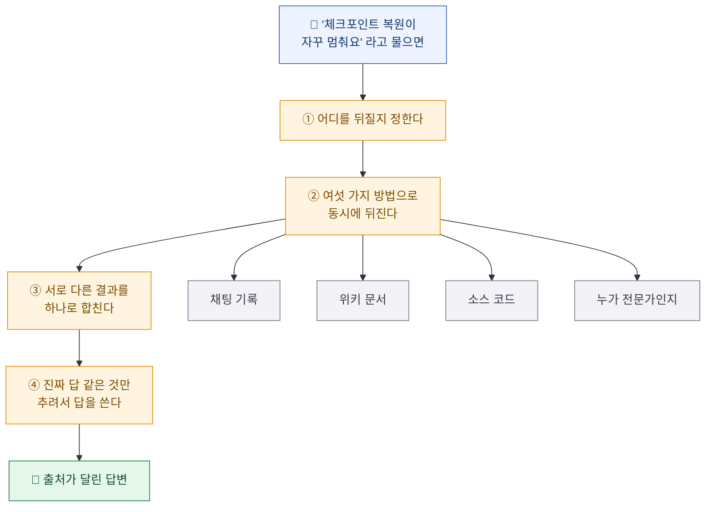

## 먼저, 용어부터 털고 가자

이 글에 나오는 단어들이다. 지금 다 이해할 필요는 없고, 읽다가 막히면 여기로 돌아오면 된다.

| 용어 | 쉬운 말로 |
|---|---|
| **검색 증강 생성(RAG)** | AI가 답하기 전에 **먼저 자료를 찾아보게** 하는 방식. 시험 볼 때 오픈북으로 바꾸는 것 |
| **임베딩(embedding)** | 문장을 **숫자 목록으로 바꾼 것**. 뜻이 비슷하면 숫자도 비슷해진다 |
| **벡터(vector)** | 그 숫자 목록. 여기선 숫자가 3,072개 들어 있다 |
| **벡터 검색 / 의미 검색** | 단어가 달라도 **뜻이 비슷한 것**을 찾아주는 검색 |
| **전문 검색(full-text search)** | 우리가 아는 그 검색. **글자 그대로** 일치하는 걸 찾는다 |
| **코사인 유사도** | 두 숫자 목록이 얼마나 비슷한지 재는 자 |
| **IDF(역문서 빈도)** | **흔한 단어는 깎고 희귀한 단어는 올려주는** 가중치 |
| **청킹(chunking)** | 긴 문서를 검색하기 좋게 **토막 내는 것** |
| **pgvector** | 많이 쓰는 데이터베이스(PostgreSQL)에 **벡터 검색 기능을 붙여주는 부가 기능** |
| **HNSW** | 벡터를 빠르게 찾는 **색인 방식**. 정확도를 조금 포기하고 속도를 크게 얻는다 |
| **RRF(상호 순위 융합)** | 여러 검색 결과 **순위표를 하나로 합치는 공식** |
| **MCP** | AI 도구들이 서로 **같은 규격으로 대화하게 하는 약속** |

이제 본론이다.

## "다 한 군데에 적읍시다"는 왜 매번 실패하나?

회사에서 정보가 흩어져 있으면 분기마다 누군가 이렇게 말한다. **"이제부터 다 위키에 적읍시다."**

Cerebras 팀은 이 접근을 정면으로 반박한다. 원문 표현이 담백해서 그대로 옮긴다.

> "The dream of a single source of truth, of course, rarely works in practice."
> (**단일 진실 공급원**이라는 꿈은, 당연하게도, 현실에서 제대로 작동하는 경우가 드물다.)

이유가 명쾌하다. **정보는 만들기 가장 편한 곳에서 생긴다.**

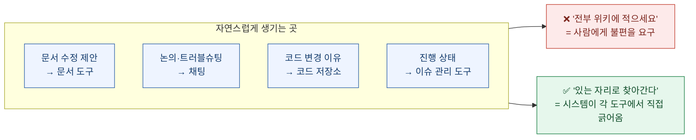

원문에 이런 문장이 있다. **"풀 리퀘스트에 대한 논의를 문서 도구에서 하는 것은 끔찍한 경험일 것이다."** 코드 변경 얘기를 워드 문서에서 하라는 격이니 당연하다.

그래서 이 팀은 **사람의 행동을 최소한으로만 바꾸는** 쪽을 택했다. "저기 말고 여기 적으세요"가 아니라, **사람들이 이미 일하는 곳으로 시스템이 찾아간다.**

이게 왜 중요하냐면, 사내 위키를 만들어놓고 아무도 안 써서 유령이 된 경험은 거의 모든 조직에 있기 때문이다. **실패 원인이 게으름이 아니라 설계였다는 얘기다.**

## 그래서 구조가 어떻게 생겼나?

의외로 단순하다. **데이터베이스 표(테이블) 딱 하나**가 중심에 있다.

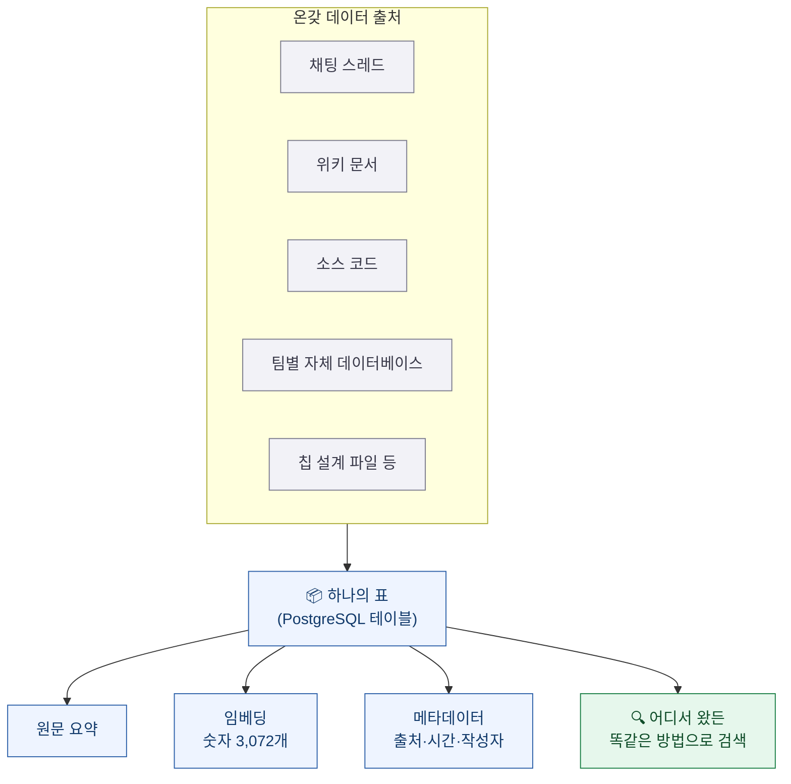

핵심은 **"채팅에서 왔든 코드에서 왔든 표에 들어가는 순간 똑같이 생긴다"**는 것이다. 그래서 새 데이터 출처를 붙이기가 쉽다. 어떤 팀이 자기 데이터베이스를 연결하고 싶으면, **표 모양에 맞춰 행을 써넣는 작은 스크립트 하나**만 만들면 나머지는 손댈 게 없다.

**비유하자면 이렇다.** 도서관에 소설, 논문, 신문, 지도를 넣는다고 하자. 원본은 제각각이지만 **목록 카드는 전부 같은 양식**으로 만든다. 그러면 사서는 카드 한 종류만 다룰 줄 알면 된다.

## 검색이란 게 원래 어떻게 작동하나?

여기서 잠깐 기초를 짚어야 뒤가 이해된다. 검색에는 크게 두 종류가 있다.

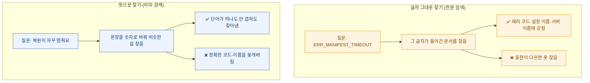

**의미 검색**이 어떻게 가능한지만 짚고 가자. 문장을 AI에 넣으면 **숫자 목록**이 나온다. 이걸 임베딩이라고 한다. 신기한 건 **뜻이 비슷한 문장은 숫자도 비슷하게 나온다**는 점이다.

그래서 이런 일이 가능해진다.

- 질문: "**복원이 매니페스트 로드 후 멈춥니다**"
- 답변: "**체크포인트가 NFS 마운트에서 정체됩니다**"

**두 문장은 겹치는 단어가 거의 없다.** 글자로만 찾으면 절대 연결이 안 된다. 그런데 숫자로 바꿔놓으면 가깝게 붙는다. 이게 벡터 검색이 하는 일이다.

Cerebras는 이 숫자를 **3,072개**짜리로 쓴다. 그리고 **HNSW**라는 색인을 붙였다. 이건 "완벽히 정확한 답 대신 거의 정확한 답을 훨씬 빠르게" 찾는 방법이다. 수백만 건에서 가장 비슷한 걸 매번 전부 비교하면 느리니, **적당히 좋은 지름길**을 미리 만들어두는 것이다. 대신 지름길로 안 지나간 후보는 아예 비교하지 않으므로 **진짜 1등을 놓칠 수도 있다.** 정확도를 조금 내주고 속도를 사는 구조다.

**⚠️ 여기서 원문이 말하지 않은 게 하나 있다.** 이 "3,072차원 + HNSW" 조합은 본문 설명이 아니라 **아키텍처 도식의 라벨**에만 적혀 있다. 그런데 확인해보니 pgvector의 기본 벡터 타입은 **HNSW 색인을 2,000차원까지만** 지원한다. 3,072차원에 그대로 걸 수는 없고, 절반 정밀도 타입으로 바꾸거나 차원을 줄이는 등 **추가 조치가 필요하다.**

원문은 그 부분을 밝히지 않았다. 따라 만들려는 사람에게는 **여기가 첫 번째로 막히는 지점**일 텐데, 도식 한 줄로만 적혀 있어서 그냥 되는 것처럼 보인다. 이런 게 기술 블로그를 읽을 때 조심할 대목이다 — **도식에 적힌 것과 본문이 설명한 것은 신뢰도가 다르다.**

## 그런데 왜 의미 검색만으로는 안 됐나?

팀은 처음에 **원본 텍스트를 그냥 임베딩하는 것만으로 충분한지** 시험했다. 결론은 **부족하다**였다.

회사 채팅 데이터가 워낙 지저분해서다. 원문이 든 예가 아주 현실적이다.

| 문제 | 무슨 뜻이냐면 |
|---|---|
| **정보 밀도가 극단적으로 다르다** | "응 그래 좋아"도 한 메시지, 커널 동작 상세 설명도 한 메시지 |
| **짧은 게 긴 걸 이긴다** | 짧은 메시지가 길고 알찬 메시지보다 **유사도 점수가 더 높게** 나오는 일이 잦다 |
| **혼자서는 뜻을 모른다** | "그거 4로 낮춰보세요"는 앞뒤 대화가 없으면 아무 의미가 없다 |

두 번째가 특히 골치 아프다. **"좋아요, 감사합니다!"** 같은 메시지는 이상하게도 온갖 질문과 다 비슷해 보인다. 짧고 평범해서 어디에나 어중간하게 가깝기 때문이다. 그래서 의미 검색만 돌리면 이런 게 자꾸 위로 올라온다.

## 그럼 어떻게 해결했나? — 잣대 네 개를 동시에 댄다

여기가 이 설계의 핵심이다. **하나의 똑똑한 방법을 찾는 대신, 어설픈 방법 네 개를 동시에 쓴다.** 각각이 서로의 약점을 메운다.

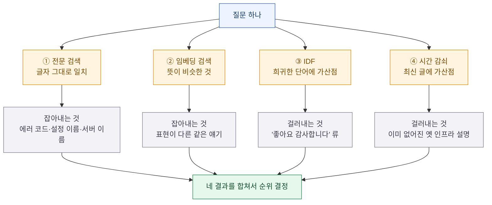

각각을 조금만 더 풀어보자.

**① 전문 검색** — 엔지니어가 에러 메시지를 **그대로 복사해서 붙여넣었을 때**가 있다. 이럴 땐 글자 그대로 일치하는 게 거의 언제나 정답이다. 원문 표현이 단호하다. *"어떤 의미적 유사도도 이를 앞질러서는 안 된다."*

**② 임베딩 검색** — 앞에서 본 "복원이 멈춘다" ↔ "체크포인트가 정체된다" 연결을 담당한다.

**③ IDF** — 이게 재밌다. **흔한 단어는 깎고 희귀한 단어는 올린다.** "감사합니다"는 어디에나 나오니 가치가 거의 0이다. 반대로 `CKPT_PREFETCH` 같은 희귀한 설정 이름은 그거 하나만 들어 있어도 그 문서는 볼 가치가 있다. **짧은 메시지가 이유 없이 이기는 문제**를 이걸로 잡는다.

**④ 시간 감쇠** — 회사 채팅 답변에는 **유통기한**이 있다. 6개월 전 답변은 지금은 없어진 서버 얘기를 하고 있을 수 있다. 그래서 조건이 비슷하면 **최신 글이 이긴다.**

원문의 한 줄이 이 설계 철학을 요약한다.

> "No single scorer is trusted on its own."
> (**어떤 단일 채점자도 홀로 신뢰받지 않는다.**)

## 대화를 그대로 넣지 않고 왜 '증류'하나?

여기가 개인적으로 제일 배울 게 많았던 부분이다.

팀은 **채팅 원문을 그대로 임베딩하지 않는다.** 대신 AI에게 대화 전체를 읽히고 **정해진 양식으로 다시 쓰게** 한다. 이걸 **증류(distillation)** 라고 부른다.


**왜 이게 효과가 있을까?**

대화 원문에는 잡음이 많다. 위 예시의 "제 노트북은 월요일만 되면 멈춰요 ㅋㅋ" 같은 농담도 그대로 섞여 있다. 이걸 통째로 숫자로 바꾸면 **농담까지 포함한 평균값**이 나온다.

반면 증류를 거치면 **"복원이 왜 멈추나?" + "값을 4로 낮추면 된다"** 라는 깔끔한 문서가 된다. 나중에 다른 사람이 비슷한 걸 물었을 때 훨씬 잘 걸린다.

원문은 이렇게 적었다. *"실험에서 스레드를 일관된 형식으로 정규화했을 때 정확도가 크게 올랐다."*

내가 여기서 얻은 교훈은 이거다. **AI에게 자료를 주기 전에, AI에게 자료를 한 번 정리시켜라.** 같은 데이터라도 형태를 다듬으면 결과가 달라진다.

한 가지 더. 원문 대화도 **버리지는 않는다.** 글자 그대로 검색하려면 원본이 있어야 하니, 원문은 원문대로 따로 색인해둔다. **정리본은 뜻으로 찾을 때, 원문은 글자로 찾을 때** 쓰는 것이다.

## 긴 대화에 묻힌 한 마디는 어떻게 살리나?

증류까지 했는데도 문제가 남았다. **긴 스레드 요약에는 안 담기는 중요한 한 마디**가 있다는 것.

50개 메시지가 오간 스레드를 한 문단으로 요약하면, 중간에 누가 툭 던진 결정적인 힌트는 요약에서 빠지기 마련이다. 그런데 정답이 하필 거기 있을 때가 있다.

그래서 **버스팅(bursting)** 을 쓴다. **같은 사람이 연달아 쓴 메시지 묶음**을 하나의 단위로 보고, 그 묶음도 따로 저장하는 것이다.

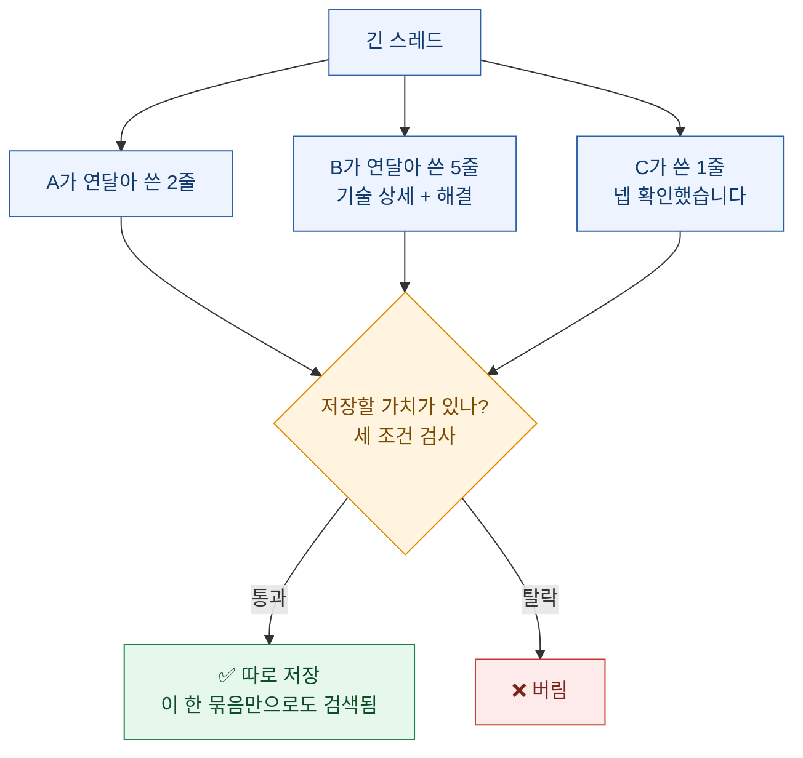

여기서 **"저장할 가치가 있나"를 판단하는 세 가지 조건**이 아주 실용적이다.

| 조건 | 숫자 | 왜 |
|---|---|---|
| 희귀한 단어가 들어 있나 | **IDF 4.0 이상** | 아무 데나 나오는 말만 있으면 검색에 도움이 안 된다 (⚠️ 이게 "몇 개 중 하나꼴"인지는 원문이 로그 밑도 전체 문서 수도 안 밝혀서 환산 불가) |
| 충분히 기냐 | **합쳐서 200자 이상** | 너무 짧으면 맥락이 없다 |
| 반응이 달렸나 | **이모지 반응 1개 이상** | 남들이 유용하다고 표시한 것 |

**⚠️ 다만 이 셋은 "전부 만족해야 통과"가 아니다.** 원문 표현은 *"가중 신호 조합으로 채점되어 임계값을 넘어야 한다"* 이다. 즉 셋을 점수로 합산해 문턱을 넘는지 보는 방식이지, 하나라도 빠지면 탈락하는 조건 목록이 아니다. 요약본을 읽으면 필수 조건처럼 보이기 쉬운데 원문은 그렇게 말하지 않았다.

세 번째가 특히 재밌다. **동료들이 붙인 이모지 반응을 품질 신호로 쓴다.** 사람들이 "오 이거 도움됐다"고 표시한 걸 기계가 참고하는 셈이다. 별도 평가 시스템을 만들지 않고 **이미 있는 행동을 신호로 재활용**한 것이다.

## 코드는 그냥 찾기(grep)면 충분하지 않나?

팀도 처음엔 이걸 두고 논쟁했다. 요즘 개발 도구들이 워낙 잘해서 **"그냥 문자열 검색이면 충분하다"** 는 분위기가 있었기 때문이다.

그런데도 해보기로 했고, 결과적으로 **둘 다 쓴다.** 이유는 앞에서 본 것과 같다. 문자열 검색은 정확한 이름을 찾을 때 최고고, 의미 검색은 **"이런 걸 하는 코드가 어디 있지?"** 를 찾을 때 최고다.

코드를 토막 내는 방식도 알아둘 만하다.

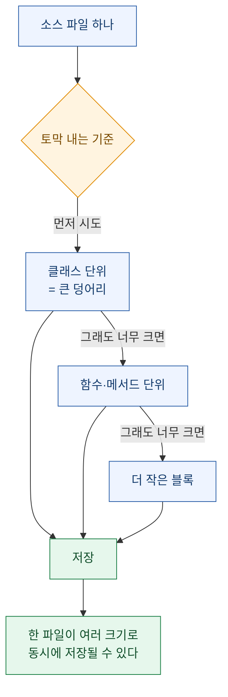

**왜 그냥 "500자씩 끊기"로 안 할까?** 그렇게 하면 함수가 중간에 뚝 잘린다. 앞부분만 남은 함수는 뜻이 반쯤 사라진다. 그래서 **의미 단위를 먼저 지키고**, 그래도 너무 크면 그때 더 잘게 쪼갠다.

운영 면에서 똑똑한 부분도 있다. 저장소 중엔 **40GB가 넘는 것**도 있는데, 코드가 바뀔 때마다 전체를 다시 계산하면 감당이 안 된다. 그래서 **바뀐 토막만 다시 처리**한다. 이게 쉬웠던 이유는 **"어디까지 처리했는지 기록"과 "임베딩 저장소"가 같은 데이터베이스에 있어서**다.

이건 작은 결정 같지만 실제로는 크다. 두 개를 다른 시스템에 두면 **둘이 어긋났을 때 맞추는 일**이 계속 생긴다. 한 곳에 두면 그 문제가 아예 없다.

## 서로 다른 검색 결과를 어떻게 하나로 합치나?

이제 제일 재밌는 부분이다. 검색 방법이 여섯 가지면 **순위표도 여섯 개**가 나온다. 이걸 어떻게 하나로 합칠까?

문제는 **점수 단위가 서로 다르다는 것**이다. 코사인 유사도 0.87과 문자열 검색 점수 12.4를 어떻게 비교하나? 사과와 오렌지다.

**RRF(상호 순위 융합)** 의 해법은 우아하다. **점수를 버리고 등수만 쓴다.**

공식은 이렇다.

```
어떤 문서의 최종 점수 = 그 문서가 등장한 모든 순위표에 대해
                       ( 1.0 / (60 + 그 표에서의 등수) ) 를 전부 더한 값
```

여기서 **60**이 마법의 숫자다. 이게 무슨 역할을 하는지 **직접 계산**해보면 바로 이해된다.

세 후보를 비교해보자.

| 후보 | 상황 | 계산 | 최종 점수 |
|---|---|---|---|
| **A** | 한 표에서 1등, 다른 표에서 30등 | 1/61 + 1/90 | **0.0275** |
| **B** | 세 표에서 각각 5등, 4등, 6등 | 1/65 + 1/64 + 1/66 | **0.0462** |
| **C** | 딱 한 표에서 1등, 나머지엔 없음 | 1/61 | **0.0164** |

**B가 이긴다.** 어느 표에서도 1등을 못 했는데 말이다.

이게 60이 하는 일이다. 분모에 60을 더해놓으면 **1등과 5등의 차이가 별로 안 난다**(0.0164 대 0.0154). 대신 **여러 표에 등장하면 그만큼 더해진다.** 결과적으로 이런 규칙이 된다.

> **한 명이 강하게 미는 것보다, 여러 명이 고르게 인정하는 것이 이긴다.**


**"한 파일이 차지할 수 있는 자리 수 제한"** 도 실용적인 장치다. 안 그러면 어떤 긴 문서 하나가 상위 20개를 다 차지해버릴 수 있다. 그럼 다양한 관점을 못 본다.

마지막에 하나 더 한다. **순위가 정해지고 나면 맥락을 다시 붙인다.** 위키의 어떤 절이 걸리면 **앞뒤 절도 같이 가져온다.** 토막 내는 과정에서 잘려나간 제목, 전제 조건, 주의 사항이 사라지지 않게 하려는 것이다.

이게 왜 중요하냐면, **"이 설정을 4로 바꾸세요"** 만 딱 잘려 나오면 위험하기 때문이다. 바로 윗줄에 **"단, 운영 환경에서는 절대 하지 마세요"** 가 있었을 수도 있다.

## 질문 하나를 던지면 실제로 무슨 일이 벌어지나?

전체 흐름을 시간 순으로 보면 이렇다.

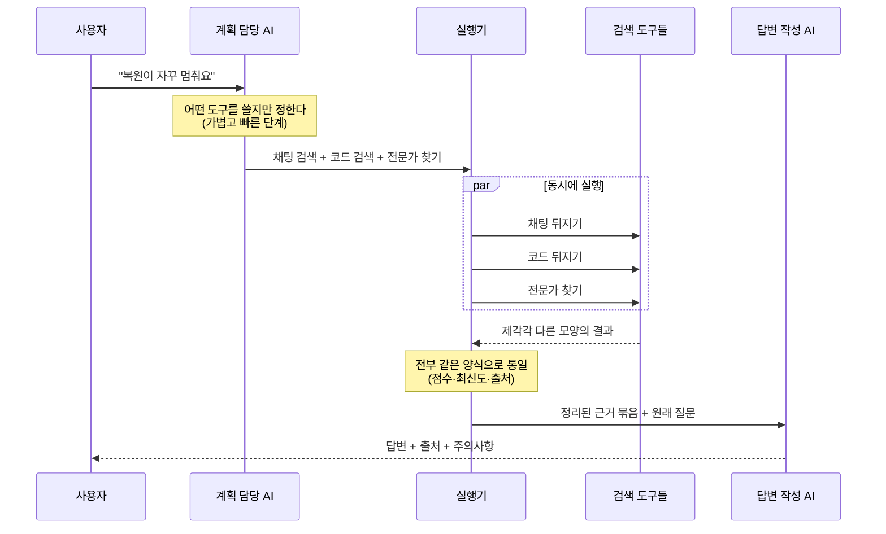

세 단계로 나뉜 게 포인트다.

| 단계 | 하는 일 | 왜 나눴나 |
|---|---|---|
| **계획** | 어디를 뒤질지만 정한다 | 가볍게 끝내야 빠르다. 답을 쓰지 않는다 |
| **실행** | 정해진 곳을 **동시에** 뒤진다 | 하나씩 하면 느리다. 병렬로 하면 가장 느린 것 하나만큼만 걸린다 |
| **종합** | 모인 근거로 답을 쓴다 | 이때만 무거운 AI를 쓴다 |

도구 목록 중에 눈에 띄는 게 하나 있다. **`who_knows`** — **특정 주제에 대해 입증된 전문성을 가진 사람**을 찾아주는 도구다.

글 맨 앞의 세 가지 질문 기억나는가? **"이거 누가 제일 잘 알아요?"** 에 직접 답하는 게 이것이다. 문서만 찾아주는 게 아니라 **사람까지 연결한다.** 개인적으로 이 지점이 이 시스템의 성격을 가장 잘 보여준다고 봤다. 검색 엔진이 아니라 **조직의 기억 장치**를 만든 것이다.

## 같은 시스템을 두 가지로 내놓은 이유는?

이 시스템은 두 가지 얼굴을 가지고 있다.

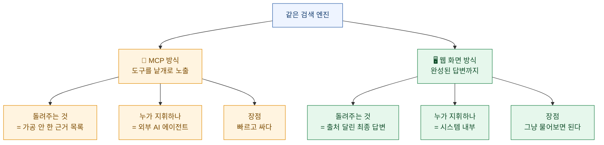

**MCP**를 잠깐 설명하면, AI 도구들이 **서로 같은 규격으로 대화하게 하는 약속**이다. 전기 콘센트 규격 같은 것이다. 규격이 같으면 어떤 기기든 꽂아 쓸 수 있다.

여기서 이 팀이 내린 결정이 흥미롭다. **MCP 쪽 도구들은 일부러 "얇게"** 만들었다. 원문 표현은 *"가능한 한 AI에 의존하지 않도록(as LLM-free as possible)"* 이다.

**왜 일부러 단순하게 만들까?** 도구가 똑똑해지려 하면 느려지고 비싸지기 때문이다. 도구는 **자료만 정확히 꺼내주고**, 그걸 어떻게 조합해 답을 만들지는 **부르는 쪽이 정하게** 하는 것이다.

이건 일반적인 설계 원칙이기도 하다. **부품은 단순하게, 조립은 쓰는 쪽에서.**

## 검색 범위를 왜 굳이 나눴나?

마지막 장치다. 자료가 쌓이자 **"전부 다 뒤지기"가 오히려 쓸모없어졌다.**

컴파일러 담당 엔지니어가 검색했는데 서버 운영 매뉴얼이 섞여 나오면 방해만 된다. 그 반대도 마찬가지다.

그래서 **프로젝트**라는 개념을 뒀다. 팀이나 업무에 관련된 **데이터 출처 묶음에 이름을 붙인 것**이다.

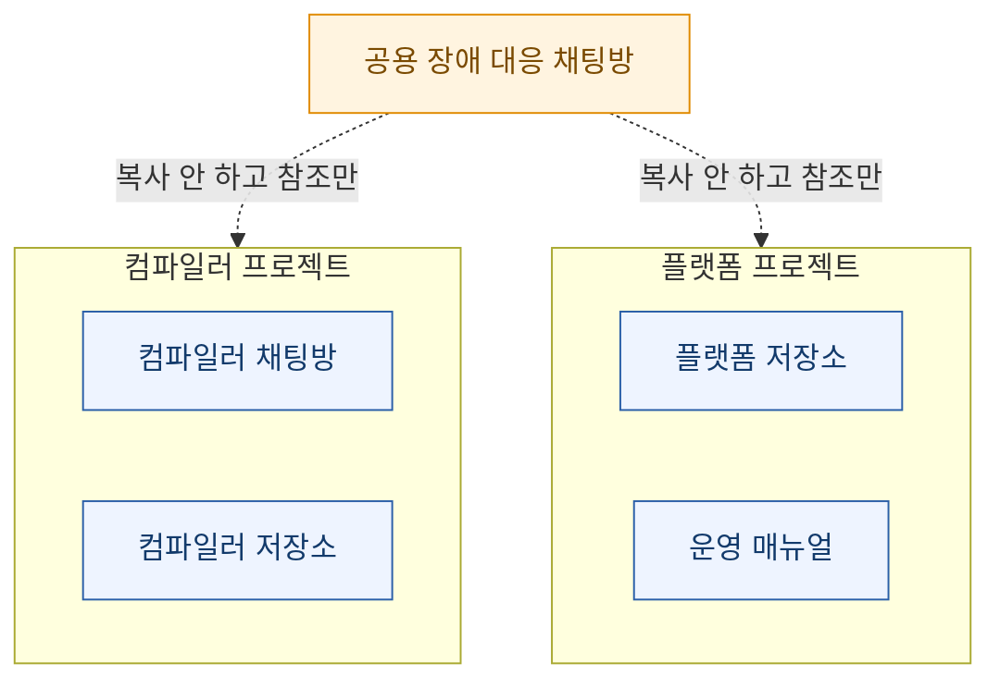

**같은 자료를 여러 프로젝트가 공유할 수 있다.** 복사본을 만드는 게 아니라 참조만 한다. 그래서 장애 대응 채팅방처럼 모두에게 필요한 자료는 한 벌만 두고 여러 곳에서 쓴다.

그리고 **신입 입사자 배려**가 좋다. 처음 쓸 때 **"당신은 어떤 일을 하나요?"** 를 물어보고 기본 범위를 정해준다. 그러면 **어떤 채팅방이 중요한지 배우기도 전에** 쓸 만한 답을 받는다. 새로 온 사람이 가장 답답한 게 "뭘 모르는지도 모르는 상태"인데, 그걸 겨냥한 설계다.

## 비전공자가 이 사례에서 가져갈 것

기술 얘기를 다 걷어내면 남는 교훈은 의외로 일반적이다.

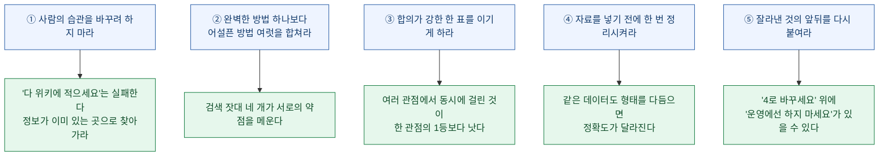

**①번이 제일 크다.** 사내 지식 관리가 실패하는 이유는 대개 사람들이 게을러서가 아니라, **불편한 곳에 적으라고 요구했기 때문**이다. 이 팀은 그걸 인정하고 반대로 갔다.

**③번은 일상에도 쓸 수 있다.** 어떤 판단을 할 때 **한 지표가 강하게 가리키는 것**보다 **여러 지표가 고르게 가리키는 것**을 믿는 게 대체로 안전하다. RRF의 60이라는 숫자가 하는 일이 정확히 그것이다.

**⑤번은 요약을 다루는 모든 사람에게 해당된다.** 문장 하나만 잘라 오면 조건과 예외가 사라진다. 사실 이건 뉴스 요약을 읽을 때도 똑같이 벌어지는 일이다.

## 그래서 나는 뭘 해볼 생각인가

내 지식 창고에도 비슷한 문제가 있다. 문서, 코드, 메모, 대화 기록이 여기저기 흩어져 있고 **검색이 잘 안 될 때가 있다.**

이 글을 읽고 당장 바꿔볼 것 세 가지를 정했다.

**첫째, 검색을 하나로만 하지 않기.** 지금은 키워드로만 찾을 때가 많은데, **글자 그대로 찾기와 뜻으로 찾기를 같이** 돌리고 결과를 합치는 쪽이 낫겠다.

**둘째, 저장 전에 한 번 정리하기.** 자료를 원본 그대로 쌓아두는 대신 **"이 자료가 답하는 질문 한 줄"** 을 같이 저장해두면 나중에 찾기가 훨씬 쉬울 것 같다. 증류가 하는 일이 정확히 그거다.

**셋째, 흔한 말에 속지 않기.** IDF가 하는 일 — **어디에나 나오는 말은 정보가 없다** — 는 검색뿐 아니라 자료를 고를 때도 쓸 수 있는 기준이다.

마지막으로, 이 사례에서 가장 마음에 들었던 문장을 다시 옮긴다.

> **어떤 단일 채점자도 홀로 신뢰받지 않는다.**

화려한 모델 하나로 다 해결하려는 대신, **여러 개의 불완전한 신호를 정직하게 합쳐서** 실용적인 정확도를 만들어낸 것. 지저분한 현실 데이터 위에서는 이쪽이 더 잘 작동한다는 게 이 사례의 핵심이다.

---

## 참고

- Cerebras 공식 블로그, *"How Cerebras Built Its Enterprise Knowledge Base"* (2026-07-15 표시일 / 최종수정 2026-07-16, 저자 바이라인 없음)
- ⚠️ 원문은 **"RAG"라는 용어를 한 번도 쓰지 않는다.** 이 글에서 RAG로 설명한 건 독자 이해를 위한 분류이지 원문 표현이 아니다
- ⚠️ pgvector·HNSW·3,072차원은 **본문 산문이 아니라 아키텍처 도식 라벨**에만 등장한다
- 이 글은 위 원문과 한국어 정리본(PyTorchKR)을 함께 읽고, **원문에 있는 수치만** 인용해 비전공자용으로 재구성한 것이다
- 본문의 RRF 계산 예시는 원문 공식(가중치 1.0, 상수 60)에 직접 대입해 계산한 값이다
- 언급된 배경 기법들: HNSW 근사 최근접 이웃 탐색, 상호 순위 융합(RRF), 맥락 보강 검색(Contextual Retrieval), 긴 맥락에서 중간 정보가 무시되는 현상(Lost in the Middle)

*⚠️ 이 글은 Cerebras의 공개 기술 블로그를 바탕으로 한 해설이며, 필자는 해당 회사와 아무 관계가 없다. 사내 시스템의 세부 구현은 공개된 범위 밖이므로, 여기 적힌 것은 모두 공개 문서에 명시된 내용에 한정된다.*
