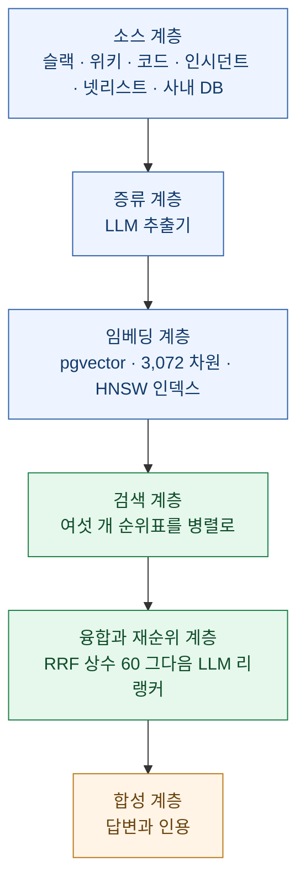
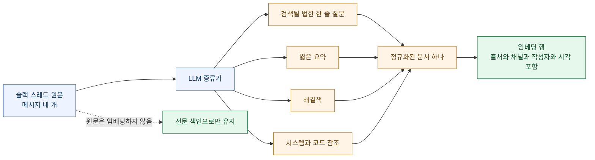
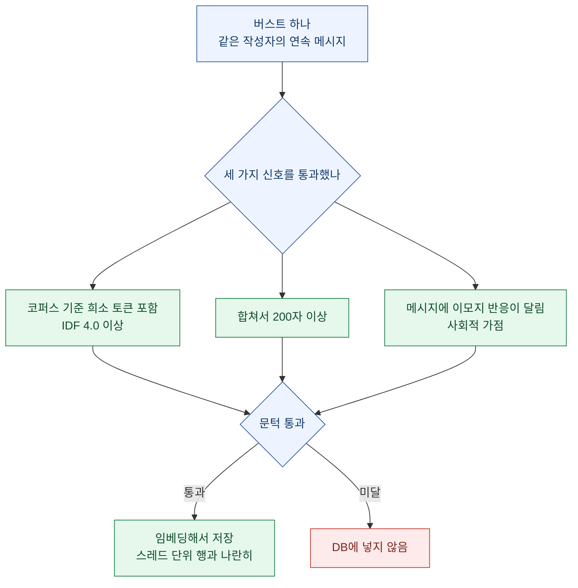
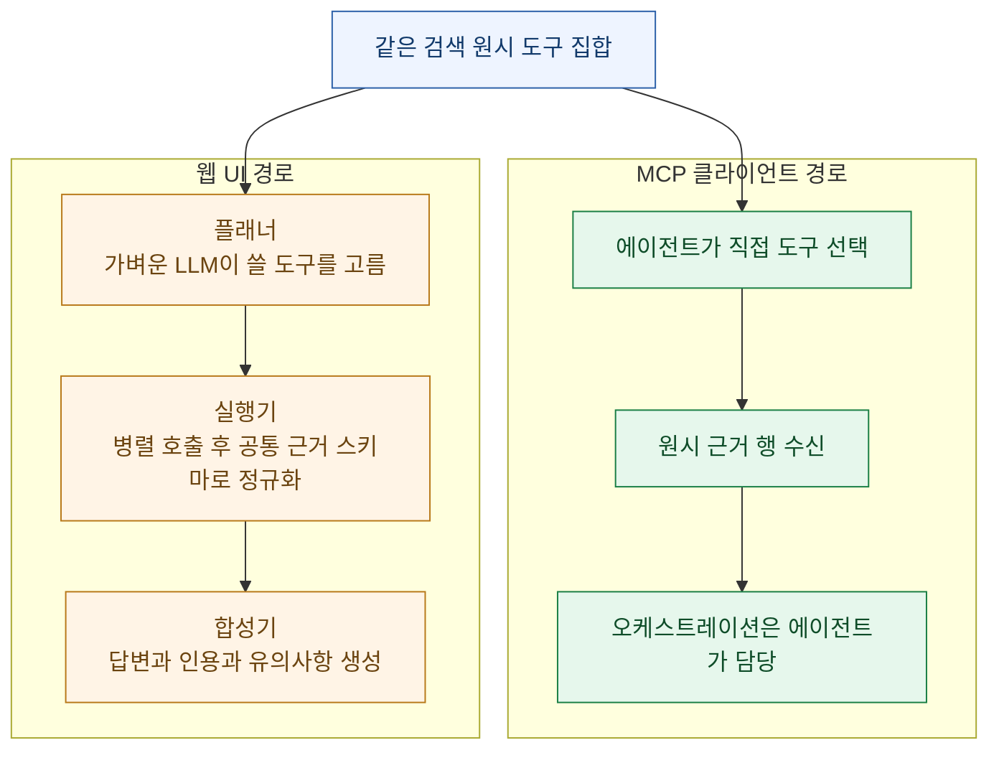
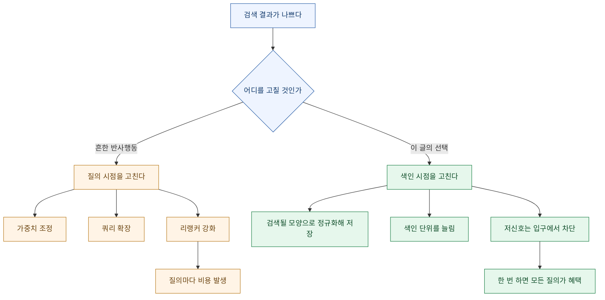

> "검색 결과가 나쁘면 나는 늘 랭킹 함수를 열었다. 이 글은 색인을 열었다."

세레브라스(Cerebras)가 7월 15일에 사내 지식베이스 구축기를 공개했다. [How We Built Our Knowledge Base](https://www.cerebras.ai/blog/how-we-built-our-knowledge-base), 아이작 타이·대니얼 킴·마이크 가오 세 사람이 썼다. 사내 직원이 **하루 15,000건** 질문을 던지고, 출시 3개월 만에 사내에서 가장 널리 쓰이는 도구가 됐다고 한다. 사람만 쓰는 게 아니라 자동화와 에이전트도 쓴다.

내가 이 글을 붙잡고 있었던 이유는 개인적이다. 나도 로컬에 지식창고를 하나 굴리고 있다. 5만 8천 개 넘는 파일을 SQLite FTS5로 색인하고, 그래프로 파일 사이 관계를 잇고, MCP 도구로 노출해서 에이전트가 직접 검색하게 해 뒀다. 규모는 비교가 안 되지만 **푸는 문제는 정확히 같다.** 흩어진 자료를 한 질의 창구로 모으고, 결과가 쓸 만하게 나오게 만드는 것.

그래서 읽는 내내 내 시스템과 겹쳐 봤고, 한 가지가 계속 걸렸다. 나는 검색 품질을 올리려고 할 때 **거의 항상 질의 쪽을 만졌다.** 필드 가중치를 바꾸고, 가점·감점을 붙이고, 그래프 교집합을 섞었다. 그런데 이 글에서 가장 큰 성능을 낸 결정들은 전부 **색인 쪽**에 있었다.

> 📌 **범위 고지**: 이 글은 공개된 남의 엔지니어링 블로그를 읽고 정리한 것이다. 수치와 설계는 전부 원문 출처이고, 해석과 내 시스템과의 대조는 내 것이다. 원문을 직접 읽는 게 항상 더 낫다.

## 전체 구조는 어떻게 생겼나?

원문이 제시한 스택을 아래에서 위로 세우면 이렇다.

핵심은 가운데다. **소스가 몇 개든, 슬랙 스레드든 넷리스트든, 전부 같은 임베딩 테이블의 같은 모양 행으로 떨어진다.** 그 테이블에 들어간 것은 무엇이든 같은 인터페이스로 즉시 질의된다. 원문 표현대로 "의도적으로 단순하게(deliberately simple)" 만든 부분이다.

이게 왜 중요하냐면, 소스를 하나 늘릴 때 **파이프라인 나머지가 한 줄도 안 바뀌기 때문**이다. 실제로 세레브라스는 다른 팀이 자기 DB를 붙이고 싶을 때 "행을 우리 스키마 모양으로 뱉는 작은 파이썬 모듈"을 PR로 올리게 한다. 그러면 그 데이터는 슬랙·코드·문서와 나란히 검색된다.

## 왜 "한곳에 다 모으자"는 매번 실패하나?

원문이 도입부에서 짚은 대목이 아팠다. 분기마다 누군가 같은 제안을 한다는 것이다. **"전부 한 플랫폼에 기록합시다."** 단일 진실 원천(single source of truth)의 꿈. 그리고 그건 현실에서 거의 작동하지 않는다.

이유는 원문이 한 문장으로 정리했다. 정보는 **편하고 손에 맞는 곳에서 생성된다.** 문서의 수정 제안, 슬랙의 스레드, 깃허브의 코드 참조, 지라의 상태 메타데이터. 각 플랫폼은 자기 영역에 맞춰 수년간 다듬어진 물건이다. 풀 리퀘스트를 구글 문서에서 논의하는 건 끔찍한 경험일 것이다.

그래서 이들이 잡은 설계 원칙은 **"기존 행동을 최소한으로 바꾸는 시스템"** 이었다. 사람을 옮기지 말고 데이터를 가져오는 쪽.

나도 같은 결론에 도달했었다. 처음엔 "자료를 한 폴더 구조로 정리하자"로 시작했다가, 결국 **원본은 있던 자리에 두고 색인만 걷어오는 쪽**으로 바꿨다. 정리를 강요하면 그 정리를 유지하는 데 드는 비용이 검색으로 아끼는 시간보다 커진다. 이건 조직 규모와 무관하게 성립하는 것 같다.

## 왜 임베딩 하나로는 슬랙이 안 잡히나?

세레브라스가 가장 공들인 소스는 슬랙이다. 최신 엔지니어링 논의가 거기서 일어나기 때문이다. 그런데 원문에 따르면 **원시 텍스트에 임베딩만 얹는 방식은 금방 한계에 부딪혔다.**

슬랙 메시지의 문제를 원문은 셋으로 정리했다.

- **정보 밀도 편차가 극단적이다.** "hey yeah sure mike"도 메시지고, 상세한 커널 설명도 메시지다.
- **길이 편차 때문에 코사인 유사도가 뒤집힌다.** 짧은 메시지가 길고 자세한 메시지를 자주 이긴다.
- **의미가 주변 대화에 의존한다.** 메시지 하나만 떼면 뜻이 안 선다.

그래서 네 개의 스코어러를 동시에 돌린다. 원문에 나온 구체적인 예시가 설명보다 낫다.

| 스코어러 | 무엇을 잡나 | 원문 예시 |
|---|---|---|
| **전문 검색** | 임베딩이 뭉개는 정확한 토큰 — 에러 문자열, 플래그명, 호스트명 | 엔지니어가 에러 메시지를 그대로 붙여넣었을 때, 정확한 어휘 일치를 어떤 의미 유사도도 이겨선 안 된다 |
| **임베딩 검색** | 바꿔 말하기 | "manifest 로드 후 restore가 멈춘다"고 묻는 사람과 "NFS 마운트에서 체크포인트가 정체된다"고 답한 사람은 **단어가 하나도 안 겹칠 수 있다** |
| **역문서빈도(IDF)** | 신호와 잡소리 분리 | "sounds good, thanks!"는 임베딩 공간에서 많은 질의 근처에 앉아 있지만, 희소성을 계산에 넣으면 **점수가 0에 수렴한다** |
| **시간 감쇠** | 슬랙 답변은 만료된다 | 같은 질문에 답하는 두 스레드 중, 6개월 전 것은 이제 없는 인프라를 설명하고 있을 수 있다 |

두 번째 줄이 이 표의 핵심이다. **"restore hangs after manifest load"와 "checkpoint stalls on the NFS mount"는 어휘가 전혀 안 겹치는데 같은 사건이다.** 전문 검색은 이걸 절대 못 잇고 임베딩만이 잇는다. 반대로 `ERR_MANIFEST_TIMEOUT` 같은 문자열은 임베딩이 뭉개고 전문 검색만 정확히 잡는다.

**어느 한쪽도 단독으로 신뢰되지 않는다.** 각 기법이 같은 코퍼스에 대해 자기만의 순위표를 만들고, 질의 시점에 합쳐진다.

## 원문을 안 넣고 뭘 넣었나?

여기가 이 글에서 내가 가장 오래 멈춰 있던 대목이다.

세레브라스는 슬랙 스레드를 **원문 그대로 임베딩하지 않는다.** 대신 증류(distillation) 단계에서 LLM이 스레드 전체를 읽고 네 가지를 뽑는다.

- 엔지니어가 실제로 검색창에 칠 법한 **한 줄짜리 질문**
- 짧은 **요약**
- **해결책**
- 언급된 **시스템과 코드 참조**

그리고 **이것들을** 임베딩해서 테이블에 넣는다. 원문의 표현을 그대로 옮기면, 스레드를 일관된 형식으로 정규화했을 때 **정확도가 유의미하게 올랐다.**

이 결정이 왜 큰가. 검색 품질 문제를 **질의 시점이 아니라 색인 시점에 푼 것**이기 때문이다.

같은 질문에 대해 흔한 접근은 이렇다. "대화체라 검색이 잘 안 되네 → 쿼리 확장을 붙이자 → 리랭커를 세게 걸자." 전부 질의가 들어온 뒤에 하는 일이고, 질의마다 비용이 든다. 세레브라스는 반대로 갔다. **애초에 검색되기 좋은 모양으로 바꿔서 저장한다.** 한 번만 하면 되고, 이후 모든 질의가 그 혜택을 받는다.

그리고 원문 텍스트를 버리는 것도 아니다. 원시 슬랙 텍스트는 들어오는 즉시 키워드 검색이 된다 — 포스트그레스의 전문(GIN) 인덱스를 원문에 유지하기 때문이다. **정확한 문자열은 원문에서 잡고, 의미는 정규화본에서 잡는다.** 두 개를 서로 다른 색인으로 나눠 가진 셈이다.

내 지식창고를 돌아보면 나는 여기서 절반만 하고 있었다. 파일 본문을 FTS5에 넣고, 파일 카드(요약·태그)를 따로 만들어 두긴 했다. 그런데 그 카드가 **"검색될 법한 질문"의 형태는 아니다.** 무엇에 관한 문서인지는 적혀 있지만, 그 문서가 어떤 질문에 답하는지는 안 적혀 있다. 이건 이번 주에 바꿔 볼 만한 지점이다.

## 요약에 안 잡히는 메시지는 어떻게 살리나?

증류를 붙이고 나서도 문제가 남았다. **긴 스레드 안의 중요한 메시지가 스레드 요약에 항상 반영되지는 않았다.** 답이 곁가지 메시지 하나에 있는데, 그 메시지의 어휘가 요약까지 못 올라오는 경우다.

그래서 도입한 게 **버스팅(bursting)** 이다. 버스트는 **같은 작성자가 연속으로 남긴 메시지 묶음**이다. 이걸 스레드 주제를 앞에 붙여 맥락과 함께 따로 임베딩한다. 그러면 그 메시지 혼자서도 검색된다.

여기서 또 하나 배울 게 나온다. **저신호 데이터를 랭킹에서 걸러내는 게 아니라, 아예 DB에 못 들어오게 막는다.** 각 버스트는 가중 조합 점수가 문턱을 넘어야 임베딩된다.

**이모지 반응을 사회적 가점으로 쓴다**는 게 특히 좋았다. 사람이 이미 매긴 유용성 신호가 공짜로 굴러다니는데, 그걸 색인 단계에서 줍는 것이다. 우리 팀 위키에도 좋아요 수가 있고, 내 볼트에도 내가 별표를 붙여 둔 문서가 있다. 그건 랭킹 시점에 쓸 수도 있지만 **색인 여부를 가르는 데 쓰면 더 싸다.**

정리하면 슬랙 하나를 두고 색인 단위가 두 개다. **스레드 단위 정규화 행 하나 + 조건을 통과한 버스트 행 여러 개.** 검색 알고리즘을 안 건드리고 색인 단위를 늘려서 리콜을 올린 것이다.

## 코드는 왜 grep으로 충분하지 않았나?

원문에서 솔직해서 좋았던 대목이다. 코드 저장소를 임베딩할 필요가 있는지 이들도 처음엔 회의적이었다고 한다. 클로드 코드 같은 명령줄 도구가 있는데 굳이? **"grep이면 충분하다"** 는 느낌이 강했다는 것이다. 업계 사람들과 이야기하고 커서(Cursor)의 대규모 코드베이스 의미 검색 결과를 읽고 나서 해보기로 했다고 적었다.

실제 구현은 이렇다.

| 항목 | 설계 |
|---|---|
| 도구 | 코드베이스 벡터화에 특화된 오픈소스 프레임워크 코코인덱스(CocoIndex) |
| 쪼개는 방식 | 언어별 정규식 경계를 **거친 단위부터 고운 단위 순서로** 시도 |
| 순서 | 클래스 같은 상위 경계를 먼저, 청크가 여전히 크면 메서드 경계로, 그다음 더 작은 블록으로 |
| 결과 | 한 파일이 파일 수준과 함수 수준처럼 **여러 특이도의 임베딩을 동시에** 생성 |
| 갱신 | 커밋마다 **바뀐 청크만** 다시 임베딩. 저장소 전체를 재계산하지 않음 |
| 규모 | 사내 저장소 중 일부는 **40GB 이상** |
| 온보딩 | 저장소 추가를 설정 파일로 옮겨 팀이 직접 제출. 파일 경로 단위 허용·차단 목록 포함 |

두 가지가 눈에 들어왔다.

첫째, **고정 길이로 자르지 않는다.** N토큰마다 자르는 순진한 윈도우 대신 언어 문법의 경계를 쓰고, 그것도 큰 단위부터 시도해서 필요할 때만 더 잘게 내려간다. 클래스 하나가 통째로 들어가면 그게 제일 좋은 검색 단위다.

둘째, **동기화 상태와 임베딩 저장소가 같은 DB에 산다.** 원문이 이걸 잘 맞았던 이유로 꼽았다. 별도 상태 저장소를 두면 "어디까지 색인했더라"가 언젠가 어긋나는데, 같은 트랜잭션 경계 안에 있으면 그 문제가 구조적으로 줄어든다.

내 code-index도 증분 색인을 쓰지만, 나는 파일 단위 해시로만 판단한다. **한 파일 안에서 바뀐 함수만 다시 처리하지는 못한다.** 5만 8천 파일 규모에선 아직 버틸 만한데, 큰 파일이 자주 바뀌는 저장소를 넣으면 여기서 먼저 무너질 것 같다.

## 여섯 개의 순위표를 어떻게 하나로 합치나?

검색 계층은 서로 다른 리트리버가 **각자 자기 순위표**를 뱉는다. 원문 도식에는 벡터, 전문 검색, 스레드 요약, 그래프, 위키 벡터, 슬랙 전문 검색 여섯 개가 병렬로 나온다. 문제는 이 순위표들의 점수 체계가 서로 호환되지 않는다는 것이다. 코사인 유사도 0.82와 BM25 14.3을 어떻게 더하나.

그래서 쓰는 게 **상호 순위 융합(RRF, Reciprocal Rank Fusion)** 이다. 점수를 안 쓰고 **순위만** 쓴다.

문서 하나의 점수는, 그 문서가 등장한 모든 순위표에 대해 **가중치를 (60 더하기 그 순위표에서의 등수)로 나눈 값**을 전부 더한 것이다. 기본 가중치는 1.0이고 완충 상수는 60이다.

여기서 상수 60이 하는 일이 재미있다. **합의가 한 표의 강함을 이기게 만든다.**

| 문서 | 상황 | 계산 | 결과 |
|---|---|---|---|
| A | 한 순위표에서만 1등 | 1을 61로 나눔 | 약 0.0164 |
| B | 세 순위표에서 각각 5등 | 1을 65로 나눈 값 곱하기 3 | 약 0.0462 |

**여러 리트리버가 공통으로 위쪽에 올린 문서가, 한 리트리버에서만 1등인 문서를 이긴다.** 어휘만 겹쳐서 상위에 뜬 문서를 걸러내는 데 이게 잘 듣는다.

융합 다음 단계도 알뜰하다.

1. 같은 출처의 중복 청크를 **하나로 병합**
2. 한 파일이 기여할 수 있는 결과 수에 **상한**을 걸어 다양성 확보
3. 상위 20개를 작은 리랭커 모델에 원 질의와 함께 보내 **0에서 10점**으로 채점, 상위 10개만 남김
4. ⭐ 순위가 확정된 뒤 **맥락을 되돌린다**

마지막이 특히 좋았다. 위키 섹션이 매치되면 **앞뒤 두 섹션을 같이 끌어온다.** 청킹이 갈라놓은 제목·전제조건·주의사항이 사라지지 않게. 원문 표현으로 "중요한 맥락이 빠진 외로운 문단" 대신 완결된 조각을 주는 것이다.

이건 순서가 핵심이다. **검색할 땐 잘게 자르고, 보여줄 땐 도로 붙인다.** 잘게 자르면 정밀도가 오르고 붙이면 이해도가 오르는데, 둘을 다른 단계에 배치해서 둘 다 가져간다.

## MCP는 왜 "답을 주는 도구"가 아니라 "재료를 주는 도구"인가?

이 부분에서 설계 철학이 갈린다. 세레브라스의 MCP 연동은 **"이 질문에 답해줘" 엔드포인트 하나를 노출하지 않는다.** 대신 검색 원시 도구들을 그대로 꺼내 놓는다. `search_slack`, `search_code`, `search`, `who_knows` 같은 것들.

그리고 이 도구들은 **의도적으로 LLM을 최대한 안 쓴다.** 입출력이 좁고 구조적이고 안정적이다. 대부분 질의 파이프라인 하나를 돌리고, 가벼운 점수 휴리스틱을 적용하고, 원시 근거 행을 돌려준다.

원문이 명시한 결과가 인상적이다. **클로드 코드 같은 MCP 호환 에이전트가 오케스트레이션 엔진이 된다.** 어떤 도구를 어떤 순서로 부를지, 결과를 어떻게 조립할지를 에이전트가 정한다. 그리고 **검색 계층 자체는 그 LLM 판단에 의존하지 않고도 요청을 처리한다.**

이 분리가 왜 좋은가. 검색 계층에 LLM을 박아 넣으면 **모든 호출이 느려지고 비싸지고, 그 LLM이 틀리면 아래층이 통째로 흔들린다.** 반대로 원시 도구로 두면 싸고 빠르고 예측 가능하며, 똑똑함은 위에서 얼마든지 갈아 끼울 수 있다.

웹 UI는 같은 도구 위에 플래너·실행기·합성기 3단을 올려 "질문하면 답이 나오는" 경험을 만든다. **사용자에게 보이는 건 하나인데, 실제로는 MCP 클라이언트가 명시적으로 재현할 수 있는 같은 패턴이다.**

내 code-index MCP도 도구 7종을 원시 검색 단위로 노출해 뒀는데, 이 글을 읽고 나서 한 가지가 비어 있다는 걸 알았다. **`who_knows` 같은 "사람" 축이 없다.** 회사 지식베이스의 원래 질문 세 개가 "X는 어디 있나 / Y 전문가는 누구인가 / Z가 뭔가"였는데, 나는 첫 번째와 세 번째만 풀고 있었다.

## 검색 범위는 왜 좁혀야 하나?

코퍼스가 커지자 **"전부 다 검색"이 빠르게 쓸모없어졌다**고 한다. 컴파일러 팀 엔지니어는 인프라 런북이 결과에 섞이는 걸 원하지 않고, 반대도 마찬가지다.

그래서 도입한 게 **프로젝트(project)** 다. 특정 슬랙 채널, 코드 저장소, 사내 DB, 문서 공간을 팀이나 이니셔티브 기준으로 묶은 이름 붙은 번들이다. 두 가지 설계가 좋았다.

- **가볍다.** 공용 인시던트 채널이나 중앙 플랫폼 저장소 같은 소스는 **복제하지 않고 여러 프로젝트가 참조**한다.
- **기본값이 있다.** 온보딩 때 사용자가 기본 프로젝트를 고르고, 그게 프로필에 저장돼 질의 범위를 자동으로 좁힌다. 새로 온 엔지니어가 **어느 채널·저장소가 중요한지 먼저 배우지 않아도** 높은 신호의 답을 받는다.

마지막 줄이 이 기능의 진짜 값어치다. 범위 설정은 보통 "고급 사용자를 위한 필터"로 만들어지는데, 여기서는 **가장 아무것도 모르는 사람을 위한 기본값**으로 쓰인다. 순서가 반대다.

## 내 지식창고에 당장 옮길 것은?

읽고 나서 내 시스템과 하나씩 대조해 봤다. 규모가 다르니 그대로 복사할 순 없고, 원리 단위로 옮길 것만 골랐다.

| 세레브라스의 결정 | 내 현재 상태 | 옮길 것인가 |
|---|---|---|
| 모든 소스가 같은 스키마의 한 테이블로 | 이미 그렇게 함 | ✅ 유지 |
| 원문 대신 정규화본을 임베딩 | 파일 카드는 있으나 **"검색될 질문" 형태가 아님** | ⭐ **바꾼다** |
| 저신호 데이터를 색인 전에 차단 | 전부 넣고 랭킹에서 감점 | ⭐ **바꾼다** |
| 사회적 신호를 색인 게이트로 | 안 씀 | 🟡 별표·최근 열람 기록으로 시도 |
| 코드는 언어 경계로 거친 단위부터 | 파일 단위 색인 위주 | 🟡 큰 파일부터 시도 |
| 증분 갱신을 청크 단위로 | 파일 해시 단위 | 🟡 규모 커지면 필요 |
| 순위 융합으로 이질적 리스트 병합 | 가중합으로 섞는 중 | ⭐ **순위 융합으로 바꾼다** |
| 확정 후 이웃 맥락 복원 | 안 함 | ⭐ **넣는다** |
| MCP는 원시 도구로, 오케스트레이션은 에이전트가 | 이미 그렇게 함 | ✅ 유지 |
| 사람 축(누가 아는가) | 없음 | 🟡 커밋·작성자 메타로 가능 |
| 기본 검색 범위를 프로필에 | 전역 검색만 | 🟡 도메인별 범위 고려 |

별표 넷 중에서 **점수 합산을 순위 융합으로 바꾸는 것**이 제일 비용 대비 효과가 클 것 같다. 지금 나는 FTS 점수와 그래프 교집합과 파일 종류 가점을 **직접 더하고 있는데**, 이건 단위가 다른 값을 더하는 것이라 가중치를 만질 때마다 감으로 튜닝하게 된다. 순위만 쓰면 그 문제가 통째로 사라진다. 게다가 구현이 열 줄이 안 된다.

## 그래서 뭘 배웠나?

세 줄로 줄이면 이렇다.

**하나. 질의에서 똑똑해지려 하지 말고 색인에서 미리 똑똑해져라.** 원문을 그대로 넣고 검색 때 애쓰는 대신, 검색되기 좋은 모양으로 바꿔서 넣는다. 비용은 한 번이고 혜택은 모든 질의에 간다.

**둘. 걸러낼 것은 랭킹이 아니라 입구에서 막아라.** "sounds good, thanks!"는 감점 대상이 아니라 **미색인 대상**이다. DB에 없는 문서는 절대 상위에 못 뜬다. 가장 확실한 랭킹 개선은 안 넣는 것이다.

**셋. 잘라서 찾고 붙여서 보여줘라.** 정밀도를 위해 잘게 자르는 것과 이해를 위해 맥락을 주는 것은 서로 반대 방향인데, 검색 단계와 표시 단계로 나누면 둘 다 가진다.

마지막으로 하나 더. 이 글에서 가장 실용적인 태도는 **"어느 스코어러도 단독으로 신뢰하지 않는다"** 였다. 전문 검색도, 임베딩도, 최신성도 각자 틀리는 지점이 뚜렷하다. 하나를 잘 고르는 대신 여러 개를 돌리고 **합의를 보는 쪽**을 택했다.

내 검색이 그동안 애매했던 이유가 여기 있는 것 같다. 나는 "제일 좋은 스코어러 하나"를 계속 찾고 있었다.

---

원문: [How We Built Our Knowledge Base](https://www.cerebras.ai/blog/how-we-built-our-knowledge-base) — Cerebras, 2026년 7월 15일. 이 글의 수치와 설계는 전부 원문에서 왔고, 해석과 내 시스템과의 대조는 내 것이다.
