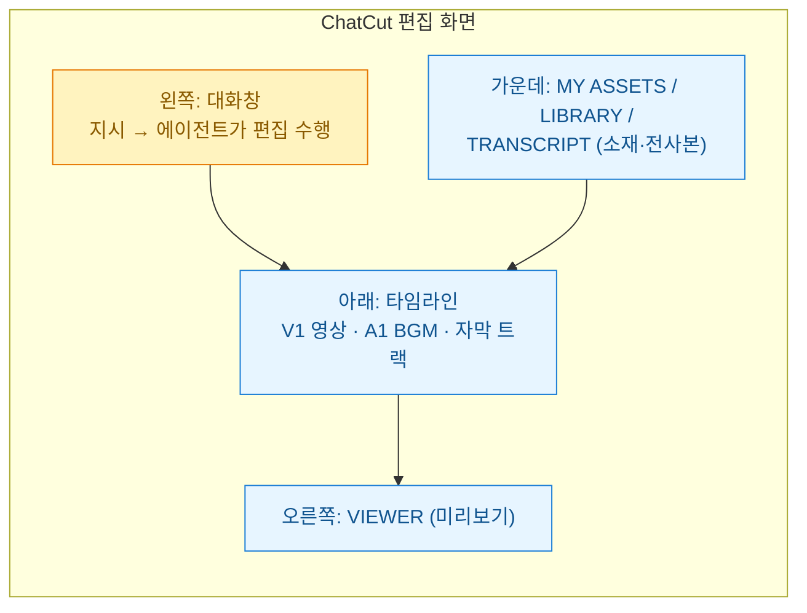
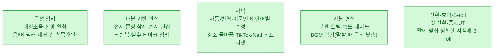
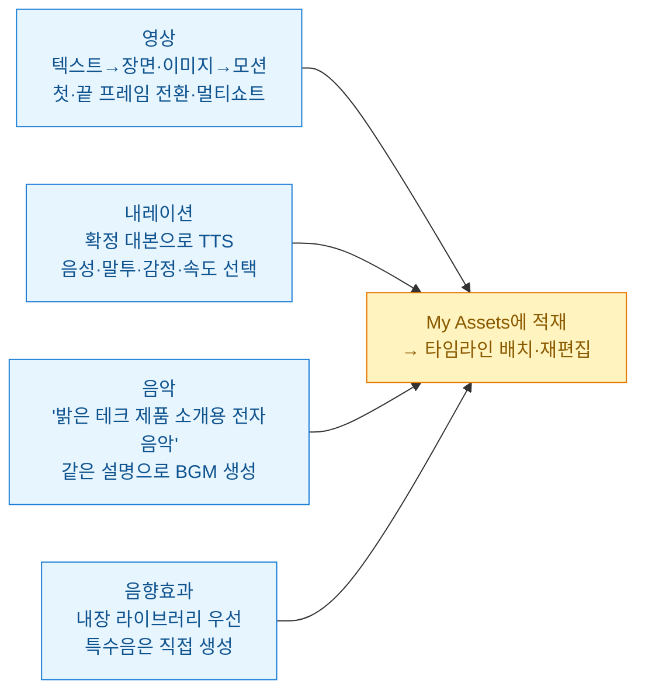
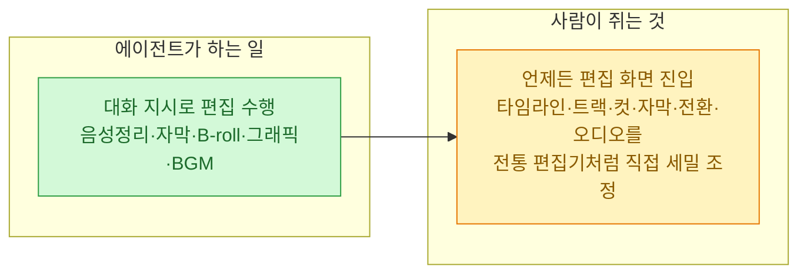

오늘 **ChatCut**(`app.chatcut.io`)을 처음 붙여봤다. 한 줄로 말하면 **"대화로 편집하는 영상 편집기"**다. 타임라인을 직접 자르고 붙이는 대신, 채팅으로 "여기 필러 빼고 자막 붙여줘" 하면 에이전트가 편집을 수행한다 — 마치 [[claude-code-agent-teams-orchestration|Claude Code가 코드]]를 다루듯 영상을 다룬다. [[capcut-vrew-srt-shorts-pipeline|CapCut·Vrew로 SRT·쇼츠]]를 굴려온 입장에서 결이 확 달라 정리해 둔다.

## 화면 구조부터 — 챗이 왼쪽, 타임라인이 아래

내가 연 프로젝트는 **"나의 첫 ChatCut 영상"**, 1920×1080·30fps 빈 타임라인에서 시작했다. 실제 편집 화면은 이렇게 나뉜다.

내 경우 V1 트랙에 강의 영상(part2, 5분 46초), A1에 BGM("쇼츠 BGM")을 얹고 **"Shorts 15초 하이라이트"** 타임라인을 따로 만드는 흐름이었다. 핵심은 **TRANSCRIPT 탭** — 영상이 문장으로 전사되어, 그 문장을 지우거나 옮기면 영상이 그대로 잘린다.

## 무엇을 할 수 있나 — 세 축

붙여보며 정리한 기능을 셋으로 나눴다.

### 1) 영상 편집 — 대본을 만지면 영상이 잘린다

제일 인상적인 건 **대본 기반 편집**이다. 파형을 보며 컷을 찾는 게 아니라, 전사된 텍스트에서 반복 발언·실수 테이크·군더더기를 **문장 단위로 지우면** 영상이 따라 잘린다. 필러('음', '어') 제거와 침묵 압축, BGM 덕킹(말할 때 음악을 자동으로 낮춤)도 지시 한 줄로 된다. B-roll은 업로드/스톡 미디어를 찾아 **말하는 내용에 맞는 시점**에 상단 트랙으로 얹어준다.

### 2) 모션 그래픽 — '굳은 영상'이 아니라 편집 가능한 에셋

제목 애니메이션, 로어 서드, 챕터 카드, 통계·숫자 강조, UI 콜아웃, CTA 등을 만든다. 여기서 중요한 차이 하나 —

> 모션 그래픽을 단순히 영상으로 **굳혀 넣는 게 아니라**, ChatCut 안에서 **편집 가능한 에셋**으로 만든다. 텍스트·색상·수치를 나중에 바꾸고, 타임라인에서 길이·위치·등장 시점을 조정하고, 같은 디자인을 반복 사용할 수 있다.

로고·브랜드 색·폰트를 주면 전체 그래픽의 시각 언어도 통일된다. 지원 플랜에선 **투명 배경(ProRes) 그래픽**으로 따로 출력도 된다 — 이건 다른 편집기와 합성할 때 크다.

### 3) 에셋 생성 — 영상·내레이션·음악·효과음을 만든다

생성물은 **My Assets**로 들어와 다시 타임라인에서 길이·음량·위치를 편집한다. ⚠️ 유료 생성은 시작 전 **크레딧 승인**이 필요할 수 있다(무분별한 과금 방지).

## 내가 제일 눈여겨본 것 — '챗 + 타임라인'의 이중 구조

ChatCut의 진짜 포인트는 여기 있다고 봤다.

에이전트가 대부분을 처리하되, **언제든 전통적인 편집기처럼 타임라인에 들어가 직접 조정**할 수 있다. 이게 왜 중요하냐면 — 오늘 정리한 [[own-the-outer-loop-human-at-the-boundary|아우터 루프]] 이야기와 정확히 같은 구조이기 때문이다. **에이전트가 인너 루프(편집 실행)를 돌리고, 사람은 최종 컷·자막·타이밍을 판정·소유한다.** 자동화가 편해도 마지막 손은 사람이 쥔다.

한 가지 현실적 관찰. 미리보기에서 자동 자막이 **"이 타 도메인 시스템으로 분석 경험을"**을 붙여 띄우는 걸 봤는데, ASR이 띄어쓰기·경계를 헷갈린 흔적이었다. 자동 자막은 **초안**이고, 단어별 수정으로 다듬는 게 맞다 — 그래서 '언제든 직접 조정'이 옵션이 아니라 필수다.

## 내 파이프라인에 어떻게 얹을까

내가 굴리는 [[youtube-analytics-driven-longform-split-upload|롱폼→분할 업로드]]와 [[retrospective-video-package|회고 영상 제작]] 흐름에 겹쳐 보면 자리가 보인다.

| 단계 | 기존(CapCut·Vrew·수작업) | ChatCut로 당길 수 있는 것 |
|---|---|---|
| 컷 편집 | 파형 보며 수동 컷 | **대본 기반 컷**(문장 삭제=컷) |
| 자막 | Vrew 자동+수정 | 자동+번역+프리셋, 단어별 수정 |
| 쇼츠화 | 별도 리사이즈·재편집 | 같은 프로젝트에 **세로 타임라인** 추가 |
| 인트로/자막바 | 템플릿 수동 | **편집 가능한 모션 그래픽 에셋** |
| BGM·효과음 | 스톡 검색 | 설명으로 **생성** + 덕킹 |

결론. ChatCut은 "영상판 대화형 에이전트 편집기"다. **소재 확인 → 구조·러닝타임 결정 → 본편 → 음성·자막 → B-roll·그래픽 → 음악·효과음 → 최종 검토** 순서로 단계를 함께 밟되, 어느 단계든 직접 타임라인으로 내려가 손볼 수 있다. 다음엔 실제 강의 영상 하나를 **15초 쇼츠 하이라이트**로 뽑는 과정을 처음부터 끝까지 기록해 보려 한다.

---

*ChatCut `app.chatcut.io` 첫 사용 기록(2026-07-13). 기능 설명은 편집기 내 안내와 실제 화면(프로젝트 '나의 첫 ChatCut 영상', V1 강의영상+A1 BGM, 'Shorts 15초 하이라이트' 타임라인) 기준으로 옮겼다. 유료 생성은 크레딧 승인이 필요할 수 있다.*
