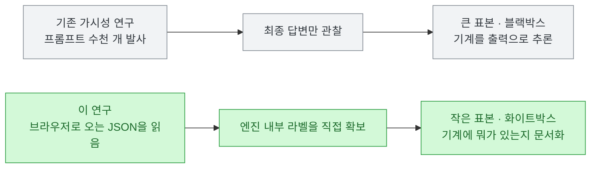
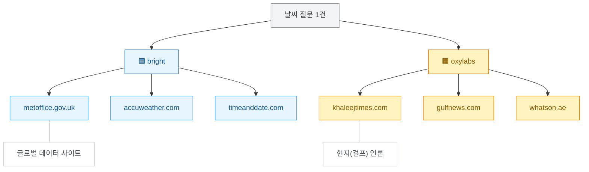
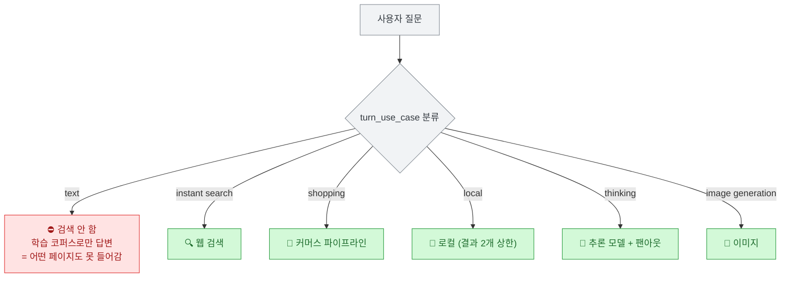
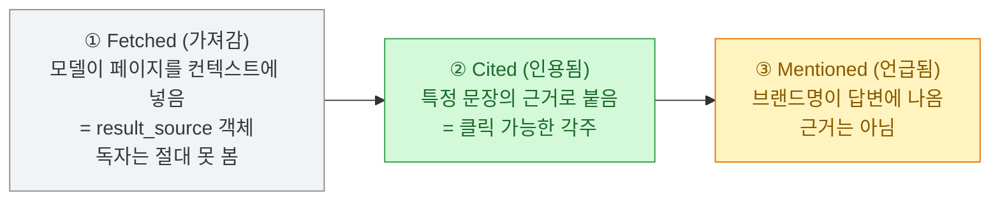
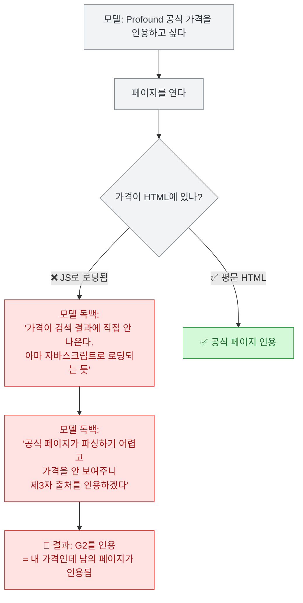
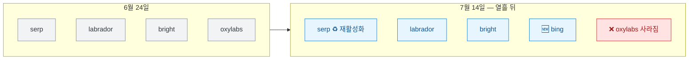

나도 같은 질문을 갖고 있었다. **내 글이 ChatGPT에 인용되려면 뭘 해야 하나.**

답은 늘 똑같이 돌아온다. 좋은 글 써라, 리스티클 만들어라, 레딧에 댓글 달아라. 그런데 그게 진짜 되는지는 아무도 모른다. 전문가가 전문가를 인용하고, 그게 다시 인용되면서 믿음으로 굳는다.

[Suganthan Mohanadasan](https://suganthan.com/blog/how-chatgpt-picks-sources/)은 다른 길로 갔다. **답변을 보지 않고, ChatGPT가 자기 브라우저로 보내는 JSON을 읽었다.** 며칠치 트래픽에서 출처 레코드 약 **1,240건**을 뽑았다.

그리고 열흘 뒤 [2편](https://suganthan.com/blog/how-chatgpt-picks-sources-part-2/)에서 **자기 결론 두 개를 스스로 뒤집었다.** 오늘 이 글을 쓰는 진짜 이유는 거기에 있다.

## 이 연구는 어떻게 한 건가?

먼저 방법부터. 이게 왜 중요하냐면, **이 연구가 뭘 증명할 수 있고 뭘 못 하는지가 여기서 갈리기** 때문이다.



⚠️ **패킷 스니핑이 아니다.** 저자가 이 대목을 솔직하게 적어서 좋았다. 처음엔 Wireshark를 켰는데 실패했다. **TLS로 암호화돼 있어서 본문이 전부 암호문**이다. ChatGPT 앱은 심지어 QUIC(HTTP/3)로 통신해서, 캡처가 흘리는 건 목적지 호스트명 정도다. 그래서 **읽을 수 있는 층은 브라우저 자신** — 복호화가 끝난 뒤의 DevTools Network 패널이다. 저자 표현대로 이건 **HTTP 인스펙션이지 패킷 스니핑이 아니다.**

그리고 저자가 신뢰도를 **두 층으로 명시적으로 갈라 놨다.** 이게 이 연구의 가장 좋은 점이다.

| 층 | 내용 | 신뢰도 |
|---|---|---|
| **구조적 사실** | `result_source`라는 필드가 존재한다 · 값이 뭐다 · `turn_use_case`가 몇 개다 · text 질문은 검색을 건너뛴다 | **높음** — 필드는 **한 번만 봐도 존재가 증명**된다 |
| **빈도 관찰** | "70%가 bright" · "레딧이 최다 인용" · "유튜브는 인용 0" | **방향만** — 계정 1개, 며칠, SaaS·기술 질문 편중 |

저자가 직접 쓴다 — **"이건 인구 조사가 아니다. 기계에 그런 게 있다는 것과, 기계가 그걸 뭐라고 부르는지를 문서화하는 것이다."**

✅ 나는 이 태도가 이 글의 값어치의 절반이라고 본다. 숫자를 크게 뽑을 수 있었는데 **"내 질문 선택이 결과를 편향시켰다"고 먼저 적었다.** 건강이나 패션 질문을 돌렸으면 다른 도메인이 1위였을 거라고까지 썼다.

## ChatGPT는 출처를 어디서 가져오나?

핵심 발견은 **`result_source`**다. 모든 웹 결과에 붙고, 답변에는 절대 안 보인다.

```json
{
  "attribution": "TechRadar",
  "url": "https://www.techradar.com/best/...",
  "snippet": "...",
  "pub_date": "2026-05-09",
  "result_source": "labrador"
}
```

값이 이렇게 갈린다.

| 값 | 정체 | 주로 뭘 가져오나 |
|---|---|---|
| `serp` | 열린 웹 기본선 | 뉴스 (Yahoo, StreetInsider) |
| `labrador` | 기성 매체 허용목록 | 로이터·가디언·WSJ·FT·위키피디아·arXiv. **스니펫이 약 1,080자** = 사실상 전문 추출 |
| `bright` | **Bright Data** (상용 스크래퍼) | 쇼핑·금융·날씨·로컬. 가장 많은 양 |
| `oxylabs` | **Oxylabs** (경쟁 스크래퍼) | 지역·로컬 언론 |

**`bright`와 `oxylabs`가 진짜 재밌는 쌍**이다. 둘 다 실존하는 **상용 웹 스크래핑 회사이고 서로 직접 경쟁자**다. 저자는 계약서를 본 게 아니니 "ChatGPT가 돈을 낸다"고는 안 쓰겠다고 하면서도, **열린 웹 수집이 이 둘을 통해 돌아가고 필드가 어느 쪽이 가져왔는지 알려준다**고 적었다.

날씨 질문 하나 안에서 갈리는 장면이 특히 선명했다.



**한 질문 안에서 글로벌은 bright가, 현지는 oxylabs가 가져왔다.** (저자는 두바이에 산다.)

## 어떤 질문은 아예 검색을 안 한다고?

이 대목에서 좀 놀랐다. **어떤 질문은 네트워크 검색이 아예 안 일어난다.**

ChatGPT는 검색 전에 질문을 **`turn_use_case`**라는 필드로 분류한다. 저자가 본 값은 6개 — `instant search`, `shopping`, **`text`**, `local`, `thinking`, `image generation`.

문제는 **`text`**다. 이걸로 분류되면 **검색을 안 하고 학습 데이터로 답하고 끝난다.**



당연한 것들은 그렇다 치자 — "타이어 어떻게 갈아요", "파이썬 함수 짜줘", "4개 언어로 번역해줘". 다 `text`로 가고 네트워크 탭이 비어 있었다.

**그런데 무서운 건 이거다.** 저자가 짚은 사례 — **"제2형 당뇨병 최신 치료 가이드라인"도 `text`로 갔다.** 최신성이 생명이고 위험도가 높은 질문인데 **검색을 안 하고 학습 데이터로 답했다.** 저자는 여기다 짧게 "No EEAT here. Oops!"라고 썼다.

⚠️ **의도적으로 최신 질문 10개를 던져서 3개가 이렇게 처리됐다.** (표본이 작으니 비율은 방향으로만 읽자.)

그리고 **주제가 아니라 표현이 분류를 정한다.**

| 질문 | 가는 곳 |
|---|---|
| "best coffee near me" | `local` |
| "best 4K TVs to buy" | `shopping` |
| "best 4K TVs **with reviews**" | 일반 검색 |
| "Tesla stock price this week" | `instant search` |

**"to buy"를 "with reviews"로 바꾸면 파이프라인이 통째로 바뀐다.** 같은 주제인데.

## 질문 하나가 몇 개로 갈라지나?

`thinking` 모델에게 제품 비교를 시키면, 질문 하나가 **서브쿼리 15~40개**로 갈라진다(빠른 모델은 1개로 끝난다).

실제로 돌아간 것 일부다.

```
"Profound AI search visibility pricing AI engines tracked 2026"
"site:peec.ai/pricing Peec AI Starter Pro Advanced 50 prompts 150 prompts"
"Peec AI pricing 95 245 495 official"      ← 가격을 추측한 뒤 확인하러 검색
"Scrunch AI pricing"                        ← 내가 안 물어본 도구를 중간에 발견해서 추가
```

여기서 셋이 눈에 띈다.

1. **벤더 가격 페이지에 `site:` 프로브를 직접 쏜다.**
2. **가격을 먼저 추측하고 그게 맞는지 검색해서 확인한다.**
3. **내가 언급도 안 한 경쟁 도구를 발견하면 그것도 쫓아간다.**

읽는 방식도 문자 그대로다. 페이지에서 **달러 기호·유로 기호·"99"·"Agency"를 `find`로 찾고**, 브라우징 도구의 open·click 명령으로 원하는 걸 끌어냈다. 내 화면의 에이전트가 아니라 **서버에서 돈다.**

## 가져간 것 · 인용한 것 · 언급한 것은 다르다

이게 사람들이 제일 많이 뭉개는 구분이라 정확히 적어야 한다.



**셋은 따로 놀고, 각각을 따로 이기거나 진다.** 인용 없이 언급될 수도, 언급 없이 인용될 수도 있다.

그 간격을 보여주는 숫자가 이거다(⚠️ 작은 표본·기술 편중).

| 도메인 | 가져감 | 인용됨 |
|---|---|---|
| Reddit | **278회** | **11회** |
| YouTube | **201회** | **0회** |

**유튜브는 201번 가져갔는데 한 번도 인용 안 됐다.** 저자의 설명이 기계적이라 설득력 있다 — **인용은 모델이 실제로 끌어온 텍스트에 묶여야 하는데, 검색에서 유튜브 페이지를 가져오면 메타데이터만 오지 영상 자막이 안 온다.** 레딧 스레드는 본문이 페이지에 전부 있다.

✅ 그리고 이건 저자 표본만의 얘기가 아니다. **Ahrefs가 ChatGPT 프롬프트 140만 건**에서 **레딧 1.93% vs 유튜브 0.51%**로 같은 격차를 찾았다. **표본이 작은 관찰이라도 메커니즘이 설명되고 대규모 연구와 방향이 맞으면 믿을 만하다** — 이게 이 글을 읽는 요령이다.

**그리고 여기가 나한테 제일 아팠다.** 결과는 **도메인 단위로 중복 제거(dedupe)**된다. 저자 표현 그대로 — **"얇은 페이지 20개는 1개로 접힌다."**

## 모델이 자기 입으로 뭘 말했나?

저자는 숨은 랭킹 점수를 찾다가 못 찾았다. 대신 **`thinking` 모델의 사고 과정이 대화에 저장돼 있어서, 모델이 자기 출처 전략을 평문으로 설명한 걸** 찾았다.

Ahrefs를 비교할 때는 공식 페이지를 읽고 **"가격 페이지가 더 최신인 것 같으니 그걸 인용해야겠다"**고 적었다.

그런데 다음이 이 글 전체의 핵심 장면이다.



**모델은 Profound와 Peec의 자기 가격을 원했다. 가격이 자바스크립트 뒤에 있어서 못 읽었고, 그래서 G2를 인용했다.** 내 사실인데, 남의 페이지에서.

저자의 정리가 날카롭다 — **"자바스크립트 가격표는 순위가 나쁜 정도가 아니라, 내 숫자를 G2에 넘겨준다."**

부수적으로 나온 것 둘.
- **`local_results_limit`이 2**로 박혀 있다. 로컬은 **톱2 아니면 없는 것**이다.
- **`personal_sources: ["convo_search", "gmail", "files"]`** — 답변 일부가 **최적화가 원천적으로 불가능한 개인 데이터**로 만들어진다. 두 사람이 같은 질문에 다른 답을 받는 이유 하나가 이거다.

## ⚠️ 그런데 열흘 만에 절반이 바뀌었다

**여기가 이 글을 쓰는 진짜 이유다.** 1편은 6월 24일, 2편은 **7월 14일**이다. 그 사이에 플랫폼이 움직였고, **저자가 자기 결론 두 개를 스스로 정정했다.**

| 저자의 원래 주장 | 2편의 정정 |
|---|---|
| "`labrador`는 **전국지를 가진 게 아니면 못 들어가는** 라이선스 클럽" | 🔴 **틀렸다.** labrador는 **무료 등급 계정에선 보편적인 기본 파이프**다. **작은 이탈리아 퍼블리셔도 들어간다.** 유료 계정에서 주요 매체로 좁혀질 뿐 |
| "트래픽 어디에도 **랭킹 점수가 없다**" | 🔴 **부정확했다.** **로컬 파이프라인에 `ranking_score` 슬롯이 있다**(두 테스트 모두 null이긴 했다). "점수가 없다"가 아니라 **"노출된 점수가 없다"**가 정확 |

**그리고 파이프라인 구성이 통째로 바뀌었다.**



⚠️ **`bing`은 모두에게 있는 게 아니다.** 독일 계정에서는 재현됐는데, 저자 본인의 UAE Plus 계정에서는 **결과 595건 중 0건**이었다. 저자는 이걸 **코호트 게이팅**(사용자 집단별 선택 배포)으로 읽는다. **즉 "내 트래픽에 없다"가 "존재하지 않는다"가 아니다.**

**새로 찾은 것 둘도 크다.**

- **숨은 시스템 메시지 2개** — `identity_prompt`와 `sources_and_filters_prompt`. **둘 다 브라우저로는 빈 채로 온다.** 내용은 OpenAI 서버를 안 떠난다. 저자는 **대화 30건에서 슬롯 64개**를 확인해 **존재는 증명했지만 읽지는 못했다.** 다만 **실행은 관찰된다** — 재작성된 질의에 "Emirates official", "AhrefsBot official" 같은 출처 유형 지정이 붙는다.
- **`supporting_websites`** — 인용마다 **같은 주장을 뒷받침했지만 선택되지 않은 경쟁 페이지 배열**이 붙는다. 저자 표현이 좋다 — **"이제 와이어가 주장 단위로, 누가 나를 이겼고 내가 누구를 이기고 있는지 정확히 보여준다."**

**살아남은 것도 명확하다:** 질의 재작성과 출처 유형 조종, 주장 단위 인용 결합 + 도메인 중복제거, 사실은 공식 페이지·의견은 리뷰/레딧. 그리고 **labrador 스니펫 비대칭은 오히려 강해졌다 — 1,217자 대 153자.**

## 그래서 내 블로그엔 뭘 바꾸나?

정리하고 나니 세 개가 남는다. 그중 하나는 내 실측과 정확히 맞물렸다.

**첫째, 대량 발행이 왜 안 통했는지 설명이 됐다.** [어제 GSC 진단](https://dbhyeong.github.io/blog/ai-llm-it-news-2026-07-16)에서 사이트맵 291개 중 실제 노출은 56개(19%)뿐이고, **글을 배치로 많이 쓴 게 노출 커버리지를 못 늘렸다**는 게 실측으로 나왔다. 이 글의 **도메인 단위 중복제거**가 그 메커니즘이다. **얇은 페이지 20개는 1개로 접힌다.** 주장 하나당 강한 페이지 하나가 낫다. 글감을 소진하는 식의 발행은 GEO 관점에서도 헛돈다.

**둘째, 나는 운 좋게 이미 통과한 게 하나 있다.** 이 사이트는 Quartz라 **전부 정적 HTML로 빌드**된다. 가격표를 JS로 띄우다 G2에 뺏기는 함정이 구조적으로 없다. **평문 HTML에 사실을 두라**는 조언은 나한텐 이미 충족돼 있었다. 다행이지만 자랑은 아니고, 그냥 정적 사이트 생성기를 쓴 부수 효과다.

**셋째, "나를 내가 인용할 수 없다"가 백링크 우선 진단과 같은 말이었다.** 저자 표현대로 **나에 대한 주장은 남의 페이지에서 인용된다.** 사실은 내 페이지에서 읽어가고 **의견은 남의 페이지에서 가져간다.** 내 GSC 진단이 "콘텐츠 추가보다 백링크가 먼저"였는데, GEO 쪽에서도 결론이 같다. **깨끗하게 읽히는 페이지 + 제3자 커버리지 0 = 내 사실은 읽히고 추천은 남이 받는다.**

**그리고 방법론에서 하나 더.** 오늘 나는 이 글을 옮기려다 하단의 후속편 링크를 보고 멈췄다. 열어보니 **파이프라인 목록이 이미 낡아 있었다**(oxylabs 삭제, bing 추가). **1편만 읽고 썼으면 나는 2주 지난 정보를 퍼뜨리는 사람이 됐을 거다.** 확인하는 데 5분 걸렸다.

⚠️ 마지막으로 읽는 법. 저자 본인이 제일 정확하게 적었다 — **"내 것을 포함해서, 이 전부를 주 단위로 바뀌는 시스템의 스냅샷으로 다뤄라. 구조는 유지된다. 숫자는 움직인다."** 그리고 랭킹 점수 얘기 — **"ChatGPT의 랭킹 요소를 팔겠다는 사람은 뱀기름을 파는 것"**이라는 문장은, 2편에서 `ranking_score` 슬롯을 찾아 스스로 누그러뜨렸다는 것까지 같이 알아야 공정하다.

✅ 자기 글을 열흘 만에 고친 사람의 글이라, 나는 오히려 더 믿는다.
