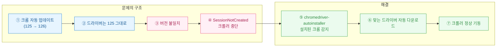
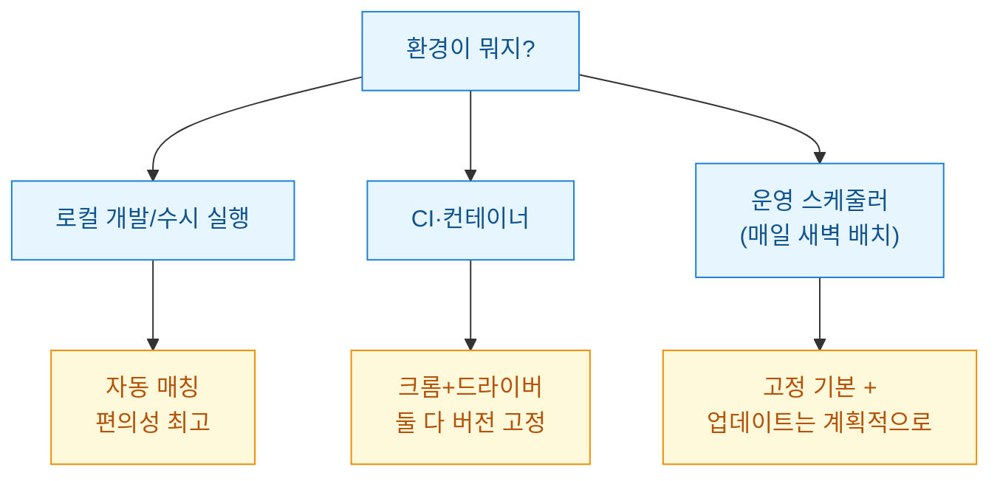
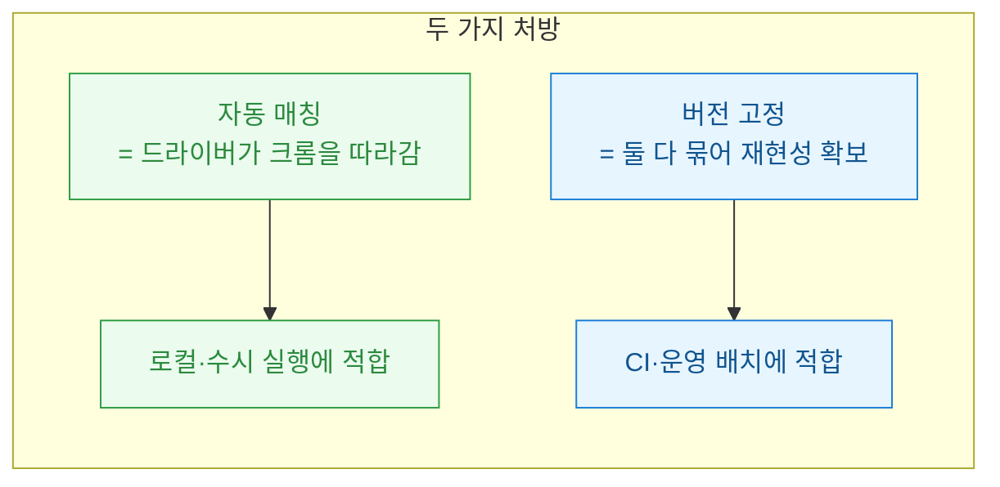

새벽 3시에 돌던 크롤러가 또 죽었다. 로그를 열어보니 익숙한 그 문장이다. `SessionNotCreatedException: This version of ChromeDriver only supports Chrome version 125`. 어제까지 멀쩡했는데, 크롬이 밤사이 조용히 126으로 올라간 것이다. 나는 아무것도 안 했다. 크롬이 혼자 업데이트했고, 드라이버는 그대로 남아 궁합이 어긋났다. 이걸 **버전 지옥(version hell)**이라고 부른다. 오늘은 이 지옥에서 내가 어떻게 빠져나왔는지 적어둔다.



## 왜 크롬이 올라갈 때마다 드라이버가 깨지나?

핵심은 **셀레니움(Selenium)**이 크롬을 직접 조종하지 못한다는 데 있다. 사이에 **크롬드라이버(chromedriver)**라는 통역사가 끼어 있고, 이 통역사는 자기가 맞춰진 크롬 **메이저 버전(major version)**하고만 대화한다.

| 구성요소 | 역할 | 버전 민감도 |
|---|---|---|
| **크롬(Chrome)** | 실제 브라우저 | 자동 업데이트로 수시로 오름 |
| **크롬드라이버(chromedriver)** | 셀레니움 ↔ 크롬 통역 | 크롬 메이저 버전과 정확히 일치해야 함 |
| **셀레니움(Selenium)** | 파이썬에서 명령 | 상대적으로 관대함 |

문제는 크롬은 알아서 올라가는데 드라이버는 내가 넣어둔 그 자리에 화석처럼 남아 있다는 것이다. 둘의 메이저 버전이 어긋나는 순간 세션 생성이 실패한다. 수동으로 매번 드라이버를 다운받아 교체하는 건, 크롤러가 하나면 몰라도 여러 대면 사람이 할 짓이 아니다.

## chromedriver-autoinstaller는 무엇을 대신해 주나?

이름 그대로다. **지금 이 PC에 깔린 크롬 버전을 읽고 → 거기에 맞는 드라이버를 받아 → 경로에 꽂아준다.** 내가 하던 수동 3단계를 함수 한 줄이 처리한다.

```python
import chromedriver_autoinstaller
from selenium import webdriver

# 설치된 크롬 버전을 감지해 맞는 드라이버를 내려받고,
# 그 드라이버가 있는 경로를 반환한다. 이미 맞으면 그냥 넘어감.
chromedriver_autoinstaller.install()

driver = webdriver.Chrome()   # 이제 버전 걱정 없이 바로 기동
driver.get("https://example.com")
print(driver.title)
driver.quit()
```

`install()`은 똑똑하게 동작한다. 이미 맞는 드라이버가 있으면 다시 받지 않고, 크롬이 126으로 올라간 뒤 처음 호출되면 그때 126용 드라이버를 새로 받는다. 즉 **크롬이 올라가면 다음 실행에서 드라이버도 알아서 따라 올라간다.** 새벽에 죽던 크롤러가 이 한 줄로 조용해졌다.

> 참고로 `selenium 4.6+`에는 **셀레니움 매니저(Selenium Manager)**가 내장돼 비슷한 자동 매칭을 해준다. 다만 오래된 코드베이스나 세밀한 제어가 필요할 때 `chromedriver-autoinstaller`가 여전히 편해서 나는 둘을 상황 따라 쓴다.

## 그럼 무조건 자동이 답인가 — 고정 vs 자동, 뭘 골라야 하나?

여기서 한 번 멈춰야 한다. 자동 매칭이 만능은 아니다. **CI**나 **스케줄러** 같은 무인 환경에서는 오히려 **버전 고정(pin)**이 안전할 때가 있다. 자동 다운로드는 매 실행마다 외부 서버에 의존하기 때문이다. 그 서버가 잠깐 느리거나 막히면, 잘 돌던 파이프라인이 네트워크 문제로 실패한다.



내가 정리한 판단 기준은 이렇다.

| 상황 | 추천 | 이유 |
|---|---|---|
| 내 노트북에서 개발/디버깅 | **자동 매칭** | 크롬 자동 업데이트 따라가기 편함 |
| 도커/**CI** 파이프라인 | **고정(pin)** | 재현성(reproducibility)·외부 의존 최소화 |
| 매일 새벽 배치 | **고정 + 계획적 갱신** | 예측 못 한 실패 방지, 갱신은 사람이 통제 |

컨테이너라면 크롬과 드라이버를 **이미지 빌드 시점에 같은 버전으로 박아** 넣는 게 정석이다. 크롬을 `apt`로 특정 버전 고정하고, 드라이버도 그 버전에 맞춰 넣으면 런타임에 다운로드가 없어 빠르고 조용하다. 대신 크롬 보안 업데이트를 반영하려면 이미지를 주기적으로 다시 빌드해야 하는데, 이건 **버그가 아니라 통제**다. "언제 올릴지 내가 정한다"는 것.

## 자동 매칭을 쓰더라도 챙겨야 할 안전장치는?

자동을 쓰기로 했어도 무방비로 두진 않는다. 몇 가지 방어선을 깔아둔다.

```python
import chromedriver_autoinstaller
from selenium import webdriver
from selenium.webdriver.chrome.options import Options

def build_driver(retries: int = 2):
    for attempt in range(1, retries + 1):
        try:
            # 다운로드 서버가 잠깐 죽어도 재시도로 버틴다
            chromedriver_autoinstaller.install()
            opts = Options()
            opts.add_argument("--headless=new")   # 서버엔 화면이 없음
            opts.add_argument("--no-sandbox")
            return webdriver.Chrome(options=opts)
        except Exception as e:
            print(f"[시도 {attempt}] 드라이버 준비 실패: {e}")
    raise RuntimeError("드라이버 초기화 최종 실패")
```

- **재시도(retry)**: 외부 다운로드는 언젠가 실패한다. 몇 번 다시 시도하도록 감싼다.
- **버전 로깅**: `driver.capabilities`에서 크롬/드라이버 버전을 로그로 남긴다. 나중에 "그날 뭐가 올라갔지"를 추적하기 위해서다.
- **헤드리스(headless) 옵션**: 서버엔 화면이 없으니 필수.
- **알림**: 초기화가 최종 실패하면 조용히 죽지 말고 나에게 메시지가 오게 한다.

## 결국 무엇을 얻었나?

버전 지옥의 본질은 "**크롬은 자동으로 변하는데 드라이버는 안 변한다**"는 비대칭이다. 해결책은 둘 중 하나로 그 비대칭을 없애는 것이다. **자동 매칭**으로 드라이버를 크롬에 따라붙게 하거나, **고정**으로 둘 다 못 움직이게 묶거나.



나는 지금 노트북에선 자동 매칭, 운영 배치에선 고정으로 나눠 쓴다. 새벽 3시 알림이 사라진 뒤로 이 판단은 옳았다고 믿는다. 크롤러가 죽는 이유가 "내 코드"가 아니라 "환경의 변화"일 때, 그 변화를 누가 통제하느냐를 정하는 게 진짜 해법이었다.
