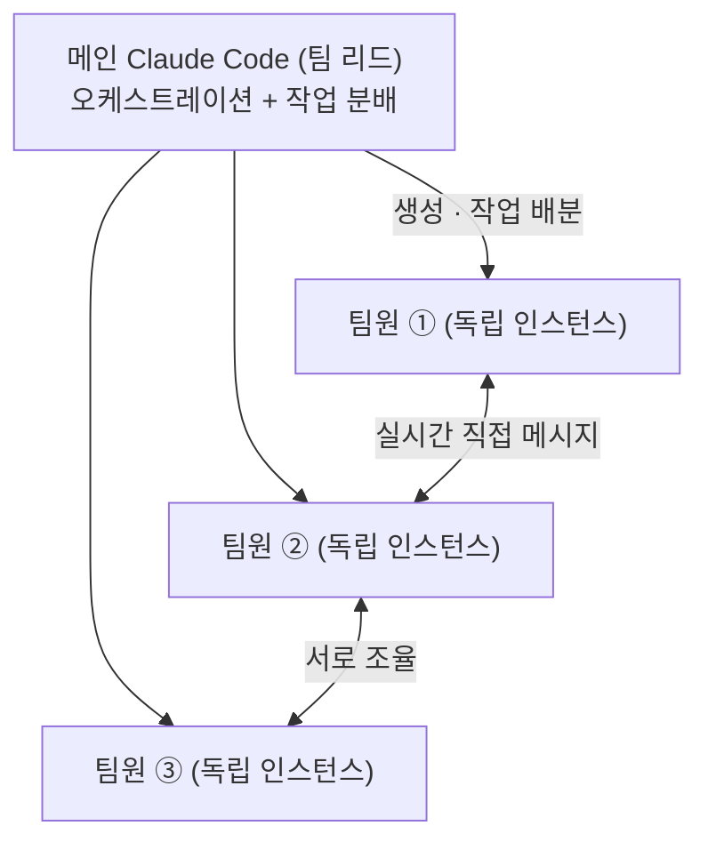
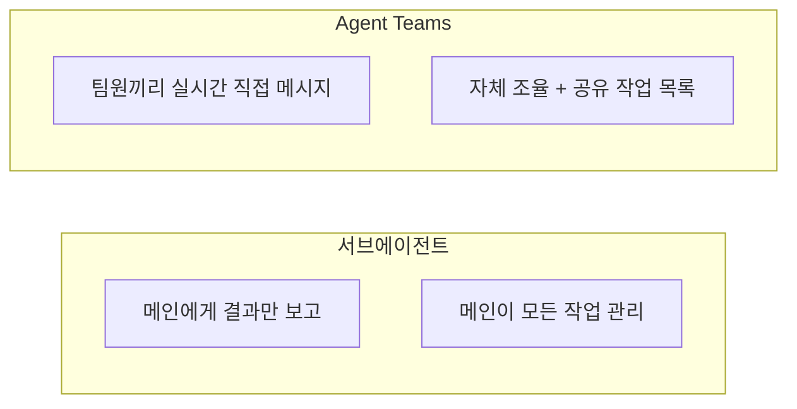
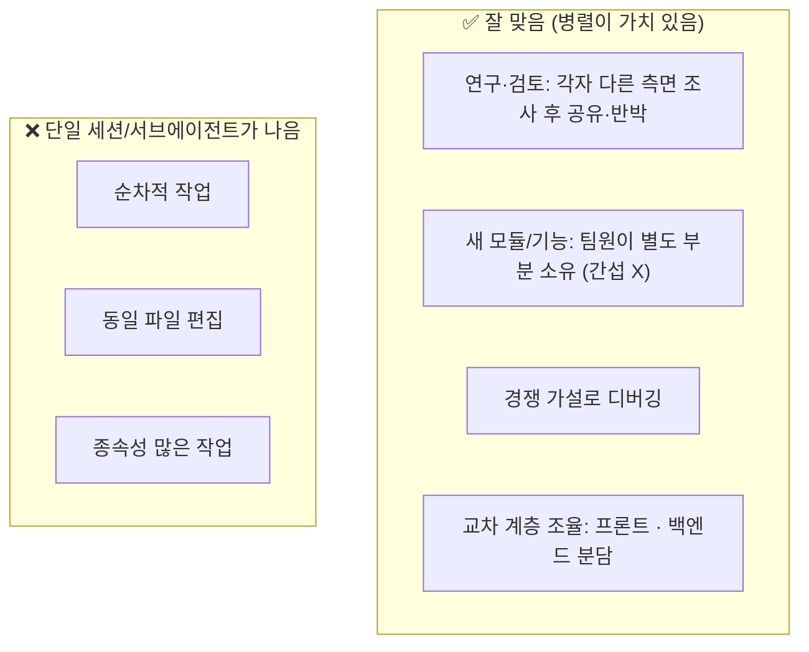
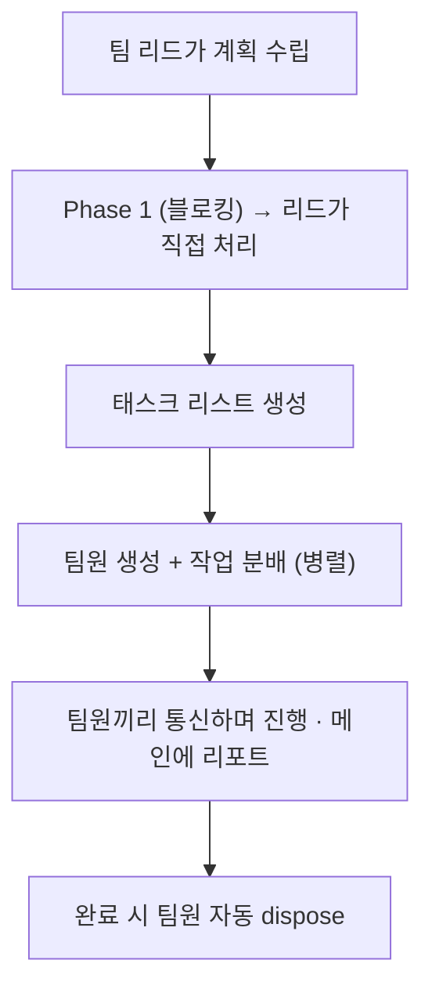

서브에이전트를 쓰다 보면 늘 아쉬운 게 하나 있었다. **일단 작업이 시작되면 그 친구를 다시 건드릴 수가 없다.** 결과만 받아볼 뿐, 중간에 끼어들거나 다른 팀원과 의논시킬 방법이 없었다. 그런데 Opus 4.6과 함께 **Agent Teams**가 공식 지원되면서 이 벽이 깨졌다. 코드팩토리 영상을 보고 직접 세팅해본 기록이다.

먼저 구조부터. 메인 Claude Code 하나가 **독립된 Claude Code 인스턴스 여러 개**를 팀으로 띄우고, 그걸 한 곳에서 지휘한다.



> **오케스트레이션**이란? 지휘자가 악기 파트를 나눠주듯, *여러 일꾼에게 역할을 배분하고 진행을 조율*하는 것이다. 서브에이전트가 '심부름 보내고 결과 받기'였다면, Agent Teams는 '팀을 꾸려 같이 일하기'에 가깝다.

## 서브에이전트와 정확히 뭐가 다른가?

이름이 비슷해서 헷갈리기 쉬운데, 결정적 차이는 **통신과 조율**이다.



| 구분 | 서브에이전트 | Agent Teams |
|---|---|---|
| 컨텍스트 | 자기만의 윈도우 | 자기만의 윈도우(완전 독립) |
| 통신 | 메인에게 **결과만** 보고 | 팀원끼리 **실시간 직접 메시지** |
| 조율 | 메인이 전부 관리 | **자체 조율** + 공유 작업 목록 |
| 최적 용도 | 결과만 중요한 집중 작업 | **논의·협업**이 필요한 복잡한 작업 |
| 토큰 비용 | 상대적으로 낮음 | **훨씬** 높음 |

독립 인스턴스라 각자 대화창이 따로 생기고, 내가 특정 팀원에게 **직접** 작업을 던질 수도 있다. 이게 서브에이전트엔 없던 자유도다.

## 언제 쓰고, 언제 쓰면 안 되나?

공식 문서가 정리한 적합/부적합 케이스가 핵심이다. 한 문장으로 줄이면 — **병렬 탐색이 실질적 가치를 더할 때만.**



부적합한 이유는 두 가지다. 단일 세션이 컨텍스트를 더 정확하고 빠짐없이 받고, 팀 조율 오버헤드 때문에 **단일 세션보다 훨씬 많은 토큰**을 쓴다. 에이전트 4개를 병렬로 띄우면 좋긴 하지만, 대략 4배의 토큰을 각오해야 한다는 뜻이다. (이건 뒤에서 다시.)

## 어떻게 켜나? (settings.json + tmux)

experimental 기능이라 세팅이 좀 필요하다. `settings.json`(유저 또는 프로젝트 단위)에 두 줄을 더한다.

```json
{
  "experiments": { "agentTeams": 1 },
  "teammateMode": "tmux"
}
```

`teammateMode`는 두 가지다.

- **`in-process`**: 한 창에서 백그라운드처럼 돌고 `Shift+↑/↓`로 팀원 전환
- **`tmux`(=split pane, 추천)**: 팀원이 생길 때마다 창을 분할 생성 → 직접 보고 직접 타이핑

세팅이 안 먹을 때를 대비해 실행 플래그로 강제할 수도 있다(베타라 가끔 설정이 무시된다).

```bash
# tmux 먼저 설치한 뒤
claude --dangerously-skip-permissions --teammate-mode tmux
```

> **tmux**란? 터미널 하나를 여러 패널로 쪼개 쓰는 도구다. 패널을 프로그래밍적으로 만들 수 있어 Claude가 자동으로 창을 컨트롤하기 좋다. 다만 macOS에서 가장 잘 돌고 — 나는 Windows라 여기서 솔직히 좀 걸렸다. **기능 자체는 동작하지만 split pane 표시가 불안정**해서, 그럴 땐 in-process 모드로 보거나 메인을 재실행하며 "split pane으로 구현해줘"라고 다시 시키면 대개 됐다.

## 실전에선 어떤 순서로 흘러가나?

핵심 팁부터. 그냥 "팀으로 작업해줘"라고 하면 **서브에이전트를 만들어버리는** 경우가 많다. 계획 단계부터 팀원을 고려하게 시키고, **공식 문서 링크를 같이 주는 것**이 제대로 트리거될 확률을 높인다(너무 새 기능이라 모델이 헷갈린다).

```text
개발자 블로그를 만들 거야. 어떤 작업을 병렬로 할 수 있는지,
팀메이트는 어떻게 구성해야 하는지 계획해줘.
그리고 이 링크의 Agent Teams 문서를 확인하고 거기 맞게 계획해줘: <docs 링크>
```

그러면 진행은 이렇게 흐른다.



소소하지만 중요한 디테일 둘. **팀 이름을 정해주는 게 생각보다 중요**한데, 결국 다 *파일로 저장*되기 때문에 그 이름으로 나중에 다시 불러와(resume) 이어 작업할 수 있다. 그리고 베타라 세팅이 가끔 안 먹으니, 안 되면 메인을 exit 후 재실행하면 보통 잡힌다.

> 곁다리지만 유용한 사실 — 이제 **태스크 ID가 글로벌**로 관리된다. 여러 Claude Code 인스턴스를 띄우고 같은 태스크 ID를 주입하면, 굳이 Agent Teams를 안 써도 서로 통신·조율하게 만들 수 있다. Anthropic이 애초에 이런 협업을 염두에 뒀고, "메인에서 한 번에 지휘하는" 부분이 이번에 처음 공식화된 셈이다.

## 그래서 토큰은 얼마나 더 드나?

여기는 솔직하게 짚고 가야 한다. 공식 문서도 *"훨씬 더 많은 토큰을 쓴다"*고 못 박는다. 팀원 N명이면 단순히 N배가 아니라, **거기에 조율 오버헤드까지** 얹힌다. 원래 Claude Code에서 비싼 축이던 서브에이전트보다도 더 든다.

그러니 비싼 요금제가 아니라면, "병렬이 진짜 가치 있는 작업"인지부터 따지는 게 맞다. 순차적이거나 같은 파일을 만지는 일이면 그냥 단일 세션이 싸고 정확하다.

## 그래도 한 번은 직접 띄워보길

독립적인 여러 작업을 병행하고 싶다면 Agent Teams는 확실히 강력하다. 특별히 그럴 일이 없더라도, **일단 한 번 띄워봐야** 어떤 상황에 쓸지 피부로 안다. 터미널 켜고 아무 폴더에서나 실행해보면 한 방에 감이 온다 — 단, 토큰은 각오하고.

> 같이 보면 좋은 글: [[claude-code-dynamic-workflow-deepresearch-vs-ultracode|딥리서치·울트라코드·Goal, 언제 뭘 쓰나]] · [[openai-codex-maxxing-long-running-work|Codex-maxxing 백서]]

---

*이 글은 코드팩토리 채널의 [How to Make Today's Hottest Claude Code 10x Smarter! Claude Code Teams](https://www.youtube.com/watch?v=Gb2VMWrUmZ0) 영상을 보고 직접 세팅해보며 정리한 것입니다. experimental 기능이라 동작·UI가 업데이트로 달라질 수 있습니다.*
