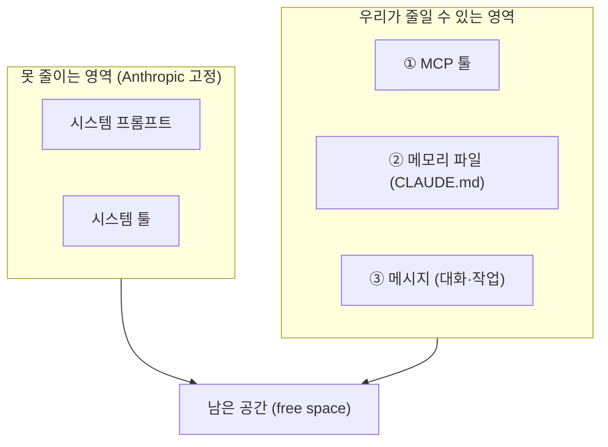
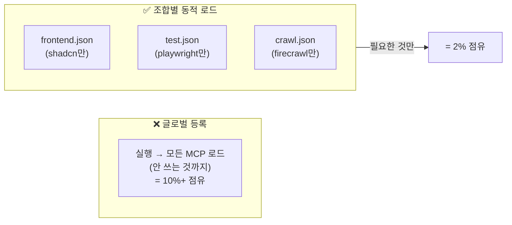
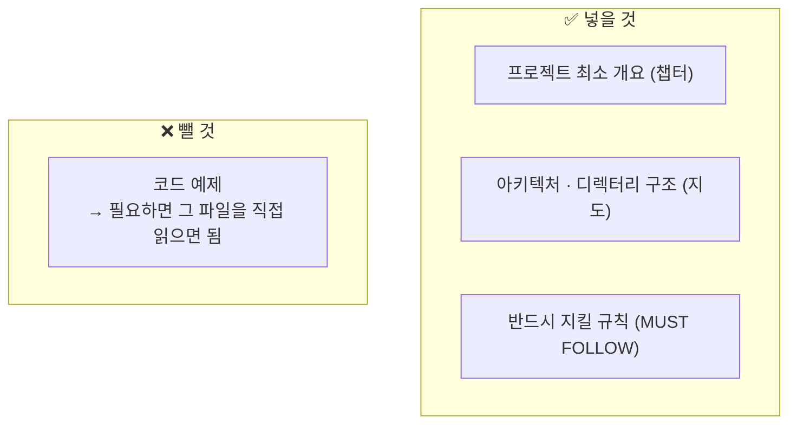
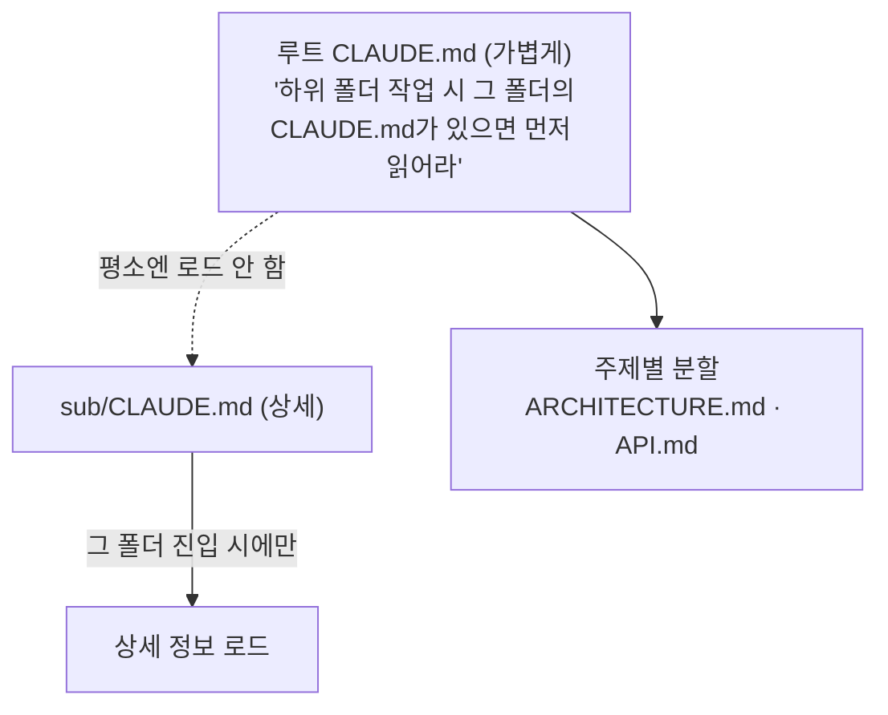
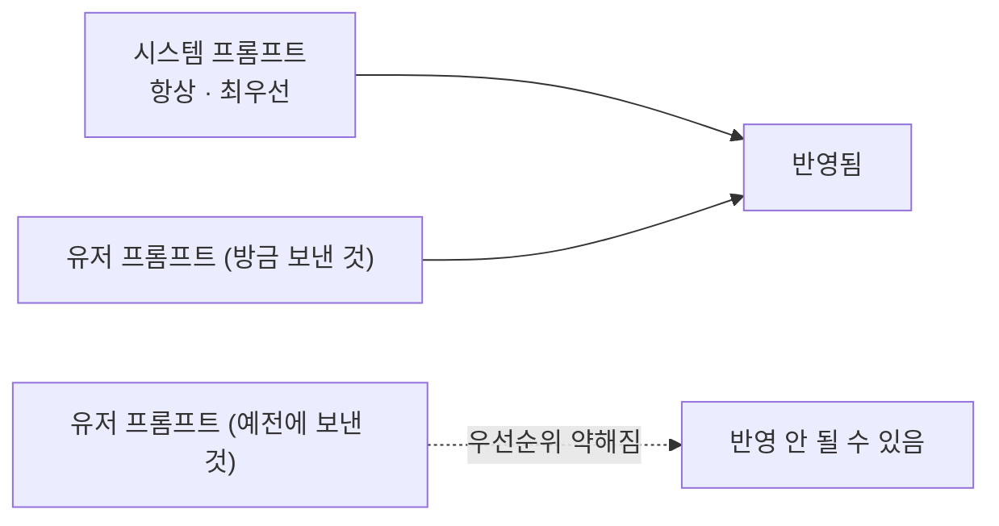

솔직히 나는 컨텍스트가 부족해서 답답했던 적이 별로 없다. 그런데 자동화 워크플로를 누가 따라 하다 "이거 토큰을 왜 이렇게 먹냐"고 묻는 걸 몇 번 듣고 나니, 한 번은 제대로 정리해두고 싶었다. 코드팩토리 영상 하나를 보고 직접 `/context`를 찍어가며 따라 해봤는데, 의외로 *시작하자마자 절반이 차 있는* 장면부터가 충격이었다.

먼저 전체 그림부터. 컨텍스트를 차지하는 영역은 다섯 덩어리이고, 우리가 손댈 수 있는 건 그중 **세 곳**이다.



> **컨텍스트 윈도우**란? 모델이 *한 번에 들고 있을 수 있는 글의 총량*이다. 책상 넓이라고 보면 된다 — 넓어도 잡동사니로 덮으면 정작 일할 자리가 없다. Claude Code는 현재 **200K 토큰**(1M는 API 전용)이라, 책상이 생각보다 좁다.

## 왜 한 줄도 안 시켰는데 절반이 차 있을까?

`/context`를 실행하면 지금 무엇이 책상을 덮고 있는지 색깔로 보여준다. 시스템 프롬프트·시스템 툴은 Anthropic이 박아둔 거라 못 건드린다. 문제는 **MCP 툴과 메모리 파일**이 생각보다 자리를 많이 먹는다는 것. 내 경우엔 MCP 몇 개 + CLAUDE.md만으로 이미 30~40%가 차 있었다.

그러니 작전은 단순하다. **손댈 수 있는 세 곳을 다이어트**하는 것. 하나씩 보자.

## MCP는 왜 '항상 켜두면' 손해일까?

가장 먼저 줄일 곳이 MCP다. 결론이 좀 역설적인데 — **MCP를 글로벌하게 전부 등록해두지 마라.**

> **MCP**(Model Context Protocol)란? 에이전트에게 *손발을 달아주는 플러그인*이다. 검색·크롤링·UI 생성 같은 외부 능력을 붙인다. 나도 [예전에 MCP 4개를 붙이는 글]([[claude-code-mcp-servers-github-pat-oauth-dcr-fix|GitHub MCP를 PAT로 뚫은 기록]])을 썼는데, 그땐 "붙이는 법"만 신경 썼지 "켜두는 비용"은 생각 못 했다.

핵심은 MCP를 **세션 내내 쓰는 게 아니라는 점**이다. UI 만들 때만 shadcn, 테스트할 때만 Playwright, 크롤링할 때만 Firecrawl을 쓴다. 그런데 실행할 때마다 전부 로드하면, 안 쓰는 도구의 설명서까지 책상에 펼쳐둔 꼴이다.



방법은 MCP 설정을 조합별로 쪼개 두고, 실행할 때 명시적으로 지정하는 것이다.

```bash
# 이번 세션엔 shadcn MCP만 로드
claude --dangerously-skip-permissions \
  --mcp-config shadcn-mcp.json \
  --strict-mcp-config
```

`--mcp-config`로 쓸 파일을 고르고, `--strict-mcp-config`를 붙이면 **딱 그 파일에 적힌 것만** 올라온다. 직접 찍어보니 MCP 영역이 10%대에서 2%까지 떨어졌다. 자주 쓰는 조합(`frontend`·`test`·`crawl`)을 미리 파일로 만들어두면, 세션마다 필요한 것만 골라 켜면 된다.

## CLAUDE.md엔 뭘 넣고 뭘 빼야 할까?

두 번째는 메모리 파일이다. CLAUDE.md는 세션마다 **무조건 로드**되는 파일이라, 길수록 매번 손해를 본다. 직접 보니 내 프로젝트 메모리 파일 하나가 1만 4천 토큰을 먹고 있었다.

가장 흔한 실수가 여기에 코드 예제와 온갖 설명을 다 쑤셔 넣는 것이다. CLAUDE.md는 **'내용 창고'가 아니라 '인덱스'**여야 한다 — 책 맨 뒤의 '찾아보기'처럼.



코드 예제는 빼라. Claude가 정말 예제가 필요한 수준까지 가면 그 파일을 직접 열어 읽으면 그만이다. 굳이 책상에 상주시킬 이유가 없다.

여기에 한 가지 습관을 더 얹었다. **커밋 직전에 요약시키기.**

```text
@CLAUDE.md 확인하고, 잃어버리는 내용 없이 최대한 요약해서 다시 작성해줘
```

이러면 의미는 그대로 두고 글자 수만 줄여준다. 평소엔 필요한 걸 일단 넣어두고, 커밋 전에 한 번 훑어 *지울 건 지우고 + 나머지는 요약*. 이것만으로 200줄짜리가 100줄대로 내려갔다.

그리고 나중에 안 사실 하나 — **CLAUDE.md가 꼭 하나일 필요도, 이름이 꼭 그것일 필요도 없다.**



루트엔 가벼운 인덱스만 두고, "특정 하위 폴더에서 작업할 때 그 폴더의 메모리 파일을 반드시 먼저 읽어라"는 규칙(가능하면 `CRITICAL` 키워드)을 넣어둔다. 그러면 **그 폴더에 들어갈 때만** 상세 정보가 따라온다. 주제별로 `API.md`처럼 쪼개 "API 작업 시 API.md를 읽어라"라고 명시하는 것도 같은 결의 한 단계 더 정교한 버전이다.

## 반복 지시는 어디에 박아야 안 사라질까?

세 번째는 좀 의외였다. 프롬프트에도 **우선순위**가 있다는 것.



"한국어로 답해라" 같은 지시를 매 프롬프트마다 반복하면, **중복 토큰**이 계속 쌓이는 데다 예전에 넣은 건 우선순위가 약해져 무시되기도 한다. 같은 지시를 **시스템 프롬프트에 한 번만** 박아두면 훨씬 깔끔하다.

Claude Code에서 시스템 프롬프트를 합법적으로 건드릴 수 있는 거의 유일한 통로가 **Output Style**이다.

```text
/output-style new
```

로 새 스타일을 만들면 `.claude` 폴더에 마크다운으로 저장되고, 거기 적은 내용은 **시스템 프롬프트로 들어간다.** `All responses must be in Korean`을 넣고 적용하면, 영어로 `hello`라고 쳐도 "안녕하세요"가 돌아온다. 정말 절대 지켜야 할 프로젝트 규칙을 여기 박거나, *UI 만들 때 / 백엔드 만들 때*용 스타일을 따로 두고 전환하면 같은 지시를 반복할 필요가 없어진다.

## 무거운 작업은 어떻게 컨텍스트를 안 터뜨리고 돌릴까?

마지막은 서브에이전트다. 서브에이전트를 생성하면 그 친구는 **독립된 200K 컨텍스트**를 따로 갖는다. 메인과 분리되어 일하고, 끝나면 **결과만 보고**한다.


`/context`로 보면 서브에이전트가 도는 동안 토큰 사용이 그쪽으로 옮겨가는 게 눈에 보인다. 메인은 지휘만 하고 무거운 일은 서브에 넘기면, 오래 작업해도 메인 책상이 안 터진다. 특히 **테스트·빌드·린팅**처럼 규격이 정해지고 독립적인 작업은 서브에이전트를 안 쓸 이유가 없다.

## 결국 핵심은 뭔가?

네 가지(MCP 최소화 · CLAUDE.md 슬림화 · Output Style · 서브에이전트)를 섞으면 200K는 사실 부족하지 않다. 200K면 코드 약 7만 줄인데, 어떤 작업에 7만 줄을 한 번에 읽혀야 한다면 — 솔직히 **작업을 너무 크게 잡은 것**이다.

직접 해보고 내린 결론은 좀 김이 빠지지만 분명하다. **컨텍스트가 커진다고 잘 쓰는 게 아니다.** 진짜 핵심은 200K 안에서 끝낼 크기로 *작업을 잘게 쪼개는 습관*이고, 위 네 가지는 그걸 거드는 도구일 뿐이다. 그리고 이 원리는 Cursor·Codex에도 그대로 옮겨 붙는다.

> 같이 보면 좋은 글: [[claude-code-mcp-servers-github-pat-oauth-dcr-fix|Claude Code에 MCP 4개 붙이기]]

---

*이 글은 코드팩토리 채널의 [Cloud Code Token, Context Window Optimization Strategy](https://www.youtube.com/watch?v=L33W1JEGGSU) 영상을 보고 직접 따라 해보며 내 식으로 정리한 것입니다. 기능·UI는 Claude Code 업데이트로 달라질 수 있습니다.*
