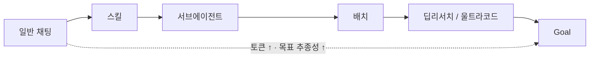
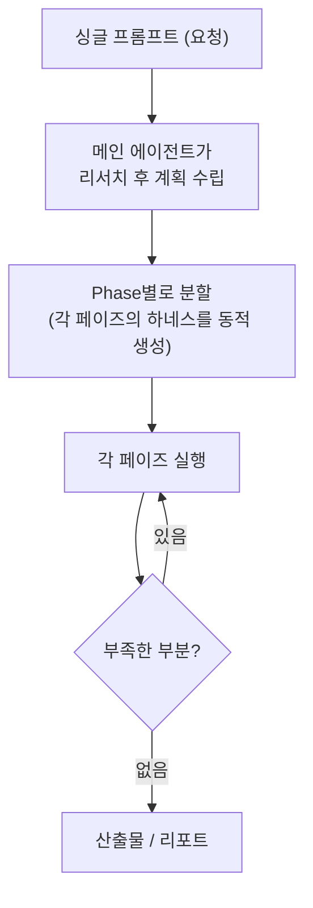
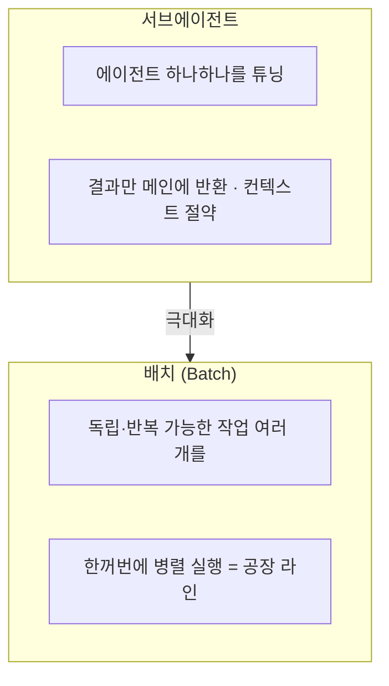
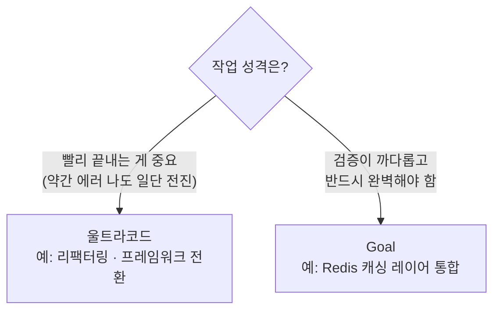

Claude Code를 쓰다 보면 어느 순간 기능이 너무 많아진다. 딥리서치, 울트라코드, 서브에이전트, 배치, Goal… 이름은 들어봤는데 *"그래서 이건 언제 쓰는 건데?"*에서 막힌다. 코드팩토리 영상 하나가 이걸 한 줄에 꿰어줘서, 내 식으로 다시 도식화하며 정리했다.

먼저 전체 스펙트럼부터. 왼쪽에서 오른쪽으로 갈수록 **토큰을 더 먹고, 목표 추종성이 강해진다.**



> **하네스(harness)**란? 모델을 감싸 *일하는 골격*을 만드는 것이다. 같은 모델이라도 "어떤 순서로, 무엇만, 어디까지"라는 틀을 어떻게 짜느냐에 따라 결과가 완전히 달라진다.

## '다이나믹' 워크플로는 뭐가 다른가?

딥리서치와 울트라코드는 헷갈릴 일이 별로 없다 — 하나는 리서치, 하나는 코드 생성이니까. 정작 사람들이 묻는 건 *"이게 다른 병렬 실행 기능들과 뭐가 다르냐"*다.

이름에 '다이나믹'이 붙은 이유부터 짚어야 한다. 보통 하네스를 직접 짜두면 그건 **정적**이다. 계속 사람이 손봐줘야 하고, 그러다 하네스 만지느라 정작 프로젝트를 못 나가기도 한다. 반면 다이나믹 워크플로는 워크플로 자체를 *그때그때* 만들어낸다.



내가 미리 하네스를 정의해둘 필요 없이, 프롬프트 하나만 던지면 거기 맞춰 **워크플로를 통째로 만들어버리는 것** — 그래서 다이나믹이다.

- **딥리서치**: 조사 → 검증 → "더 조사할 게 있나?" → (있으면) 루프 → 리포트. 검색 단계에 에이전트 5개를 병렬로 띄우고, 검증 단계엔 그보다 더 많은 에이전트가 소스를 쪼개 독립 검증한다.
- **울트라코드**: 큰 작업을 받으면 `Foundation → Build → Integrate → Review` 식으로 알아서 쪼개고, 각 페이즈에 에이전트를 몇 개 쓸지까지 설계한다.

> 코드 변경은 컨텍스트가 워낙 중요해서 딥리서치만큼 에이전트를 많이 못 띄운다. 그렇다고 울트라코드가 토큰을 덜 쓰는 건 아니다 — 에이전트 각각이 더 오래 돌아서, 토큰은 여전히 많이 든다.

## 서브에이전트·배치와는 어떻게 다른가?

이 둘을 먼저 깔아둬야 스펙트럼이 잡힌다. 차이는 한 장이면 끝난다.



서브에이전트는 *역할에 맞춰 다듬은 일꾼*이고, 배치는 그 일꾼들을 *공장처럼 동시에 돌리는 것*이다. "버그 1번~100번"처럼 서로 독립적이고 반복적인 작업을 한 번에 병렬로 처리할 때 배치가 빛난다.

## 울트라코드 vs Goal, 뭘 기준으로 고르나?

가장 고민되는 한 쌍이다. 직접 써보고 잡은 기준은 의외로 명확했다.



**기본은 울트라코드.** 빨리 끝내는 데 초점이 있어서, 약간의 에러가 있어도 일단 전환하고 앞으로 나가야 하는 작업(리팩터링, 프레임워크 전환 같은 대공사)에 좋다.

**Goal은 "성공 아니면 죽음" 타입**이다. 턴 제한이 없어 몇 시간~며칠도 돌고, 목표가 *완전히* 달성될 때까지 집착에 가깝게 매달린다. 공식 문서상으로도 일반 채팅에서 흔한 "안 됐는데 됐다고 하고 끝내는" 환각이 줄고, 안 되면 끝까지 스스로 해결하려다 *정말 안 될 때만* 사람을 부른다. Redis 캐싱처럼 검증·완료 조건이 복잡하고 반드시 완벽해야 하는 작업에 맞다.

> 이 "검증 가능한 완료 기준" 발상은 내가 [OpenAI Codex 백서를 정리하며]([[openai-codex-maxxing-long-running-work|단일 프롬프트를 운영 루프로]]) 본 *강한 목표(strong goal)*와 똑같다. 데이터·공시 작업에서 내가 쓰는 "차변=대변 산술 검증"처럼, **'완료'를 코드로 쥐여주면 검증이 추측에서 통과/실패로 바뀐다.**

## Goal·울트라코드는 왜 '메타프롬프팅'이 필수인가?

여기가 제일 실용적인 팁이다. Goal은 턴 제한이 없는 만큼, 프롬프트를 잘못 넣으면 며칠을 삽질한다. 그래서 *무엇을 / 어떤 결과물 / 어떻게 검증 / 완료 조건*을 정확히 명시해야 하는데 — **이걸 손으로 못 쓴다.**

그러니 프롬프트 만드는 일조차 Claude에게 넘긴다.

```text
/goal 로 Next → Svelte 마이그레이션을 진행할 건데,
이 작업에 맞는 goal 프롬프트를 만들어서 나한테 보여줘
```

이렇게 *"너한테 먹일 프롬프트를 네가 만들어줘"*라고 시키면, 작업 원칙·수행 단계·완료 기준이 정확히 박힌 프롬프트가 나온다. Claude는 'goal'이 무엇인지 이미 알고 있으니까. 울트라코드도 마찬가지다.

## 그래서 처음엔 어떻게 시작하나?

처음 쓴다면 **일반 채팅에서 시작해 위로 올라가면 된다.** 기본 작업은 울트라코드, 검증이 힘들고 완벽이 필요하면 Goal — 이 감각만 잡으면 충분하다. 작업 난이도를 몸으로 아는 사람이면 "이건 뭘 써야겠다"가 생각보다 금방 온다.

내가 한 줄로 외우는 정리는 이렇다. **딥리서치는 조사를 끝까지, 울트라코드는 빠르게 목적까지, Goal은 될 때까지.**

> 같이 보면 좋은 글: [[openai-codex-maxxing-long-running-work|Codex-maxxing 백서 뜯어보기]] · [[loop-vs-harness-vs-ralph-when-to-use|루프·하네스·랄프, 언제 써야 하나]]

---

*이 글은 코드팩토리 채널의 [Claude Code Dynamic Workflow Feature Comparison](https://www.youtube.com/watch?v=9fx2_1aTzq8) 영상을 보고 내 관점에서 다시 도식화·정리한 것입니다. 기능은 Claude Code 업데이트로 달라질 수 있습니다.*
