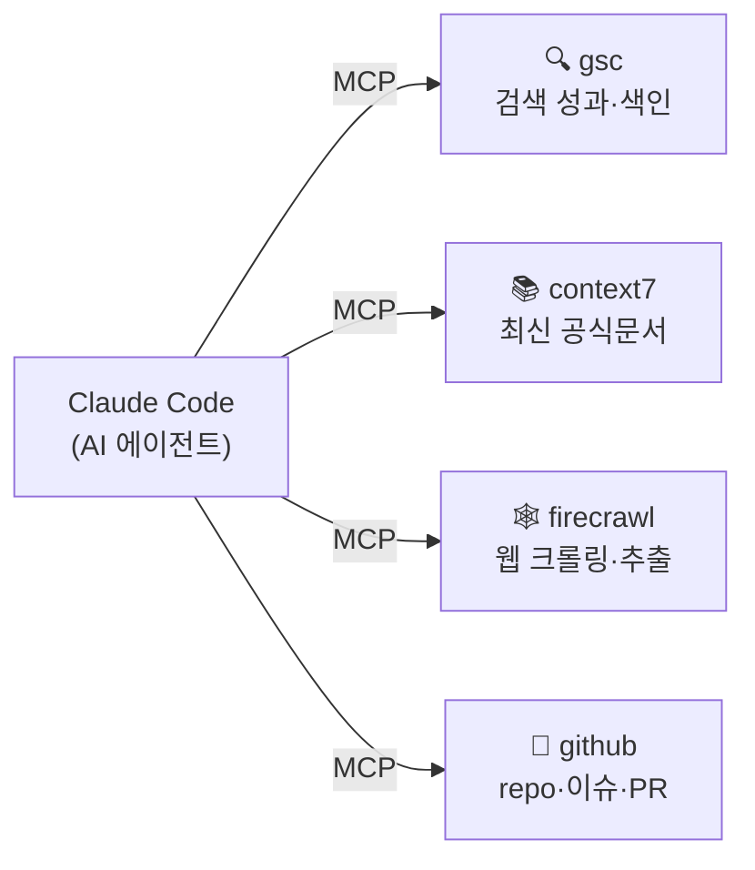
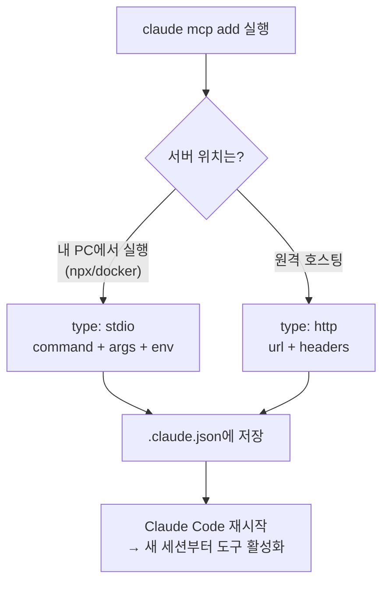
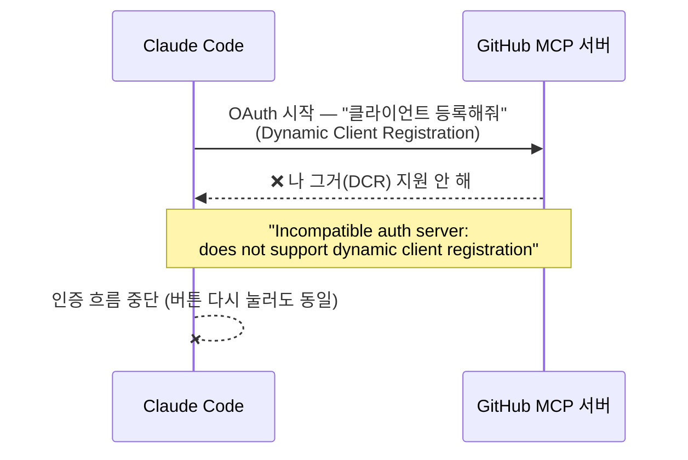
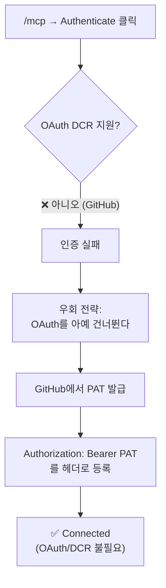
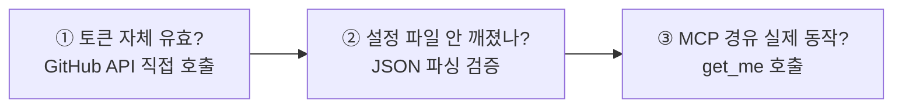
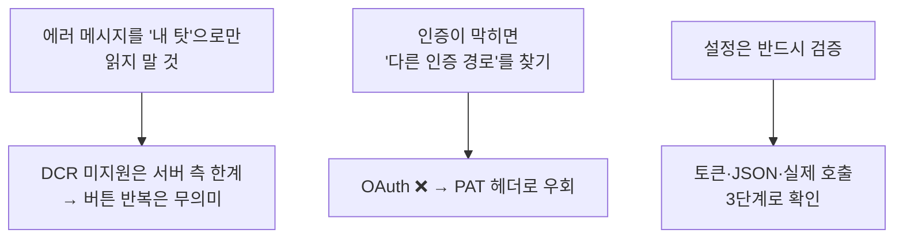

AI 코딩 에이전트(Claude Code)를 쓰다 보면 어느 순간 답답해진다. **에이전트는 똑똑한데, 손이 없다.** 내 검색 성과 데이터도 못 보고, 라이브러리 최신 문서도 모르고(학습 시점 이후 바뀐 건 더더욱), 웹도 직접 못 긁고, 내 GitHub 저장소에도 손을 못 댄다.

그래서 **MCP 서버 4개**를 붙였다. 붙이는 것 자체는 명령어 한 줄이라 쉬웠는데, **GitHub 하나가 끝까지 안 붙어서** 한참 헤맸다. `Authenticate` 버튼을 아무리 눌러도 `does not support dynamic client registration`이라는 알 수 없는 에러만 떴다. 결론부터 말하면 **이건 버튼을 다시 눌러서 풀리는 문제가 아니었다.** 그 우회법까지 이 글에 정리한다.

## 전체 그림 — 에이전트에게 손 4개를 달아주는 일

먼저 큰 그림. MCP로 붙인 서버 하나하나가 에이전트의 "손"이 된다.



> **MCP(Model Context Protocol)** 란? AI에게 **외부 도구를 꽂는 표준 규격**이다. 비유하면 **USB 포트**다. 예전엔 도구마다 따로 연동 코드를 짜야 했는데, MCP라는 공통 규격이 생기면서 "USB 꽂듯" 서버를 붙이면 에이전트가 그 도구를 바로 쓸 수 있게 됐다. 위 4개는 각각 다른 USB 기기인 셈.

## MCP 서버, 어떤 걸 왜 붙였나?

도구는 많지만 **내가 실제로 반복하는 일**에 맞춰 4개만 골랐다. (안 붙인 것도 있다 — 이미 Claude Code 기본 파일 도구와 겹치는 Filesystem, 이미 코드로 자동화하는 내겐 불필요한 노코드 플랫폼 등은 뺐다.)

| 서버 | 하는 일 | 내가 쓰는 이유 |
|---|---|---|
| 🔍 **gsc** | Google Search Console 조회·사이트맵 제출·URL 검사 | 내 블로그 검색 노출/유입을 에이전트가 직접 보고 SEO 작업 |
| 📚 **context7** | 라이브러리/프레임워크 **최신** 공식 문서 주입 | 학습 시점 이후 바뀐 API를 환각 없이 정확히 |
| 🕸️ **firecrawl** | 웹 검색·스크래핑·크롤링·추출 | 경쟁사/기업 정보 수집, 자료 팩트체크 |
| 🐙 **github** | 저장소·이슈·PR·코드 검색·파일 커밋 | 내 repo 관리·코드 검색을 채팅에서 바로 |

## MCP 서버는 어떻게 붙이나?

붙이는 방법은 크게 두 갈래다. **로컬에서 프로세스로 띄우는 `stdio`** 와 **원격 서버에 HTTP로 붙는 `http`**.



> ⚠️ 핵심 함정 하나: **추가 직후 현재 세션엔 안 뜬다.** MCP 서버는 세션 시작 시점에 로드되기 때문에, 추가한 뒤엔 **반드시 재시작(새 세션)** 해야 도구가 보인다. 나는 이걸 몰라서 "분명 추가했는데 왜 안 보이지?"로 또 한참 헤맸다.

실제로 내가 붙인 명령들은 이런 식이었다. (키는 전부 플레이스홀더 — **실제 키를 명령에 박아 공유하면 그대로 유출**이다.)

```bash
# 📚 context7 — 키리스(무료). 로컬 stdio
claude mcp add --scope user context7 -- npx -y @upstash/context7-mcp@latest

# 🕸️ firecrawl — API 키 필요. 로컬 stdio + env
claude mcp add --scope user firecrawl -e FIRECRAWL_API_KEY=fc-여러분의_키 -- npx -y firecrawl-mcp

# 🔍 gsc — 서비스계정 JSON으로 인증. 로컬 stdio + env
claude mcp add --scope user gsc \
  -e GSC_KEY_FILE=path/to/service-account.json \
  -e GSC_SITE_URL=https://example.com/ \
  -- npx -y suganthan-gsc-mcp
```

여기까지 셋(context7·firecrawl·gsc)은 깔끔하게 붙었다. **문제는 GitHub였다.**

## GitHub MCP는 왜 `Authenticate`를 눌러도 안 됐나?

GitHub는 원격 MCP 서버(`https://api.githubcopilot.com/mcp/`)라 `http` 타입으로 등록했다. 처음엔 헤더 없이 이렇게만 넣었다.

```json
"github": {
  "type": "http",
  "url": "https://api.githubcopilot.com/mcp/"
}
```

그러면 Claude Code가 `/mcp` 메뉴에서 **OAuth로 인증**하려 한다. 그런데 `Authenticate`를 누르면 브라우저가 열리는 게 아니라 이 에러가 떴다.

```
SDK auth failed: Incompatible auth server:
does not support dynamic client registration
```

처음엔 "내 설정이 틀렸나? 토큰을 안 넣어서 그런가?" 싶어 버튼만 계속 눌렀다. 그런데 원인은 **내 쪽이 아니라 GitHub 서버 쪽**에 있었다.



> **DCR(동적 클라이언트 등록)** 이란? OAuth에서 **앱이 인증 서버에 "나 이런 클라이언트야"라고 자동으로 자기를 등록하는** 절차다. Claude Code의 OAuth 흐름은 이 자동 등록에 의존하는데, **GitHub의 원격 MCP 엔드포인트가 이 DCR을 지원하지 않는다.** 그래서 첫 단추(클라이언트 등록)부터 못 끼우고 죽는 것. **버튼 문제가 아니라 프로토콜 비호환**이다.

## 그럼 어떻게 뚫었나? — OAuth를 건너뛰고 PAT를 헤더로

해결의 핵심은 단순했다. **OAuth 흐름 자체를 안 타면 된다.** GitHub는 OAuth 말고도 **개인 액세스 토큰(PAT)을 `Authorization` 헤더에 직접 넣는** 인증을 지원한다. 헤더에 토큰이 이미 들어가 있으면 서버는 OAuth/DCR을 요구하지 않는다.



**1) GitHub에서 PAT 발급.** Fine-grained 토큰(`github_pat_...`)을 권장한다 — 접근 범위와 만료를 좁게 잡을 수 있어 더 안전하다.

- Fine-grained: `Metadata: Read`(필수) + `Contents`·`Pull requests`·`Issues`를 필요한 만큼
- (Classic 토큰이면 `repo` 스코프 하나로도 동작)

**2) 기존 github 설정을 PAT 헤더 버전으로 교체.** OAuth를 우회하는 핵심 한 줄이다.

```bash
claude mcp remove github -s user

claude mcp add --transport http --scope user github \
  https://api.githubcopilot.com/mcp/ \
  --header "Authorization: Bearer <YOUR_GITHUB_PAT>"
```

`.claude.json`에는 이렇게 저장된다. (헤더가 있으면 OAuth 흐름을 통째로 건너뛴다.)

```json
"github": {
  "type": "http",
  "url": "https://api.githubcopilot.com/mcp/",
  "headers": {
    "Authorization": "Bearer <YOUR_GITHUB_PAT>"
  }
}
```

## 정말 연결됐는지는 어떻게 확인하나?

설정은 눈으로만 믿으면 안 된다. 나는 **세 단계로 검증**했다.



**① 토큰이 살아있나** — MCP를 거치기 전에 토큰만 따로 GitHub API에 찔러본다.

```bash
curl -s -o /dev/null -w "HTTP %{http_code}\n" \
  -H "Authorization: Bearer <YOUR_GITHUB_PAT>" \
  https://api.github.com/user
# → HTTP 200 이면 토큰 유효
```

**② 설정 파일이 안 깨졌나** — `.claude.json`은 한 글자만 틀려도 Claude Code 전체가 안 뜬다. 그래서 편집 후엔 꼭 파싱 검증을 한다.

> 윈도우에서 한 가지 함정: PowerShell의 `ConvertFrom-Json`이 큰 `.claude.json`에서 엉뚱한 에러를 뱉을 때가 있다(중복 키에 취약). **실제 파일이 깨진 게 아니라 그 파서의 한계**다. Claude Code와 같은 Node 파서로 검증하면 정확하다.

```bash
node -e "JSON.parse(require('fs').readFileSync('.claude.json','utf8')); console.log('JSON OK')"
```

**③ MCP를 거쳐 실제로 동작하나** — 마지막은 에이전트가 GitHub 도구를 진짜 호출해보는 것. 연결 상태는 CLI로, 동작은 `get_me`(내 프로필 조회)로 확인했다.

```bash
claude mcp get github
#  Status: ✔ Connected   ← 이게 떠야 성공
```

`get_me`가 내 계정 정보(로그인명·공개 repo 수 등)를 정확히 돌려주면 **끝까지(에이전트 → MCP → GitHub API) 살아있다는** 뜻이다.

## 삽질하며 배운 것

이번 건의 교훈은 세 가지로 압축된다.



- **에러를 곧이곧대로**. `does not support dynamic client registration`은 "네가 뭘 잘못했다"가 아니라 "이 서버는 그 방식을 안 받는다"는 **사실 통보**였다. 주어가 누구인지 보면 헤맬 시간이 준다.
- **인증은 보통 길이 여러 개**다. OAuth가 막히면 PAT·토큰 헤더·로컬 Docker 같은 우회로가 거의 항상 있다. (실제로 GitHub MCP는 `ghcr.io/github/github-mcp-server`를 Docker로 띄우는 로컬 방식도 된다.)
- **보안은 마지막에 꼭**. 토큰을 어딘가(채팅·명령 히스토리·캡처)에 노출했다면 **유출로 간주하고 폐기·재발급**하는 게 맞다. 키는 항상 `.claude.json`처럼 **저장소 밖** 설정에만 두고 절대 커밋하지 않는다. 글·예시엔 언제나 `YOUR_API_KEY`·플레이스홀더만.

MCP는 결국 **에이전트에게 권한과 도구를 쥐여주는 일**이라, 편의와 보안이 정확히 맞물린다. "쉽게 붙는다"와 "함부로 붙이면 안 된다"가 같은 동전의 양면이라는 걸, GitHub 하나 붙이느라 다시 새겼다.

---

> 같이 보면 좋은 글: [[build-tech-blog-with-quartz-github-pages|GitHub Pages + Quartz로 기술 블로그 만든 기록]] · [[plaintext-md-llm-knowledge-vault|벡터DB 없이 만든 평문 MD 지식볼트]] · 내 소개는 [[about]].

*위 설정·에러·우회는 전부 실제 작업 그대로이며, 키·토큰은 모두 플레이스홀더로 바꿨습니다. Claude Code/GitHub MCP의 OAuth(DCR) 지원 여부는 추후 바뀔 수 있어요.*
